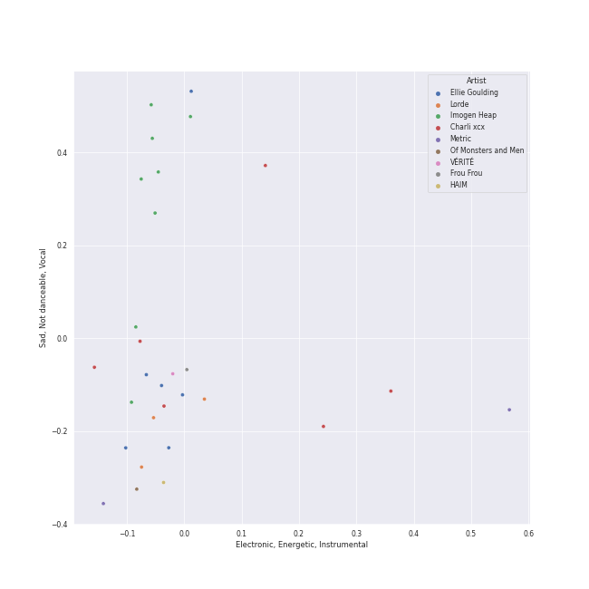
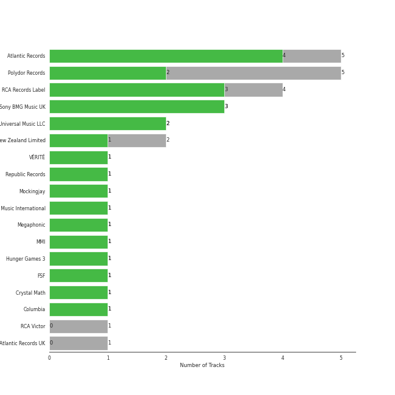
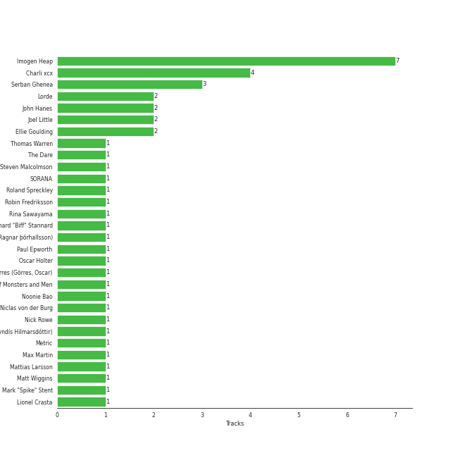
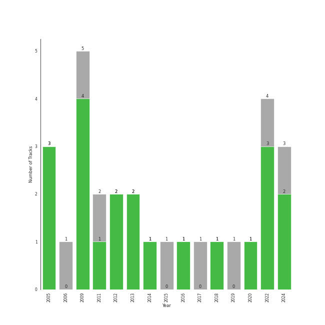

# metropopolis

29 songs

[See Track Features](audio_features.md)

[See Clusters](clusters/overview.md)

## Top Artists

| Art | Rank | Tracks | 💚 | Artist | 🔗 |
|:---|---:|---:|---:|:---|:---|
|  | 427 | 9 | 7 | [Imogen Heap](../../artists/imogen_heap/overview.md) | [🔗](https://open.spotify.com/artist/6Xb4ezwoAQC4516kI89nWz) |
|  | 313 | 6 | 4 | Charli xcx | [🔗](https://open.spotify.com/artist/25uiPmTg16RbhZWAqwLBy5) |
|  | 427 | 6 | 3 | Ellie Goulding | [🔗](https://open.spotify.com/artist/0X2BH1fck6amBIoJhDVmmJ) |
|  | 208 | 3 | 2 | Lorde | [🔗](https://open.spotify.com/artist/163tK9Wjr9P9DmM0AVK7lm) |
|  | 173 | 2 | 2 | Metric | [🔗](https://open.spotify.com/artist/1rCIEwPp5OnXW0ornlSsRl) |
|  | 427 | 2 | 1 | Rina Sawayama | [🔗](https://open.spotify.com/artist/2KEqzdPS7M5YwGmiuPTdr5) |
|  | 44 | 1 | 1 | [Billie Eilish](../../artists/billie_eilish/overview.md) | [🔗](https://open.spotify.com/artist/6qqNVTkY8uBg9cP3Jd7DAH) |
|  | 427 | 1 | 1 | Frou Frou | [🔗](https://open.spotify.com/artist/6MUyqmIQ35inLjch0YzIEG) |
|  | 350 | 1 | 1 | Lauv | [🔗](https://open.spotify.com/artist/5JZ7CnR6gTvEMKX4g70Amv) |
|  | 427 | 1 | 1 | Of Monsters and Men | [🔗](https://open.spotify.com/artist/4dwdTW1Lfiq0cM8nBAqIIz) |

See all 17 artists

| Art | Rank | Tracks | 💚 | Artist | 🔗 |
|:---|---:|---:|---:|:---|:---|
|  | 386 | 1 | 1 | HAIM | [🔗](https://open.spotify.com/artist/4Ui2kfOqGujY81UcPrb5KE) |
|  | 427 | 1 | 1 | VÉRITÉ | [🔗](https://open.spotify.com/artist/1Fr6agZ6iSM5Ynn2k4C8sc) |
|  | 427 | 1 | 1 | Guy Sigsworth | [🔗](https://open.spotify.com/artist/0uQWT7X0I9Y7zM7WWexpAj) |
|  | 427 | 1 | 0 | Diplo | [🔗](https://open.spotify.com/artist/5fMUXHkw8R8eOP2RNVYEZX) |
|  | 276 | 1 | 0 | A. G. Cook | [🔗](https://open.spotify.com/artist/335TWGWGFan4vaacJzSiU8) |
|  | 427 | 1 | 0 | VERNON | [🔗](https://open.spotify.com/artist/2Y34b9AOK30zXgL7cAH4NG) |
|  | 2 | 1 | 0 | [Red Velvet](../../artists/red_velvet/overview.md) | [🔗](https://open.spotify.com/artist/1z4g3DjTBBZKhvAroFlhOM) |

## Most and least listened tracks
| Rank | ​ | Most listened tracks | Rank | ​​ | Least listened tracks |
|---:|:---|:---|---:|:---|:---|
| 508 |  | Green Light | 957 |  | [Hide and Seek](../../artists/imogen_heap/overview.md) |
| 856 |  | Good Ones | 957 |  | Something In The Way You Move |
| 957 |  | Love Me Like You Do | 957 |  | The Wire |
| 957 |  | Yellow Flicker Beat | 957 |  | Close To Me - Red Velvet Remix |
| 957 |  | [Goodnight and Go](../../artists/imogen_heap/overview.md) | 957 |  | Slow Grenade |
| 957 |  | Beg for You (feat. Rina Sawayama) | 957 |  | Lost Kitten |
| 957 |  | Gimme Sympathy | 957 |  | Lights - Single Version |
| 957 |  | Royals | 957 |  | [Speeding Cars](../../artists/imogen_heap/overview.md) |
| 957 |  | Little Talks | 957 |  | 365 |
| 957 |  | Somebody Else | 957 |  | Your Song |

## Top Albums

| Art | Rank | Tracks | 💚 | Album | Release Date | 🔗 |
|:---|---:|---:|---:|:---|:---|:---|
|  | 633 | 4 | 3 | Ellipse | 2009-08-25 | [🔗](https://open.spotify.com/album/5AYKGPzPBJNHeKehCxMaq0) |
|  | 633 | 3 | 3 | Speak for Yourself | 2005-07-18 | [🔗](https://open.spotify.com/album/0t0Cr8jA63wlm8nWj7qfvJ) |
|  | 569 | 2 | 2 | CRASH | 2022-03-18 | [🔗](https://open.spotify.com/album/1QqipMXWzJhr6yfcNKTp8B) |
|  | 633 | 2 | 1 | Lights | 2011-01-01 | [🔗](https://open.spotify.com/album/3duZhvcaoqdNveQYXf9dMV) |
|  | 633 | 2 | 1 | BRAT | 2024-06-07 | [🔗](https://open.spotify.com/album/2lIZef4lzdvZkiiCzvPKj7) |
|  | 633 | 1 | 1 | Yellow Flicker Beat (From The Hunger Games: Mockingjay Part 1) | 2014-09-30 | [🔗](https://open.spotify.com/album/7sg5iqMiDrM2aJqLAmv83V) |
|  | 633 | 1 | 1 | Synthetica (Deluxe Edition) | 2012-01-01 | [🔗](https://open.spotify.com/album/2xbkLrXys1oVlp5fgTgwSJ) |
|  | 633 | 1 | 1 | Somebody Else | 2016-09-09 | [🔗](https://open.spotify.com/album/3Q4yhhyFA2cpZq2FGOgMwU) |
|  | 633 | 1 | 1 | Slow Grenade | 2020-06-30 | [🔗](https://open.spotify.com/album/15Zgvxqql6EPHE3NJlUt0R) |
|  | 633 | 1 | 1 | Pure Heroine | 2013-09-27 | [🔗](https://open.spotify.com/album/0rmhjUgoVa17LZuS8xWQ3v) |

See all 21 albums

| Art | Rank | Tracks | 💚 | Album | Release Date | 🔗 |
|:---|---:|---:|---:|:---|:---|:---|
|  | 633 | 1 | 1 | My Head Is An Animal | 2012-01-01 | [🔗](https://open.spotify.com/album/4p9dVvZDaZliSjTCbFRhJy) |
|  | 633 | 1 | 1 | Guess featuring Billie Eilish | 2024-08-01 | [🔗](https://open.spotify.com/album/3ThlxfLSy4bfKzxWqmC7VN) |
|  | 633 | 1 | 1 | Fifty Shades Freed - Original Motion Picture Soundtrack | 2018-02-09 | [🔗](https://open.spotify.com/album/4w0N1CaZwQ5RPIuawqlYyy) |
|  | 633 | 1 | 1 | Fantasies | 2009-04-14 | [🔗](https://open.spotify.com/album/3Oj8FdHcV6kAiOVWfkqRaA) |
|  | 633 | 1 | 1 | Days Are Gone | 2013-09-30 | [🔗](https://open.spotify.com/album/729Vh0HApsm7hGDVjbmtrf) |
|  | 633 | 1 | 1 | A New Kind Of Love (Demo) | 2022-04-08 | [🔗](https://open.spotify.com/album/484SKRaXGq7m9VV0rmSyeb) |
|  | 353 | 1 | 0 | Melodrama | 2017-06-16 | [🔗](https://open.spotify.com/album/2B87zXm9bOWvAJdkJBTpzF) |
|  | 633 | 1 | 0 | Goodnight And Go | 2006-05-02 | [🔗](https://open.spotify.com/album/3JYjYjUAoBjxXr1W8eDVLV) |
|  | 633 | 1 | 0 | Delirium | 2015-11-13 | [🔗](https://open.spotify.com/album/4A43DyDoAVa1Fb8pq6Yejl) |
|  | 633 | 1 | 0 | Close To Me (Red Velvet Remix) | 2019-04-05 | [🔗](https://open.spotify.com/album/7dg5iqyFYqRQH7vtAG9VNf) |
|  | 633 | 1 | 0 | Beg For You (A. G. Cook & VERNON OF SEVENTEEN Remix) [feat. Rina Sawayama] | 2022-02-25 | [🔗](https://open.spotify.com/album/6snPKZGUbpydW2XJu9ievq) |

## Top Record Labels

| Tracks | 💚 | Label |
|---:|---:|:---|
| 5 | 4 | [Atlantic Records](../../labels/atlantic_records/overview.md) |
| 4 | 3 | [RCA Records Label](../../labels/rca_records_label/overview.md) |
| 3 | 3 | Sony BMG Music UK |
| 5 | 2 | [Polydor Records](../../labels/polydor_records/overview.md) |
| 2 | 2 | [Universal Music LLC](../../labels/universal_music_llc/overview.md) |
| 2 | 1 | Universal Music New Zealand Limited |
| 1 | 1 | VÉRITÉ |
| 1 | 1 | [Republic Records](../../labels/republic_records/overview.md) |
| 1 | 1 | Mockingjay |
| 1 | 1 | Metric Music International |

See all 18 labels

| Tracks | 💚 | Label |
|---:|---:|:---|
| 1 | 1 | Megaphonic |
| 1 | 1 | MMI |
| 1 | 1 | Hunger Games 3 |
| 1 | 1 | FSF |
| 1 | 1 | Crystal Math |
| 1 | 1 | [Columbia](../../labels/columbia/overview.md) |
| 1 | 0 | RCA Victor |
| 1 | 0 | Atlantic Records UK |

## Top Producers

| Art | Producer | Tracks | Credit Types |
|:---|:---|---:|:---|
|  | [Imogen Heap](../../artists/imogen_heap/overview.md) | 7 | Songwriter, Lyricist, Producer |
|  | Charli xcx | 4 | Songwriter, Lyricist |
| | [Serban Ghenea](../../producers/serban_ghenea/overview.md) | 3 | Producer |
| | [John Hanes](../../producers/john_hanes/overview.md) | 2 | Producer |
|  | Lorde | 2 | Songwriter |
|  | Ellie Goulding | 2 | Songwriter |
| | Joel Little | 2 | Producer, Songwriter |
| | Este Haim | 1 | Producer, Songwriter |
| | Kevin Grainger | 1 | Producer |
| | Matt Wiggins | 1 | Producer |

View all

| Art | Producer | Tracks | Credit Types |
|:---|:---|---:|:---|
| | Ben Hogarth | 1 | Producer |
|  | Of Monsters and Men | 1 | Producer |
| | The Dare | 1 | Producer, Songwriter |
| | Jason Elliott | 1 | Producer |
| | Oscar Görres (Görres, Oscar) | 1 | Producer, Songwriter |
| | Lionel Crasta | 1 | Producer |
| | Richard "Biff" Stannard | 1 | Producer, Songwriter |
|  | A. G. Cook | 1 | Producer, Songwriter |
| | John O'Mahony | 1 | Producer |
| | Andrew Watt | 1 | Songwriter |
|  | Lauv | 1 | Songwriter |
| | Jon Taylor | 1 | Producer |
| | Ash Howes | 1 | Producer, Songwriter |
| | Alexander Soifer | 1 | Producer, Songwriter |
| | Ragnar þórhallsson (Ragnar þórhallsson) | 1 | Songwriter |
| | Oscar Holter | 1 | Producer, Songwriter |
| | Anoo Bhagavan | 1 | Songwriter |
| | Thomas Warren | 1 | Producer |
| | Danielle Haim | 1 | Producer, Songwriter |
| | Noonie Bao | 1 | Songwriter |
| | David Schiffman | 1 | Producer |
| | Craig Silvey | 1 | Producer |
| | Digital Farm Animals | 1 | Producer, Songwriter |
| | Nanna Bryndís Hilmarsdóttir (Nanna Bryndís Hilmarsdóttir) | 1 | Songwriter |
|  | Guy Sigsworth | 1 | Producer, Songwriter |
| | Antonio Tucci Jr. | 1 | Producer |
| | Ali Tamposi | 1 | Songwriter |
| | Mattias Larsson | 1 | Songwriter |
| | Leland | 1 | Songwriter |
| | David Buckley | 1 | Arranger |
| | [Cirkut](../../producers/cirkut/overview.md) | 1 | Producer, Songwriter |
| | Ali Payami | 1 | Producer, Songwriter |
| | Aron Arnarsson | 1 | Producer |
| | Niclas von der Burg | 1 | Songwriter |
| | [Mark "Spike" Stent](../../producers/mark__spike__stent/overview.md) | 1 | Producer |
| | [FINNEAS](../../producers/finneas/overview.md) | 1 | Producer, Songwriter |
| | Idania Valencia | 1 | Producer |
| | Roland Spreckley | 1 | Songwriter |
| | Robin Fredriksson | 1 | Songwriter |
| | Joe Kearns | 1 | Producer, Songwriter |
| | Nick Rowe | 1 | Producer |
| | Dylan Brady | 1 | Songwriter |
| | SORANA | 1 | Songwriter |
| | Alana Haim | 1 | Producer, Songwriter |
| | Jonas von der Burg | 1 | Songwriter |
|  | Metric | 1 | Songwriter |
| | Steven Malcolmson | 1 | Producer |
| | Jonathan Gilmore | 1 | Producer |
|  | Rina Sawayama | 1 | Songwriter |
| | Ariel Rechtshaid | 1 | Producer |
| | Damian Taylor | 1 | Producer |
| | Caroline Ailin | 1 | Songwriter |
| | [Paul Epworth](../../producers/paul_epworth/overview.md) | 1 | Producer |
| | [Max Martin](../../producers/max_martin/overview.md) | 1 | Producer |
|  | [Billie Eilish](../../artists/billie_eilish/overview.md) | 1 | Songwriter |

## Years

| ​ | 10 newest albums | ​​ | 10 oldest albums |
|:---|:---|:---|:---|
|  | Guess featuring Billie Eilish (2024-08-01) |  | Speak for Yourself (2005-07-18) |
|  | BRAT (2024-06-07) |  | Goodnight And Go (2006-05-02) |
|  | A New Kind Of Love (Demo) (2022-04-08) |  | Fantasies (2009-04-14) |
|  | CRASH (2022-03-18) |  | Ellipse (2009-08-25) |
|  | Beg For You (A. G. Cook & VERNON OF SEVENTEEN Remix) [feat. Rina Sawayama] (2022-02-25) |  | Lights (2011-01-01) |
|  | Slow Grenade (2020-06-30) |  | My Head Is An Animal (2012-01-01) |
|  | Close To Me (Red Velvet Remix) (2019-04-05) |  | Synthetica (Deluxe Edition) (2012-01-01) |
|  | Fifty Shades Freed - Original Motion Picture Soundtrack (2018-02-09) |  | Pure Heroine (2013-09-27) |
|  | Melodrama (2017-06-16) |  | Days Are Gone (2013-09-30) |
|  | Somebody Else (2016-09-09) |  | Yellow Flicker Beat (From The Hunger Games: Mockingjay Part 1) (2014-09-30) |

