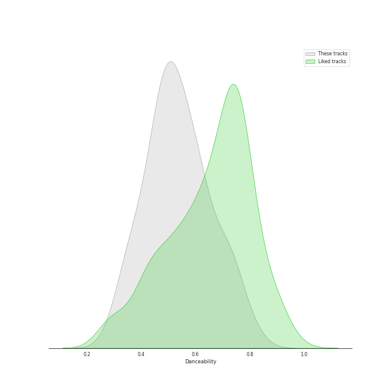
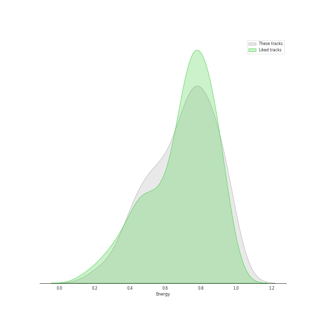
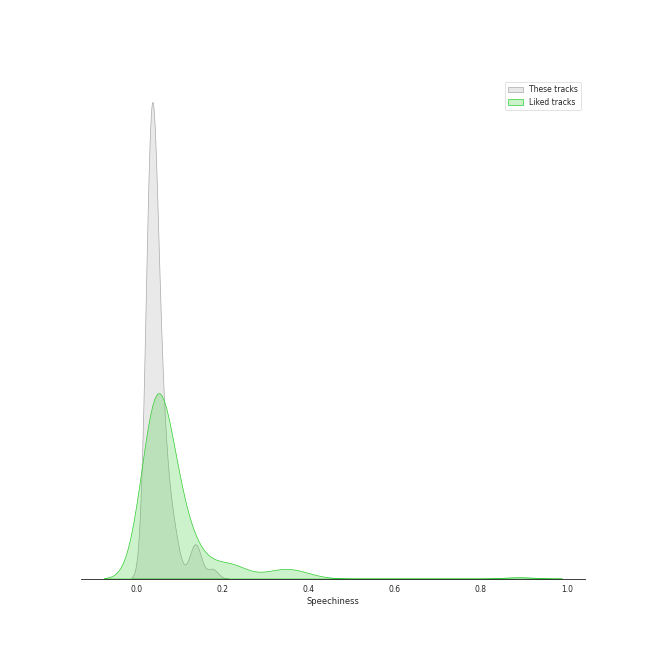
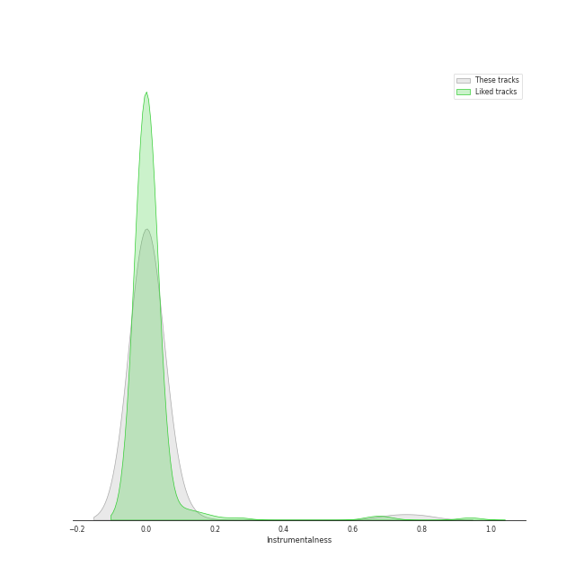
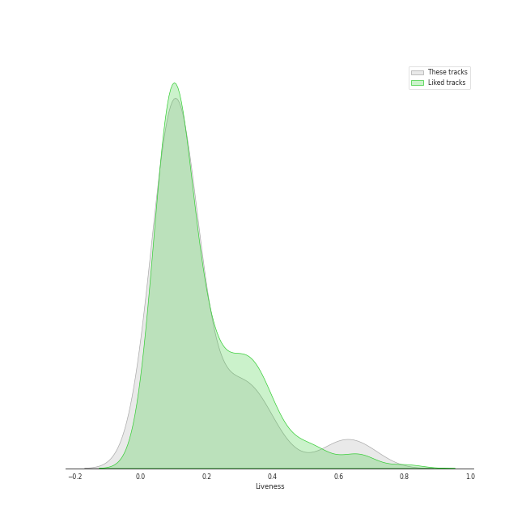
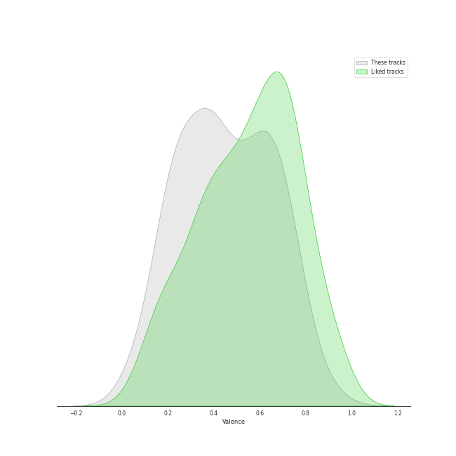
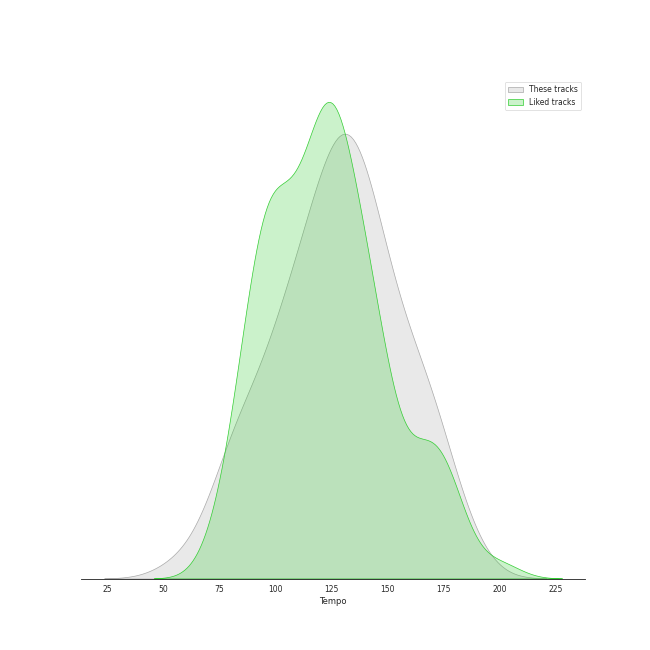

# Track Features for modern rock

## Danceability

| ​ | 10 most Danceable tracks | ​​ | 10 least Danceable tracks |
|:---|:---|:---|:---|
|  | Feel Good Inc. (0.818) |  | Mykonos (0.3) |
|  | Believer (0.776) |  | What Kind Of Man (0.313) |
|  | Heat Waves (0.761) |  | Feeling Good (0.345) |
|  | Running Out Of Time (0.736) |  | Mr. Brightside (0.352) |
|  | Stressed Out (0.734) |  | Seven Devils (0.363) |
|  | Heathens (0.732) |  | Best of You (0.366) |
|  | Hunger (0.729) |  | Knights of Cydonia (0.366) |
|  | Gives You Hell (0.718) |  | Kiss With A Fist (0.367) |
|  | Tessellate (0.702) |  | How Big, How Blue, How Beautiful (0.372) |
|  | Young Folks (0.699) |  | American Idiot (0.38) |

## Energy

| ​ | 10 most Energetic tracks | ​​ | 10 least Energetic tracks |
|:---|:---|:---|:---|
|  | American Idiot (0.988) |  | I Will Follow You into the Dark (0.206) |
|  | Knights of Cydonia (0.963) |  | Timshel (0.265) |
|  | We Didn’t Start The Fire (Bonus Track) (0.961) |  | The Other Side Of Paradise (0.338) |
|  | The Pretender (0.959) |  | Work Song (0.363) |
|  | Dirty Little Secret (0.954) |  | Heathens (0.396) |
|  | Best of You (0.94) |  | Between Two Lungs (0.413) |
|  | Everybody Talks (0.924) |  | Madness (0.417) |
|  | Still into You (0.923) |  | Feeling Good (0.418) |
|  | Supermassive Black Hole (0.921) |  | Good Riddance (Time of Your Life) (0.432) |
|  | Learn to Fly (0.919) |  | What Sarah Said (0.439) |

## Speechiness

| ​ | 10 most Speechy tracks | ​​ | 10 least Speechy tracks |
|:---|:---|:---|:---|
|  | Feel Good Inc. (0.177) |  | White Winter Hymnal (0.0268) |
|  | Knights of Cydonia (0.142) |  | What Sarah Said (0.0268) |
|  | Stressed Out (0.141) |  | Little Lion Man (0.0272) |
|  | Kiss With A Fist (0.137) |  | The Only Exception (0.0272) |
|  | Believer (0.128) |  | Chasing Cars (0.0274) |
|  | Heat Waves (0.0944) |  | Heathens (0.0286) |
|  | Ain't It Fun (0.0921) |  | The Great Unknown (0.0287) |
|  | Dog Days Are Over (0.0847) |  | Boulevard of Broken Dreams (0.0294) |
|  | Sugar, We're Goin Down (0.0843) |  | Someday (0.0299) |
|  | Mr. Brightside (0.0747) |  | Can I Believe You (0.03) |

## Acousticness

| ​ | 10 most Acoustic tracks | ​​ | 10 least Acoustic tracks |
|:---|:---|:---|:---|
|  | I Will Follow You into the Dark (0.924) |  | Learn to Fly (1.83e-05) |
|  | Timshel (0.856) |  | American Idiot (2.64e-05) |
|  | What Sarah Said (0.801) |  | Everlong (5.99e-05) |
|  | Work Song (0.749) |  | That's What You Get (9.43e-05) |
|  | Take Me to Church (0.634) |  | Knights of Cydonia (0.000273) |
|  | How Big, How Blue, How Beautiful (0.605) |  | Dirty Little Secret (0.000346) |
|  | Hunger (0.53) |  | Reptilia (0.000603) |
|  | White Winter Hymnal (0.44) |  | Best of You (0.000769) |
|  | Heat Waves (0.44) |  | The Pretender (0.000917) |
|  | Mykonos (0.395) |  | Mr. Brightside (0.00121) |

## Instrumentalness

| ​ | 10 most Instrumental tracks | ​​ | 10 least Instrumental tracks |
|:---|:---|:---|:---|
|  | Animals (0.796) |  | Mr. Brightside (0.0) |
|  | Reptilia (0.713) |  | White Winter Hymnal (0.0) |
|  | The Adults Are Talking (0.106) |  | Believer (0.0) |
|  | Can I Believe You (0.0664) |  | Take Me to Church (0.0) |
|  | Tessellate (0.0271) |  | That's What You Get (0.0) |
|  | What Sarah Said (0.0217) |  | Still into You (0.0) |
|  | Sweater Weather (0.0177) |  | Sugar, We're Goin Down (0.0) |
|  | Knights of Cydonia (0.0122) |  | Ride (0.0) |
|  | I Will Wait (0.00717) |  | What Kind Of Man (0.0) |
|  | Supermassive Black Hole (0.00517) |  | Everybody Talks (0.0) |

## Liveness

| ​ | 10 most Live tracks | ​​ | 10 least Live tracks |
|:---|:---|:---|:---|
|  | Animals (0.696) |  | Ain't It Fun (0.021) |
|  | Radioactive (0.668) |  | The Pretender (0.028) |
|  | Feel Good Inc. (0.613) |  | Seven Devils (0.0477) |
|  | All The Small Things (0.612) |  | Still into You (0.0561) |
|  | Dirty Little Secret (0.573) |  | The Middle (0.058) |
|  | No Light, No Light (0.444) |  | Boulevard of Broken Dreams (0.0589) |
|  | Never Let Me Go (0.383) |  | Stressed Out (0.0602) |
|  | American Idiot (0.368) |  | Kiss With A Fist (0.0603) |
|  | Someday (0.367) |  | Gives You Hell (0.0627) |
|  | Lover To Lover (0.347) |  | Heartbreak Feels So Good (0.0637) |

## Valence

| ​ | 10 most Happy tracks | ​​ | 10 least Happy tracks |
|:---|:---|:---|:---|
|  | The Middle (0.903) |  | What Sarah Said (0.0401) |
|  | Supermassive Black Hole (0.782) |  | How Big, How Blue, How Beautiful (0.0825) |
|  | Feel Good Inc. (0.772) |  | Timshel (0.0954) |
|  | Reptilia (0.77) |  | Chasing Cars (0.144) |
|  | American Idiot (0.769) |  | No Light, No Light (0.162) |
|  | Still into You (0.765) |  | What The Water Gave Me (0.183) |
|  | Misery Business (0.731) |  | All These Things That I've Done (0.206) |
|  | Everybody Talks (0.716) |  | Seven Devils (0.208) |
|  | HandClap (0.715) |  | The Only Exception (0.209) |
|  | All The Small Things (0.685) |  | Knights of Cydonia (0.211) |

## Tempo

| ​ | 10 most Fast tracks | ​​ | 10 least Fast tracks |
|:---|:---|:---|:---|
|  | American Idiot (186.113) |  | Seven Devils (58.567) |
|  | Madness (180.301) |  | Ride (74.989) |
|  | The Pretender (172.984) |  | Can I Believe You (77.415) |
|  | Misery Business (172.977) |  | I Will Follow You into the Dark (80.401) |
|  | Animals (169.987) |  | Heat Waves (80.87) |
|  | Stressed Out (169.977) |  | Timshel (82.965) |
|  | Delilah (169.946) |  | Mykonos (82.985) |
|  | Boulevard of Broken Dreams (167.06) |  | Demons (89.929) |
|  | The Adults Are Talking (164.959) |  | Heathens (90.024) |
|  | The Middle (162.152) |  | Heartbreak Feels So Good (91.089) |
