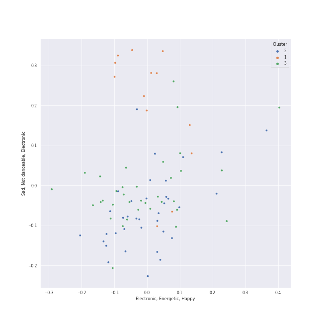

# Clusters in modern rock

## Cluster #1

34 tracks

| Art | Track | Album | Artists | Label | Score | 💚 | 🔗 |
|:---|:---|:---|:---|:---|---:|:---|:---|
|  | Mr. Brightside | Hot Fuss | The Killers | [Island Records](../../../../labels/island_records) | 0 | | [🔗](https://open.spotify.com/track/003vvx7Niy0yvhvHt4a68B) |
|  | Dog Days Are Over | Lungs | [Florence + The Machine](../../../../artists/florence_+_the_machine/overview.md) | [Universal-Island Records Ltd.](../../../../labels/universal-island_records_ltd_) | 0 | 💚 | [🔗](https://open.spotify.com/track/416zj01H28D6uQP43LL6x3) |
|  | Delilah | How Big, How Blue, How Beautiful | [Florence + The Machine](../../../../artists/florence_+_the_machine/overview.md) | [Universal-Island Records Ltd.](../../../../labels/universal-island_records_ltd_) | 0 | 💚 | [🔗](https://open.spotify.com/track/3o9qzsqkT0mvfxcusUaXsN) |
|  | Cough Syrup | Young The Giant (Special Edition) | Young the Giant | Roadrunner Records | 0 | 💚 | [🔗](https://open.spotify.com/track/1UqhkbzB1kuFwt2iy4h29Q) |
|  | Breezeblocks | An Awesome Wave | alt-J | Canvasback/ATL | 0 | 💚 | [🔗](https://open.spotify.com/track/3n69hLUdIsSa1WlRmjMZlW) |
|  | Fitzpleasure | An Awesome Wave | alt-J | Canvasback/ATL | 0 | 💚 | [🔗](https://open.spotify.com/track/7DdXf9x75iEVCHWfoRwRuR) |
|  | Heartbreak Feels So Good | So Much (For) Stardust | Fall Out Boy | [Fueled By Ramen](../../../../labels/fueled_by_ramen) | 0 | 💚 | [🔗](https://open.spotify.com/track/2DIo5VoBB6X1GzgpGbmMIF) |
|  | Everlong | The Colour And The Shape | Foo Fighters | [RCA Records Label](../../../../labels/rca_records_label) | 0 | | [🔗](https://open.spotify.com/track/5UWwZ5lm5PKu6eKsHAGxOk) |
|  | The Pretender | Echoes, Silence, Patience & Grace | Foo Fighters | [RCA Records Label](../../../../labels/rca_records_label) | 0 | | [🔗](https://open.spotify.com/track/7x8dCjCr0x6x2lXKujYD34) |
|  | The Great Unknown | Jukebox The Ghost | Jukebox The Ghost | Cherrytree Records/Kierszenbaum | 0 | | [🔗](https://open.spotify.com/track/6xBUdFmhryjXoxn8KkTNr4) |
## Cluster #2

36 tracks

| Art | Track | Album | Artists | Label | Score | 💚 | 🔗 |
|:---|:---|:---|:---|:---|---:|:---|:---|
|  | That's What You Get | Riot! | Paramore | [Fueled By Ramen](../../../../labels/fueled_by_ramen) | 0 | | [🔗](https://open.spotify.com/track/1JdKrFyoU05abww0Zv0ayQ) |
|  | Misery Business | Riot! | Paramore | [Fueled By Ramen](../../../../labels/fueled_by_ramen) | 241 | 💚 | [🔗](https://open.spotify.com/track/6SpLc7EXZIPpy0sVko0aoU) |
|  | Ain't It Fun | Paramore | Paramore | [Fueled By Ramen](../../../../labels/fueled_by_ramen) | 0 | 💚 | [🔗](https://open.spotify.com/track/1j8z4TTjJ1YOdoFEDwJTQa) |
|  | We Didn’t Start The Fire (Bonus Track) | So Much (For) Stardust | Fall Out Boy | [Fueled By Ramen](../../../../labels/fueled_by_ramen) | 0 | | [🔗](https://open.spotify.com/track/22H7neCMj03ifZXlix1B6h) |
|  | Sugar, We're Goin Down | From Under The Cork Tree | Fall Out Boy | [Island Records](../../../../labels/island_records) | 0 | | [🔗](https://open.spotify.com/track/2TfSHkHiFO4gRztVIkggkE) |
|  | Ride | Blurryface | Twenty One Pilots | [Fueled By Ramen](../../../../labels/fueled_by_ramen) | 0 | 💚 | [🔗](https://open.spotify.com/track/2Z8WuEywRWYTKe1NybPQEW) |
|  | I Write Sins Not Tragedies | A Fever You Can't Sweat Out | Panic! At The Disco | [Decaydance Records / Fueled By Ramen](../../../../labels/fueled_by_ramen) | 0 | | [🔗](https://open.spotify.com/track/4bPQs0PHn4xbipzdPfn6du) |
|  | Young Folks | Writer's Block | Peter Bjorn and John | Universal Music AB | 0 | | [🔗](https://open.spotify.com/track/4dyx5SzxPPaD8xQIid5Wjj) |
|  | HandClap | Fitz and The Tantrums (Deluxe Edition) | Fitz and The Tantrums | Elektra (NEK) | 0 | 💚 | [🔗](https://open.spotify.com/track/4qRaZYiaOsSvWC7VgcxrI0) |
|  | The Adults Are Talking | The New Abnormal | The Strokes | [Cult Records/RCA Records](../../../../labels/rca_records_label) | 0 | 💚 | [🔗](https://open.spotify.com/track/5ruzrDWcT0vuJIOMW7gMnW) |
## Cluster #3

8 tracks

| Art | Track | Album | Artists | Label | Score | 💚 | 🔗 |
|:---|:---|:---|:---|:---|---:|:---|:---|
|  | How Big, How Blue, How Beautiful | How Big, How Blue, How Beautiful | [Florence + The Machine](../../../../artists/florence_+_the_machine/overview.md) | [Universal-Island Records Ltd.](../../../../labels/universal-island_records_ltd_) | 0 | 💚 | [🔗](https://open.spotify.com/track/7GlwvJ8iAbCEfZjGq3iwmZ) |
|  | Hunger | High As Hope | [Florence + The Machine](../../../../artists/florence_+_the_machine/overview.md) | EMI | 0 | | [🔗](https://open.spotify.com/track/6Ju28M6P8Y8sLjBgWjyUUD) |
|  | Mykonos | First Collection 2006-2009 | Fleet Foxes | Sub Pop Records | 0 | 💚 | [🔗](https://open.spotify.com/track/2s7pyee9w04uQy3cNKzey9) |
|  | Take Me to Church | Hozier (Expanded Edition) | Hozier | [Columbia](../../../../labels/columbia) | 0 | 💚 | [🔗](https://open.spotify.com/track/1CS7Sd1u5tWkstBhpssyjP) |
|  | Work Song | Hozier (Expanded Edition) | Hozier | [Columbia](../../../../labels/columbia) | 0 | 💚 | [🔗](https://open.spotify.com/track/5TgEJ62DOzBpGxZ7WRsrqb) |
|  | Timshel | Sigh No More | Mumford & Sons | Glassnote Entertainment Group LLC | 0 | | [🔗](https://open.spotify.com/track/4c3zZWPPYkvjSV07Cv95oJ) |
|  | What Sarah Said | Plans | Death Cab for Cutie | [Atlantic Records](../../../../labels/atlantic_records) | 0 | 💚 | [🔗](https://open.spotify.com/track/2JFrlsJBH4IDt3Suot97dP) |
|  | I Will Follow You into the Dark | Plans | Death Cab for Cutie | [Atlantic Records](../../../../labels/atlantic_records) | 0 | 💚 | [🔗](https://open.spotify.com/track/3kZC0ZmFWrEHdUCmUqlvgZ) |