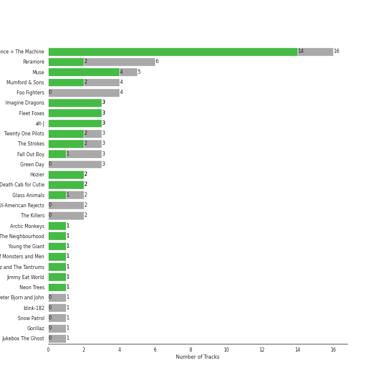
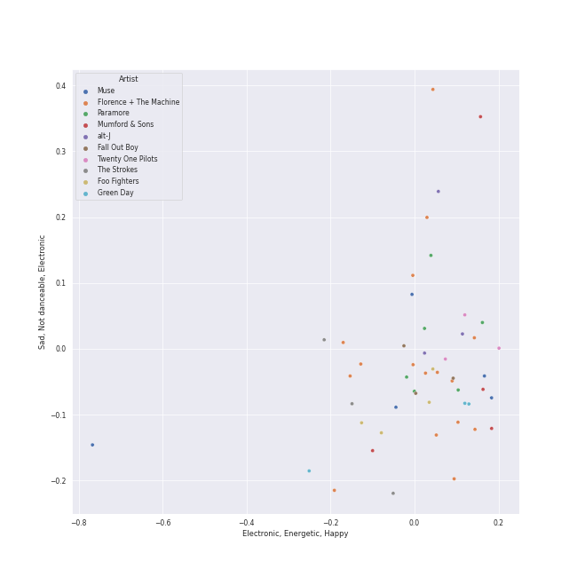
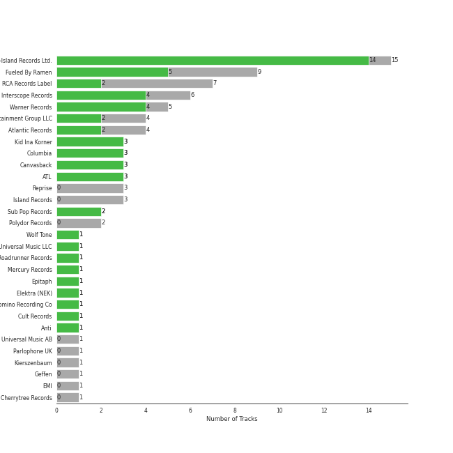
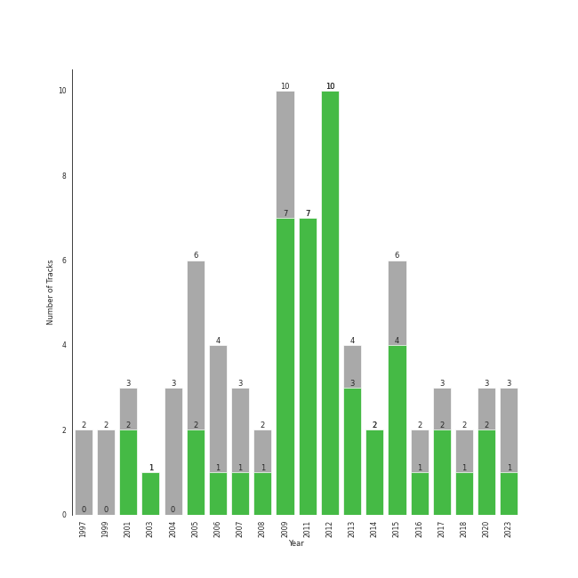

# modern rock

77 songs

[See Track Features](audio_features.md)

[See Clusters](clusters/overview.md)

## Top Artists

| Art | Rank | Tracks | 💚 | Artist | 🔗 |
|:---|---:|---:|---:|:---|:---|
|  | 79 | 16 | 14 | [Florence + The Machine](../../artists/florence_+_the_machine/overview.md) | [🔗](https://open.spotify.com/artist/1moxjboGR7GNWYIMWsRjgG) |
|  | 325 | 5 | 4 | Muse | [🔗](https://open.spotify.com/artist/12Chz98pHFMPJEknJQMWvI) |
|  | 390 | 3 | 3 | Imagine Dragons | [🔗](https://open.spotify.com/artist/53XhwfbYqKCa1cC15pYq2q) |
|  | 210 | 3 | 3 | Fleet Foxes | [🔗](https://open.spotify.com/artist/4EVpmkEwrLYEg6jIsiPMIb) |
|  | 222 | 3 | 3 | alt-J | [🔗](https://open.spotify.com/artist/3XHO7cRUPCLOr6jwp8vsx5) |
|  | 156 | 6 | 2 | Paramore | [🔗](https://open.spotify.com/artist/74XFHRwlV6OrjEM0A2NCMF) |
|  | 430 | 4 | 2 | Mumford & Sons | [🔗](https://open.spotify.com/artist/3gd8FJtBJtkRxdfbTu19U2) |
|  | 430 | 3 | 2 | Twenty One Pilots | [🔗](https://open.spotify.com/artist/3YQKmKGau1PzlVlkL1iodx) |
|  | 163 | 3 | 2 | The Strokes | [🔗](https://open.spotify.com/artist/0epOFNiUfyON9EYx7Tpr6V) |
|  | 430 | 2 | 2 | Hozier | [🔗](https://open.spotify.com/artist/2FXC3k01G6Gw61bmprjgqS) |

See all 28 artists

| Art | Rank | Tracks | 💚 | Artist | 🔗 |
|:---|---:|---:|---:|:---|:---|
|  | 430 | 2 | 2 | Death Cab for Cutie | [🔗](https://open.spotify.com/artist/0YrtvWJMgSdVrk3SfNjTbx) |
|  | 430 | 3 | 1 | Fall Out Boy | [🔗](https://open.spotify.com/artist/4UXqAaa6dQYAk18Lv7PEgX) |
|  | 430 | 2 | 1 | Glass Animals | [🔗](https://open.spotify.com/artist/4yvcSjfu4PC0CYQyLy4wSq) |
|  | 430 | 1 | 1 | The Neighbourhood | [🔗](https://open.spotify.com/artist/77SW9BnxLY8rJ0RciFqkHh) |
|  | 430 | 1 | 1 | Young the Giant | [🔗](https://open.spotify.com/artist/4j56EQDQu5XnL7R3E9iFJT) |
|  | 430 | 1 | 1 | Of Monsters and Men | [🔗](https://open.spotify.com/artist/4dwdTW1Lfiq0cM8nBAqIIz) |
|  | 430 | 1 | 1 | Fitz and The Tantrums | [🔗](https://open.spotify.com/artist/4AcHt3JxKy59IX7JNNlZn4) |
|  | 164 | 1 | 1 | Jimmy Eat World | [🔗](https://open.spotify.com/artist/3Ayl7mCk0nScecqOzvNp6s) |
|  | 359 | 1 | 1 | Neon Trees | [🔗](https://open.spotify.com/artist/0RpddSzUHfncUWNJXKOsjy) |
|  | 165 | 4 | 0 | Foo Fighters | [🔗](https://open.spotify.com/artist/7jy3rLJdDQY21OgRLCZ9sD) |
|  | 160 | 3 | 0 | Green Day | [🔗](https://open.spotify.com/artist/7oPftvlwr6VrsViSDV7fJY) |
|  | 430 | 2 | 0 | The All-American Rejects | [🔗](https://open.spotify.com/artist/3vAaWhdBR38Q02ohXqaNHT) |
|  | 430 | 2 | 0 | The Killers | [🔗](https://open.spotify.com/artist/0C0XlULifJtAgn6ZNCW2eu) |
|  | 430 | 1 | 0 | Peter Bjorn and John | [🔗](https://open.spotify.com/artist/6u11Qbko2N2hP4lTBYjX86) |
|  | 430 | 1 | 0 | blink-182 | [🔗](https://open.spotify.com/artist/6FBDaR13swtiWwGhX1WQsP) |
|  | 430 | 1 | 0 | Snow Patrol | [🔗](https://open.spotify.com/artist/3rIZMv9rysU7JkLzEaC5Jp) |
|  | 430 | 1 | 0 | Gorillaz | [🔗](https://open.spotify.com/artist/3AA28KZvwAUcZuOKwyblJQ) |
|  | 430 | 1 | 0 | Jukebox The Ghost | [🔗](https://open.spotify.com/artist/0L8jXe7QeS9oYUoXbANmX4) |

## Most and least listened tracks
| Rank | ​ | Most listened tracks | Rank | ​​ | Least listened tracks |
|---:|:---|:---|---:|:---|:---|
| 235 |  | [Never Let Me Go](../../artists/florence_+_the_machine/overview.md) | 974 |  | The Pretender |
| 320 |  | The Middle | 974 |  | Knights of Cydonia |
| 360 |  | Misery Business | 974 |  | Someday |
| 393 |  | Breezeblocks | 974 |  | The Only Exception |
| 505 |  | White Winter Hymnal | 974 |  | The Cave |
| 637 |  | [What The Water Gave Me](../../artists/florence_+_the_machine/overview.md) | 974 |  | [How Big, How Blue, How Beautiful](../../artists/florence_+_the_machine/overview.md) |
| 686 |  | Madness | 974 |  | Fitzpleasure |
| 754 |  | Everybody Talks | 974 |  | The Great Unknown |
| 822 |  | Supermassive Black Hole | 974 |  | [You've Got The Love](../../artists/florence_+_the_machine/overview.md) |
| 852 |  | Radioactive | 974 |  | American Idiot |

## Top Albums

| Art | Rank | Tracks | 💚 | Album | Release Date | 🔗 |
|:---|---:|---:|---:|:---|:---|:---|
|  | 643 | 6 | 6 | Lungs (Deluxe Edition) | 2009 | [🔗](https://open.spotify.com/album/2FgknX5e7fJlriQtxvpLhZ) |
|  | 169 | 6 | 6 | Ceremonials - Deluxe Edition | 2011-01-01 | [🔗](https://open.spotify.com/album/5SxudoALxEAVh9l83kSebx) |
|  | 277 | 3 | 3 | An Awesome Wave | 2012-09-18 | [🔗](https://open.spotify.com/album/6k3vC8nep1BfqAIJ81L6OL) |
|  | 643 | 3 | 2 | How Big, How Blue, How Beautiful | 2015-06-01 | [🔗](https://open.spotify.com/album/2btszoya78vyT8fwelmVnz) |
|  | 643 | 3 | 1 | Sigh No More | 2009-10-02 | [🔗](https://open.spotify.com/album/6w5W6ZGTvDsppKUOiGMuMo) |
|  | 464 | 2 | 2 | The 2nd Law | 2012-09-24 | [🔗](https://open.spotify.com/album/3KuXEGcqLcnEYWnn3OEGy0) |
|  | 643 | 2 | 2 | Plans | 2005-08-29 | [🔗](https://open.spotify.com/album/1NFGnxmeIEBakre4DvLaJq) |
|  | 568 | 2 | 2 | Night Visions | 2012-09-04 | [🔗](https://open.spotify.com/album/6htgf3qv7vGcsdxLCDxKp8) |
|  | 643 | 2 | 2 | Hozier (Expanded Edition) | 2014-09-19 | [🔗](https://open.spotify.com/album/4Pv7m8D82A1Xun7xNCKZjJ) |
|  | 643 | 2 | 2 | Blurryface | 2015-05-15 | [🔗](https://open.spotify.com/album/3cQO7jp5S9qLBoIVtbkSM1) |

See all 51 albums

| Art | Rank | Tracks | 💚 | Album | Release Date | 🔗 |
|:---|---:|---:|---:|:---|:---|:---|
|  | 643 | 2 | 1 | So Much (For) Stardust | 2023-03-24 | [🔗](https://open.spotify.com/album/5rHd8n9uWIpq9w0PP5ZcI3) |
|  | 253 | 2 | 1 | Riot! | 2007-06-11 | [🔗](https://open.spotify.com/album/71rziY9eLo1tA2dBMxrwhc) |
|  | 643 | 2 | 1 | Paramore | 2013-04-05 | [🔗](https://open.spotify.com/album/4sgYpkIASM1jVlNC8Wp9oF) |
|  | 549 | 2 | 1 | Black Holes and Revelations | 2006-06-19 | [🔗](https://open.spotify.com/album/0lw68yx3MhKflWFqCsGkIs) |
|  | 643 | 2 | 0 | Hot Fuss | 2004 | [🔗](https://open.spotify.com/album/4piJq7R3gjUOxnYs6lDCTg) |
|  | 643 | 1 | 1 | Young The Giant (Special Edition) | 2011 | [🔗](https://open.spotify.com/album/2ww7MYrkExsljnKhcINDse) |
|  | 643 | 1 | 1 | The New Abnormal | 2020-04-10 | [🔗](https://open.spotify.com/album/2xkZV2Hl1Omi8rk2D7t5lN) |
|  | 643 | 1 | 1 | Shore | 2020-09-22 | [🔗](https://open.spotify.com/album/0lmjCPEcec2k6L7ysNIcd3) |
|  | 643 | 1 | 1 | Room On Fire | 2003-10-28 | [🔗](https://open.spotify.com/album/3HFbH1loOUbqCyPsLuHLLh) |
|  | 503 | 1 | 1 | Picture Show | 2012-01-01 | [🔗](https://open.spotify.com/album/0uRFz92JmjwDbZbB7hEBIr) |
|  | 643 | 1 | 1 | Origin of Symmetry | 2001 | [🔗](https://open.spotify.com/album/1AP6uGYHdakRgwuWQsP5pK) |
|  | 643 | 1 | 1 | My Head Is An Animal | 2012-01-01 | [🔗](https://open.spotify.com/album/4p9dVvZDaZliSjTCbFRhJy) |
|  | 643 | 1 | 1 | I Love You. | 2013-04-22 | [🔗](https://open.spotify.com/album/4xkM0BwLM9H2IUcbYzpcBI) |
|  | 643 | 1 | 1 | How To Be A Human Being | 2016-08-26 | [🔗](https://open.spotify.com/album/6qb9MDR0lfsN9a2pw77uJy) |
|  | 356 | 1 | 1 | Fleet Foxes | 2008-06-03 | [🔗](https://open.spotify.com/album/5GRnydamKvIeG46dycID6v) |
|  | 643 | 1 | 1 | Fitz and The Tantrums (Deluxe Edition) | 2017-07-24 | [🔗](https://open.spotify.com/album/4eoIRaV8z8v2LaXQSWy2LC) |
|  | 643 | 1 | 1 | First Collection 2006-2009 | 2018-11-09 | [🔗](https://open.spotify.com/album/6ou9sQOsIY5xIIX417L3ud) |
|  | 643 | 1 | 1 | Evolve | 2017-06-23 | [🔗](https://open.spotify.com/album/33pt9HBdGlAbRGBHQgsZsU) |
|  | 227 | 1 | 1 | Bleed American | 2001-07-17 | [🔗](https://open.spotify.com/album/0UJhhj5bn5AGAjryFnhueP) |
|  | 643 | 1 | 1 | Babel (Deluxe Version) | 2012-09-25 | [🔗](https://open.spotify.com/album/3FfuUD3Je9t9tQq80Zq41y) |
|  | 643 | 1 | 0 | Writer's Block | 2006-01-01 | [🔗](https://open.spotify.com/album/5g4E06cxsFEMFE9hSekAt2) |
|  | 643 | 1 | 0 | When The World Comes Down | 2008-01-01 | [🔗](https://open.spotify.com/album/3BCMpDOcQlbCZpf5vnTadZ) |
|  | 643 | 1 | 0 | This Is Why | 2023-02-10 | [🔗](https://open.spotify.com/album/6tG8sCK4htJOLjlWwb7gZB) |
|  | 643 | 1 | 0 | There Is Nothing Left To Lose | 1999-11-02 | [🔗](https://open.spotify.com/album/28q2N44ocJECgf8sbHEDfY) |
|  | 643 | 1 | 0 | The Colour And The Shape | 1997-05-20 | [🔗](https://open.spotify.com/album/30ly6F6Xl0TKmyBCU50Khv) |
|  | 643 | 1 | 0 | Nimrod | 1997-10-14 | [🔗](https://open.spotify.com/album/3x2uer6Xh0d5rF8toWpRDA) |
|  | 643 | 1 | 0 | Move Along | 2005-01-01 | [🔗](https://open.spotify.com/album/3PWEGZ6CYvXRnr0JCECsDe) |
|  | 643 | 1 | 0 | Jukebox The Ghost | 2015-04-07 | [🔗](https://open.spotify.com/album/3K5jW2vkunhourPeQ3DiwV) |
|  | 643 | 1 | 0 | Is This It | 2001-07-30 | [🔗](https://open.spotify.com/album/2k8KgmDp9oHrmu0MIj4XDE) |
|  | 643 | 1 | 0 | In Your Honor | 2005-06-14 | [🔗](https://open.spotify.com/album/2eprpJCYbCbPZRKVGIEJxZ) |
|  | 643 | 1 | 0 | High As Hope | 2018-06-29 | [🔗](https://open.spotify.com/album/0pKZJj9GzcKPCS8r4IaksA) |
|  | 643 | 1 | 0 | Heathens | 2016-06-16 | [🔗](https://open.spotify.com/album/3J8W9AOjQhnBLCX33m3atT) |
|  | 643 | 1 | 0 | Greatest Hits: God's Favorite Band | 2017-11-17 | [🔗](https://open.spotify.com/album/3id4t9IqRoB1f1smOERtrY) |
|  | 643 | 1 | 0 | From Under The Cork Tree | 2005-05-03 | [🔗](https://open.spotify.com/album/5nkUSlIhtoJZMOUlB0sNCp) |
|  | 643 | 1 | 0 | Eyes Open | 2006-01-01 | [🔗](https://open.spotify.com/album/3k7bXPw2u0C0SBKPMsgMS3) |
|  | 643 | 1 | 0 | Enema Of The State | 1999-06-01 | [🔗](https://open.spotify.com/album/652N05EcNH1a4bIlUixQE2) |
|  | 643 | 1 | 0 | Echoes, Silence, Patience & Grace | 2007-09-25 | [🔗](https://open.spotify.com/album/3ilXDEG0xiajK8AbqboeJz) |
|  | 643 | 1 | 0 | Dreamland (+ Bonus Levels) | 2020-08-06 | [🔗](https://open.spotify.com/album/0KTj6k94XZh0c6IEMfxeWV) |
|  | 643 | 1 | 0 | Demon Days | 2005-05-23 | [🔗](https://open.spotify.com/album/0bUTHlWbkSQysoM3VsWldT) |
|  | 643 | 1 | 0 | Brand New Eyes | 2009-09-28 | [🔗](https://open.spotify.com/album/27UqZoE1kV6sIV6uQcI28A) |
|  | 643 | 1 | 0 | American Idiot | 2004-09-21 | [🔗](https://open.spotify.com/album/5dN7F9DV0Qg1XRdIgW8rke) |

## Top Record Labels

| Tracks | 💚 | Label |
|---:|---:|:---|
| 15 | 14 | [Universal-Island Records Ltd.](../../labels/universal-island_records_ltd_/overview.md) |
| 9 | 5 | [Fueled By Ramen](../../labels/fueled_by_ramen/overview.md) |
| 6 | 4 | [Interscope Records](../../labels/interscope_records/overview.md) |
| 5 | 4 | [Warner Records](../../labels/warner_records/overview.md) |
| 3 | 3 | Kid Ina Korner |
| 3 | 3 | [Columbia](../../labels/columbia/overview.md) |
| 3 | 3 | Canvasback |
| 3 | 3 | ATL |
| 7 | 2 | [RCA Records Label](../../labels/rca_records_label/overview.md) |
| 4 | 2 | Glassnote Entertainment Group LLC |

See all 29 labels

| Tracks | 💚 | Label |
|---:|---:|:---|
| 4 | 2 | [Atlantic Records](../../labels/atlantic_records/overview.md) |
| 2 | 2 | Sub Pop Records |
| 1 | 1 | Wolf Tone |
| 1 | 1 | [Universal Music LLC](../../labels/universal_music_llc/overview.md) |
| 1 | 1 | Roadrunner Records |
| 1 | 1 | Mercury Records |
| 1 | 1 | Epitaph |
| 1 | 1 | Elektra (NEK) |
| 1 | 1 | Cult Records |
| 1 | 1 | Anti |
| 3 | 0 | [Reprise](../../labels/reprise/overview.md) |
| 3 | 0 | [Island Records](../../labels/island_records/overview.md) |
| 2 | 0 | [Polydor Records](../../labels/polydor_records/overview.md) |
| 1 | 0 | Universal Music AB |
| 1 | 0 | [Parlophone UK](../../labels/parlophone_uk/overview.md) |
| 1 | 0 | Kierszenbaum |
| 1 | 0 | [Geffen](../../labels/geffen/overview.md) |
| 1 | 0 | [EMI](../../labels/emi/overview.md) |
| 1 | 0 | Cherrytree Records |

## Top Producers

| Art | Producer | Tracks | Credit Types |
|:---|:---|---:|:---|
| | [Florence Welch](../../producers/florence_welch/overview.md) | 12 | Lyricist, Songwriter |
| | [Paul Epworth](../../producers/paul_epworth/overview.md) | 7 | Producer, Lyricist, Songwriter |
| | Isabella Summers | 6 | Songwriter, Producer, Lyricist |
| | Craig Silvey | 5 | Producer |
| | Markus Dravs | 4 | Producer |
|  | Muse | 4 | Producer |
| | Cenzo Townshend | 4 | Producer |
| | James Ford | 3 | Producer |
| | Jimmy Robertson | 3 | Producer |
| | Gus Unger-Hamilton | 3 | Songwriter |

View all

| Art | Producer | Tracks | Credit Types |
|:---|:---|---:|:---|
| | Matt Bellamy | 3 | Lyricist, Songwriter |
| | Robin Baynton | 3 | Producer |
| | Ben McKee | 3 | Songwriter |
| | Thom Green | 3 | Songwriter |
| | Joe Newman | 3 | Songwriter |
| | Charlie Andrew | 3 | Producer, Songwriter |
| | Dan Reynolds | 3 | Songwriter |
| | Sally Herbert | 3 | Arranger |
| | Wayne Sermon | 3 | Songwriter |
| | Gwil Sainsbury | 3 | Songwriter |
| | [Mark "Spike" Stent](../../producers/mark__spike__stent/overview.md) | 3 | Producer |
|  | Hozier | 2 | Arranger, Lyricist, Producer, Songwriter |
| | Justin Meldal-Johnsen | 2 | Producer |
| | Adrian Bushby | 2 | Producer |
| | [Kid Harpoon](../../producers/kid_harpoon/overview.md) | 2 | Songwriter |
| | Tommaso Colliva | 2 | Producer |
| | Robin Pecknold | 2 | Lyricist, Songwriter |
| | Winston Marshall | 2 | Songwriter |
| | [Ricky Reed](../../producers/ricky_reed/overview.md) | 2 | Producer, Songwriter |
| | Rob Kirwan | 2 | Producer |
| | Hayley Williams | 2 | Songwriter |
| | Chris Walla | 2 | Producer |
| | Tom Elmhirst | 2 | Producer |
| | Tyler Joseph | 2 | Lyricist, Producer, Songwriter |
| | Alex da Kid | 2 | Producer, Songwriter |
|  | Mumford & Sons | 2 | Arranger |
|  | Julian Casablancas | 2 | Lyricist, Songwriter |
| | Benjamin Gibbard | 2 | Lyricist, Songwriter |
| | Beau Sorenson | 2 | Producer |
| | Ben Lovett | 2 | Songwriter |
| | Neal Avron | 2 | Producer |
| | Ted Dwane | 2 | Songwriter |
| | Bullion | 2 | Producer |
| | Ruadhri Cushnan | 2 | Producer |
| | [Manny Marroquin](../../producers/manny_marroquin/overview.md) | 2 | Producer |
| | Marcus Mumford | 2 | Songwriter |
| | Josh Mosser | 2 | Producer, Songwriter |
| | Nick Harmer | 1 | Songwriter |
| | Jason Lader | 1 | Producer |
| | Mattias Larsson | 1 | Songwriter |
| | Charlie Hugall | 1 | Producer |
| | Ragnar þórhallsson (Ragnar þórhallsson) | 1 | Songwriter |
| | Justyn Pilbrow | 1 | Producer |
| | Jim Adkins | 1 | Songwriter |
| | Rick Rubin | 1 | Producer |
| | Pete Min | 1 | Producer |
| | Ali Helnwein | 1 | Arranger |
| | Aron Arnarsson | 1 | Producer |
| | Adam Hawkins | 1 | Producer |
| | Fabrizio Moretti | 1 | Songwriter |
| | Joe Trohman | 1 | Songwriter |
|  | Chris Brown | 1 | Producer |
|  | Jimmy Eat World | 1 | Producer |
| | Ric Peet | 1 | Producer |
| | Gordon Raphael | 1 | Producer |
| | Billy Bush | 1 | Producer |
| | Nikolai Fraiture | 1 | Songwriter |
| | Claudius Mittendorfer | 1 | Producer |
| | Josh Diamond | 1 | Songwriter |
|  | The Strokes | 1 | Arranger |
| | Andrew Scheps | 1 | Producer |
| | Zachary Abels | 1 | Songwriter |
| | Will Owen | 1 | Arranger |
| | Taylor York | 1 | Producer, Songwriter |
| | Joe Viers | 1 | Producer |
| | Robin Fredriksson | 1 | Songwriter |
| | Ben Baptie | 1 | Producer |
| | Brian Degraw | 1 | Songwriter |
| | Francis White | 1 | Lyricist, Songwriter |
| | Rich Costey | 1 | Producer |
| | Nick Valensi | 1 | Songwriter |
| | Justin Tranter | 1 | Songwriter |
| | Daniel Platzman | 1 | Songwriter |
| | Mat Bartram | 1 | Producer |
| | Rush | 1 | Songwriter |
| | Anthony B. Stephens | 1 | Songwriter |
| | Rick Burch | 1 | Songwriter |
| | Pete Prokopiw | 1 | Producer |
| | Chris Lord-Alge | 1 | Producer |
| | [John Hanes](../../producers/john_hanes/overview.md) | 1 | Producer |
| | Mark Trombino | 1 | Producer |
| | Leslie Bricusse | 1 | Songwriter |
|  | Fitz and The Tantrums | 1 | Songwriter |
| | François Chevallier (Chevallier, François) | 1 | Producer |
| | Jesse | 1 | Lyricist, Songwriter |
|  | Young the Giant | 1 | Songwriter |
| | Nanna Bryndís Hilmarsdóttir (Nanna Bryndís Hilmarsdóttir) | 1 | Songwriter |
| | Dave Bayley | 1 | Songwriter |
| | Mark "Top" Rankin | 1 | Producer |
| | Toshikazu Yoshioka | 1 | Producer |

## Years

| ​ | 10 newest albums | ​​ | 10 oldest albums |
|:---|:---|:---|:---|
|  | So Much (For) Stardust (2023-03-24) |  | The Colour And The Shape (1997-05-20) |
|  | This Is Why (2023-02-10) |  | Nimrod (1997-10-14) |
|  | Shore (2020-09-22) |  | Enema Of The State (1999-06-01) |
|  | Dreamland (+ Bonus Levels) (2020-08-06) |  | There Is Nothing Left To Lose (1999-11-02) |
|  | The New Abnormal (2020-04-10) |  | Origin of Symmetry (2001) |
|  | First Collection 2006-2009 (2018-11-09) |  | Bleed American (2001-07-17) |
|  | High As Hope (2018-06-29) |  | Is This It (2001-07-30) |
|  | Greatest Hits: God's Favorite Band (2017-11-17) |  | Room On Fire (2003-10-28) |
|  | Fitz and The Tantrums (Deluxe Edition) (2017-07-24) |  | Hot Fuss (2004) |
|  | Evolve (2017-06-23) |  | American Idiot (2004-09-21) |

