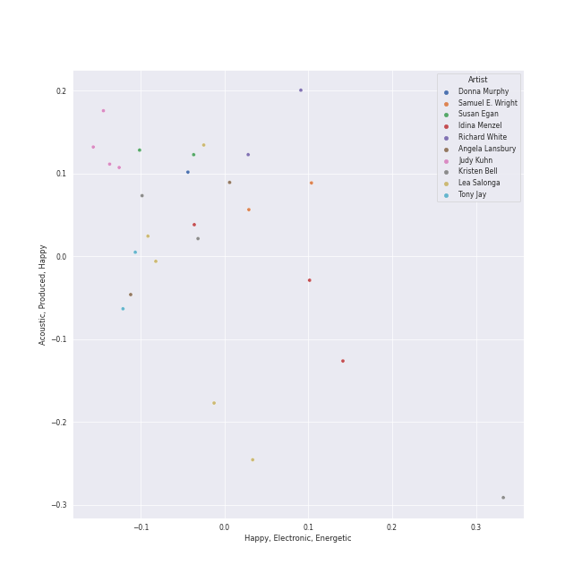
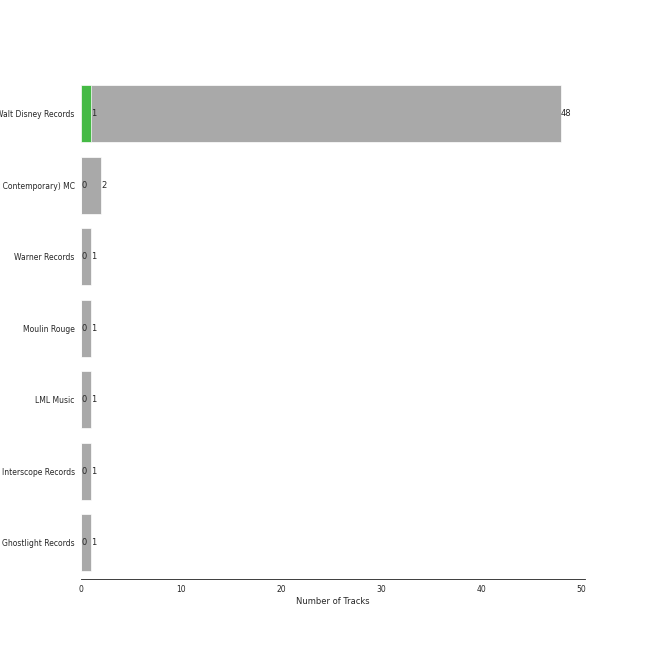

# movie tunes

[40 songs](movie_tunes_tracks.md)

## Top Artists

See all 65 artists

| Number of Tracks | Art | Artist | 🔗 |
|---:|:---|:---|:---|
| 15 |  | [Disney](../artists/disney.md) | [🔗](https://open.spotify.com/artist/3xvaSlT4xsyk6lY1ESOspO) |
| 5 |  | Lea Salonga | [🔗](https://open.spotify.com/artist/1GlMjIezcLwV3OFlX0uXOv) |
| 4 |  | Judy Kuhn | [🔗](https://open.spotify.com/artist/7tHd518aPjJYUgyv9bidBz) |
| 3 |  | Tony Jay | [🔗](https://open.spotify.com/artist/5qQpn0ZokyamZjyKtkKUYD) |
| 3 |  | Chorus - The Hunchback Of Notre Dame | [🔗](https://open.spotify.com/artist/5oHSxqr1uDloCbJJPNBd6T) |
| 3 |  | Chorus - Beauty And the Beast | [🔗](https://open.spotify.com/artist/3kWWBtNzJFtKA222gZz39d) |
| 3 |  | Kristen Bell | [🔗](https://open.spotify.com/artist/2kHxkdiKCSnHMkhIgFBZaI) |
| 3 |  | Angela Lansbury | [🔗](https://open.spotify.com/artist/0LtVJXnPR8msCJiE2DjHxy) |
| 2 |  | Paige O'Hara | [🔗](https://open.spotify.com/artist/7oavKrnYbTZPAPq7zCuipM) |
| 2 |  | Samuel E. Wright | [🔗](https://open.spotify.com/artist/6Id8rcDNyBXPcgKQVfQ8rX) |
| 2 |  | Joseph Williams | [🔗](https://open.spotify.com/artist/5xk0kRuXn1zToTHpHAqpui) |
| 2 |  | Jerry Orbach | [🔗](https://open.spotify.com/artist/5i2OpmeVKsmViqoETxuOvO) |
| 2 |  | Jason Weaver | [🔗](https://open.spotify.com/artist/5UdPkKWd8YNR5xGcmqH9QJ) |
| 2 |  | Tom Hulce | [🔗](https://open.spotify.com/artist/4wd5K3s3ekf0czSh2qGjTD) |
| 2 |  | Brad Kane | [🔗](https://open.spotify.com/artist/3dAzSJ9lQnJSq5Z0OgDBep) |
| 2 |  | Richard White | [🔗](https://open.spotify.com/artist/0jWqALm6pl5CHj5N0eO68G) |
| 2 |  | Ernie Sabella | [🔗](https://open.spotify.com/artist/0RH6EMxqfzCEB7QCSKQ4xr) |
| 2 |  | Nathan Lane | [🔗](https://open.spotify.com/artist/0P0do9GwiSgweSF6Ui3mrv) |
| 2 |  | David Ogden Stiers | [🔗](https://open.spotify.com/artist/0N0dbr5s2y20PAo2cDAeVP) |
| 1 |  | Sally Dworsky | [🔗](https://open.spotify.com/artist/7vK6xoR5zT4DypEu0blUku) |
| 1 |  | Verna Felton | [🔗](https://open.spotify.com/artist/7aU90hxXexP47nEeMee6xM) |
| 1 |  | Billy Bletcher | [🔗](https://open.spotify.com/artist/7MCVs8C2nykvXVyTyrUoVd) |
| 1 |  | Beth Fowler | [🔗](https://open.spotify.com/artist/7KNW6OwcA260MsaEtnvhxV) |
| 1 |  | Harvey Fierstein | [🔗](https://open.spotify.com/artist/7G6zawIBBtDX1WvuT97Ei9) |
| 1 |  | Idina Menzel | [🔗](https://open.spotify.com/artist/73Np75Wv2tju61Eo9Zw4IR) |
| 1 |  | Laura Williams | [🔗](https://open.spotify.com/artist/6wIj7GdxBjFtw6ySpzazwo) |
| 1 |  | Agatha Lee Monn | [🔗](https://open.spotify.com/artist/6kHu5ICQRBZdsAHjAjQlmp) |
| 1 |  | Jeremy Irons | [🔗](https://open.spotify.com/artist/6QRb3jE2lCfMU1iUuVQMaV) |
| 1 |  | Carmen Twillie | [🔗](https://open.spotify.com/artist/6O3ZB5Cz5CNT3wQWouKcNJ) |
| 1 |  | Paul Kandel | [🔗](https://open.spotify.com/artist/6M3XR163Q68THc9IFMwfAH) |
| 1 |  | Cheech Marin | [🔗](https://open.spotify.com/artist/68TP2Pr8i7dvyFHU0p748r) |
| 1 |  | Bruce Adler | [🔗](https://open.spotify.com/artist/66oKiXdIQP7MwN0gPUY0FD) |
| 1 |  | Frances Ruffelle | [🔗](https://open.spotify.com/artist/5uSeMCBhe3DiROdFrwaXkw) |
| 1 |  | Auli'i Cravalho | [🔗](https://open.spotify.com/artist/5mnS9jJdKQQcRSqFu5YPVe) |
| 1 |  | Rowan Atkinson | [🔗](https://open.spotify.com/artist/5U4QDnlOlmZx9MHV45EoDE) |
| 1 |  | Katie Lopez | [🔗](https://open.spotify.com/artist/5Kkhk21siwbW3BfZUwpykJ) |
| 1 |  | Donna Murphy | [🔗](https://open.spotify.com/artist/5BuTOT6mPoNZ5EmaPheBI9) |
| 1 |  | Jesse Corti | [🔗](https://open.spotify.com/artist/53vhGhGRoi9ARM7kr3jrz5) |
| 1 |  | Kristle Edwards | [🔗](https://open.spotify.com/artist/4y5d67UxD0QON2vRZOjXZ6) |
| 1 |  | Jodi Benson | [🔗](https://open.spotify.com/artist/4mmMtabvFCKA6HfmVmitNH) |
| 1 |  | Colm Wilkinson | [🔗](https://open.spotify.com/artist/4hKV8PcRBaHZqBJjSn8OJE) |
| 1 |  | Pinto Colvig | [🔗](https://open.spotify.com/artist/4X8LTt7CXvrqzfS4G4ONUX) |
| 1 |  | Chorus - Mulan | [🔗](https://open.spotify.com/artist/4KpdqBDU2C5gB3vhdojuqA) |
| 1 |  | Ilene Woods | [🔗](https://open.spotify.com/artist/4DovRSplr3yJIeE3r0RtHj) |
| 1 |  | Santino Fontana | [🔗](https://open.spotify.com/artist/47NluEnhJda2gsnjuvcoob) |
| 1 |  | Bruce Reitherman | [🔗](https://open.spotify.com/artist/43HPW60tz4BMYMRnmXMagJ) |
| 1 |  | Jerry Tondo | [🔗](https://open.spotify.com/artist/3wUpOiaLjwAZNregbC7CxO) |
| 1 |  | Mice Chorus | [🔗](https://open.spotify.com/artist/3gcnVAcMBdtYbril7EqBz6) |
| 1 |  | Matthew Wilder | [🔗](https://open.spotify.com/artist/3bmFPbLMiLxtR9tFrTcKcP) |
| 1 |  | Robby Benson | [🔗](https://open.spotify.com/artist/3QcGV278a6mmLRTOK29WBP) |
| 1 |  | Jim Cummings | [🔗](https://open.spotify.com/artist/3OIPwMAZipDCLQwHmxS5EG) |
| 1 |  | David Bryant | [🔗](https://open.spotify.com/artist/2yPfp367ZwywK1lbGg00b8) |
| 1 |  | Marni Nixon | [🔗](https://open.spotify.com/artist/2Npf96k0QoY8YYwqnELDmQ) |
| 1 |  | Phil Harris | [🔗](https://open.spotify.com/artist/2ISMfPtVzHc9jDDVPUEHDa) |
| 1 |  | Heidi Mollenhauer | [🔗](https://open.spotify.com/artist/2FmXrymxv6kNBnA66HpoPt) |
| 1 |  | Bill Shirley | [🔗](https://open.spotify.com/artist/259T26oxdhM7losfoXOXOl) |
| 1 |  | Mary Costa | [🔗](https://open.spotify.com/artist/1qeo0u3hwxCBcYsn3a4kyo) |
| 1 |  | Chorus - Sleeping Beauty | [🔗](https://open.spotify.com/artist/1c4ltuRXEIo20Y9UOPxiA0) |
| 1 |  | Whoopi Goldberg | [🔗](https://open.spotify.com/artist/1ZsoHNxHMKTgliJcxSRlb5) |
| 1 |  | Keith David | [🔗](https://open.spotify.com/artist/1LPgqTHt7RmHwYtS9KQTMY) |
| 1 |  | Lebo M. | [🔗](https://open.spotify.com/artist/0zp9qNDSeYi3QEodhcKAAA) |
| 1 |  | Dorothy Compton | [🔗](https://open.spotify.com/artist/0humNRtJZUnSFh10d8Vnou) |
| 1 |  | Pat Carroll | [🔗](https://open.spotify.com/artist/0Yy9u86cq66Se2pB9fYaiW) |
| 1 |  | Mary Moder | [🔗](https://open.spotify.com/artist/00ud2vhOOcbrUyGGYPSTYh) |
| 1 |  | James Hong | [🔗](https://open.spotify.com/artist/00erTY7OuCOdNTN36srPNN) |

## Top Albums

See all 18 albums

| Number of Tracks | Art | Album | Release Date | 🔗 |
|---:|:---|:---|:---|:---|
| 5 |  | The Lion King | 1994-01-01 | [🔗](https://open.spotify.com/album/3YA5DdB3wSz4pdfEXoMyRd) |
| 5 |  | Beauty and the Beast | 1991-01-01 | [🔗](https://open.spotify.com/album/3O5p9VNddbwvqWTdYKEqV5) |
| 4 |  | The Little Mermaid Special Edition | 2006-01-01 | [🔗](https://open.spotify.com/album/4aAwvCRNJIqiUGVEjieWv6) |
| 4 |  | The Hunchback Of Notre Dame (Original Motion Picture Soundtrack) | 1996-05-28 | [🔗](https://open.spotify.com/album/7btQeUDTIIfnh2iCQ8Pfhq) |
| 3 |  | Mulan (Original Soundtrack) | 1998-01-01 | [🔗](https://open.spotify.com/album/3Ohs7Jo6GM6mydUOL0m5aC) |
| 3 |  | Frozen (Original Motion Picture Soundtrack / Deluxe Edition) | 2013-01-01 | [🔗](https://open.spotify.com/album/7lZs5r4oQV2nutddffLrg0) |
| 3 |  | Aladdin Special Edition | 2004-01-01 | [🔗](https://open.spotify.com/album/7bt2aty3lUo6Q1Ud8pthRz) |
| 2 |  | Pocahontas | 1995-01-01 | [🔗](https://open.spotify.com/album/7L6kEZVkWh7OEI71b1JHZd) |
| 2 |  | Les Misérables (Original Broadway Cast Recording) | 1987-05-11 | [🔗](https://open.spotify.com/album/3jbKDx0zB1QoJQTw8i1AvD) |
| 1 |  | The Princess and the Frog (Original Motion Picture Soundtrack) | 2009-11-23 | [🔗](https://open.spotify.com/album/0CcL28OkH89kjgKpNZC8sW) |
| 1 |  | The Jungle Book | 1997-01-01 | [🔗](https://open.spotify.com/album/7zdZNXoapFcOW663zgLdOE) |
| 1 |  | The Journey so Far | 2011-08-09 | [🔗](https://open.spotify.com/album/3zr8JDmixklHY1sOURyfoK) |
| 1 |  | Tangled | 2010-01-01 | [🔗](https://open.spotify.com/album/1l0aFrH24oPrQSqGtfeFyE) |
| 1 |  | Songs and Story: Cinderella | 2009-01-01 | [🔗](https://open.spotify.com/album/1d4rBfCtXPqkphzbvjokLa) |
| 1 |  | Sleeping Beauty | 1996-01-01 | [🔗](https://open.spotify.com/album/3U3I9TY7on88tPvM1guh54) |
| 1 |  | Moana (Original Motion Picture Soundtrack/Deluxe Edition) | 2016-11-18 | [🔗](https://open.spotify.com/album/6pZj4nvx6lV3ulIK3BSjvs) |
| 1 |  | Disney's Greatest Vol. 3 | 2002-08-20 | [🔗](https://open.spotify.com/album/6UuNvv5UFJG5bQkYzQIarh) |
| 1 |  | Cinderella Special Edition (Original Motion Picture Soundtrack/Japanese Version) | 2005-10-19 | [🔗](https://open.spotify.com/album/3QAxBLpXRLVMh1dRtuQa0q) |

## Top Record Labels

See all 3 labels

| Number of Tracks | Label |
|---:|:---|
| 37 | [Walt Disney Records](../labels/walt_disney_records.md) |
| 2 | [Verve (Adult Contemporary) MC](../labels/verve__adult_contemporary__mc.md) |
| 1 | LML Music |

## Audio Features

| 10 most Danceable tracks | 10 least Danceable tracks |
|:---|:---|
| The Bare Necessities | God Help the Outcasts |
| Love Is an Open Door - From "Frozen"/Soundtrack Version | Heaven's Light/Hellfire |
| Be Prepared - From "The Lion King" / Soundtrack Version | An Unusual Prince / Once Upon A Dream - From "Sleeping Beauty"/Soundtrack Version |
| I Just Can't Wait to Be King - From "The Lion King" Soundtrack | Beauty and the Beast - From "Beauty and the Beast" / Soundtrack Version |
| Kiss the Girl | Reflection |
| Gaston - From "Beauty and the Beast" / Soundtrack Version | A Heart Full Of Love |
| Who's Afraid of the Big, Bad Wolf - From "Three Little Pigs" | A Dream Is a Wish Your Heart Makes |
| Something There - From "Beauty and the Beast"/Soundtrack Version | Colors of the Wind - From "Pocahontas" / Soundtrack Version |
| How Far I'll Go | Part of Your World |
| One Jump Ahead | A Whole New World |

| 10 most Energetic tracks | 10 least Energetic tracks |
|:---|:---|
| Love Is an Open Door - From "Frozen"/Soundtrack Version | God Help the Outcasts |
| Friends on the Other Side | In My Life |
| Gaston - From "Beauty and the Beast" / Soundtrack Version | Do You Want to Build a Snowman? - From "Frozen"/Soundtrack Version |
| Bibbidi-Bobbidi-Boo - From "Cinderella" Soundtrack | A Heart Full Of Love |
| I Just Can't Wait to Be King - From "The Lion King" Soundtrack | Can You Feel the Love Tonight - From "The Lion King" / Soundtrack Version |
| Under the Sea | Part of Your World |
| Be Our Guest - From "Beauty And The Beast" Soundtrack | Heaven's Light/Hellfire |
| Be Prepared - From "The Lion King" / Soundtrack Version | Beauty and the Beast - From "Beauty and the Beast" / Soundtrack Version |
| For the First Time in Forever - From "Frozen"/Soundtrack Version | Colors of the Wind - From "Pocahontas" / Soundtrack Version |
| Circle of Life - From "The Lion King" Soundtrack | A Dream Is a Wish Your Heart Makes |

| 10 most Speechy tracks | 10 least Speechy tracks |
|:---|:---|
| Who's Afraid of the Big, Bad Wolf - From "Three Little Pigs" | For the First Time in Forever - From "Frozen"/Soundtrack Version |
| Be Our Guest - From "Beauty And The Beast" Soundtrack | Beauty and the Beast - From "Beauty and the Beast" / Soundtrack Version |
| Mother Knows Best - From "Tangled"/Soundtrack Version | An Unusual Prince / Once Upon A Dream - From "Sleeping Beauty"/Soundtrack Version |
| Under the Sea | A Whole New World |
| Gaston - From "Beauty and the Beast" / Soundtrack Version | Something There - From "Beauty and the Beast"/Soundtrack Version |
| Hakuna Matata - From "The Lion King" Soundtrack | Reflection |
| One Jump Ahead | God Help the Outcasts |
| Belle - From "Beauty and the Beast"/Soundtrack Version | A Heart Full Of Love |
| Poor Unfortunate Souls | In My Life |
| Friends on the Other Side | Reflection |

| 10 most Acoustic tracks | 10 least Acoustic tracks |
|:---|:---|
| An Unusual Prince / Once Upon A Dream - From "Sleeping Beauty"/Soundtrack Version | Circle of Life - From "The Lion King" Soundtrack |
| A Dream Is a Wish Your Heart Makes | Love Is an Open Door - From "Frozen"/Soundtrack Version |
| A Heart Full Of Love | Be Prepared - From "The Lion King" / Soundtrack Version |
| In My Life | I Just Can't Wait to Be King - From "The Lion King" Soundtrack |
| Bibbidi-Bobbidi-Boo - From "Cinderella" Soundtrack | One Jump Ahead |
| Who's Afraid of the Big, Bad Wolf - From "Three Little Pigs" | Honor To Us All |
| Colors of the Wind - From "Pocahontas" / Soundtrack Version | A Girl Worth Fighting For |
| God Help the Outcasts | Hakuna Matata - From "The Lion King" Soundtrack |
| Part of Your World | How Far I'll Go |
| Just Around the Riverbend - From "Pocahontas" / Soundtrack Version | Kiss the Girl |

| 10 most Instrumental tracks | 10 least Instrumental tracks |
|:---|:---|
| Reflection | How Far I'll Go |
| An Unusual Prince / Once Upon A Dream - From "Sleeping Beauty"/Soundtrack Version | A Girl Worth Fighting For |
| Who's Afraid of the Big, Bad Wolf - From "Three Little Pigs" | In My Life |
| Colors of the Wind - From "Pocahontas" / Soundtrack Version | Be Our Guest - From "Beauty And The Beast" Soundtrack |
| Reflection | Honor To Us All |
| A Dream Is a Wish Your Heart Makes | Gaston - From "Beauty and the Beast" / Soundtrack Version |
| Part of Your World | Belle - From "Beauty and the Beast"/Soundtrack Version |
| God Help the Outcasts | Can You Feel the Love Tonight - From "The Lion King" / Soundtrack Version |
| Do You Want to Build a Snowman? - From "Frozen"/Soundtrack Version | Arabian Nights |
| Friends on the Other Side | One Jump Ahead |

| 10 most Live tracks | 10 least Live tracks |
|:---|:---|
| One Jump Ahead | Mother Knows Best - From "Tangled"/Soundtrack Version |
| Reflection | Heaven's Light/Hellfire |
| Can You Feel the Love Tonight - From "The Lion King" / Soundtrack Version | God Help the Outcasts |
| Friends on the Other Side | Out There |
| Poor Unfortunate Souls | Be Our Guest - From "Beauty And The Beast" Soundtrack |
| Reflection | Who's Afraid of the Big, Bad Wolf - From "Three Little Pigs" |
| Love Is an Open Door - From "Frozen"/Soundtrack Version | I Just Can't Wait to Be King - From "The Lion King" Soundtrack |
| In My Life | Be Prepared - From "The Lion King" / Soundtrack Version |
| Circle of Life - From "The Lion King" Soundtrack | A Whole New World |
| Part of Your World | Kiss the Girl |

| 10 most Happy tracks | 10 least Happy tracks |
|:---|:---|
| I Just Can't Wait to Be King - From "The Lion King" Soundtrack | A Heart Full Of Love |
| Bibbidi-Bobbidi-Boo - From "Cinderella" Soundtrack | Reflection |
| A Girl Worth Fighting For | How Far I'll Go |
| Under the Sea | Heaven's Light/Hellfire |
| Hakuna Matata - From "The Lion King" Soundtrack | God Help the Outcasts |
| Kiss the Girl | A Whole New World |
| One Jump Ahead | In My Life |
| Gaston - From "Beauty and the Beast" / Soundtrack Version | A Dream Is a Wish Your Heart Makes |
| Honor To Us All | Do You Want to Build a Snowman? - From "Frozen"/Soundtrack Version |
| Who's Afraid of the Big, Bad Wolf - From "Three Little Pigs" | Beauty and the Beast - From "Beauty and the Beast" / Soundtrack Version |
