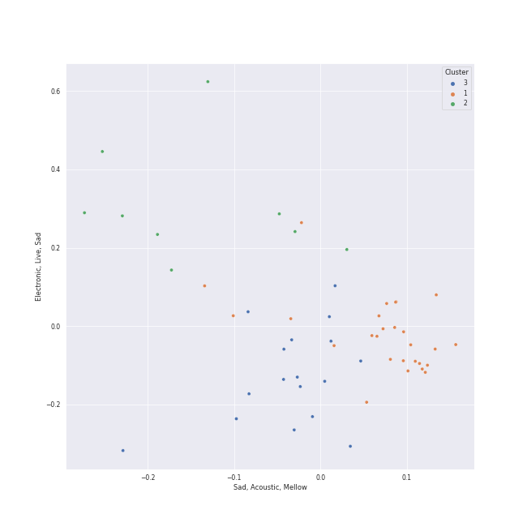

# Clusters in movie tunes

## Cluster #1

18 tracks

| Art | Track | Album | Artists | Label | 💚 | 🔗 |
|:---|:---|:---|:---|:---|:---|:---|
|  | Be Our Guest | Beauty and the Beast | Angela Lansbury, Jerry Orbach, Chorus - Beauty And the Beast, Disney | [Walt Disney Records](../../../../labels/walt_disney_records) | | [🔗](https://open.spotify.com/track/6btdYzQ8eZFBrOlUKVHuz0) |
|  | Arabian Nights | Aladdin Special Edition | Bruce Adler, Disney | [Walt Disney Records](../../../../labels/walt_disney_records) | | [🔗](https://open.spotify.com/track/31vVcYpecILSQ02PIGdqYi) |
|  | Mother Knows Best - From "Tangled"/Soundtrack Version | Tangled | Donna Murphy | [Walt Disney Records](../../../../labels/walt_disney_records) | | [🔗](https://open.spotify.com/track/1lOSxJNCLvWm2bYaTcTSmK) |
|  | Baby It's Cold Outside (with Michael Bublé) | Holiday Wishes | Idina Menzel, [Michael Bublé](../../../../artists/michael_bubl_/overview.md) | [Warner Records](../../../../labels/warner_records) | | [🔗](https://open.spotify.com/track/0Ie5uiv54KgCr7P4sYDTHl) |
|  | For the First Time in Forever - From "Frozen"/Soundtrack Version | Frozen (Original Motion Picture Soundtrack / Deluxe Edition) | Kristen Bell, Idina Menzel | [Walt Disney Records](../../../../labels/walt_disney_records) | | [🔗](https://open.spotify.com/track/70b5Sq3ePOu3Gqg0hjlOtR) |
|  | Who's Afraid of the Big, Bad Wolf - From "Three Little Pigs" | Disney's Greatest Vol. 3 | Pinto Colvig, Mary Moder, Dorothy Compton, Billy Bletcher | [Walt Disney Records](../../../../labels/walt_disney_records) | | [🔗](https://open.spotify.com/track/4K1kR94TrMRoznMHBFaa3C) |
|  | Belle | Beauty and the Beast | Richard White, Paige O'Hara, Chorus - Beauty And the Beast, Disney | [Walt Disney Records](../../../../labels/walt_disney_records) | | [🔗](https://open.spotify.com/track/0Q4a3PdGEME9w8Jgqa0Gf3) |
|  | Gaston | Beauty and the Beast | Richard White, Jesse Corti, Chorus - Beauty And the Beast, Disney | [Walt Disney Records](../../../../labels/walt_disney_records) | | [🔗](https://open.spotify.com/track/0zstgBrV1t1g6n4jHrUVBY) |
|  | Something There | Beauty and the Beast | Robby Benson, Jerry Orbach, Paige O'Hara, Angela Lansbury, David Ogden Stiers, Disney | [Walt Disney Records](../../../../labels/walt_disney_records) | | [🔗](https://open.spotify.com/track/6mDxu0xwhv5tn1oMTNUypu) |
|  | Belle | Beauty And The Beast: The Broadway Musical | Susan Egan, Burke Moses, Sarah Solie Shannon, Paige Price, Linda Talcott, Broadway Cast of Beauty and the Beast, Kenny Raskin | [Walt Disney Records](../../../../labels/walt_disney_records) | | [🔗](https://open.spotify.com/track/70sqHGRr89z4SbAmpzE71X) |
## Cluster #2

25 tracks

| Art | Track | Album | Artists | Label | 💚 | 🔗 |
|:---|:---|:---|:---|:---|:---|:---|
|  | Beauty and the Beast | Beauty and the Beast | Angela Lansbury, Disney | [Walt Disney Records](../../../../labels/walt_disney_records) | | [🔗](https://open.spotify.com/track/2rJFFUEl1LURkV0b0OARXx) |
|  | The Bells of Notre Dame | The Hunchback Of Notre Dame (Original Motion Picture Soundtrack) | David Ogden Stiers, Tony Jay, Paul Kandel, Chorus - The Hunchback Of Notre Dame | [Walt Disney Records](../../../../labels/walt_disney_records) | | [🔗](https://open.spotify.com/track/47Wo2LeGbzdZTdEFNRZXV0) |
|  | A Dream Is a Wish Your Heart Makes | Cinderella Special Edition (Original Motion Picture Soundtrack/Japanese Version) | Ilene Woods, Mice Chorus | [Walt Disney Records](../../../../labels/walt_disney_records) | | [🔗](https://open.spotify.com/track/6PiTsEEiNYU9a9xXowi9i5) |
|  | Part of Your World | The Little Mermaid Special Edition | Jodi Benson, Disney | [Walt Disney Records](../../../../labels/walt_disney_records) | | [🔗](https://open.spotify.com/track/7tUSJY4nsDBJTjd1UXKRsT) |
|  | A Heart Full Of Love | Les Misérables (Original Broadway Cast Recording) | Judy Kuhn | [Verve (Adult Contemporary) MC](../../../../labels/verve__adult_contemporary__mc) | | [🔗](https://open.spotify.com/track/1audfn0M2y51sgmKFHCxoC) |
|  | Colors of the Wind | Pocahontas | Judy Kuhn | [Walt Disney Records](../../../../labels/walt_disney_records) | | [🔗](https://open.spotify.com/track/1OYOLWqKmhkFIx2KC9ek1a) |
|  | Just Around the Riverbend | Pocahontas | Judy Kuhn | [Walt Disney Records](../../../../labels/walt_disney_records) | | [🔗](https://open.spotify.com/track/6P316E7tFylzpVrDrXVF9s) |
|  | Do You Want to Build a Snowman? - From "Frozen"/Soundtrack Version | Frozen (Original Motion Picture Soundtrack / Deluxe Edition) | Kristen Bell, Agatha Lee Monn, Katie Lopez | [Walt Disney Records](../../../../labels/walt_disney_records) | | [🔗](https://open.spotify.com/track/2yi7HZrBOC4bMUSTcs4VK6) |
|  | An Unusual Prince / Once Upon A Dream - From "Sleeping Beauty"/Soundtrack Version | Sleeping Beauty | Mary Costa, Bill Shirley, Chorus - Sleeping Beauty | [Walt Disney Records](../../../../labels/walt_disney_records) | | [🔗](https://open.spotify.com/track/5WKxcFnCO244tMnVElhFuk) |
|  | Go the Distance | Hercules (Original Motion Picture Soundtrack) | Roger Bart, Disney | [Walt Disney Records](../../../../labels/walt_disney_records) | | [🔗](https://open.spotify.com/track/0D1OY0M5A0qD5HGBvFmFid) |
## Cluster #3

11 tracks

| Art | Track | Album | Artists | Label | 💚 | 🔗 |
|:---|:---|:---|:---|:---|:---|:---|
|  | Circle of Life | The Lion King | Carmen Twillie, Lebo M. | [Walt Disney Records](../../../../labels/walt_disney_records) | | [🔗](https://open.spotify.com/track/0HU5JnVaKNTWf6GykV9Zn8) |
|  | Zero To Hero | Hercules (Original Motion Picture Soundtrack) | Chorus - Hercules, Lillias White, Cheryl Freeman, LaChanze, Roz Ryan, Vaneese Thomas, Tawatha Agee, Disney | [Walt Disney Records](../../../../labels/walt_disney_records) | | [🔗](https://open.spotify.com/track/4zDfgax6Ihb0UWdour1ZEs) |
|  | I'll Make a Man Out of You | Mulan (Original Soundtrack) | Donny Osmond, Chorus - Mulan, Disney | [Walt Disney Records](../../../../labels/walt_disney_records) | | [🔗](https://open.spotify.com/track/28UMEtwyUUy5u0UWOVHwiI) |
|  | I Just Can't Wait to Be King | The Lion King (Original Motion Picture Soundtrack) | JD McCrary, Shahadi Wright Joseph, John Oliver | [Walt Disney Records](../../../../labels/walt_disney_records) | | [🔗](https://open.spotify.com/track/2xUdYfY3LpJb4Iv37RypnO) |
|  | I Just Can't Wait to Be King | The Lion King | Jason Weaver, Rowan Atkinson, Laura Williams | [Walt Disney Records](../../../../labels/walt_disney_records) | | [🔗](https://open.spotify.com/track/0qxtQ8rf3W1nId3D2r0xH4) |
|  | Be Prepared | The Lion King | Jeremy Irons, Whoopi Goldberg, Cheech Marin, Jim Cummings | [Walt Disney Records](../../../../labels/walt_disney_records) | | [🔗](https://open.spotify.com/track/34nxgXFCPzDphUJGuRsn10) |
|  | Love Is an Open Door - From "Frozen"/Soundtrack Version | Frozen (Original Motion Picture Soundtrack / Deluxe Edition) | Kristen Bell, Santino Fontana | [Walt Disney Records](../../../../labels/walt_disney_records) | | [🔗](https://open.spotify.com/track/3IPnBzGRMg6BfViFxxa0Gq) |
|  | A Girl Worth Fighting For | Mulan (Original Soundtrack) | Lea Salonga, Harvey Fierstein, Matthew Wilder, James Hong, Jerry Tondo, Disney | [Walt Disney Records](../../../../labels/walt_disney_records) | | [🔗](https://open.spotify.com/track/3wjgPeXocinhLyPL37p70e) |
|  | Honor To Us All | Mulan (Original Soundtrack) | Lea Salonga, Beth Fowler, Marni Nixon, Chorus - Mulan, Disney | [Walt Disney Records](../../../../labels/walt_disney_records) | | [🔗](https://open.spotify.com/track/78EMhiyAcalWWtnpk20Eoo) |
|  | Hakuna Matata | The Lion King | Nathan Lane, Ernie Sabella, Jason Weaver, Joseph Williams | [Walt Disney Records](../../../../labels/walt_disney_records) | | [🔗](https://open.spotify.com/track/5k3U0OGYBccHdKJJu3HrUN) |