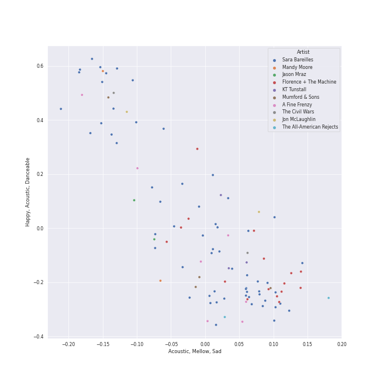
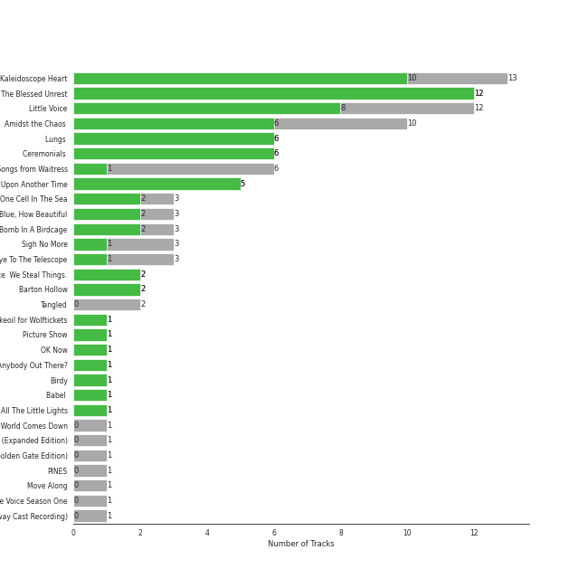

# neo mellow

[94 songs](neo_mellow_tracks.md)

## Top Artists

See all 21 artists

| Number of Tracks | Art | Artist | 🔗 |
|---:|:---|:---|:---|
| 59 |  | [Sara Bareilles](../artists/sara_bareilles.md) | [🔗](https://open.spotify.com/artist/2Sqr0DXoaYABbjBo9HaMkM) |
| 7 |  | Erin McCarley | [🔗](https://open.spotify.com/artist/6Y4bCmUNPDKqc7dHkVvgim) |
| 7 |  | A Fine Frenzy | [🔗](https://open.spotify.com/artist/5dTYaRzOn4rXGBLH052EeQ) |
| 3 |  | KT Tunstall | [🔗](https://open.spotify.com/artist/5zzrJD2jXrE9dZ1AklRFcL) |
| 3 |  | Jason Mraz | [🔗](https://open.spotify.com/artist/4phGZZrJZRo4ElhRtViYdl) |
| 2 |  | Jon McLaughlin | [🔗](https://open.spotify.com/artist/6z29S0IoiBJpSMP8plyCj7) |
| 2 |  | The Civil Wars | [🔗](https://open.spotify.com/artist/6J7rw7NELJUCThPbAfyLIE) |
| 2 |  | The Script | [🔗](https://open.spotify.com/artist/3AQRLZ9PuTAozP28Skbq8V) |
| 1 |  | Christina Perri | [🔗](https://open.spotify.com/artist/7H55rcKCfwqkyDFH9wpKM6) |
| 1 |  | Colbie Caillat | [🔗](https://open.spotify.com/artist/6aZyMrc4doVtZyKNilOmwu) |
| 1 |  | A Great Big World | [🔗](https://open.spotify.com/artist/5xKp3UyavIBUsGy3DQdXeF) |
| 1 |  | Gary Jules | [🔗](https://open.spotify.com/artist/5oRnbmgqvvq7fVlgk4vcEa) |
| 1 |  | Gavin DeGraw | [🔗](https://open.spotify.com/artist/5DYAABs8rkY9VhwtENoQCz) |
| 1 |  | James Smith | [🔗](https://open.spotify.com/artist/543ccHFPnZfJMD8tRGPtu7) |
| 1 |  | Marc Broussard | [🔗](https://open.spotify.com/artist/4cEwEednPwWCdYT7ZhROZe) |
| 1 |  | Snow Patrol | [🔗](https://open.spotify.com/artist/3rIZMv9rysU7JkLzEaC5Jp) |
| 1 |  | Brandi Carlile | [🔗](https://open.spotify.com/artist/2sG4zTOLvjKG1PSoOyf5Ej) |
| 1 |  | Jordin Sparks | [🔗](https://open.spotify.com/artist/2AQjGvtT0pFYfxR3neFcvz) |
| 1 |  | Corinne Bailey Rae | [🔗](https://open.spotify.com/artist/29WzbAQtDnBJF09es0uddn) |
| 1 |  | Christina Aguilera | [🔗](https://open.spotify.com/artist/1l7ZsJRRS8wlW3WfJfPfNS) |
| 1 |  | Michael Andrews | [🔗](https://open.spotify.com/artist/0RkqytrwoGyXGvDiZwT6i2) |

## Top Albums

See all 27 albums

| Number of Tracks | Art | Album | Release Date | 🔗 |
|---:|:---|:---|:---|:---|
| 13 |  | Kaleidoscope Heart | 2010-09-07 | [🔗](https://open.spotify.com/album/627ukPRwYxyBREHxBq0vGJ) |
| 12 |  | The Blessed Unrest | 2013-07-16 | [🔗](https://open.spotify.com/album/7lpbyGc4fHsQkBTsfWVBhp) |
| 12 |  | Little Voice | 2007-07-03 | [🔗](https://open.spotify.com/album/2Z9WUERfMjOgQ6ze9TcGbF) |
| 10 |  | Amidst the Chaos (Bonus Version) | 2019-05-10 | [🔗](https://open.spotify.com/album/5x2sDapUIdq0qk1ezff3gm) |
| 7 |  | Love, Save The Empty | 2009 | [🔗](https://open.spotify.com/album/1tF7625TFqvfzMbappj1pQ) |
| 6 |  | What's Inside: Songs from Waitress | 2015-11-06 | [🔗](https://open.spotify.com/album/1s6codM2ZAB008t9GTyaEk) |
| 5 |  | Once Upon Another Time | 2012-05-22 | [🔗](https://open.spotify.com/album/1PrqYZJRzGNf8AsSOraxnZ) |
| 3 |  | One Cell In The Sea | 2007 | [🔗](https://open.spotify.com/album/0Ot7MEgreG2R93aN42M9iK) |
| 3 |  | Eye To The Telescope | 2005-01-01 | [🔗](https://open.spotify.com/album/3j70PDKieTWQAwas3bPHRZ) |
| 3 |  | Bomb In A Birdcage | 2009-01-01 | [🔗](https://open.spotify.com/album/07IV5RxLvAUeZbcPm4zOzn) |
| 2 |  | We Sing. We Dance. We Steal Things. | 2008-05-12 | [🔗](https://open.spotify.com/album/04G0YylSjvDQZrjOfE5jA5) |
| 2 |  | The Script | 2008-07-14 | [🔗](https://open.spotify.com/album/1r5J0N6Ep181K0i8YuTYgO) |
| 2 |  | Barton Hollow | 2011-02-01 | [🔗](https://open.spotify.com/album/4uWgDFxGAp7XlVSHuVBv4E) |
| 1 |  | lovestrong. | 2011-05-10 | [🔗](https://open.spotify.com/album/3XNK8vPk3O1rjhDZyOMJ6n) |
| 1 |  | Trading Snakeoil for Wolftickets | 2001-01-01 | [🔗](https://open.spotify.com/album/1OydCrx4m7fguwcX4stR9z) |
| 1 |  | PINES | 2012-01-01 | [🔗](https://open.spotify.com/album/1876e9QcHkJ3Hgo4NqKXBN) |
| 1 |  | OK Now | 2008-01-01 | [🔗](https://open.spotify.com/album/3fKJJQFV6a61fnKYDDj2LU) |
| 1 |  | Little Love - EP | 2018-06-01 | [🔗](https://open.spotify.com/album/2PLM1yTphJeFZg01Xiaumc) |
| 1 |  | Jordin Sparks | 2007-11-20 | [🔗](https://open.spotify.com/album/6JCNOvp9UeMrFuXwNW0JW6) |
| 1 |  | Is There Anybody Out There? | 2014-01-20 | [🔗](https://open.spotify.com/album/1yOcLa4euMk9sV7rRJ89Dl) |
| 1 |  | Indiana | 2007-01-01 | [🔗](https://open.spotify.com/album/2UpO4j1Zpptiwk3wbUIWmU) |
| 1 |  | Eyes Open | 2006-01-01 | [🔗](https://open.spotify.com/album/3k7bXPw2u0C0SBKPMsgMS3) |
| 1 |  | Corinne Bailey Rae | 2006-01-01 | [🔗](https://open.spotify.com/album/141Mp3P2VKHQMhtkW1DyQg) |
| 1 |  | Chariot - Stripped | 2004-07-26 | [🔗](https://open.spotify.com/album/0Fm4Qx8IVHEEBYPeRzNUGI) |
| 1 |  | Carencro | 2004-08-03 | [🔗](https://open.spotify.com/album/15dP7BadtY55t9VvFlVrBA) |
| 1 |  | Brave Enough: Live at the Variety Playhouse | 2013-10-22 | [🔗](https://open.spotify.com/album/7L4ZgnQqEhCEsV9GnMeXtE) |
| 1 |  | Bear Creek | 2012-06-01 | [🔗](https://open.spotify.com/album/5b8YTIrc88vdnfRguZqvVE) |

## Top Record Labels

See all 16 labels

| Number of Tracks | Label |
|---:|:---|
| 62 | [Epic](../labels/epic.md) |
| 10 | [Virgin Records](../labels/virgin_records.md) |
| 7 | Universal (MT) |
| 3 | Relentless |
| 3 | [Atlantic Records](../labels/atlantic_records.md) |
| 2 | sensibility recordings |
| 2 | Phonogenic |
| 2 | Island Def Jam |
| 2 | EMI |
| 2 | ATG |
| 1 | [Polydor Records](../labels/polydor_records.md) |
| 1 | J Records |
| 1 | Island Records |
| 1 | Down Up Down Music |
| 1 | [Columbia](../labels/columbia.md) |
| 1 | 19 Recordings Limited |

## Audio Features

| 10 most Danceable tracks | 10 least Danceable tracks |
|:---|:---|
| Little Black Dress (0.787) | Stay (0.262) |
| Eden (0.776) | Gravity (0.27) |
| Electric Twist (0.773) | Once Upon Another Time (0.275) |
| One Step At a Time (0.766) | Chariot (0.281) |
| Black Horse And The Cherry Tree (0.748) | Poison & Wine (0.285) |
| Blow Away (0.747) | City (0.319) |
| Put Your Records On (0.739) | Come Round Soon (0.338) |
| I Choose You (0.731) | Bluebird (0.34) |
| I'm Yours (0.703) | Bright Lights and Cityscapes (0.343) |
| I Didn't Plan It (0.695) | Mad World (0.344) |

| 10 most Energetic tracks | 10 least Energetic tracks |
|:---|:---|
| Hello/Goodbye (0.893) | Kaleidoscope Heart (0.0516) |
| Bad Idea (feat. Jason Mraz) (0.889) | Mad World (0.0585) |
| Morningside (0.88) | Goodbye Yellow Brick Road - Live at the Variety Playhouse, Atlanta, GA - May 2013 (0.114) |
| SleepWalking (0.874) | Say Something (0.147) |
| Let The Rain (0.873) | Manhattan (0.168) |
| Love, Save The Empty (0.865) | Bright Lights and Cityscapes (0.184) |
| Bobble Head (0.862) | Poison & Wine (0.186) |
| Fairytale (0.857) | Bluebird (0.203) |
| Brave (0.836) | Once Upon Another Time (0.216) |
| Industry (0.831) | Just The Way You Are (0.218) |

| 10 most Speechy tracks | 10 least Speechy tracks |
|:---|:---|
| Home (0.128) | Satellite Call (0.0241) |
| Electric Twist (0.125) | Breakeven (0.0242) |
| Opening Up (0.0936) | Whisper (0.0252) |
| Kaleidoscope Heart (0.0927) | Pitter-Pat (0.0256) |
| Come Round Soon (0.0776) | Machine Gun (0.0268) |
| Bad Idea (feat. Jason Mraz) (0.0704) | Orpheus (0.0269) |
| Black Horse And The Cherry Tree (0.0641) | Chasing Cars (0.0274) |
| Fire (0.057) | Sweet As Whole (0.0275) |
| Eden (0.0562) | Breathe Again (0.0278) |
| Little Black Dress (0.0554) | The Man Who Can't Be Moved (0.0279) |

| 10 most Acoustic tracks | 10 least Acoustic tracks |
|:---|:---|
| Bright Lights and Cityscapes (0.977) | Now Is The Start (0.00124) |
| Mad World (0.976) | Brave (0.00502) |
| Manhattan (0.972) | Many the Miles (0.00796) |
| Goodbye Yellow Brick Road - Live at the Variety Playhouse, Atlanta, GA - May 2013 (0.959) | Vegas (0.00881) |
| Almost Lover (0.947) | Bad Idea (feat. Jason Mraz) (0.0168) |
| Bluebird (0.933) | Wicked Love (0.0178) |
| What's Inside (0.919) | Gonna Get Over You (0.0199) |
| Just The Way You Are (0.906) | Love Song (0.0208) |
| Once Upon Another Time (0.896) | It's Not That Easy (0.0225) |
| Miss Simone (0.859) | Let The Rain (0.023) |

| 10 most Instrumental tracks | 10 least Instrumental tracks |
|:---|:---|
| Now Is The Start (0.0353) | Say You're Sorry (0.0) |
| Satellite Call (0.0318) | Sweet As Whole (0.0) |
| Islands (0.0261) | Chariot (0.0) |
| Armor (0.0145) | Jar of Hearts (0.0) |
| Breathe Again (0.00655) | Lucky (0.0) |
| Miss Simone (0.00407) | Come Round Soon (0.0) |
| The Light (0.00375) | Black Horse And The Cherry Tree (0.0) |
| No Such Thing (0.00175) | Kaleidoscope Heart (0.0) |
| Whisper (0.00168) | Everything Changes (0.0) |
| Fire (0.00165) | I'm Yours (0.0) |

| 10 most Live tracks | 10 least Live tracks |
|:---|:---|
| Goodbye Yellow Brick Road - Live at the Variety Playhouse, Atlanta, GA - May 2013 (0.781) | Uncharted (0.0343) |
| Home (0.393) | One Step At a Time (0.0384) |
| Ashes And Wine (0.379) | Brave (0.0425) |
| Chariot (0.37) | Eden (0.0456) |
| Fire (0.363) | Chasing The Sun (0.0497) |
| Black Horse And The Cherry Tree (0.34) | King of Anything (0.0574) |
| Let The Rain (0.297) | The Light (0.0691) |
| It's Not That Easy (0.274) | Islands (0.0699) |
| Pitter-Pat (0.263) | Blow Away (0.0701) |
| SleepWalking (0.26) | Whisper (0.0708) |

| 10 most Happy tracks | 10 least Happy tracks |
|:---|:---|
| I Choose You (0.947) | Once Upon Another Time (0.0551) |
| Black Horse And The Cherry Tree (0.917) | Say Something (0.0765) |
| Blow Away (0.891) | Islands (0.0863) |
| Electric Twist (0.858) | Jar of Hearts (0.0886) |
| Say You're Sorry (0.846) | Everything Changes (0.0983) |
| King of Anything (0.81) | We All Need Saving (0.117) |
| Home (0.795) | Chasing Cars (0.144) |
| Lie To Me (0.795) | Bluebird (0.161) |
| I Didn't Plan It (0.787) | What's Inside (0.162) |
| Bad Idea (feat. Jason Mraz) (0.787) | Almost Lover (0.167) |
