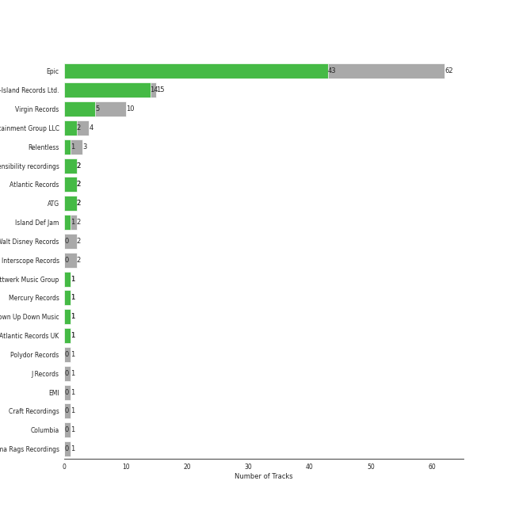

# neo mellow

[95 songs](neo_mellow_tracks.md)

## Top Artists

See all 22 artists

|   Number of Tracks | Art                                                                                              | Artist                                         | 🔗                                                           |
|-------------------:|:-------------------------------------------------------------------------------------------------|:-----------------------------------------------|:------------------------------------------------------------|
|                 59 |  | [Sara Bareilles](../artists/sara_bareilles.md) | [🔗](https://open.spotify.com/artist/2Sqr0DXoaYABbjBo9HaMkM) |
|                  7 |  | Erin McCarley                                  | [🔗](https://open.spotify.com/artist/6Y4bCmUNPDKqc7dHkVvgim) |
|                  7 |  | A Fine Frenzy                                  | [🔗](https://open.spotify.com/artist/5dTYaRzOn4rXGBLH052EeQ) |
|                  3 |  | KT Tunstall                                    | [🔗](https://open.spotify.com/artist/5zzrJD2jXrE9dZ1AklRFcL) |
|                  3 |  | Jason Mraz                                     | [🔗](https://open.spotify.com/artist/4phGZZrJZRo4ElhRtViYdl) |
|                  2 |  | Jon McLaughlin                                 | [🔗](https://open.spotify.com/artist/6z29S0IoiBJpSMP8plyCj7) |
|                  2 |  | The Civil Wars                                 | [🔗](https://open.spotify.com/artist/6J7rw7NELJUCThPbAfyLIE) |
|                  2 |  | The Script                                     | [🔗](https://open.spotify.com/artist/3AQRLZ9PuTAozP28Skbq8V) |
|                  1 |  | Christina Perri                                | [🔗](https://open.spotify.com/artist/7H55rcKCfwqkyDFH9wpKM6) |
|                  1 |  | Colbie Caillat                                 | [🔗](https://open.spotify.com/artist/6aZyMrc4doVtZyKNilOmwu) |
|                  1 |  | A Great Big World                              | [🔗](https://open.spotify.com/artist/5xKp3UyavIBUsGy3DQdXeF) |
|                  1 |  | Gary Jules                                     | [🔗](https://open.spotify.com/artist/5oRnbmgqvvq7fVlgk4vcEa) |
|                  1 |  | Gavin DeGraw                                   | [🔗](https://open.spotify.com/artist/5DYAABs8rkY9VhwtENoQCz) |
|                  1 |  | James Smith                                    | [🔗](https://open.spotify.com/artist/543ccHFPnZfJMD8tRGPtu7) |
|                  1 |  | Marc Broussard                                 | [🔗](https://open.spotify.com/artist/4cEwEednPwWCdYT7ZhROZe) |
|                  1 |  | Snow Patrol                                    | [🔗](https://open.spotify.com/artist/3rIZMv9rysU7JkLzEaC5Jp) |
|                  1 |  | Brandi Carlile                                 | [🔗](https://open.spotify.com/artist/2sG4zTOLvjKG1PSoOyf5Ej) |
|                  1 |  | Jordin Sparks                                  | [🔗](https://open.spotify.com/artist/2AQjGvtT0pFYfxR3neFcvz) |
|                  1 |  | Corinne Bailey Rae                             | [🔗](https://open.spotify.com/artist/29WzbAQtDnBJF09es0uddn) |
|                  1 |  | Christina Aguilera                             | [🔗](https://open.spotify.com/artist/1l7ZsJRRS8wlW3WfJfPfNS) |
|                  1 |  | Niall Horan                                    | [🔗](https://open.spotify.com/artist/1Hsdzj7Dlq2I7tHP7501T4) |
|                  1 |  | Michael Andrews                                | [🔗](https://open.spotify.com/artist/0RkqytrwoGyXGvDiZwT6i2) |

## Top Albums

See all 28 albums

|   Number of Tracks | Art                                                                                              | Album                                       | Release Date   | 🔗                                                          |
|-------------------:|:-------------------------------------------------------------------------------------------------|:--------------------------------------------|:---------------|:-----------------------------------------------------------|
|                 13 |  | Kaleidoscope Heart                          | 2010-09-07     | [🔗](https://open.spotify.com/album/627ukPRwYxyBREHxBq0vGJ) |
|                 12 |  | The Blessed Unrest                          | 2013-07-16     | [🔗](https://open.spotify.com/album/7lpbyGc4fHsQkBTsfWVBhp) |
|                 12 |  | Little Voice                                | 2007-07-03     | [🔗](https://open.spotify.com/album/2Z9WUERfMjOgQ6ze9TcGbF) |
|                 10 |  | Amidst the Chaos (Bonus Version)            | 2019-05-10     | [🔗](https://open.spotify.com/album/5x2sDapUIdq0qk1ezff3gm) |
|                  7 |  | Love, Save The Empty                        | 2009           | [🔗](https://open.spotify.com/album/1tF7625TFqvfzMbappj1pQ) |
|                  6 |  | What's Inside: Songs from Waitress          | 2015-11-06     | [🔗](https://open.spotify.com/album/1s6codM2ZAB008t9GTyaEk) |
|                  5 |  | Once Upon Another Time                      | 2012-05-22     | [🔗](https://open.spotify.com/album/1PrqYZJRzGNf8AsSOraxnZ) |
|                  3 |  | One Cell In The Sea                         | 2007           | [🔗](https://open.spotify.com/album/0Ot7MEgreG2R93aN42M9iK) |
|                  3 |  | Eye To The Telescope                        | 2005-01-01     | [🔗](https://open.spotify.com/album/3j70PDKieTWQAwas3bPHRZ) |
|                  3 |  | Bomb In A Birdcage                          | 2009-01-01     | [🔗](https://open.spotify.com/album/07IV5RxLvAUeZbcPm4zOzn) |
|                  2 |  | We Sing. We Dance. We Steal Things.         | 2008-05-12     | [🔗](https://open.spotify.com/album/04G0YylSjvDQZrjOfE5jA5) |
|                  2 |  | The Script                                  | 2008-07-14     | [🔗](https://open.spotify.com/album/1r5J0N6Ep181K0i8YuTYgO) |
|                  2 |  | Barton Hollow                               | 2011-02-01     | [🔗](https://open.spotify.com/album/4uWgDFxGAp7XlVSHuVBv4E) |
|                  1 |  | lovestrong.                                 | 2011-05-10     | [🔗](https://open.spotify.com/album/3XNK8vPk3O1rjhDZyOMJ6n) |
|                  1 |  | Trading Snakeoil for Wolftickets            | 2001-01-01     | [🔗](https://open.spotify.com/album/1OydCrx4m7fguwcX4stR9z) |
|                  1 |  | PINES                                       | 2012-01-01     | [🔗](https://open.spotify.com/album/1876e9QcHkJ3Hgo4NqKXBN) |
|                  1 |  | OK Now                                      | 2008-01-01     | [🔗](https://open.spotify.com/album/3fKJJQFV6a61fnKYDDj2LU) |
|                  1 |  | Little Love - EP                            | 2018-06-01     | [🔗](https://open.spotify.com/album/2PLM1yTphJeFZg01Xiaumc) |
|                  1 |  | Jordin Sparks                               | 2007-11-20     | [🔗](https://open.spotify.com/album/6JCNOvp9UeMrFuXwNW0JW6) |
|                  1 |  | Is There Anybody Out There?                 | 2014-01-20     | [🔗](https://open.spotify.com/album/1yOcLa4euMk9sV7rRJ89Dl) |
|                  1 |  | Indiana                                     | 2007-01-01     | [🔗](https://open.spotify.com/album/2UpO4j1Zpptiwk3wbUIWmU) |
|                  1 |  | Flicker (Deluxe)                            | 2017-10-20     | [🔗](https://open.spotify.com/album/7ahctQBwcSxDdP0fRAPo2p) |
|                  1 |  | Eyes Open                                   | 2006-01-01     | [🔗](https://open.spotify.com/album/3k7bXPw2u0C0SBKPMsgMS3) |
|                  1 |  | Corinne Bailey Rae                          | 2006-01-01     | [🔗](https://open.spotify.com/album/141Mp3P2VKHQMhtkW1DyQg) |
|                  1 |  | Chariot - Stripped                          | 2004-07-26     | [🔗](https://open.spotify.com/album/0Fm4Qx8IVHEEBYPeRzNUGI) |
|                  1 |  | Carencro                                    | 2004-08-03     | [🔗](https://open.spotify.com/album/15dP7BadtY55t9VvFlVrBA) |
|                  1 |  | Brave Enough: Live at the Variety Playhouse | 2013-10-22     | [🔗](https://open.spotify.com/album/7L4ZgnQqEhCEsV9GnMeXtE) |
|                  1 |  | Bear Creek                                  | 2012-06-01     | [🔗](https://open.spotify.com/album/5b8YTIrc88vdnfRguZqvVE) |

## Top Record Labels

See all 17 labels

|   Number of Tracks | Label                                             |
|-------------------:|:--------------------------------------------------|
|                 62 | [Epic](../labels/epic.md)                         |
|                 10 | [Virgin Records](../labels/virgin_records.md)     |
|                  7 | Universal (MT)                                    |
|                  3 | Relentless                                        |
|                  3 | [Atlantic Records](../labels/atlantic_records.md) |
|                  2 | sensibility recordings                            |
|                  2 | Phonogenic                                        |
|                  2 | Island Def Jam                                    |
|                  2 | EMI                                               |
|                  2 | ATG                                               |
|                  1 | [Polydor Records](../labels/polydor_records.md)   |
|                  1 | J Records                                         |
|                  1 | Island Records                                    |
|                  1 | Down Up Down Music                                |
|                  1 | [Columbia](../labels/columbia.md)                 |
|                  1 | Capitol Records (US1A)                            |
|                  1 | 19 Recordings Limited                             |

## Audio Features

| 10 most Danceable tracks        | 10 least Danceable tracks    |
|:--------------------------------|:-----------------------------|
| Little Black Dress              | Stay                         |
| Eden                            | Gravity                      |
| Electric Twist                  | Once Upon Another Time       |
| One Step At a Time              | Chariot                      |
| Black Horse And The Cherry Tree | Poison & Wine                |
| Blow Away                       | City                         |
| Put Your Records On             | Come Round Soon              |
| Slow Hands                      | Bluebird                     |
| I Choose You                    | Bright Lights and Cityscapes |
| I'm Yours                       | Mad World                    |

| 10 most Energetic tracks    | 10 least Energetic tracks                                                         |
|:----------------------------|:----------------------------------------------------------------------------------|
| Hello/Goodbye               | Kaleidoscope Heart                                                                |
| Bad Idea (feat. Jason Mraz) | Mad World                                                                         |
| Morningside                 | Goodbye Yellow Brick Road - Live at the Variety Playhouse, Atlanta, GA - May 2013 |
| SleepWalking                | Say Something                                                                     |
| Let The Rain                | Manhattan                                                                         |
| Love, Save The Empty        | Bright Lights and Cityscapes                                                      |
| Bobble Head                 | Poison & Wine                                                                     |
| Fairytale                   | Bluebird                                                                          |
| Brave                       | Once Upon Another Time                                                            |
| Industry                    | Just The Way You Are                                                              |

| 10 most Speechy tracks          | 10 least Speechy tracks    |
|:--------------------------------|:---------------------------|
| Home                            | Satellite Call             |
| Electric Twist                  | Breakeven                  |
| Opening Up                      | Whisper                    |
| Kaleidoscope Heart              | Pitter-Pat                 |
| Come Round Soon                 | Machine Gun                |
| Bad Idea (feat. Jason Mraz)     | Orpheus                    |
| Black Horse And The Cherry Tree | Chasing Cars               |
| Fire                            | Sweet As Whole             |
| Eden                            | Breathe Again              |
| Little Black Dress              | The Man Who Can't Be Moved |

| 10 most Acoustic tracks                                                           | 10 least Acoustic tracks    |
|:----------------------------------------------------------------------------------|:----------------------------|
| Bright Lights and Cityscapes                                                      | Now Is The Start            |
| Mad World                                                                         | Brave                       |
| Manhattan                                                                         | Many the Miles              |
| Goodbye Yellow Brick Road - Live at the Variety Playhouse, Atlanta, GA - May 2013 | Vegas                       |
| Almost Lover                                                                      | Slow Hands                  |
| Bluebird                                                                          | Bad Idea (feat. Jason Mraz) |
| What's Inside                                                                     | Wicked Love                 |
| Just The Way You Are                                                              | Gonna Get Over You          |
| Once Upon Another Time                                                            | Love Song                   |
| Miss Simone                                                                       | It's Not That Easy          |

| 10 most Instrumental tracks   | 10 least Instrumental tracks   |
|:------------------------------|:-------------------------------|
| Now Is The Start              | Say You're Sorry               |
| Satellite Call                | Little Black Dress             |
| Islands                       | If I Can't Have You            |
| Armor                         | Everything Changes             |
| Breathe Again                 | Bad Idea (feat. Jason Mraz)    |
| Miss Simone                   | Opening Up                     |
| The Light                     | She Used To Be Mine            |
| No Such Thing                 | Chariot                        |
| Whisper                       | Jar of Hearts                  |
| Fire                          | Lucky                          |

| 10 most Live tracks                                                               | 10 least Live tracks   |
|:----------------------------------------------------------------------------------|:-----------------------|
| Goodbye Yellow Brick Road - Live at the Variety Playhouse, Atlanta, GA - May 2013 | Uncharted              |
| Home                                                                              | One Step At a Time     |
| Ashes And Wine                                                                    | Brave                  |
| Chariot                                                                           | Eden                   |
| Fire                                                                              | Chasing The Sun        |
| Black Horse And The Cherry Tree                                                   | Slow Hands             |
| Let The Rain                                                                      | King of Anything       |
| It's Not That Easy                                                                | The Light              |
| Pitter-Pat                                                                        | Islands                |
| SleepWalking                                                                      | Blow Away              |

| 10 most Happy tracks            | 10 least Happy tracks   |
|:--------------------------------|:------------------------|
| I Choose You                    | Once Upon Another Time  |
| Black Horse And The Cherry Tree | Say Something           |
| Blow Away                       | Islands                 |
| Electric Twist                  | Jar of Hearts           |
| Slow Hands                      | Everything Changes      |
| Say You're Sorry                | We All Need Saving      |
| King of Anything                | Chasing Cars            |
| Lie To Me                       | Bluebird                |
| Home                            | What's Inside           |
| I Didn't Plan It                | Almost Lover            |
