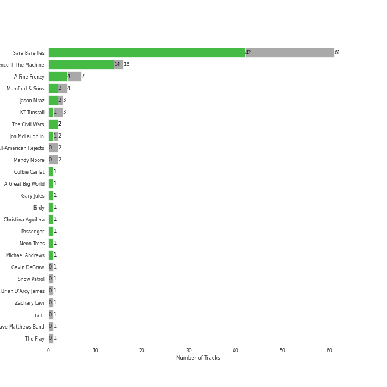

# neo mellow

[91 songs](tracks.md)

## Top Artists

| Art | Tracks | 💚 | Artist | 🔗 |
|:---|---:|---:|:---|:---|
|  | 59 | 41 | [Sara Bareilles](../../artists/sara_bareilles/overview.md) | [🔗](https://open.spotify.com/artist/2Sqr0DXoaYABbjBo9HaMkM) |
|  | 7 | 4 | A Fine Frenzy | [🔗](https://open.spotify.com/artist/5dTYaRzOn4rXGBLH052EeQ) |
|  | 4 | 2 | Mumford & Sons | [🔗](https://open.spotify.com/artist/3gd8FJtBJtkRxdfbTu19U2) |
|  | 3 | 2 | Jason Mraz | [🔗](https://open.spotify.com/artist/4phGZZrJZRo4ElhRtViYdl) |
|  | 2 | 2 | The Civil Wars | [🔗](https://open.spotify.com/artist/6J7rw7NELJUCThPbAfyLIE) |
|  | 2 | 2 | The Script | [🔗](https://open.spotify.com/artist/3AQRLZ9PuTAozP28Skbq8V) |
|  | 3 | 1 | KT Tunstall | [🔗](https://open.spotify.com/artist/5zzrJD2jXrE9dZ1AklRFcL) |
|  | 2 | 1 | Jon McLaughlin | [🔗](https://open.spotify.com/artist/6z29S0IoiBJpSMP8plyCj7) |
|  | 1 | 1 | Alanis Morissette | [🔗](https://open.spotify.com/artist/6ogn9necmbUdCppmNnGOdi) |
|  | 1 | 1 | Colbie Caillat | [🔗](https://open.spotify.com/artist/6aZyMrc4doVtZyKNilOmwu) |

See all 21 artists

| Art | Tracks | 💚 | Artist | 🔗 |
|:---|---:|---:|:---|:---|
|  | 1 | 1 | A Great Big World | [🔗](https://open.spotify.com/artist/5xKp3UyavIBUsGy3DQdXeF) |
|  | 1 | 1 | Gary Jules | [🔗](https://open.spotify.com/artist/5oRnbmgqvvq7fVlgk4vcEa) |
|  | 1 | 1 | Birdy | [🔗](https://open.spotify.com/artist/2WX2uTcsvV5OnS0inACecP) |
|  | 1 | 1 | Christina Aguilera | [🔗](https://open.spotify.com/artist/1l7ZsJRRS8wlW3WfJfPfNS) |
|  | 1 | 1 | Neon Trees | [🔗](https://open.spotify.com/artist/0RpddSzUHfncUWNJXKOsjy) |
|  | 1 | 1 | Michael Andrews | [🔗](https://open.spotify.com/artist/0RkqytrwoGyXGvDiZwT6i2) |
|  | 2 | 0 | Mandy Moore | [🔗](https://open.spotify.com/artist/2LJxr7Pt3JnP60eLxwbDOu) |
|  | 1 | 0 | Christina Perri | [🔗](https://open.spotify.com/artist/7H55rcKCfwqkyDFH9wpKM6) |
|  | 1 | 0 | Gavin DeGraw | [🔗](https://open.spotify.com/artist/5DYAABs8rkY9VhwtENoQCz) |
|  | 1 | 0 | Snow Patrol | [🔗](https://open.spotify.com/artist/3rIZMv9rysU7JkLzEaC5Jp) |
|  | 1 | 0 | Zachary Levi | [🔗](https://open.spotify.com/artist/3XSyTI9ct70ZheMESAv2st) |

## Top Albums

| Art | Tracks | 💚 | Album | Release Date | 🔗 |
|:---|---:|---:|:---|:---|:---|
|  | 13 | 10 | Kaleidoscope Heart | 2010-09-07 | [🔗](https://open.spotify.com/album/627ukPRwYxyBREHxBq0vGJ) |
|  | 12 | 11 | The Blessed Unrest | 2013-07-16 | [🔗](https://open.spotify.com/album/7lpbyGc4fHsQkBTsfWVBhp) |
|  | 12 | 8 | Little Voice | 2007-07-03 | [🔗](https://open.spotify.com/album/2Z9WUERfMjOgQ6ze9TcGbF) |
|  | 10 | 6 | Amidst the Chaos (Bonus Version) | 2019-05-10 | [🔗](https://open.spotify.com/album/5x2sDapUIdq0qk1ezff3gm) |
|  | 6 | 1 | What's Inside: Songs from Waitress | 2015-11-06 | [🔗](https://open.spotify.com/album/1s6codM2ZAB008t9GTyaEk) |
|  | 5 | 5 | Once Upon Another Time | 2012-05-22 | [🔗](https://open.spotify.com/album/1PrqYZJRzGNf8AsSOraxnZ) |
|  | 3 | 2 | One Cell In The Sea | 2007 | [🔗](https://open.spotify.com/album/0Ot7MEgreG2R93aN42M9iK) |
|  | 3 | 2 | Bomb In A Birdcage | 2009-01-01 | [🔗](https://open.spotify.com/album/07IV5RxLvAUeZbcPm4zOzn) |
|  | 3 | 1 | Sigh No More | 2009-10-02 | [🔗](https://open.spotify.com/album/6w5W6ZGTvDsppKUOiGMuMo) |
|  | 3 | 1 | Eye To The Telescope | 2005-01-01 | [🔗](https://open.spotify.com/album/3j70PDKieTWQAwas3bPHRZ) |

See all 27 albums

| Art | Tracks | 💚 | Album | Release Date | 🔗 |
|:---|---:|---:|:---|:---|:---|
|  | 2 | 2 | We Sing. We Dance. We Steal Things. | 2008-05-12 | [🔗](https://open.spotify.com/album/04G0YylSjvDQZrjOfE5jA5) |
|  | 2 | 2 | The Script | 2008-07-14 | [🔗](https://open.spotify.com/album/1r5J0N6Ep181K0i8YuTYgO) |
|  | 2 | 2 | Barton Hollow | 2011-02-01 | [🔗](https://open.spotify.com/album/4uWgDFxGAp7XlVSHuVBv4E) |
|  | 2 | 0 | Tangled | 2010-01-01 | [🔗](https://open.spotify.com/album/1l0aFrH24oPrQSqGtfeFyE) |
|  | 1 | 1 | Trading Snakeoil for Wolftickets | 2001-01-01 | [🔗](https://open.spotify.com/album/1OydCrx4m7fguwcX4stR9z) |
|  | 1 | 1 | Picture Show | 2012-01-01 | [🔗](https://open.spotify.com/album/0uRFz92JmjwDbZbB7hEBIr) |
|  | 1 | 1 | OK Now | 2008-01-01 | [🔗](https://open.spotify.com/album/3fKJJQFV6a61fnKYDDj2LU) |
|  | 1 | 1 | Jagged Little Pill | 1995-06-09 | [🔗](https://open.spotify.com/album/09AwlP99cHfKVNKv4FC8VW) |
|  | 1 | 1 | Is There Anybody Out There? | 2014-01-20 | [🔗](https://open.spotify.com/album/1yOcLa4euMk9sV7rRJ89Dl) |
|  | 1 | 1 | Birdy | 2011-11-04 | [🔗](https://open.spotify.com/album/1WGjSVIw0TVfbp5KrOFiP0) |
|  | 1 | 1 | Babel (Deluxe Version) | 2012-09-25 | [🔗](https://open.spotify.com/album/3FfuUD3Je9t9tQq80Zq41y) |
|  | 1 | 0 | lovestrong. | 2011-05-10 | [🔗](https://open.spotify.com/album/3XNK8vPk3O1rjhDZyOMJ6n) |
|  | 1 | 0 | PINES | 2012-01-01 | [🔗](https://open.spotify.com/album/1876e9QcHkJ3Hgo4NqKXBN) |
|  | 1 | 0 | Indiana | 2007-01-01 | [🔗](https://open.spotify.com/album/2UpO4j1Zpptiwk3wbUIWmU) |
|  | 1 | 0 | Eyes Open | 2006-01-01 | [🔗](https://open.spotify.com/album/3k7bXPw2u0C0SBKPMsgMS3) |
|  | 1 | 0 | Chariot - Stripped | 2004-07-26 | [🔗](https://open.spotify.com/album/0Fm4Qx8IVHEEBYPeRzNUGI) |
|  | 1 | 0 | Brave Enough: Live at the Variety Playhouse | 2013-10-22 | [🔗](https://open.spotify.com/album/7L4ZgnQqEhCEsV9GnMeXtE) |

## Top Record Labels

| Tracks | 💚 | Label |
|---:|---:|:---|
| 62 | 44 | [Epic](../../labels/epic/overview.md) |
| 10 | 5 | [Virgin Records](../../labels/virgin_records/overview.md) |
| 4 | 2 | Glassnote Entertainment Group LLC |
| 3 | 2 | [Atlantic Records](../../labels/atlantic_records/overview.md) |
| 2 | 2 | sensibility recordings |
| 2 | 2 | Phonogenic |
| 2 | 2 | ATG |
| 3 | 1 | Relentless |
| 2 | 1 | Island Def Jam |
| 1 | 1 | Mercury Records |

See all 16 labels

| Tracks | 💚 | Label |
|---:|---:|:---|
| 1 | 1 | Maverick |
| 1 | 1 | Down Up Down Music |
| 1 | 1 | Atlantic Records UK |
| 2 | 0 | [Walt Disney Records](../../labels/walt_disney_records/overview.md) |
| 1 | 0 | [Polydor Records](../../labels/polydor_records/overview.md) |
| 1 | 0 | J Records |

## Years

| 10 newest albums | 10 oldest albums |
|:---|:---|
| 
 Amidst the Chaos (Bonus Version) (2019-05-10)
 | 
 Jagged Little Pill (1995-06-09)
 |
| 
 What's Inside: Songs from Waitress (2015-11-06)
 | 
 Trading Snakeoil for Wolftickets (2001-01-01)
 |
| 
 Is There Anybody Out There? (2014-01-20)
 | 
 Chariot - Stripped (2004-07-26)
 |
| 
 Brave Enough: Live at the Variety Playhouse (2013-10-22)
 | 
 Eye To The Telescope (2005-01-01)
 |
| 
 The Blessed Unrest (2013-07-16)
 | 
 Eyes Open (2006-01-01)
 |
| 
 Babel (Deluxe Version) (2012-09-25)
 | 
 One Cell In The Sea (2007)
 |
| 
 Once Upon Another Time (2012-05-22)
 | 
 Indiana (2007-01-01)
 |
| 
 PINES (2012-01-01)
 | 
 Little Voice (2007-07-03)
 |
| 
 Picture Show (2012-01-01)
 | 
 OK Now (2008-01-01)
 |
| 
 Birdy (2011-11-04)
 | 
 We Sing. We Dance. We Steal Things. (2008-05-12)
 |
## Audio Features

| 10 most Danceable tracks | 10 least Danceable tracks |
|:---|:---|
| Little Black Dress (0.787) | Stay (0.262) |
| Eden (0.776) | Gravity (0.27) |
| Electric Twist (0.773) | Once Upon Another Time (0.275) |
| Black Horse And The Cherry Tree (0.748) | Chariot (0.281) |
| Blow Away (0.747) | I See the Light - From "Tangled" / Soundtrack Version (0.281) |
| I Choose You (0.731) | Poison & Wine (0.285) |
| I'm Yours (0.703) | City (0.319) |
| I Didn't Plan It (0.695) | Come Round Soon (0.338) |
| Let The Rain (0.694) | Bluebird (0.34) |
| Lie To Me (0.683) | Bright Lights and Cityscapes (0.343) |

| 10 most Energetic tracks | 10 least Energetic tracks |
|:---|:---|
| Everybody Talks (0.924) | Kaleidoscope Heart (0.0516) |
| Bad Idea (feat. Jason Mraz) (0.889) | Mad World (0.0585) |
| Morningside (0.88) | Goodbye Yellow Brick Road - Live at the Variety Playhouse, Atlanta, GA - May 2013 (0.114) |
| Let The Rain (0.873) | I See the Light - From "Tangled" / Soundtrack Version (0.139) |
| Fairytale (0.857) | Say Something (0.147) |
| Brave (0.836) | Manhattan (0.168) |
| Industry (0.831) | Bright Lights and Cityscapes (0.184) |
| You Oughta Know (0.831) | Poison & Wine (0.186) |
| Love On the Rocks (0.819) | Bluebird (0.203) |
| Come Round Soon (0.819) | Once Upon Another Time (0.216) |

| 10 most Speechy tracks | 10 least Speechy tracks |
|:---|:---|
| Electric Twist (0.125) | Satellite Call (0.0241) |
| Opening Up (0.0936) | Breakeven (0.0242) |
| Kaleidoscope Heart (0.0927) | Whisper (0.0252) |
| Come Round Soon (0.0776) | Machine Gun (0.0268) |
| Bad Idea (feat. Jason Mraz) (0.0704) | Orpheus (0.0269) |
| Black Horse And The Cherry Tree (0.0641) | Little Lion Man (0.0272) |
| Everybody Talks (0.0586) | Chasing Cars (0.0274) |
| Fire (0.057) | Sweet As Whole (0.0275) |
| Eden (0.0562) | Breathe Again (0.0278) |
| You Oughta Know (0.0557) | The Man Who Can't Be Moved (0.0279) |

| 10 most Acoustic tracks | 10 least Acoustic tracks |
|:---|:---|
| Bright Lights and Cityscapes (0.977) | Now Is The Start (0.00124) |
| Mad World (0.976) | Everybody Talks (0.00301) |
| Manhattan (0.972) | Brave (0.00502) |
| Goodbye Yellow Brick Road - Live at the Variety Playhouse, Atlanta, GA - May 2013 (0.959) | Many the Miles (0.00796) |
| Skinny Love (0.952) | Vegas (0.00881) |
| Almost Lover (0.947) | I Will Wait (0.00974) |
| Bluebird (0.933) | Bad Idea (feat. Jason Mraz) (0.0168) |
| What's Inside (0.919) | Wicked Love (0.0178) |
| Once Upon Another Time (0.896) | Gonna Get Over You (0.0199) |
| Miss Simone (0.859) | Love Song (0.0208) |

| 10 most Instrumental tracks | 10 least Instrumental tracks |
|:---|:---|
| Now Is The Start (0.0353) | Say You're Sorry (0.0) |
| Satellite Call (0.0318) | When Will My Life Begin? - From "Tangled" / Soundtrack Version (0.0) |
| Islands (0.0261) | Sweet As Whole (0.0) |
| Armor (0.0145) | Chariot (0.0) |
| I Will Wait (0.00717) | You Oughta Know (0.0) |
| Breathe Again (0.00655) | Jar of Hearts (0.0) |
| Miss Simone (0.00407) | Lucky (0.0) |
| The Light (0.00375) | Come Round Soon (0.0) |
| No Such Thing (0.00175) | Black Horse And The Cherry Tree (0.0) |
| Whisper (0.00168) | Kaleidoscope Heart (0.0) |

| 10 most Live tracks | 10 least Live tracks |
|:---|:---|
| Goodbye Yellow Brick Road - Live at the Variety Playhouse, Atlanta, GA - May 2013 (0.781) | Uncharted (0.0343) |
| You Oughta Know (0.736) | Brave (0.0425) |
| Ashes And Wine (0.379) | Eden (0.0456) |
| Chariot (0.37) | Chasing The Sun (0.0497) |
| Fire (0.363) | King of Anything (0.0574) |
| Black Horse And The Cherry Tree (0.34) | The Light (0.0691) |
| Everybody Talks (0.313) | Islands (0.0699) |
| I Will Wait (0.312) | Blow Away (0.0701) |
| Let The Rain (0.297) | Whisper (0.0708) |
| Not Alone (0.256) | I See the Light - From "Tangled" / Soundtrack Version (0.0725) |

| 10 most Happy tracks | 10 least Happy tracks |
|:---|:---|
| I Choose You (0.947) | Once Upon Another Time (0.0551) |
| Black Horse And The Cherry Tree (0.917) | Say Something (0.0765) |
| Blow Away (0.891) | Islands (0.0863) |
| Electric Twist (0.858) | Jar of Hearts (0.0886) |
| Say You're Sorry (0.846) | Timshel (0.0954) |
| King of Anything (0.81) | Everything Changes (0.0983) |
| Lie To Me (0.795) | We All Need Saving (0.117) |
| I Didn't Plan It (0.787) | Chasing Cars (0.144) |
| Bad Idea (feat. Jason Mraz) (0.787) | Bluebird (0.161) |
| Morningside (0.785) | What's Inside (0.162) |
