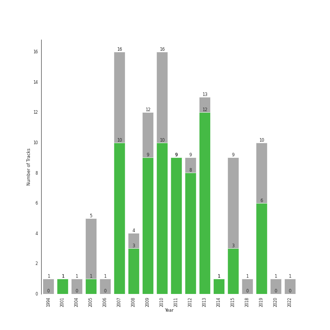

# neo mellow

111 songs

[See Track Features](audio_features.md)

[See Clusters](clusters/overview.md)

## Top Artists

| Art | Tracks | 💚 | Artist | 🔗 |
|:---|---:|---:|:---|:---|
|  | 61 | 40 | [Sara Bareilles](../../artists/sara_bareilles/overview.md) | [🔗](https://open.spotify.com/artist/2Sqr0DXoaYABbjBo9HaMkM) |
|  | 16 | 14 | [Florence + The Machine](../../artists/florence_+_the_machine/overview.md) | [🔗](https://open.spotify.com/artist/1moxjboGR7GNWYIMWsRjgG) |
|  | 7 | 4 | A Fine Frenzy | [🔗](https://open.spotify.com/artist/5dTYaRzOn4rXGBLH052EeQ) |
|  | 4 | 2 | Mumford & Sons | [🔗](https://open.spotify.com/artist/3gd8FJtBJtkRxdfbTu19U2) |
|  | 3 | 2 | Jason Mraz | [🔗](https://open.spotify.com/artist/4phGZZrJZRo4ElhRtViYdl) |
|  | 2 | 2 | The Civil Wars | [🔗](https://open.spotify.com/artist/6J7rw7NELJUCThPbAfyLIE) |
|  | 3 | 1 | KT Tunstall | [🔗](https://open.spotify.com/artist/5zzrJD2jXrE9dZ1AklRFcL) |
|  | 2 | 1 | Jon McLaughlin | [🔗](https://open.spotify.com/artist/6z29S0IoiBJpSMP8plyCj7) |
|  | 1 | 1 | Alanis Morissette | [🔗](https://open.spotify.com/artist/6ogn9necmbUdCppmNnGOdi) |
|  | 1 | 1 | Colbie Caillat | [🔗](https://open.spotify.com/artist/6aZyMrc4doVtZyKNilOmwu) |

See all 25 artists

| Art | Tracks | 💚 | Artist | 🔗 |
|:---|---:|---:|:---|:---|
|  | 1 | 1 | A Great Big World | [🔗](https://open.spotify.com/artist/5xKp3UyavIBUsGy3DQdXeF) |
|  | 1 | 1 | Gary Jules | [🔗](https://open.spotify.com/artist/5oRnbmgqvvq7fVlgk4vcEa) |
|  | 1 | 1 | Birdy | [🔗](https://open.spotify.com/artist/2WX2uTcsvV5OnS0inACecP) |
|  | 1 | 1 | Christina Aguilera | [🔗](https://open.spotify.com/artist/1l7ZsJRRS8wlW3WfJfPfNS) |
|  | 1 | 1 | Passenger | [🔗](https://open.spotify.com/artist/0gadJ2b9A4SKsB1RFkBb66) |
|  | 1 | 1 | Neon Trees | [🔗](https://open.spotify.com/artist/0RpddSzUHfncUWNJXKOsjy) |
|  | 1 | 1 | Michael Andrews | [🔗](https://open.spotify.com/artist/0RkqytrwoGyXGvDiZwT6i2) |
|  | 2 | 0 | The All-American Rejects | [🔗](https://open.spotify.com/artist/3vAaWhdBR38Q02ohXqaNHT) |
|  | 2 | 0 | Mandy Moore | [🔗](https://open.spotify.com/artist/2LJxr7Pt3JnP60eLxwbDOu) |
|  | 1 | 0 | Gavin DeGraw | [🔗](https://open.spotify.com/artist/5DYAABs8rkY9VhwtENoQCz) |
|  | 1 | 0 | Snow Patrol | [🔗](https://open.spotify.com/artist/3rIZMv9rysU7JkLzEaC5Jp) |
|  | 1 | 0 | Brian D'Arcy James | [🔗](https://open.spotify.com/artist/3oYQrBzEQNpxnjWXP54B4n) |
| | 1 | 0 | Zachary Levi | [🔗](https://open.spotify.com/artist/3XSyTI9ct70ZheMESAv2st) |
|  | 1 | 0 | Train | [🔗](https://open.spotify.com/artist/3FUY2gzHeIiaesXtOAdB7A) |
|  | 1 | 0 | The Fray | [🔗](https://open.spotify.com/artist/0zOcE3mg9nS6l3yxt1Y0bK) |

## Most and least listened tracks
| ​ | Most listened tracks | Rank | ​​ | Least listened tracks | Rank |
|:---|:---|---:|:---|:---|---:|
|  | [Many the Miles](../../artists/sara_bareilles/overview.md) | 239 |  | [Say You're Sorry](../../artists/sara_bareilles/overview.md) | nan |
|  | [Lie To Me](../../artists/sara_bareilles/overview.md) | 318 |  | When Will My Life Begin? - From "Tangled" / Soundtrack Version | nan |
|  | [I Choose You](../../artists/sara_bareilles/overview.md) | 362 |  | [Sweet As Whole](../../artists/sara_bareilles/overview.md) | nan |
|  | [Machine Gun](../../artists/sara_bareilles/overview.md) | 383 |  | Chariot | nan |
|  | [Fairytale](../../artists/sara_bareilles/overview.md) | 384 |  | You Oughta Know | nan |
|  | Poison & Wine | 395 |  | [You've Got The Love](../../artists/florence_+_the_machine/overview.md) | nan |
|  | [Between the Lines](../../artists/sara_bareilles/overview.md) | 452 |  | [Satellite Call](../../artists/sara_bareilles/overview.md) | nan |
|  | [What The Water Gave Me](../../artists/florence_+_the_machine/overview.md) | 457 |  | [Breathe Again](../../artists/sara_bareilles/overview.md) | nan |
|  | [Not Alone](../../artists/sara_bareilles/overview.md) | 523 |  | [Kiss With A Fist](../../artists/florence_+_the_machine/overview.md) | nan |
|  | Everybody Talks | 552 |  | [Manhattan](../../artists/sara_bareilles/overview.md) | nan |

## Top Albums

| Art | Tracks | 💚 | Album | Release Date | 🔗 |
|:---|---:|---:|:---|:---|:---|
|  | 13 | 10 | Kaleidoscope Heart | 2010-09-07 | [🔗](https://open.spotify.com/album/627ukPRwYxyBREHxBq0vGJ) |
|  | 12 | 12 | The Blessed Unrest | 2013-07-16 | [🔗](https://open.spotify.com/album/7lpbyGc4fHsQkBTsfWVBhp) |
|  | 12 | 8 | Little Voice | 2007-07-03 | [🔗](https://open.spotify.com/album/2Z9WUERfMjOgQ6ze9TcGbF) |
|  | 10 | 5 | Amidst the Chaos (Bonus Version) | 2019-05-10 | [🔗](https://open.spotify.com/album/5x2sDapUIdq0qk1ezff3gm) |
|  | 6 | 6 | Lungs | 2009-01-01 | [🔗](https://open.spotify.com/album/2KAK58PimXHF4lSoKO3RxA) |
|  | 6 | 6 | Ceremonials (Deluxe Edition) | 2011-01-01 | [🔗](https://open.spotify.com/album/5SxudoALxEAVh9l83kSebx) |
|  | 6 | 1 | What's Inside: Songs from Waitress | 2015-11-06 | [🔗](https://open.spotify.com/album/1s6codM2ZAB008t9GTyaEk) |
|  | 5 | 4 | Once Upon Another Time | 2012-05-22 | [🔗](https://open.spotify.com/album/1PrqYZJRzGNf8AsSOraxnZ) |
|  | 3 | 2 | One Cell In The Sea | 2007 | [🔗](https://open.spotify.com/album/0Ot7MEgreG2R93aN42M9iK) |
|  | 3 | 2 | How Big, How Blue, How Beautiful | 2015-06-01 | [🔗](https://open.spotify.com/album/2btszoya78vyT8fwelmVnz) |

See all 36 albums

| Art | Tracks | 💚 | Album | Release Date | 🔗 |
|:---|---:|---:|:---|:---|:---|
|  | 3 | 2 | Bomb In A Birdcage | 2009-01-01 | [🔗](https://open.spotify.com/album/07IV5RxLvAUeZbcPm4zOzn) |
|  | 3 | 1 | Sigh No More | 2009-10-02 | [🔗](https://open.spotify.com/album/6w5W6ZGTvDsppKUOiGMuMo) |
|  | 3 | 1 | Eye To The Telescope | 2005-01-01 | [🔗](https://open.spotify.com/album/3j70PDKieTWQAwas3bPHRZ) |
|  | 2 | 2 | We Sing. We Dance. We Steal Things. | 2008-05-12 | [🔗](https://open.spotify.com/album/04G0YylSjvDQZrjOfE5jA5) |
|  | 2 | 2 | Barton Hollow | 2011-02-01 | [🔗](https://open.spotify.com/album/4uWgDFxGAp7XlVSHuVBv4E) |
|  | 2 | 0 | Tangled | 2010-01-01 | [🔗](https://open.spotify.com/album/1l0aFrH24oPrQSqGtfeFyE) |
|  | 1 | 1 | Trading Snakeoil for Wolftickets | 2001-01-01 | [🔗](https://open.spotify.com/album/1OydCrx4m7fguwcX4stR9z) |
|  | 1 | 1 | Picture Show | 2012-01-01 | [🔗](https://open.spotify.com/album/0uRFz92JmjwDbZbB7hEBIr) |
|  | 1 | 1 | OK Now | 2008-01-01 | [🔗](https://open.spotify.com/album/3fKJJQFV6a61fnKYDDj2LU) |
|  | 1 | 1 | Jagged Little Pill | 1995-06-09 | [🔗](https://open.spotify.com/album/09AwlP99cHfKVNKv4FC8VW) |
|  | 1 | 1 | Is There Anybody Out There? | 2014-01-20 | [🔗](https://open.spotify.com/album/1yOcLa4euMk9sV7rRJ89Dl) |
|  | 1 | 1 | Birdy | 2011-11-04 | [🔗](https://open.spotify.com/album/1WGjSVIw0TVfbp5KrOFiP0) |
|  | 1 | 1 | Babel (Deluxe Version) | 2012-09-25 | [🔗](https://open.spotify.com/album/3FfuUD3Je9t9tQq80Zq41y) |
|  | 1 | 1 | All The Little Lights | 2012-08-28 | [🔗](https://open.spotify.com/album/52ukyDfkPmF4X6EcSYVfVJ) |
|  | 1 | 0 | When The World Comes Down | 2008-01-01 | [🔗](https://open.spotify.com/album/3BCMpDOcQlbCZpf5vnTadZ) |
|  | 1 | 0 | Save Me, San Francisco (Golden Gate Edition) | 2010-12-01 | [🔗](https://open.spotify.com/album/1CwXS6MAz8Wo7K4TzW9iuR) |
|  | 1 | 0 | PINES | 2012-01-01 | [🔗](https://open.spotify.com/album/1876e9QcHkJ3Hgo4NqKXBN) |
|  | 1 | 0 | Move Along | 2005-01-01 | [🔗](https://open.spotify.com/album/3PWEGZ6CYvXRnr0JCECsDe) |
|  | 1 | 0 | More Love - Songs from Little Voice Season One | 2020-09-04 | [🔗](https://open.spotify.com/album/52fzvqGSm991mT6pBgAS6g) |
|  | 1 | 0 | Into The Woods (2022 Broadway Cast Recording) | 2022-09-30 | [🔗](https://open.spotify.com/album/5z6BFXI711HbSAXDjgOAHE) |
|  | 1 | 0 | Indiana | 2007-01-01 | [🔗](https://open.spotify.com/album/2UpO4j1Zpptiwk3wbUIWmU) |
|  | 1 | 0 | How To Save A Life | 2005-09-13 | [🔗](https://open.spotify.com/album/1IM3GwptCGYjRkzCBolyFK) |
|  | 1 | 0 | High As Hope | 2018-06-29 | [🔗](https://open.spotify.com/album/0pKZJj9GzcKPCS8r4IaksA) |
|  | 1 | 0 | Eyes Open | 2006-01-01 | [🔗](https://open.spotify.com/album/3k7bXPw2u0C0SBKPMsgMS3) |
|  | 1 | 0 | Chariot - Stripped | 2004-07-26 | [🔗](https://open.spotify.com/album/0Fm4Qx8IVHEEBYPeRzNUGI) |
|  | 1 | 0 | Brave Enough: Live at the Variety Playhouse | 2013-10-22 | [🔗](https://open.spotify.com/album/7L4ZgnQqEhCEsV9GnMeXtE) |

## Top Record Labels

| Tracks | 💚 | Label |
|---:|---:|:---|
| 62 | 41 | [Epic](../../labels/epic/overview.md) |
| 15 | 14 | [Universal-Island Records Ltd.](../../labels/universal-island_records_ltd_/overview.md) |
| 10 | 5 | [Virgin Records](../../labels/virgin_records/overview.md) |
| 4 | 2 | Glassnote Entertainment Group LLC |
| 2 | 2 | sensibility recordings |
| 2 | 2 | [Atlantic Records](../../labels/atlantic_records/overview.md) |
| 2 | 2 | ATG |
| 3 | 1 | Relentless |
| 2 | 1 | Island Def Jam |
| 1 | 1 | Nettwerk Music Group |

See all 21 labels

| Tracks | 💚 | Label |
|---:|---:|:---|
| 1 | 1 | Mercury Records |
| 1 | 1 | Maverick |
| 1 | 1 | Down Up Down Music |
| 1 | 1 | Atlantic Records UK |
| 2 | 0 | [Walt Disney Records](../../labels/walt_disney_records/overview.md) |
| 2 | 0 | [Interscope Records](../../labels/interscope_records/overview.md) |
| 1 | 0 | [Polydor Records](../../labels/polydor_records/overview.md) |
| 1 | 0 | J Records |
| 1 | 0 | [EMI](../../labels/emi/overview.md) |
| 1 | 0 | [Craft Recordings](../../labels/craft_recordings/overview.md) |
| 1 | 0 | [Columbia](../../labels/columbia/overview.md) |

## Top Producers

| Art | Producer | Tracks | Credit Types |
|:---|:---|---:|:---|
|  | [Sara Bareilles](../../artists/sara_bareilles/overview.md) | 31 | Lyricist, Songwriter, Producer |
| | [Florence Welch](../../producers/florence_welch/overview.md) | 13 | Songwriter, Lyricist |
| | John O'Mahony | 9 | Producer |
| | [Paul Epworth](../../producers/paul_epworth/overview.md) | 7 | Producer, Lyricist, Songwriter |
| | Kurt Uenala | 7 | Producer |
| | Isabella Summers | 6 | Songwriter, Producer, Lyricist |
| | Neal Avron | 6 | Arranger, Producer |
| | T-Bone Burnett | 5 | Producer |
| | Jason Wormer | 5 | Producer |
| | Cenzo Townshend | 4 | Producer |

View all

| Art | Producer | Tracks | Credit Types |
|:---|:---|---:|:---|
| | Craig Silvey | 4 | Producer |
| | Markus Dravs | 4 | Producer |
| | Sally Herbert | 3 | Arranger |
| | Mark Endert | 3 | Producer |
| | Jimmy Robertson | 3 | Producer |
| | Robin Baynton | 3 | Producer |
| | James Ford | 3 | Producer |
| | [Kid Harpoon](../../producers/kid_harpoon/overview.md) | 2 | Songwriter |
|  | Mumford & Sons | 2 | Arranger |
|  | Jason Mraz | 2 | Lyricist, Songwriter, Producer |
| | Alison Sudol | 2 | Lyricist, Songwriter |
| | Jeremy Darby | 2 | Producer |
| | Lukas Burton | 2 | Producer, Songwriter |
| | Ted Dwane | 2 | Songwriter |
| | Tom Elmhirst | 2 | Producer |
| | Martin Terefe | 2 | Producer |
| | Matt Hales | 2 | Songwriter |
| | Bullion | 2 | Producer |
| | Todor Kobakov | 2 | Arranger |
| | Winston Marshall | 2 | Songwriter |
| | Hal Cragin | 2 | Producer, Songwriter |
| | [Jack Antonoff](../../producers/jack_antonoff/overview.md) | 2 | Songwriter |
| | [Mark "Spike" Stent](../../producers/mark__spike__stent/overview.md) | 2 | Producer |
| | Ruadhri Cushnan | 2 | Producer |
| | Ben Lovett | 2 | Songwriter |
| | Mike Piersante | 2 | Producer |
| | Marcus Mumford | 2 | Songwriter |
| | Will Owen | 1 | Arranger |
| | Jason Blynn | 1 | Songwriter |
| | Steve Mackey | 1 | Producer |
|  | Michael Andrews | 1 | Producer |
| | Rush | 1 | Songwriter |
| | Bruno Ellingham | 1 | Producer |
|  | Colbie Caillat | 1 | Songwriter |
| | Suzie Katayama | 1 | Arranger |
| | Josh Diamond | 1 | Songwriter |
| | Chad Vaccarino | 1 | Songwriter |
| | Mat Bartram | 1 | Producer |
| | Patrick Benson | 1 | Producer |
| | Francis White | 1 | Lyricist, Songwriter |
| | David Schiffman | 1 | Producer |
| | Steve Osborne | 1 | Producer |
| | Ren Swan | 1 | Producer |
| | Mike Campbell | 1 | Songwriter |
| | Javier Dunn | 1 | Songwriter |
| | Aaron Sterling | 1 | Songwriter |
| | Ted Blaisdell | 1 | Producer |
| | Ali Helnwein | 1 | Arranger |
| | Pete Harper | 1 | Songwriter |
| | Tommy Walter | 1 | Producer |
| | Brian Degraw | 1 | Songwriter |
| | Tyler Glenn | 1 | Songwriter |
| | Billy Bush | 1 | Producer |
| | Richard Flack | 1 | Producer |
| | François Chevallier (Chevallier, François) | 1 | Producer |
|  | Alanis Morissette | 1 | Lyricist, Songwriter |
| | Joseph Lorge | 1 | Producer |
| | Anthony B. Stephens | 1 | Songwriter |
|  | Gary Jules | 1 | Producer |
| | Justin Tranter | 1 | Songwriter |
| | Hal Y. Burton | 1 | Producer |
| | Mike Anderson | 1 | Songwriter |
| | Eric Rosse | 1 | Producer |
| | Pete Prokopiw | 1 | Producer |
| | Arnecia Michelle Harris | 1 | Songwriter |
|  | Emily King | 1 | Songwriter |
| | Timothy Fagan | 1 | Songwriter |
| | Tim Pagnotta | 1 | Songwriter |
|  | Passenger | 1 | Lyricist, Songwriter |
| | Paul 'P Dub' Walton | 1 | Producer |
| | Iain Hill | 1 | Producer |
| | Justin Vernon | 1 | Lyricist, Songwriter |
| | Glen Ballard | 1 | Producer, Songwriter |
| | Michael Brauer | 1 | Producer |
| | Zachary Dawes | 1 | Producer |
| | Matt Allchin | 1 | Songwriter |
| | Andy Green | 1 | Producer |
| | Lizzi Bougatsos | 1 | Songwriter |
|  | KT Tunstall | 1 | Lyricist, Songwriter |
| | John Bellamy | 1 | Songwriter |
| | Tim Dewit | 1 | Songwriter |
| | Charlie Hugall | 1 | Producer |
| | Lori McKenna | 1 | Songwriter |
| | Jimmy Boyelle | 1 | Producer |
| | Carl Lieberman, RPT | 1 | Producer |
| | Roland Orzabal | 1 | Lyricist, Songwriter |
| | [Tony Maserati](../../producers/tony_maserati/overview.md) | 1 | Producer |
| | Mark "Top" Rankin | 1 | Producer |
| | Alex Gilbert | 1 | Producer |
| | Dyre Gormsen | 1 | Producer |

## Years

| ​ | 10 newest albums | ​​ | 10 oldest albums |
|:---|:---|:---|:---|
|  | Into The Woods (2022 Broadway Cast Recording) (2022-09-30) |  | Jagged Little Pill (1995-06-09) |
|  | More Love - Songs from Little Voice Season One (2020-09-04) |  | Trading Snakeoil for Wolftickets (2001-01-01) |
|  | Amidst the Chaos (Bonus Version) (2019-05-10) |  | Chariot - Stripped (2004-07-26) |
|  | High As Hope (2018-06-29) |  | Eye To The Telescope (2005-01-01) |
|  | What's Inside: Songs from Waitress (2015-11-06) |  | Move Along (2005-01-01) |
|  | How Big, How Blue, How Beautiful (2015-06-01) |  | How To Save A Life (2005-09-13) |
|  | Is There Anybody Out There? (2014-01-20) |  | Eyes Open (2006-01-01) |
|  | Brave Enough: Live at the Variety Playhouse (2013-10-22) |  | One Cell In The Sea (2007) |
|  | The Blessed Unrest (2013-07-16) |  | Indiana (2007-01-01) |
|  | Babel (Deluxe Version) (2012-09-25) |  | Little Voice (2007-07-03) |

