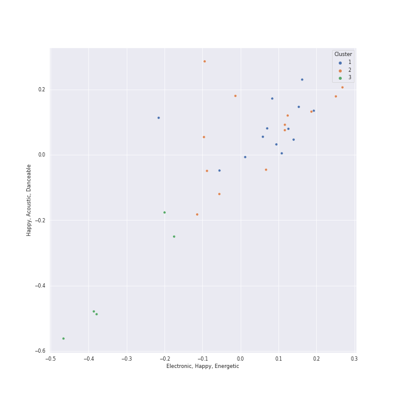

# Clusters in neo soul

## Cluster #1

13 tracks

| Art | Track | Album | Artists | Label | 💚 | 🔗 |
|:---|:---|:---|:---|:---|:---|:---|
|  | Back To Black | Back To Black | Amy Winehouse | [Universal-Island Records Ltd.](../../../../labels/universal-island_records_ltd_) | 💚 | [🔗](https://open.spotify.com/track/30FURVTCpbKyykjSEQzGkH) |
|  | Sincerely, Jane | Metropolis: The Chase Suite (Special Edition) | [Janelle Monáe](../../../../artists/janelle_monáe/overview.md) | [Bad Boy Records](../../../../labels/bad_boy) | 💚 | [🔗](https://open.spotify.com/track/06I6iDFVtZDGcRu9BgHraA) |
|  | Mushrooms & Roses | The ArchAndroid | [Janelle Monáe](../../../../artists/janelle_monáe/overview.md) | [Bad Boy/Wondaland](../../../../labels/bad_boy) | | [🔗](https://open.spotify.com/track/1xxgpQ8RHPcGFcpeMyBZLN) |
|  | Oh, Maker | The ArchAndroid | [Janelle Monáe](../../../../artists/janelle_monáe/overview.md) | [Bad Boy/Wondaland](../../../../labels/bad_boy) | | [🔗](https://open.spotify.com/track/5eKwaeINlNEX3aMlfpmUtw) |
|  | Electric Lady (feat. Solange) | The Electric Lady | [Janelle Monáe](../../../../artists/janelle_monáe/overview.md), Roman GianArthur, Solange | [Bad Boy/Wondaland](../../../../labels/bad_boy) | | [🔗](https://open.spotify.com/track/69vzkewKl2LPquyEiqD8BB) |
|  | Q.U.E.E.N. (feat. Erykah Badu) | The Electric Lady | [Janelle Monáe](../../../../artists/janelle_monáe/overview.md), Erykah Badu | [Bad Boy/Wondaland](../../../../labels/bad_boy) | | [🔗](https://open.spotify.com/track/3HW030T8eqPs8wpsgZqCGM) |
|  | Yoga | Yoga | [Janelle Monáe](../../../../artists/janelle_monáe/overview.md), Jidenna | [Wondaland Records/Epic](../../../../labels/epic) | 💚 | [🔗](https://open.spotify.com/track/3IJCSQoLF4YzPAKaxq2JLb) |
|  | I Like That | Dirty Computer | [Janelle Monáe](../../../../artists/janelle_monáe/overview.md) | [Bad Boy Records](../../../../labels/bad_boy) | 💚 | [🔗](https://open.spotify.com/track/2EznBGrlmx9wBeYgyDojsA) |
|  | Pynk (feat. Grimes) | Dirty Computer | [Janelle Monáe](../../../../artists/janelle_monáe/overview.md), Grimes | [Bad Boy Records](../../../../labels/bad_boy) | | [🔗](https://open.spotify.com/track/5OpiyfqaQLdtwHd3SfembH) |
|  | Preach | Preach | John Legend | [Columbia](../../../../labels/columbia) | | [🔗](https://open.spotify.com/track/2AaF78iCWISMWYog5RnSi5) |
## Cluster #2

13 tracks

| Art | Track | Album | Artists | Label | 💚 | 🔗 |
|:---|:---|:---|:---|:---|:---|:---|
|  | Put Your Records On | Corinne Bailey Rae | Corinne Bailey Rae | [EMI Records](../../../../labels/emi) | 💚 | [🔗](https://open.spotify.com/track/2nGFzvICaeEWjIrBrL2RAx) |
|  | American Boy | Shine | Estelle, Kanye West | Woah Dad! | | [🔗](https://open.spotify.com/track/3IX1c76hbN4iTm9RcItC36) |
|  | Crazy | St. Elsewhere | Gnarls Barkley | Downtown Recordings/Atl | 💚 | [🔗](https://open.spotify.com/track/2N5zMZX7YeL1tico8oQxa9) |
|  | Tightrope (feat. Big Boi) - Big Boi Vocal Edit | The ArchAndroid | [Janelle Monáe](../../../../artists/janelle_monáe/overview.md), Big Boi | [Bad Boy/Wondaland](../../../../labels/bad_boy) | 💚 | [🔗](https://open.spotify.com/track/1ljzHUgt2SU2ADkhfa9eBC) |
|  | Dance Apocalyptic | The Electric Lady | [Janelle Monáe](../../../../artists/janelle_monáe/overview.md) | [Bad Boy/Wondaland](../../../../labels/bad_boy) | 💚 | [🔗](https://open.spotify.com/track/3dUMuxNadGxCE3qXuhCwqa) |
|  | Make Me Feel | Dirty Computer | [Janelle Monáe](../../../../artists/janelle_monáe/overview.md) | [Bad Boy Records](../../../../labels/bad_boy) | 💚 | [🔗](https://open.spotify.com/track/5gW5dSy3vXJxgzma4rQuzH) |
|  | Champagne Shit | The Age of Pleasure | [Janelle Monáe](../../../../artists/janelle_monáe/overview.md) | [Bad Boy Records](../../../../labels/bad_boy) | | [🔗](https://open.spotify.com/track/5OhG7shUD0xgQMirbRAipe) |
|  | Lipstick Lover | The Age of Pleasure | [Janelle Monáe](../../../../artists/janelle_monáe/overview.md) | [Bad Boy Records](../../../../labels/bad_boy) | | [🔗](https://open.spotify.com/track/0zBVnui5j6g5lDEfPpbobx) |
|  | Green Light (feat. André 3000) | Evolver | John Legend, André 3000 | [G.O.O.D. Music/Columbia](../../../../labels/columbia) | 💚 | [🔗](https://open.spotify.com/track/72by3Re4C3eVEBXvsUo0zV) |
|  | When I Get You Alone | A Beautiful World | Robin Thicke | Nu America Music | 💚 | [🔗](https://open.spotify.com/track/1jzWQHcMT8rxvgUjUiqGIH) |
## Cluster #3

5 tracks

| Art | Track | Album | Artists | Label | 💚 | 🔗 |
|:---|:---|:---|:---|:---|:---|:---|
|  | If I Ain't Got You | The Diary Of Alicia Keys | Alicia Keys | J Records | 💚 | [🔗](https://open.spotify.com/track/3XVBdLihbNbxUwZosxcGuJ) |
|  | Valerie - Live At BBC Radio 1 Live Lounge, London / 2007 | Back To Black (Deluxe Edition) | Amy Winehouse | [Universal-Island Records Ltd.](../../../../labels/universal-island_records_ltd_) | | [🔗](https://open.spotify.com/track/6nLvaCZFR1wEzW3sIKpsnr) |
|  | Can You Feel The Love Tonight | The Lion King: Original Broadway Cast Recording | Heather Headley, Jason Raize, Max Casella, Tom Alan Robbins, Ensemble - The Lion King | [Walt Disney Records](../../../../labels/walt_disney_records) | | [🔗](https://open.spotify.com/track/7zb4dWm9K6Hr4kk1pOwSDS) |
|  | Say You'll Go | The ArchAndroid | [Janelle Monáe](../../../../artists/janelle_monáe/overview.md) | [Bad Boy/Wondaland](../../../../labels/bad_boy) | 💚 | [🔗](https://open.spotify.com/track/6wbEygoouLHwgy4J6uQIb1) |
|  | All of Me | Love In The Future (Expanded Edition) | John Legend | [G.O.O.D. Music/Columbia](../../../../labels/columbia) | 💚 | [🔗](https://open.spotify.com/track/3U4isOIWM3VvDubwSI3y7a) |