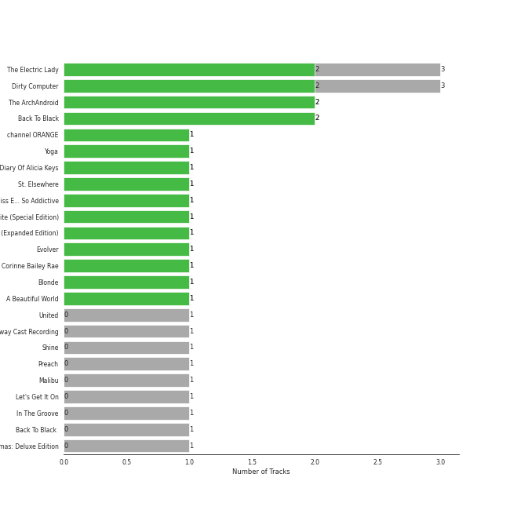
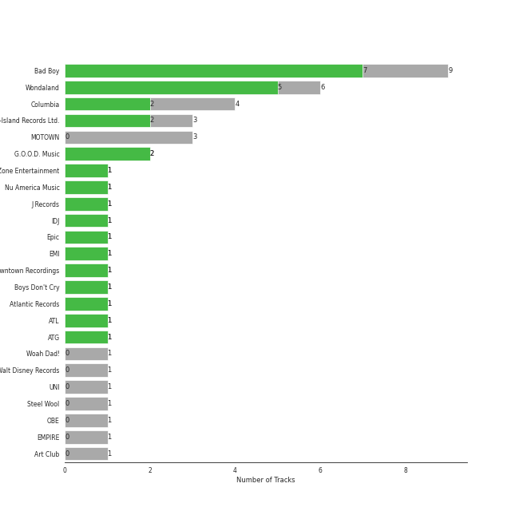
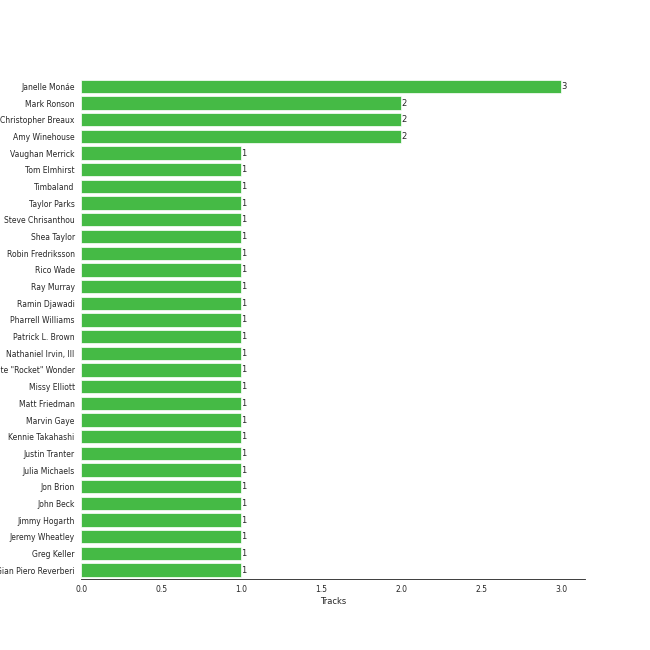

# neo soul

31 songs

[See Track Features](audio_features.md)

[See Clusters](clusters/overview.md)

## Top Artists

| Art | Tracks | 💚 | Artist | 🔗 |
|:---|---:|---:|:---|:---|
|  | 16 | 7 | [Janelle Monáe](../../artists/janelle_monáe/overview.md) | [🔗](https://open.spotify.com/artist/6ueGR6SWhUJfvEhqkvMsVs) |
|  | 4 | 2 | John Legend | [🔗](https://open.spotify.com/artist/5y2Xq6xcjJb2jVM54GHK3t) |
|  | 3 | 2 | Amy Winehouse | [🔗](https://open.spotify.com/artist/6Q192DXotxtaysaqNPy5yR) |
|  | 1 | 1 | André 3000 | [🔗](https://open.spotify.com/artist/74V3dE1a51skRkdII8y2C6) |
|  | 1 | 1 | Gnarls Barkley | [🔗](https://open.spotify.com/artist/5SbkVQYYzlw1kte75QIabH) |
|  | 1 | 1 | Jidenna | [🔗](https://open.spotify.com/artist/4TsHKU8l8Wq7n7OPVikirn) |
|  | 1 | 1 | Alicia Keys | [🔗](https://open.spotify.com/artist/3DiDSECUqqY1AuBP8qtaIa) |
|  | 1 | 1 | Big Boi | [🔗](https://open.spotify.com/artist/2ht3wxeT69CzyKFChNnNAB) |
|  | 1 | 1 | Frank Ocean | [🔗](https://open.spotify.com/artist/2h93pZq0e7k5yf4dywlkpM) |
|  | 1 | 1 | Corinne Bailey Rae | [🔗](https://open.spotify.com/artist/29WzbAQtDnBJF09es0uddn) |

See all 24 artists

| Art | Tracks | 💚 | Artist | 🔗 |
|:---|---:|---:|:---|:---|
|  | 1 | 1 | Robin Thicke | [🔗](https://open.spotify.com/artist/0ZrpamOxcZybMHGg1AYtHP) |
| | 1 | 0 | Jason Raize | [🔗](https://open.spotify.com/artist/7wtyPvLmy8LAf2CO0Xwy4p) |
|  | 1 | 0 | Aretha Franklin | [🔗](https://open.spotify.com/artist/7nwUJBm0HE4ZxD3f5cy5ok) |
|  | 1 | 0 | Roman GianArthur | [🔗](https://open.spotify.com/artist/7hgRzsQGjlm1zifNoigyB9) |
|  | 1 | 0 | Erykah Badu | [🔗](https://open.spotify.com/artist/7IfculRW2WXyzNQ8djX8WX) |
| | 1 | 0 | Max Casella | [🔗](https://open.spotify.com/artist/6ZpL3BxODab84CTGSL7UO8) |
|  | 1 | 0 | Estelle | [🔗](https://open.spotify.com/artist/5T0MSzX9RC5NA6gAI6irSn) |
|  | 1 | 0 | Kanye West | [🔗](https://open.spotify.com/artist/5K4W6rqBFWDnAN6FQUkS6x) |
|  | 1 | 0 | Kelly Clarkson | [🔗](https://open.spotify.com/artist/3BmGtnKgCSGYIUhmivXKWX) |
|  | 1 | 0 | Heather Headley | [🔗](https://open.spotify.com/artist/2xDc4cU0Rj6YG8SrmAHIy0) |
|  | 1 | 0 | Solange | [🔗](https://open.spotify.com/artist/2auiVi8sUZo17dLy1HwrTU) |
| | 1 | 0 | Tom Alan Robbins | [🔗](https://open.spotify.com/artist/25X8ispTOFwbyfJEpkGh50) |
| | 1 | 0 | Ensemble - The Lion King | [🔗](https://open.spotify.com/artist/0s0Hfb6ckk9qTjDeUOZXJp) |
|  | 1 | 0 | Grimes | [🔗](https://open.spotify.com/artist/053q0ukIDRgzwTr4vNSwab) |

## Top Albums

| Art | Tracks | 💚 | Album | Release Date | 🔗 |
|:---|---:|---:|:---|:---|:---|
|  | 5 | 2 | Dirty Computer | 2018-04-27 | [🔗](https://open.spotify.com/album/2PjlaxlMunGOUvcRzlTbtE) |
|  | 4 | 2 | The ArchAndroid | 2010-05-17 | [🔗](https://open.spotify.com/album/7MvSB0JTdtl1pSwZcgvYQX) |
|  | 3 | 1 | The Electric Lady | 2013-09-06 | [🔗](https://open.spotify.com/album/3bnHtSmmsgJiG82hGCmsq9) |
|  | 2 | 2 | Back To Black | 2006-10-27 | [🔗](https://open.spotify.com/album/097eYvf9NKjFnv4xA9s2oV) |
|  | 2 | 0 | The Age of Pleasure | 2023-06-09 | [🔗](https://open.spotify.com/album/3440hCSfwYXxJcbQ0j3jAJ) |
|  | 1 | 1 | channel ORANGE | 2012-07-10 | [🔗](https://open.spotify.com/album/392p3shh2jkxUxY2VHvlH8) |
|  | 1 | 1 | Yoga | 2015-03-31 | [🔗](https://open.spotify.com/album/5rzxGeVyCV74SvV5hjLRAU) |
|  | 1 | 1 | The Diary Of Alicia Keys | 2003-12-02 | [🔗](https://open.spotify.com/album/6TqRKHLjDu5QZuC8u5Woij) |
|  | 1 | 1 | St. Elsewhere | 2006-05-02 | [🔗](https://open.spotify.com/album/7p2aWivr9OLXocSTTKtG9B) |
|  | 1 | 1 | Metropolis: The Chase Suite (Special Edition) | 2008-08-12 | [🔗](https://open.spotify.com/album/3T3bJi3cvwR5U7ihwgEwF1) |

See all 20 albums

| Art | Tracks | 💚 | Album | Release Date | 🔗 |
|:---|---:|---:|:---|:---|:---|
|  | 1 | 1 | Love In The Future (Expanded Edition) | 2013-08-30 | [🔗](https://open.spotify.com/album/4OTAx9un4e6NfoHuVRiOrC) |
|  | 1 | 1 | Evolver | 2008-10-27 | [🔗](https://open.spotify.com/album/11sKu4dBGvmEZTuVw9EC9A) |
|  | 1 | 1 | Corinne Bailey Rae | 2006-01-01 | [🔗](https://open.spotify.com/album/141Mp3P2VKHQMhtkW1DyQg) |
|  | 1 | 1 | A Beautiful World | 2002-12-13 | [🔗](https://open.spotify.com/album/76wI74XuASLFrY9pUVLhO9) |
|  | 1 | 0 | The Lion King: Original Broadway Cast Recording | 1997-01-01 | [🔗](https://open.spotify.com/album/1y6p6tINBthUWsQVQJmiYK) |
|  | 1 | 0 | Shine | 2008-03-31 | [🔗](https://open.spotify.com/album/2zQdtROzQxwRLRbOS4mNx2) |
|  | 1 | 0 | Preach | 2019-02-15 | [🔗](https://open.spotify.com/album/32r4o1R9a1lK5DoVXGEC7E) |
|  | 1 | 0 | I Never Loved a Man the Way I Love You | 1967-03-10 | [🔗](https://open.spotify.com/album/5WndWfzGwCkHzAbQXVkg2V) |
|  | 1 | 0 | Back To Black (Deluxe Edition) | 2006 | [🔗](https://open.spotify.com/album/0E4xv5gPjykrwBgBZzI8XG) |
|  | 1 | 0 | A Legendary Christmas: Deluxe Edition | 2019-11-08 | [🔗](https://open.spotify.com/album/3wanKGZXsWXr6ZKdQrDtGu) |

## Top Record Labels

| Tracks | 💚 | Label |
|---:|---:|:---|
| 15 | 6 | [Bad Boy](../../labels/bad_boy/overview.md) |
| 8 | 4 | Wondaland |
| 4 | 2 | [Columbia](../../labels/columbia/overview.md) |
| 3 | 2 | [Universal-Island Records Ltd.](../../labels/universal-island_records_ltd_/overview.md) |
| 2 | 2 | G.O.O.D. Music |
| 1 | 1 | Red Zone Entertainment |
| 1 | 1 | Nu America Music |
| 1 | 1 | J Records |
| 1 | 1 | IDJ |
| 1 | 1 | [Epic](../../labels/epic/overview.md) |

See all 16 labels

| Tracks | 💚 | Label |
|---:|---:|:---|
| 1 | 1 | [EMI](../../labels/emi/overview.md) |
| 1 | 1 | Downtown Recordings |
| 1 | 1 | ATL |
| 1 | 0 | Woah Dad! |
| 1 | 0 | [Walt Disney Records](../../labels/walt_disney_records/overview.md) |
| 1 | 0 | Rhino Atlantic |

## Top Producers

| Art | Producer | Tracks | Credit Types |
|:---|:---|---:|:---|
|  | [Janelle Monáe](../../artists/janelle_monáe/overview.md) | 3 | Songwriter, Producer |
|  | Amy Winehouse | 2 | Lyricist, Songwriter |
|  | Mark Ronson | 2 | Arranger, Producer, Songwriter |
| | Rico Wade | 1 | Songwriter |
| | Chuck Lightning | 1 | Producer |
| | John Beck | 1 | Songwriter |
| | Brian Burton | 1 | Songwriter |
| | Matt Friedman | 1 | Songwriter |
| | Shea Taylor | 1 | Producer, Songwriter |
| | Vaughan Merrick | 1 | Producer |

View all

| Art | Producer | Tracks | Credit Types |
|:---|:---|---:|:---|
| | Ray Murray | 1 | Songwriter |
|  | Corinne Bailey Rae | 1 | Songwriter |
| | Tom Elmhirst | 1 | Producer |
| | Jeremy Wheatley | 1 | Producer |
| | Nathaniel Irvin, III | 1 | Songwriter |
| | Bosco Mann | 1 | Arranger |
| | Jimmy Hogarth | 1 | Producer |
| | Christopher Breaux | 1 | Songwriter |
| | Chris Elliott | 1 | Arranger |
| | Gian Franco Reverberi | 1 | Songwriter |
| | Danger Mouse | 1 | Producer |
| | Julia Michaels | 1 | Songwriter |
| | Steve Chrisanthou | 1 | Producer, Songwriter |
| | Justin Tranter | 1 | Songwriter |
| | Kennie Takahashi | 1 | Producer |
| | Robin Fredriksson | 1 | Songwriter |
|  | CeeLo Green | 1 | Lyricist |
| | Nate "Rocket" Wonder | 1 | Producer |
| | Gian Piero Reverberi | 1 | Songwriter |
| | Ben H. Allen | 1 | Producer |
| | Taylor Parks | 1 | Songwriter |
| | Patrick L. Brown | 1 | Songwriter |

## Years

| ​ | 10 newest albums | ​​ | 10 oldest albums |
|:---|:---|:---|:---|
|  | The Age of Pleasure (2023-06-09) |  | I Never Loved a Man the Way I Love You (1967-03-10) |
|  | A Legendary Christmas: Deluxe Edition (2019-11-08) |  | The Lion King: Original Broadway Cast Recording (1997-01-01) |
|  | Preach (2019-02-15) |  | A Beautiful World (2002-12-13) |
|  | Dirty Computer (2018-04-27) |  | The Diary Of Alicia Keys (2003-12-02) |
|  | Yoga (2015-03-31) |  | Back To Black (Deluxe Edition) (2006) |
|  | The Electric Lady (2013-09-06) |  | Corinne Bailey Rae (2006-01-01) |
|  | Love In The Future (Expanded Edition) (2013-08-30) |  | St. Elsewhere (2006-05-02) |
|  | channel ORANGE (2012-07-10) |  | Back To Black (2006-10-27) |
|  | The ArchAndroid (2010-05-17) |  | Shine (2008-03-31) |
|  | Evolver (2008-10-27) |  | Metropolis: The Chase Suite (Special Edition) (2008-08-12) |

