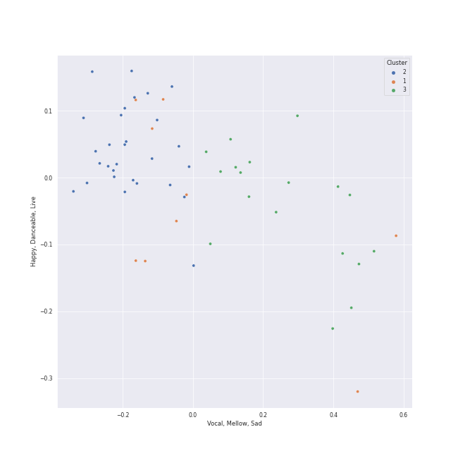

# Clusters in neoclassicism

## Cluster #1

9 tracks

| Art | Track | Album | Artists | Label | Rank | 💚 | 🔗 |
|:---|:---|:---|:---|:---|---:|:---|:---|
|  | Petrushka: Fourth Scene: V. Dance of the Coachmen and Grooms (1911 original version) | Stravinsky: Petrushka, Jeu de cartes | Igor Stravinsky, Valery Gergiev, Mariinsky Orchestra | [Mariinsky](../../../../labels/mariinsky) | nan | | [🔗](https://open.spotify.com/track/0g12fQ8G4QUWX0Kbn2Q6r0) |
|  | Petrushka: Fourth Scene: II. Dance of the Wet-Nurses (1911 original version) | Stravinsky: Petrushka, Jeu de cartes | Igor Stravinsky, Valery Gergiev, Mariinsky Orchestra | [Mariinsky](../../../../labels/mariinsky) | nan | | [🔗](https://open.spotify.com/track/1doCWMqKSAD9mVLD2nulpq) |
|  | Petrushka: First Scene: IV. Russian Dance (1911 original version) | Stravinsky: Petrushka, Jeu de cartes | Igor Stravinsky, Valery Gergiev, Mariinsky Orchestra | [Mariinsky](../../../../labels/mariinsky) | nan | | [🔗](https://open.spotify.com/track/44YT5PBqXUE1mCPBZWX7J4) |
|  | Petrushka: Third Scene: II. Dance of the Ballerina (1911 original version) | Stravinsky: Petrushka, Jeu de cartes | Igor Stravinsky, Valery Gergiev, Mariinsky Orchestra | [Mariinsky](../../../../labels/mariinsky) | nan | | [🔗](https://open.spotify.com/track/5CQt9zxHHZiABfdEQoUsAO) |
|  | The Rite of Spring, K15, Pt. 1: II. The Augurs of Spring | Stravinsky: The Rite of Spring / Bartók: Concerto for Orchestra | Igor Stravinsky, [Berliner Philharmoniker](../../../../artists/berliner_philharmoniker/overview.md), [Herbert von Karajan](../../../../artists/herbert_von_karajan/overview.md) | [Deutsche Grammophon (DG)](../../../../labels/deutsche_grammophon_(dg)) | nan | | [🔗](https://open.spotify.com/track/4odlTAKrvaQ4UUJqatxAHt) |
|  | The Rite of Spring, K15, Pt. 1: III. Ritual of Abduction | Stravinsky: The Rite of Spring / Bartók: Concerto for Orchestra | Igor Stravinsky, [Berliner Philharmoniker](../../../../artists/berliner_philharmoniker/overview.md), [Herbert von Karajan](../../../../artists/herbert_von_karajan/overview.md) | [Deutsche Grammophon (DG)](../../../../labels/deutsche_grammophon_(dg)) | nan | | [🔗](https://open.spotify.com/track/5oEcuGFmXXSI3mJSXDUZVL) |
|  | The Rite of Spring, K15, Pt. 1: V. Games of the Rival Tribes | Stravinsky: The Rite of Spring / Bartók: Concerto for Orchestra | Igor Stravinsky, [Berliner Philharmoniker](../../../../artists/berliner_philharmoniker/overview.md), [Herbert von Karajan](../../../../artists/herbert_von_karajan/overview.md) | [Deutsche Grammophon (DG)](../../../../labels/deutsche_grammophon_(dg)) | nan | | [🔗](https://open.spotify.com/track/6DmCs7oYITGEnfX7lsOe2O) |
|  | The Firebird (L'oiseau De Feu) - Suite (1919): 3. Variation Of The Firebird | Stravinsky: The Firebird (Ballet Suite) | Igor Stravinsky, Orchestre de l'Opéra National de Paris, Myung-Whun Chung | [Deutsche Grammophon (DG)](../../../../labels/deutsche_grammophon_(dg)) | nan | | [🔗](https://open.spotify.com/track/2U4SpGB3Rphe3YIddZuHW3) |
|  | 4 Motets pour le temps de Noël, FP 152: No. 4, Hodie Christus natus est | Poulenc: Motets and Mass | Francis Poulenc, Vlasta Mlejnková, Kühn Mixed Choir, Pavel Kühn | SUPRAPHON a.s. | nan | | [🔗](https://open.spotify.com/track/0PDnRCf3AnUUjAYSXVok55) |
## Cluster #2

29 tracks

| Art | Track | Album | Artists | Label | Rank | 💚 | 🔗 |
|:---|:---|:---|:---|:---|---:|:---|:---|
|  | Jeu de cartes: II. Second Deal | Stravinsky: Petrushka, Jeu de cartes | Igor Stravinsky, Valery Gergiev, Mariinsky Orchestra | [Mariinsky](../../../../labels/mariinsky) | nan | | [🔗](https://open.spotify.com/track/01sFYbEnNAR4ZBChyKR1XG) |
|  | Petrushka: First Scene: II. The Crowds (1911 original version) | Stravinsky: Petrushka, Jeu de cartes | Igor Stravinsky, Valery Gergiev, Mariinsky Orchestra | [Mariinsky](../../../../labels/mariinsky) | nan | | [🔗](https://open.spotify.com/track/2Rb1R3QTqNACnDrwZdt5Ic) |
|  | Petrushka: Third Scene: III. Waltz (The Ballerina and the Moor) (1911 original version) | Stravinsky: Petrushka, Jeu de cartes | Igor Stravinsky, Valery Gergiev, Mariinsky Orchestra | [Mariinsky](../../../../labels/mariinsky) | nan | | [🔗](https://open.spotify.com/track/5Nz0PKTW9OgraAtvjYJvO9) |
|  | Petrushka: Second Scene: I. Petrushka's Cell (1911 original version) | Stravinsky: Petrushka, Jeu de cartes | Igor Stravinsky, Valery Gergiev, Mariinsky Orchestra | [Mariinsky](../../../../labels/mariinsky) | nan | | [🔗](https://open.spotify.com/track/6g0qWuKnsE1js5mo4HAigx) |
|  | The Rite of Spring, K15, Pt. 1: IV. Spring Rounds | Stravinsky: The Rite of Spring / Bartók: Concerto for Orchestra | Igor Stravinsky, [Berliner Philharmoniker](../../../../artists/berliner_philharmoniker/overview.md), [Herbert von Karajan](../../../../artists/herbert_von_karajan/overview.md) | [Deutsche Grammophon (DG)](../../../../labels/deutsche_grammophon_(dg)) | nan | | [🔗](https://open.spotify.com/track/04l27PkpdTLSNXE1ZHtlkA) |
|  | The Firebird (L'oiseau De Feu) - Suite (1919): Infernal Dance Of King Kaschei | Stravinsky: The Firebird (Ballet Suite) | Igor Stravinsky, Orchestre de l'Opéra National de Paris, Myung-Whun Chung | [Deutsche Grammophon (DG)](../../../../labels/deutsche_grammophon_(dg)) | nan | | [🔗](https://open.spotify.com/track/0s2MfCDScTP72VvdNy99dy) |
|  | Concerto for Orchestra, Sz. 116: 1. Introduzione (Andante non troppo - Allegro vivace | Stravinsky: The Rite of Spring / Bartók: Concerto for Orchestra | Béla Bartók, [Berliner Philharmoniker](../../../../artists/berliner_philharmoniker/overview.md), [Herbert von Karajan](../../../../artists/herbert_von_karajan/overview.md) | [Deutsche Grammophon (DG)](../../../../labels/deutsche_grammophon_(dg)) | nan | | [🔗](https://open.spotify.com/track/2xGEjbQPRhl8fiECYoLSr6) |
|  | Concerto for Orchestra, Sz. 116: 2. Giuoco della coppie (Allegretto scherzando) | Stravinsky: The Rite of Spring / Bartók: Concerto for Orchestra | Béla Bartók, [Berliner Philharmoniker](../../../../artists/berliner_philharmoniker/overview.md), [Herbert von Karajan](../../../../artists/herbert_von_karajan/overview.md) | [Deutsche Grammophon (DG)](../../../../labels/deutsche_grammophon_(dg)) | nan | | [🔗](https://open.spotify.com/track/6Mc9Vhvj1ViMOLQsuz3tBi) |
|  | Concerto for Orchestra, Sz. 116: 5. Finale (Pesante - Presto) | Stravinsky: The Rite of Spring / Bartók: Concerto for Orchestra | Béla Bartók, [Berliner Philharmoniker](../../../../artists/berliner_philharmoniker/overview.md), [Herbert von Karajan](../../../../artists/herbert_von_karajan/overview.md) | [Deutsche Grammophon (DG)](../../../../labels/deutsche_grammophon_(dg)) | nan | | [🔗](https://open.spotify.com/track/6pTDV5wsqZaCNlgnWLhfoF) |
|  | Quatuor en Fa Majeur, M. 35: IV. Vif et agité | Debussy & Ravel: String Quartets | Maurice Ravel, [Jerusalem Quartet](../../../../artists/jerusalem_quartet/overview.md) | [harmonia mundi](../../../../labels/harmonia_mundi) | nan | | [🔗](https://open.spotify.com/track/3A49NlRC42aszkRusgYDfq) |
## Cluster #3

18 tracks

| Art | Track | Album | Artists | Label | Rank | 💚 | 🔗 |
|:---|:---|:---|:---|:---|---:|:---|:---|
|  | The Rite of Spring, K15, Pt. 2: IX. Introduction | Stravinsky: The Rite of Spring / Bartók: Concerto for Orchestra | Igor Stravinsky, [Berliner Philharmoniker](../../../../artists/berliner_philharmoniker/overview.md), [Herbert von Karajan](../../../../artists/herbert_von_karajan/overview.md) | [Deutsche Grammophon (DG)](../../../../labels/deutsche_grammophon_(dg)) | nan | | [🔗](https://open.spotify.com/track/6GS9MQgfnbFp3yPL2uNAF8) |
|  | The Firebird (L'oiseau De Feu) - Suite (1919): Finale | Stravinsky: The Firebird (Ballet Suite) | Igor Stravinsky, Orchestre de l'Opéra National de Paris, Myung-Whun Chung | [Deutsche Grammophon (DG)](../../../../labels/deutsche_grammophon_(dg)) | nan | | [🔗](https://open.spotify.com/track/0mTUTkFQ2MxmUHFL8EdfeR) |
|  | 4 Motets pour un temps de pénitence, FP 97: No. 4, Tristis est anima mea | Poulenc: Motets and Mass | Francis Poulenc, Vlasta Mlejnková, Kühn Mixed Choir, Pavel Kühn | SUPRAPHON a.s. | nan | | [🔗](https://open.spotify.com/track/0of2TShrStNkbPvZQLeiNh) |
|  | 4 Motets pour le temps de Noël, FP 152: No. 1, Magnum mysterium | Poulenc: Motets and Mass | Francis Poulenc, Vlasta Mlejnková, Kühn Mixed Choir, Pavel Kühn | SUPRAPHON a.s. | nan | | [🔗](https://open.spotify.com/track/1lb2BKEeXA8cx2jLxfqJel) |
|  | 4 Motets pour un temps de pénitence, FP 97: No. 3, Tenebrae factae sunt | Poulenc: Motets and Mass | Francis Poulenc, Vlasta Mlejnková, Kühn Mixed Choir, Pavel Kühn | SUPRAPHON a.s. | nan | | [🔗](https://open.spotify.com/track/1pEgzXriotJRGrgrmE2eHR) |
|  | 4 Motets pour le temps de Noël, FP 152: No. 3, Videntes stellam | Poulenc: Motets and Mass | Francis Poulenc, Vlasta Mlejnková, Kühn Mixed Choir, Pavel Kühn | SUPRAPHON a.s. | nan | | [🔗](https://open.spotify.com/track/3XXHrDeM03ViHGcesNVwfL) |
|  | 4 Motets pour un temps de pénitence, FP 97: No. 2, Vinea mea electa | Poulenc: Motets and Mass | Francis Poulenc, Vlasta Mlejnková, Kühn Mixed Choir, Pavel Kühn | SUPRAPHON a.s. | nan | | [🔗](https://open.spotify.com/track/63jRApT2GmzdVMePv7KFXi) |
|  | 4 Motets pour un temps de pénitence, FP 97: No. 1, Timor et tremor | Poulenc: Motets and Mass | Francis Poulenc, Vlasta Mlejnková, Kühn Mixed Choir, Pavel Kühn | SUPRAPHON a.s. | nan | | [🔗](https://open.spotify.com/track/67NRQzKiJzlayRlmZ4zbKc) |
|  | Quatuor en Fa Majeur, M. 35: III. Très lent | Debussy & Ravel: String Quartets | Maurice Ravel, [Jerusalem Quartet](../../../../artists/jerusalem_quartet/overview.md) | [harmonia mundi](../../../../labels/harmonia_mundi) | nan | | [🔗](https://open.spotify.com/track/5Pa15bTxEBbugS06yIwnAt) |
|  | Quatuor en Fa Majeur, M. 35: II. Assez vif, très rythmé | Debussy & Ravel: String Quartets | Maurice Ravel, [Jerusalem Quartet](../../../../artists/jerusalem_quartet/overview.md) | [harmonia mundi](../../../../labels/harmonia_mundi) | nan | | [🔗](https://open.spotify.com/track/766aJRX19tPpWsqp4n59xJ) |