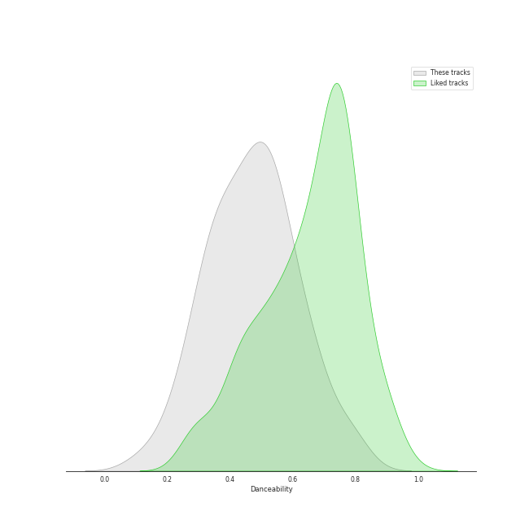
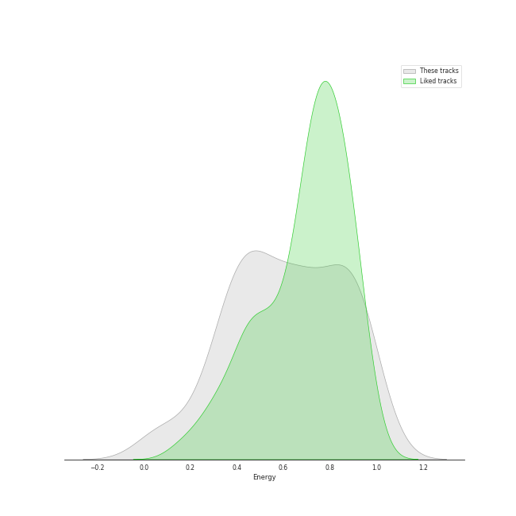
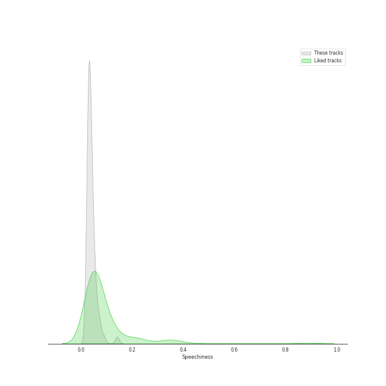
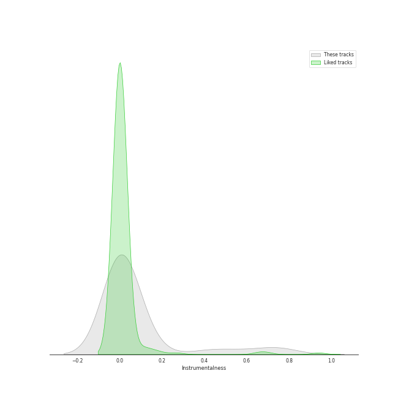
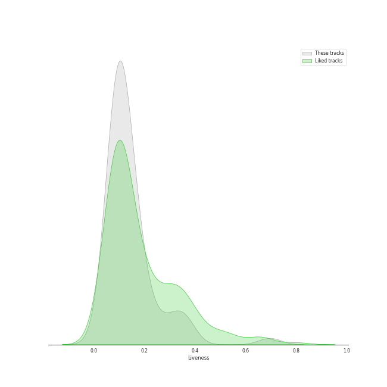
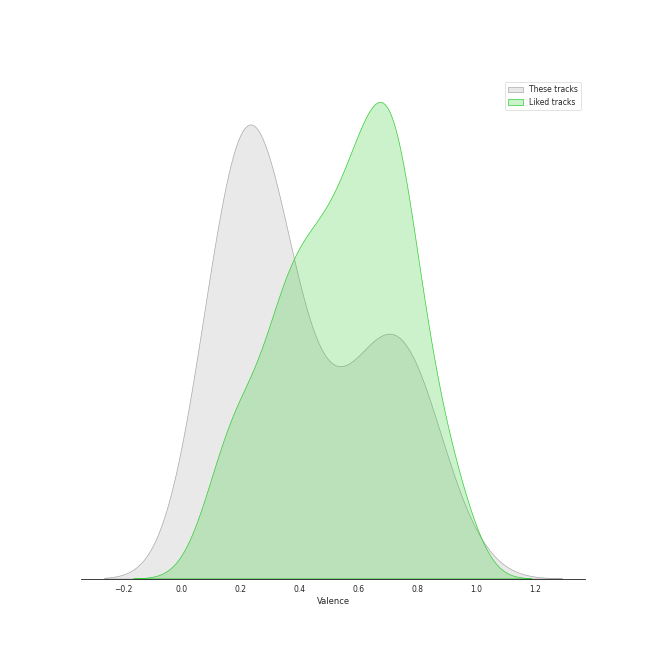
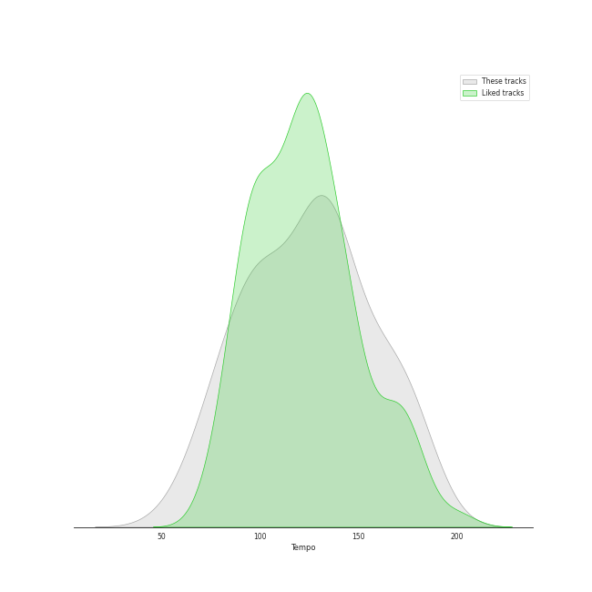

# Track Features for permanent wave

## Danceability

| ​ | 10 most Danceable tracks | ​​ | 10 least Danceable tracks |
|:---|:---|:---|:---|
|  | You Can Call Me Al (0.776) |  | Pyramid Song (0.127) |
|  | 1979 - Remastered 2012 (0.767) |  | Fix You (0.209) |
|  | Englishman In New York (0.674) |  | Paranoid Android (0.251) |
|  | All I Need (0.67) |  | No Surprises (0.255) |
|  | Supermassive Black Hole (0.668) |  | Exit Music (For A Film) (0.293) |
|  | Fields Of Gold (0.651) |  | Everything In Its Right Place (0.296) |
|  | Can't Stop (0.618) |  | Shadowboxer (0.298) |
|  | There, There (0.614) |  | Christmas Lights (0.315) |
|  | The Adults Are Talking (0.593) |  | Feeling Good (0.345) |
|  | Californication (0.592) |  | ❤️ (0.348) |

## Energy

| ​ | 10 most Energetic tracks | ​​ | 10 least Energetic tracks |
|:---|:---|:---|:---|
|  | American Idiot (0.988) |  | ❤️ (0.0491) |
|  | Knights of Cydonia (0.963) |  | The Boxer (0.0802) |
|  | The Pretender (0.959) |  | Fake Plastic Trees (0.229) |
|  | Best of You (0.94) |  | BrokEn (0.271) |
|  | Can't Stop (0.938) |  | Exit Music (For A Film) (0.276) |
|  | Supermassive Black Hole (0.921) |  | Pyramid Song (0.335) |
|  | Learn to Fly (0.919) |  | Fields Of Gold (0.339) |
|  | Dani California (0.913) |  | Slow Cheetah (0.344) |
|  | Smells Like Teen Spirit (0.912) |  | Englishman In New York (0.347) |
|  | Mr. Brightside (0.911) |  | High and Dry (0.383) |

## Speechiness

| ​ | 10 most Speechy tracks | ​​ | 10 least Speechy tracks |
|:---|:---|:---|:---|
|  | Knights of Cydonia (0.142) |  | The Scientist (0.0243) |
|  | Mr. Brightside (0.0747) |  | Fields Of Gold (0.0246) |
|  | Madness (0.0718) |  | High and Dry (0.0256) |
|  | Best of You (0.0696) |  | Karma Police (0.0258) |
|  | American Idiot (0.0639) |  | Reckoner (0.0262) |
|  | Paranoid Android (0.0579) |  | Paradise (0.0268) |
|  | Speed of Sound (0.0577) |  | Californication (0.027) |
|  | Smells Like Teen Spirit (0.0564) |  | Chasing Cars (0.0274) |
|  | Take on Me (0.054) |  | No Surprises (0.0278) |
|  | You Can Call Me Al (0.0534) |  | Clocks (0.0279) |

## Acousticness

| ​ | 10 most Acoustic tracks | ​​ | 10 least Acoustic tracks |
|:---|:---|:---|:---|
|  | ❤️ (0.97) |  | Learn to Fly (1.83e-05) |
|  | The Boxer (0.93) |  | Smells Like Teen Spirit (2.55e-05) |
|  | BrokEn (0.923) |  | American Idiot (2.64e-05) |
|  | Pyramid Song (0.786) |  | Everlong (5.99e-05) |
|  | Weird Fishes/ Arpeggi (0.772) |  | Let Down (0.000121) |
|  | The Scientist (0.731) |  | Knights of Cydonia (0.000273) |
|  | Everything In Its Right Place (0.705) |  | Reptilia (0.000603) |
|  | Clocks (0.599) |  | Call Me (0.000646) |
|  | All I Need (0.531) |  | Best of You (0.000769) |
|  | Reckoner (0.511) |  | The Pretender (0.000917) |

## Instrumentalness

| ​ | 10 most Instrumental tracks | ​​ | 10 least Instrumental tracks |
|:---|:---|:---|:---|
|  | Animals (0.796) |  | Mr. Brightside (0.0) |
|  | Weird Fishes/ Arpeggi (0.756) |  | Shadowboxer (0.0) |
|  | Reptilia (0.713) |  | BrokEn (0.0) |
|  | Street Spirit (Fade Out) (0.694) |  | Can't Stop (0.0) |
|  | 1979 - Remastered 2012 (0.583) |  | Good Riddance (Time of Your Life) (0.0) |
|  | There, There (0.52) |  | Someday (0.0) |
|  | All I Need (0.428) |  | The Pretender (0.0) |
|  | Pyramid Song (0.427) |  | Viva La Vida (3.23e-06) |
|  | Reckoner (0.16) |  | Dani California (8.59e-06) |
|  | Exit Music (For A Film) (0.122) |  | Englishman In New York (1.05e-05) |

## Liveness

| ​ | 10 most Live tracks | ​​ | 10 least Live tracks |
|:---|:---|:---|:---|
|  | Animals (0.696) |  | The Pretender (0.028) |
|  | American Idiot (0.368) |  | 1979 - Remastered 2012 (0.0513) |
|  | Someday (0.367) |  | Paranoid Android (0.0545) |
|  | Dani California (0.346) |  | Boulevard of Broken Dreams (0.0589) |
|  | The Adults Are Talking (0.314) |  | The Boxer (0.0619) |
|  | Princess of China (0.287) |  | Reckoner (0.0679) |
|  | Learn to Fly (0.262) |  | Slow Cheetah (0.0715) |
|  | Yellow (0.234) |  | Call Me (0.0737) |
|  | Fake Plastic Trees (0.202) |  | Fields Of Gold (0.0739) |
|  | Best of You (0.188) |  | Jigsaw Falling Into Place (0.0741) |

## Valence

| ​ | 10 most Happy tracks | ​​ | 10 least Happy tracks |
|:---|:---|:---|:---|
|  | 1979 - Remastered 2012 (0.964) |  | Everything In Its Right Place (0.0629) |
|  | Take on Me (0.876) |  | Pyramid Song (0.0686) |
|  | Can't Stop (0.875) |  | All I Need (0.0997) |
|  | You Can Call Me Al (0.82) |  | Creep (0.104) |
|  | Jigsaw Falling Into Place (0.807) |  | No Surprises (0.118) |
|  | Supermassive Black Hole (0.782) |  | Fix You (0.124) |
|  | Call Me (0.773) |  | Street Spirit (Fade Out) (0.131) |
|  | Reptilia (0.77) |  | Fake Plastic Trees (0.135) |
|  | American Idiot (0.769) |  | Let Down (0.143) |
|  | Dani California (0.73) |  | Chasing Cars (0.144) |

## Tempo

| ​ | 10 most Fast tracks | ​​ | 10 least Fast tracks |
|:---|:---|:---|:---|
|  | American Idiot (186.113) |  | Fake Plastic Trees (73.543) |
|  | The Boxer (181.849) |  | Shadowboxer (74.131) |
|  | Madness (180.301) |  | Karma Police (74.807) |
|  | Slow Cheetah (178.102) |  | No Surprises (76.426) |
|  | Yellow (173.372) |  | Pyramid Song (77.078) |
|  | The Pretender (172.984) |  | Take on Me (84.412) |
|  | Animals (169.987) |  | Princess of China (85.014) |
|  | Boulevard of Broken Dreams (167.06) |  | High and Dry (87.568) |
|  | Jigsaw Falling Into Place (165.653) |  | All I Need (88.014) |
|  | The Adults Are Talking (164.959) |  | Can't Stop (91.455) |
