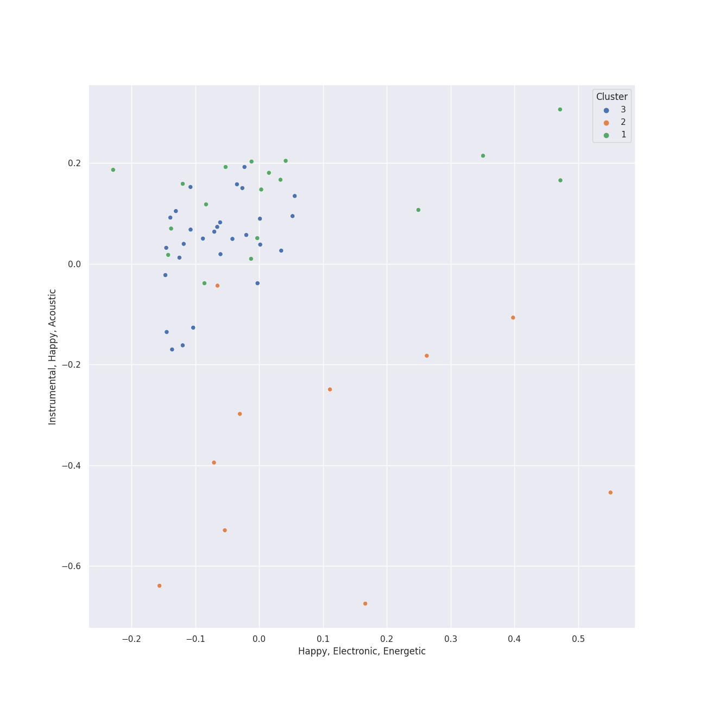

# Clusters in permanent wave

## Cluster #1

18 tracks

| Art | Track | Album | Artists | Label | Score | 💚 | 🔗 |
|:---|:---|:---|:---|:---|---:|:---|:---|
|  | Reckoner | In Rainbows | [Radiohead](../../../../artists/radiohead/overview.md) | [XL Recordings](../../../../labels/xl_recordings) | 0 | 💚 | [🔗](https://open.spotify.com/track/02ppMPbg1OtEdHgoPqoqju) |
|  | All I Need | In Rainbows | [Radiohead](../../../../artists/radiohead/overview.md) | [XL Recordings](../../../../labels/xl_recordings) | 0 | | [🔗](https://open.spotify.com/track/5Qv2Nby1xTr9pQyjkrc94J) |
|  | Exit Music (For A Film) | OK Computer | [Radiohead](../../../../artists/radiohead/overview.md) | [XL Recordings](../../../../labels/xl_recordings) | 264 | 💚 | [🔗](https://open.spotify.com/track/0z1o5L7HJx562xZSATcIpY) |
|  | Fake Plastic Trees | The Bends | [Radiohead](../../../../artists/radiohead/overview.md) | [XL Recordings](../../../../labels/xl_recordings) | 0 | 💚 | [🔗](https://open.spotify.com/track/73CKjW3vsUXRpy3NnX4H7F) |
|  | Everything In Its Right Place | Kid A | [Radiohead](../../../../artists/radiohead/overview.md) | [XL Recordings](../../../../labels/xl_recordings) | 0 | 💚 | [🔗](https://open.spotify.com/track/2kRFrWaLWiKq48YYVdGcm8) |
|  | Clocks | A Rush of Blood to the Head | [Coldplay](../../../../artists/coldplay/overview.md) | Parlophone Records Limited | 0 | 💚 | [🔗](https://open.spotify.com/track/0BCPKOYdS2jbQ8iyB56Zns) |
|  | The Scientist | A Rush of Blood to the Head | [Coldplay](../../../../artists/coldplay/overview.md) | Parlophone Records Limited | 0 | 💚 | [🔗](https://open.spotify.com/track/75JFxkI2RXiU7L9VXzMkle) |
|  | Fields Of Gold | Ten Summoner's Tales | Sting | A&M | 0 | | [🔗](https://open.spotify.com/track/0I1DJdLt9BKOb7GWmWxCjo) |
|  | Feeling Good | Origin of Symmetry | Muse | [Warner Records](../../../../labels/warner_records) | 0 | 💚 | [🔗](https://open.spotify.com/track/5Yj4AP0JGQWierBFKdKVyS) |
|  | Nature Boy - From "Moulin Rouge" Soundtrack | Moulin Rouge | David Bowie | [Moulin Rouge / Interscope](../../../../labels/interscope_records) | 0 | | [🔗](https://open.spotify.com/track/5EDXCIp54bSQspeOyta5R7) |
## Cluster #2

19 tracks

| Art | Track | Album | Artists | Label | Score | 💚 | 🔗 |
|:---|:---|:---|:---|:---|---:|:---|:---|
|  | Jigsaw Falling Into Place | In Rainbows | [Radiohead](../../../../artists/radiohead/overview.md) | [XL Recordings](../../../../labels/xl_recordings) | 86 | 💚 | [🔗](https://open.spotify.com/track/0YJ9FWWHn9EfnN0lHwbzvV) |
|  | Dani California | Stadium Arcadium | Red Hot Chili Peppers | [Warner Records](../../../../labels/warner_records) | 0 | | [🔗](https://open.spotify.com/track/10Nmj3JCNoMeBQ87uw5j8k) |
|  | Can't Stop | By the Way (Deluxe Edition) | Red Hot Chili Peppers | [Warner Records](../../../../labels/warner_records) | 0 | | [🔗](https://open.spotify.com/track/3ZOEytgrvLwQaqXreDs2Jx) |
|  | Supermassive Black Hole | Black Holes and Revelations | Muse | [Warner Records](../../../../labels/warner_records) | 0 | 💚 | [🔗](https://open.spotify.com/track/3lPr8ghNDBLc2uZovNyLs9) |
|  | You Can Call Me Al | Graceland (25th Anniversary Deluxe Edition) | Paul Simon | Legacy Recordings | 0 | | [🔗](https://open.spotify.com/track/0qxYx4F3vm1AOnfux6dDxP) |
|  | Take on Me | Hunting High and Low | a-ha | [Rhino](../../../../labels/rhino) | 11 | 💚 | [🔗](https://open.spotify.com/track/2WfaOiMkCvy7F5fcp2zZ8L) |
|  | Losing My Religion | Out Of Time (25th Anniversary Edition) | R.E.M. | Concord Records | 0 | | [🔗](https://open.spotify.com/track/31AOj9sFz2gM0O3hMARRBx) |
|  | The Adults Are Talking | The New Abnormal | The Strokes | [Cult Records/RCA Records](../../../../labels/rca_records_label) | 0 | 💚 | [🔗](https://open.spotify.com/track/5ruzrDWcT0vuJIOMW7gMnW) |
|  | Smells Like Teen Spirit | Nevermind (Remastered) | Nirvana | [Geffen](../../../../labels/geffen) | 0 | | [🔗](https://open.spotify.com/track/5ghIJDpPoe3CfHMGu71E6T) |
|  | Call Me | Call Me | Blondie | Chrysalis\EMI Records (USA) | 0 | 💚 | [🔗](https://open.spotify.com/track/7HKxTNVlkHsfMLhigmhC0I) |
## Cluster #3

28 tracks

| Art | Track | Album | Artists | Label | Score | 💚 | 🔗 |
|:---|:---|:---|:---|:---|---:|:---|:---|
|  | All These Things That I've Done | Hot Fuss | The Killers | [Island Records](../../../../labels/island_records) | 0 | | [🔗](https://open.spotify.com/track/5vollujufHY0jMZxx77VWr) |
|  | Subterranean Homesick Alien | OK Computer | [Radiohead](../../../../artists/radiohead/overview.md) | [XL Recordings](../../../../labels/xl_recordings) | 0 | 💚 | [🔗](https://open.spotify.com/track/2CVV8PtUYYsux8XOzWkCP0) |
|  | Let Down | OK Computer | [Radiohead](../../../../artists/radiohead/overview.md) | [XL Recordings](../../../../labels/xl_recordings) | 0 | 💚 | [🔗](https://open.spotify.com/track/2fuYa3Lx06QQJAm0MjztKr) |
|  | Karma Police | OK Computer | [Radiohead](../../../../artists/radiohead/overview.md) | [XL Recordings](../../../../labels/xl_recordings) | 0 | 💚 | [🔗](https://open.spotify.com/track/63OQupATfueTdZMWTxW03A) |
|  | Strip My Mind | Stadium Arcadium | Red Hot Chili Peppers | [Warner Records](../../../../labels/warner_records) | 0 | | [🔗](https://open.spotify.com/track/0J3ytriezGZ3KCREfHKDOI) |
|  | Californication | Californication (Deluxe Edition) | Red Hot Chili Peppers | [Warner Records](../../../../labels/warner_records) | 0 | | [🔗](https://open.spotify.com/track/48UPSzbZjgc449aqz8bxox) |
|  | Viva La Vida | Viva La Vida or Death and All His Friends | [Coldplay](../../../../artists/coldplay/overview.md) | [Parlophone UK](../../../../labels/parlophone_uk) | 0 | 💚 | [🔗](https://open.spotify.com/track/1mea3bSkSGXuIRvnydlB5b) |
|  | Yellow | Parachutes | [Coldplay](../../../../artists/coldplay/overview.md) | [Parlophone UK](../../../../labels/parlophone_uk) | 0 | 💚 | [🔗](https://open.spotify.com/track/3AJwUDP919kvQ9QcozQPxg) |
|  | Princess of China | Mylo Xyloto | [Coldplay](../../../../artists/coldplay/overview.md), [Rihanna](../../../../artists/rihanna/overview.md) | [Parlophone UK](../../../../labels/parlophone_uk) | 0 | | [🔗](https://open.spotify.com/track/4HXOBjwv2RnLpGG4xWOO6N) |
|  | Paradise | Mylo Xyloto | [Coldplay](../../../../artists/coldplay/overview.md) | [Parlophone UK](../../../../labels/parlophone_uk) | 0 | | [🔗](https://open.spotify.com/track/6nek1Nin9q48AVZcWs9e9D) |