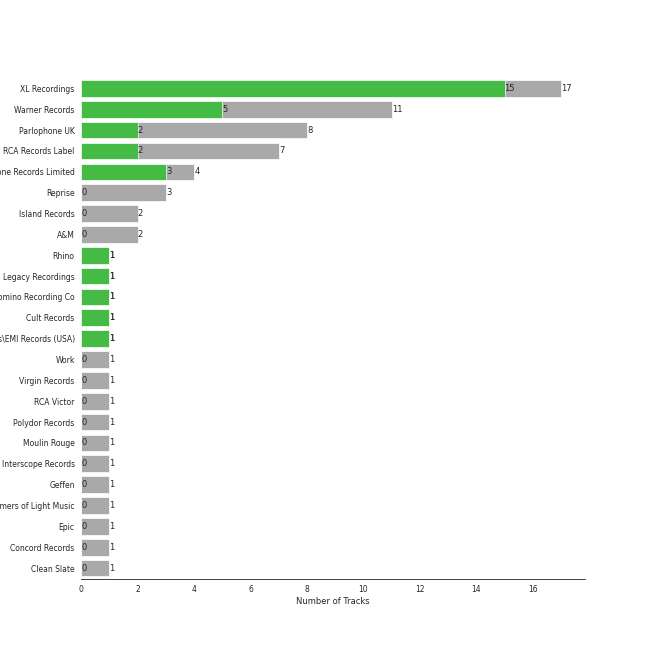

# permanent wave

65 songs

[See Track Features](audio_features.md)

[See Clusters](clusters/overview.md)

## Top Artists

| Art | Tracks | 💚 | Artist | 🔗 |
|:---|---:|---:|:---|:---|
|  | 17 | 15 | [Radiohead](../../artists/radiohead/overview.md) | [🔗](https://open.spotify.com/artist/4Z8W4fKeB5YxbusRsdQVPb) |
|  | 11 | 5 | [Coldplay](../../artists/coldplay/overview.md) | [🔗](https://open.spotify.com/artist/4gzpq5DPGxSnKTe4SA8HAU) |
|  | 5 | 4 | Muse | [🔗](https://open.spotify.com/artist/12Chz98pHFMPJEknJQMWvI) |
|  | 3 | 2 | The Strokes | [🔗](https://open.spotify.com/artist/0epOFNiUfyON9EYx7Tpr6V) |
|  | 6 | 1 | Red Hot Chili Peppers | [🔗](https://open.spotify.com/artist/0L8ExT028jH3ddEcZwqJJ5) |
|  | 1 | 1 | Blondie | [🔗](https://open.spotify.com/artist/4tpUmLEVLCGFr93o8hFFIB) |
|  | 1 | 1 | a-ha | [🔗](https://open.spotify.com/artist/2jzc5TC5TVFLXQlBNiIUzE) |
|  | 4 | 0 | Foo Fighters | [🔗](https://open.spotify.com/artist/7jy3rLJdDQY21OgRLCZ9sD) |
|  | 3 | 0 | Green Day | [🔗](https://open.spotify.com/artist/7oPftvlwr6VrsViSDV7fJY) |
|  | 2 | 0 | Fiona Apple | [🔗](https://open.spotify.com/artist/3g2kUQ6tHLLbmkV7T4GPtL) |

See all 22 artists

| Art | Tracks | 💚 | Artist | 🔗 |
|:---|---:|---:|:---|:---|
|  | 2 | 0 | Paul Simon | [🔗](https://open.spotify.com/artist/2CvCyf1gEVhI0mX6aFXmVI) |
|  | 2 | 0 | David Bowie | [🔗](https://open.spotify.com/artist/0oSGxfWSnnOXhD2fKuz2Gy) |
|  | 2 | 0 | Sting | [🔗](https://open.spotify.com/artist/0Ty63ceoRnnJKVEYP0VQpk) |
|  | 2 | 0 | The Killers | [🔗](https://open.spotify.com/artist/0C0XlULifJtAgn6ZNCW2eu) |
|  | 1 | 0 | Nirvana | [🔗](https://open.spotify.com/artist/6olE6TJLqED3rqDCT0FyPh) |
|  | 1 | 0 | [Rihanna](../../artists/rihanna/overview.md) | [🔗](https://open.spotify.com/artist/5pKCCKE2ajJHZ9KAiaK11H) |
|  | 1 | 0 | The King's Singers | [🔗](https://open.spotify.com/artist/5lR7yDVN4z9kahOiUSlMhe) |
|  | 1 | 0 | R.E.M. | [🔗](https://open.spotify.com/artist/4KWTAlx2RvbpseOGMEmROg) |
|  | 1 | 0 | The Smashing Pumpkins | [🔗](https://open.spotify.com/artist/40Yq4vzPs9VNUrIBG5Jr2i) |
|  | 1 | 0 | Snow Patrol | [🔗](https://open.spotify.com/artist/3rIZMv9rysU7JkLzEaC5Jp) |
|  | 1 | 0 | [Jacob Collier](../../artists/jacob_collier/overview.md) | [🔗](https://open.spotify.com/artist/0QWrMNukfcVOmgEU0FEDyD) |
|  | 1 | 0 | We Are KING | [🔗](https://open.spotify.com/artist/0FPWyyf6MD4QZTj3aypD3O) |

## Most and least listened tracks
| ​ | Most listened tracks | Score | ​​ | Least listened tracks | Score |
|:---|:---|---:|:---|:---|---:|
|  | [Exit Music (For A Film)](../../artists/radiohead/overview.md) | 264 |  | Mr. Brightside | 0 |
|  | [Jigsaw Falling Into Place](../../artists/radiohead/overview.md) | 86 |  | [Reckoner](../../artists/radiohead/overview.md) | 0 |
|  | [Paranoid Android](../../artists/radiohead/overview.md) | 84 |  | Slow Cheetah | 0 |
|  | Madness | 74 |  | [Clocks](../../artists/coldplay/overview.md) | 0 |
|  | [Fake Plastic Trees](../../artists/radiohead/overview.md) | 69 |  | Fields Of Gold | 0 |
|  | [Street Spirit (Fade Out)](../../artists/radiohead/overview.md) | 54 |  | Strip My Mind | 0 |
|  | [Karma Police](../../artists/radiohead/overview.md) | 33 |  | Shadowboxer | 0 |
|  | [Creep](../../artists/radiohead/overview.md) | 9 |  | You Can Call Me Al | 0 |
|  | The Pretender | 0 |  | Dani California | 0 |
|  | Knights of Cydonia | 0 |  | [No Surprises](../../artists/radiohead/overview.md) | 0 |

## Top Albums

| Art | Tracks | 💚 | Album | Release Date | 🔗 |
|:---|---:|---:|:---|:---|:---|
|  | 6 | 6 | OK Computer | 1997-05-28 | [🔗](https://open.spotify.com/album/6dVIqQ8qmQ5GBnJ9shOYGE) |
|  | 4 | 2 | In Rainbows | 2007-12-28 | [🔗](https://open.spotify.com/album/5vkqYmiPBYLaalcmjujWxK) |
|  | 4 | 1 | Stadium Arcadium | 2006-05-09 | [🔗](https://open.spotify.com/album/7xl50xr9NDkd3i2kBbzsNZ) |
|  | 3 | 3 | The Bends | 1995-03-13 | [🔗](https://open.spotify.com/album/35UJLpClj5EDrhpNIi4DFg) |
|  | 2 | 2 | The 2nd Law | 2012-09-24 | [🔗](https://open.spotify.com/album/3KuXEGcqLcnEYWnn3OEGy0) |
|  | 2 | 2 | A Rush of Blood to the Head | 2002-08-08 | [🔗](https://open.spotify.com/album/0RHX9XECH8IVI3LNgWDpmQ) |
|  | 2 | 1 | X&Y | 2005-06-07 | [🔗](https://open.spotify.com/album/4E7bV0pzG0LciBSWTszra6) |
|  | 2 | 1 | Black Holes and Revelations | 2006-06-19 | [🔗](https://open.spotify.com/album/0lw68yx3MhKflWFqCsGkIs) |
|  | 2 | 0 | Mylo Xyloto | 2011-10-24 | [🔗](https://open.spotify.com/album/2R7iJz5uaHjLEVnMkloO18) |
|  | 2 | 0 | Hot Fuss | 2004 | [🔗](https://open.spotify.com/album/4piJq7R3gjUOxnYs6lDCTg) |

See all 46 albums

| Art | Tracks | 💚 | Album | Release Date | 🔗 |
|:---|---:|---:|:---|:---|:---|
|  | 1 | 1 | Viva La Vida or Death and All His Friends | 2008-05-26 | [🔗](https://open.spotify.com/album/1CEODgTmTwLyabvwd7HBty) |
|  | 1 | 1 | The New Abnormal | 2020-04-10 | [🔗](https://open.spotify.com/album/2xkZV2Hl1Omi8rk2D7t5lN) |
|  | 1 | 1 | Room On Fire | 2003-10-28 | [🔗](https://open.spotify.com/album/3HFbH1loOUbqCyPsLuHLLh) |
|  | 1 | 1 | Parachutes | 2000-07-10 | [🔗](https://open.spotify.com/album/6ZG5lRT77aJ3btmArcykra) |
|  | 1 | 1 | Pablo Honey | 1993-02-22 | [🔗](https://open.spotify.com/album/3gBVdu4a1MMJVMy6vwPEb8) |
|  | 1 | 1 | Origin of Symmetry | 2001 | [🔗](https://open.spotify.com/album/1AP6uGYHdakRgwuWQsP5pK) |
|  | 1 | 1 | Kid A | 2000-10-02 | [🔗](https://open.spotify.com/album/6GjwtEZcfenmOf6l18N7T7) |
|  | 1 | 1 | Hunting High and Low | 1985-06-01 | [🔗](https://open.spotify.com/album/1ER3B6zev5JEAaqhnyyfbf) |
|  | 1 | 1 | Hail To the Thief | 2003-06-09 | [🔗](https://open.spotify.com/album/5mzoI3VH0ZWk1pLFR6RoYy) |
|  | 1 | 1 | Call Me | 2004-01-01 | [🔗](https://open.spotify.com/album/18fOLsMG8Msf1DEaW0E71K) |
|  | 1 | 1 | Amnesiac | 2001-03-12 | [🔗](https://open.spotify.com/album/6V9YnBmFjWmXCBaUVRCVXP) |
|  | 1 | 0 | Tidal | 1996-07-23 | [🔗](https://open.spotify.com/album/5gVBXH8MT6zfdRkjp7qT18) |
|  | 1 | 0 | There Is Nothing Left To Lose | 1999-11-02 | [🔗](https://open.spotify.com/album/28q2N44ocJECgf8sbHEDfY) |
|  | 1 | 0 | The Colour And The Shape | 1997-05-20 | [🔗](https://open.spotify.com/album/30ly6F6Xl0TKmyBCU50Khv) |
|  | 1 | 0 | Ten Summoner's Tales | 1993-03-09 | [🔗](https://open.spotify.com/album/5kV0KBXfELibs6qQJLmOtg) |
|  | 1 | 0 | Out Of Time (25th Anniversary Edition) | 1991-03-12 | [🔗](https://open.spotify.com/album/6yEuIwTQpciH1qtj7mP5GK) |
|  | 1 | 0 | Nimrod | 1997-10-14 | [🔗](https://open.spotify.com/album/3x2uer6Xh0d5rF8toWpRDA) |
|  | 1 | 0 | Nevermind (Remastered) | 1991-09-26 | [🔗](https://open.spotify.com/album/2guirTSEqLizK7j9i1MTTZ) |
|  | 1 | 0 | Music Of The Spheres | 2021-10-15 | [🔗](https://open.spotify.com/album/06mXfvDsRZNfnsGZvX2zpb) |
|  | 1 | 0 | Moulin Rouge | 2001-01-01 | [🔗](https://open.spotify.com/album/1Kg7AyuyIMTfD6geg9VghI) |
|  | 1 | 0 | Mellon Collie And The Infinite Sadness (Deluxe Edition) | 1995 | [🔗](https://open.spotify.com/album/55RhFRyQFihIyGf61MgcfV) |
|  | 1 | 0 | Is This It | 2001-07-30 | [🔗](https://open.spotify.com/album/2k8KgmDp9oHrmu0MIj4XDE) |
|  | 1 | 0 | In Your Honor | 2005-06-14 | [🔗](https://open.spotify.com/album/2eprpJCYbCbPZRKVGIEJxZ) |
|  | 1 | 0 | Greatest Hits: God's Favorite Band | 2017-11-17 | [🔗](https://open.spotify.com/album/3id4t9IqRoB1f1smOERtrY) |
|  | 1 | 0 | Graceland (25th Anniversary Deluxe Edition) | 1986-08-12 | [🔗](https://open.spotify.com/album/6WgGWYw6XXQyLTsWt7tXky) |
|  | 1 | 0 | Good Vibrations | 1993 | [🔗](https://open.spotify.com/album/10IUKCLZPs9onPwXfQVxfv) |
|  | 1 | 0 | Fetch The Bolt Cutters | 2020-04-17 | [🔗](https://open.spotify.com/album/0fO1KemWL2uCCQmM22iKlj) |
|  | 1 | 0 | Eyes Open | 2006-01-01 | [🔗](https://open.spotify.com/album/3k7bXPw2u0C0SBKPMsgMS3) |
|  | 1 | 0 | Everyday Life | 2019-11-22 | [🔗](https://open.spotify.com/album/2FeyIYDDAQqcOJKOKhvHdr) |
|  | 1 | 0 | Echoes, Silence, Patience & Grace | 2007-09-25 | [🔗](https://open.spotify.com/album/3ilXDEG0xiajK8AbqboeJz) |
|  | 1 | 0 | David Bowie (aka Space Oddity) [2015 Remaster] | 1969-11-04 | [🔗](https://open.spotify.com/album/1ay9Z4R5ZYI2TY7WiDhNYQ) |
|  | 1 | 0 | Christmas Lights | 2010-12-01 | [🔗](https://open.spotify.com/album/06CvxUVwS8h2aJYcCtApgy) |
|  | 1 | 0 | Californication (Deluxe Edition) | 1999-06-08 | [🔗](https://open.spotify.com/album/2Y9IRtehByVkegoD7TcLfi) |
|  | 1 | 0 | By the Way (Deluxe Edition) | 2002-07-09 | [🔗](https://open.spotify.com/album/6deiaArbeoqp1xPEGdEKp1) |
|  | 1 | 0 | American Idiot | 2004-09-21 | [🔗](https://open.spotify.com/album/5dN7F9DV0Qg1XRdIgW8rke) |
|  | 1 | 0 | ...Nothing Like The Sun | 1987-01-01 | [🔗](https://open.spotify.com/album/3mVCQqgwEvwD7lHy9KHi7R) |

## Top Record Labels

| Tracks | 💚 | Label |
|---:|---:|:---|
| 17 | 15 | [XL Recordings](../../labels/xl_recordings/overview.md) |
| 11 | 5 | [Warner Records](../../labels/warner_records/overview.md) |
| 4 | 3 | Parlophone Records Limited |
| 8 | 2 | [Parlophone UK](../../labels/parlophone_uk/overview.md) |
| 7 | 2 | [RCA Records Label](../../labels/rca_records_label/overview.md) |
| 1 | 1 | [Rhino](../../labels/rhino/overview.md) |
| 1 | 1 | Cult Records |
| 1 | 1 | Chrysalis\EMI Records (USA) |
| 3 | 0 | [Reprise](../../labels/reprise/overview.md) |
| 2 | 0 | [Island Records](../../labels/island_records/overview.md) |

See all 22 labels

| Tracks | 💚 | Label |
|---:|---:|:---|
| 2 | 0 | A&M |
| 1 | 0 | Work |
| 1 | 0 | [Virgin Records](../../labels/virgin_records/overview.md) |
| 1 | 0 | RCA Victor |
| 1 | 0 | [Polydor Records](../../labels/polydor_records/overview.md) |
| 1 | 0 | Moulin Rouge |
| 1 | 0 | Legacy Recordings |
| 1 | 0 | [Interscope Records](../../labels/interscope_records/overview.md) |
| 1 | 0 | [Geffen](../../labels/geffen/overview.md) |
| 1 | 0 | [Epic](../../labels/epic/overview.md) |
| 1 | 0 | Concord Records |
| 1 | 0 | Clean Slate |

## Top Producers

| Art | Producer | Tracks | Credit Types |
|:---|:---|---:|:---|
| | [Philip Selway](../../producers/philip_selway/overview.md) | 13 | Songwriter |
| | [Ed O'Brien](../../producers/ed_o_brien/overview.md) | 13 | Songwriter |
| | [Nigel Godrich](../../producers/nigel_godrich/overview.md) | 13 | Producer |
| | [Colin Greenwood](../../producers/colin_greenwood/overview.md) | 13 | Songwriter |
| | [Thom Yorke](../../producers/thom_yorke/overview.md) | 13 | Lyricist, Producer, Songwriter, Arranger |
| | [Jonny Greenwood](../../producers/jonny_greenwood/overview.md) | 13 | Songwriter, Arranger, Producer |
|  | [Radiohead](../../artists/radiohead/overview.md) | 12 | Arranger, Producer, Lyricist, Songwriter |
|  | Chris Martin | 5 | Songwriter |
| | Jonny Buckland | 5 | Songwriter |
| | Guy Berryman | 5 | Songwriter |

View all

| Art | Producer | Tracks | Credit Types |
|:---|:---|---:|:---|
| | Will Champion | 5 | Songwriter |
| | Ken Nelson | 4 | Producer |
|  | [Coldplay](../../artists/coldplay/overview.md) | 4 | Producer |
|  | Muse | 4 | Producer |
| | Paul Q. Kolderie | 3 | Producer |
| | John Leckie | 3 | Producer |
| | Michael Brauer | 3 | Producer |
|  | Chris Brown | 3 | Producer |
| | Matt Bellamy | 3 | Lyricist, Songwriter |
| | Sean Slade | 3 | Producer |
| | Rik Simpson | 3 | Producer |
| | Chris Blair | 2 | Producer |
| | Richard Woodcraft | 2 | Producer |
| | Tommaso Colliva | 2 | Producer |
| | Jason Lader | 2 | Producer |
| | Mark Phythian | 2 | Producer |
| | Adrian Bushby | 2 | Producer |
| | Hugo Nicolson | 2 | Producer |
| | Jim Warren | 2 | Producer |
| | Rick Rubin | 2 | Producer |
| | Dan Grech-Marguerat | 2 | Producer |
|  | Julian Casablancas | 2 | Lyricist, Songwriter |
| | Gerard Navarro | 1 | Producer |
|  | The Strokes | 1 | Arranger |
| | John Ratcliff | 1 | Producer |
| | Ryan Hewitt | 1 | Producer |
| | Fabrizio Moretti | 1 | Songwriter |
| | Nikolai Fraiture | 1 | Songwriter |
| | Mark Linett | 1 | Producer |
| | Ben Baptie | 1 | Producer |
| | Rich Costey | 1 | Producer |
| | John Frusciante | 1 | Songwriter |
| | Andrew Scheps | 1 | Producer |
| | Gordon Raphael | 1 | Producer |
| | Graeme Stewart | 1 | Producer |
| | Chris Holmes | 1 | Producer |
| | John Cornfield | 1 | Producer |
| | Chad Smith | 1 | Songwriter |
| | Audrey Riley | 1 | Arranger |
| | Markus Dravs | 1 | Producer |
| | Darrell Thorp | 1 | Producer |
| | Albert Hammond, Jr. | 1 | Songwriter |
| | Paul Read | 1 | Producer |
| | Andy Wallace | 1 | Producer |
| | Jon Hopkins | 1 | Producer |
| | Simon "Barny" Barnicott | 1 | Producer |
| | Paul Waaktaar-Savoy | 1 | Songwriter |
| | [Mark "Spike" Stent](../../producers/mark__spike__stent/overview.md) | 1 | Producer |
| | Magne Furuholmen | 1 | Songwriter |
| | Leslie Bricusse | 1 | Songwriter |
| | Morten Harket | 1 | Songwriter |
| | Flea | 1 | Songwriter |
| | Deborah Harry | 1 | Songwriter |
| | Andrea Wright | 1 | Producer |
| | Albert Hammond | 1 | Songwriter |
| | Nick Valensi | 1 | Songwriter |
| | Mike Hazlewood | 1 | Songwriter |
| | Giorgio Moroder | 1 | Songwriter |
| | Ric Peet | 1 | Producer |
| | Alan Tarney | 1 | Producer |
| | Chris Lord-Alge | 1 | Producer |
| | Pete Min | 1 | Producer |
|  | a-ha | 1 | Producer |
| | Toshikazu Yoshioka | 1 | Producer |
| | Anthony Kiedis | 1 | Songwriter |
| | Claudius Mittendorfer | 1 | Producer |
| | Jon Coles | 1 | Producer |
| | Dana Nielsen | 1 | Producer |
| | Anthony Newley | 1 | Songwriter |
| | Brian Eno | 1 | Producer |

## Years

| ​ | 10 newest albums | ​​ | 10 oldest albums |
|:---|:---|:---|:---|
|  | Music Of The Spheres (2021-10-15) |  | David Bowie (aka Space Oddity) [2015 Remaster] (1969-11-04) |
|  | Fetch The Bolt Cutters (2020-04-17) |  | Hunting High and Low (1985-06-01) |
|  | The New Abnormal (2020-04-10) |  | Graceland (25th Anniversary Deluxe Edition) (1986-08-12) |
|  | Everyday Life (2019-11-22) |  | ...Nothing Like The Sun (1987-01-01) |
|  | Greatest Hits: God's Favorite Band (2017-11-17) |  | Out Of Time (25th Anniversary Edition) (1991-03-12) |
|  | The 2nd Law (2012-09-24) |  | Nevermind (Remastered) (1991-09-26) |
|  | Mylo Xyloto (2011-10-24) |  | Good Vibrations (1993) |
|  | Christmas Lights (2010-12-01) |  | Pablo Honey (1993-02-22) |
|  | Viva La Vida or Death and All His Friends (2008-05-26) |  | Ten Summoner's Tales (1993-03-09) |
|  | In Rainbows (2007-12-28) |  | Mellon Collie And The Infinite Sadness (Deluxe Edition) (1995) |

