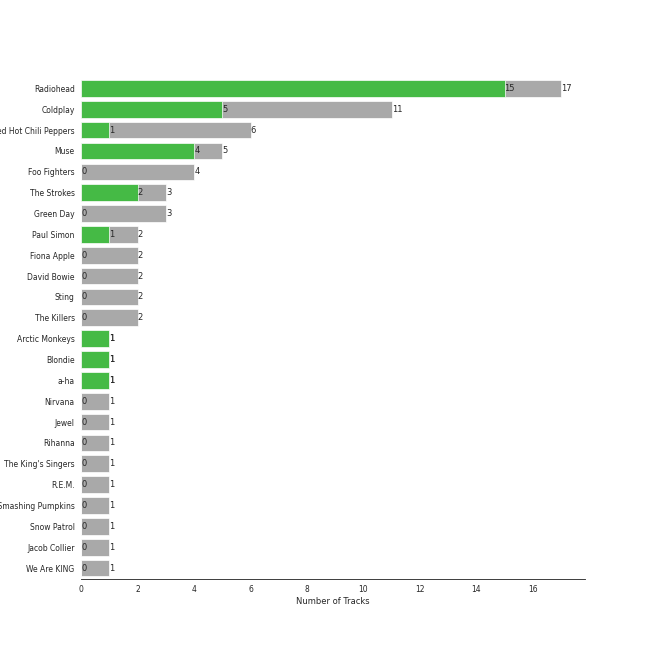
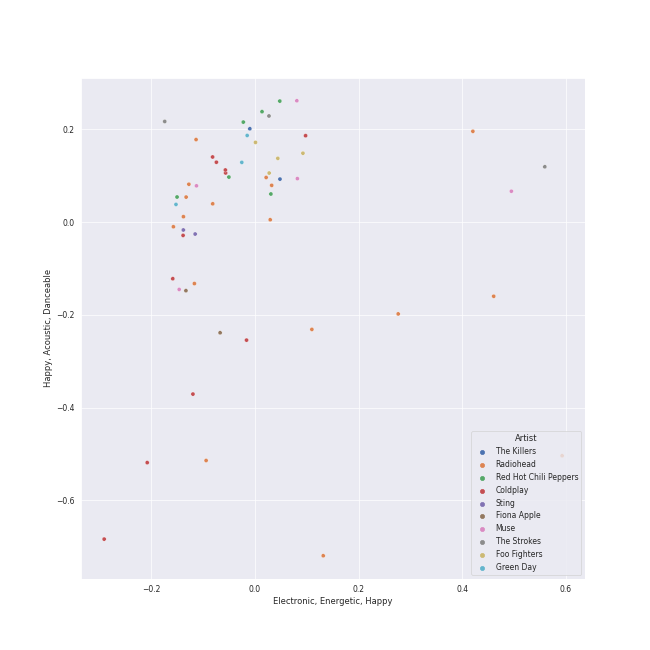
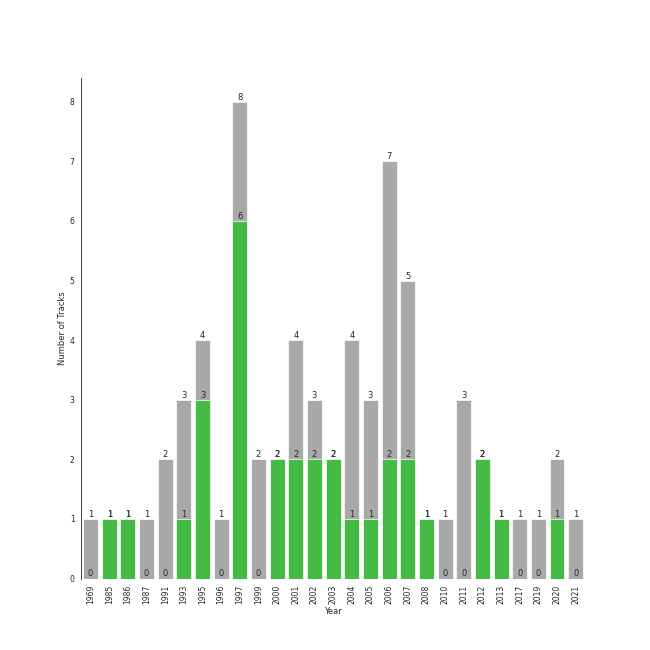

# permanent wave

[55 songs](tracks.md)

## Top Artists

| Art | Tracks | 💚 | Artist | 🔗 |
|:---|---:|---:|:---|:---|
|  | 16 | 14 | [Radiohead](../../artists/radiohead/overview.md) | [🔗](https://open.spotify.com/artist/4Z8W4fKeB5YxbusRsdQVPb) |
|  | 8 | 5 | Coldplay | [🔗](https://open.spotify.com/artist/4gzpq5DPGxSnKTe4SA8HAU) |
|  | 5 | 4 | Muse | [🔗](https://open.spotify.com/artist/12Chz98pHFMPJEknJQMWvI) |
|  | 3 | 2 | The Strokes | [🔗](https://open.spotify.com/artist/0epOFNiUfyON9EYx7Tpr6V) |
|  | 6 | 1 | Red Hot Chili Peppers | [🔗](https://open.spotify.com/artist/0L8ExT028jH3ddEcZwqJJ5) |
|  | 1 | 1 | a-ha | [🔗](https://open.spotify.com/artist/2jzc5TC5TVFLXQlBNiIUzE) |
|  | 4 | 0 | Foo Fighters | [🔗](https://open.spotify.com/artist/7jy3rLJdDQY21OgRLCZ9sD) |
|  | 3 | 0 | Green Day | [🔗](https://open.spotify.com/artist/7oPftvlwr6VrsViSDV7fJY) |
|  | 2 | 0 | Paul Simon | [🔗](https://open.spotify.com/artist/2CvCyf1gEVhI0mX6aFXmVI) |
|  | 2 | 0 | The Killers | [🔗](https://open.spotify.com/artist/0C0XlULifJtAgn6ZNCW2eu) |

See all 17 artists

| Art | Tracks | 💚 | Artist | 🔗 |
|:---|---:|---:|:---|:---|
|  | 1 | 0 | Nirvana | [🔗](https://open.spotify.com/artist/6olE6TJLqED3rqDCT0FyPh) |
|  | 1 | 0 | [Rihanna](../../artists/rihanna/overview.md) | [🔗](https://open.spotify.com/artist/5pKCCKE2ajJHZ9KAiaK11H) |
|  | 1 | 0 | The King's Singers | [🔗](https://open.spotify.com/artist/5lR7yDVN4z9kahOiUSlMhe) |
|  | 1 | 0 | The Smashing Pumpkins | [🔗](https://open.spotify.com/artist/40Yq4vzPs9VNUrIBG5Jr2i) |
|  | 1 | 0 | Snow Patrol | [🔗](https://open.spotify.com/artist/3rIZMv9rysU7JkLzEaC5Jp) |
|  | 1 | 0 | Fiona Apple | [🔗](https://open.spotify.com/artist/3g2kUQ6tHLLbmkV7T4GPtL) |
|  | 1 | 0 | Sting | [🔗](https://open.spotify.com/artist/0Ty63ceoRnnJKVEYP0VQpk) |

## Top Albums

| Art | Tracks | 💚 | Album | Release Date | 🔗 |
|:---|---:|---:|:---|:---|:---|
|  | 5 | 5 | OK Computer | 1997-05-28 | [🔗](https://open.spotify.com/album/6dVIqQ8qmQ5GBnJ9shOYGE) |
|  | 4 | 2 | In Rainbows | 2007-12-28 | [🔗](https://open.spotify.com/album/5vkqYmiPBYLaalcmjujWxK) |
|  | 4 | 1 | Stadium Arcadium | 2006-05-09 | [🔗](https://open.spotify.com/album/7xl50xr9NDkd3i2kBbzsNZ) |
|  | 3 | 3 | The Bends | 1995-03-13 | [🔗](https://open.spotify.com/album/35UJLpClj5EDrhpNIi4DFg) |
|  | 2 | 2 | The 2nd Law | 2012-09-24 | [🔗](https://open.spotify.com/album/3KuXEGcqLcnEYWnn3OEGy0) |
|  | 2 | 2 | A Rush of Blood to the Head | 2002-08-08 | [🔗](https://open.spotify.com/album/0RHX9XECH8IVI3LNgWDpmQ) |
|  | 2 | 1 | X&Y | 2005-06-07 | [🔗](https://open.spotify.com/album/4E7bV0pzG0LciBSWTszra6) |
|  | 2 | 1 | Black Holes and Revelations | 2006-06-19 | [🔗](https://open.spotify.com/album/0lw68yx3MhKflWFqCsGkIs) |
|  | 2 | 0 | Mylo Xyloto | 2011-10-24 | [🔗](https://open.spotify.com/album/2R7iJz5uaHjLEVnMkloO18) |
|  | 2 | 0 | Hot Fuss | 2004 | [🔗](https://open.spotify.com/album/4piJq7R3gjUOxnYs6lDCTg) |

See all 37 albums

| Art | Tracks | 💚 | Album | Release Date | 🔗 |
|:---|---:|---:|:---|:---|:---|
|  | 1 | 1 | Viva La Vida or Death and All His Friends | 2008-05-26 | [🔗](https://open.spotify.com/album/1CEODgTmTwLyabvwd7HBty) |
|  | 1 | 1 | The New Abnormal | 2020-04-10 | [🔗](https://open.spotify.com/album/2xkZV2Hl1Omi8rk2D7t5lN) |
|  | 1 | 1 | Room On Fire | 2003-10-28 | [🔗](https://open.spotify.com/album/3HFbH1loOUbqCyPsLuHLLh) |
|  | 1 | 1 | Parachutes | 2000-07-10 | [🔗](https://open.spotify.com/album/6ZG5lRT77aJ3btmArcykra) |
|  | 1 | 1 | Pablo Honey | 1993-02-22 | [🔗](https://open.spotify.com/album/3gBVdu4a1MMJVMy6vwPEb8) |
|  | 1 | 1 | Origin of Symmetry | 2001 | [🔗](https://open.spotify.com/album/1AP6uGYHdakRgwuWQsP5pK) |
|  | 1 | 1 | Kid A | 2000-10-02 | [🔗](https://open.spotify.com/album/6GjwtEZcfenmOf6l18N7T7) |
|  | 1 | 1 | Hunting High and Low | 1985-06-01 | [🔗](https://open.spotify.com/album/1ER3B6zev5JEAaqhnyyfbf) |
|  | 1 | 1 | Hail To the Thief | 2003-06-09 | [🔗](https://open.spotify.com/album/5mzoI3VH0ZWk1pLFR6RoYy) |
|  | 1 | 1 | Amnesiac | 2001-03-12 | [🔗](https://open.spotify.com/album/6V9YnBmFjWmXCBaUVRCVXP) |
|  | 1 | 0 | Tidal | 1996-07-23 | [🔗](https://open.spotify.com/album/5gVBXH8MT6zfdRkjp7qT18) |
|  | 1 | 0 | There Is Nothing Left To Lose | 1999-11-02 | [🔗](https://open.spotify.com/album/28q2N44ocJECgf8sbHEDfY) |
|  | 1 | 0 | The Colour And The Shape | 1997-05-20 | [🔗](https://open.spotify.com/album/30ly6F6Xl0TKmyBCU50Khv) |
|  | 1 | 0 | Ten Summoner's Tales | 1993-03-09 | [🔗](https://open.spotify.com/album/5kV0KBXfELibs6qQJLmOtg) |
|  | 1 | 0 | Nimrod | 1997-10-14 | [🔗](https://open.spotify.com/album/3x2uer6Xh0d5rF8toWpRDA) |
|  | 1 | 0 | Nevermind (Remastered) | 1991-09-26 | [🔗](https://open.spotify.com/album/2guirTSEqLizK7j9i1MTTZ) |
|  | 1 | 0 | Mellon Collie And The Infinite Sadness (Deluxe Edition) | 1995 | [🔗](https://open.spotify.com/album/55RhFRyQFihIyGf61MgcfV) |
|  | 1 | 0 | Is This It | 2001-07-30 | [🔗](https://open.spotify.com/album/2k8KgmDp9oHrmu0MIj4XDE) |
|  | 1 | 0 | In Your Honor | 2005-06-14 | [🔗](https://open.spotify.com/album/2eprpJCYbCbPZRKVGIEJxZ) |
|  | 1 | 0 | Greatest Hits: God's Favorite Band | 2017-11-17 | [🔗](https://open.spotify.com/album/3id4t9IqRoB1f1smOERtrY) |
|  | 1 | 0 | Graceland (25th Anniversary Deluxe Edition) | 1986-08-12 | [🔗](https://open.spotify.com/album/6WgGWYw6XXQyLTsWt7tXky) |
|  | 1 | 0 | Good Vibrations | 1993 | [🔗](https://open.spotify.com/album/10IUKCLZPs9onPwXfQVxfv) |
|  | 1 | 0 | Eyes Open | 2006-01-01 | [🔗](https://open.spotify.com/album/3k7bXPw2u0C0SBKPMsgMS3) |
|  | 1 | 0 | Echoes, Silence, Patience & Grace | 2007-09-25 | [🔗](https://open.spotify.com/album/3ilXDEG0xiajK8AbqboeJz) |
|  | 1 | 0 | Californication (Deluxe Edition) | 1999-06-08 | [🔗](https://open.spotify.com/album/2Y9IRtehByVkegoD7TcLfi) |
|  | 1 | 0 | By the Way (Deluxe Edition) | 2002-07-09 | [🔗](https://open.spotify.com/album/6deiaArbeoqp1xPEGdEKp1) |
|  | 1 | 0 | American Idiot | 2004-09-21 | [🔗](https://open.spotify.com/album/5dN7F9DV0Qg1XRdIgW8rke) |

## Top Record Labels

| Tracks | 💚 | Label |
|---:|---:|:---|
| 16 | 14 | [XL Recordings](../../labels/xl_recordings/overview.md) |
| 11 | 5 | [Warner Records](../../labels/warner_records/overview.md) |
| 4 | 3 | Parlophone Records Limited |
| 7 | 2 | [RCA Records Label](../../labels/rca_records_label/overview.md) |
| 4 | 2 | Parlophone UK |
| 1 | 1 | [Rhino](../../labels/rhino/overview.md) |
| 1 | 1 | Cult Records |
| 3 | 0 | [Reprise](../../labels/reprise/overview.md) |
| 2 | 0 | Island Records |
| 1 | 0 | Work |

See all 17 labels

| Tracks | 💚 | Label |
|---:|---:|:---|
| 1 | 0 | [Virgin Records](../../labels/virgin_records/overview.md) |
| 1 | 0 | RCA Victor |
| 1 | 0 | [Polydor Records](../../labels/polydor_records/overview.md) |
| 1 | 0 | Legacy Recordings |
| 1 | 0 | [Geffen](../../labels/geffen/overview.md) |
| 1 | 0 | Clean Slate |
| 1 | 0 | A&M |

## Years

| 10 newest albums | 10 oldest albums |
|:---|:---|
| 
 The New Abnormal (2020-04-10)
 | 
 Hunting High and Low (1985-06-01)
 |
| 
 Greatest Hits: God's Favorite Band (2017-11-17)
 | 
 Graceland (25th Anniversary Deluxe Edition) (1986-08-12)
 |
| 
 The 2nd Law (2012-09-24)
 | 
 Nevermind (Remastered) (1991-09-26)
 |
| 
 Mylo Xyloto (2011-10-24)
 | 
 Good Vibrations (1993)
 |
| 
 Viva La Vida or Death and All His Friends (2008-05-26)
 | 
 Pablo Honey (1993-02-22)
 |
| 
 In Rainbows (2007-12-28)
 | 
 Ten Summoner's Tales (1993-03-09)
 |
| 
 Echoes, Silence, Patience & Grace (2007-09-25)
 | 
 Mellon Collie And The Infinite Sadness (Deluxe Edition) (1995)
 |
| 
 Black Holes and Revelations (2006-06-19)
 | 
 The Bends (1995-03-13)
 |
| 
 Stadium Arcadium (2006-05-09)
 | 
 Tidal (1996-07-23)
 |
| 
 Eyes Open (2006-01-01)
 | 
 The Colour And The Shape (1997-05-20)
 |
## Audio Features

| 10 most Danceable tracks | 10 least Danceable tracks |
|:---|:---|
| You Can Call Me Al (0.776) | Pyramid Song (0.127) |
| 1979 - Remastered 2012 (0.767) | Fix You (0.209) |
| All I Need (0.67) | Paranoid Android (0.251) |
| Supermassive Black Hole (0.668) | No Surprises (0.255) |
| Fields Of Gold (0.651) | Exit Music (For A Film) (0.293) |
| Can't Stop (0.618) | Everything In Its Right Place (0.296) |
| There, There (0.614) | Shadowboxer (0.298) |
| The Adults Are Talking (0.593) | Feeling Good (0.345) |
| Californication (0.592) | Let Down (0.351) |
| Clocks (0.577) | The Boxer (0.351) |

| 10 most Energetic tracks | 10 least Energetic tracks |
|:---|:---|
| American Idiot (0.988) | The Boxer (0.0802) |
| Knights of Cydonia (0.963) | Fake Plastic Trees (0.229) |
| The Pretender (0.959) | Exit Music (For A Film) (0.276) |
| Best of You (0.94) | Pyramid Song (0.335) |
| Can't Stop (0.938) | Fields Of Gold (0.339) |
| Supermassive Black Hole (0.921) | Slow Cheetah (0.344) |
| Learn to Fly (0.919) | High and Dry (0.383) |
| Dani California (0.913) | No Surprises (0.393) |
| Smells Like Teen Spirit (0.912) | Madness (0.417) |
| Mr. Brightside (0.911) | Fix You (0.417) |

| 10 most Speechy tracks | 10 least Speechy tracks |
|:---|:---|
| Knights of Cydonia (0.142) | The Scientist (0.0243) |
| Mr. Brightside (0.0747) | Fields Of Gold (0.0246) |
| Madness (0.0718) | High and Dry (0.0256) |
| Best of You (0.0696) | Karma Police (0.0258) |
| American Idiot (0.0639) | Reckoner (0.0262) |
| Paranoid Android (0.0579) | Paradise (0.0268) |
| Speed of Sound (0.0577) | Californication (0.027) |
| Smells Like Teen Spirit (0.0564) | Chasing Cars (0.0274) |
| Take on Me (0.054) | No Surprises (0.0278) |
| You Can Call Me Al (0.0534) | Clocks (0.0279) |

| 10 most Acoustic tracks | 10 least Acoustic tracks |
|:---|:---|
| The Boxer (0.93) | Learn to Fly (1.83e-05) |
| Pyramid Song (0.786) | Smells Like Teen Spirit (2.55e-05) |
| Weird Fishes/ Arpeggi (0.772) | American Idiot (2.64e-05) |
| The Scientist (0.731) | Everlong (5.99e-05) |
| Everything In Its Right Place (0.705) | Let Down (0.000121) |
| Clocks (0.599) | Knights of Cydonia (0.000273) |
| All I Need (0.531) | Reptilia (0.000603) |
| Reckoner (0.511) | Best of You (0.000769) |
| Fields Of Gold (0.372) | The Pretender (0.000917) |
| Street Spirit (Fade Out) (0.317) | Mr. Brightside (0.00121) |

| 10 most Instrumental tracks | 10 least Instrumental tracks |
|:---|:---|
| Animals (0.796) | Mr. Brightside (0.0) |
| Weird Fishes/ Arpeggi (0.756) | Shadowboxer (0.0) |
| Reptilia (0.713) | Can't Stop (0.0) |
| Street Spirit (Fade Out) (0.694) | Good Riddance (Time of Your Life) (0.0) |
| 1979 - Remastered 2012 (0.583) | Someday (0.0) |
| There, There (0.52) | The Pretender (0.0) |
| All I Need (0.428) | Viva La Vida (3.23e-06) |
| Pyramid Song (0.427) | Dani California (8.59e-06) |
| Reckoner (0.16) | The Scientist (1.46e-05) |
| Exit Music (For A Film) (0.122) | The Boxer (1.59e-05) |

| 10 most Live tracks | 10 least Live tracks |
|:---|:---|
| Animals (0.696) | The Pretender (0.028) |
| American Idiot (0.368) | 1979 - Remastered 2012 (0.0513) |
| Someday (0.367) | Paranoid Android (0.0545) |
| Dani California (0.346) | Boulevard of Broken Dreams (0.0589) |
| The Adults Are Talking (0.314) | The Boxer (0.0619) |
| Princess of China (0.287) | Reckoner (0.0679) |
| Learn to Fly (0.262) | Slow Cheetah (0.0715) |
| Yellow (0.234) | Fields Of Gold (0.0739) |
| Fake Plastic Trees (0.202) | Jigsaw Falling Into Place (0.0741) |
| Best of You (0.188) | Speed of Sound (0.0746) |

| 10 most Happy tracks | 10 least Happy tracks |
|:---|:---|
| 1979 - Remastered 2012 (0.964) | Everything In Its Right Place (0.0629) |
| Take on Me (0.876) | Pyramid Song (0.0686) |
| Can't Stop (0.875) | All I Need (0.0997) |
| You Can Call Me Al (0.82) | Creep (0.104) |
| Jigsaw Falling Into Place (0.807) | No Surprises (0.118) |
| Supermassive Black Hole (0.782) | Fix You (0.124) |
| Reptilia (0.77) | Street Spirit (Fade Out) (0.131) |
| American Idiot (0.769) | Fake Plastic Trees (0.135) |
| Dani California (0.73) | Let Down (0.143) |
| Smells Like Teen Spirit (0.72) | Chasing Cars (0.144) |
