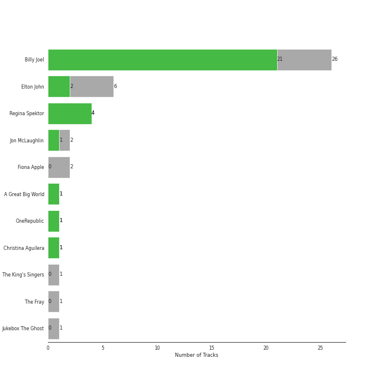
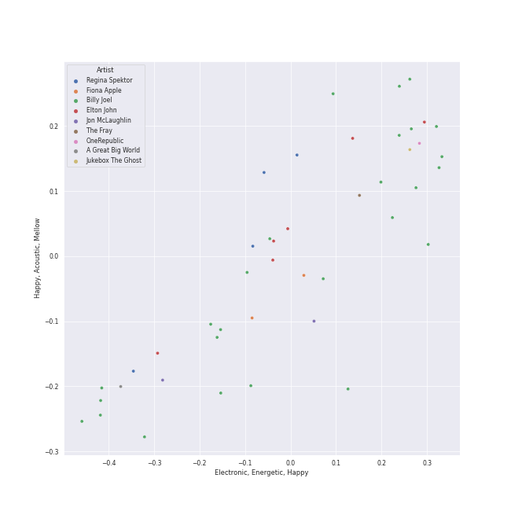

# piano rock

[40 songs](piano_rock_tracks.md)

## Top Artists

See all 9 artists

| Number of Tracks | Art | Artist | 🔗 |
|---:|:---|:---|:---|
| 24 |  | [Billy Joel](../artists/billy_joel.md) | [🔗](https://open.spotify.com/artist/6zFYqv1mOsgBRQbae3JJ9e) |
| 6 |  | Elton John | [🔗](https://open.spotify.com/artist/3PhoLpVuITZKcymswpck5b) |
| 4 |  | Regina Spektor | [🔗](https://open.spotify.com/artist/3z6Gk257P9jNcZbBXJNX5i) |
| 2 |  | Jon McLaughlin | [🔗](https://open.spotify.com/artist/6z29S0IoiBJpSMP8plyCj7) |
| 2 |  | OneRepublic | [🔗](https://open.spotify.com/artist/5Pwc4xIPtQLFEnJriah9YJ) |
| 1 |  | A Great Big World | [🔗](https://open.spotify.com/artist/5xKp3UyavIBUsGy3DQdXeF) |
| 1 |  | [The King's Singers](../artists/the_king_s_singers.md) | [🔗](https://open.spotify.com/artist/5lR7yDVN4z9kahOiUSlMhe) |
| 1 |  | Fiona Apple | [🔗](https://open.spotify.com/artist/3g2kUQ6tHLLbmkV7T4GPtL) |
| 1 |  | Christina Aguilera | [🔗](https://open.spotify.com/artist/1l7ZsJRRS8wlW3WfJfPfNS) |

## Top Albums

See all 25 albums

| Number of Tracks | Art | Album | Release Date | 🔗 |
|---:|:---|:---|:---|:---|
| 7 |  | The Stranger | 1977-09-29 | [🔗](https://open.spotify.com/album/3IILMjMMnoN2sKzgesX8KV) |
| 3 |  | Begin to Hope | 2006-06-13 | [🔗](https://open.spotify.com/album/4L4tcx3itXbtx5kuchKhFE) |
| 2 |  | Storm Front | 1989-10-17 | [🔗](https://open.spotify.com/album/1Vw2uoVkLAJFVViJ1QyK1D) |
| 2 |  | River Of Dreams | 1993-08-10 | [🔗](https://open.spotify.com/album/4HPnwQJAEvTY910q4RNeOu) |
| 2 |  | Piano Man | 1973-11-09 | [🔗](https://open.spotify.com/album/77ErLrVvYETIlQJHAwhfIH) |
| 2 |  | Goodbye Yellow Brick Road (Remastered) | 1973-10-05 | [🔗](https://open.spotify.com/album/5WupqgR68HfuHt3BMJtgun) |
| 2 |  | Dreaming Out Loud | 2007-01-01 | [🔗](https://open.spotify.com/album/2KSpGeDoNjqCKg6HL8LAyI) |
| 2 |  | An Innocent Man | 1983-08-08 | [🔗](https://open.spotify.com/album/3R3x4zIabsvpD3yxqLaUpc) |
| 2 |  | 52nd Street | 1978-10-13 | [🔗](https://open.spotify.com/album/1HmCO8VK98AU6EXPOjGYyI) |
| 1 |  | Turnstiles | 1976-05-19 | [🔗](https://open.spotify.com/album/7GiLfxL1su3MSqz7pmKMZi) |
| 1 |  | Tidal | 1996-07-23 | [🔗](https://open.spotify.com/album/5gVBXH8MT6zfdRkjp7qT18) |
| 1 |  | The Stranger (Legacy Edition) | 1977 | [🔗](https://open.spotify.com/album/1Mhn9VosyjtWn4dMPFlna6) |
| 1 |  | The Nylon Curtain | 1982-06-23 | [🔗](https://open.spotify.com/album/50bajZpetfL5T0iRCOR74J) |
| 1 |  | The Bridge | 1986-07-28 | [🔗](https://open.spotify.com/album/2fRxSC6FtiAkhEDVZr2seH) |
| 1 |  | OK Now | 2008-01-01 | [🔗](https://open.spotify.com/album/3fKJJQFV6a61fnKYDDj2LU) |
| 1 |  | Madman Across The Water | 1971-11-05 | [🔗](https://open.spotify.com/album/2OZbaW9tgO62ndm375lFZr) |
| 1 |  | Is There Anybody Out There? | 2014-01-20 | [🔗](https://open.spotify.com/album/1yOcLa4euMk9sV7rRJ89Dl) |
| 1 |  | Indiana | 2007-01-01 | [🔗](https://open.spotify.com/album/2UpO4j1Zpptiwk3wbUIWmU) |
| 1 |  | Honky Chateau | 1972-05-19 | [🔗](https://open.spotify.com/album/2ei2X6ghPnw7YRwQtAH075) |
| 1 |  | Good Vibrations | 1993 | [🔗](https://open.spotify.com/album/10IUKCLZPs9onPwXfQVxfv) |
| 1 |  | Glass Houses | 1980-03-12 | [🔗](https://open.spotify.com/album/5sztejERqpktXEdemlUvU5) |
| 1 |  | Far | 2009-06-09 | [🔗](https://open.spotify.com/album/5t0lQDPLF22wmWCtSZkIVv) |
| 1 |  | Elton John | 1970-04-10 | [🔗](https://open.spotify.com/album/69P9Ro0W286yLFgYwrGVN0) |
| 1 |  | Don't Shoot Me I'm Only The Piano Player | 1973-01-22 | [🔗](https://open.spotify.com/album/1reJ8DttK5EGwdyf7y9FBR) |
| 1 |  | Cold Spring Harbor | 1971-11-01 | [🔗](https://open.spotify.com/album/274rMlKrr22086ohmwAJZA) |

## Top Record Labels

See all 12 labels

| Number of Tracks | Label |
|---:|:---|
| 23 | [Columbia](../labels/columbia.md) |
| 4 | Sire |
| 3 | [UMC (Universal Music Catalogue)](../labels/umc__universal_music_catalogue_.md) |
| 3 | EMI |
| 2 | Mosley |
| 2 | Island Def Jam |
| 2 | [Interscope Records](../labels/interscope_records.md) |
| 1 | Work |
| 1 | RCA Victor |
| 1 | [Legacy](../labels/legacy.md) |
| 1 | [Epic](../labels/epic.md) |
| 1 | Clean Slate |

## Audio Features

| 10 most Danceable tracks | 10 least Danceable tracks |
|:---|:---|
| Fidelity (0.923) | She's Always a Woman (0.292) |
| On the Radio (0.88) | Shadowboxer (0.298) |
| My Life (0.741) | Piano Man (0.334) |
| A Matter of Trust (0.738) | We All Need Saving (0.35) |
| We Didn't Start the Fire (0.712) | And So It Goes (0.351) |
| Uptown Girl (0.701) | Captain Jack (0.392) |
| Don't Ask Me Why (0.691) | Say Something (0.407) |
| Eet (0.665) | Tiny Dancer (0.414) |
| The Stranger (0.664) | Scenes from an Italian Restaurant (0.415) |
| Movin' Out (Anthony's Song) (0.664) | And So It Goes (0.433) |

| 10 most Energetic tracks | 10 least Energetic tracks |
|:---|:---|
| We Didn't Start the Fire (0.967) | And So It Goes (0.0387) |
| Uptown Girl (0.944) | And So It Goes (0.0871) |
| Scenes from an Italian Restaurant (0.931) | She's Got a Way (0.142) |
| Movin' Out (Anthony's Song) (0.88) | Say Something (0.147) |
| The Stranger (0.878) | Come Home (0.155) |
| Only the Good Die Young (0.872) | Lullabye (Goodnight, My Angel) (0.157) |
| Industry (0.831) | Samson (0.193) |
| Crocodile Rock (0.8) | We All Need Saving (0.263) |
| The River of Dreams (0.749) | Your Song (0.315) |
| Say (All I Need) (0.742) | She's Always a Woman (0.324) |

| 10 most Speechy tracks | 10 least Speechy tracks |
|:---|:---|
| Only the Good Die Young (0.159) | The Longest Time (0.0262) |
| Scenes from an Italian Restaurant (0.126) | A Matter of Trust (0.0268) |
| Big Shot (0.0972) | Piano Man (0.0276) |
| The Stranger (0.0837) | Tiny Dancer (0.0278) |
| The River of Dreams (0.0576) | Goodbye Yellow Brick Road - Remastered 2014 (0.0279) |
| Don't Ask Me Why (0.0543) | Come Home (0.0286) |
| Say (All I Need) (0.0498) | Rocket Man (I Think It's Going To Be A Long, Long Time) (0.0286) |
| Fidelity (0.0492) | Candle In The Wind - Remastered 2014 (0.0288) |
| Pressure (0.0474) | Your Song (0.0298) |
| We Didn't Start the Fire (0.047) | Shadowboxer (0.0303) |

| 10 most Acoustic tracks | 10 least Acoustic tracks |
|:---|:---|
| She's Got a Way (0.97) | Pressure (0.0148) |
| Lullabye (Goodnight, My Angel) (0.948) | Say (All I Need) (0.0184) |
| Come Home (0.947) | Crocodile Rock (0.0263) |
| And So It Goes (0.941) | A Matter of Trust (0.0589) |
| And So It Goes (0.91) | Uptown Girl (0.0755) |
| Samson (0.862) | We Didn't Start the Fire (0.0771) |
| Say Something (0.857) | My Life (0.108) |
| Your Song (0.828) | Don't Ask Me Why (0.138) |
| She's Always a Woman (0.797) | Big Shot (0.156) |
| We All Need Saving (0.725) | Only the Good Die Young (0.159) |

| 10 most Instrumental tracks | 10 least Instrumental tracks |
|:---|:---|
| Goodbye Yellow Brick Road - Remastered 2014 (0.00141) | Shadowboxer (0.0) |
| My Life (0.00139) | And So It Goes (0.0) |
| Pressure (0.000949) | Only the Good Die Young (0.0) |
| On the Radio (0.000833) | We Didn't Start the Fire (0.0) |
| Eet (0.000669) | We All Need Saving (0.0) |
| Scenes from an Italian Restaurant (0.000501) | Vienna (0.0) |
| She's Always a Woman (0.000473) | Lullabye (Goodnight, My Angel) (0.0) |
| Tiny Dancer (0.000243) | Industry (0.0) |
| Fidelity (0.000142) | The Longest Time (0.0) |
| Captain Jack (6.12e-05) | Uptown Girl (0.0) |

| 10 most Live tracks | 10 least Live tracks |
|:---|:---|
| Uptown Girl (0.601) | My Life (0.0555) |
| Captain Jack (0.374) | Movin' Out (Anthony's Song) (0.0591) |
| We Didn't Start the Fire (0.356) | Crocodile Rock (0.0591) |
| New York State of Mind (0.323) | The River of Dreams (0.0667) |
| Piano Man (0.312) | On the Radio (0.0693) |
| A Matter of Trust (0.306) | Vienna (0.0754) |
| Lullabye (Goodnight, My Angel) (0.224) | Vienna (0.0754) |
| Shadowboxer (0.165) | Candle In The Wind - Remastered 2014 (0.0802) |
| Goodbye Yellow Brick Road - Remastered 2014 (0.154) | The Stranger (0.0812) |
| Say (All I Need) (0.153) | Eet (0.082) |

| 10 most Happy tracks | 10 least Happy tracks |
|:---|:---|
| Crocodile Rock (0.968) | Say Something (0.0765) |
| Movin' Out (Anthony's Song) (0.895) | We All Need Saving (0.117) |
| We Didn't Start the Fire (0.895) | Come Home (0.16) |
| A Matter of Trust (0.88) | Eet (0.172) |
| Don't Ask Me Why (0.868) | Samson (0.184) |
| Pressure (0.851) | New York State of Mind (0.194) |
| My Life (0.804) | She's Got a Way (0.196) |
| Uptown Girl (0.792) | Lullabye (Goodnight, My Angel) (0.22) |
| Only the Good Die Young (0.761) | The Stranger (0.222) |
| Big Shot (0.728) | Shadowboxer (0.223) |
