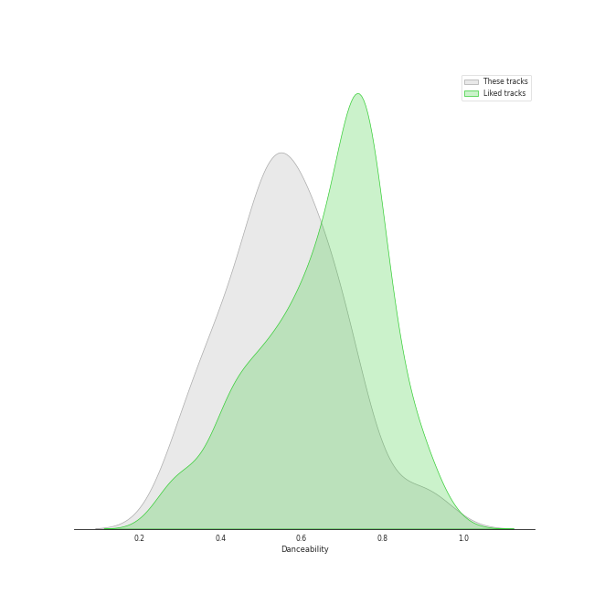
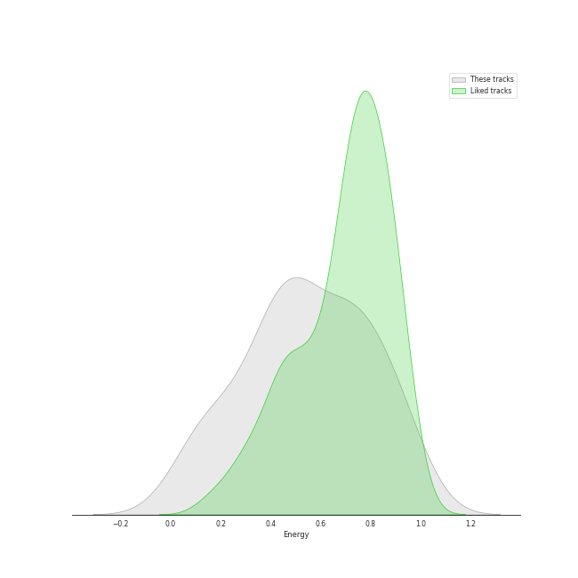
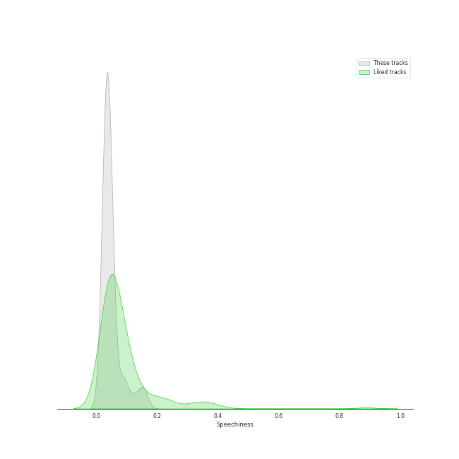
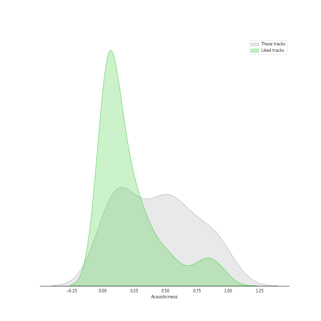
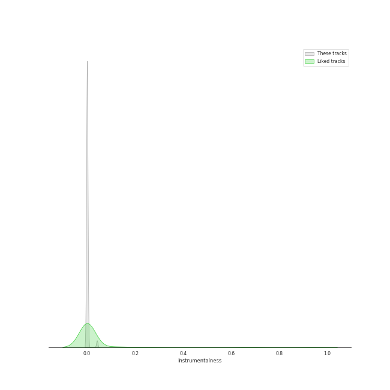
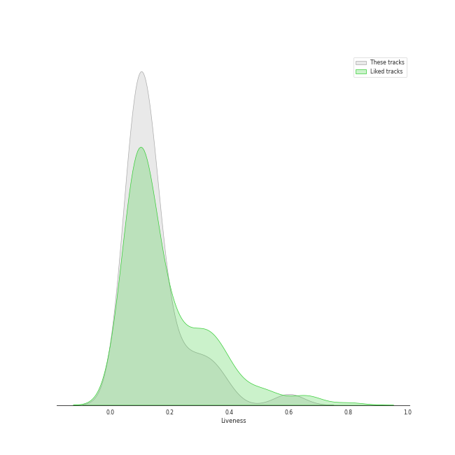
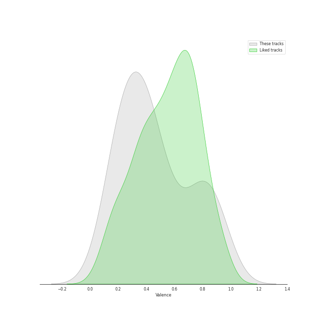
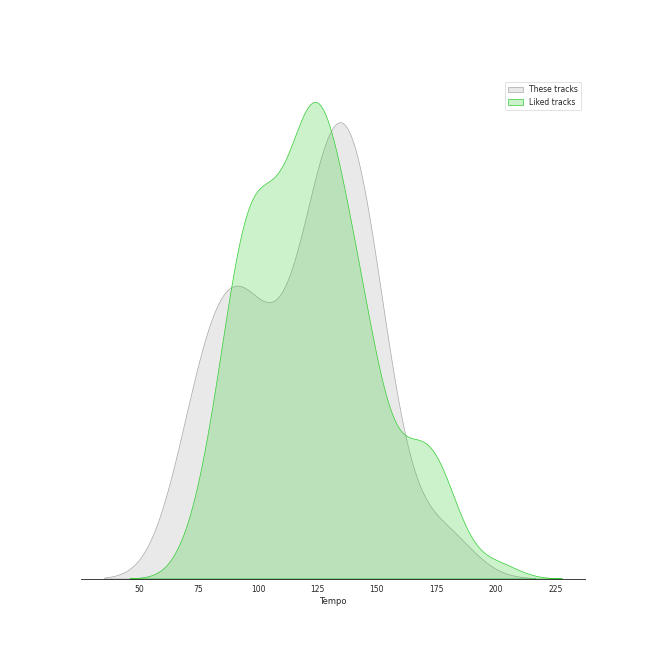

# Track Features for piano rock

## Danceability

| ​ | 10 most Danceable tracks | ​​ | 10 least Danceable tracks |
|:---|:---|:---|:---|
|  | Fidelity (0.923) |  | She's Always a Woman (0.292) |
|  | On the Radio (0.88) |  | Shadowboxer (0.298) |
|  | It's Still Rock and Roll to Me (0.752) |  | Piano Man (0.331) |
|  | My Life (0.741) |  | We All Need Saving (0.35) |
|  | A Matter of Trust (0.738) |  | And So It Goes (0.351) |
|  | We Didn't Start the Fire (0.712) |  | Captain Jack (0.392) |
|  | Uptown Girl (0.701) |  | Say Something (0.407) |
|  | Don't Ask Me Why (0.691) |  | Tiny Dancer (0.414) |
|  | Eet (0.665) |  | Scenes from an Italian Restaurant (0.415) |
|  | The Stranger (0.664) |  | And So It Goes (0.433) |

## Energy

| ​ | 10 most Energetic tracks | ​​ | 10 least Energetic tracks |
|:---|:---|:---|:---|
|  | We Didn't Start the Fire (0.967) |  | And So It Goes (0.0387) |
|  | Uptown Girl (0.944) |  | And So It Goes (0.0871) |
|  | Scenes from an Italian Restaurant (0.931) |  | She's Got a Way (0.142) |
|  | Movin' Out (Anthony's Song) (0.88) |  | Say Something (0.147) |
|  | The Stranger (0.878) |  | Lullabye (Goodnight, My Angel) (0.157) |
|  | Only the Good Die Young (0.872) |  | Samson (0.193) |
|  | Industry (0.831) |  | We All Need Saving (0.263) |
|  | Crocodile Rock (0.8) |  | Your Song (0.315) |
|  | The River of Dreams (0.749) |  | She's Always a Woman (0.324) |
|  | The Great Unknown (0.747) |  | The Longest Time (0.333) |

## Speechiness

| ​ | 10 most Speechy tracks | ​​ | 10 least Speechy tracks |
|:---|:---|:---|:---|
|  | Only the Good Die Young (0.159) |  | The Longest Time (0.0262) |
|  | It's Still Rock and Roll to Me (0.15) |  | Turn the Lights Back On (0.0264) |
|  | Scenes from an Italian Restaurant (0.126) |  | A Matter of Trust (0.0268) |
|  | Big Shot (0.0972) |  | Piano Man (0.0272) |
|  | I Want You To Love Me (0.09) |  | Tiny Dancer (0.0278) |
|  | The Stranger (0.0837) |  | Goodbye Yellow Brick Road - Remastered 2014 (0.0279) |
|  | The River of Dreams (0.0576) |  | Rocket Man (I Think It's Going To Be A Long, Long Time) (0.0286) |
|  | Don't Ask Me Why (0.0543) |  | The Great Unknown (0.0287) |
|  | Say (All I Need) (0.0498) |  | Candle In The Wind - Remastered 2014 (0.0288) |
|  | Fidelity (0.0492) |  | Light As the Breeze (0.0295) |

## Acousticness

| ​ | 10 most Acoustic tracks | ​​ | 10 least Acoustic tracks |
|:---|:---|:---|:---|
|  | She's Got a Way (0.97) |  | Pressure (0.0148) |
|  | Lullabye (Goodnight, My Angel) (0.948) |  | Say (All I Need) (0.0184) |
|  | And So It Goes (0.941) |  | Crocodile Rock (0.0264) |
|  | And So It Goes (0.91) |  | The Great Unknown (0.0335) |
|  | Samson (0.862) |  | A Matter of Trust (0.0589) |
|  | Say Something (0.857) |  | Uptown Girl (0.0755) |
|  | Your Song (0.828) |  | We Didn't Start the Fire (0.0771) |
|  | She's Always a Woman (0.797) |  | It's Still Rock and Roll to Me (0.0994) |
|  | We All Need Saving (0.725) |  | My Life (0.108) |
|  | Just the Way You Are (0.703) |  | Don't Ask Me Why (0.138) |

## Instrumentalness

| ​ | 10 most Instrumental tracks | ​​ | 10 least Instrumental tracks |
|:---|:---|:---|:---|
|  | I Want You To Love Me (0.0414) |  | Shadowboxer (0.0) |
|  | Goodbye Yellow Brick Road - Remastered 2014 (0.00141) |  | Turn the Lights Back On (0.0) |
|  | My Life (0.00139) |  | And So It Goes (0.0) |
|  | Pressure (0.000949) |  | Only the Good Die Young (0.0) |
|  | On the Radio (0.000833) |  | We Didn't Start the Fire (0.0) |
|  | Eet (0.000669) |  | We All Need Saving (0.0) |
|  | Scenes from an Italian Restaurant (0.000501) |  | Vienna (0.0) |
|  | She's Always a Woman (0.000473) |  | Lullabye (Goodnight, My Angel) (0.0) |
|  | Tiny Dancer (0.000243) |  | Industry (0.0) |
|  | Fidelity (0.000142) |  | The Longest Time (0.0) |

## Liveness

| ​ | 10 most Live tracks | ​​ | 10 least Live tracks |
|:---|:---|:---|:---|
|  | Uptown Girl (0.601) |  | My Life (0.0555) |
|  | Captain Jack (0.374) |  | Crocodile Rock (0.059) |
|  | We Didn't Start the Fire (0.356) |  | Movin' Out (Anthony's Song) (0.0591) |
|  | New York State of Mind (0.323) |  | The River of Dreams (0.0667) |
|  | A Matter of Trust (0.306) |  | On the Radio (0.0693) |
|  | Turn the Lights Back On (0.271) |  | Vienna (0.0754) |
|  | The Great Unknown (0.25) |  | Candle In The Wind - Remastered 2014 (0.0802) |
|  | Lullabye (Goodnight, My Angel) (0.224) |  | The Stranger (0.0812) |
|  | Piano Man (0.192) |  | Eet (0.082) |
|  | Shadowboxer (0.165) |  | Big Shot (0.0866) |

## Valence

| ​ | 10 most Happy tracks | ​​ | 10 least Happy tracks |
|:---|:---|:---|:---|
|  | Crocodile Rock (0.968) |  | Say Something (0.0765) |
|  | We Didn't Start the Fire (0.895) |  | We All Need Saving (0.117) |
|  | Movin' Out (Anthony's Song) (0.895) |  | Eet (0.172) |
|  | A Matter of Trust (0.88) |  | Samson (0.184) |
|  | Don't Ask Me Why (0.868) |  | Light As the Breeze (0.19) |
|  | Pressure (0.851) |  | New York State of Mind (0.194) |
|  | My Life (0.804) |  | She's Got a Way (0.196) |
|  | Uptown Girl (0.792) |  | Lullabye (Goodnight, My Angel) (0.22) |
|  | Only the Good Die Young (0.761) |  | The Stranger (0.222) |
|  | Big Shot (0.728) |  | Shadowboxer (0.223) |

## Tempo

| ​ | 10 most Fast tracks | ​​ | 10 least Fast tracks |
|:---|:---|:---|:---|
|  | Piano Man (177.734) |  | Shadowboxer (74.131) |
|  | She's Always a Woman (176.631) |  | We All Need Saving (74.717) |
|  | Crocodile Rock (149.908) |  | She's Got a Way (75.859) |
|  | Big Shot (149.861) |  | Only the Good Die Young (76.214) |
|  | Pressure (148.494) |  | Lullabye (Goodnight, My Angel) (76.48) |
|  | Captain Jack (146.657) |  | Turn the Lights Back On (83.123) |
|  | Tiny Dancer (145.075) |  | The Longest Time (84.347) |
|  | We Didn't Start the Fire (145.024) |  | Samson (89.154) |
|  | Eet (141.94) |  | The River of Dreams (89.646) |
|  | I Want You To Love Me (141.369) |  | The Stranger (91.881) |
