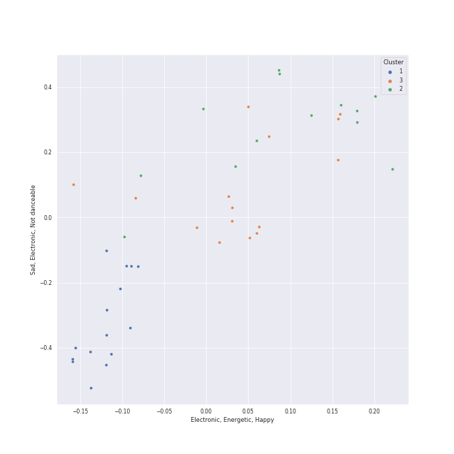

# Clusters in piano rock

## Cluster #1

15 tracks

| Art | Track | Album | Artists | Label | 💚 | 🔗 |
|:---|:---|:---|:---|:---|:---|:---|
|  | She's Got a Way | Cold Spring Harbor | [Billy Joel](../../../../artists/billy_joel/overview.md) | [Columbia](../../../../labels/columbia) | | [🔗](https://open.spotify.com/track/3Ie2eLOIj2IhKnzPwXrLbJ) |
|  | Piano Man | Piano Man | [Billy Joel](../../../../artists/billy_joel/overview.md) | [Columbia](../../../../labels/columbia) | 💚 | [🔗](https://open.spotify.com/track/78WVLOP9pN0G3gRLFy1rAa) |
|  | She's Always a Woman | The Stranger | [Billy Joel](../../../../artists/billy_joel/overview.md) | [Columbia](../../../../labels/columbia) | | [🔗](https://open.spotify.com/track/3ILLSvTYvFjjEdbxvQumOb) |
|  | Vienna | The Stranger | [Billy Joel](../../../../artists/billy_joel/overview.md) | [Columbia](../../../../labels/columbia) | 💚 | [🔗](https://open.spotify.com/track/7gREIuHognJFspylIDJ94p) |
|  | And So It Goes | Storm Front | [Billy Joel](../../../../artists/billy_joel/overview.md) | [Columbia](../../../../labels/columbia) | 💚 | [🔗](https://open.spotify.com/track/1u7kQUb3lQcpHaYRfia13A) |
|  | Lullabye (Goodnight, My Angel) | River Of Dreams | [Billy Joel](../../../../artists/billy_joel/overview.md) | [Columbia](../../../../labels/columbia) | 💚 | [🔗](https://open.spotify.com/track/4cURHmiuYii52BVbhrGbv0) |
|  | Your Song | Elton John | Elton John | [UMC (Universal Music Catalogue)](../../../../labels/umc_(universal_music_catalogue)) | 💚 | [🔗](https://open.spotify.com/track/38zsOOcu31XbbYj9BIPUF1) |
|  | We All Need Saving | OK Now | Jon McLaughlin | Island Def Jam | 💚 | [🔗](https://open.spotify.com/track/4Q9lPZNK2RB3ytuU1tCc1J) |
|  | Come Home | Dreaming Out Loud | OneRepublic | [Mosley / Interscope](../../../../labels/interscope_records) | 💚 | [🔗](https://open.spotify.com/track/0bJfgUyjfPJYqRgUxb12Eh) |
|  | Samson | Begin to Hope | Regina Spektor | Sire | 💚 | [🔗](https://open.spotify.com/track/2JAUBPBVkimRLc5BGhAkfJ) |
## Cluster #2

12 tracks

| Art | Track | Album | Artists | Label | 💚 | 🔗 |
|:---|:---|:---|:---|:---|:---|:---|
|  | Movin' Out (Anthony's Song) | The Stranger | [Billy Joel](../../../../artists/billy_joel/overview.md) | [Columbia](../../../../labels/columbia) | 💚 | [🔗](https://open.spotify.com/track/4cG3ovmC8Hnp9ZsmSZI2O4) |
|  | Only the Good Die Young | The Stranger | [Billy Joel](../../../../artists/billy_joel/overview.md) | [Columbia](../../../../labels/columbia) | 💚 | [🔗](https://open.spotify.com/track/2xabqm0YNQCTcPteQjJ22K) |
|  | Big Shot | 52nd Street | [Billy Joel](../../../../artists/billy_joel/overview.md) | [Columbia](../../../../labels/columbia) | | [🔗](https://open.spotify.com/track/22wxe2Yc9JzihICXYLGAQ7) |
|  | My Life | 52nd Street | [Billy Joel](../../../../artists/billy_joel/overview.md) | [Columbia](../../../../labels/columbia) | 💚 | [🔗](https://open.spotify.com/track/4ZoBC5MhSEzuknIgAkBaoT) |
|  | Don't Ask Me Why | Glass Houses | [Billy Joel](../../../../artists/billy_joel/overview.md) | [Columbia](../../../../labels/columbia) | | [🔗](https://open.spotify.com/track/6g4vHtdGqD5eEgpf7nKISk) |
|  | Pressure | The Nylon Curtain | [Billy Joel](../../../../artists/billy_joel/overview.md) | [Columbia](../../../../labels/columbia) | | [🔗](https://open.spotify.com/track/3LqvmDtXWXjF7fg8mh8iZh) |
|  | A Matter of Trust | The Bridge | [Billy Joel](../../../../artists/billy_joel/overview.md) | [Columbia](../../../../labels/columbia) | 💚 | [🔗](https://open.spotify.com/track/6J212smZzpeOCYQ9DITMSC) |
|  | We Didn't Start the Fire | Storm Front | [Billy Joel](../../../../artists/billy_joel/overview.md) | [Columbia](../../../../labels/columbia) | | [🔗](https://open.spotify.com/track/3Cx4yrFaX8CeHwBMReOWXI) |
|  | Crocodile Rock | Don't Shoot Me I'm Only The Piano Player | Elton John | [EMI](../../../../labels/emi) | | [🔗](https://open.spotify.com/track/6WCeFNVAXUtNczb7lqLiZU) |
|  | Fidelity | Begin to Hope | Regina Spektor | Sire | 💚 | [🔗](https://open.spotify.com/track/1J2WmkS1Z18AuDWZCgIC5K) |
## Cluster #3

15 tracks

| Art | Track | Album | Artists | Label | 💚 | 🔗 |
|:---|:---|:---|:---|:---|:---|:---|
|  | Scenes from an Italian Restaurant | The Stranger | [Billy Joel](../../../../artists/billy_joel/overview.md) | [Columbia](../../../../labels/columbia) | 💚 | [🔗](https://open.spotify.com/track/2rhFaau65TFMv4mACtE9it) |
|  | The River of Dreams | River Of Dreams | [Billy Joel](../../../../artists/billy_joel/overview.md) | [Columbia](../../../../labels/columbia) | | [🔗](https://open.spotify.com/track/30qVCFYKBtAENjTIBA8FPZ) |
|  | Light As the Breeze | Greatest Hits Vol. III | [Billy Joel](../../../../artists/billy_joel/overview.md) | [Columbia](../../../../labels/columbia) | 💚 | [🔗](https://open.spotify.com/track/1irDnW4t5Ph52hR2xuNtmF) |
|  | Tiny Dancer | Madman Across The Water | Elton John | [EMI](../../../../labels/emi) | | [🔗](https://open.spotify.com/track/2TVxnKdb3tqe1nhQWwwZCO) |
|  | Rocket Man (I Think It's Going To Be A Long, Long Time) | Honky Chateau | Elton John | [EMI](../../../../labels/emi) | | [🔗](https://open.spotify.com/track/3gdewACMIVMEWVbyb8O9sY) |
|  | Candle In The Wind - Remastered 2014 | Goodbye Yellow Brick Road (Remastered) | Elton John | [UMC (Universal Music Catalogue)](../../../../labels/umc_(universal_music_catalogue)) | | [🔗](https://open.spotify.com/track/1L9fzw2pXprOqtemTwtxXF) |
|  | Goodbye Yellow Brick Road - Remastered 2014 | Goodbye Yellow Brick Road (Remastered) | Elton John | [UMC (Universal Music Catalogue)](../../../../labels/umc_(universal_music_catalogue)) | 💚 | [🔗](https://open.spotify.com/track/4IRHwIZHzlHT1FQpRa5RdE) |
|  | Industry | Indiana | Jon McLaughlin | Island Def Jam | | [🔗](https://open.spotify.com/track/50X2L4Kd7htEGs1STirQaR) |
|  | The Great Unknown | Jukebox The Ghost | Jukebox The Ghost | Cherrytree Records/Kierszenbaum | | [🔗](https://open.spotify.com/track/6xBUdFmhryjXoxn8KkTNr4) |
|  | Eet | Far | Regina Spektor | Sire | 💚 | [🔗](https://open.spotify.com/track/0N9WhEz6DiBDvBxa6uJCTY) |