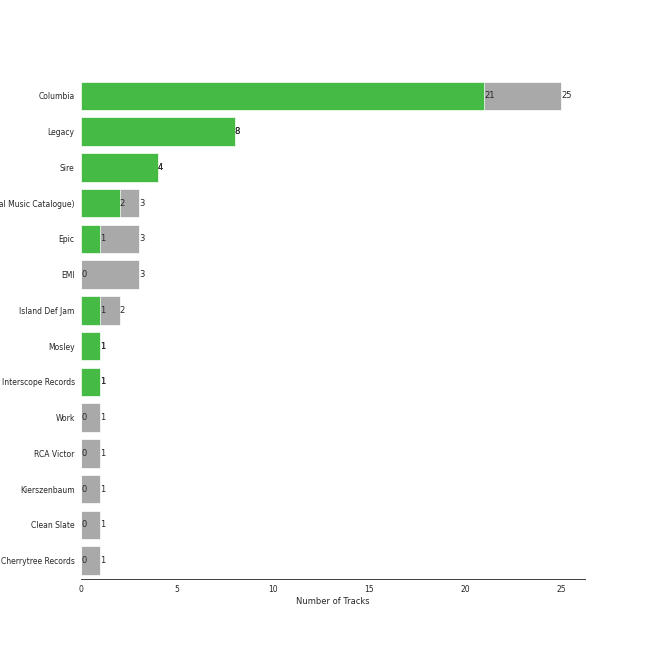
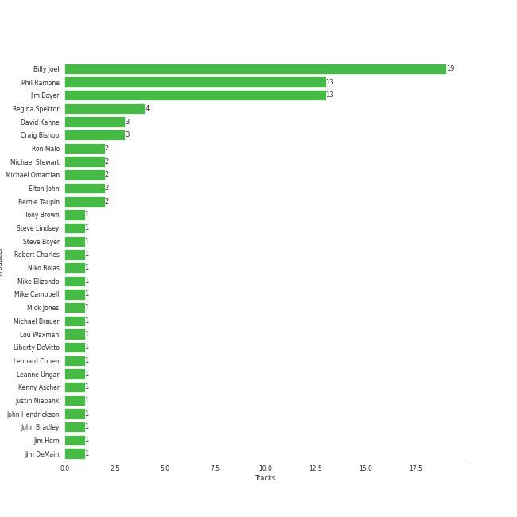
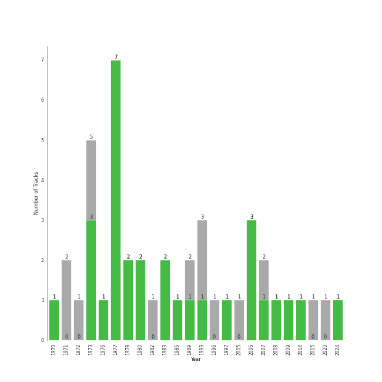

# piano rock

43 songs

[See Track Features](audio_features.md)

[See Clusters](clusters/overview.md)

## Top Artists

| Art | Tracks | 💚 | Artist | 🔗 |
|:---|---:|---:|:---|:---|
|  | 25 | 17 | [Billy Joel](../../artists/billy_joel/overview.md) | [🔗](https://open.spotify.com/artist/6zFYqv1mOsgBRQbae3JJ9e) |
|  | 4 | 4 | Regina Spektor | [🔗](https://open.spotify.com/artist/3z6Gk257P9jNcZbBXJNX5i) |
|  | 6 | 2 | Elton John | [🔗](https://open.spotify.com/artist/3PhoLpVuITZKcymswpck5b) |
|  | 2 | 1 | Jon McLaughlin | [🔗](https://open.spotify.com/artist/6z29S0IoiBJpSMP8plyCj7) |
|  | 1 | 1 | A Great Big World | [🔗](https://open.spotify.com/artist/5xKp3UyavIBUsGy3DQdXeF) |
|  | 1 | 1 | OneRepublic | [🔗](https://open.spotify.com/artist/5Pwc4xIPtQLFEnJriah9YJ) |
|  | 1 | 1 | Christina Aguilera | [🔗](https://open.spotify.com/artist/1l7ZsJRRS8wlW3WfJfPfNS) |
|  | 2 | 0 | Fiona Apple | [🔗](https://open.spotify.com/artist/3g2kUQ6tHLLbmkV7T4GPtL) |
|  | 1 | 0 | The King's Singers | [🔗](https://open.spotify.com/artist/5lR7yDVN4z9kahOiUSlMhe) |
|  | 1 | 0 | The Fray | [🔗](https://open.spotify.com/artist/0zOcE3mg9nS6l3yxt1Y0bK) |

See all 11 artists

| Art | Tracks | 💚 | Artist | 🔗 |
|:---|---:|---:|:---|:---|
|  | 1 | 0 | Jukebox The Ghost | [🔗](https://open.spotify.com/artist/0L8jXe7QeS9oYUoXbANmX4) |

## Most and least listened tracks
| ​ | Most listened tracks | Rank | ​​ | Least listened tracks | Rank |
|:---|:---|---:|:---|:---|---:|
|  | Your Song | 270 |  | Eet | nan |
|  | [Just the Way You Are](../../artists/billy_joel/overview.md) | 716 |  | Shadowboxer | nan |
|  | [Vienna](../../artists/billy_joel/overview.md) | nan |  | Fidelity | nan |
|  | [Piano Man](../../artists/billy_joel/overview.md) | nan |  | [Turn the Lights Back On](../../artists/billy_joel/overview.md) | nan |
|  | I Want You To Love Me | nan |  | Candle In The Wind - Remastered 2014 | nan |
|  | [New York State of Mind](../../artists/billy_joel/overview.md) | nan |  | [Light As the Breeze](../../artists/billy_joel/overview.md) | nan |
|  | The Great Unknown | nan |  | [And So It Goes](../../artists/billy_joel/overview.md) | nan |
|  | [Don't Ask Me Why](../../artists/billy_joel/overview.md) | nan |  | [And So It Goes](../../artists/billy_joel/overview.md) | nan |
|  | Crocodile Rock | nan |  | [Big Shot](../../artists/billy_joel/overview.md) | nan |
|  | Say Something | nan |  | Samson | nan |

## Top Albums

| Art | Tracks | 💚 | Album | Release Date | 🔗 |
|:---|---:|---:|:---|:---|:---|
|  | 7 | 6 | The Stranger | 1977-09-29 | [🔗](https://open.spotify.com/album/3IILMjMMnoN2sKzgesX8KV) |
|  | 3 | 3 | Begin to Hope | 2006-06-13 | [🔗](https://open.spotify.com/album/4L4tcx3itXbtx5kuchKhFE) |
|  | 2 | 2 | Piano Man | 1973-11-09 | [🔗](https://open.spotify.com/album/77ErLrVvYETIlQJHAwhfIH) |
|  | 2 | 2 | An Innocent Man | 1983-08-08 | [🔗](https://open.spotify.com/album/3R3x4zIabsvpD3yxqLaUpc) |
|  | 2 | 1 | Storm Front | 1989-10-17 | [🔗](https://open.spotify.com/album/1Vw2uoVkLAJFVViJ1QyK1D) |
|  | 2 | 1 | River Of Dreams | 1993-08-10 | [🔗](https://open.spotify.com/album/4HPnwQJAEvTY910q4RNeOu) |
|  | 2 | 1 | Goodbye Yellow Brick Road (Remastered) | 1973-10-05 | [🔗](https://open.spotify.com/album/5WupqgR68HfuHt3BMJtgun) |
|  | 2 | 1 | 52nd Street | 1978-10-13 | [🔗](https://open.spotify.com/album/1HmCO8VK98AU6EXPOjGYyI) |
|  | 1 | 1 | Turnstiles | 1976-05-19 | [🔗](https://open.spotify.com/album/7GiLfxL1su3MSqz7pmKMZi) |
|  | 1 | 1 | Turn the Lights Back On | 2024-02-01 | [🔗](https://open.spotify.com/album/4csPGLYTb7kt85U377UCuC) |

See all 29 albums

| Art | Tracks | 💚 | Album | Release Date | 🔗 |
|:---|---:|---:|:---|:---|:---|
|  | 1 | 1 | The Bridge | 1986-07-28 | [🔗](https://open.spotify.com/album/2fRxSC6FtiAkhEDVZr2seH) |
|  | 1 | 1 | OK Now | 2008-01-01 | [🔗](https://open.spotify.com/album/3fKJJQFV6a61fnKYDDj2LU) |
|  | 1 | 1 | Is There Anybody Out There? | 2014-01-20 | [🔗](https://open.spotify.com/album/1yOcLa4euMk9sV7rRJ89Dl) |
|  | 1 | 1 | Greatest Hits Vol. III | 1997-06-13 | [🔗](https://open.spotify.com/album/3cJ6ZymbUcNGe1T8YZtGyE) |
|  | 1 | 1 | Far | 2009-06-09 | [🔗](https://open.spotify.com/album/5t0lQDPLF22wmWCtSZkIVv) |
|  | 1 | 1 | Elton John | 1970-04-10 | [🔗](https://open.spotify.com/album/69P9Ro0W286yLFgYwrGVN0) |
|  | 1 | 1 | Dreaming Out Loud | 2007-01-01 | [🔗](https://open.spotify.com/album/2KSpGeDoNjqCKg6HL8LAyI) |
|  | 1 | 0 | Tidal | 1996-07-23 | [🔗](https://open.spotify.com/album/5gVBXH8MT6zfdRkjp7qT18) |
|  | 1 | 0 | The Nylon Curtain | 1982-06-23 | [🔗](https://open.spotify.com/album/50bajZpetfL5T0iRCOR74J) |
|  | 1 | 0 | Madman Across The Water | 1971-11-05 | [🔗](https://open.spotify.com/album/2OZbaW9tgO62ndm375lFZr) |
|  | 1 | 0 | Jukebox The Ghost | 2015-04-07 | [🔗](https://open.spotify.com/album/3K5jW2vkunhourPeQ3DiwV) |
|  | 1 | 0 | Indiana | 2007-01-01 | [🔗](https://open.spotify.com/album/2UpO4j1Zpptiwk3wbUIWmU) |
|  | 1 | 0 | How To Save A Life | 2005-09-13 | [🔗](https://open.spotify.com/album/1IM3GwptCGYjRkzCBolyFK) |
|  | 1 | 0 | Honky Chateau | 1972-05-19 | [🔗](https://open.spotify.com/album/2ei2X6ghPnw7YRwQtAH075) |
|  | 1 | 0 | Good Vibrations | 1993 | [🔗](https://open.spotify.com/album/10IUKCLZPs9onPwXfQVxfv) |
|  | 1 | 0 | Glass Houses | 1980-03-12 | [🔗](https://open.spotify.com/album/5sztejERqpktXEdemlUvU5) |
|  | 1 | 0 | Fetch The Bolt Cutters | 2020-04-17 | [🔗](https://open.spotify.com/album/0fO1KemWL2uCCQmM22iKlj) |
|  | 1 | 0 | Don't Shoot Me I'm Only The Piano Player | 1973-01-22 | [🔗](https://open.spotify.com/album/1reJ8DttK5EGwdyf7y9FBR) |
|  | 1 | 0 | Cold Spring Harbor | 1971-11-01 | [🔗](https://open.spotify.com/album/274rMlKrr22086ohmwAJZA) |

## Top Record Labels

| Tracks | 💚 | Label |
|---:|---:|:---|
| 24 | 17 | [Columbia](../../labels/columbia/overview.md) |
| 4 | 4 | Sire |
| 3 | 2 | [UMC (Universal Music Catalogue)](../../labels/umc_(universal_music_catalogue)/overview.md) |
| 3 | 1 | [Epic](../../labels/epic/overview.md) |
| 2 | 1 | Island Def Jam |
| 1 | 1 | Mosley |
| 1 | 1 | [Interscope Records](../../labels/interscope_records/overview.md) |
| 3 | 0 | [EMI](../../labels/emi/overview.md) |
| 1 | 0 | Work |
| 1 | 0 | RCA Victor |

See all 13 labels

| Tracks | 💚 | Label |
|---:|---:|:---|
| 1 | 0 | Kierszenbaum |
| 1 | 0 | Clean Slate |
| 1 | 0 | Cherrytree Records |

## Top Producers

| Art | Producer | Tracks | Credit Types |
|:---|:---|---:|:---|
|  | [Billy Joel](../../artists/billy_joel/overview.md) | 15 | Lyricist, Producer, Songwriter, Arranger |
| | Jim Boyer | 9 | Producer |
| | Phil Ramone | 9 | Producer |
|  | Regina Spektor | 4 | Lyricist, Producer, Songwriter |
| | Craig Bishop | 3 | Producer |
| | David Kahne | 3 | Producer |
| | Michael Omartian | 2 | Arranger |
| | Michael Stewart | 2 | Producer |
| | Ron Malo | 2 | Producer |
|  | Elton John | 2 | Songwriter |

View all

| Art | Producer | Tracks | Credit Types |
|:---|:---|---:|:---|
| | Bernie Taupin | 2 | Lyricist |
| | Fred Tenny | 1 | Producer |
| | Liberty DeVitto | 1 | Arranger |
| | Bruce Botnick | 1 | Producer |
| | Justin Niebank | 1 | Producer |
| | Chad Vaccarino | 1 | Songwriter |
| | Gus Dudgeon | 1 | Producer |
| | Steve Lindsey | 1 | Arranger, Producer |
| | Jim Horn | 1 | Arranger |
| | Doug Stegmeyer | 1 | Arranger |
| | Adam Hawkins | 1 | Producer |
| | Leanne Ungar | 1 | Producer |
| | Mike Campbell | 1 | Songwriter |
| | Tony Brown | 1 | Producer |
| | David Hentschel | 1 | Producer |
| | John Hendrickson | 1 | Producer |
| | Kenny Ascher | 1 | Arranger |
| | Ira Newborn | 1 | Arranger |
| | Mike Elizondo | 1 | Producer |
| | Steve Boyer | 1 | Producer |
| | Del Newman | 1 | Arranger |
| | Lou Waxman | 1 | Producer |
| | Don Puluse | 1 | Producer |
| | Robert Charles | 1 | Producer |
| | David Dickson | 1 | Producer |
| | John Bradley | 1 | Producer |
| | Bill Schnee | 1 | Producer |
| | Bradshaw Leigh | 1 | Producer |
| | Jay Healy | 1 | Producer |
| | Mick Jones | 1 | Producer |
| | Jim DeMain | 1 | Producer |
| | Danny Kortchmar | 1 | Producer |
| | Niko Bolas | 1 | Producer |
| | Michael Brauer | 1 | Producer |
| | Ed Cherney | 1 | Producer |
| | Leonard Cohen | 1 | Lyricist, Songwriter |
| | Ian Axel | 1 | Songwriter |

## Years

| ​ | 10 newest albums | ​​ | 10 oldest albums |
|:---|:---|:---|:---|
|  | Turn the Lights Back On (2024-02-01) |  | Elton John (1970-04-10) |
|  | Fetch The Bolt Cutters (2020-04-17) |  | Cold Spring Harbor (1971-11-01) |
|  | Jukebox The Ghost (2015-04-07) |  | Madman Across The Water (1971-11-05) |
|  | Is There Anybody Out There? (2014-01-20) |  | Honky Chateau (1972-05-19) |
|  | Far (2009-06-09) |  | Don't Shoot Me I'm Only The Piano Player (1973-01-22) |
|  | OK Now (2008-01-01) |  | Goodbye Yellow Brick Road (Remastered) (1973-10-05) |
|  | Indiana (2007-01-01) |  | Piano Man (1973-11-09) |
|  | Dreaming Out Loud (2007-01-01) |  | Turnstiles (1976-05-19) |
|  | Begin to Hope (2006-06-13) |  | The Stranger (1977-09-29) |
|  | How To Save A Life (2005-09-13) |  | 52nd Street (1978-10-13) |

