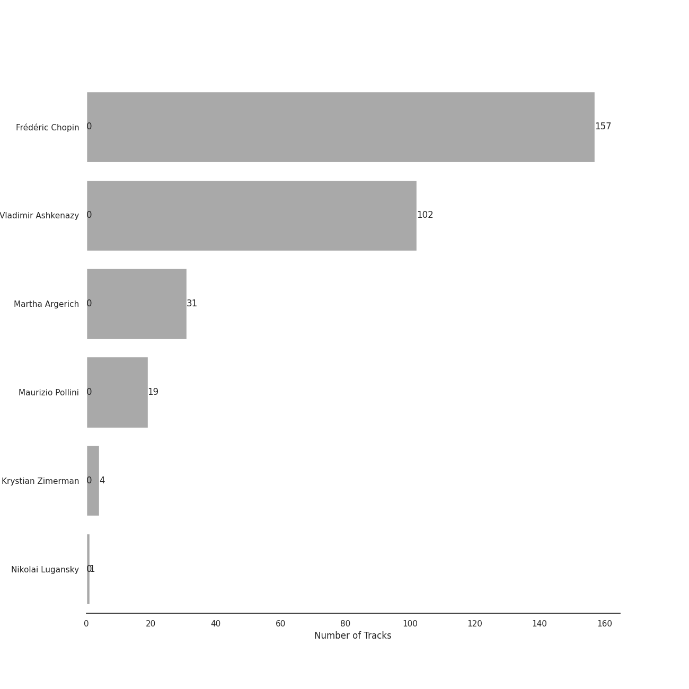
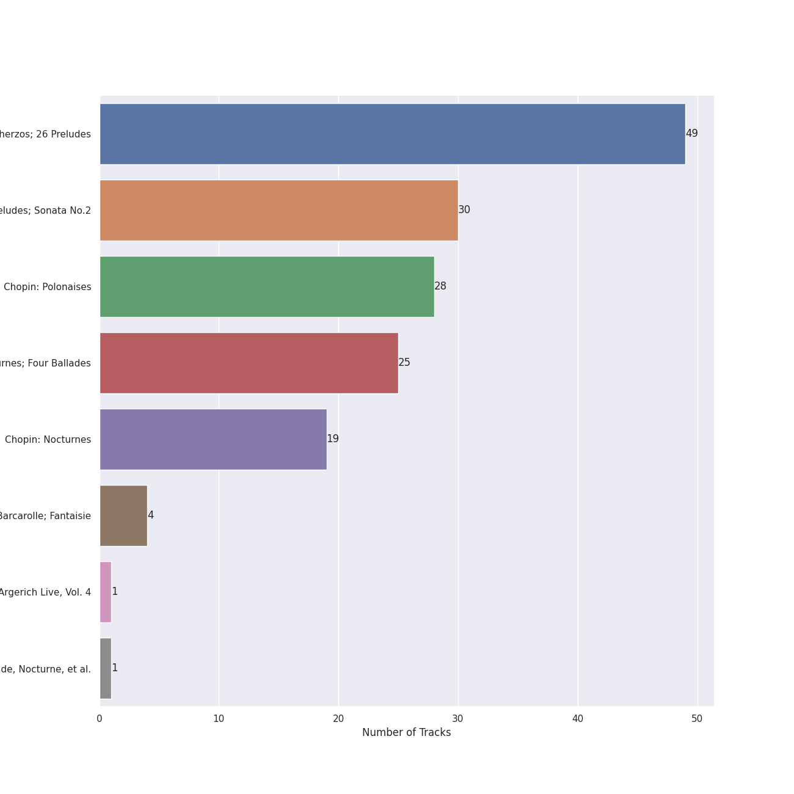
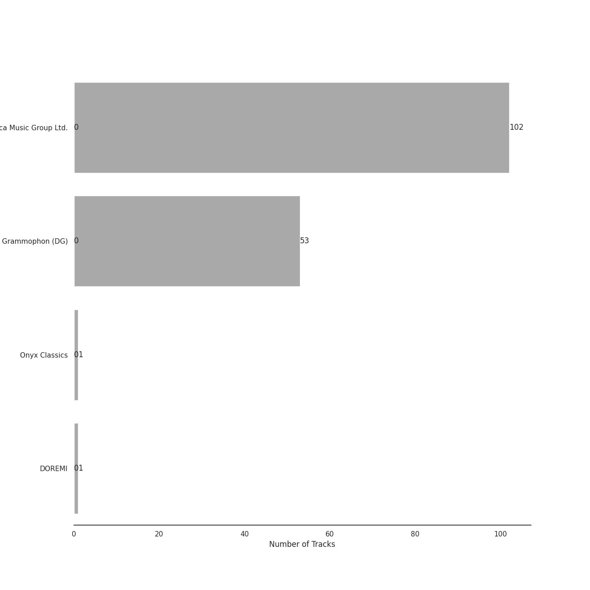

# polish classical

[157 songs](polish_classical_tracks.md)

## Top Artists

See all 6 artists

|   Number of Tracks | Art                                                                                              | Artist                                                 | 🔗                                                           |
|-------------------:|:-------------------------------------------------------------------------------------------------|:-------------------------------------------------------|:------------------------------------------------------------|
|                157 |  | [Frédéric Chopin](../artists/fr_d_ric_chopin.md)       | [🔗](https://open.spotify.com/artist/7y97mc3bZRFXzT2szRM4L4) |
|                102 |  | [Vladimir Ashkenazy](../artists/vladimir_ashkenazy.md) | [🔗](https://open.spotify.com/artist/20iZXzMb8LoWXOeca32i82) |
|                 31 |  | [Martha Argerich](../artists/martha_argerich.md)       | [🔗](https://open.spotify.com/artist/66MvLAvLznk5UOvASVGjk4) |
|                 19 |  | [Maurizio Pollini](../artists/maurizio_pollini.md)     | [🔗](https://open.spotify.com/artist/2VIdKQmRHnWofsR4odfFOh) |
|                  4 |  | Krystian Zimerman                                      | [🔗](https://open.spotify.com/artist/43wuPaPcZVMJQWLRaPR4Yz) |
|                  1 |  | Nikolai Lugansky                                       | [🔗](https://open.spotify.com/artist/2bMfnyPOgNaeK8WNnXNXud) |

## Top Albums

See all 8 albums

|   Number of Tracks | Art                                                                                              | Album                                                                     | 🔗                                                          |
|-------------------:|:-------------------------------------------------------------------------------------------------|:--------------------------------------------------------------------------|:-----------------------------------------------------------|
|                 49 |  | Chopin: Waltzes; 4 Scherzos; 26 Preludes                                  | [🔗](https://open.spotify.com/album/0yCrQ6dCqiI6ldqI8LPqWB) |
|                 30 |  | Chopin: Preludes; Sonata No.2                                             | [🔗](https://open.spotify.com/album/33YXJqoFV5AQwbo4yfk22n) |
|                 28 |  | Chopin: Polonaises                                                        | [🔗](https://open.spotify.com/album/19ofW4fqCAR2uQJKVWw6L6) |
|                 25 |  | Chopin: Nocturnes; Four Ballades                                          | [🔗](https://open.spotify.com/album/0lrM7kR5o7iqkajLKIlzRg) |
|                 19 |  | Chopin: Nocturnes                                                         | [🔗](https://open.spotify.com/album/2aoSpTAjFaMvaZeruqnCVv) |
|                  4 |  | Chopin: Ballades; Barcarolle; Fantaisie                                   | [🔗](https://open.spotify.com/album/5c9v5oU43Oo22MSG8EKFp2) |
|                  1 |  | Martha Argerich Live, Vol. 4                                              | [🔗](https://open.spotify.com/album/69aoRIAIVb2TbIuxmxKYCR) |
|                  1 |  | Chopin: Piano Sonata No. 3, Fantasie-impromptu, Prélude, Nocturne, et al. | [🔗](https://open.spotify.com/album/5QmPVpRux60kcHndJOl6bF) |

## Top Record Labels

See all 4 labels

|   Number of Tracks | Label                                                             |
|-------------------:|:------------------------------------------------------------------|
|                102 | [Decca Music Group Ltd.](../labels/decca_music_group_ltd_.md)     |
|                 53 | [Deutsche Grammophon (DG)](../labels/deutsche_grammophon__dg_.md) |
|                  1 | [Onyx Classics](../labels/onyx_classics.md)                       |
|                  1 | [DOREMI](../labels/doremi.md)                                     |

## Audio Features

| 10 most Danceable tracks                                    | 10 least Danceable tracks                                  |
|:------------------------------------------------------------|:-----------------------------------------------------------|
| 24 Préludes, Op. 28: No. 20 in C Minor: Largo               | Prélude in C-Sharp Minor, Op. 45                           |
| 24 Préludes, Op. 28: No. 20 in C Minor: Largo               | 24 Préludes, Op. 28: No. 8 in F-Sharp Minor: Molto agitato |
| 24 Préludes, Op. 28: No. 10 in C-Sharp Minor: Molto allegro | Nocturne No. 3 In B, Op. 9 No. 3                           |
| 24 Préludes, Op. 28: No. 7 in A Major: Andantino            | Etude in F minor, Op. posth. " Méthode des méthodes "      |
| 24 Préludes, Op. 28: No. 7 in A Major                       | 24 Préludes, Op. 28: No. 3 in G Major: Vivace              |
| Feuille d'album in E, Op. posth.                            | Piano Sonata No. 2 in B-Flat Minor, Op. 35: IV. Finale     |
| Galop Marquis                                               | 24 Préludes, Op. 28: No. 22 in G Minor                     |
| 24 Préludes, Op. 28: No. 12 in G-Sharp Minor: Presto        | 24 Préludes, Op. 28: No. 23 in F Major                     |
| 24 Préludes, Op. 28: No. 10 in C-Sharp Minor                | 24 Préludes, Op. 28: No. 23 in F Major: Moderato           |
| Waltz No. 15 in E Major, Op. posth.                         | 24 Préludes, Op. 28: No. 13 in F-Sharp Major: Lento        |

| 10 most Energetic tracks                                     | 10 least Energetic tracks                                       |
|:-------------------------------------------------------------|:----------------------------------------------------------------|
| 24 Préludes, Op. 28: No. 22 in G Minor                       | 24 Préludes, Op. 28: No. 13 in F-Sharp Major                    |
| 24 Préludes, Op. 28: No. 14 in E-Flat Minor                  | 24 Préludes, Op. 28: No. 4 in E Minor                           |
| Polonaise No. 6 in A-Flat Major, Op. 53, "Heroic"            | 24 Préludes, Op. 28: No. 6 in B Minor: Lento assai              |
| 24 Préludes, Op. 28: No. 24 in D Minor: Allegro appassionato | Piano Sonata No. 2 in B-Flat Minor, Op. 35: III. Marche funèbre |
| 24 Préludes, Op. 28: No. 22 in G Minor: Molto agitato        | 24 Préludes, Op. 28: No. 6 in B Minor: Lento assai              |
| Galop Marquis                                                | 24 Préludes, Op. 28: No. 2 in A Minor: Lento                    |
| 24 Préludes, Op. 28: No. 16 in B-Flat Minor                  | 24 Préludes, Op. 28: No. 13 in F-Sharp Major: Lento             |
| 24 Préludes, Op. 28: No. 1 in C Major                        | 24 Préludes, Op. 28: No. 2 in A Minor                           |
| 24 Préludes, Op. 28: No. 18 in F Minor                       | 24 Préludes, Op. 28: No. 7 in A Major: Andantino                |
| 24 Préludes, Op. 28: No. 24 in D Minor: Allegro appassionato | 24 Préludes, Op. 28: No. 7 in A Major                           |

| 10 most Speechy tracks                                          | 10 least Speechy tracks                                      |
|:----------------------------------------------------------------|:-------------------------------------------------------------|
| 24 Préludes, Op. 28: No. 20 in C Minor: Largo                   | 24 Préludes, Op. 28: No. 16 in B-Flat Minor                  |
| 24 Préludes, Op. 28: No. 20 in C Minor: Largo                   | Nocturne No. 15 In F Minor, Op. 55 No. 1                     |
| 24 Préludes, Op. 28: No. 10 in C-Sharp Minor: Molto allegro     | Berceuse in D-Flat Major, Op. 57                             |
| 24 Préludes, Op. 28: No. 7 in A Major                           | 24 Préludes, Op. 28: No. 24 in D Minor: Allegro appassionato |
| 24 Préludes, Op. 28: No. 7 in A Major: Andantino                | 24 Préludes, Op. 28: No. 22 in G Minor                       |
| 24 Préludes, Op. 28: No. 4 in E Minor: Largo                    | 24 Préludes, Op. 28: No. 8 in F-Sharp Minor                  |
| 24 Préludes, Op. 28: No. 6 in B Minor: Lento assai              | Polonaise No. 6 in A flat, Op. 53 -"Heroic"                  |
| 24 Préludes, Op. 28: No. 4 in E Minor                           | 24 Préludes, Op. 28: No. 3 in G Major: Vivace                |
| Piano Sonata No. 2 in B-Flat Minor, Op. 35: III. Marche funèbre | 24 Préludes, Op. 28: No. 12. in G-Sharp Minor                |
| Nocturne No. 6 In G Minor, Op. 15 No. 3                         | 24 Préludes, Op. 28: No. 24 in D Minor: Allegro appassionato |

| 10 most Acoustic tracks                                | 10 least Acoustic tracks                                     |
|:-------------------------------------------------------|:-------------------------------------------------------------|
| Wiosna, B117 (arr. from Op. 74/2)                      | Scherzo No. 2 in B Flat Minor, Op. 31                        |
| Nocturne No. 11 In G Minor, Op. 37 No. 1               | 24 Préludes, Op. 28: No. 9 in E Major: Largo                 |
| Nocturne No. 12 In G, Op. 37 No. 2                     | 24 Préludes, Op. 28: No. 8 in F-Sharp Minor: Molto agitato   |
| Piano Sonata No. 2 in B-Flat Minor, Op. 35: IV. Finale | 24 Préludes, Op. 28: No. 24 in D Minor: Allegro appassionato |
| Feuille d'album in E, Op. posth.                       | Polonaise No. 6 in A-Flat Major, Op. 53, "Heroic"            |
| Nocturne No. 11 in G minor, Op. 37 No. 1               | 24 Préludes, Op. 28: No. 19 in E-Flat Major                  |
| Nocturne No. 6 in G Minor, Op. 15 No. 3                | 24 Préludes, Op. 28: No. 22 in G Minor                       |
| Waltz No. 18 in E flat, Op. posth.                     | 24 Préludes, Op. 28: No. 14 in E-Flat Minor: Allegro         |
| 24 Préludes, Op. 28: No. 4 in E Minor                  | 24 Préludes, Op. 28: No. 24 in D Minor: Allegro appassionato |
| 24 Préludes, Op. 28: No. 6 in B Minor: Lento assai     | 24 Préludes, Op. 28: No. 22 in G Minor: Molto agitato        |

| 10 most Instrumental tracks                                 | 10 least Instrumental tracks                                 |
|:------------------------------------------------------------|:-------------------------------------------------------------|
| 24 Préludes, Op. 28: No. 10 in C-Sharp Minor                | Polonaise in G sharp minor, Op. posth.                       |
| Nocturne No. 8 In D Flat, Op. 27 No. 2 - 2005 Recording     | Waltz No. 19 in A Minor, Op. Posth.                          |
| 24 Préludes, Op. 28: No. 7 in A Major: Andantino            | 24 Préludes, Op. 28: No. 1 in C Major                        |
| 24 Préludes, Op. 28: No. 11 in B Major                      | 24 Préludes, Op. 28: No. 24 in D Minor: Allegro appassionato |
| 24 Préludes, Op. 28: No. 10 in C-Sharp Minor: Molto allegro | 24 Préludes, Op. 28: No. 14 in E-Flat Minor: Allegro         |
| Nocturne No. 2 In E Flat, Op. 9 No. 2                       | Nocturne No. 19 In E Minor, Op. 72 No. 1                     |
| Nocturne No. 6 in G Minor, Op. 15 No. 3                     | 24 Préludes, Op. 28: No. 7 in A Major                        |
| Prélude No.26 in A Flat, Op.posth.                          | 24 Préludes, Op. 28: No. 18 in F Minor                       |
| Waltz No. 15 in E Major, Op. posth.                         | 24 Préludes, Op. 28: No. 5 in D Major: Molto allegro         |
| 24 Préludes, Op. 28: No. 3 in G Major: Vivace               | Ballade No. 3 In A-Flat Major, Op. 47                        |

| 10 most Live tracks                                           | 10 least Live tracks                             |
|:--------------------------------------------------------------|:-------------------------------------------------|
| Polonaise No. 6 in A-Flat Major, Op. 53, "Heroic"             | Nocturne No. 4 In F, Op. 15 No. 1                |
| 24 Préludes, Op. 28: No. 16 in B-Flat Minor                   | Nocturne No. 13 In C Minor, Op. 48 No. 1         |
| 24 Préludes, Op. 28: No. 22 in G Minor                        | 24 Préludes, Op. 28: No. 7 in A Major            |
| Waltz No. 8 in A-Flat Major, Op. 64 No. 3                     | 24 Préludes, Op. 28: No. 4 in E Minor            |
| 24 Préludes, Op. 28: No. 16 in B-Flat Minor: Presto con fuoco | Nocturne No. 11 In G Minor, Op. 37 No. 1         |
| Polonaise in B flat, Op. posth.                               | Nocturne No. 15 In F Minor, Op. 55 No. 1         |
| Waltz No. 6 in D-Flat, Op. 64, No. 1 "Minute"                 | Nocturne No. 15 in F Minor, Op. 55 No. 1         |
| Nocturne No. 1 in B-Flat Minor, Op. 9 No. 1                   | Scherzo No. 1 In B Minor, Op. 20                 |
| Ballade No. 3 in A flat major, Op. 47                         | 24 Préludes, Op. 28: No. 7 in A Major: Andantino |
| 2 Bourrees, B160b                                             | Ballade No. 2 in F Major, Op. 38                 |

| 10 most Happy tracks                                  | 10 least Happy tracks                                      |
|:------------------------------------------------------|:-----------------------------------------------------------|
| Galop Marquis                                         | Nocturne No. 12 In G, Op. 37 No. 2                         |
| Waltz No. 16 in A flat, Op. posth.                    | Nocturne No. 8 In D Flat, Op. 27 No. 2 - 2005 Recording    |
| 24 Préludes, Op. 28: No. 11 in B Major: Vivace        | 24 Préludes, Op. 28: No. 8 in F-Sharp Minor: Molto agitato |
| Fugue in A minor                                      | Ballade No. 4 in F Minor, Op. 52                           |
| 24 Préludes, Op. 28: No. 22 in G Minor                | Ballade No. 2 in F Major, Op. 38                           |
| Tarantelle In A Flat, Op. 43                          | Etude in A flat, Op. posth. " Méthode des méthodes "       |
| 24 Préludes, Op. 28: No. 22 in G Minor: Molto agitato | 24 Préludes, Op. 28: No. 4 in E Minor: Largo               |
| Prélude No.26 in A Flat, Op.posth.                    | 24 Préludes, Op. 28: No. 9 in E Major                      |
| 24 Préludes, Op. 28: No. 12. in G-Sharp Minor         | 24 Préludes, Op. 28: No. 9 in E Major: Largo               |
| Polonaise in A flat, Op. posth.                       | 24 Préludes, Op. 28: No. 7 in A Major: Andantino           |
