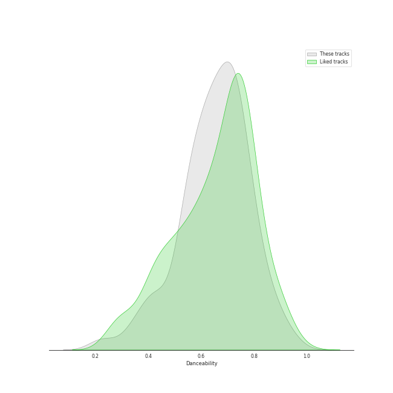
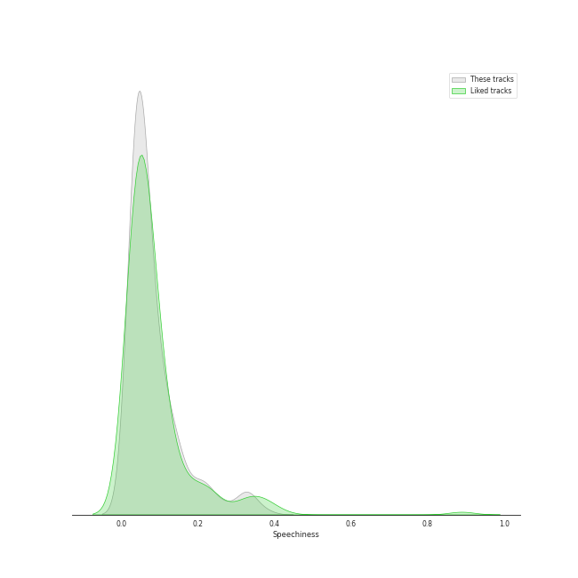
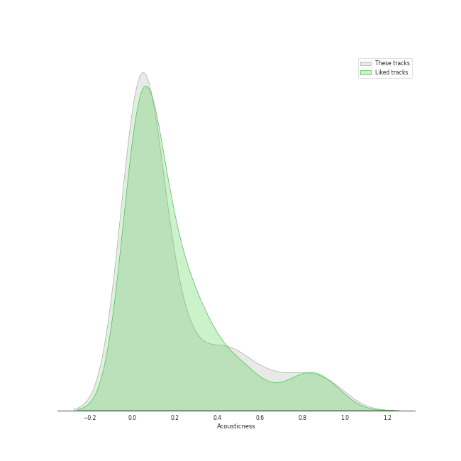
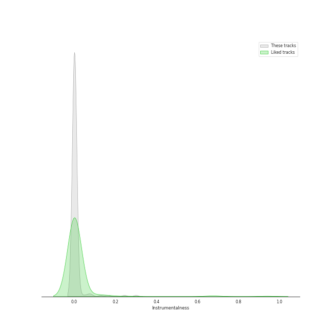
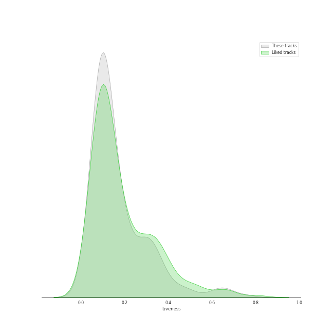
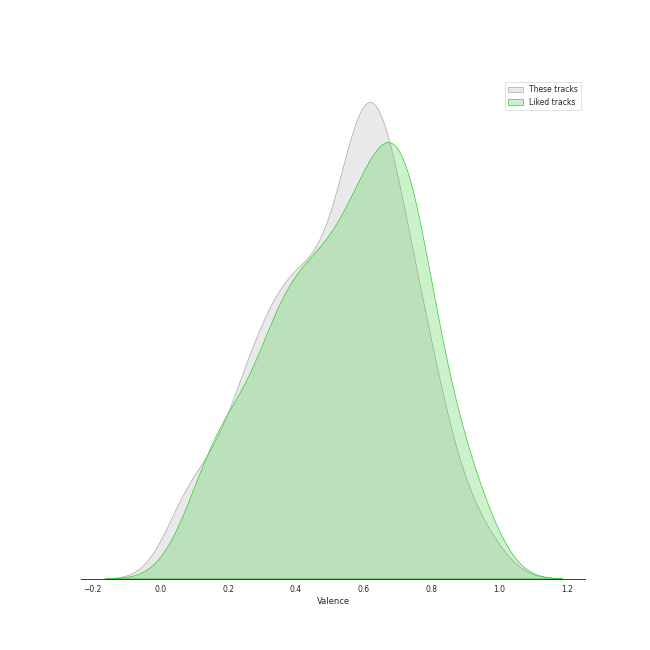
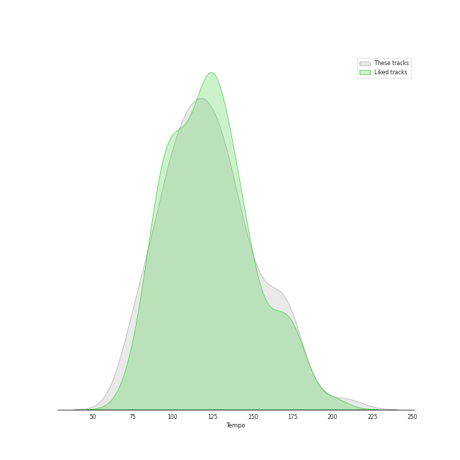

# Track Features for pop

## Danceability

| ​ | 10 most Danceable tracks | ​​ | 10 least Danceable tracks |
|:---|:---|:---|:---|
|  | SexyBack (feat. Timbaland) (0.967) |  | Born To Die (0.18) |
|  | Anaconda (0.964) |  | Already Gone (0.209) |
|  | Ah puh (0.954) |  | Fix You (0.209) |
|  | WAP (feat. Megan Thee Stallion) (0.935) |  | Norman fucking Rockwell (0.215) |
|  | RUN (HAN) (0.929) |  | Shades Of Cool (0.262) |
|  | Typa Girl (0.915) |  | La Vie En Rose (0.276) |
|  | Pretty Please (0.906) |  | exile (feat. Bon Iver) (0.298) |
|  | bury a friend (0.905) |  | Radio (0.312) |
|  | Sally Walker (0.905) |  | tolerate it (0.316) |
|  | Coño (0.899) |  | Young And Beautiful (0.324) |

## Energy

| ​ | 10 most Energetic tracks | ​​ | 10 least Energetic tracks |
|:---|:---|:---|:---|
|  | War of Hormone (0.993) |  | when the party's over (0.111) |
|  | LALALALA (Rock Ver.) (0.985) |  | xanny (0.125) |
|  | MIROH (0.979) |  | Julia (0.128) |
|  | Side Effects (0.977) |  | Come Home (0.155) |
|  | Larger Than Life (0.973) |  | Sweet Nothing (0.156) |
|  | Feel Special (0.959) |  | Have Yourself A Merry Little Christmas (0.178) |
|  | District 9 (0.956) |  | Your Song (0.195) |
|  | Boss Bitch (0.955) |  | Norman fucking Rockwell (0.203) |
|  | Twenty-three (0.955) |  | i hate to admit (Bang Chan) (0.217) |
|  | Forever Young (0.949) |  | No Time To Die (0.219) |

## Speechiness

| ​ | 10 most Speechy tracks | ​​ | 10 least Speechy tracks |
|:---|:---|:---|:---|
|  | No More Dream (0.472) |  | Breakeven (0.0242) |
|  | Youngblood (0.463) |  | All Too Well (0.0243) |
|  | boyfriend (with Social House) (0.461) |  | The Scientist (0.0243) |
|  | Love Yourself (0.438) |  | Set Fire to the Rain (0.0249) |
|  | MANIAC (0.411) |  | Chasing Pavements (0.0251) |
|  | Hold Up (0.405) |  | Show Me the Meaning of Being Lonely (0.0252) |
|  | Vigilante Shit (0.39) |  | Put A Little Love On Me (0.0262) |
|  | Irreplaceable (0.382) |  | Kids Again (0.0262) |
|  | WAP (feat. Megan Thee Stallion) (0.375) |  | Begin Again (0.0263) |
|  | bad guy (0.375) |  | Scary Fairy Tale (0.0263) |

## Acousticness

| ​ | 10 most Acoustic tracks | ​​ | 10 least Acoustic tracks |
|:---|:---|:---|:---|
|  | when the party's over (0.978) |  | That's What You Get (9.43e-05) |
|  | Norman fucking Rockwell (0.968) |  | Pon de Replay (0.000155) |
|  | Sweet Nothing (0.964) |  | Easy (0.000219) |
|  | Have Yourself A Merry Little Christmas (0.957) |  | Misery (0.000315) |
|  | Take It All (0.957) |  | Coño (0.000554) |
|  | Come Home (0.947) |  | Danger (0.000907) |
|  | Stay (0.945) |  | Judas (0.000967) |
|  | Your Song (0.936) |  | Out Of The Woods (0.00103) |
|  | lovely (with Khalid) (0.934) |  | Turn Down for What (0.00107) |
|  | When I Was Your Man (0.932) |  | My Happy Ending (0.00136) |

## Instrumentalness

| ​ | 10 most Instrumental tracks | ​​ | 10 least Instrumental tracks |
|:---|:---|:---|:---|
|  | everything i wanted (0.657) |  | Leave The Door Open (0.0) |
|  | Swan Song (0.421) |  | Clean (0.0) |
|  | you should see me in a crown (0.219) |  | SUPER BOARD (0.0) |
|  | Kill Bill (0.169) |  | This Is Why We Can't Have Nice Things (0.0) |
|  | bury a friend (0.162) |  | Shut Down (0.0) |
|  | GOLDWING (0.159) |  | SCIENTIST (0.0) |
|  | Kill Bill (0.144) |  | Winter Falls (0.0) |
|  | Therefore I Am (0.135) |  | Love Me Like You Do (0.0) |
|  | bad guy (0.13) |  | React (0.0) |
|  | Turn Down for What (0.128) |  | Friday (feat.Jang Yi-jeong) (0.0) |

## Liveness

| ​ | 10 most Live tracks | ​​ | 10 least Live tracks |
|:---|:---|:---|:---|
|  | Bel Air (0.901) |  | Ain't It Fun (0.021) |
|  | La Vie En Rose (0.706) |  | Finesse - Remix; feat. Cardi B (0.0215) |
|  | Radioactive (0.668) |  | CASE 143 (0.0222) |
|  | LALALALA (0.653) |  | Finesse (0.0232) |
|  | What Now (0.628) |  | Black Out (0.0243) |
|  | Typa Girl (0.628) |  | Oh My God (0.0264) |
|  | FANCY (0.627) |  | Blown Away (0.0283) |
|  | Larger Than Life (0.617) |  | Ice Cream (with Selena Gomez) (0.0311) |
|  | Red Lights (Bang Chan, Hyunjin) (0.612) |  | Flowers (0.0322) |
|  | Love On Top (0.604) |  | CIRCUS (0.0353) |

## Valence

| ​ | 10 most Happy tracks | ​​ | 10 least Happy tracks |
|:---|:---|:---|:---|
|  | Material Girl (0.978) |  | Maroon (0.0374) |
|  | Like a Virgin (0.97) |  | Swan Song (0.0392) |
|  | There's Nothing Holdin' Me Back (0.969) |  | Delicate (0.0499) |
|  | Twenty-three (0.968) |  | No Time To Die (0.0517) |
|  | SexyBack (feat. Timbaland) (0.964) |  | xanny (0.0528) |
|  | I'm a Slave 4 U (0.963) |  | Falling (0.0592) |
|  | Sucker (0.952) |  | Yellow Flicker Beat (0.0597) |
|  | Me Enamoré (0.948) |  | I'll Show You (0.0789) |
|  | Really (0.947) |  | Skyfall (0.0789) |
|  | Tick Tock (feat. 24kGoldn) (0.946) |  | Turn Down for What (0.0815) |

## Tempo

| ​ | 10 most Fast tracks | ​​ | 10 least Fast tracks |
|:---|:---|:---|:---|
|  | Buttons (210.857) |  | My Everything (61.975) |
|  | Signal (207.819) |  | imagine (62.52) |
|  | Last Christmas (205.945) |  | Winter Sleep (68.045) |
|  | That's My Girl (202.049) |  | Lover (68.534) |
|  | Awkward Silence (199.981) |  | When I Was Your Man (72.795) |
|  | Modern Times (199.923) |  | miss you (Hyunjin) (72.96) |
|  | Santa Tell Me (191.9) |  | No Time To Die (73.537) |
|  | I'll Show You (191.812) |  | Jar of Hearts (74.541) |
|  | boyfriend (with Social House) (190.097) |  | tolerate it (74.952) |
|  | Good Thing (with Kehlani) (185.913) |  | Ride (74.989) |
