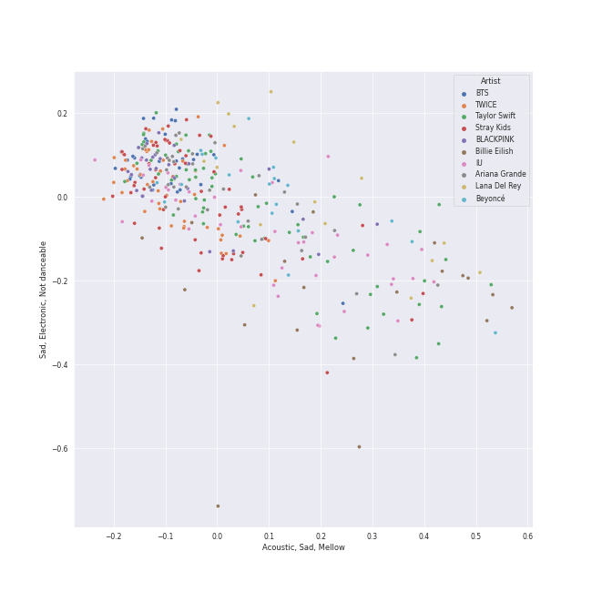

# pop

[498 songs](tracks.md)

## Top Artists

| Art | Tracks | 💚 | Artist | 🔗 |
|:---|---:|---:|:---|:---|
|  | 65 | 37 | [Taylor Swift](../../artists/taylor_swift/overview.md) | [🔗](https://open.spotify.com/artist/06HL4z0CvFAxyc27GXpf02) |
|  | 44 | 32 | [TWICE](../../artists/twice/overview.md) | [🔗](https://open.spotify.com/artist/7n2Ycct7Beij7Dj7meI4X0) |
|  | 30 | 25 | [BLACKPINK](../../artists/blackpink/overview.md) | [🔗](https://open.spotify.com/artist/41MozSoPIsD1dJM0CLPjZF) |
|  | 36 | 24 | [BTS](../../artists/bts/overview.md) | [🔗](https://open.spotify.com/artist/3Nrfpe0tUJi4K4DXYWgMUX) |
|  | 28 | 16 | [Ariana Grande](../../artists/ariana_grande/overview.md) | [🔗](https://open.spotify.com/artist/66CXWjxzNUsdJxJ2JdwvnR) |
|  | 16 | 12 | [Rihanna](../../artists/rihanna/overview.md) | [🔗](https://open.spotify.com/artist/5pKCCKE2ajJHZ9KAiaK11H) |
|  | 13 | 11 | [Billie Eilish](../../artists/billie_eilish/overview.md) | [🔗](https://open.spotify.com/artist/6qqNVTkY8uBg9cP3Jd7DAH) |
|  | 19 | 10 | [Lana Del Rey](../../artists/lana_del_rey/overview.md) | [🔗](https://open.spotify.com/artist/00FQb4jTyendYWaN8pK0wa) |
|  | 16 | 9 | [Beyoncé](../../artists/beyonc_/overview.md) | [🔗](https://open.spotify.com/artist/6vWDO969PvNqNYHIOW5v0m) |
|  | 13 | 9 | [Lady Gaga](../../artists/lady_gaga/overview.md) | [🔗](https://open.spotify.com/artist/1HY2Jd0NmPuamShAr6KMms) |

See top 100 artists

| Art | Tracks | 💚 | Artist | 🔗 |
|:---|---:|---:|:---|:---|
|  | 11 | 9 | [Bruno Mars](../../artists/bruno_mars/overview.md) | [🔗](https://open.spotify.com/artist/0du5cEVh5yTK9QJze8zA0C) |
|  | 8 | 8 | Sia | [🔗](https://open.spotify.com/artist/5WUlDfRSoLAfcVSX1WnrxN) |
|  | 11 | 6 | [Dua Lipa](../../artists/dua_lipa/overview.md) | [🔗](https://open.spotify.com/artist/6M2wZ9GZgrQXHCFfjv46we) |
|  | 7 | 6 | Camila Cabello | [🔗](https://open.spotify.com/artist/4nDoRrQiYLoBzwC5BhVJzF) |
|  | 9 | 5 | Maroon 5 | [🔗](https://open.spotify.com/artist/04gDigrS5kc9YWfZHwBETP) |
|  | 8 | 5 | Doja Cat | [🔗](https://open.spotify.com/artist/5cj0lLjcoR7YOSnhnX0Po5) |
|  | 8 | 5 | Coldplay | [🔗](https://open.spotify.com/artist/4gzpq5DPGxSnKTe4SA8HAU) |
|  | 7 | 5 | Katy Perry | [🔗](https://open.spotify.com/artist/6jJ0s89eD6GaHleKKya26X) |
|  | 6 | 5 | Jason Derulo | [🔗](https://open.spotify.com/artist/07YZf4WDAMNwqr4jfgOZ8y) |
|  | 5 | 5 | Clean Bandit | [🔗](https://open.spotify.com/artist/6MDME20pz9RveH9rEXvrOM) |
|  | 8 | 4 | Britney Spears | [🔗](https://open.spotify.com/artist/26dSoYclwsYLMAKD3tpOr4) |
|  | 5 | 4 | Nicki Minaj | [🔗](https://open.spotify.com/artist/0hCNtLu0JehylgoiP8L4Gh) |
|  | 7 | 3 | Adele | [🔗](https://open.spotify.com/artist/4dpARuHxo51G3z768sgnrY) |
|  | 7 | 3 | Justin Bieber | [🔗](https://open.spotify.com/artist/1uNFoZAHBGtllmzznpCI3s) |
|  | 6 | 3 | Shakira | [🔗](https://open.spotify.com/artist/0EmeFodog0BfCgMzAIvKQp) |
|  | 5 | 3 | Ellie Goulding | [🔗](https://open.spotify.com/artist/0X2BH1fck6amBIoJhDVmmJ) |
|  | 4 | 3 | Harry Styles | [🔗](https://open.spotify.com/artist/6KImCVD70vtIoJWnq6nGn3) |
|  | 3 | 3 | Charlie Puth | [🔗](https://open.spotify.com/artist/6VuMaDnrHyPL1p4EHjYLi7) |
|  | 3 | 3 | Cardi B | [🔗](https://open.spotify.com/artist/4kYSro6naA4h99UJvo89HB) |
|  | 3 | 3 | Little Mix | [🔗](https://open.spotify.com/artist/3e7awlrlDSwF3iM0WBjGMp) |
|  | 3 | 3 | Jessie J | [🔗](https://open.spotify.com/artist/2gsggkzM5R49q6jpPvazou) |
|  | 3 | 3 | Olivia Rodrigo | [🔗](https://open.spotify.com/artist/1McMsnEElThX1knmY4oliG) |
|  | 5 | 2 | Bebe Rexha | [🔗](https://open.spotify.com/artist/64M6ah0SkkRsnPGtGiRAbb) |
|  | 5 | 2 | Halsey | [🔗](https://open.spotify.com/artist/26VFTg2z8YR0cCuwLzESi2) |
|  | 4 | 2 | Shawn Mendes | [🔗](https://open.spotify.com/artist/7n2wHs1TKAczGzO7Dd2rGr) |
|  | 4 | 2 | Madonna | [🔗](https://open.spotify.com/artist/6tbjWDEIzxoDsBA1FuhfPW) |
|  | 4 | 2 | John Legend | [🔗](https://open.spotify.com/artist/5y2Xq6xcjJb2jVM54GHK3t) |
|  | 4 | 2 | Backstreet Boys | [🔗](https://open.spotify.com/artist/5rSXSAkZ67PYJSvpUpkOr7) |
|  | 4 | 2 | Miley Cyrus | [🔗](https://open.spotify.com/artist/5YGY8feqx7naU7z4HrwZM6) |
|  | 4 | 2 | Usher | [🔗](https://open.spotify.com/artist/23zg3TcAtWQy7J6upgbUnj) |
|  | 4 | 2 | P!nk | [🔗](https://open.spotify.com/artist/1KCSPY1glIKqW2TotWuXOR) |
|  | 3 | 2 | Demi Lovato | [🔗](https://open.spotify.com/artist/6S2OmqARrzebs0tKUEyXyp) |
|  | 3 | 2 | The Weeknd | [🔗](https://open.spotify.com/artist/1Xyo4u8uXC1ZmMpatF05PJ) |
|  | 3 | 2 | Selena Gomez | [🔗](https://open.spotify.com/artist/0C8ZW7ezQVs4URX5aX7Kqx) |
|  | 2 | 2 | Paramore | [🔗](https://open.spotify.com/artist/74XFHRwlV6OrjEM0A2NCMF) |
|  | 2 | 2 | Iggy Azalea | [🔗](https://open.spotify.com/artist/5yG7ZAZafVaAlMTeBybKAL) |
|  | 2 | 2 | B.o.B | [🔗](https://open.spotify.com/artist/5ndkK3dpZLKtBklKjxNQwT) |
|  | 2 | 2 | OneRepublic | [🔗](https://open.spotify.com/artist/5Pwc4xIPtQLFEnJriah9YJ) |
|  | 2 | 2 | Lauv | [🔗](https://open.spotify.com/artist/5JZ7CnR6gTvEMKX4g70Amv) |
|  | 2 | 2 | Lizzo | [🔗](https://open.spotify.com/artist/56oDRnqbIiwx4mymNEv7dS) |
|  | 2 | 2 | Imagine Dragons | [🔗](https://open.spotify.com/artist/53XhwfbYqKCa1cC15pYq2q) |
|  | 2 | 2 | DaBaby | [🔗](https://open.spotify.com/artist/4r63FhuTkUYltbVAg5TQnk) |
|  | 2 | 2 | Jason Mraz | [🔗](https://open.spotify.com/artist/4phGZZrJZRo4ElhRtViYdl) |
|  | 2 | 2 | Twenty One Pilots | [🔗](https://open.spotify.com/artist/3YQKmKGau1PzlVlkL1iodx) |
|  | 2 | 2 | Sean Paul | [🔗](https://open.spotify.com/artist/3Isy6kedDrgPYoTS1dazA9) |
|  | 2 | 2 | The Script | [🔗](https://open.spotify.com/artist/3AQRLZ9PuTAozP28Skbq8V) |
|  | 2 | 2 | Hozier | [🔗](https://open.spotify.com/artist/2FXC3k01G6Gw61bmprjgqS) |
|  | 2 | 2 | Mabel | [🔗](https://open.spotify.com/artist/1MIVXf74SZHmTIp4V4paH4) |
|  | 2 | 2 | Niall Horan | [🔗](https://open.spotify.com/artist/1Hsdzj7Dlq2I7tHP7501T4) |
|  | 2 | 2 | Lorde | [🔗](https://open.spotify.com/artist/163tK9Wjr9P9DmM0AVK7lm) |
|  | 3 | 1 | Calvin Harris | [🔗](https://open.spotify.com/artist/7CajNmpbOovFoOoasH2HaY) |
|  | 3 | 1 | Kelly Clarkson | [🔗](https://open.spotify.com/artist/3BmGtnKgCSGYIUhmivXKWX) |
|  | 3 | 1 | Fifth Harmony | [🔗](https://open.spotify.com/artist/1l8Fu6IkuTP0U5QetQJ5Xt) |
|  | 2 | 1 | Lil Nas X | [🔗](https://open.spotify.com/artist/7jVv8c5Fj3E9VhNjxT4snq) |
|  | 2 | 1 | The Pussycat Dolls | [🔗](https://open.spotify.com/artist/6wPhSqRtPu1UhRCDX5yaDJ) |
|  | 2 | 1 | Silk Sonic | [🔗](https://open.spotify.com/artist/6PvvGcCY2XtUcSRld1Wilr) |
|  | 2 | 1 | Juicy J | [🔗](https://open.spotify.com/artist/5gCRApTajqwbnHHPbr2Fpi) |
|  | 2 | 1 | Anderson .Paak | [🔗](https://open.spotify.com/artist/3jK9MiCrA42lLAdMGUZpwa) |
|  | 2 | 1 | Sam Smith | [🔗](https://open.spotify.com/artist/2wY79sveU1sp5g7SokKOiI) |
|  | 2 | 1 | Zedd | [🔗](https://open.spotify.com/artist/2qxJFvFYMEDqd7ui6kSAcq) |
|  | 2 | 1 | Charli XCX | [🔗](https://open.spotify.com/artist/25uiPmTg16RbhZWAqwLBy5) |
|  | 2 | 1 | Christina Aguilera | [🔗](https://open.spotify.com/artist/1l7ZsJRRS8wlW3WfJfPfNS) |
|  | 2 | 1 | Megan Thee Stallion | [🔗](https://open.spotify.com/artist/181bsRPaVXVlUKXrxwZfHK) |
|  | 2 | 1 | Avril Lavigne | [🔗](https://open.spotify.com/artist/0p4nmQO2msCgU4IF37Wi3j) |
|  | 1 | 1 | SZA | [🔗](https://open.spotify.com/artist/7tYKF4w9nC0nq9CsPZTHyP) |
|  | 1 | 1 | ROSALÍA | [🔗](https://open.spotify.com/artist/7ltDVBr6mKbRvohxheJ9h1) |
|  | 1 | 1 | Snoop Dogg | [🔗](https://open.spotify.com/artist/7hJcb9fa4alzcOq3EaNPoG) |
|  | 1 | 1 | Jonas Brothers | [🔗](https://open.spotify.com/artist/7gOdHgIoIKoe4i9Tta6qdD) |
|  | 1 | 1 | Colby O'Donis | [🔗](https://open.spotify.com/artist/7fObcBw9VM3x7ntWKCYl0z) |
|  | 1 | 1 | Hwa Sa | [🔗](https://open.spotify.com/artist/7bmYpVgQub656uNTu6qGNQ) |
|  | 1 | 1 | Wyclef Jean | [🔗](https://open.spotify.com/artist/7aBzpmFXB4WWpPl2F7RjBe) |
|  | 1 | 1 | Freshlyground | [🔗](https://open.spotify.com/artist/7AcV1lk8Zrgo1691PDWEle) |
|  | 1 | 1 | The Neighbourhood | [🔗](https://open.spotify.com/artist/77SW9BnxLY8rJ0RciFqkHh) |
|  | 1 | 1 | André 3000 | [🔗](https://open.spotify.com/artist/74V3dE1a51skRkdII8y2C6) |
|  | 1 | 1 | 24kGoldn | [🔗](https://open.spotify.com/artist/6fWVd57NKTalqvmjRd2t8Z) |
|  | 1 | 1 | Colbie Caillat | [🔗](https://open.spotify.com/artist/6aZyMrc4doVtZyKNilOmwu) |
|  | 1 | 1 | Khalid | [🔗](https://open.spotify.com/artist/6LuN9FCkKOj5PcnpouEgny) |
|  | 1 | 1 | Kesha | [🔗](https://open.spotify.com/artist/6LqNN22kT3074XbTVUrhzX) |
|  | 1 | 1 | Kid Ink | [🔗](https://open.spotify.com/artist/6KZDXtSj0SzGOV705nNeh3) |
|  | 1 | 1 | The Chainsmokers | [🔗](https://open.spotify.com/artist/69GGBxA162lTqCwzJG5jLp) |
|  | 1 | 1 | CeeLo Green | [🔗](https://open.spotify.com/artist/5nLYd9ST4Cnwy6NHaCxbj8) |
|  | 1 | 1 | Timbaland | [🔗](https://open.spotify.com/artist/5Y5TRrQiqgUO4S36tzjIRZ) |
|  | 1 | 1 | 5 Seconds of Summer | [🔗](https://open.spotify.com/artist/5Rl15oVamLq7FbSb0NNBNy) |
|  | 1 | 1 | Tyga | [🔗](https://open.spotify.com/artist/5LHRHt1k9lMyONurDHEdrp) |
|  | 1 | 1 | benny blanco | [🔗](https://open.spotify.com/artist/5CiGnKThu5ctn9pBxv7DGa) |
|  | 1 | 1 | Young Thug | [🔗](https://open.spotify.com/artist/50co4Is1HCEo8bhOyUWKpn) |
|  | 1 | 1 | Becky G | [🔗](https://open.spotify.com/artist/4obzFoKoKRHIphyHzJ35G3) |
|  | 1 | 1 | Travis Barker | [🔗](https://open.spotify.com/artist/4exLIFE8sISLr28sqG1qNX) |
|  | 1 | 1 | Jess Glynne | [🔗](https://open.spotify.com/artist/4ScCswdRlyA23odg9thgIO) |
|  | 1 | 1 | Bon Iver | [🔗](https://open.spotify.com/artist/4LEiUm1SRbFMgfqnQTwUbQ) |

## Top Albums

| Art | Tracks | 💚 | Album | Release Date | 🔗 |
|:---|---:|---:|:---|:---|:---|
|  | 10 | 9 | reputation | 2017-11-10 | [🔗](https://open.spotify.com/album/6DEjYFkNZh67HP7R9PSZvv) |
|  | 10 | 6 | folklore | 2020-07-24 | [🔗](https://open.spotify.com/album/2fenSS68JI1h4Fo296JfGr) |
|  | 10 | 5 | Midnights | 2022-10-21 | [🔗](https://open.spotify.com/album/151w1FgRZfnKZA9FEcg9Z3) |
|  | 9 | 5 | Lover | 2019-08-23 | [🔗](https://open.spotify.com/album/1NAmidJlEaVgA3MpcPFYGq) |
|  | 8 | 7 | BORN PINK | 2022-09-16 | [🔗](https://open.spotify.com/album/7jaSNQUBJbvfbZHLNFrV7P) |
|  | 8 | 7 | 1989 | 2014-10-27 | [🔗](https://open.spotify.com/album/2QJmrSgbdM35R67eoGQo4j) |
|  | 8 | 6 | Formula of Love: O+T=<3 | 2021-11-12 | [🔗](https://open.spotify.com/album/5052Ip89wdW8EGdpjEpNeq) |
|  | 7 | 7 | THE ALBUM | 2020-10-02 | [🔗](https://open.spotify.com/album/71O60S5gIJSIAhdnrDIh3N) |
|  | 7 | 5 | READY TO BE | 2023-03-10 | [🔗](https://open.spotify.com/album/7hzP5i7StxYG4StECA0rrJ) |
|  | 7 | 3 | Future Nostalgia | 2020-03-27 | [🔗](https://open.spotify.com/album/5lKlFlReHOLShQKyRv6AL9) |

See top 100 albums

| Art | Tracks | 💚 | Album | Release Date | 🔗 |
|:---|---:|---:|:---|:---|:---|
|  | 6 | 6 | Born To Die | 2012-01-30 | [🔗](https://open.spotify.com/album/4X8hAqIWpQyQks2yRhyqs4) |
|  | 5 | 5 | WHEN WE ALL FALL ASLEEP, WHERE DO WE GO? | 2019-03-29 | [🔗](https://open.spotify.com/album/0S0KGZnfBGSIssfF54WSJh) |
|  | 5 | 4 | My Everything (Deluxe) | 2014-08-25 | [🔗](https://open.spotify.com/album/6EVYTRG1drKdO8OnIQBeEj) |
|  | 4 | 4 | This Is Acting (Deluxe Version) | 2016-10-21 | [🔗](https://open.spotify.com/album/2eV6DIPDnGl1idcjww6xyX) |
|  | 4 | 4 | 1000 Forms Of Fear (Deluxe Version) | 2015-05-04 | [🔗](https://open.spotify.com/album/6FdNvoO5sF4EKwCX9je1MH) |
|  | 4 | 3 | The Fame | 2008-01-01 | [🔗](https://open.spotify.com/album/1jpUMnKpRlng1OJN7LJauV) |
|  | 4 | 3 | Teenage Dream | 2010-01-01 | [🔗](https://open.spotify.com/album/3BoUxfC7YhxNq3TpOfnRif) |
|  | 4 | 3 | SQUARE UP | 2018-06-15 | [🔗](https://open.spotify.com/album/0wOiWrujRbxlKEGWRQpKYc) |
|  | 4 | 3 | Love Yourself 轉 'Tear' | 2018-05-18 | [🔗](https://open.spotify.com/album/4NIqCxqP9o8Tp6tGLBqd8O) |
|  | 4 | 3 | Good Girl Gone Bad: Reloaded | 2008-06-02 | [🔗](https://open.spotify.com/album/3JSWZWeTHF4HDGt5Eozdy7) |
|  | 4 | 3 | Dangerous Woman | 2016-05-20 | [🔗](https://open.spotify.com/album/3pdKKSqqLVIKmRTGw0x2N7) |
|  | 4 | 3 | 4 | 2011-06-24 | [🔗](https://open.spotify.com/album/1gIC63gC3B7o7FfpPACZQJ) |
|  | 4 | 2 | thank u, next | 2019-02-08 | [🔗](https://open.spotify.com/album/2fYhqwDWXjbpjaIJPEfKFw) |
|  | 4 | 2 | Red | 2012-10-22 | [🔗](https://open.spotify.com/album/1EoDsNmgTLtmwe1BDAVxV5) |
|  | 4 | 2 | KILL THIS LOVE | 2019-04-05 | [🔗](https://open.spotify.com/album/3PNxZ3BELbUXJ1XLktXiHz) |
|  | 4 | 2 | I AM...SASHA FIERCE | 2008-11-14 | [🔗](https://open.spotify.com/album/23Y5wdyP5byMFktZf8AcWU) |
|  | 4 | 2 | 21 | 2011-01-24 | [🔗](https://open.spotify.com/album/0Lg1uZvI312TPqxNWShFXL) |
|  | 3 | 3 | Unapologetic (Deluxe) | 2012-12-11 | [🔗](https://open.spotify.com/album/4eddbruVtOqw8khwxSH6H2) |
|  | 3 | 3 | Taste of Love | 2021-06-11 | [🔗](https://open.spotify.com/album/00vb6sViDbJLmLLchfbRh4) |
|  | 3 | 3 | Songs About Jane | 2002-06-25 | [🔗](https://open.spotify.com/album/1Rv9WRKyYhFaGbuYDaQunN) |
|  | 3 | 3 | MAP OF THE SOUL : 7 | 2020-02-21 | [🔗](https://open.spotify.com/album/5W1XY5ucNATjTULERvXx9j) |
|  | 3 | 3 | Camila | 2018-01-12 | [🔗](https://open.spotify.com/album/2vD3zSQr8hNlg0obNel4TE) |
|  | 3 | 3 | BE | 2020-11-20 | [🔗](https://open.spotify.com/album/6nYfHQnvkvOTNHnOhDT3sr) |
|  | 3 | 2 | evermore | 2020-12-11 | [🔗](https://open.spotify.com/album/2Xoteh7uEpea4TohMxjtaq) |
|  | 3 | 2 | Romance | 2019-12-06 | [🔗](https://open.spotify.com/album/3Vsbl0diFGw8HNSjG8ue9m) |
|  | 3 | 2 | Millennium | 1999-05-18 | [🔗](https://open.spotify.com/album/5ySxm9hxBNss01WCL7GLyQ) |
|  | 3 | 2 | Love Yourself 結 'Answer' | 2018-08-24 | [🔗](https://open.spotify.com/album/43wFM1HquliY3iwKWzPN4y) |
|  | 3 | 2 | Love Yourself 承 'Her' | 2017-09-18 | [🔗](https://open.spotify.com/album/2FTS6a6DLXMNp8flyA0HGO) |
|  | 3 | 2 | Happier Than Ever | 2021-07-30 | [🔗](https://open.spotify.com/album/0JGOiO34nwfUdDrD612dOp) |
|  | 3 | 2 | Fine Line | 2019-12-13 | [🔗](https://open.spotify.com/album/7xV2TzoaVc0ycW7fwBwAml) |
|  | 3 | 2 | Eyes Wide Open | 2020-10-26 | [🔗](https://open.spotify.com/album/33jypnU7WULxPaVrjj4RXH) |
|  | 3 | 2 | BETWEEN 1&2 | 2022-08-26 | [🔗](https://open.spotify.com/album/3NZ94nQbqimcu2i71qhc4f) |
|  | 3 | 2 | 24K Magic | 2016-11-17 | [🔗](https://open.spotify.com/album/4PgleR09JVnm3zY1fW3XBA) |
|  | 3 | 1 | Ultraviolence (Deluxe) | 2014-01-01 | [🔗](https://open.spotify.com/album/1ORxRsK3MrSLvh7VQTF01F) |
|  | 3 | 1 | Positions | 2020-10-30 | [🔗](https://open.spotify.com/album/3euz4vS7ezKGnNSwgyvKcd) |
|  | 3 | 1 | Planet Her | 2021-06-25 | [🔗](https://open.spotify.com/album/1nAQbHeOWTfQzbOoFrvndW) |
|  | 3 | 1 | MAP OF THE SOUL : PERSONA | 2019-04-12 | [🔗](https://open.spotify.com/album/2KqlAl1Kl5fZvbFgJ0qFB6) |
|  | 3 | 0 | Norman Fucking Rockwell! | 2019-08-30 | [🔗](https://open.spotify.com/album/5XpEKORZ4y6OrCZSKsi46A) |
|  | 3 | 0 | Fearless | 2008-11-11 | [🔗](https://open.spotify.com/album/2dqn5yOQWdyGwOpOIi9O4x) |
|  | 2 | 2 | Yours Truly | 2013-01-01 | [🔗](https://open.spotify.com/album/5xSvNPstcxHtR4ap2vvN8A) |
|  | 2 | 2 | Wings | 2016-10-10 | [🔗](https://open.spotify.com/album/1vhNGBTFoaSTLbHjPGFIlF) |
|  | 2 | 2 | Who You Are (Platinum Edition) | 2011-01-01 | [🔗](https://open.spotify.com/album/3ga4adzUpLaS2LDcoqfs2r) |
|  | 2 | 2 | What Is Love? (Deluxe Edition) | 2018-11-30 | [🔗](https://open.spotify.com/album/1MvF4ulZKH7SaDQs9rE5nc) |
|  | 2 | 2 | We Sing. We Dance. We Steal Things. | 2008-05-12 | [🔗](https://open.spotify.com/album/04G0YylSjvDQZrjOfE5jA5) |
|  | 2 | 2 | Unorthodox Jukebox | 2012-12-07 | [🔗](https://open.spotify.com/album/58ufpQsJ1DS5kq4hhzQDiI) |
|  | 2 | 2 | Twicetagram | 2017-10-30 | [🔗](https://open.spotify.com/album/3hJXmK5gWN9P6jtZL0Lr2y) |
|  | 2 | 2 | The Script | 2008-07-14 | [🔗](https://open.spotify.com/album/1r5J0N6Ep181K0i8YuTYgO) |
|  | 2 | 2 | The Fame Monster (Deluxe Edition) | 2009-11-05 | [🔗](https://open.spotify.com/album/6rePArBMb5nLWEaY9aQqL4) |
|  | 2 | 2 | Talk That Talk | 2011-11-19 | [🔗](https://open.spotify.com/album/1Kw1bVd07oRqcjrcjQKC8T) |
|  | 2 | 2 | Talk Dirty | 2013-09-10 | [🔗](https://open.spotify.com/album/4PeZu0It7qVrTG40t3HM9A) |
|  | 2 | 2 | Sweetener | 2018-08-17 | [🔗](https://open.spotify.com/album/3tx8gQqWbGwqIGZHqDNrGe) |
|  | 2 | 2 | SQUARE ONE | 2016-08-08 | [🔗](https://open.spotify.com/album/0FOOodYRlj7gzh7q7IjmNZ) |
|  | 2 | 2 | Loud | 2010-11-16 | [🔗](https://open.spotify.com/album/6UHhmTLl9T1scRYLmpHcDX) |
|  | 2 | 2 | Hozier (Expanded Edition) | 2014-09-19 | [🔗](https://open.spotify.com/album/4Pv7m8D82A1Xun7xNCKZjJ) |
|  | 2 | 2 | Dua Lipa (Complete Edition) | 2018-10-19 | [🔗](https://open.spotify.com/album/0obMz8EHnr3dg6NCUK4xWp) |
|  | 2 | 2 | Dreaming Out Loud | 2007-01-01 | [🔗](https://open.spotify.com/album/2KSpGeDoNjqCKg6HL8LAyI) |
|  | 2 | 2 | Doo-Wops & Hooligans | 2010-10-05 | [🔗](https://open.spotify.com/album/1uyf3l2d4XYwiEqAb7t7fX) |
|  | 2 | 2 | Blurryface | 2015-05-15 | [🔗](https://open.spotify.com/album/3cQO7jp5S9qLBoIVtbkSM1) |
|  | 2 | 2 | A Star Is Born Soundtrack | 2018-10-05 | [🔗](https://open.spotify.com/album/4sLtOBOzn4s3GDUv3c5oJD) |
|  | 2 | 2 | A Rush of Blood to the Head | 2002-08-08 | [🔗](https://open.spotify.com/album/0RHX9XECH8IVI3LNgWDpmQ) |
|  | 2 | 1 | X&Y | 2005-06-07 | [🔗](https://open.spotify.com/album/4E7bV0pzG0LciBSWTszra6) |
|  | 2 | 1 | V | 2014-09-02 | [🔗](https://open.spotify.com/album/2Auw0pTT6EcQdvHNimhLQI) |
|  | 2 | 1 | The Most Beautiful Moment in Life: Young Forever | 2016-05-02 | [🔗](https://open.spotify.com/album/1k5bJ8l5oL5xxVBVHjil09) |
|  | 2 | 1 | Summer Nights | 2018-07-09 | [🔗](https://open.spotify.com/album/2GKTroaa4ysyhEdvzpvUoM) |
|  | 2 | 1 | SQUARE TWO | 2016-11-01 | [🔗](https://open.spotify.com/album/2Fna4Tb7fme5aHsNMJtVtp) |
|  | 2 | 1 | Raymond v Raymond (Expanded Edition) | 2010-03-30 | [🔗](https://open.spotify.com/album/6A1F3Fkq5dYeYYNkXflcTX) |
|  | 2 | 1 | Merry & Happy | 2017-12-11 | [🔗](https://open.spotify.com/album/0R7pj4tnmcoUulrZGPo6nw) |
|  | 2 | 1 | Lust For Life | 2017-07-21 | [🔗](https://open.spotify.com/album/7xYiTrbTL57QO0bb4hXIKo) |
|  | 2 | 1 | Lights | 2011-01-01 | [🔗](https://open.spotify.com/album/3duZhvcaoqdNveQYXf9dMV) |
|  | 2 | 1 | Lemonade | 2016-04-23 | [🔗](https://open.spotify.com/album/7dK54iZuOxXFarGhXwEXfF) |
|  | 2 | 1 | In The Zone | 2003-11-13 | [🔗](https://open.spotify.com/album/0z7pVBGOD7HCIB7S8eLkLI) |
|  | 2 | 1 | Feel Special | 2019-09-23 | [🔗](https://open.spotify.com/album/3NQBPabmRm3LzVcmtkTLfo) |
|  | 2 | 1 | Dark & Wild | 2014-08-20 | [🔗](https://open.spotify.com/album/7FxxU3EP37uMsZf8FilkDR) |
|  | 2 | 1 | Chromatica | 2020-05-29 | [🔗](https://open.spotify.com/album/05c49JgPmL4Uz2ZeqRx5SP) |
|  | 2 | 1 | Celebration (Bonus Track Version) | 2009-09-18 | [🔗](https://open.spotify.com/album/4GU7z3q6fg90MWrkTacYYG) |
|  | 2 | 1 | B'Day Deluxe Edition | 2007-05-29 | [🔗](https://open.spotify.com/album/0Zd10MKN5j9KwUST0TdBBB) |
|  | 2 | 0 | Under The Mistletoe (Deluxe Edition) | 2011-01-01 | [🔗](https://open.spotify.com/album/63MKT9hwmiMFFdFp5SdB1p) |
|  | 2 | 0 | The Taylor Swift Holiday Collection | 2008-12-02 | [🔗](https://open.spotify.com/album/7vzYp7FrKnTRoktBYsx9SF) |
|  | 2 | 0 | Speak Now | 2010-10-25 | [🔗](https://open.spotify.com/album/5MfAxS5zz8MlfROjGQVXhy) |
|  | 2 | 0 | Mylo Xyloto | 2011-10-24 | [🔗](https://open.spotify.com/album/2R7iJz5uaHjLEVnMkloO18) |
|  | 2 | 0 | Circus (Deluxe Version) | 2008-12-02 | [🔗](https://open.spotify.com/album/2tve5DGwub1TtbX1khPX5j) |
|  | 2 | 0 | Christmas Kisses | 2013-01-01 | [🔗](https://open.spotify.com/album/5MfeQZrrNfMqcaq03U9qOr) |
|  | 2 | 0 | 2 Cool 4 Skool | 2013-06-12 | [🔗](https://open.spotify.com/album/26z5WolFltYgVMuuJ3c0Am) |
|  | 1 | 1 | ~how i'm feeling~ | 2020-03-06 | [🔗](https://open.spotify.com/album/3ZuE680xhR1A4bCFGvL8mi) |
|  | 1 | 1 | lovely (with Khalid) | 2018-04-19 | [🔗](https://open.spotify.com/album/2sBB17RXTamvj7Ncps15AK) |
|  | 1 | 1 | good 4 u | 2021-05-14 | [🔗](https://open.spotify.com/album/3rMjL8NA5Wh2hbMNk2fSlY) |
|  | 1 | 1 | everything i wanted | 2019-11-13 | [🔗](https://open.spotify.com/album/4i3rAwPw7Ln2YrKDusaWyT) |
|  | 1 | 1 | drivers license | 2021-01-08 | [🔗](https://open.spotify.com/album/66FPnVL9G4CMKy3wvaGTcr) |
|  | 1 | 1 | dont smile at me | 2017-12-22 | [🔗](https://open.spotify.com/album/7fRrTyKvE4Skh93v97gtcU) |
|  | 1 | 1 | deja vu | 2021-04-01 | [🔗](https://open.spotify.com/album/3lwHyR4joA1xB7Nun21EP6) |

## Top Record Labels

| Tracks | 💚 | Label |
|---:|---:|:---|
| 60 | 46 | [Interscope Records](../../labels/interscope_records/overview.md) |
| 58 | 39 | [Republic Records](../../labels/republic_records/overview.md) |
| 34 | 23 | [BIGHIT MUSIC](../../labels/bighit_music/overview.md) |
| 28 | 23 | [YG Entertainment](../../labels/yg_entertainment/overview.md) |
| 36 | 21 | [Columbia](../../labels/columbia/overview.md) |
| 31 | 19 | [Big Machine Records](../../labels/big_machine_records/overview.md) |
| 26 | 19 | [RCA Records Label](../../labels/rca_records_label/overview.md) |
| 33 | 18 | [Taylor Swift](../../labels/taylor_swift/overview.md) |
| 21 | 18 | [Atlantic Records](../../labels/atlantic_records/overview.md) |
| 21 | 14 | [Warner Records](../../labels/warner_records/overview.md) |

See all 88 labels

| Tracks | 💚 | Label |
|---:|---:|:---|
| 22 | 12 | [Polydor Records](../../labels/polydor_records/overview.md) |
| 14 | 12 | [Def Jam Recordings](../../labels/def_jam_recordings/overview.md) |
| 17 | 11 | [Universal Music LLC](../../labels/universal_music_llc/overview.md) |
| 15 | 11 | [Epic](../../labels/epic/overview.md) |
| 13 | 11 | [Darkroom](../../labels/darkroom/overview.md) |
| 13 | 10 | [Syco Music](../../labels/syco_music/overview.md) |
| 11 | 8 | [Capitol Records](../../labels/capitol_records/overview.md) |
| 8 | 8 | Monkey Puzzle Records |
| 11 | 7 | [Jive](../../labels/jive/overview.md) |
| 10 | 5 | [HYBE](../../labels/hybe/overview.md) |
| 7 | 4 | Parkwood Entertainment |
| 5 | 4 | Beluga Heights |
| 5 | 4 | Atlantic Records UK |
| 4 | 4 | Fueled By Ramen |
| 6 | 3 | [XL Recordings](../../labels/xl_recordings/overview.md) |
| 5 | 3 | Music World Music |
| 5 | 3 | Kemosabe Records |
| 4 | 3 | Parlophone Records Limited |
| 3 | 3 | Olivia Rodrigo PS |
| 4 | 2 | Sony Music Latin |
| 4 | 2 | Parlophone UK |
| 2 | 2 | WM Japan |
| 2 | 2 | Phonogenic |
| 2 | 2 | Nicki Minaj |
| 2 | 2 | Nice Life |
| 2 | 2 | Mosley |
| 2 | 2 | Lava Music |
| 2 | 2 | Kid Ina Korner |
| 2 | 2 | KSR |
| 2 | 2 | G.O.O.D. Music |
| 2 | 2 | Cash Money |
| 2 | 2 | Artist Partner |
| 2 | 2 | ATG |
| 2 | 2 | A Star is Born OST |
| 4 | 1 | RBMG |
| 4 | 1 | LaFace Records |
| 4 | 1 | Def Jam |
| 3 | 1 | Island Records |
| 2 | 1 | [Hollywood Records](../../labels/hollywood_records/overview.md) |
| 2 | 1 | Arista |
| 2 | 1 | Aftermath Entertainment |
| 2 | 1 | A&M |
| 1 | 1 | Universal Music New Zealand Limited |
| 1 | 1 | Spinnin' Records |
| 1 | 1 | Roc Nation |
| 1 | 1 | Rihanna |
| 1 | 1 | Mockingjay |
| 1 | 1 | Lauv |
| 1 | 1 | Jonas Brothers Recording |
| 1 | 1 | Hunger Games 3 |
| 1 | 1 | Friends Keep Secrets |
| 1 | 1 | FSF |
| 1 | 1 | EMPIRE |
| 1 | 1 | EMI Recorded Music Australia Pty Ltd |
| 1 | 1 | EMI |
| 1 | 1 | Disruptor Records |
| 1 | 1 | Capitol Records UK |
| 1 | 1 | Capitol Records (US1A) |
| 1 | 1 | Big Beat Records |
| 1 | 1 | Bad Dreams Records |
| 1 | 1 | Ariana Grande & Justin Bieber "Stuck With U"- Charity |
| 1 | 1 | Access Records |
| 1 | 0 | Warner Bros. |
| 1 | 0 | Universal Republic Records |
| 1 | 0 | Universal Music Group |
| 1 | 0 | Sony Music UK |
| 1 | 0 | Silver Cloud |
| 1 | 0 | Silent Records IGA |
| 1 | 0 | Shawn Mendes LP4-5 PS |
| 1 | 0 | Selena Gomez PS |
| 1 | 0 | Pussycat Dolls |
| 1 | 0 | Epic Amsterdam |
| 1 | 0 | Def Soul |
| 1 | 0 | DJ Snake Music Productions Limited |
| 1 | 0 | Charlie's Angels |
| 1 | 0 | Capitol Records (CAP) |
| 1 | 0 | Astralwerks (ASW) |
| 1 | 0 | 19 Recordings Limited |

## Years

| 10 newest albums | 10 oldest albums |
|:---|:---|
| 
 READY TO BE (2023-03-10)
 | 
 Like a Virgin (1984-11-12)
 |
| 
 Flowers (2023-01-13)
 | 
 A Very Special Christmas (1987-10-20)
 |
| 
 Midnights (2022-10-21)
 | 
 Merry Christmas (1994-10-28)
 |
| 
 CHARLIE (2022-10-06)
 | 
 ...Baby One More Time (Digital Deluxe Version) (1999-01-12)
 |
| 
 Unholy (feat. Kim Petras) (2022-09-22)
 | 
 Millennium (1999-05-18)
 |
| 
 BORN PINK (2022-09-16)
 | 
 Oops!... I Did It Again (2000-05-16)
 |
| 
 BETWEEN 1&2 (2022-08-26)
 | 
 Parachutes (2000-07-10)
 |
| 
 Break My Heart Myself (feat. YEJI & RYUJIN of ITZY) (2022-07-29)
 | 
 Survivor (2001-05-01)
 |
| 
 Guitar Songs (2022-07-21)
 | 
 Britney (Digital Deluxe Version) (2001-10-31)
 |
| 
 Proof (2022-06-10)
 | 
 Songs About Jane: 10th Anniversary Edition (2002)
 |
## Audio Features

| 10 most Danceable tracks | 10 least Danceable tracks |
|:---|:---|
| SexyBack (feat. Timbaland) (0.967) | Born To Die (0.18) |
| Anaconda (0.964) | Already Gone (0.209) |
| WAP (feat. Megan Thee Stallion) (0.935) | Fix You (0.209) |
| Typa Girl (0.915) | Norman fucking Rockwell (0.215) |
| Pretty Please (0.906) | Shades Of Cool (0.262) |
| bury a friend (0.905) | La Vie En Rose (0.276) |
| Sally Walker (0.905) | exile (feat. Bon Iver) (0.298) |
| Coño (0.899) | Radio (0.312) |
| Scandal (0.898) | tolerate it (0.316) |
| I Think He Knows (0.897) | Young And Beautiful (0.324) |

| 10 most Energetic tracks | 10 least Energetic tracks |
|:---|:---|
| War of Hormone (0.993) | when the party's over (0.111) |
| Larger Than Life (0.973) | xanny (0.125) |
| Feel Special (0.959) | Julia (0.128) |
| Boss Bitch (0.955) | Come Home (0.155) |
| Forever Young (0.949) | Sweet Nothing (0.156) |
| Boy in Luv (0.947) | Have Yourself A Merry Little Christmas (0.178) |
| Heart Shaker (0.944) | Your Song (0.195) |
| My Happy Ending (0.936) | Norman fucking Rockwell (0.203) |
| This Is What You Came For (0.927) | No Time To Die (0.219) |
| See U Later (0.926) | everything i wanted (0.225) |

| 10 most Speechy tracks | 10 least Speechy tracks |
|:---|:---|
| No More Dream (0.472) | Breakeven (0.0242) |
| Youngblood (0.463) | All Too Well (0.0243) |
| boyfriend (with Social House) (0.461) | The Scientist (0.0243) |
| Hold Up (0.405) | Set Fire to the Rain (0.0249) |
| Vigilante Shit (0.39) | Chasing Pavements (0.0251) |
| Irreplaceable (0.382) | Show Me the Meaning of Being Lonely (0.0252) |
| WAP (feat. Megan Thee Stallion) (0.375) | Put A Little Love On Me (0.0262) |
| bad guy (0.375) | Begin Again (0.0263) |
| Ice Cream (with Selena Gomez) (0.365) | no body, no crime (feat. HAIM) (0.0264) |
| Bubblegum (feat. Tyga) (0.34) | Paradise (0.0268) |

| 10 most Acoustic tracks | 10 least Acoustic tracks |
|:---|:---|
| when the party's over (0.978) | Sk8er Boi (6.79e-05) |
| Norman fucking Rockwell (0.968) | Pon de Replay (0.000155) |
| Sweet Nothing (0.964) | Misery (0.000315) |
| Have Yourself A Merry Little Christmas (0.957) | Coño (0.000554) |
| Take It All (0.957) | Danger (0.000907) |
| Come Home (0.947) | Out Of The Woods (0.00103) |
| Stay (0.945) | My Happy Ending (0.00136) |
| Your Song (0.936) | Blinding Lights (0.00146) |
| lovely (with Khalid) (0.934) | Maniac (0.00162) |
| When I Was Your Man (0.932) | Butter (Holiday Remix) (0.00188) |

| 10 most Instrumental tracks | 10 least Instrumental tracks |
|:---|:---|
| everything i wanted (0.657) | Sk8er Boi (0.0) |
| Swan Song (0.421) | Leave The Door Open (0.0) |
| you should see me in a crown (0.219) | Clean (0.0) |
| bury a friend (0.162) | This Is Why We Can't Have Nice Things (0.0) |
| GOLDWING (0.159) | Shut Down (0.0) |
| Therefore I Am (0.135) | SCIENTIST (0.0) |
| bad guy (0.13) | Love Me Like You Do (0.0) |
| This Is What You Came For (0.119) | React (0.0) |
| Bel Air (0.0875) | TiK ToK (0.0) |
| Partition (0.0707) | Jar of Hearts (0.0) |

| 10 most Live tracks | 10 least Live tracks |
|:---|:---|
| Bel Air (0.901) | Ain't It Fun (0.021) |
| La Vie En Rose (0.706) | Finesse - Remix; feat. Cardi B (0.0215) |
| Radioactive (0.668) | Finesse (0.0232) |
| What Now (0.628) | Oh My God (0.0264) |
| Typa Girl (0.628) | Ice Cream (with Selena Gomez) (0.0311) |
| FANCY (0.627) | Flowers (0.0322) |
| Larger Than Life (0.617) | Run BTS (0.0358) |
| Love On Top (0.604) | One Step At a Time (0.0384) |
| Super Bass (0.601) | Yeah! (feat. Lil Jon & Ludacris) (0.0388) |
| See U Later (0.582) | I Knew You Were Trouble. (0.0398) |

| 10 most Happy tracks | 10 least Happy tracks |
|:---|:---|
| Material Girl (0.978) | Maroon (0.0374) |
| Like a Virgin (0.97) | Swan Song (0.0392) |
| There's Nothing Holdin' Me Back (0.969) | Delicate (0.0499) |
| SexyBack (feat. Timbaland) (0.964) | No Time To Die (0.0517) |
| I'm a Slave 4 U (0.963) | xanny (0.0528) |
| Sucker (0.952) | Falling (0.0592) |
| Me Enamoré (0.948) | Yellow Flicker Beat (0.0597) |
| Really (0.947) | I'll Show You (0.0789) |
| Tick Tock (feat. 24kGoldn) (0.946) | Skyfall (0.0789) |
| Peacock (0.945) | Dress (0.0851) |
