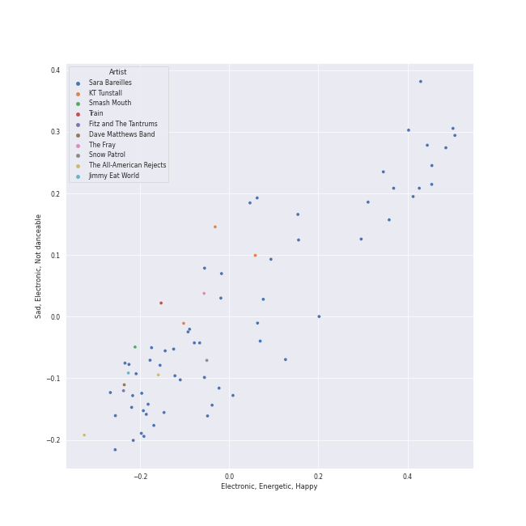
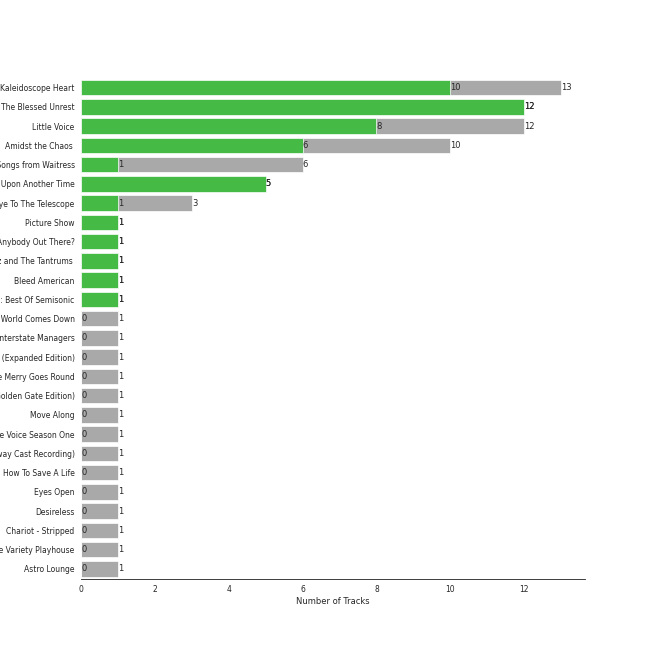
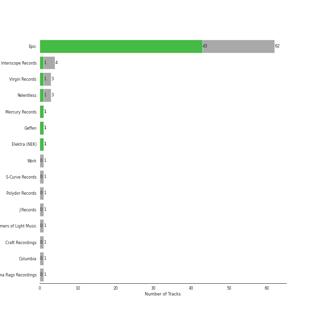

# pop rock

[81 songs](pop_rock_tracks.md)

## Top Artists

See all 19 artists

|   Number of Tracks | Art                                                                                              | Artist                                         | 🔗                                                           |
|-------------------:|:-------------------------------------------------------------------------------------------------|:-----------------------------------------------|:------------------------------------------------------------|
|                 59 |  | [Sara Bareilles](../artists/sara_bareilles.md) | [🔗](https://open.spotify.com/artist/2Sqr0DXoaYABbjBo9HaMkM) |
|                  3 |  | KT Tunstall                                    | [🔗](https://open.spotify.com/artist/5zzrJD2jXrE9dZ1AklRFcL) |
|                  3 |  | Jason Mraz                                     | [🔗](https://open.spotify.com/artist/4phGZZrJZRo4ElhRtViYdl) |
|                  2 |  | Jon McLaughlin                                 | [🔗](https://open.spotify.com/artist/6z29S0IoiBJpSMP8plyCj7) |
|                  2 |  | The Smashing Pumpkins                          | [🔗](https://open.spotify.com/artist/40Yq4vzPs9VNUrIBG5Jr2i) |
|                  2 |  | The Script                                     | [🔗](https://open.spotify.com/artist/3AQRLZ9PuTAozP28Skbq8V) |
|                  1 |  | Christina Perri                                | [🔗](https://open.spotify.com/artist/7H55rcKCfwqkyDFH9wpKM6) |
|                  1 |  | Alanis Morissette                              | [🔗](https://open.spotify.com/artist/6ogn9necmbUdCppmNnGOdi) |
|                  1 |  | Colbie Caillat                                 | [🔗](https://open.spotify.com/artist/6aZyMrc4doVtZyKNilOmwu) |
|                  1 |  | Sheppard                                       | [🔗](https://open.spotify.com/artist/6VxCmtR7S3yz4vnzsJqhSV) |
|                  1 |  | A Great Big World                              | [🔗](https://open.spotify.com/artist/5xKp3UyavIBUsGy3DQdXeF) |
|                  1 |  | The Black Crowes                               | [🔗](https://open.spotify.com/artist/5krkohEVJYw0qoB5VWwxaC) |
|                  1 |  | Gavin DeGraw                                   | [🔗](https://open.spotify.com/artist/5DYAABs8rkY9VhwtENoQCz) |
|                  1 |  | Fitz and The Tantrums                          | [🔗](https://open.spotify.com/artist/4AcHt3JxKy59IX7JNNlZn4) |
|                  1 |  | Snow Patrol                                    | [🔗](https://open.spotify.com/artist/3rIZMv9rysU7JkLzEaC5Jp) |
|                  1 |  | Eagle-Eye Cherry                               | [🔗](https://open.spotify.com/artist/3ngKsDXZAssmljeXCvEgOe) |
|                  1 |  | Christina Aguilera                             | [🔗](https://open.spotify.com/artist/1l7ZsJRRS8wlW3WfJfPfNS) |
|                  1 |  | Rixton                                         | [🔗](https://open.spotify.com/artist/0kkxsdcaWmWU2yWAqclDh4) |
|                  1 |  | Neon Trees                                     | [🔗](https://open.spotify.com/artist/0RpddSzUHfncUWNJXKOsjy) |

## Top Albums

See all 25 albums

|   Number of Tracks | Art                                                                                              | Album                                                   | 🔗                                                          |
|-------------------:|:-------------------------------------------------------------------------------------------------|:--------------------------------------------------------|:-----------------------------------------------------------|
|                 13 |  | Kaleidoscope Heart                                      | [🔗](https://open.spotify.com/album/627ukPRwYxyBREHxBq0vGJ) |
|                 12 |  | The Blessed Unrest                                      | [🔗](https://open.spotify.com/album/7lpbyGc4fHsQkBTsfWVBhp) |
|                 12 |  | Little Voice                                            | [🔗](https://open.spotify.com/album/2Z9WUERfMjOgQ6ze9TcGbF) |
|                 10 |  | Amidst the Chaos (Bonus Version)                        | [🔗](https://open.spotify.com/album/5x2sDapUIdq0qk1ezff3gm) |
|                  6 |  | What's Inside: Songs from Waitress                      | [🔗](https://open.spotify.com/album/1s6codM2ZAB008t9GTyaEk) |
|                  5 |  | Once Upon Another Time                                  | [🔗](https://open.spotify.com/album/1PrqYZJRzGNf8AsSOraxnZ) |
|                  3 |  | Eye To The Telescope                                    | [🔗](https://open.spotify.com/album/3j70PDKieTWQAwas3bPHRZ) |
|                  2 |  | We Sing. We Dance. We Steal Things.                     | [🔗](https://open.spotify.com/album/04G0YylSjvDQZrjOfE5jA5) |
|                  2 |  | Mellon Collie And The Infinite Sadness (Deluxe Edition) | [🔗](https://open.spotify.com/album/55RhFRyQFihIyGf61MgcfV) |
|                  1 |  | lovestrong.                                             | [🔗](https://open.spotify.com/album/3XNK8vPk3O1rjhDZyOMJ6n) |
|                  1 |  | The Script                                              | [🔗](https://open.spotify.com/album/1r5J0N6Ep181K0i8YuTYgO) |
|                  1 |  | The Script                                              | [🔗](https://open.spotify.com/album/51Hn2Wiq1jmUfI0BLaUhuF) |
|                  1 |  | Shake Your Money Maker                                  | [🔗](https://open.spotify.com/album/2NRRQLuW6j3EsoWpIl2MR3) |
|                  1 |  | Picture Show                                            | [🔗](https://open.spotify.com/album/0uRFz92JmjwDbZbB7hEBIr) |
|                  1 |  | OK Now                                                  | [🔗](https://open.spotify.com/album/3fKJJQFV6a61fnKYDDj2LU) |
|                  1 |  | Let The Road                                            | [🔗](https://open.spotify.com/album/02ae5i5UAoFrt2peVox9Xd) |
|                  1 |  | Jagged Little Pill                                      | [🔗](https://open.spotify.com/album/09AwlP99cHfKVNKv4FC8VW) |
|                  1 |  | Is There Anybody Out There?                             | [🔗](https://open.spotify.com/album/1yOcLa4euMk9sV7rRJ89Dl) |
|                  1 |  | Indiana                                                 | [🔗](https://open.spotify.com/album/2UpO4j1Zpptiwk3wbUIWmU) |
|                  1 |  | Fitz and The Tantrums (Deluxe Edition)                  | [🔗](https://open.spotify.com/album/4eoIRaV8z8v2LaXQSWy2LC) |
|                  1 |  | Eyes Open                                               | [🔗](https://open.spotify.com/album/3k7bXPw2u0C0SBKPMsgMS3) |
|                  1 |  | Desireless                                              | [🔗](https://open.spotify.com/album/3P2WRy9eBoBbSTCZWGQOoO) |
|                  1 |  | Chariot - Stripped                                      | [🔗](https://open.spotify.com/album/0Fm4Qx8IVHEEBYPeRzNUGI) |
|                  1 |  | Brave Enough: Live at the Variety Playhouse             | [🔗](https://open.spotify.com/album/7L4ZgnQqEhCEsV9GnMeXtE) |
|                  1 |  | Bombs Away                                              | [🔗](https://open.spotify.com/album/2Yi29VOccHCwktsZNqtxbt) |

## Top Record Labels

See all 17 labels

|   Number of Tracks | Label                                                                           |
|-------------------:|:--------------------------------------------------------------------------------|
|                 61 | [Epic](../labels/epic.md)                                                       |
|                  5 | [Virgin Records](../labels/virgin_records.md)                                   |
|                  3 | [Relentless](../labels/relentless.md)                                           |
|                  3 | [Atlantic Records](../labels/atlantic_records.md)                               |
|                  2 | [Phonogenic](../labels/phonogenic.md)                                           |
|                  2 | [Island Def Jam](../labels/island_def_jam.md)                                   |
|                  2 | [ATG](../labels/atg.md)                                                         |
|                  1 | [Work](../labels/work.md)                                                       |
|                  1 | [Silent Records](../labels/silent_records.md)                                   |
|                  1 | [Polydor Records](../labels/polydor_records.md)                                 |
|                  1 | [Mercury Records](../labels/mercury_records.md)                                 |
|                  1 | [Maverick](../labels/maverick.md)                                               |
|                  1 | [J Records](../labels/j_records.md)                                             |
|                  1 | [Giant Little Man](../labels/giant_little_man.md)                               |
|                  1 | [Elektra (NEK)](../labels/elektra__nek_.md)                                     |
|                  1 | [Decca (UMO)](../labels/decca__umo_.md)                                         |
|                  1 | [American Recordings Catalog P&D](../labels/american_recordings_catalog_p_d.md) |

## Audio Features

| 10 most Danceable tracks        | 10 least Danceable tracks    |
|:--------------------------------|:-----------------------------|
| Little Black Dress              | Jar of Hearts                |
| Eden                            | Everything Changes           |
| 1979 - Remastered 2012          | Bright Lights and Cityscapes |
| Black Horse And The Cherry Tree | Bluebird                     |
| I Choose You                    | Come Round Soon              |
| Geronimo                        | City                         |
| I'm Yours                       | Chariot                      |
| I Didn't Plan It                | Once Upon Another Time       |
| Let The Rain                    | Gravity                      |
| Lie To Me                       | Stay                         |

| 10 most Energetic tracks    | 10 least Energetic tracks                                                         |
|:----------------------------|:----------------------------------------------------------------------------------|
| Everybody Talks             | Basket Case                                                                       |
| Bad Idea (feat. Jason Mraz) | We All Need Saving                                                                |
| Morningside                 | What's Inside                                                                     |
| Let The Rain                | Once Upon Another Time                                                            |
| Fairytale                   | Bluebird                                                                          |
| Brave                       | Bright Lights and Cityscapes                                                      |
| HandClap                    | Manhattan                                                                         |
| You Oughta Know             | Say Something                                                                     |
| Industry                    | Goodbye Yellow Brick Road - Live at the Variety Playhouse, Atlanta, GA - May 2013 |
| Come Round Soon             | Kaleidoscope Heart                                                                |

| 10 most Speechy tracks                        | 10 least Speechy tracks    |
|:----------------------------------------------|:---------------------------|
| Opening Up                                    | The Light                  |
| Kaleidoscope Heart                            | Islands                    |
| Geronimo                                      | Breathe Again              |
| Come Round Soon                               | Sweet As Whole             |
| Bad Idea (feat. Jason Mraz)                   | Chasing Cars               |
| Black Horse And The Cherry Tree               | Orpheus                    |
| Bullet With Butterfly Wings - Remastered 2012 | Machine Gun                |
| Everybody Talks                               | The Man Who Can't Be Moved |
| Fire                                          | Breakeven                  |
| Eden                                          | Satellite Call             |

| 10 most Acoustic tracks                                                           | 10 least Acoustic tracks                      |
|:----------------------------------------------------------------------------------|:----------------------------------------------|
| Bright Lights and Cityscapes                                                      | 1979 - Remastered 2012                        |
| Manhattan                                                                         | Vegas                                         |
| Goodbye Yellow Brick Road - Live at the Variety Playhouse, Atlanta, GA - May 2013 | Many the Miles                                |
| Bluebird                                                                          | HandClap                                      |
| What's Inside                                                                     | Brave                                         |
| Once Upon Another Time                                                            | Me And My Broken Heart                        |
| Miss Simone                                                                       | Everybody Talks                               |
| Say Something                                                                     | Hard To Handle                                |
| Gravity                                                                           | Save Tonight                                  |
| Someone Who Loves Me                                                              | Bullet With Butterfly Wings - Remastered 2012 |

| 10 most Instrumental tracks                   | 10 least Instrumental tracks    |
|:----------------------------------------------|:--------------------------------|
| Bullet With Butterfly Wings - Remastered 2012 | Once Upon Another Time          |
| 1979 - Remastered 2012                        | Everything Changes              |
| Satellite Call                                | Lucky                           |
| Islands                                       | I'm Yours                       |
| Armor                                         | Black Horse And The Cherry Tree |
| Breathe Again                                 | Sweet As Whole                  |
| Miss Simone                                   | Gravity                         |
| The Light                                     | Love Song                       |
| Hard To Handle                                | Love On the Rocks               |
| No Such Thing                                 | Say You're Sorry                |

| 10 most Live tracks                                                               | 10 least Live tracks                          |
|:----------------------------------------------------------------------------------|:----------------------------------------------|
| Goodbye Yellow Brick Road - Live at the Variety Playhouse, Atlanta, GA - May 2013 | Little Black Dress                            |
| You Oughta Know                                                                   | Islands                                       |
| Chariot                                                                           | The Light                                     |
| Fire                                                                              | King of Anything                              |
| Black Horse And The Cherry Tree                                                   | 1979 - Remastered 2012                        |
| Everybody Talks                                                                   | Chasing The Sun                               |
| Hard To Handle                                                                    | Bullet With Butterfly Wings - Remastered 2012 |
| Let The Rain                                                                      | Eden                                          |
| Not Alone                                                                         | Brave                                         |
| If I Can't Have You                                                               | Uncharted                                     |

| 10 most Happy tracks            | 10 least Happy tracks                                                             |
|:--------------------------------|:----------------------------------------------------------------------------------|
| 1979 - Remastered 2012          | Goodbye Yellow Brick Road - Live at the Variety Playhouse, Atlanta, GA - May 2013 |
| Hard To Handle                  | What's Inside                                                                     |
| I Choose You                    | Bluebird                                                                          |
| Black Horse And The Cherry Tree | Chasing Cars                                                                      |
| Say You're Sorry                | We All Need Saving                                                                |
| King of Anything                | Everything Changes                                                                |
| Lie To Me                       | Jar of Hearts                                                                     |
| Bad Idea (feat. Jason Mraz)     | Islands                                                                           |
| I Didn't Plan It                | Say Something                                                                     |
| Morningside                     | Once Upon Another Time                                                            |
