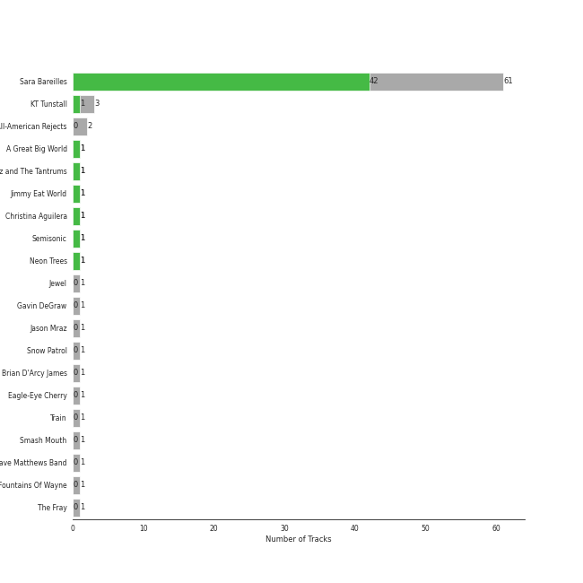

# pop rock

[73 songs](tracks.md)

## Top Artists

| Art | Tracks | 💚 | Artist | 🔗 |
|:---|---:|---:|:---|:---|
|  | 59 | 41 | [Sara Bareilles](../../artists/sara_bareilles/overview.md) | [🔗](https://open.spotify.com/artist/2Sqr0DXoaYABbjBo9HaMkM) |
|  | 3 | 2 | Jason Mraz | [🔗](https://open.spotify.com/artist/4phGZZrJZRo4ElhRtViYdl) |
|  | 2 | 2 | The Script | [🔗](https://open.spotify.com/artist/3AQRLZ9PuTAozP28Skbq8V) |
|  | 3 | 1 | KT Tunstall | [🔗](https://open.spotify.com/artist/5zzrJD2jXrE9dZ1AklRFcL) |
|  | 1 | 1 | Alanis Morissette | [🔗](https://open.spotify.com/artist/6ogn9necmbUdCppmNnGOdi) |
|  | 1 | 1 | Colbie Caillat | [🔗](https://open.spotify.com/artist/6aZyMrc4doVtZyKNilOmwu) |
|  | 1 | 1 | A Great Big World | [🔗](https://open.spotify.com/artist/5xKp3UyavIBUsGy3DQdXeF) |
|  | 1 | 1 | Fitz and The Tantrums | [🔗](https://open.spotify.com/artist/4AcHt3JxKy59IX7JNNlZn4) |
|  | 1 | 1 | Christina Aguilera | [🔗](https://open.spotify.com/artist/1l7ZsJRRS8wlW3WfJfPfNS) |
|  | 1 | 1 | Neon Trees | [🔗](https://open.spotify.com/artist/0RpddSzUHfncUWNJXKOsjy) |

See all 13 artists

| Art | Tracks | 💚 | Artist | 🔗 |
|:---|---:|---:|:---|:---|
|  | 1 | 0 | Gavin DeGraw | [🔗](https://open.spotify.com/artist/5DYAABs8rkY9VhwtENoQCz) |
|  | 1 | 0 | Snow Patrol | [🔗](https://open.spotify.com/artist/3rIZMv9rysU7JkLzEaC5Jp) |
|  | 1 | 0 | Eagle-Eye Cherry | [🔗](https://open.spotify.com/artist/3ngKsDXZAssmljeXCvEgOe) |

## Top Albums

| Art | Tracks | 💚 | Album | Release Date | 🔗 |
|:---|---:|---:|:---|:---|:---|
|  | 13 | 10 | Kaleidoscope Heart | 2010-09-07 | [🔗](https://open.spotify.com/album/627ukPRwYxyBREHxBq0vGJ) |
|  | 12 | 11 | The Blessed Unrest | 2013-07-16 | [🔗](https://open.spotify.com/album/7lpbyGc4fHsQkBTsfWVBhp) |
|  | 12 | 8 | Little Voice | 2007-07-03 | [🔗](https://open.spotify.com/album/2Z9WUERfMjOgQ6ze9TcGbF) |
|  | 10 | 6 | Amidst the Chaos (Bonus Version) | 2019-05-10 | [🔗](https://open.spotify.com/album/5x2sDapUIdq0qk1ezff3gm) |
|  | 6 | 1 | What's Inside: Songs from Waitress | 2015-11-06 | [🔗](https://open.spotify.com/album/1s6codM2ZAB008t9GTyaEk) |
|  | 5 | 5 | Once Upon Another Time | 2012-05-22 | [🔗](https://open.spotify.com/album/1PrqYZJRzGNf8AsSOraxnZ) |
|  | 3 | 1 | Eye To The Telescope | 2005-01-01 | [🔗](https://open.spotify.com/album/3j70PDKieTWQAwas3bPHRZ) |
|  | 2 | 2 | We Sing. We Dance. We Steal Things. | 2008-05-12 | [🔗](https://open.spotify.com/album/04G0YylSjvDQZrjOfE5jA5) |
|  | 2 | 2 | The Script | 2008-07-14 | [🔗](https://open.spotify.com/album/1r5J0N6Ep181K0i8YuTYgO) |
|  | 1 | 1 | Picture Show | 2012-01-01 | [🔗](https://open.spotify.com/album/0uRFz92JmjwDbZbB7hEBIr) |

See all 17 albums

| Art | Tracks | 💚 | Album | Release Date | 🔗 |
|:---|---:|---:|:---|:---|:---|
|  | 1 | 1 | Jagged Little Pill | 1995-06-09 | [🔗](https://open.spotify.com/album/09AwlP99cHfKVNKv4FC8VW) |
|  | 1 | 1 | Is There Anybody Out There? | 2014-01-20 | [🔗](https://open.spotify.com/album/1yOcLa4euMk9sV7rRJ89Dl) |
|  | 1 | 1 | Fitz and The Tantrums (Deluxe Edition) | 2017-07-24 | [🔗](https://open.spotify.com/album/4eoIRaV8z8v2LaXQSWy2LC) |
|  | 1 | 0 | Eyes Open | 2006-01-01 | [🔗](https://open.spotify.com/album/3k7bXPw2u0C0SBKPMsgMS3) |
|  | 1 | 0 | Desireless | 1998-07-13 | [🔗](https://open.spotify.com/album/3P2WRy9eBoBbSTCZWGQOoO) |
|  | 1 | 0 | Chariot - Stripped | 2004-07-26 | [🔗](https://open.spotify.com/album/0Fm4Qx8IVHEEBYPeRzNUGI) |
|  | 1 | 0 | Brave Enough: Live at the Variety Playhouse | 2013-10-22 | [🔗](https://open.spotify.com/album/7L4ZgnQqEhCEsV9GnMeXtE) |

## Top Record Labels

| Tracks | 💚 | Label |
|---:|---:|:---|
| 62 | 44 | [Epic](../../labels/epic/overview.md) |
| 2 | 2 | Phonogenic |
| 2 | 2 | [Atlantic Records](../../labels/atlantic_records/overview.md) |
| 2 | 2 | ATG |
| 3 | 1 | [Virgin Records](../../labels/virgin_records/overview.md) |
| 3 | 1 | Relentless |
| 1 | 1 | Mercury Records |
| 1 | 1 | Maverick |
| 1 | 1 | Elektra (NEK) |
| 1 | 0 | Work |

See all 12 labels

| Tracks | 💚 | Label |
|---:|---:|:---|
| 1 | 0 | [Polydor Records](../../labels/polydor_records/overview.md) |
| 1 | 0 | J Records |

## Years

| 10 newest albums | 10 oldest albums |
|:---|:---|
| 
 Amidst the Chaos (Bonus Version) (2019-05-10)
 | 
 Jagged Little Pill (1995-06-09)
 |
| 
 Fitz and The Tantrums (Deluxe Edition) (2017-07-24)
 | 
 Desireless (1998-07-13)
 |
| 
 What's Inside: Songs from Waitress (2015-11-06)
 | 
 Chariot - Stripped (2004-07-26)
 |
| 
 Is There Anybody Out There? (2014-01-20)
 | 
 Eye To The Telescope (2005-01-01)
 |
| 
 Brave Enough: Live at the Variety Playhouse (2013-10-22)
 | 
 Eyes Open (2006-01-01)
 |
| 
 The Blessed Unrest (2013-07-16)
 | 
 Little Voice (2007-07-03)
 |
| 
 Once Upon Another Time (2012-05-22)
 | 
 We Sing. We Dance. We Steal Things. (2008-05-12)
 |
| 
 Picture Show (2012-01-01)
 | 
 The Script (2008-07-14)
 |
| 
 Kaleidoscope Heart (2010-09-07)
 | 
 Kaleidoscope Heart (2010-09-07)
 |
| 
 The Script (2008-07-14)
 | 
 Picture Show (2012-01-01)
 |
## Audio Features

| 10 most Danceable tracks | 10 least Danceable tracks |
|:---|:---|
| Little Black Dress (0.787) | Stay (0.262) |
| Eden (0.776) | Gravity (0.27) |
| Black Horse And The Cherry Tree (0.748) | Once Upon Another Time (0.275) |
| I Choose You (0.731) | Chariot (0.281) |
| I'm Yours (0.703) | City (0.319) |
| I Didn't Plan It (0.695) | Come Round Soon (0.338) |
| Let The Rain (0.694) | Bluebird (0.34) |
| Lie To Me (0.683) | Bright Lights and Cityscapes (0.343) |
| No Such Thing (0.677) | Everything Changes (0.348) |
| King of Anything (0.676) | Breathe Again (0.366) |

| 10 most Energetic tracks | 10 least Energetic tracks |
|:---|:---|
| Everybody Talks (0.924) | Kaleidoscope Heart (0.0516) |
| Bad Idea (feat. Jason Mraz) (0.889) | Goodbye Yellow Brick Road - Live at the Variety Playhouse, Atlanta, GA - May 2013 (0.114) |
| Morningside (0.88) | Say Something (0.147) |
| Let The Rain (0.873) | Manhattan (0.168) |
| Fairytale (0.857) | Bright Lights and Cityscapes (0.184) |
| Brave (0.836) | Bluebird (0.203) |
| HandClap (0.836) | Once Upon Another Time (0.216) |
| You Oughta Know (0.831) | What's Inside (0.242) |
| Love On the Rocks (0.819) | Basket Case (0.273) |
| Come Round Soon (0.819) | Gravity (0.275) |

| 10 most Speechy tracks | 10 least Speechy tracks |
|:---|:---|
| Opening Up (0.0936) | Satellite Call (0.0241) |
| Kaleidoscope Heart (0.0927) | Breakeven (0.0242) |
| Come Round Soon (0.0776) | Machine Gun (0.0268) |
| Bad Idea (feat. Jason Mraz) (0.0704) | Orpheus (0.0269) |
| Black Horse And The Cherry Tree (0.0641) | Chasing Cars (0.0274) |
| Everybody Talks (0.0586) | Sweet As Whole (0.0275) |
| Fire (0.057) | Breathe Again (0.0278) |
| Eden (0.0562) | The Man Who Can't Be Moved (0.0279) |
| You Oughta Know (0.0557) | Islands (0.0284) |
| Little Black Dress (0.0554) | If I Can't Have You (0.0297) |

| 10 most Acoustic tracks | 10 least Acoustic tracks |
|:---|:---|
| Bright Lights and Cityscapes (0.977) | Save Tonight (9.24e-05) |
| Manhattan (0.972) | Everybody Talks (0.00301) |
| Goodbye Yellow Brick Road - Live at the Variety Playhouse, Atlanta, GA - May 2013 (0.959) | Brave (0.00502) |
| Bluebird (0.933) | HandClap (0.00609) |
| What's Inside (0.919) | Many the Miles (0.00796) |
| Once Upon Another Time (0.896) | Vegas (0.00881) |
| Miss Simone (0.859) | Bad Idea (feat. Jason Mraz) (0.0168) |
| Say Something (0.857) | Wicked Love (0.0178) |
| Gravity (0.834) | Gonna Get Over You (0.0199) |
| Someone Who Loves Me (0.826) | Love Song (0.0208) |

| 10 most Instrumental tracks | 10 least Instrumental tracks |
|:---|:---|
| Satellite Call (0.0318) | Say You're Sorry (0.0) |
| Islands (0.0261) | Sweet As Whole (0.0) |
| Armor (0.0145) | Chariot (0.0) |
| Breathe Again (0.00655) | You Oughta Know (0.0) |
| Miss Simone (0.00407) | Lucky (0.0) |
| The Light (0.00375) | Come Round Soon (0.0) |
| No Such Thing (0.00175) | Black Horse And The Cherry Tree (0.0) |
| Fire (0.00165) | Kaleidoscope Heart (0.0) |
| Stay (0.00154) | Everything Changes (0.0) |
| December (0.00117) | I'm Yours (0.0) |

| 10 most Live tracks | 10 least Live tracks |
|:---|:---|
| Goodbye Yellow Brick Road - Live at the Variety Playhouse, Atlanta, GA - May 2013 (0.781) | Uncharted (0.0343) |
| You Oughta Know (0.736) | Brave (0.0425) |
| Chariot (0.37) | Eden (0.0456) |
| Fire (0.363) | Chasing The Sun (0.0497) |
| Black Horse And The Cherry Tree (0.34) | King of Anything (0.0574) |
| Everybody Talks (0.313) | The Light (0.0691) |
| Let The Rain (0.297) | Islands (0.0699) |
| Not Alone (0.256) | Little Black Dress (0.0743) |
| If I Can't Have You (0.254) | Cassiopeia (0.075) |
| Once Upon Another Time (0.231) | Opening Up (0.0762) |

| 10 most Happy tracks | 10 least Happy tracks |
|:---|:---|
| I Choose You (0.947) | Once Upon Another Time (0.0551) |
| Black Horse And The Cherry Tree (0.917) | Say Something (0.0765) |
| Say You're Sorry (0.846) | Islands (0.0863) |
| King of Anything (0.81) | Everything Changes (0.0983) |
| Lie To Me (0.795) | Chasing Cars (0.144) |
| I Didn't Plan It (0.787) | Bluebird (0.161) |
| Bad Idea (feat. Jason Mraz) (0.787) | What's Inside (0.162) |
| Morningside (0.785) | Goodbye Yellow Brick Road - Live at the Variety Playhouse, Atlanta, GA - May 2013 (0.168) |
| Brave (0.758) | She Used To Be Mine (0.172) |
| Wicked Love (0.754) | Stay (0.181) |
