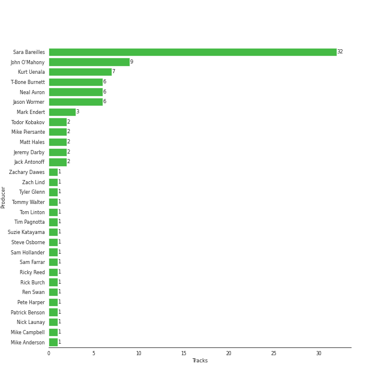
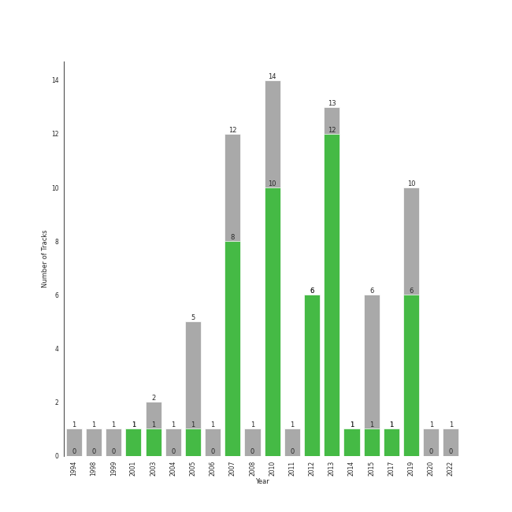

# pop rock

78 songs

[See Track Features](audio_features.md)

[See Clusters](clusters/overview.md)

## Top Artists

| Art | Rank | Tracks | 💚 | Artist | 🔗 |
|:---|---:|---:|---:|:---|:---|
|  | 23 | 61 | 42 | [Sara Bareilles](../../artists/sara_bareilles/overview.md) | [🔗](https://open.spotify.com/artist/2Sqr0DXoaYABbjBo9HaMkM) |
|  | 431 | 3 | 1 | KT Tunstall | [🔗](https://open.spotify.com/artist/5zzrJD2jXrE9dZ1AklRFcL) |
|  | 431 | 1 | 1 | A Great Big World | [🔗](https://open.spotify.com/artist/5xKp3UyavIBUsGy3DQdXeF) |
|  | 431 | 1 | 1 | Fitz and The Tantrums | [🔗](https://open.spotify.com/artist/4AcHt3JxKy59IX7JNNlZn4) |
|  | 166 | 1 | 1 | Jimmy Eat World | [🔗](https://open.spotify.com/artist/3Ayl7mCk0nScecqOzvNp6s) |
|  | 431 | 1 | 1 | Christina Aguilera | [🔗](https://open.spotify.com/artist/1l7ZsJRRS8wlW3WfJfPfNS) |
|  | 431 | 1 | 1 | Semisonic | [🔗](https://open.spotify.com/artist/1TqQi97nqeiuOJrIFv5Sw0) |
|  | 362 | 1 | 1 | Neon Trees | [🔗](https://open.spotify.com/artist/0RpddSzUHfncUWNJXKOsjy) |
|  | 431 | 2 | 0 | The All-American Rejects | [🔗](https://open.spotify.com/artist/3vAaWhdBR38Q02ohXqaNHT) |
|  | 431 | 1 | 0 | Gavin DeGraw | [🔗](https://open.spotify.com/artist/5DYAABs8rkY9VhwtENoQCz) |

See all 18 artists

| Art | Rank | Tracks | 💚 | Artist | 🔗 |
|:---|---:|---:|---:|:---|:---|
|  | 382 | 1 | 0 | Jason Mraz | [🔗](https://open.spotify.com/artist/4phGZZrJZRo4ElhRtViYdl) |
|  | 431 | 1 | 0 | Snow Patrol | [🔗](https://open.spotify.com/artist/3rIZMv9rysU7JkLzEaC5Jp) |
|  | 431 | 1 | 0 | Brian D'Arcy James | [🔗](https://open.spotify.com/artist/3oYQrBzEQNpxnjWXP54B4n) |
|  | 431 | 1 | 0 | Eagle-Eye Cherry | [🔗](https://open.spotify.com/artist/3ngKsDXZAssmljeXCvEgOe) |
|  | 431 | 1 | 0 | Train | [🔗](https://open.spotify.com/artist/3FUY2gzHeIiaesXtOAdB7A) |
|  | 431 | 1 | 0 | Smash Mouth | [🔗](https://open.spotify.com/artist/2iEvnFsWxR0Syqu2JNopAd) |
|  | 431 | 1 | 0 | Fountains Of Wayne | [🔗](https://open.spotify.com/artist/1pgtr4nhBQjp9oCUBPyYWh) |
|  | 431 | 1 | 0 | The Fray | [🔗](https://open.spotify.com/artist/0zOcE3mg9nS6l3yxt1Y0bK) |

## Most and least listened tracks
| Rank | ​ | Most listened tracks | Rank | ​​ | Least listened tracks |
|---:|:---|:---|---:|:---|:---|
| 268 |  | [Machine Gun](../../artists/sara_bareilles/overview.md) | 989 |  | [Uncharted](../../artists/sara_bareilles/overview.md) |
| 331 |  | The Middle | 989 |  | [Once Upon Another Time](../../artists/sara_bareilles/overview.md) |
| 354 |  | [Between the Lines](../../artists/sara_bareilles/overview.md) | 989 |  | [City](../../artists/sara_bareilles/overview.md) |
| 370 |  | [Many the Miles](../../artists/sara_bareilles/overview.md) | 989 |  | [Bright Lights and Cityscapes](../../artists/sara_bareilles/overview.md) |
| 406 |  | [Fairytale](../../artists/sara_bareilles/overview.md) | 989 |  | [Basket Case](../../artists/sara_bareilles/overview.md) |
| 473 |  | [Lie To Me](../../artists/sara_bareilles/overview.md) | 989 |  | [Chasing The Sun](../../artists/sara_bareilles/overview.md) |
| 532 |  | [I Choose You](../../artists/sara_bareilles/overview.md) | 989 |  | Gives You Hell |
| 615 |  | [Manhattan](../../artists/sara_bareilles/overview.md) | 989 |  | [Little Voice](../../artists/sara_bareilles/overview.md) |
| 734 |  | [Not Alone](../../artists/sara_bareilles/overview.md) | 989 |  | [Wicked Love](../../artists/sara_bareilles/overview.md) |
| 767 |  | Everybody Talks | 989 |  | Say Something |

## Top Albums

| Art | Rank | Tracks | 💚 | Album | Release Date | 🔗 |
|:---|---:|---:|---:|:---|:---|:---|
|  | 189 | 13 | 10 | Kaleidoscope Heart | 2010-09-07 | [🔗](https://open.spotify.com/album/627ukPRwYxyBREHxBq0vGJ) |
|  | 265 | 12 | 12 | The Blessed Unrest | 2013-07-16 | [🔗](https://open.spotify.com/album/7lpbyGc4fHsQkBTsfWVBhp) |
|  | 181 | 12 | 8 | Little Voice | 2007-07-03 | [🔗](https://open.spotify.com/album/2Z9WUERfMjOgQ6ze9TcGbF) |
|  | 496 | 10 | 6 | Amidst the Chaos (Bonus Version) | 2019-05-10 | [🔗](https://open.spotify.com/album/5x2sDapUIdq0qk1ezff3gm) |
|  | 651 | 6 | 1 | What's Inside: Songs from Waitress | 2015-11-06 | [🔗](https://open.spotify.com/album/1s6codM2ZAB008t9GTyaEk) |
|  | 331 | 5 | 5 | Once Upon Another Time | 2012-05-22 | [🔗](https://open.spotify.com/album/1PrqYZJRzGNf8AsSOraxnZ) |
|  | 651 | 3 | 1 | Eye To The Telescope | 2005-01-01 | [🔗](https://open.spotify.com/album/3j70PDKieTWQAwas3bPHRZ) |
|  | 514 | 1 | 1 | Picture Show | 2012-01-01 | [🔗](https://open.spotify.com/album/0uRFz92JmjwDbZbB7hEBIr) |
|  | 651 | 1 | 1 | Is There Anybody Out There? | 2014-01-20 | [🔗](https://open.spotify.com/album/1yOcLa4euMk9sV7rRJ89Dl) |
|  | 651 | 1 | 1 | Fitz and The Tantrums (Deluxe Edition) | 2017-07-24 | [🔗](https://open.spotify.com/album/4eoIRaV8z8v2LaXQSWy2LC) |

See all 24 albums

| Art | Rank | Tracks | 💚 | Album | Release Date | 🔗 |
|:---|---:|---:|---:|:---|:---|:---|
|  | 238 | 1 | 1 | Bleed American | 2001-07-17 | [🔗](https://open.spotify.com/album/0UJhhj5bn5AGAjryFnhueP) |
|  | 651 | 1 | 1 | 20th Century Masters: The Millennium Collection: Best Of Semisonic | 2003-01-01 | [🔗](https://open.spotify.com/album/4JDBx5wQ82jb8PjLYPBP8L) |
|  | 651 | 1 | 0 | When The World Comes Down | 2008-01-01 | [🔗](https://open.spotify.com/album/3BCMpDOcQlbCZpf5vnTadZ) |
|  | 651 | 1 | 0 | Welcome Interstate Managers | 2003-01-01 | [🔗](https://open.spotify.com/album/6TZp52tXShLQbq8yNMxqNT) |
|  | 651 | 1 | 0 | Save Me, San Francisco (Golden Gate Edition) | 2010-12-01 | [🔗](https://open.spotify.com/album/1CwXS6MAz8Wo7K4TzW9iuR) |
|  | 651 | 1 | 0 | Move Along | 2005-01-01 | [🔗](https://open.spotify.com/album/3PWEGZ6CYvXRnr0JCECsDe) |
|  | 651 | 1 | 0 | More Love - Songs from Little Voice Season One | 2020-09-04 | [🔗](https://open.spotify.com/album/52fzvqGSm991mT6pBgAS6g) |
|  | 284 | 1 | 0 | Into The Woods (2022 Broadway Cast Recording) | 2022-09-30 | [🔗](https://open.spotify.com/album/5z6BFXI711HbSAXDjgOAHE) |
|  | 651 | 1 | 0 | How To Save A Life | 2005-09-13 | [🔗](https://open.spotify.com/album/1IM3GwptCGYjRkzCBolyFK) |
|  | 651 | 1 | 0 | Eyes Open | 2006-01-01 | [🔗](https://open.spotify.com/album/3k7bXPw2u0C0SBKPMsgMS3) |
|  | 651 | 1 | 0 | Desireless | 1998-07-13 | [🔗](https://open.spotify.com/album/3P2WRy9eBoBbSTCZWGQOoO) |
|  | 651 | 1 | 0 | Chariot - Stripped | 2004-07-26 | [🔗](https://open.spotify.com/album/0Fm4Qx8IVHEEBYPeRzNUGI) |
|  | 651 | 1 | 0 | Brave Enough: Live at the Variety Playhouse | 2013-10-22 | [🔗](https://open.spotify.com/album/7L4ZgnQqEhCEsV9GnMeXtE) |
|  | 651 | 1 | 0 | Astro Lounge | 1999-06-08 | [🔗](https://open.spotify.com/album/2kyTLcEZe6nc1s6ve0zW9P) |

## Top Record Labels

| Tracks | 💚 | Label |
|---:|---:|:---|
| 62 | 43 | [Epic](../../labels/epic/overview.md) |
| 4 | 1 | [Interscope Records](../../labels/interscope_records/overview.md) |
| 3 | 1 | [Virgin Records](../../labels/virgin_records/overview.md) |
| 3 | 1 | Relentless |
| 1 | 1 | Mercury Records |
| 1 | 1 | [Geffen](../../labels/geffen/overview.md) |
| 1 | 1 | Elektra (NEK) |
| 1 | 0 | Work |
| 1 | 0 | S-Curve Records |
| 1 | 0 | [Polydor Records](../../labels/polydor_records/overview.md) |

See all 13 labels

| Tracks | 💚 | Label |
|---:|---:|:---|
| 1 | 0 | J Records |
| 1 | 0 | [Craft Recordings](../../labels/craft_recordings/overview.md) |
| 1 | 0 | [Columbia](../../labels/columbia/overview.md) |

## Top Producers

| Art | Producer | Tracks | Credit Types |
|:---|:---|---:|:---|
|  | [Sara Bareilles](../../artists/sara_bareilles/overview.md) | 32 | Lyricist, Songwriter, Producer |
| | John O'Mahony | 9 | Producer |
| | Kurt Uenala | 7 | Producer |
| | T-Bone Burnett | 6 | Producer |
| | Jason Wormer | 6 | Producer |
| | Neal Avron | 6 | Arranger, Producer |
| | Mark Endert | 3 | Producer |
| | Mike Piersante | 2 | Producer |
| | [Jack Antonoff](../../producers/jack_antonoff/overview.md) | 2 | Songwriter |
| | Matt Hales | 2 | Songwriter |

View all

| Art | Producer | Tracks | Credit Types |
|:---|:---|---:|:---|
| | Todor Kobakov | 2 | Arranger |
| | Jeremy Darby | 2 | Producer |
| | Steve Osborne | 1 | Producer |
| | Bruno Ellingham | 1 | Producer |
| | Suzie Katayama | 1 | Arranger |
|  | Jimmy Eat World | 1 | Producer |
| | Patrick Benson | 1 | Producer |
| | Jim Adkins | 1 | Songwriter |
| | Billy Bush | 1 | Producer |
| | Ren Swan | 1 | Producer |
| | Mike Campbell | 1 | Songwriter |
| | Zachary Dawes | 1 | Producer |
| | Javier Dunn | 1 | Songwriter |
| | Tommy Walter | 1 | Producer |
| | Pete Harper | 1 | Songwriter |
| | Aaron Sterling | 1 | Songwriter |
| | Chad Vaccarino | 1 | Songwriter |
| | Jason Blynn | 1 | Songwriter |
| | Tyler Glenn | 1 | Songwriter |
| | Zach Lind | 1 | Songwriter |
| | [Ricky Reed](../../producers/ricky_reed/overview.md) | 1 | Producer, Songwriter |
| | Justin Meldal-Johnsen | 1 | Producer |
| | Tim Pagnotta | 1 | Songwriter |
|  | Emily King | 1 | Songwriter |
| | Eric Rosse | 1 | Producer |
| | Mike Anderson | 1 | Songwriter |
| | Justin Tranter | 1 | Songwriter |
| | Jack Joseph-Puig | 1 | Producer |
| | Rick Burch | 1 | Songwriter |
| | Joseph Lorge | 1 | Producer |
| | Nick Launay | 1 | Producer |
| | Ian Axel | 1 | Songwriter |
| | Jacob Slichter | 1 | Arranger |
| | Carl Lieberman, RPT | 1 | Producer |
|  | Fitz and The Tantrums | 1 | Songwriter |
| | Lori McKenna | 1 | Songwriter |
| | Mark Trombino | 1 | Producer |
| | Sam Hollander | 1 | Songwriter |
| | Tom Linton | 1 | Songwriter |
|  | KT Tunstall | 1 | Lyricist, Songwriter |
| | Andy Green | 1 | Producer |
| | Dan Wilson | 1 | Lyricist, Songwriter |
| | Sam Farrar | 1 | Songwriter |

## Years

| ​ | 10 newest albums | ​​ | 10 oldest albums |
|:---|:---|:---|:---|
|  | Into The Woods (2022 Broadway Cast Recording) (2022-09-30) |  | Desireless (1998-07-13) |
|  | More Love - Songs from Little Voice Season One (2020-09-04) |  | Astro Lounge (1999-06-08) |
|  | Amidst the Chaos (Bonus Version) (2019-05-10) |  | Bleed American (2001-07-17) |
|  | Fitz and The Tantrums (Deluxe Edition) (2017-07-24) |  | Welcome Interstate Managers (2003-01-01) |
|  | What's Inside: Songs from Waitress (2015-11-06) |  | 20th Century Masters: The Millennium Collection: Best Of Semisonic (2003-01-01) |
|  | Is There Anybody Out There? (2014-01-20) |  | Chariot - Stripped (2004-07-26) |
|  | Brave Enough: Live at the Variety Playhouse (2013-10-22) |  | Move Along (2005-01-01) |
|  | The Blessed Unrest (2013-07-16) |  | Eye To The Telescope (2005-01-01) |
|  | Once Upon Another Time (2012-05-22) |  | How To Save A Life (2005-09-13) |
|  | Picture Show (2012-01-01) |  | Eyes Open (2006-01-01) |

