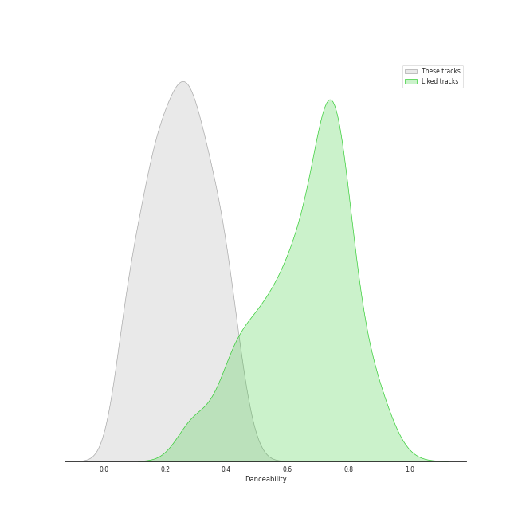
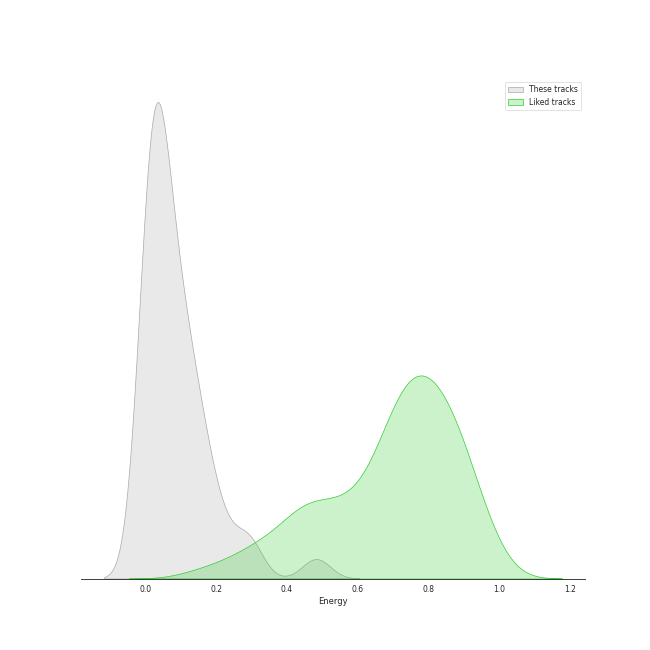
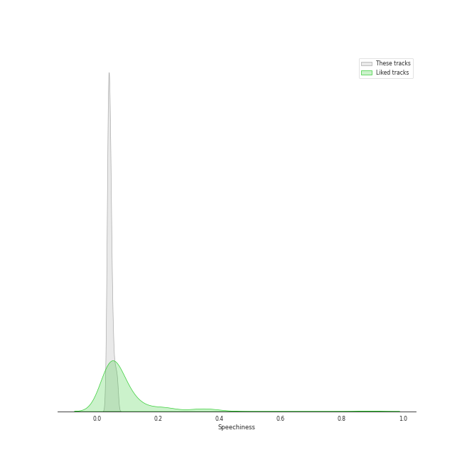
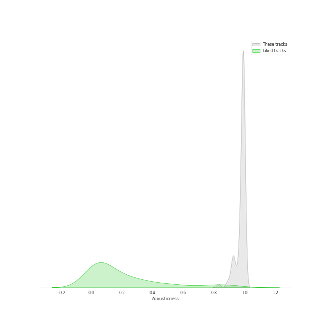
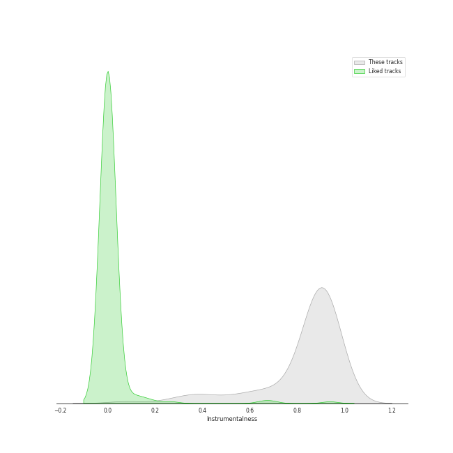
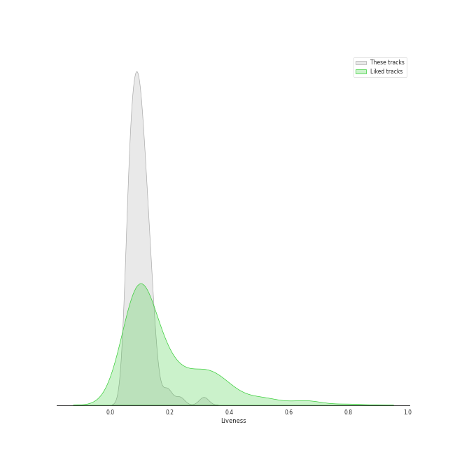
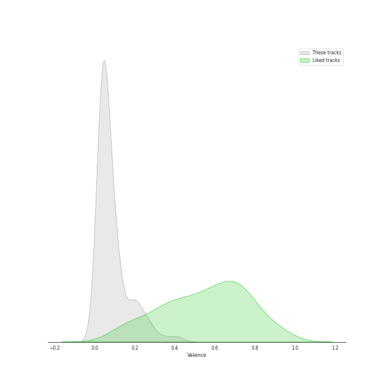
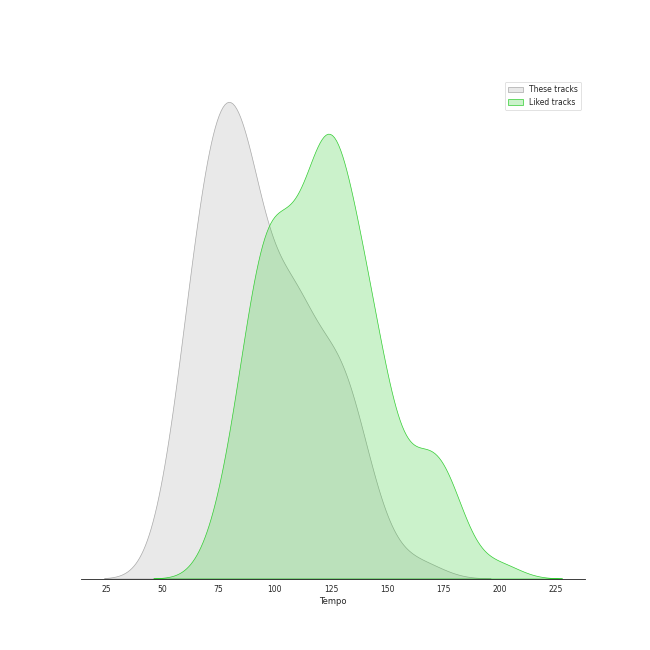

# Track Features for post-romantic era

## Danceability

| ​ | 10 most Danceable tracks | ​​ | 10 least Danceable tracks |
|:---|:---|:---|:---|
|  | Études, L. 136: II. Pour les Accords (0.464) |  | The Planets, Op. 32: VII. Neptune, the Mystic (0.0601) |
|  | 13 Preludes, Op. 32: No. 3 in E Major: Allegro vivace (0.437) |  | String Quartet in G Minor, Op. 10: III. Andantino, doucement expressif (0.0623) |
|  | 13 Preludes, Op. 32: No. 8 in A Minor: Vivo (0.428) |  | La Mer, L.109: 1. From Dawn Till Noon On The Sea (De l'aube à midi sur la mer) (0.0633) |
|  | Morceaux de fantaisie, Op. 3: No. 2, Prelude in C-Sharp Minor (0.423) |  | Vespers, Op. 37: XII. "Slava v vyshnikh Bogu" (0.0636) |
|  | Carol of the Bells (0.418) |  | Requiem in D Minor, Op. 48: II. Offertorium. Domine Jesu Christe (0.0668) |
|  | 13 Preludes, Op. 32: No. 11 in B Major: Allegretto (0.414) |  | Vespers, Op. 37: V. "Nyne otpushchayeshi" (0.0806) |
|  | 10 Preludes, Op. 23: No. 10 in G-Flat Major: Largo (0.414) |  | The Planets, Op. 32: II. Venus, the Bringer of Peace (0.0864) |
|  | String Quartet in G Minor, Op. 10: II. Assez vif et bien rythmé (0.412) |  | La Mer, L.109: 3. Dialogue Of The Wind And The Sea (0.0986) |
|  | Children's Corner, L. 113: III. Golliwogg's Cake-Walk (0.398) |  | Vespers, Op. 37: IV. "Svete tikhyi" (0.103) |
|  | Préludes Book 1, L. 117: IV. Minstrels (0.389) |  | Vespers, Op. 37: XIV. "Voskrez iz groba" (0.104) |

## Energy

| ​ | 10 most Energetic tracks | ​​ | 10 least Energetic tracks |
|:---|:---|:---|:---|
|  | Vespers, Op. 37: XV. "Vzbrannoy voevode" (0.488) |  | Préludes Book 1, L. 117: I. Des Pas sur La Neige (0.000594) |
|  | The Planets, Op. 32: I. Mars, the Bringer of War (0.478) |  | Images, Set 2, L. 111: et la Lune descend sur le Temple qui fut (0.00104) |
|  | The Planets, Op. 32: IV. Jupiter, the Bringer of Jollity (0.297) |  | Préludes Book 2, L. 123: II. Canope (0.00148) |
|  | Vespers, Op. 37: VIII. "Kvalite imya Gospodne" (0.296) |  | La Fille aux Cheveux de Lin, L. 33 (0.00218) |
|  | The Planets, Op. 32: VI. Uranus, the Magician (0.294) |  | Préludes Book 1, L. 117: III. La Cathedrale Engloutie (0.00259) |
|  | 10 Preludes, Op. 23: No. 2 in B-Flat Major: Maestoso (0.272) |  | Clair de Lune, L. 32 (0.00532) |
|  | 13 Preludes, Op. 32: No. 3 in E Major: Allegro vivace (0.23) |  | 10 Preludes, Op. 23: No. 10 in G-Flat Major: Largo (0.00644) |
|  | String Quartet in G Minor, Op. 10: IV. Très modéré (0.224) |  | Images, Set 1, L. 110: Reflets dans L'eau (0.00658) |
|  | 13 Preludes, Op. 32: No. 1 in C Major: Allegro vivace (0.205) |  | The Planets, Op. 32: VII. Neptune, the Mystic (0.00757) |
|  | Quatuor en Fa Majeur, M. 35: IV. Vif et agité (0.188) |  | La Plus que Lente, L. 121 (0.00851) |

## Speechiness

| ​ | 10 most Speechy tracks | ​​ | 10 least Speechy tracks |
|:---|:---|:---|:---|
|  | Préludes Book 2, L. 123: II. Canope (0.0681) |  | 13 Preludes, Op. 32: No. 6 in F Minor: Allegro appassionato (0.0304) |
|  | Études, L. 136: II. Pour les Accords (0.0664) |  | 10 Preludes, Op. 23: No. 7 in C Minor: Allegro (0.0312) |
|  | Images, Set 2, L. 111: et la Lune descend sur le Temple qui fut (0.0663) |  | Préludes Book 1, L. 117: IV. Minstrels (0.0315) |
|  | The Planets, Op. 32: VI. Uranus, the Magician (0.0633) |  | 10 Preludes, Op. 23: No. 2 in B-Flat Major: Maestoso (0.0327) |
|  | 10 Preludes, Op. 23: No. 1 in F-Sharp Minor: Largo (0.0614) |  | 10 Preludes, Op. 23: No. 6 in E-Flat Major: Andante (0.0333) |
|  | Morceaux de fantaisie, Op. 3: No. 2, Prelude in C-Sharp Minor (0.0594) |  | Suite Bergamasque, L. 75: Passepied (0.0335) |
|  | 13 Preludes, Op. 32: No. 11 in B Major: Allegretto (0.0592) |  | Piano Concerto No. 2 in C Minor, Op. 18: 3. Allegro scherzando (0.0336) |
|  | Quatuor en Fa Majeur, M. 35: I. Allegro moderato (0.0584) |  | 10 Preludes, Op. 23: No. 3 in D Minor: Tempo di minuetto (0.034) |
|  | La Fille aux Cheveux de Lin, L. 33 (0.0543) |  | 13 Preludes, Op. 32: No. 1 in C Major: Allegro vivace (0.0348) |
|  | 13 Preludes, Op. 32: No. 10 in B Minor: Lento (0.0535) |  | 10 Preludes, Op. 23: No. 5 in G Minor: Alla marcia (0.0353) |

## Acousticness

| ​ | 10 most Acoustic tracks | ​​ | 10 least Acoustic tracks |
|:---|:---|:---|:---|
|  | Vespers, Op. 37: VIII. "Kvalite imya Gospodne" (0.995) |  | The Planets, Op. 32: I. Mars, the Bringer of War (0.83) |
|  | 13 Preludes, Op. 32: No. 10 in B Minor: Lento (0.995) |  | La Mer, L.109: 3. Dialogue Of The Wind And The Sea (0.886) |
|  | La Plus que Lente, L. 121 (0.995) |  | The Planets, Op. 32: VI. Uranus, the Magician (0.899) |
|  | Vespers, Op. 37: XV. "Vzbrannoy voevode" (0.995) |  | La Mer, L.109: 1. From Dawn Till Noon On The Sea (De l'aube à midi sur la mer) (0.914) |
|  | 13 Preludes, Op. 32: No. 7 in F Major: Moderato (0.995) |  | The Planets, Op. 32: VII. Neptune, the Mystic (0.92) |
|  | Vespers, Op. 37: I. "Priidite, poklonimsya" (0.995) |  | Quatuor en Fa Majeur, M. 35: III. Très lent (0.921) |
|  | 10 Preludes, Op. 23: No. 1 in F-Sharp Minor: Largo (0.995) |  | The Planets, Op. 32: IV. Jupiter, the Bringer of Jollity (0.924) |
|  | 13 Preludes, Op. 32: No. 5 in G Major: Moderato (0.995) |  | String Quartet in G Minor, Op. 10: II. Assez vif et bien rythmé (0.925) |
|  | 13 Preludes, Op. 32: No. 2 in B-Flat Minor: Allegretto (0.995) |  | Quatuor en Fa Majeur, M. 35: II. Assez vif, très rythmé (0.927) |
|  | 10 Preludes, Op. 23: No. 10 in G-Flat Major: Largo (0.995) |  | The Planets, Op. 32: V. Saturn, the Bringer of Old Age (0.929) |

## Instrumentalness

| ​ | 10 most Instrumental tracks | ​​ | 10 least Instrumental tracks |
|:---|:---|:---|:---|
|  | Vespers, Op. 37: XIV. "Voskrez iz groba" (0.98) |  | Carol of the Bells (0.0292) |
|  | Vespers, Op. 37: VI. "Bogoroditse Devo" (0.979) |  | Vespers, Op. 37: II. "Blagoslovi dushe moya" (0.0731) |
|  | Requiem in D Minor, Op. 48: VII. In Paradisum (0.971) |  | Vespers, Op. 37: XV. "Vzbrannoy voevode" (0.26) |
|  | Requiem in D Minor, Op. 48: III. Sanctus (0.953) |  | Quatuor en Fa Majeur, M. 35: II. Assez vif, très rythmé (0.326) |
|  | Estampes, L. 100: Jardins sous La Pluie (0.948) |  | Vespers, Op. 37: VIII. "Kvalite imya Gospodne" (0.352) |
|  | Études, L. 136: I. Pour les Arpeges Composes (0.946) |  | Vespers, Op. 37: IX. "Blagosloven esi, Gospodi" (0.379) |
|  | Children's Corner, L. 113: I. Doctor Gradus ad Parnassum (0.946) |  | Quatuor en Fa Majeur, M. 35: III. Très lent (0.404) |
|  | Piano Concerto No. 2 in C Minor, Op. 18: 2. Adagio sostenuto (0.945) |  | Préludes Book 2, L. 123: III. Feux d'Artifice (0.435) |
|  | La Fille aux Cheveux de Lin, L. 33 (0.945) |  | Vespers, Op. 37: X. "Voskreseniye Khristovo videvshe" (0.516) |
|  | 13 Preludes, Op. 32: No. 5 in G Major: Moderato (0.944) |  | The Planets, Op. 32: II. Venus, the Bringer of Peace (0.531) |

## Liveness

| ​ | 10 most Live tracks | ​​ | 10 least Live tracks |
|:---|:---|:---|:---|
|  | The Planets, Op. 32: IV. Jupiter, the Bringer of Jollity (0.314) |  | 13 Preludes, Op. 32: No. 7 in F Major: Moderato (0.0533) |
|  | The Planets, Op. 32: VI. Uranus, the Magician (0.233) |  | Piano Concerto No. 2 in C Minor, Op. 18: 2. Adagio sostenuto (0.0551) |
|  | Children's Corner, L. 113: III. Golliwogg's Cake-Walk (0.192) |  | Préludes Book 2, L. 123: II. Canope (0.0553) |
|  | Quatuor en Fa Majeur, M. 35: IV. Vif et agité (0.19) |  | Requiem in D Minor, Op. 48: VII. In Paradisum (0.0565) |
|  | Carol of the Bells (0.179) |  | Préludes Book 1, L. 117: I. Des Pas sur La Neige (0.0588) |
|  | The Planets, Op. 32: I. Mars, the Bringer of War (0.154) |  | Images, Set 2, L. 111: et la Lune descend sur le Temple qui fut (0.0589) |
|  | Quatuor en Fa Majeur, M. 35: II. Assez vif, très rythmé (0.147) |  | The Planets, Op. 32: VII. Neptune, the Mystic (0.0614) |
|  | 10 Preludes, Op. 23: No. 9 in E-Flat Minor: Presto (0.145) |  | Études, L. 136: II. Pour les Accords (0.0614) |
|  | Vespers, Op. 37: XIII. "Dnes spaseniye" (0.139) |  | Clair de Lune, L. 32 (0.0621) |
|  | Préludes Book 2, L. 123: I. General Lavine (0.137) |  | Préludes Book 1, L. 117: III. La Cathedrale Engloutie (0.0627) |

## Valence

| ​ | 10 most Happy tracks | ​​ | 10 least Happy tracks |
|:---|:---|:---|:---|
|  | Carol of the Bells (0.8) |  | The Planets, Op. 32: II. Venus, the Bringer of Peace (0.0301) |
|  | Children's Corner, L. 113: III. Golliwogg's Cake-Walk (0.414) |  | The Planets, Op. 32: VII. Neptune, the Mystic (0.0305) |
|  | 13 Preludes, Op. 32: No. 3 in E Major: Allegro vivace (0.345) |  | The Planets, Op. 32: V. Saturn, the Bringer of Old Age (0.0316) |
|  | The Planets, Op. 32: IV. Jupiter, the Bringer of Jollity (0.279) |  | String Quartet in G Minor, Op. 10: III. Andantino, doucement expressif (0.0317) |
|  | 13 Preludes, Op. 32: No. 8 in A Minor: Vivo (0.27) |  | Requiem in D Minor, Op. 48: I. Introitus. Requiem aeternam - Kyrie (0.0321) |
|  | 10 Preludes, Op. 23: No. 2 in B-Flat Major: Maestoso (0.268) |  | Préludes Book 2, L. 123: III. Feux d'Artifice (0.0327) |
|  | String Quartet in G Minor, Op. 10: II. Assez vif et bien rythmé (0.24) |  | Requiem in D Minor, Op. 48: IV. Pie Jesu (0.0329) |
|  | Préludes Book 2, L. 123: I. General Lavine (0.223) |  | Vespers, Op. 37: IV. "Svete tikhyi" (0.0331) |
|  | Préludes Book 1, L. 117: IV. Minstrels (0.215) |  | Images, Set 1, L. 110: Reflets dans L'eau (0.0331) |
|  | 13 Preludes, Op. 32: No. 6 in F Minor: Allegro appassionato (0.209) |  | Préludes Book 1, L. 117: II. Ce qu'a vu Le Vent d'Ouest (0.0333) |

## Tempo

| ​ | 10 most Fast tracks | ​​ | 10 least Fast tracks |
|:---|:---|:---|:---|
|  | 10 Preludes, Op. 23: No. 8 in A-Flat Major: Allegro vivace (165.488) |  | Carol of the Bells (46.718) |
|  | The Planets, Op. 32: I. Mars, the Bringer of War (148.689) |  | String Quartet in G Minor, Op. 10: III. Andantino, doucement expressif (54.651) |
|  | Piano Concerto No. 2 in C Minor, Op. 18: 2. Adagio sostenuto (140.966) |  | Piano Concerto No. 2 in C Minor, Op. 18: 1. Moderato (54.898) |
|  | Études, L. 136: I. Pour les Arpeges Composes (139.878) |  | The Planets, Op. 32: VII. Neptune, the Mystic (57.624) |
|  | The Planets, Op. 32: IV. Jupiter, the Bringer of Jollity (139.855) |  | Vespers, Op. 37: XII. "Slava v vyshnikh Bogu" (59.288) |
|  | Piano Concerto No. 2 in C Minor, Op. 18: 3. Allegro scherzando (134.886) |  | La Mer, L.109: 1. From Dawn Till Noon On The Sea (De l'aube à midi sur la mer) (61.399) |
|  | 13 Preludes, Op. 32: No. 11 in B Major: Allegretto (132.844) |  | Requiem in D Minor, Op. 48: III. Sanctus (62.242) |
|  | Vespers, Op. 37: I. "Priidite, poklonimsya" (131.158) |  | 13 Preludes, Op. 32: No. 13 in D-Flat Major: Grave - Allegro (63.387) |
|  | Vespers, Op. 37: XIII. "Dnes spaseniye" (130.391) |  | Vespers, Op. 37: IX. "Blagosloven esi, Gospodi" (65.552) |
|  | Requiem in D Minor, Op. 48: V. Agnus Dei (129.432) |  | Clair de Lune, L. 32 (65.832) |
