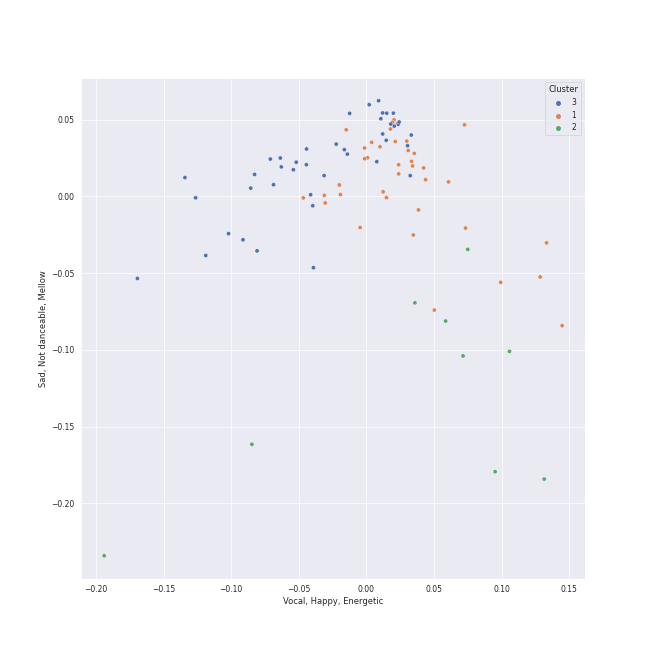

# Clusters in post-romantic era

## Cluster #1

39 tracks

| Art | Track | Album | Artists | Label | Rank | 💚 | 🔗 |
|:---|:---|:---|:---|:---|---:|:---|:---|
|  | Vespers, Op. 37: VII. "Slava v vyshnikh Bogu" | Rachmaninov: Vespers - All Night Vigil | Sergei Rachmaninoff, St.Petersburg Chamber Choir, Nikolai Korniev | [Decca Music Group Ltd.](../../../../labels/decca_music_group_ltd_) | nan | | [🔗](https://open.spotify.com/track/0op8XEiSF79zl5SSvPv5j2) |
|  | Vespers, Op. 37: XI. "Velichit dusha moya Gospoda" | Rachmaninov: Vespers - All Night Vigil | Sergei Rachmaninoff, St.Petersburg Chamber Choir, Nikolai Korniev | [Decca Music Group Ltd.](../../../../labels/decca_music_group_ltd_) | nan | | [🔗](https://open.spotify.com/track/32j8MnD2wyx1QQ3wRa6ytm) |
|  | Vespers, Op. 37: III. "Blazhen muzh" | Rachmaninov: Vespers - All Night Vigil | Sergei Rachmaninoff, St.Petersburg Chamber Choir, Nikolai Korniev | [Decca Music Group Ltd.](../../../../labels/decca_music_group_ltd_) | nan | | [🔗](https://open.spotify.com/track/4vOfTVbAp9oBxyko8covCb) |
|  | Piano Concerto No. 2 in C Minor, Op. 18: 2. Adagio sostenuto | Rachmaninov: Piano Concerto No.2 | Sergei Rachmaninoff, Valentina Lisitsa, [London Symphony Orchestra](../../../../artists/london_symphony_orchestra/overview.md), Michael Francis | [Decca Music Group Ltd.](../../../../labels/decca_music_group_ltd_) | nan | | [🔗](https://open.spotify.com/track/4rrrn8OLrttq7r9RgNXalU) |
|  | Piano Concerto No. 2 in C Minor, Op. 18: 1. Moderato | Rachmaninov: Piano Concerto No.2 | Sergei Rachmaninoff, Valentina Lisitsa, [London Symphony Orchestra](../../../../artists/london_symphony_orchestra/overview.md), Michael Francis | [Decca Music Group Ltd.](../../../../labels/decca_music_group_ltd_) | nan | | [🔗](https://open.spotify.com/track/6B1RtXteyMp3mJZTeuFRmE) |
|  | Requiem in D Minor, Op. 48: V. Agnus Dei | Fauré: Requiem; Pavane | Gabriel Fauré, Academy of St Martin in the Fields Chorus, Academy of St. Martin in the Fields, John Birch, Sir Neville Marriner | [Decca Music Group Ltd.](../../../../labels/decca_music_group_ltd_) | nan | | [🔗](https://open.spotify.com/track/0UHDXE1d9Up2mEbzLLsMjw) |
|  | Requiem in D Minor, Op. 48: IV. Pie Jesu | Fauré: Requiem; Pavane | Gabriel Fauré, Sylvia McNair, Academy of St. Martin in the Fields, John Birch, Sir Neville Marriner | [Decca Music Group Ltd.](../../../../labels/decca_music_group_ltd_) | nan | | [🔗](https://open.spotify.com/track/5tmTSjrwoiOacvGAZ8ZEGf) |
|  | Requiem in D Minor, Op. 48: I. Introitus. Requiem aeternam - Kyrie | Fauré: Requiem; Pavane | Gabriel Fauré, Academy of St Martin in the Fields Chorus, Academy of St. Martin in the Fields, John Birch, Sir Neville Marriner | [Decca Music Group Ltd.](../../../../labels/decca_music_group_ltd_) | nan | | [🔗](https://open.spotify.com/track/6BAU2mNOutm6sKu3daQGgt) |
|  | Requiem in D Minor, Op. 48: VI. Libera Me | Fauré: Requiem; Pavane | Gabriel Fauré, Thomas Allen, Academy of St Martin in the Fields Chorus, Academy of St. Martin in the Fields, John Birch, Sir Neville Marriner | [Decca Music Group Ltd.](../../../../labels/decca_music_group_ltd_) | nan | | [🔗](https://open.spotify.com/track/6nJrXbauUQtCV5TqIFrg0i) |
|  | La Mer, L.109: 3. Dialogue Of The Wind And The Sea | Debussy: La Mer; Jeux; Prélude à l'après-midi d'un faune; Le Martyre de Saint Sébastien (Symphonic Fragments) | Claude Debussy, Orchestre Symphonique de Montréal, Charles Dutoit | [Decca Music Group Ltd.](../../../../labels/decca_music_group_ltd_) | nan | | [🔗](https://open.spotify.com/track/49wWvRfrD7lABh3Rk4adg0) |
## Cluster #2

9 tracks

| Art | Track | Album | Artists | Label | Rank | 💚 | 🔗 |
|:---|:---|:---|:---|:---|---:|:---|:---|
|  | Vespers, Op. 37: IX. "Blagosloven esi, Gospodi" | Rachmaninov: Vespers - All Night Vigil | Sergei Rachmaninoff, St.Petersburg Chamber Choir, Nikolai Korniev | [Decca Music Group Ltd.](../../../../labels/decca_music_group_ltd_) | nan | | [🔗](https://open.spotify.com/track/0NfQexdy6BRC3O7W2LPqHl) |
|  | Vespers, Op. 37: X. "Voskreseniye Khristovo videvshe" | Rachmaninov: Vespers - All Night Vigil | Sergei Rachmaninoff, St.Petersburg Chamber Choir, Nikolai Korniev | [Decca Music Group Ltd.](../../../../labels/decca_music_group_ltd_) | nan | | [🔗](https://open.spotify.com/track/2rzp6tSZjlPxIjkcnKoV7a) |
|  | Vespers, Op. 37: II. "Blagoslovi dushe moya" | Rachmaninov: Vespers - All Night Vigil | Sergei Rachmaninoff, Olga Borodina, St.Petersburg Chamber Choir, Nikolai Korniev | [Decca Music Group Ltd.](../../../../labels/decca_music_group_ltd_) | nan | | [🔗](https://open.spotify.com/track/3tmb8PpSEsDXOPv2JxBAeJ) |
|  | Vespers, Op. 37: XV. "Vzbrannoy voevode" | Rachmaninov: Vespers - All Night Vigil | Sergei Rachmaninoff, St.Petersburg Chamber Choir, Nikolai Korniev | [Decca Music Group Ltd.](../../../../labels/decca_music_group_ltd_) | nan | | [🔗](https://open.spotify.com/track/5PSyFWOmtBCPwkAiAV770t) |
|  | Vespers, Op. 37: VIII. "Kvalite imya Gospodne" | Rachmaninov: Vespers - All Night Vigil | Sergei Rachmaninoff, St.Petersburg Chamber Choir, Nikolai Korniev | [Decca Music Group Ltd.](../../../../labels/decca_music_group_ltd_) | nan | | [🔗](https://open.spotify.com/track/79tPoVRNUdOSwM8ERRpx8m) |
|  | Images, Set 2, L. 111: et la Lune descend sur le Temple qui fut | Debussy: Clair De Lune and Other Piano Favourites | Claude Debussy, Martin Jones | [Nimbus Records](../../../../labels/nimbus_records) | nan | | [🔗](https://open.spotify.com/track/4uYqe6JOHty9Eu50ukMV3G) |
|  | Préludes Book 2, L. 123: III. Feux d'Artifice | Debussy: Clair De Lune and Other Piano Favourites | Claude Debussy, Martin Jones | [Nimbus Records](../../../../labels/nimbus_records) | nan | | [🔗](https://open.spotify.com/track/50W2AMW6hgDtv6MWyJfdPK) |
|  | Quatuor en Fa Majeur, M. 35: II. Assez vif, très rythmé | Debussy & Ravel: String Quartets | Maurice Ravel, [Jerusalem Quartet](../../../../artists/jerusalem_quartet/overview.md) | [harmonia mundi](../../../../labels/harmonia_mundi) | nan | | [🔗](https://open.spotify.com/track/766aJRX19tPpWsqp4n59xJ) |
|  | Carol of the Bells | Home Alone (Original Motion Picture Soundtrack) [Anniversary Edition] | Mykola Dmytrovych Leontovych, John Williams | Masterworks | 706 | | [🔗](https://open.spotify.com/track/4tHqQMWSqmL6YjXwsqthDI) |
## Cluster #3

41 tracks

| Art | Track | Album | Artists | Label | Rank | 💚 | 🔗 |
|:---|:---|:---|:---|:---|---:|:---|:---|
|  | 13 Preludes, Op. 32: No. 9 in A Major: Allegro moderato | Rachmaninov: Preludes for Piano (Complete) | Sergei Rachmaninoff, Eldar Nebolsin | [Naxos](../../../../labels/naxos) | nan | | [🔗](https://open.spotify.com/track/07EzJ4VrpLaQtTzKyOAH3w) |
|  | 10 Preludes, Op. 23: No. 3 in D Minor: Tempo di minuetto | Rachmaninov: Preludes for Piano (Complete) | Sergei Rachmaninoff, Eldar Nebolsin | [Naxos](../../../../labels/naxos) | nan | | [🔗](https://open.spotify.com/track/0LsNtrpdw7vz8ISVrQYMnM) |
|  | 10 Preludes, Op. 23: No. 5 in G Minor: Alla marcia | Rachmaninov: Preludes for Piano (Complete) | Sergei Rachmaninoff, Eldar Nebolsin | [Naxos](../../../../labels/naxos) | nan | | [🔗](https://open.spotify.com/track/0dwRX7z5Yzr1K96QhAKOBh) |
|  | 10 Preludes, Op. 23: No. 7 in C Minor: Allegro | Rachmaninov: Preludes for Piano (Complete) | Sergei Rachmaninoff, Eldar Nebolsin | [Naxos](../../../../labels/naxos) | nan | | [🔗](https://open.spotify.com/track/1BKKpyRblOv1OWjZ0CcAWo) |
|  | 10 Preludes, Op. 23: No. 6 in E-Flat Major: Andante | Rachmaninov: Preludes for Piano (Complete) | Sergei Rachmaninoff, Eldar Nebolsin | [Naxos](../../../../labels/naxos) | nan | | [🔗](https://open.spotify.com/track/4VH21d5xLD6DtFKcawuoXw) |
|  | 13 Preludes, Op. 32: No. 4 in E Minor: Allegro con brio | Rachmaninov: Preludes for Piano (Complete) | Sergei Rachmaninoff, Eldar Nebolsin | [Naxos](../../../../labels/naxos) | nan | | [🔗](https://open.spotify.com/track/5GjDNg9mTkPrqUfg6CI8Zc) |
|  | 13 Preludes, Op. 32: No. 11 in B Major: Allegretto | Rachmaninov: Preludes for Piano (Complete) | Sergei Rachmaninoff, Eldar Nebolsin | [Naxos](../../../../labels/naxos) | nan | | [🔗](https://open.spotify.com/track/5RrWiz8zrTJCjHENxHTAJZ) |
|  | Piano Concerto No. 2 in C Minor, Op. 18: 3. Allegro scherzando | Rachmaninov: Piano Concerto No.2 | Sergei Rachmaninoff, Valentina Lisitsa, [London Symphony Orchestra](../../../../artists/london_symphony_orchestra/overview.md), Michael Francis | [Decca Music Group Ltd.](../../../../labels/decca_music_group_ltd_) | nan | | [🔗](https://open.spotify.com/track/253y3nl2iT4vWs2jHP4G3q) |
|  | La Fille aux Cheveux de Lin, L. 33 | Debussy: Clair De Lune and Other Piano Favourites | Claude Debussy, Martin Jones | [Nimbus Records](../../../../labels/nimbus_records) | nan | | [🔗](https://open.spotify.com/track/0fpqOyC5DLDe5gAYKBB6X7) |
|  | Suite Bergamasque, L. 75: Passepied | Debussy: Clair De Lune and Other Piano Favourites | Claude Debussy, Martin Jones | [Nimbus Records](../../../../labels/nimbus_records) | nan | | [🔗](https://open.spotify.com/track/3GgKVPxhu0rxYpBXlBwPqw) |