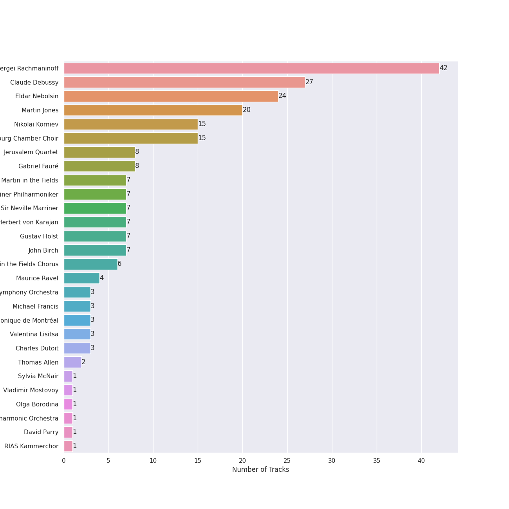
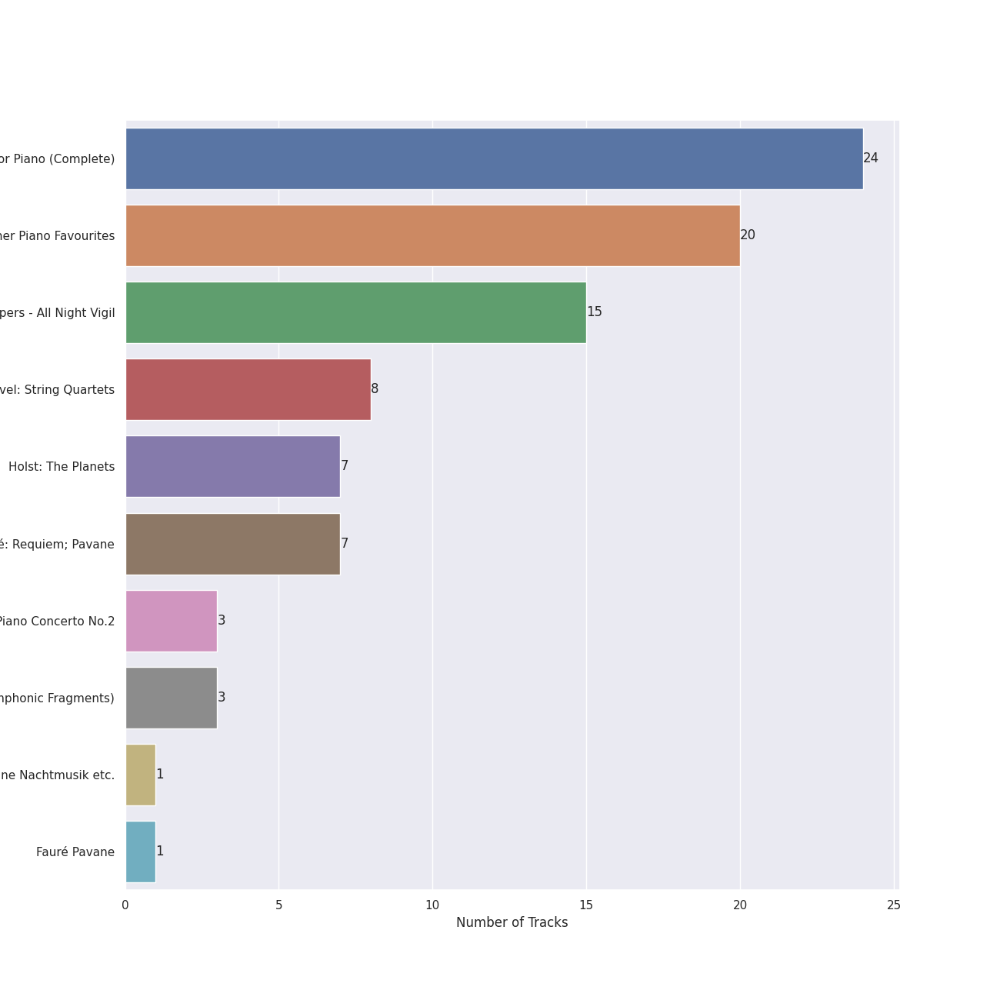
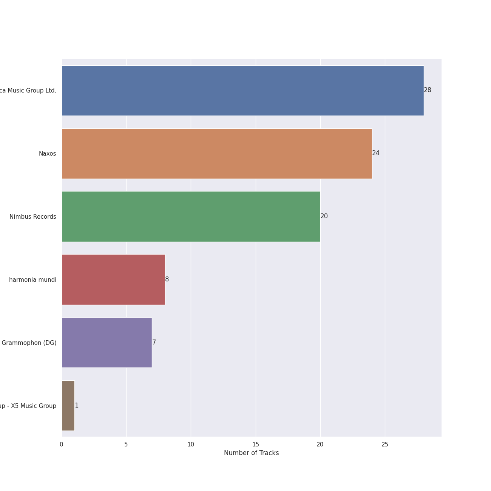

# post-romantic era

[88 songs](post_romantic_era_tracks.md)

## Top Artists

See all 28 artists

| Number of Tracks | Art | Artist | 🔗 |
|---:|:---|:---|:---|
| 42 |  | [Sergei Rachmaninoff](../artists/sergei_rachmaninoff.md) | [🔗](https://open.spotify.com/artist/0Kekt6CKSo0m5mivKcoH51) |
| 27 |  | [Claude Debussy](../artists/claude_debussy.md) | [🔗](https://open.spotify.com/artist/1Uff91EOsvd99rtAupatMP) |
| 24 |  | [Eldar Nebolsin](../artists/eldar_nebolsin.md) | [🔗](https://open.spotify.com/artist/45ts2AJTWlzJ9JrQlCGxpX) |
| 20 |  | [Martin Jones](../artists/martin_jones.md) | [🔗](https://open.spotify.com/artist/1VzJXXVXsYbEK773GWSoND) |
| 15 |  | [Nikolai Korniev](../artists/nikolai_korniev.md) | [🔗](https://open.spotify.com/artist/70hS9SnJefkZo2QJwS2VXi) |
| 15 |  | [St.Petersburg Chamber Choir](../artists/st_petersburg_chamber_choir.md) | [🔗](https://open.spotify.com/artist/46WjEugfIF0rKOewvFiby2) |
| 8 |  | [Jerusalem Quartet](../artists/jerusalem_quartet.md) | [🔗](https://open.spotify.com/artist/7AnE8Jpu1vxLeXcs6OKYHE) |
| 8 |  | Gabriel Fauré | [🔗](https://open.spotify.com/artist/2gClsBep1tt1rv1CN210SO) |
| 7 |  | [Academy of St. Martin in the Fields](../artists/academy_of_st__martin_in_the_fields.md) | [🔗](https://open.spotify.com/artist/77CaCn32H4mOMQA7UElzfF) |
| 7 |  | [Berliner Philharmoniker](../artists/berliner_philharmoniker.md) | [🔗](https://open.spotify.com/artist/6uRJnvQ3f8whVnmeoecv5Z) |
| 7 |  | [Sir Neville Marriner](../artists/sir_neville_marriner.md) | [🔗](https://open.spotify.com/artist/6NUhQz7eAEsZvjEHTKHux9) |
| 7 |  | [Herbert von Karajan](../artists/herbert_von_karajan.md) | [🔗](https://open.spotify.com/artist/5zCaQxjl110XTrm4LQ1CxY) |
| 7 |  | Gustav Holst | [🔗](https://open.spotify.com/artist/5B7uXBeLc2TkR5Jk23qKIZ) |
| 7 |  | John Birch | [🔗](https://open.spotify.com/artist/2TFBoJYsuvMuPMOlwXWbaE) |
| 6 |  | Academy of St Martin in the Fields Chorus | [🔗](https://open.spotify.com/artist/1GxYERY1PDh1dEuFqvTDa5) |
| 4 |  | Maurice Ravel | [🔗](https://open.spotify.com/artist/17hR0sYHpx7VYTMRfFUOmY) |
| 3 |  | [London Symphony Orchestra](../artists/london_symphony_orchestra.md) | [🔗](https://open.spotify.com/artist/5yxyJsFanEAuwSM5kOuZKc) |
| 3 |  | Michael Francis | [🔗](https://open.spotify.com/artist/4znpeZQkiPbcXtHlRbfTqF) |
| 3 |  | Orchestre Symphonique de Montréal | [🔗](https://open.spotify.com/artist/4AcXapei4U7xnWecv9AEBd) |
| 3 |  | Valentina Lisitsa | [🔗](https://open.spotify.com/artist/0gOrXuu1vCBXe3pwTyb5Ca) |
| 3 |  | Charles Dutoit | [🔗](https://open.spotify.com/artist/0Ku5VBNL7cfGXRhp2BxXEQ) |
| 2 |  | Thomas Allen | [🔗](https://open.spotify.com/artist/2SFBZgfO2H1nVSgjxzJLUy) |
| 1 |  | Sylvia McNair | [🔗](https://open.spotify.com/artist/63aSj4hbN7Q4nw74Y0xNF6) |
| 1 |  | Vladimir Mostovoy | [🔗](https://open.spotify.com/artist/4BTanscTBWJOSpvceZSVSi) |
| 1 |  | Olga Borodina | [🔗](https://open.spotify.com/artist/47XbXbNzwqcWStfsjzFlKb) |
| 1 |  | London Philharmonic Orchestra | [🔗](https://open.spotify.com/artist/3PfJE6ebCbCHeuqO4BfNeA) |
| 1 |  | David Parry | [🔗](https://open.spotify.com/artist/2dfDjeZroUd3LWmSFrAZCD) |
| 1 |  | RIAS Kammerchor | [🔗](https://open.spotify.com/artist/2UVXU77knJMYOM6Avvw6Yx) |

## Top Albums

See all 9 albums

| Number of Tracks | Art | Album | Release Date | 🔗 |
|---:|:---|:---|:---|:---|
| 24 |  | Rachmaninov: Preludes for Piano (Complete) | 2007-05-29 | [🔗](https://open.spotify.com/album/1vlnwUAidj7bEmRhsq4zTv) |
| 20 |  | Debussy: Clair De Lune and Other Piano Favourites | 1994 | [🔗](https://open.spotify.com/album/4O5tv6jrLH80bmll46xEEe) |
| 15 |  | Rachmaninov: Vespers - All Night Vigil | 1994 | [🔗](https://open.spotify.com/album/7hqotgNjEJt09XiggaMI1v) |
| 8 |  | Debussy & Ravel: String Quartets | 2018-05-25 | [🔗](https://open.spotify.com/album/77Eg2dHidrefgsS3GZ88nK) |
| 7 |  | Holst: The Planets | 1981-01-01 | [🔗](https://open.spotify.com/album/4v0Xyz0LVToUsSTGdsvKSK) |
| 7 |  | Fauré: Requiem; Pavane | 2008-01-01 | [🔗](https://open.spotify.com/album/0mhVHXJrGE5WUA58CJLf29) |
| 3 |  | Rachmaninov: Piano Concerto No.2 | 2012-01-01 | [🔗](https://open.spotify.com/album/5lVqgXqdoIH3W1wUM2hzPx) |
| 3 |  | Debussy: La Mer; Jeux; Prélude à l'après-midi d'un faune; Le Martyre de Saint Sébastien (Symphonic Fragments) | 1989-01-01 | [🔗](https://open.spotify.com/album/5egJ0o1mVH2liUfecDWYqk) |
| 1 |  | Fauré Pavane | 2020-05-30 | [🔗](https://open.spotify.com/album/0FaQ2LW8NNG3YXYJXFikJF) |

## Top Record Labels

See all 6 labels

| Number of Tracks | Label |
|---:|:---|
| 28 | [Decca Music Group Ltd.](../labels/decca_music_group_ltd_.md) |
| 24 | [Naxos](../labels/naxos.md) |
| 20 | [Nimbus Records](../labels/nimbus_records.md) |
| 8 | [harmonia mundi](../labels/harmonia_mundi.md) |
| 7 | [Deutsche Grammophon (DG)](../labels/deutsche_grammophon__dg_.md) |
| 1 | [Warner Music Group - X5 Music Group](../labels/warner_music_group___x5_music_group.md) |

## Audio Features

| 10 most Danceable tracks | 10 least Danceable tracks |
|:---|:---|
| Études, L. 136: II. Pour les Accords (0.464) | The Planets, Op. 32: 7. Neptune, the Mystic (0.0601) |
| 13 Preludes, Op. 32: No. 3 in E Major: Allegro vivace (0.437) | String Quartet in G Minor, Op. 10: III. Andantino, doucement expressif (0.0623) |
| 13 Preludes, Op. 32: No. 8 in A Minor: Vivo (0.428) | La Mer, L.109: 1. From Dawn Till Noon On The Sea (De l'aube à midi sur la mer) (0.0633) |
| Morceaux de fantaisie, Op. 3: No. 2, Prelude in C-Sharp Minor (0.423) | Vespers, Op. 37: XII. "Slava v vyshnikh Bogu" (0.0636) |
| 13 Preludes, Op. 32: No. 11 in B Major: Allegretto (0.414) | Requiem in D Minor, Op. 48: II. Offertorium. Domine Jesu Christe (0.0668) |
| 10 Preludes, Op. 23: No. 10 in G-Flat Major: Largo (0.414) | Vespers, Op. 37: V. "Nyne otpushchayeshi" (0.0806) |
| String Quartet in G Minor, Op. 10: II. Assez vif et bien rythmé (0.412) | The Planets, Op. 32: 2. Venus, the Bringer of Peace (0.0864) |
| Children's Corner, L. 113: III. Golliwogg's Cake-Walk (0.398) | La Mer, L.109: 3. Dialogue Of The Wind And The Sea (0.0986) |
| Préludes Book 1, L. 117: IV. Minstrels (0.389) | Vespers, Op. 37: IV. "Svete tikhyi" (0.103) |
| Préludes Book 1, L. 117: I. Des Pas sur La Neige (0.376) | Vespers, Op. 37: XIV. "Voskrez iz groba" (0.104) |

| 10 most Energetic tracks | 10 least Energetic tracks |
|:---|:---|
| Vespers, Op. 37: XV. "Vzbrannoy voevode" (0.488) | Préludes Book 1, L. 117: I. Des Pas sur La Neige (0.000594) |
| The Planets, Op. 32: 1. Mars, the Bringer of War (0.478) | Images, Set 2, L. 111: et la Lune descend sur le Temple qui fut (0.00104) |
| The Planets, Op. 32: 4. Jupiter, the Bringer of Jollity (0.297) | Préludes Book 2, L. 123: II. Canope (0.00148) |
| Vespers, Op. 37: VIII. "Kvalite imya Gospodne" (0.296) | La Fille aux Cheveux de Lin, L. 33 (0.00218) |
| The Planets, Op. 32: 6. Uranus, the Magician (0.294) | Préludes Book 1, L. 117: III. La Cathedrale Engloutie (0.00259) |
| 10 Preludes, Op. 23: No. 2 in B-Flat Major: Maestoso (0.272) | Clair de Lune, L. 32 (0.00532) |
| 13 Preludes, Op. 32: No. 3 in E Major: Allegro vivace (0.23) | 10 Preludes, Op. 23: No. 10 in G-Flat Major: Largo (0.00644) |
| String Quartet in G Minor, Op. 10: IV. Très modéré (0.224) | Images, Set 1, L. 110: Reflets dans L'eau (0.00658) |
| 13 Preludes, Op. 32: No. 1 in C Major: Allegro vivace (0.205) | The Planets, Op. 32: 7. Neptune, the Mystic (0.00757) |
| Quatuor en Fa Majeur, M. 35: IV. Vif et agité (0.188) | La Plus que Lente, L. 121 (0.00851) |

| 10 most Speechy tracks | 10 least Speechy tracks |
|:---|:---|
| Préludes Book 2, L. 123: II. Canope (0.0681) | 13 Preludes, Op. 32: No. 6 in F Minor: Allegro appassionato (0.0304) |
| Études, L. 136: II. Pour les Accords (0.0664) | 10 Preludes, Op. 23: No. 7 in C Minor: Allegro (0.0312) |
| Images, Set 2, L. 111: et la Lune descend sur le Temple qui fut (0.0663) | Préludes Book 1, L. 117: IV. Minstrels (0.0315) |
| The Planets, Op. 32: 6. Uranus, the Magician (0.0633) | 10 Preludes, Op. 23: No. 2 in B-Flat Major: Maestoso (0.0327) |
| 10 Preludes, Op. 23: No. 1 in F-Sharp Minor: Largo (0.0614) | 10 Preludes, Op. 23: No. 6 in E-Flat Major: Andante (0.0333) |
| Morceaux de fantaisie, Op. 3: No. 2, Prelude in C-Sharp Minor (0.0594) | Suite Bergamasque, L. 75: Passepied (0.0335) |
| 13 Preludes, Op. 32: No. 11 in B Major: Allegretto (0.0592) | Piano Concerto No. 2 in C Minor, Op. 18: 3. Allegro scherzando (0.0336) |
| Quatuor en Fa Majeur, M. 35: I. Allegro moderato (0.0584) | 10 Preludes, Op. 23: No. 3 in D Minor: Tempo di minuetto (0.034) |
| La Fille aux Cheveux de Lin, L. 33 (0.0543) | 13 Preludes, Op. 32: No. 1 in C Major: Allegro vivace (0.0348) |
| 13 Preludes, Op. 32: No. 10 in B Minor: Lento (0.0535) | 10 Preludes, Op. 23: No. 5 in G Minor: Alla marcia (0.0353) |

| 10 most Acoustic tracks | 10 least Acoustic tracks |
|:---|:---|
| Vespers, Op. 37: VIII. "Kvalite imya Gospodne" (0.995) | The Planets, Op. 32: 1. Mars, the Bringer of War (0.83) |
| 13 Preludes, Op. 32: No. 10 in B Minor: Lento (0.995) | La Mer, L.109: 3. Dialogue Of The Wind And The Sea (0.886) |
| La Plus que Lente, L. 121 (0.995) | The Planets, Op. 32: 6. Uranus, the Magician (0.899) |
| Vespers, Op. 37: XV. "Vzbrannoy voevode" (0.995) | La Mer, L.109: 1. From Dawn Till Noon On The Sea (De l'aube à midi sur la mer) (0.914) |
| 13 Preludes, Op. 32: No. 7 in F Major: Moderato (0.995) | The Planets, Op. 32: 7. Neptune, the Mystic (0.92) |
| Vespers, Op. 37: I. "Priidite, poklonimsya" (0.995) | Quatuor en Fa Majeur, M. 35: III. Très lent (0.921) |
| 10 Preludes, Op. 23: No. 1 in F-Sharp Minor: Largo (0.995) | The Planets, Op. 32: 4. Jupiter, the Bringer of Jollity (0.924) |
| 13 Preludes, Op. 32: No. 5 in G Major: Moderato (0.995) | String Quartet in G Minor, Op. 10: II. Assez vif et bien rythmé (0.925) |
| 13 Preludes, Op. 32: No. 2 in B-Flat Minor: Allegretto (0.995) | Quatuor en Fa Majeur, M. 35: II. Assez vif, très rythmé (0.927) |
| 10 Preludes, Op. 23: No. 10 in G-Flat Major: Largo (0.995) | The Planets, Op. 32: 5. Saturn, the Bringer of Old Age (0.929) |

| 10 most Instrumental tracks | 10 least Instrumental tracks |
|:---|:---|
| Vespers, Op. 37: XIV. "Voskrez iz groba" (0.98) | Vespers, Op. 37: II. "Blagoslovi dushe moya" (0.0731) |
| Vespers, Op. 37: VI. "Bogoroditse Devo" (0.979) | Vespers, Op. 37: XV. "Vzbrannoy voevode" (0.26) |
| Requiem in D Minor, Op. 48: VII. In Paradisum (0.971) | Quatuor en Fa Majeur, M. 35: II. Assez vif, très rythmé (0.326) |
| Requiem in D Minor, Op. 48: III. Sanctus (0.953) | Vespers, Op. 37: VIII. "Kvalite imya Gospodne" (0.352) |
| Estampes, L. 100: Jardins sous La Pluie (0.948) | Vespers, Op. 37: IX. "Blagosloven esi, Gospodi" (0.379) |
| Études, L. 136: I. Pour les Arpeges Composes (0.946) | Quatuor en Fa Majeur, M. 35: III. Très lent (0.404) |
| Children's Corner, L. 113: I. Doctor Gradus ad Parnassum (0.946) | Préludes Book 2, L. 123: III. Feux d'Artifice (0.435) |
| Piano Concerto No. 2 in C Minor, Op. 18: 2. Adagio sostenuto (0.945) | Vespers, Op. 37: X. "Voskreseniye Khristovo videvshe" (0.516) |
| La Fille aux Cheveux de Lin, L. 33 (0.945) | The Planets, Op. 32: 2. Venus, the Bringer of Peace (0.531) |
| 13 Preludes, Op. 32: No. 5 in G Major: Moderato (0.944) | Quatuor en Fa Majeur, M. 35: I. Allegro moderato (0.586) |

| 10 most Live tracks | 10 least Live tracks |
|:---|:---|
| The Planets, Op. 32: 4. Jupiter, the Bringer of Jollity (0.314) | 13 Preludes, Op. 32: No. 7 in F Major: Moderato (0.0533) |
| The Planets, Op. 32: 6. Uranus, the Magician (0.233) | Piano Concerto No. 2 in C Minor, Op. 18: 2. Adagio sostenuto (0.0551) |
| Children's Corner, L. 113: III. Golliwogg's Cake-Walk (0.192) | Préludes Book 2, L. 123: II. Canope (0.0553) |
| Quatuor en Fa Majeur, M. 35: IV. Vif et agité (0.19) | Requiem in D Minor, Op. 48: VII. In Paradisum (0.0565) |
| The Planets, Op. 32: 1. Mars, the Bringer of War (0.154) | Préludes Book 1, L. 117: I. Des Pas sur La Neige (0.0588) |
| Quatuor en Fa Majeur, M. 35: II. Assez vif, très rythmé (0.147) | Images, Set 2, L. 111: et la Lune descend sur le Temple qui fut (0.0589) |
| 10 Preludes, Op. 23: No. 9 in E-Flat Minor: Presto (0.145) | The Planets, Op. 32: 7. Neptune, the Mystic (0.0614) |
| Vespers, Op. 37: XIII. "Dnes spaseniye" (0.139) | Études, L. 136: II. Pour les Accords (0.0614) |
| Préludes Book 2, L. 123: I. General Lavine (0.137) | Clair de Lune, L. 32 (0.0621) |
| Quatuor en Fa Majeur, M. 35: III. Très lent (0.136) | Préludes Book 1, L. 117: III. La Cathedrale Engloutie (0.0627) |

| 10 most Happy tracks | 10 least Happy tracks |
|:---|:---|
| Children's Corner, L. 113: III. Golliwogg's Cake-Walk (0.414) | The Planets, Op. 32: 2. Venus, the Bringer of Peace (0.0301) |
| 13 Preludes, Op. 32: No. 3 in E Major: Allegro vivace (0.345) | The Planets, Op. 32: 7. Neptune, the Mystic (0.0305) |
| The Planets, Op. 32: 4. Jupiter, the Bringer of Jollity (0.279) | The Planets, Op. 32: 5. Saturn, the Bringer of Old Age (0.0316) |
| 13 Preludes, Op. 32: No. 8 in A Minor: Vivo (0.27) | String Quartet in G Minor, Op. 10: III. Andantino, doucement expressif (0.0317) |
| 10 Preludes, Op. 23: No. 2 in B-Flat Major: Maestoso (0.268) | Requiem in D Minor, Op. 48: I. Introitus. Requiem aeternam - Kyrie (0.0321) |
| String Quartet in G Minor, Op. 10: II. Assez vif et bien rythmé (0.24) | Préludes Book 2, L. 123: III. Feux d'Artifice (0.0327) |
| Préludes Book 2, L. 123: I. General Lavine (0.223) | Requiem in D Minor, Op. 48: IV. Pie Jesu (0.0329) |
| Préludes Book 1, L. 117: IV. Minstrels (0.215) | Vespers, Op. 37: IV. "Svete tikhyi" (0.0331) |
| 13 Preludes, Op. 32: No. 6 in F Minor: Allegro appassionato (0.209) | Images, Set 1, L. 110: Reflets dans L'eau (0.0331) |
| 10 Preludes, Op. 23: No. 9 in E-Flat Minor: Presto (0.203) | Préludes Book 1, L. 117: II. Ce qu'a vu Le Vent d'Ouest (0.0333) |
