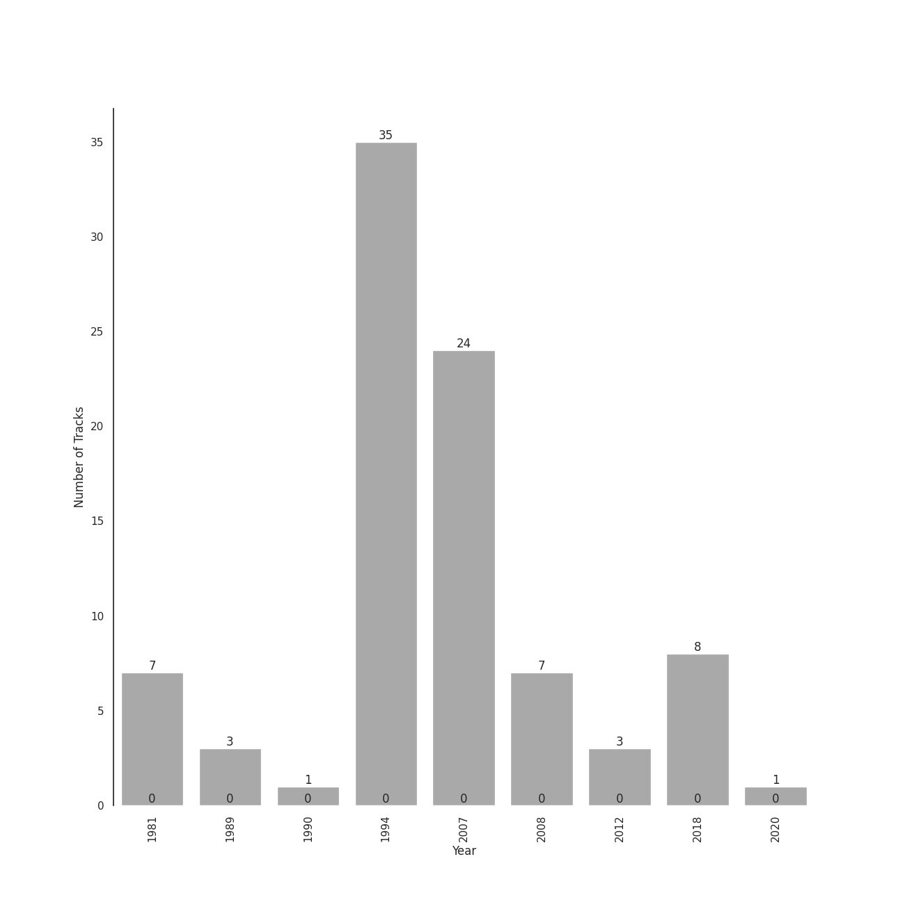

# post-romantic era

[89 songs](tracks.md)

[See Track Features](audio_features.md)

[See Clusters](clusters/overview.md)

## Top Artists

| Art | Tracks | 💚 | Artist | 🔗 |
|:---|---:|---:|:---|:---|
|  | 42 | 0 | Sergei Rachmaninoff | [🔗](https://open.spotify.com/artist/0Kekt6CKSo0m5mivKcoH51) |
|  | 27 | 0 | Claude Debussy | [🔗](https://open.spotify.com/artist/1Uff91EOsvd99rtAupatMP) |
|  | 24 | 0 | Eldar Nebolsin | [🔗](https://open.spotify.com/artist/45ts2AJTWlzJ9JrQlCGxpX) |
|  | 20 | 0 | Martin Jones | [🔗](https://open.spotify.com/artist/1VzJXXVXsYbEK773GWSoND) |
|  | 15 | 0 | Nikolai Korniev | [🔗](https://open.spotify.com/artist/70hS9SnJefkZo2QJwS2VXi) |
|  | 15 | 0 | St.Petersburg Chamber Choir | [🔗](https://open.spotify.com/artist/46WjEugfIF0rKOewvFiby2) |
|  | 8 | 0 | [Jerusalem Quartet](../../artists/jerusalem_quartet/overview.md) | [🔗](https://open.spotify.com/artist/7AnE8Jpu1vxLeXcs6OKYHE) |
|  | 8 | 0 | Gabriel Fauré | [🔗](https://open.spotify.com/artist/2gClsBep1tt1rv1CN210SO) |
|  | 7 | 0 | Academy of St. Martin in the Fields | [🔗](https://open.spotify.com/artist/77CaCn32H4mOMQA7UElzfF) |
|  | 7 | 0 | [Berliner Philharmoniker](../../artists/berliner_philharmoniker/overview.md) | [🔗](https://open.spotify.com/artist/6uRJnvQ3f8whVnmeoecv5Z) |

See all 30 artists

| Art | Tracks | 💚 | Artist | 🔗 |
|:---|---:|---:|:---|:---|
|  | 7 | 0 | Sir Neville Marriner | [🔗](https://open.spotify.com/artist/6NUhQz7eAEsZvjEHTKHux9) |
|  | 7 | 0 | [Herbert von Karajan](../../artists/herbert_von_karajan/overview.md) | [🔗](https://open.spotify.com/artist/5zCaQxjl110XTrm4LQ1CxY) |
|  | 7 | 0 | Gustav Holst | [🔗](https://open.spotify.com/artist/5B7uXBeLc2TkR5Jk23qKIZ) |
|  | 7 | 0 | John Birch | [🔗](https://open.spotify.com/artist/2TFBoJYsuvMuPMOlwXWbaE) |
|  | 6 | 0 | Academy of St Martin in the Fields Chorus | [🔗](https://open.spotify.com/artist/1GxYERY1PDh1dEuFqvTDa5) |
|  | 4 | 0 | Maurice Ravel | [🔗](https://open.spotify.com/artist/17hR0sYHpx7VYTMRfFUOmY) |
|  | 3 | 0 | London Symphony Orchestra | [🔗](https://open.spotify.com/artist/5yxyJsFanEAuwSM5kOuZKc) |
|  | 3 | 0 | Michael Francis | [🔗](https://open.spotify.com/artist/4znpeZQkiPbcXtHlRbfTqF) |
|  | 3 | 0 | Orchestre Symphonique de Montréal | [🔗](https://open.spotify.com/artist/4AcXapei4U7xnWecv9AEBd) |
|  | 3 | 0 | Valentina Lisitsa | [🔗](https://open.spotify.com/artist/0gOrXuu1vCBXe3pwTyb5Ca) |
|  | 3 | 0 | Charles Dutoit | [🔗](https://open.spotify.com/artist/0Ku5VBNL7cfGXRhp2BxXEQ) |
|  | 2 | 0 | Thomas Allen | [🔗](https://open.spotify.com/artist/2SFBZgfO2H1nVSgjxzJLUy) |
|  | 1 | 0 | Mykola Dmytrovych Leontovych | [🔗](https://open.spotify.com/artist/6lBN3Tzt61u8i9AJoAhKzF) |
|  | 1 | 0 | Sylvia McNair | [🔗](https://open.spotify.com/artist/63aSj4hbN7Q4nw74Y0xNF6) |
|  | 1 | 0 | Vladimir Mostovoy | [🔗](https://open.spotify.com/artist/4BTanscTBWJOSpvceZSVSi) |
|  | 1 | 0 | Olga Borodina | [🔗](https://open.spotify.com/artist/47XbXbNzwqcWStfsjzFlKb) |
|  | 1 | 0 | John Williams | [🔗](https://open.spotify.com/artist/3dRfiJ2650SZu6GbydcHNb) |
|  | 1 | 0 | London Philharmonic Orchestra | [🔗](https://open.spotify.com/artist/3PfJE6ebCbCHeuqO4BfNeA) |
|  | 1 | 0 | David Parry | [🔗](https://open.spotify.com/artist/2dfDjeZroUd3LWmSFrAZCD) |
|  | 1 | 0 | RIAS Kammerchor | [🔗](https://open.spotify.com/artist/2UVXU77knJMYOM6Avvw6Yx) |

## Top Albums

| Art | Tracks | 💚 | Album | Release Date | 🔗 |
|:---|---:|---:|:---|:---|:---|
|  | 24 | 0 | Rachmaninov: Preludes for Piano (Complete) | 2007-05-29 | [🔗](https://open.spotify.com/album/1vlnwUAidj7bEmRhsq4zTv) |
|  | 20 | 0 | Debussy: Clair De Lune and Other Piano Favourites | 1994 | [🔗](https://open.spotify.com/album/4O5tv6jrLH80bmll46xEEe) |
|  | 15 | 0 | Rachmaninov: Vespers - All Night Vigil | 1994 | [🔗](https://open.spotify.com/album/7hqotgNjEJt09XiggaMI1v) |
|  | 8 | 0 | Debussy & Ravel: String Quartets | 2018-05-25 | [🔗](https://open.spotify.com/album/77Eg2dHidrefgsS3GZ88nK) |
|  | 7 | 0 | Holst: The Planets | 1981-01-01 | [🔗](https://open.spotify.com/album/4v0Xyz0LVToUsSTGdsvKSK) |
|  | 7 | 0 | Fauré: Requiem; Pavane | 2008-01-01 | [🔗](https://open.spotify.com/album/0mhVHXJrGE5WUA58CJLf29) |
|  | 3 | 0 | Rachmaninov: Piano Concerto No.2 | 2012-01-01 | [🔗](https://open.spotify.com/album/5lVqgXqdoIH3W1wUM2hzPx) |
|  | 3 | 0 | Debussy: La Mer; Jeux; Prélude à l'après-midi d'un faune; Le Martyre de Saint Sébastien (Symphonic Fragments) | 1989-01-01 | [🔗](https://open.spotify.com/album/5egJ0o1mVH2liUfecDWYqk) |
|  | 1 | 0 | Home Alone (Original Motion Picture Soundtrack) [Anniversary Edition] | 1990 | [🔗](https://open.spotify.com/album/3rDo7fQDUwJ6qmxwP5yQsY) |
|  | 1 | 0 | Fauré Pavane | 2020-05-30 | [🔗](https://open.spotify.com/album/0FaQ2LW8NNG3YXYJXFikJF) |

## Top Record Labels

| Tracks | 💚 | Label |
|---:|---:|:---|
| 28 | 0 | [Decca Music Group Ltd.](../../labels/decca_music_group_ltd_/overview.md) |
| 24 | 0 | [Naxos](../../labels/naxos/overview.md) |
| 20 | 0 | [Nimbus Records](../../labels/nimbus_records/overview.md) |
| 8 | 0 | [harmonia mundi](../../labels/harmonia_mundi/overview.md) |
| 7 | 0 | [Deutsche Grammophon (DG)](../../labels/deutsche_grammophon__dg_/overview.md) |
| 1 | 0 | [Warner Music Group - X5 Music Group](../../labels/warner_music_group___x5_music_group/overview.md) |
| 1 | 0 | Masterworks |

## Years

| ​ | 10 newest albums | ​​ | 10 oldest albums |
|:---|:---|:---|:---|
|  | Fauré Pavane (2020-05-30) |  | Holst: The Planets (1981-01-01) |
|  | Debussy & Ravel: String Quartets (2018-05-25) |  | Debussy: La Mer; Jeux; Prélude à l'après-midi d'un faune; Le Martyre de Saint Sébastien (Symphonic Fragments) (1989-01-01) |
|  | Rachmaninov: Piano Concerto No.2 (2012-01-01) |  | Home Alone (Original Motion Picture Soundtrack) [Anniversary Edition] (1990) |
|  | Fauré: Requiem; Pavane (2008-01-01) |  | Debussy: Clair De Lune and Other Piano Favourites (1994) |
|  | Rachmaninov: Preludes for Piano (Complete) (2007-05-29) |  | Rachmaninov: Vespers - All Night Vigil (1994) |
|  | Debussy: Clair De Lune and Other Piano Favourites (1994) |  | Rachmaninov: Preludes for Piano (Complete) (2007-05-29) |
|  | Rachmaninov: Vespers - All Night Vigil (1994) |  | Fauré: Requiem; Pavane (2008-01-01) |
|  | Home Alone (Original Motion Picture Soundtrack) [Anniversary Edition] (1990) |  | Rachmaninov: Piano Concerto No.2 (2012-01-01) |
|  | Debussy: La Mer; Jeux; Prélude à l'après-midi d'un faune; Le Martyre de Saint Sébastien (Symphonic Fragments) (1989-01-01) |  | Debussy & Ravel: String Quartets (2018-05-25) |
|  | Holst: The Planets (1981-01-01) |  | Fauré Pavane (2020-05-30) |

