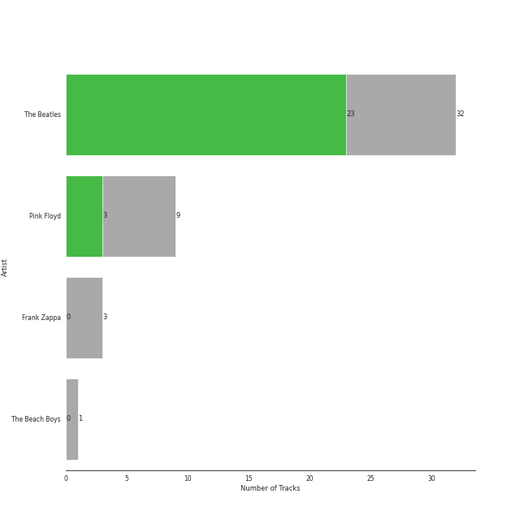
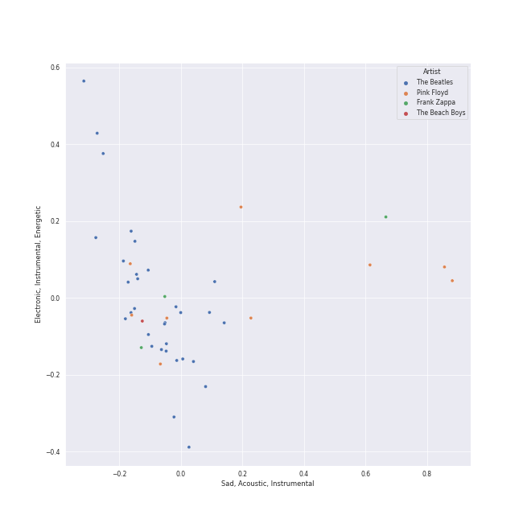
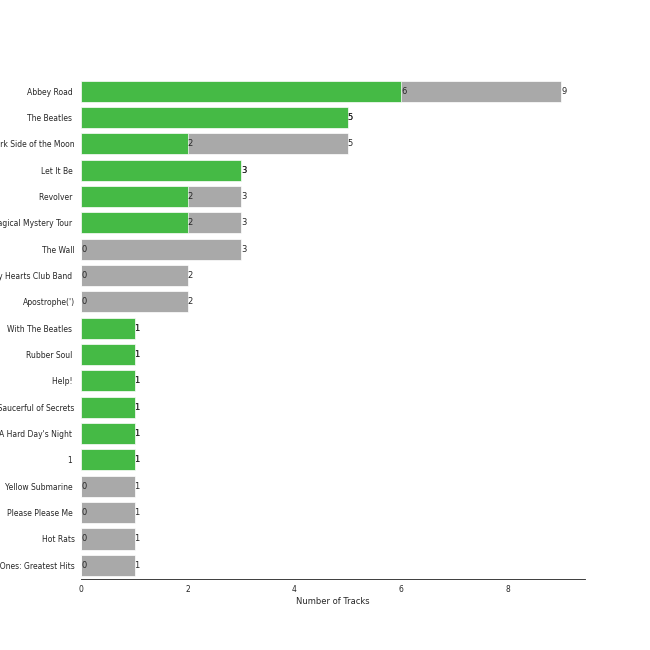

# psychedelic rock

[41 songs](psychedelic_rock_tracks.md)

## Top Artists

See all 5 artists

| Number of Tracks | Art | Artist | 🔗 |
|---:|:---|:---|:---|
| 31 |  | [The Beatles](../artists/the_beatles.md) | [🔗](https://open.spotify.com/artist/3WrFJ7ztbogyGnTHbHJFl2) |
| 6 |  | The Who | [🔗](https://open.spotify.com/artist/67ea9eGLXYMsO2eYQRui3w) |
| 2 |  | The Monkees | [🔗](https://open.spotify.com/artist/320EPCSEezHt1rtbfwH6Ck) |
| 1 |  | Steve Miller Band | [🔗](https://open.spotify.com/artist/6QtGlUje9TIkLrgPZrESuk) |
| 1 |  | Deep Purple | [🔗](https://open.spotify.com/artist/568ZhdwyaiCyOGJRtNYhWf) |

## Top Albums

See all 22 albums

| Number of Tracks | Art | Album | Release Date | 🔗 |
|---:|:---|:---|:---|:---|
| 9 |  | Abbey Road (Remastered) | 1969-09-26 | [🔗](https://open.spotify.com/album/0ETFjACtuP2ADo6LFhL6HN) |
| 5 |  | The Beatles (Remastered) | 1968-11-22 | [🔗](https://open.spotify.com/album/1klALx0u4AavZNEvC4LrTL) |
| 3 |  | Revolver (Remastered) | 1966-08-05 | [🔗](https://open.spotify.com/album/3PRoXYsngSwjEQWR5PsHWR) |
| 3 |  | Magical Mystery Tour (Remastered) | 1967-11-27 | [🔗](https://open.spotify.com/album/2BtE7qm1qzM80p9vLSiXkj) |
| 3 |  | Let It Be (Remastered) | 1970-05-08 | [🔗](https://open.spotify.com/album/0jTGHV5xqHPvEcwL8f6YU5) |
| 2 |  | Who's Next (Deluxe Edition) | 1971-08-14 | [🔗](https://open.spotify.com/album/5MqyhhHbT13zsloD3uHhlQ) |
| 1 |  | Yellow Submarine (Remastered) | 1969-01-17 | [🔗](https://open.spotify.com/album/1gKZ5A1ndFqbcrWtW85cCy) |
| 1 |  | With The Beatles (Remastered) | 1963-11-22 | [🔗](https://open.spotify.com/album/1aYdiJk6XKeHWGO3FzHHTr) |
| 1 |  | Who's Next (Expanded Edition) | 1971-08-14 | [🔗](https://open.spotify.com/album/53PBYiedQrASAs5sy63JqT) |
| 1 |  | Who Are You | 1978-08-18 | [🔗](https://open.spotify.com/album/7at3CV9Y9P57wsEXkfU0q8) |
| 1 |  | Tommy | 1969-05-23 | [🔗](https://open.spotify.com/album/5cT7ee1sy2oEbFalP4asS4) |
| 1 |  | The Joker | 1973-01-01 | [🔗](https://open.spotify.com/album/5uYNj1HkZrWKAkhEYcGmJr) |
| 1 |  | The Birds, The Bees, & The Monkees | 1968-04-22 | [🔗](https://open.spotify.com/album/2Ov6zb7NfgDh3EXSIIWrb2) |
| 1 |  | Sgt. Pepper's Lonely Hearts Club Band (Remastered) | 1967-06-01 | [🔗](https://open.spotify.com/album/6QaVfG1pHYl1z15ZxkvVDW) |
| 1 |  | Rubber Soul (Remastered) | 1965-12-03 | [🔗](https://open.spotify.com/album/50o7kf2wLwVmOTVYJOTplm) |
| 1 |  | Please Please Me (Remastered) | 1963-03-22 | [🔗](https://open.spotify.com/album/3KzAvEXcqJKBF97HrXwlgf) |
| 1 |  | My Generation (Stereo Version) | 1965-12-03 | [🔗](https://open.spotify.com/album/6Oc6Ok1Oawu8lRkjmD4mXy) |
| 1 |  | More of The Monkees (Deluxe Edition) | 1967-01-09 | [🔗](https://open.spotify.com/album/50zHjIiTOZM232gnWvOydX) |
| 1 |  | Machine Head | 1972-03-25 | [🔗](https://open.spotify.com/album/1EK3a0Yctg4d3nGQzE4Uty) |
| 1 |  | Help! (Remastered) | 1965-08-06 | [🔗](https://open.spotify.com/album/0PT5m6hwPRrpBwIHVnvbFX) |
| 1 |  | A Hard Day's Night (Remastered) | 1964-07-10 | [🔗](https://open.spotify.com/album/6wCttLq0ADzkPgtRnUihLV) |
| 1 |  | 1 (Remastered) | 2000-11-13 | [🔗](https://open.spotify.com/album/7vEJAtP3KgKSpOHVgwm3Eh) |

## Top Record Labels

See all 7 labels

| Number of Tracks | Label |
|---:|:---|
| 30 | [EMI Catalogue](../labels/emi_catalogue.md) |
| 3 | [Rhino](../labels/rhino.md) |
| 3 | Geffen |
| 2 | [UMC (Universal Music Catalogue)](../labels/umc__universal_music_catalogue_.md) |
| 2 | [Polydor Records](../labels/polydor_records.md) |
| 1 | [Warner Records](../labels/warner_records.md) |
| 1 | CAPITOL CATALOG MKT (C92) |

## Audio Features

| 10 most Danceable tracks | 10 least Danceable tracks |
|:---|:---|
| Get Back - Remastered 2009 (0.761) | Across The Universe - Remastered 2009 (0.257) |
| When I'm Sixty Four - Remastered 2009 (0.704) | Because - Remastered 2009 (0.328) |
| Won't Get Fooled Again - Remix (0.702) | Yesterday - Remastered 2009 (0.332) |
| Blackbird - Remastered 2009 (0.686) | You Never Give Me Your Money - Remastered 2009 (0.335) |
| Day Tripper - Remastered 2015 (0.665) | I Want You (She's So Heavy) - Remastered 2009 (0.37) |
| Who Are You (0.651) | Revolution 1 - Remastered 2009 (0.386) |
| Penny Lane - Remastered 2009 (0.651) | Dear Prudence - Remastered 2009 (0.388) |
| Smoke on the Water (0.632) | Strawberry Fields Forever - Remastered 2009 (0.39) |
| Octopus's Garden - Remastered 2009 (0.626) | Behind Blue Eyes (0.394) |
| Yellow Submarine - Remastered 2009 (0.604) | Something - Remastered 2009 (0.396) |

| 10 most Energetic tracks | 10 least Energetic tracks |
|:---|:---|
| Won't Get Fooled Again - Remix (0.841) | Blackbird - Remastered 2009 (0.127) |
| Love Me Do - Remastered 2009 (0.829) | Golden Slumbers - Remastered 2009 (0.152) |
| A Hard Day's Night - Remastered 2009 (0.805) | Yesterday - Remastered 2009 (0.179) |
| My Generation - Stereo Version (0.782) | When I'm Sixty Four - Remastered 2009 (0.241) |
| Day Tripper - Remastered 2015 (0.782) | Because - Remastered 2009 (0.249) |
| I'm a Believer - 2006 Remaster (0.775) | Eleanor Rigby - Remastered 2009 (0.28) |
| Baba O'Riley (0.724) | Something - Remastered 2009 (0.338) |
| Pinball Wizard (0.715) | Norwegian Wood (This Bird Has Flown) - Remastered 2009 (0.369) |
| Oh! Darling - Remastered 2009 (0.656) | Come Together - Remastered 2009 (0.376) |
| While My Guitar Gently Weeps - Remastered 2009 (0.654) | Let It Be - Remastered 2009 (0.403) |

| 10 most Speechy tracks | 10 least Speechy tracks |
|:---|:---|
| Strawberry Fields Forever - Remastered 2009 (0.178) | Octopus's Garden - Remastered 2009 (0.0247) |
| Love Me Do - Remastered 2009 (0.0806) | Because - Remastered 2009 (0.0272) |
| Get Back - Remastered 2009 (0.0586) | Carry That Weight - Remastered 2009 (0.0274) |
| My Generation - Stereo Version (0.058) | Golden Slumbers - Remastered 2009 (0.0277) |
| I Am The Walrus - Remastered 2009 (0.0513) | Smoke on the Water (0.0284) |
| Who Are You (0.0501) | Sexy Sadie - Remastered 2009 (0.0285) |
| When I'm Sixty Four - Remastered 2009 (0.0476) | Across The Universe - Remastered 2009 (0.0287) |
| Won't Get Fooled Again - Remix (0.045) | All You Need Is Love - Remastered 2009 (0.0288) |
| Dear Prudence - Remastered 2009 (0.0436) | All My Loving - Remastered 2009 (0.0298) |
| Oh! Darling - Remastered 2009 (0.0397) | Got To Get You Into My Life - Remastered 2009 (0.0302) |

| 10 most Acoustic tracks | 10 least Acoustic tracks |
|:---|:---|
| Eleanor Rigby - Remastered 2009 (0.936) | Oh! Darling - Remastered 2009 (0.0126) |
| Yesterday - Remastered 2009 (0.879) | Pinball Wizard (0.0192) |
| Blackbird - Remastered 2009 (0.754) | While My Guitar Gently Weeps - Remastered 2009 (0.0205) |
| Because - Remastered 2009 (0.754) | I Want You (She's So Heavy) - Remastered 2009 (0.0233) |
| I'm a Believer - 2006 Remaster (0.707) | Come Together - Remastered 2009 (0.0302) |
| Let It Be - Remastered 2009 (0.631) | Revolution 1 - Remastered 2009 (0.0785) |
| When I'm Sixty Four - Remastered 2009 (0.625) | I Am The Walrus - Remastered 2009 (0.0828) |
| Yellow Submarine - Remastered 2009 (0.531) | Smoke on the Water (0.0983) |
| Get Back - Remastered 2009 (0.492) | Day Tripper - Remastered 2015 (0.12) |
| Got To Get You Into My Life - Remastered 2009 (0.42) | A Hard Day's Night - Remastered 2009 (0.137) |

| 10 most Instrumental tracks | 10 least Instrumental tracks |
|:---|:---|
| Smoke on the Water (0.581) | Yesterday - Remastered 2009 (0.0) |
| Come Together - Remastered 2009 (0.248) | All My Loving - Remastered 2009 (0.0) |
| Won't Get Fooled Again - Remix (0.235) | Yellow Submarine - Remastered 2009 (0.0) |
| I Want You (She's So Heavy) - Remastered 2009 (0.205) | A Hard Day's Night - Remastered 2009 (0.0) |
| Baba O'Riley (0.185) | Pinball Wizard (0.0) |
| You Never Give Me Your Money - Remastered 2009 (0.136) | Let It Be - Remastered 2009 (0.0) |
| Dear Prudence - Remastered 2009 (0.0681) | Daydream Believer (0.0) |
| Oh! Darling - Remastered 2009 (0.0279) | Something - Remastered 2009 (2.62e-06) |
| Penny Lane - Remastered 2009 (0.026) | Day Tripper - Remastered 2015 (4.19e-06) |
| My Generation - Stereo Version (0.00822) | The Joker (5.3e-06) |

| 10 most Live tracks | 10 least Live tracks |
|:---|:---|
| Revolution 1 - Remastered 2009 (0.621) | Smoke on the Water (0.0535) |
| Get Back - Remastered 2009 (0.61) | Blackbird - Remastered 2009 (0.0573) |
| I Am The Walrus - Remastered 2009 (0.589) | Won't Get Fooled Again - Remix (0.0584) |
| Yellow Submarine - Remastered 2009 (0.438) | Who Are You (0.0655) |
| All My Loving - Remastered 2009 (0.343) | Across The Universe - Remastered 2009 (0.0702) |
| Eleanor Rigby - Remastered 2009 (0.305) | Strawberry Fields Forever - Remastered 2009 (0.0713) |
| Carry That Weight - Remastered 2009 (0.298) | My Generation - Stereo Version (0.0775) |
| Baba O'Riley (0.287) | Got To Get You Into My Life - Remastered 2009 (0.0838) |
| All You Need Is Love - Remastered 2009 (0.286) | When I'm Sixty Four - Remastered 2009 (0.0868) |
| Oh! Darling - Remastered 2009 (0.268) | Yesterday - Remastered 2009 (0.0886) |

| 10 most Happy tracks | 10 least Happy tracks |
|:---|:---|
| I'm a Believer - 2006 Remaster (0.962) | Baba O'Riley (0.15) |
| All My Loving - Remastered 2009 (0.9) | Because - Remastered 2009 (0.162) |
| Smoke on the Water (0.89) | Come Together - Remastered 2009 (0.187) |
| Across The Universe - Remastered 2009 (0.858) | You Never Give Me Your Money - Remastered 2009 (0.223) |
| Eleanor Rigby - Remastered 2009 (0.813) | Golden Slumbers - Remastered 2009 (0.239) |
| A Hard Day's Night - Remastered 2009 (0.797) | Won't Get Fooled Again - Remix (0.271) |
| The Joker (0.796) | Strawberry Fields Forever - Remastered 2009 (0.289) |
| Love Me Do - Remastered 2009 (0.744) | Yesterday - Remastered 2009 (0.315) |
| Day Tripper - Remastered 2015 (0.731) | Get Back - Remastered 2009 (0.332) |
| Octopus's Garden - Remastered 2009 (0.73) | Dear Prudence - Remastered 2009 (0.332) |
