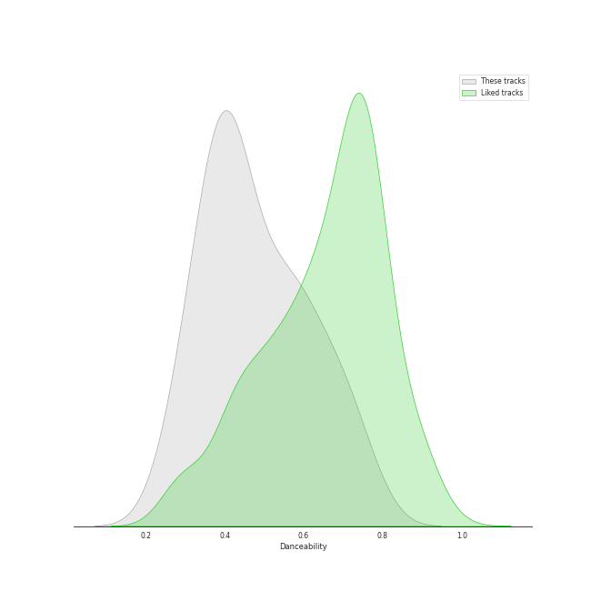
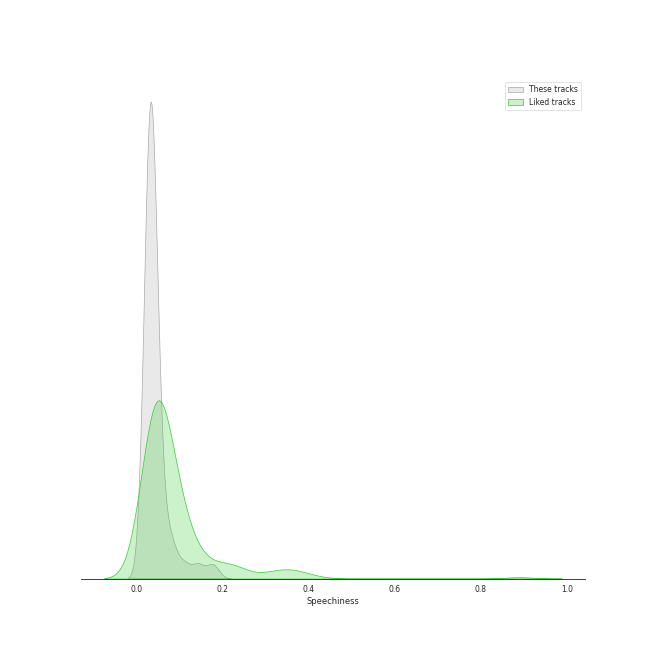
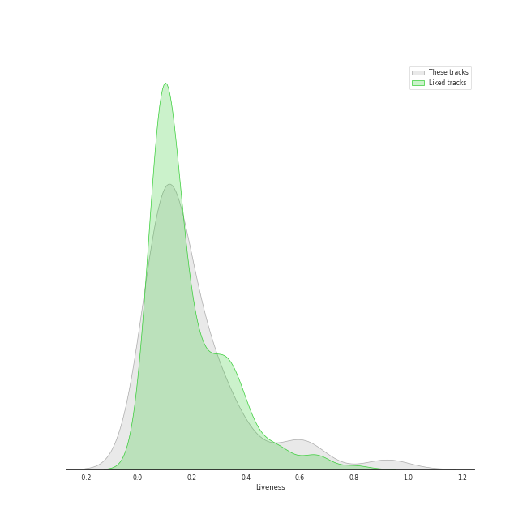
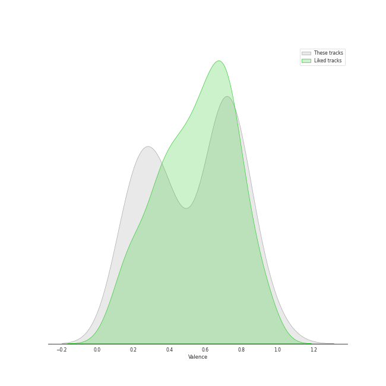
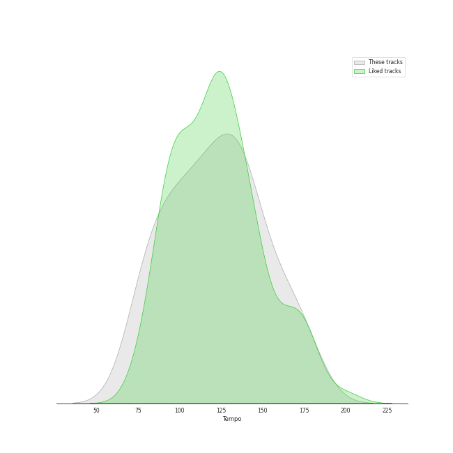

# Audio Features for psychedelic rock

## Danceability

| 10 most Danceable tracks | 10 least Danceable tracks |
|:---|:---|
| Get Back - Remastered 2009 (0.761) | Across The Universe - Remastered 2009 (0.257) |
| Don't Eat The Yellow Snow (0.747) | Shine On You Crazy Diamond (Pts. 1-5) (0.264) |
| When I'm Sixty Four - Remastered 2009 (0.704) | The Great Gig in the Sky (0.274) |
| Another Brick in the Wall, Pt. 2 (0.693) | Set the Controls for the Heart of the Sun (0.297) |
| Blackbird - Remastered 2009 (0.686) | Brain Damage (0.324) |
| Day Tripper - Remastered 2015 (0.665) | Because - Remastered 2009 (0.328) |
| Penny Lane - Remastered 2009 (0.651) | Yesterday - Remastered 2009 (0.332) |
| Octopus's Garden - Remastered 2009 (0.626) | You Never Give Me Your Money - Remastered 2009 (0.335) |
| Yellow Submarine - Remastered 2009 (0.604) | Time (0.359) |
| Bobby Brown Goes Down (0.594) | I Want You (She's So Heavy) - Remastered 2009 (0.37) |

## Energy

| 10 most Energetic tracks | 10 least Energetic tracks |
|:---|:---|
| Love Me Do - Remastered 2009 (0.829) | Blackbird - Remastered 2009 (0.127) |
| A Hard Day's Night - Remastered 2009 (0.805) | Golden Slumbers - Remastered 2009 (0.152) |
| Day Tripper - Remastered 2015 (0.782) | Yesterday - Remastered 2009 (0.179) |
| Peaches En Regalia (0.689) | The Great Gig in the Sky (0.217) |
| Don't Eat The Yellow Snow (0.672) | When I'm Sixty Four - Remastered 2009 (0.241) |
| Uncle Remus (0.66) | Because - Remastered 2009 (0.249) |
| Oh! Darling - Remastered 2009 (0.656) | Brain Damage (0.265) |
| While My Guitar Gently Weeps - Remastered 2009 (0.654) | Eleanor Rigby - Remastered 2009 (0.28) |
| Revolution 1 - Remastered 2009 (0.626) | Shine On You Crazy Diamond (Pts. 1-5) (0.294) |
| Sexy Sadie - Remastered 2009 (0.624) | Hey You (0.302) |

## Speechiness

| 10 most Speechy tracks | 10 least Speechy tracks |
|:---|:---|
| Strawberry Fields Forever - Remastered 2009 (0.178) | Octopus's Garden - Remastered 2009 (0.0247) |
| Bobby Brown Goes Down (0.175) | Because - Remastered 2009 (0.0272) |
| Money (0.144) | Carry That Weight - Remastered 2009 (0.0274) |
| Don't Eat The Yellow Snow (0.112) | Golden Slumbers - Remastered 2009 (0.0277) |
| Time (0.0841) | Shine On You Crazy Diamond (Pts. 1-5) (0.028) |
| Love Me Do - Remastered 2009 (0.0806) | Sexy Sadie - Remastered 2009 (0.0285) |
| Get Back - Remastered 2009 (0.0586) | Comfortably Numb (0.0286) |
| I Am The Walrus - Remastered 2009 (0.0513) | Across The Universe - Remastered 2009 (0.0287) |
| Set the Controls for the Heart of the Sun (0.0482) | All You Need Is Love - Remastered 2009 (0.0288) |
| When I'm Sixty Four - Remastered 2009 (0.0476) | Hey You (0.0293) |

## Acousticness

| 10 most Acoustic tracks | 10 least Acoustic tracks |
|:---|:---|
| Eleanor Rigby - Remastered 2009 (0.936) | Oh! Darling - Remastered 2009 (0.0126) |
| Yesterday - Remastered 2009 (0.879) | While My Guitar Gently Weeps - Remastered 2009 (0.0205) |
| Shine On You Crazy Diamond (Pts. 1-5) (0.772) | I Want You (She's So Heavy) - Remastered 2009 (0.0233) |
| The Great Gig in the Sky (0.767) | Money (0.024) |
| Blackbird - Remastered 2009 (0.754) | Come Together - Remastered 2009 (0.0302) |
| Because - Remastered 2009 (0.754) | Uncle Remus (0.034) |
| Set the Controls for the Heart of the Sun (0.673) | Brain Damage (0.0732) |
| Let It Be - Remastered 2009 (0.631) | Another Brick in the Wall, Pt. 2 (0.0782) |
| When I'm Sixty Four - Remastered 2009 (0.625) | Revolution 1 - Remastered 2009 (0.0785) |
| Yellow Submarine - Remastered 2009 (0.531) | I Am The Walrus - Remastered 2009 (0.0828) |

## Instrumentalness

| 10 most Instrumental tracks | 10 least Instrumental tracks |
|:---|:---|
| Set the Controls for the Heart of the Sun (0.905) | Yesterday - Remastered 2009 (0.0) |
| The Great Gig in the Sky (0.896) | All My Loving - Remastered 2009 (0.0) |
| Peaches En Regalia (0.835) | Bobby Brown Goes Down (0.0) |
| Breathe (In the Air) (0.728) | Yellow Submarine - Remastered 2009 (0.0) |
| Shine On You Crazy Diamond (Pts. 1-5) (0.686) | A Hard Day's Night - Remastered 2009 (0.0) |
| Brain Damage (0.341) | Let It Be - Remastered 2009 (0.0) |
| Comfortably Numb (0.312) | Something - Remastered 2009 (2.62e-06) |
| Come Together - Remastered 2009 (0.248) | Day Tripper - Remastered 2015 (4.19e-06) |
| I Want You (She's So Heavy) - Remastered 2009 (0.205) | Because - Remastered 2009 (5.77e-06) |
| You Never Give Me Your Money - Remastered 2009 (0.136) | Got To Get You Into My Life - Remastered 2009 (9.27e-06) |

## Liveness

| 10 most Live tracks | 10 least Live tracks |
|:---|:---|
| Revolution 1 - Remastered 2009 (0.621) | Blackbird - Remastered 2009 (0.0573) |
| Get Back - Remastered 2009 (0.61) | Across The Universe - Remastered 2009 (0.0702) |
| I Am The Walrus - Remastered 2009 (0.589) | Strawberry Fields Forever - Remastered 2009 (0.0713) |
| Yellow Submarine - Remastered 2009 (0.438) | Set the Controls for the Heart of the Sun (0.0786) |
| Brain Damage (0.366) | The Great Gig in the Sky (0.0832) |
| All My Loving - Remastered 2009 (0.343) | Comfortably Numb (0.0837) |
| Eleanor Rigby - Remastered 2009 (0.305) | Got To Get You Into My Life - Remastered 2009 (0.0838) |
| Carry That Weight - Remastered 2009 (0.298) | Peaches En Regalia (0.0848) |
| All You Need Is Love - Remastered 2009 (0.286) | When I'm Sixty Four - Remastered 2009 (0.0868) |
| Money (0.269) | Yesterday - Remastered 2009 (0.0886) |

## Valence

| 10 most Happy tracks | 10 least Happy tracks |
|:---|:---|
| All My Loving - Remastered 2009 (0.9) | Shine On You Crazy Diamond (Pts. 1-5) (0.0402) |
| Across The Universe - Remastered 2009 (0.858) | Because - Remastered 2009 (0.162) |
| Eleanor Rigby - Remastered 2009 (0.813) | Comfortably Numb (0.171) |
| A Hard Day's Night - Remastered 2009 (0.797) | The Great Gig in the Sky (0.181) |
| Money (0.785) | Come Together - Remastered 2009 (0.187) |
| Peaches En Regalia (0.777) | Hey You (0.19) |
| Bobby Brown Goes Down (0.755) | Brain Damage (0.208) |
| Love Me Do - Remastered 2009 (0.744) | You Never Give Me Your Money - Remastered 2009 (0.223) |
| Uncle Remus (0.742) | Golden Slumbers - Remastered 2009 (0.239) |
| Don't Eat The Yellow Snow (0.742) | Breathe (In the Air) (0.253) |

## Tempo

| 10 most Fast tracks | 10 least Fast tracks |
|:---|:---|
| Norwegian Wood (This Bird Has Flown) - Remastered 2009 (176.625) | Sexy Sadie - Remastered 2009 (75.478) |
| You Never Give Me Your Money - Remastered 2009 (174.464) | All My Loving - Remastered 2009 (77.56) |
| Oh! Darling - Remastered 2009 (173.93) | Uncle Remus (78.591) |
| Come Together - Remastered 2009 (165.007) | Golden Slumbers - Remastered 2009 (80.608) |
| Across The Universe - Remastered 2009 (152.126) | Because - Remastered 2009 (81.257) |
| Dear Prudence - Remastered 2009 (150.721) | Carry That Weight - Remastered 2009 (84.319) |
| Love Me Do - Remastered 2009 (147.997) | I Am The Walrus - Remastered 2009 (85.206) |
| Let It Be - Remastered 2009 (143.462) | Octopus's Garden - Remastered 2009 (92.225) |
| When I'm Sixty Four - Remastered 2009 (140.411) | Blackbird - Remastered 2009 (93.699) |
| A Hard Day's Night - Remastered 2009 (138.514) | Yesterday - Remastered 2009 (96.529) |
