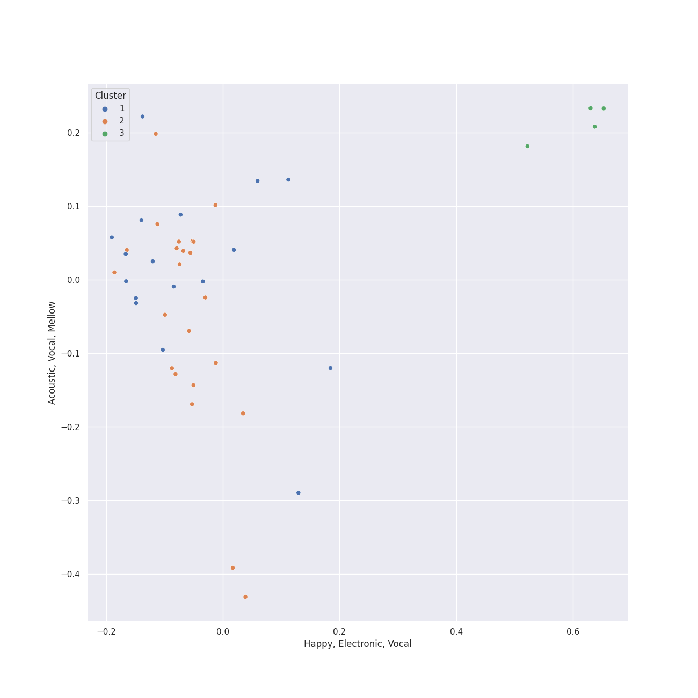

# Clusters in psychedelic rock

## Cluster #1

25 tracks

| Art | Track | Album | Artists | Label | 💚 | 🔗 |
|:---|:---|:---|:---|:---|:---|:---|
|  | Don't Eat The Yellow Snow | Apostrophe(') | Frank Zappa | Frank Zappa Catalog | | [🔗](https://open.spotify.com/track/1QY4TdhuNIOX2SHLdElzd5) |
|  | Uncle Remus | Apostrophe(') | Frank Zappa | Frank Zappa Catalog | | [🔗](https://open.spotify.com/track/4PPwkLq2ld1k09Bl5NkyZB) |
|  | Money | The Dark Side of the Moon | Pink Floyd | Pink Floyd Records | 💚 | [🔗](https://open.spotify.com/track/0vFOzaXqZHahrZp6enQwQb) |
|  | Got To Get You Into My Life - Remastered 2009 | Revolver (Remastered) | [The Beatles](../../../../artists/the_beatles/overview.md) | [EMI Catalogue](../../../../labels/emi_catalogue) | 💚 | [🔗](https://open.spotify.com/track/3tGhRLgcCP6SIZU3tbGl7l) |
|  | Sexy Sadie - Remastered 2009 | The Beatles (Remastered) | [The Beatles](../../../../artists/the_beatles/overview.md) | [EMI Catalogue](../../../../labels/emi_catalogue) | 💚 | [🔗](https://open.spotify.com/track/2tBv9tAdqEbLNDi5smSjbg) |
|  | While My Guitar Gently Weeps - Remastered 2009 | The Beatles (Remastered) | [The Beatles](../../../../artists/the_beatles/overview.md) | [EMI Catalogue](../../../../labels/emi_catalogue) | 💚 | [🔗](https://open.spotify.com/track/389QX9Q1eUOEZ19vtzzI9O) |
|  | All You Need Is Love - Remastered 2009 | Yellow Submarine (Remastered) | [The Beatles](../../../../artists/the_beatles/overview.md) | [EMI Catalogue](../../../../labels/emi_catalogue) | | [🔗](https://open.spotify.com/track/2Z8cY4QpZTFUZxCQCpvNe1) |
|  | Carry That Weight - Remastered 2009 | Abbey Road (Remastered) | [The Beatles](../../../../artists/the_beatles/overview.md) | [EMI Catalogue](../../../../labels/emi_catalogue) | | [🔗](https://open.spotify.com/track/5eZrW59C3UgBhkqNlowEID) |
|  | Octopus's Garden - Remastered 2009 | Abbey Road (Remastered) | [The Beatles](../../../../artists/the_beatles/overview.md) | [EMI Catalogue](../../../../labels/emi_catalogue) | | [🔗](https://open.spotify.com/track/0suLngfo7rJoetk7Ub6N8l) |
|  | Daydream Believer | The Birds, The Bees, & The Monkees | The Monkees | [Rhino](../../../../labels/rhino) | | [🔗](https://open.spotify.com/track/7uEcCGtM1FBBGIhPozhJjv) |
## Cluster #2

4 tracks

| Art | Track | Album | Artists | Label | 💚 | 🔗 |
|:---|:---|:---|:---|:---|:---|:---|
|  | Peaches En Regalia | Hot Rats | Frank Zappa | Frank Zappa Catalog | | [🔗](https://open.spotify.com/track/5uDu2qOoDou7cFXsipAo8l) |
|  | Set the Controls for the Heart of the Sun | A Saucerful of Secrets | Pink Floyd | Pink Floyd Records | 💚 | [🔗](https://open.spotify.com/track/6p9UFDNfGrzS5Byd2r9KPk) |
|  | Breathe (In the Air) | The Dark Side of the Moon | Pink Floyd | Pink Floyd Records | 💚 | [🔗](https://open.spotify.com/track/2ctvdKmETyOzPb2GiJJT53) |
|  | The Great Gig in the Sky | The Dark Side of the Moon | Pink Floyd | Pink Floyd Records | | [🔗](https://open.spotify.com/track/2TjdnqlpwOjhijHCwHCP2d) |
## Cluster #3

17 tracks

| Art | Track | Album | Artists | Label | 💚 | 🔗 |
|:---|:---|:---|:---|:---|:---|:---|
|  | Time | The Dark Side of the Moon | Pink Floyd | Pink Floyd Records | | [🔗](https://open.spotify.com/track/3TO7bbrUKrOSPGRTB5MeCz) |
|  | Hey You | The Wall | Pink Floyd | Pink Floyd Records | | [🔗](https://open.spotify.com/track/7F02x6EKYIQV3VcTaTm7oN) |
|  | Strawberry Fields Forever - Remastered 2009 | Magical Mystery Tour (Remastered) | [The Beatles](../../../../artists/the_beatles/overview.md) | [EMI Catalogue](../../../../labels/emi_catalogue) | | [🔗](https://open.spotify.com/track/3Am0IbOxmvlSXro7N5iSfZ) |
|  | Dear Prudence - Remastered 2009 | The Beatles (Remastered) | [The Beatles](../../../../artists/the_beatles/overview.md) | [EMI Catalogue](../../../../labels/emi_catalogue) | 💚 | [🔗](https://open.spotify.com/track/5NQYyej46WQkgCbnzGD21W) |
|  | Because - Remastered 2009 | Abbey Road (Remastered) | [The Beatles](../../../../artists/the_beatles/overview.md) | [EMI Catalogue](../../../../labels/emi_catalogue) | 💚 | [🔗](https://open.spotify.com/track/1rxoyGj1QuPoVi8fOft1Kt) |
|  | Come Together - Remastered 2009 | Abbey Road (Remastered) | [The Beatles](../../../../artists/the_beatles/overview.md) | [EMI Catalogue](../../../../labels/emi_catalogue) | 💚 | [🔗](https://open.spotify.com/track/2EqlS6tkEnglzr7tkKAAYD) |
|  | Golden Slumbers - Remastered 2009 | Abbey Road (Remastered) | [The Beatles](../../../../artists/the_beatles/overview.md) | [EMI Catalogue](../../../../labels/emi_catalogue) | 💚 | [🔗](https://open.spotify.com/track/01SfTM5nfCou5gQL70r6gs) |
|  | Something - Remastered 2009 | Abbey Road (Remastered) | [The Beatles](../../../../artists/the_beatles/overview.md) | [EMI Catalogue](../../../../labels/emi_catalogue) | 💚 | [🔗](https://open.spotify.com/track/0pNeVovbiZHkulpGeOx1Gj) |
|  | You Never Give Me Your Money - Remastered 2009 | Abbey Road (Remastered) | [The Beatles](../../../../artists/the_beatles/overview.md) | [EMI Catalogue](../../../../labels/emi_catalogue) | | [🔗](https://open.spotify.com/track/1jOLTO379yIu9aMnCkpMQl) |
|  | Let It Be - Remastered 2009 | Let It Be (Remastered) | [The Beatles](../../../../artists/the_beatles/overview.md) | [EMI Catalogue](../../../../labels/emi_catalogue) | 💚 | [🔗](https://open.spotify.com/track/7iN1s7xHE4ifF5povM6A48) |