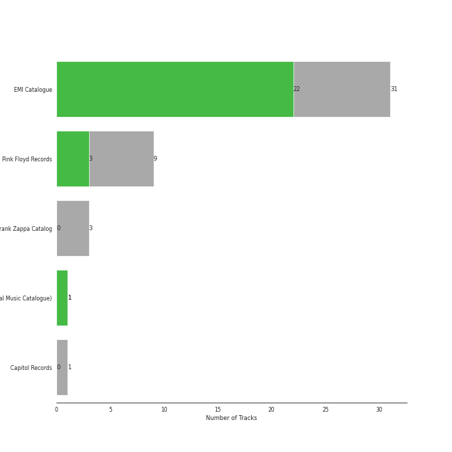
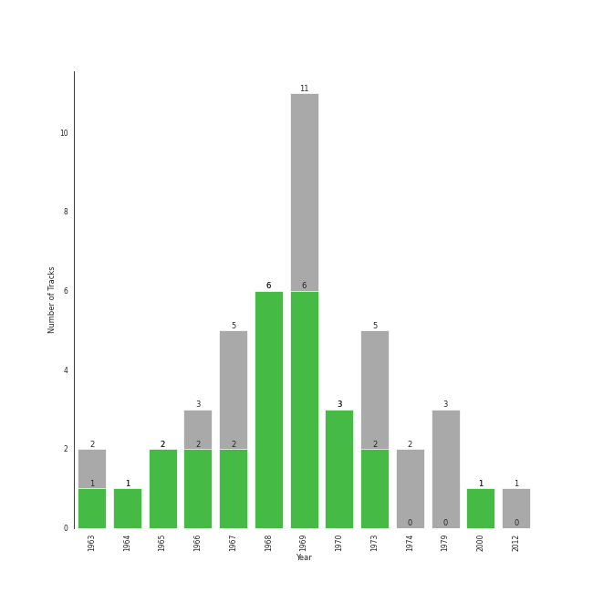

# psychedelic rock

47 songs

[See Track Features](audio_features.md)

[See Clusters](clusters/overview.md)

## Top Artists

| Art | Tracks | 💚 | Artist | 🔗 |
|:---|---:|---:|:---|:---|
|  | 32 | 23 | [The Beatles](../../artists/the_beatles/overview.md) | [🔗](https://open.spotify.com/artist/3WrFJ7ztbogyGnTHbHJFl2) |
|  | 9 | 3 | Pink Floyd | [🔗](https://open.spotify.com/artist/0k17h0D3J5VfsdmQ1iZtE9) |
|  | 2 | 1 | The Monkees | [🔗](https://open.spotify.com/artist/320EPCSEezHt1rtbfwH6Ck) |
|  | 3 | 0 | Frank Zappa | [🔗](https://open.spotify.com/artist/6ra4GIOgCZQZMOaUECftGN) |
|  | 1 | 0 | The Beach Boys | [🔗](https://open.spotify.com/artist/3oDbviiivRWhXwIE8hxkVV) |

## Most and least listened tracks
| ​ | Most listened tracks | Rank | ​​ | Least listened tracks | Rank |
|:---|:---|---:|:---|:---|---:|
|  | [Because - Remastered 2009](../../artists/the_beatles/overview.md) | 307 |  | [Golden Slumbers - Remastered 2009](../../artists/the_beatles/overview.md) | nan |
|  | [Day Tripper - Remastered 2015](../../artists/the_beatles/overview.md) | 387 |  | Brain Damage | nan |
|  | The Great Gig in the Sky | 690 |  | [A Day In The Life - Remastered 2009](../../artists/the_beatles/overview.md) | nan |
|  | Daydream Believer | nan |  | [Something - Remastered 2009](../../artists/the_beatles/overview.md) | nan |
|  | [Let It Be - Remastered 2009](../../artists/the_beatles/overview.md) | nan |  | [Octopus's Garden - Remastered 2009](../../artists/the_beatles/overview.md) | nan |
|  | Hey You | nan |  | Money | nan |
|  | Set the Controls for the Heart of the Sun | nan |  | [Norwegian Wood (This Bird Has Flown) - Remastered 2009](../../artists/the_beatles/overview.md) | nan |
|  | [I Am The Walrus - Remastered 2009](../../artists/the_beatles/overview.md) | nan |  | [When I'm Sixty Four - Remastered 2009](../../artists/the_beatles/overview.md) | nan |
|  | Peaches En Regalia | nan |  | Don't Eat The Yellow Snow | nan |
|  | [Blackbird - Remastered 2009](../../artists/the_beatles/overview.md) | nan |  | [Revolution 1 - Remastered 2009](../../artists/the_beatles/overview.md) | nan |

## Top Albums

| Art | Tracks | 💚 | Album | Release Date | 🔗 |
|:---|---:|---:|:---|:---|:---|
|  | 9 | 6 | Abbey Road (Remastered) | 1969-09-26 | [🔗](https://open.spotify.com/album/0ETFjACtuP2ADo6LFhL6HN) |
|  | 5 | 5 | The Beatles (Remastered) | 1968-11-22 | [🔗](https://open.spotify.com/album/1klALx0u4AavZNEvC4LrTL) |
|  | 5 | 2 | The Dark Side of the Moon | 1973-03-01 | [🔗](https://open.spotify.com/album/4LH4d3cOWNNsVw41Gqt2kv) |
|  | 3 | 3 | Let It Be (Remastered) | 1970-05-08 | [🔗](https://open.spotify.com/album/0jTGHV5xqHPvEcwL8f6YU5) |
|  | 3 | 2 | Revolver (Remastered) | 1966-08-05 | [🔗](https://open.spotify.com/album/3PRoXYsngSwjEQWR5PsHWR) |
|  | 3 | 2 | Magical Mystery Tour (Remastered) | 1967-11-27 | [🔗](https://open.spotify.com/album/2BtE7qm1qzM80p9vLSiXkj) |
|  | 3 | 0 | The Wall | 1979-11-30 | [🔗](https://open.spotify.com/album/5Dbax7G8SWrP9xyzkOvy2F) |
|  | 2 | 0 | Sgt. Pepper's Lonely Hearts Club Band (Remastered) | 1967-06-01 | [🔗](https://open.spotify.com/album/6QaVfG1pHYl1z15ZxkvVDW) |
|  | 2 | 0 | Apostrophe(') | 1974-03-22 | [🔗](https://open.spotify.com/album/3EbtMJsHbspjhN6Xd4plIu) |
|  | 1 | 1 | With The Beatles (Remastered) | 1963-11-22 | [🔗](https://open.spotify.com/album/1aYdiJk6XKeHWGO3FzHHTr) |

See all 21 albums

| Art | Tracks | 💚 | Album | Release Date | 🔗 |
|:---|---:|---:|:---|:---|:---|
|  | 1 | 1 | Rubber Soul (Remastered) | 1965-12-03 | [🔗](https://open.spotify.com/album/50o7kf2wLwVmOTVYJOTplm) |
|  | 1 | 1 | More of The Monkees (Deluxe Edition) | 1967-01-09 | [🔗](https://open.spotify.com/album/50zHjIiTOZM232gnWvOydX) |
|  | 1 | 1 | Help! (Remastered) | 1965-08-06 | [🔗](https://open.spotify.com/album/0PT5m6hwPRrpBwIHVnvbFX) |
|  | 1 | 1 | A Saucerful of Secrets | 1968-06-29 | [🔗](https://open.spotify.com/album/2vnJKtGjZXRUg0mYPZ3HGH) |
|  | 1 | 1 | A Hard Day's Night (Remastered) | 1964-07-10 | [🔗](https://open.spotify.com/album/6wCttLq0ADzkPgtRnUihLV) |
|  | 1 | 1 | 1 (Remastered) | 2000-11-13 | [🔗](https://open.spotify.com/album/7vEJAtP3KgKSpOHVgwm3Eh) |
|  | 1 | 0 | Yellow Submarine (Remastered) | 1969-01-17 | [🔗](https://open.spotify.com/album/1gKZ5A1ndFqbcrWtW85cCy) |
|  | 1 | 0 | The Birds, The Bees, & The Monkees | 1968-04-22 | [🔗](https://open.spotify.com/album/2Ov6zb7NfgDh3EXSIIWrb2) |
|  | 1 | 0 | Please Please Me (Remastered) | 1963-03-22 | [🔗](https://open.spotify.com/album/3KzAvEXcqJKBF97HrXwlgf) |
|  | 1 | 0 | Hot Rats | 1969-10-10 | [🔗](https://open.spotify.com/album/0WYYrC9My9rYWigac003hw) |
|  | 1 | 0 | 50 Big Ones: Greatest Hits | 2012-01-01 | [🔗](https://open.spotify.com/album/6cSZPNsr3tMEHo5QrMjk1F) |

## Top Record Labels

| Tracks | 💚 | Label |
|---:|---:|:---|
| 31 | 22 | [EMI Catalogue](../../labels/emi_catalogue/overview.md) |
| 9 | 3 | Pink Floyd Records |
| 2 | 1 | [Rhino](../../labels/rhino/overview.md) |
| 1 | 1 | [UMC (Universal Music Catalogue)](../../labels/umc_(universal_music_catalogue)/overview.md) |
| 3 | 0 | Frank Zappa Catalog |
| 1 | 0 | [Capitol Records](../../labels/capitol_records/overview.md) |

## Top Producers

| Art | Producer | Tracks | Credit Types |
|:---|:---|---:|:---|
| | [George Martin](../../producers/george_martin/overview.md) | 23 | Producer, Arranger |
| | [Paul McCartney](../../producers/paul_mccartney/overview.md) | 21 | Songwriter |
| | [John Lennon](../../producers/john_lennon/overview.md) | 21 | Songwriter |
| | Geoff Emerick | 10 | Producer |
| | Phil McDonald | 8 | Producer |
| | Norman Smith | 6 | Producer |
| | Chris Thomas | 5 | Producer |
| | Ken Scott | 4 | Producer |
| | Glyn Johns | 4 | Producer |
| | Phil Spector | 3 | Producer |

View all

| Art | Producer | Tracks | Credit Types |
|:---|:---|---:|:---|
| | Roger Waters | 3 | Lyricist, Songwriter |
| | Peter Bown | 2 | Producer |
| | Jeff Jarratt | 2 | Producer |
| | Alan Parsons | 2 | Producer |
| | Barry Sheffield | 2 | Producer |
|  | Pink Floyd | 2 | Producer |
| | George Harrison | 2 | Lyricist, Songwriter |
| | Lauren Scott | 1 | Arranger |
| | Ron Pender | 1 | Producer |
| | Neil Diamond | 1 | Lyricist, Songwriter |
| | Martin Benge | 1 | Producer |
| | David Gilmour | 1 | Songwriter |
| | John Mills | 1 | Arranger |
| | Richard Wright | 1 | Songwriter |

## Years

| ​ | 10 newest albums | ​​ | 10 oldest albums |
|:---|:---|:---|:---|
|  | 50 Big Ones: Greatest Hits (2012-01-01) |  | Please Please Me (Remastered) (1963-03-22) |
|  | 1 (Remastered) (2000-11-13) |  | With The Beatles (Remastered) (1963-11-22) |
|  | The Wall (1979-11-30) |  | A Hard Day's Night (Remastered) (1964-07-10) |
|  | Apostrophe(') (1974-03-22) |  | Help! (Remastered) (1965-08-06) |
|  | The Dark Side of the Moon (1973-03-01) |  | Rubber Soul (Remastered) (1965-12-03) |
|  | Let It Be (Remastered) (1970-05-08) |  | Revolver (Remastered) (1966-08-05) |
|  | Hot Rats (1969-10-10) |  | More of The Monkees (Deluxe Edition) (1967-01-09) |
|  | Abbey Road (Remastered) (1969-09-26) |  | Sgt. Pepper's Lonely Hearts Club Band (Remastered) (1967-06-01) |
|  | Yellow Submarine (Remastered) (1969-01-17) |  | Magical Mystery Tour (Remastered) (1967-11-27) |
|  | The Beatles (Remastered) (1968-11-22) |  | The Birds, The Bees, & The Monkees (1968-04-22) |

