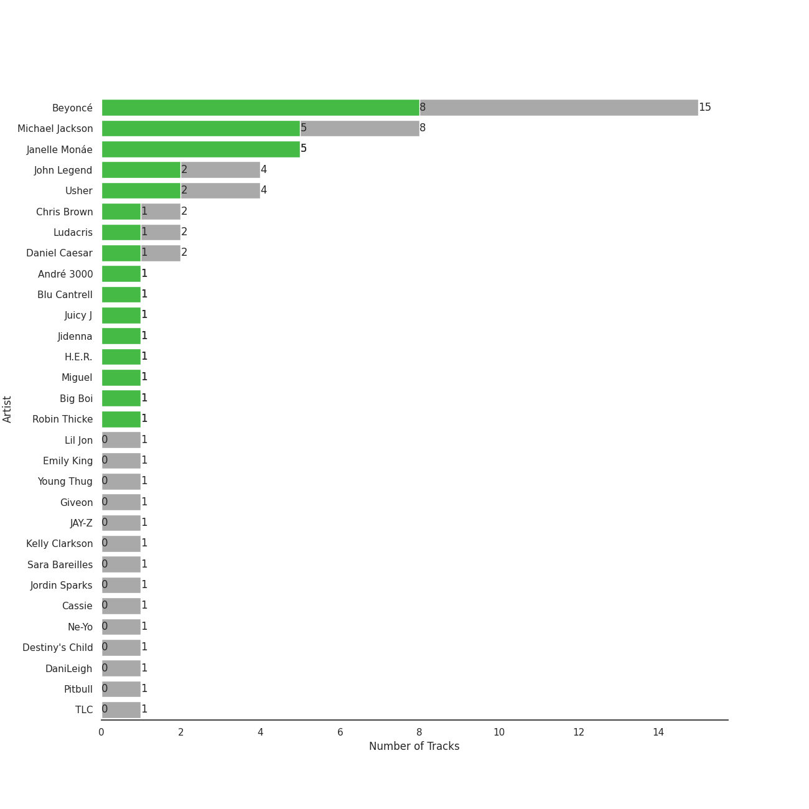
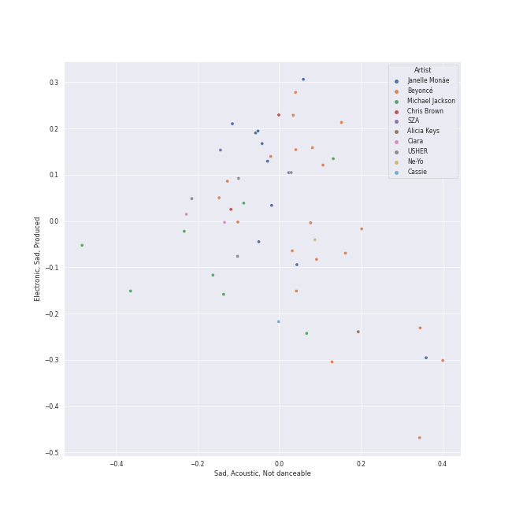
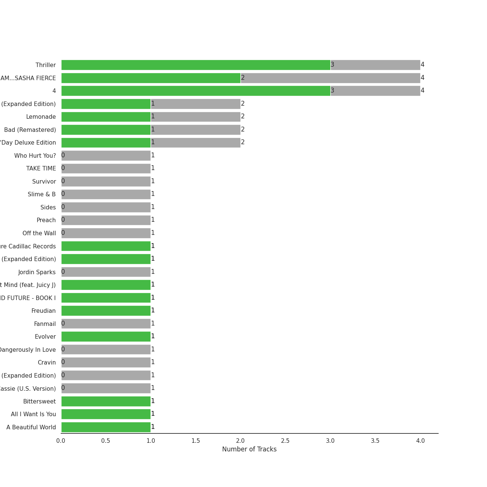
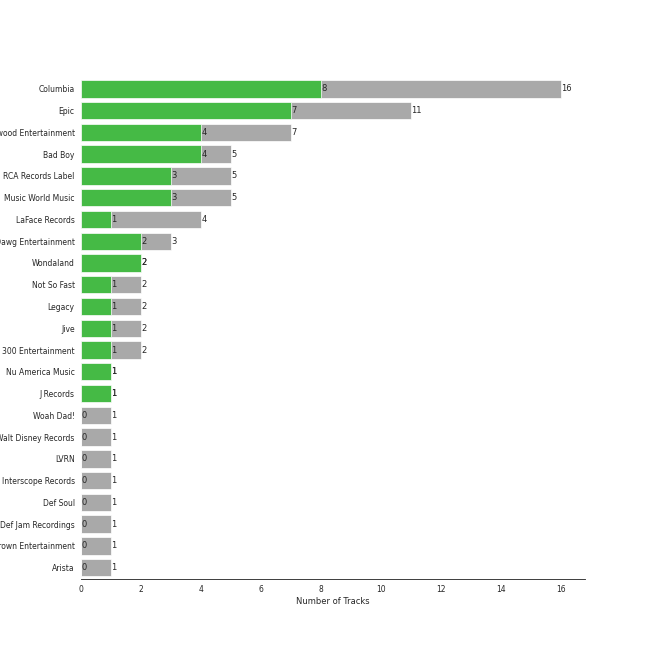

# r&b

[50 songs](r_b_tracks.md)

## Top Artists

See all 30 artists

| Number of Tracks | Art | Artist | 🔗 |
|---:|:---|:---|:---|
| 15 |  | [Beyoncé](../artists/beyonc_.md) | [🔗](https://open.spotify.com/artist/6vWDO969PvNqNYHIOW5v0m) |
| 8 |  | Michael Jackson | [🔗](https://open.spotify.com/artist/3fMbdgg4jU18AjLCKBhRSm) |
| 5 |  | Janelle Monáe | [🔗](https://open.spotify.com/artist/6ueGR6SWhUJfvEhqkvMsVs) |
| 4 |  | Usher | [🔗](https://open.spotify.com/artist/23zg3TcAtWQy7J6upgbUnj) |
| 3 |  | John Legend | [🔗](https://open.spotify.com/artist/5y2Xq6xcjJb2jVM54GHK3t) |
| 2 |  | Chris Brown | [🔗](https://open.spotify.com/artist/7bXgB6jMjp9ATFy66eO08Z) |
| 2 |  | Ludacris | [🔗](https://open.spotify.com/artist/3ipn9JLAPI5GUEo4y4jcoi) |
| 2 |  | Daniel Caesar | [🔗](https://open.spotify.com/artist/20wkVLutqVOYrc0kxFs7rA) |
| 1 |  | Lil Jon | [🔗](https://open.spotify.com/artist/7sfl4Xt5KmfyDs2T3SVSMK) |
| 1 |  | André 3000 | [🔗](https://open.spotify.com/artist/74V3dE1a51skRkdII8y2C6) |
| 1 |  | Blu Cantrell | [🔗](https://open.spotify.com/artist/6vytZ677lz4LzCrUDcDokM) |
| 1 |  | Emily King | [🔗](https://open.spotify.com/artist/6jlWj6y00bMQt8XoKuCjyZ) |
| 1 |  | Juicy J | [🔗](https://open.spotify.com/artist/5gCRApTajqwbnHHPbr2Fpi) |
| 1 |  | Young Thug | [🔗](https://open.spotify.com/artist/50co4Is1HCEo8bhOyUWKpn) |
| 1 |  | Giveon | [🔗](https://open.spotify.com/artist/4fxd5Ee7UefO4CUXgwJ7IP) |
| 1 |  | Jidenna | [🔗](https://open.spotify.com/artist/4TsHKU8l8Wq7n7OPVikirn) |
| 1 |  | JAY-Z | [🔗](https://open.spotify.com/artist/3nFkdlSjzX9mRTtwJOzDYB) |
| 1 |  | H.E.R. | [🔗](https://open.spotify.com/artist/3Y7RZ31TRPVadSFVy1o8os) |
| 1 |  | Miguel | [🔗](https://open.spotify.com/artist/360IAlyVv4PCEVjgyMZrxK) |
| 1 |  | Big Boi | [🔗](https://open.spotify.com/artist/2ht3wxeT69CzyKFChNnNAB) |
| 1 |  | [Sara Bareilles](../artists/sara_bareilles.md) | [🔗](https://open.spotify.com/artist/2Sqr0DXoaYABbjBo9HaMkM) |
| 1 |  | Jordin Sparks | [🔗](https://open.spotify.com/artist/2AQjGvtT0pFYfxR3neFcvz) |
| 1 |  | Cassie | [🔗](https://open.spotify.com/artist/27FGXRNruFoOdf1vP8dqcH) |
| 1 |  | Ne-Yo | [🔗](https://open.spotify.com/artist/21E3waRsmPlU7jZsS13rcj) |
| 1 |  | Destiny's Child | [🔗](https://open.spotify.com/artist/1Y8cdNmUJH7yBTd9yOvr5i) |
| 1 |  | Robin Thicke | [🔗](https://open.spotify.com/artist/0ZrpamOxcZybMHGg1AYtHP) |
| 1 |  | DaniLeigh | [🔗](https://open.spotify.com/artist/0XIKGBo9PnK1ApI5tZA60d) |
| 1 |  | Pitbull | [🔗](https://open.spotify.com/artist/0TnOYISbd1XYRBk9myaseg) |
| 1 |  | TLC | [🔗](https://open.spotify.com/artist/0TImkz4nPqjegtVSMZnMRq) |
| 1 |  | G-Eazy | [🔗](https://open.spotify.com/artist/02kJSzxNuaWGqwubyUba0Z) |

## Top Albums

See all 36 albums

| Number of Tracks | Art | Album | Release Date | 🔗 |
|---:|:---|:---|:---|:---|
| 4 |  | Thriller | 1982-11-30 | [🔗](https://open.spotify.com/album/2ANVost0y2y52ema1E9xAZ) |
| 4 |  | I AM...SASHA FIERCE | 2008-11-14 | [🔗](https://open.spotify.com/album/23Y5wdyP5byMFktZf8AcWU) |
| 4 |  | 4 | 2011-06-24 | [🔗](https://open.spotify.com/album/1gIC63gC3B7o7FfpPACZQJ) |
| 2 |  | Raymond v Raymond (Expanded Edition) | 2010-03-30 | [🔗](https://open.spotify.com/album/6A1F3Fkq5dYeYYNkXflcTX) |
| 2 |  | Lemonade | 2016-04-23 | [🔗](https://open.spotify.com/album/7dK54iZuOxXFarGhXwEXfF) |
| 2 |  | Dirty Computer | 2018-04-27 | [🔗](https://open.spotify.com/album/2PjlaxlMunGOUvcRzlTbtE) |
| 2 |  | Bad (Remastered) | 1987-08-31 | [🔗](https://open.spotify.com/album/3Us57CjssWnHjTUIXBuIeH) |
| 2 |  | B'Day Deluxe Edition | 2007-05-29 | [🔗](https://open.spotify.com/album/0Zd10MKN5j9KwUST0TdBBB) |
| 1 |  | Yoga | 2015-03-31 | [🔗](https://open.spotify.com/album/5rzxGeVyCV74SvV5hjLRAU) |
| 1 |  | Who Hurt You? | 2018-10-16 | [🔗](https://open.spotify.com/album/15M9pZ8gsdoN67yLjyQ039) |
| 1 |  | The ArchAndroid | 2010-05-17 | [🔗](https://open.spotify.com/album/7MvSB0JTdtl1pSwZcgvYQX) |
| 1 |  | TAKE TIME | 2020-03-27 | [🔗](https://open.spotify.com/album/1zHR48K6XtWYm6bhrw4J6C) |
| 1 |  | Survivor | 2001-05-01 | [🔗](https://open.spotify.com/album/480AZOo2VQ1kf3GedAiKV9) |
| 1 |  | Slime & B | 2020-05-08 | [🔗](https://open.spotify.com/album/7fZKtzZAsfH0kzeTivu5TG) |
| 1 |  | Sides | 2020-01-17 | [🔗](https://open.spotify.com/album/5alIr9JGPvOQwPLphm0beJ) |
| 1 |  | Preach | 2019-02-15 | [🔗](https://open.spotify.com/album/32r4o1R9a1lK5DoVXGEC7E) |
| 1 |  | Off the Wall | 1979-08-10 | [🔗](https://open.spotify.com/album/2ZytN2cY4Zjrr9ukb2rqTP) |
| 1 |  | Music From The Motion Picture Cadillac Records | 2008-11-28 | [🔗](https://open.spotify.com/album/4b2zuwf7CPesdiTg1kFDjU) |
| 1 |  | Metropolis: The Chase Suite (Special Edition) | 2008-08-12 | [🔗](https://open.spotify.com/album/3T3bJi3cvwR5U7ihwgEwF1) |
| 1 |  | Love In The Future (Expanded Edition) | 2013-08-30 | [🔗](https://open.spotify.com/album/4OTAx9un4e6NfoHuVRiOrC) |
| 1 |  | Jordin Sparks | 2007-11-20 | [🔗](https://open.spotify.com/album/6JCNOvp9UeMrFuXwNW0JW6) |
| 1 |  | In My Own Words | 2006-01-01 | [🔗](https://open.spotify.com/album/6gkwOLmk0ALMOjWs5WhAEr) |
| 1 |  | I Don't Mind (feat. Juicy J) | 2014-11-21 | [🔗](https://open.spotify.com/album/5BAqg5IJQ7XFKfdoCiOlJw) |
| 1 |  | HIStory - PAST, PRESENT AND FUTURE - BOOK I | 1995-06-16 | [🔗](https://open.spotify.com/album/3OBhnTLrvkoEEETjFA3Qfk) |
| 1 |  | Freudian | 2017-08-25 | [🔗](https://open.spotify.com/album/3xybjP7r2VsWzwvDQipdM0) |
| 1 |  | Fanmail | 1999-02-23 | [🔗](https://open.spotify.com/album/1CvjjpvqVMoyprsf74bpYW) |
| 1 |  | F.A.M.E. (Expanded Edition) | 2011-03-22 | [🔗](https://open.spotify.com/album/6df0qvkMXoyHGt9J8cujZb) |
| 1 |  | Evolver | 2008-10-27 | [🔗](https://open.spotify.com/album/11sKu4dBGvmEZTuVw9EC9A) |
| 1 |  | Dangerously In Love | 2003-06-24 | [🔗](https://open.spotify.com/album/6oxVabMIqCMJRYN1GqR3Vf) |
| 1 |  | Cravin | 2019-10-18 | [🔗](https://open.spotify.com/album/6c66PBJdg7EWPcFUvLyFFu) |
| 1 |  | Confessions (Expanded Edition) | 2004-03-23 | [🔗](https://open.spotify.com/album/1RM6MGv6bcl6NrAG8PGoZk) |
| 1 |  | Cassie (U.S. Version) | 2006-08-07 | [🔗](https://open.spotify.com/album/0j1qzjaJmsF1FkcICf3hRu) |
| 1 |  | Bittersweet | 2003 | [🔗](https://open.spotify.com/album/3UviDOQkc4WbXkNi6DIBZu) |
| 1 |  | BEYONCÉ [Platinum Edition] | 2014-11-24 | [🔗](https://open.spotify.com/album/2UJwKSBUz6rtW4QLK74kQu) |
| 1 |  | All I Want Is You | 2010-11-26 | [🔗](https://open.spotify.com/album/493HYe7N5pleudEZRyhE7R) |
| 1 |  | A Beautiful World | 2002-12-13 | [🔗](https://open.spotify.com/album/76wI74XuASLFrY9pUVLhO9) |

## Top Record Labels

See all 21 labels

| Number of Tracks | Label |
|---:|:---|
| 19 | [Columbia](../labels/columbia.md) |
| 10 | [Epic](../labels/epic.md) |
| 7 | Parkwood Entertainment |
| 5 | Music World Music |
| 5 | Bad Boy |
| 4 | LaFace Records |
| 2 | Wondaland |
| 2 | [RCA Records Label](../labels/rca_records_label.md) |
| 2 | [Legacy](../labels/legacy.md) |
| 2 | [Jive](../labels/jive.md) |
| 2 | Golden Child Recordings |
| 2 | G.O.O.D. Music |
| 2 | Arista |
| 1 | Nu America Music |
| 1 | Not So Fast |
| 1 | Def Soul |
| 1 | [Def Jam Recordings](../labels/def_jam_recordings.md) |
| 1 | Chris Brown Entertainment |
| 1 | ATO Records |
| 1 | 300 Entertainment |
| 1 | 19 Recordings Limited |

## Audio Features

| 10 most Danceable tracks | 10 least Danceable tracks |
|:---|:---|
| Billie Jean (0.932) | I'd Rather Go Blind (0.326) |
| Yeah! (feat. Lil Jon & Ludacris) (0.894) | Ave Maria (0.35) |
| P.Y.T. (Pretty Young Thing) (0.894) | Partition (0.418) |
| Don't Stop 'Til You Get Enough (0.878) | All of Me (0.422) |
| I Don't Mind (feat. Juicy J) (0.87) | Listen (From the Motion Picture "Dreamgirls") (0.432) |
| Make Me Feel (0.859) | Irreplaceable (0.447) |
| Smooth Criminal - 2012 Remaster (0.853) | Heartbreak Anniversary (0.449) |
| Wanna Be Startin' Somethin' (0.842) | So Sick (0.452) |
| Bootylicious (0.835) | I Like That (0.482) |
| Cravin (feat. G-Eazy) (0.834) | Teach You - Acoustic (0.497) |

| 10 most Energetic tracks | 10 least Energetic tracks |
|:---|:---|
| Smooth Criminal - 2012 Remaster (0.981) | All of Me (0.264) |
| Green Light (feat. André 3000) (0.882) | Teach You - Acoustic (0.304) |
| Wanna Be Startin' Somethin' (0.872) | Best Part (feat. H.E.R.) (0.364) |
| DJ Got Us Fallin' In Love (feat. Pitbull) (0.861) | Hold Up (0.397) |
| When I Get You Alone (0.857) | Ave Maria (0.403) |
| Bootylicious (0.833) | Make Me Feel (0.413) |
| Sweet Dreams (0.825) | Partition (0.441) |
| Don't Stop 'Til You Get Enough (0.821) | I Like That (0.453) |
| Man in the Mirror - 2012 Remaster (0.812) | Me & U (0.454) |
| Beat It (0.8) | Billie Jean (0.457) |

| 10 most Speechy tracks | 10 least Speechy tracks |
|:---|:---|
| Hold Up (0.405) | Ave Maria (0.0279) |
| Irreplaceable (0.382) | One Step At a Time (0.0289) |
| So Sick (0.31) | Me & U (0.0294) |
| Bootylicious (0.284) | If I Were a Boy (0.0313) |
| Partition (0.283) | I'd Rather Go Blind (0.032) |
| Cravin (feat. G-Eazy) (0.246) | All of Me (0.0322) |
| Crazy In Love (feat. Jay-Z) (0.226) | Best Thing I Never Had (0.0324) |
| Daddy Lessons (0.216) | I Was Here (0.0335) |
| Make Me Feel (0.182) | Best Part (feat. H.E.R.) (0.0367) |
| I Don't Mind (feat. Juicy J) (0.178) | Man in the Mirror - 2012 Remaster (0.0381) |

| 10 most Acoustic tracks | 10 least Acoustic tracks |
|:---|:---|
| All of Me (0.922) | Bootylicious (0.00247) |
| Teach You - Acoustic (0.899) | Crazy In Love (feat. Jay-Z) (0.00249) |
| Best Part (feat. H.E.R.) (0.808) | Yoga (0.0159) |
| Ave Maria (0.786) | Wet The Bed (feat. Ludacris) (0.0166) |
| Hold Up (0.745) | Billie Jean (0.0173) |
| Who Hurt You? (0.586) | Yeah! (feat. Lil Jon & Ludacris) (0.0183) |
| Heartbreak Anniversary (0.524) | No Scrubs (0.0251) |
| Man in the Mirror - 2012 Remaster (0.52) | Wanna Be Startin' Somethin' (0.0259) |
| I Was Here (0.431) | Sure Thing (0.0267) |
| Listen (From the Motion Picture "Dreamgirls") (0.416) | Beat It (0.027) |

| 10 most Instrumental tracks | 10 least Instrumental tracks |
|:---|:---|
| Smooth Criminal - 2012 Remaster (0.468) | Hold Up (0.0) |
| Wanna Be Startin' Somethin' (0.419) | Best Part (feat. H.E.R.) (0.0) |
| Partition (0.0707) | Ave Maria (0.0) |
| Don't Stop 'Til You Get Enough (0.0461) | When I Get You Alone (0.0) |
| Billie Jean (0.0436) | City Girls (0.0) |
| I Like That (0.00243) | Love On Top (0.0) |
| Tightrope (feat. Big Boi) - Big Boi Vocal Edit (0.000868) | If I Were a Boy (0.0) |
| No Scrubs (0.000717) | Preach (0.0) |
| Sincerely, Jane (0.000649) | Wet The Bed (feat. Ludacris) (0.0) |
| P.Y.T. (Pretty Young Thing) (0.000363) | Bootylicious (0.0) |

| 10 most Live tracks | 10 least Live tracks |
|:---|:---|
| Thriller (0.89) | One Step At a Time (0.0384) |
| Love On Top (0.604) | Yeah! (feat. Lil Jon & Ludacris) (0.0388) |
| Hold Up (0.521) | Billie Jean (0.0414) |
| If I Were a Boy (0.354) | When I Get You Alone (0.0549) |
| Daddy Lessons (0.349) | City Girls (0.0554) |
| Make Me Feel (0.334) | Halo (0.0563) |
| Partition (0.306) | Wanna Be Startin' Somethin' (0.0573) |
| Smooth Criminal - 2012 Remaster (0.306) | Sweet Dreams (0.0618) |
| Heartbreak Anniversary (0.303) | Me & U (0.0655) |
| Hit 'Em Up Style (Oops!) (0.289) | Who Hurt You? (0.0667) |

| 10 most Happy tracks | 10 least Happy tracks |
|:---|:---|
| P.Y.T. (Pretty Young Thing) (0.961) | I Like That (0.17) |
| Don't Stop 'Til You Get Enough (0.947) | Partition (0.172) |
| Wanna Be Startin' Somethin' (0.906) | Listen (From the Motion Picture "Dreamgirls") (0.187) |
| Beat It (0.9) | Ave Maria (0.201) |
| Billie Jean (0.884) | I Was Here (0.235) |
| City Girls (0.815) | There Goes My Baby (0.257) |
| Sweet Dreams (0.788) | Man in the Mirror - 2012 Remaster (0.269) |
| Thriller (0.783) | Sincerely, Jane (0.274) |
| Green Light (feat. André 3000) (0.762) | Who Hurt You? (0.277) |
| Me & U (0.739) | I'd Rather Go Blind (0.289) |
