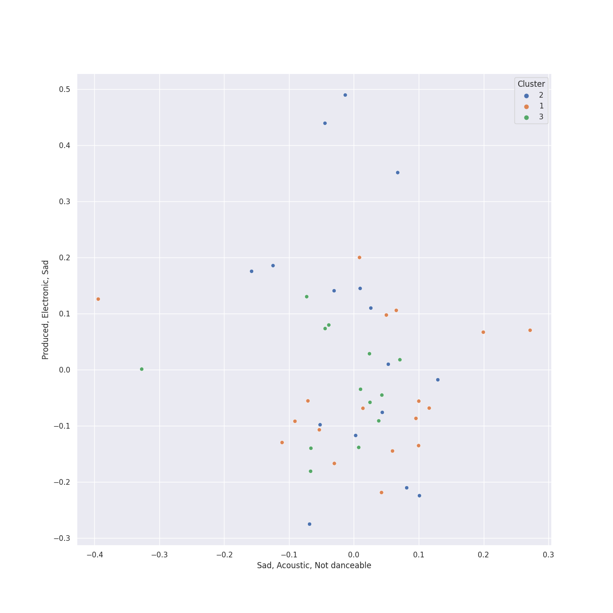

# Clusters in r&b

## Cluster #1

10 tracks

| Art | Track | Album | Artists | Label | Score | 💚 | 🔗 |
|:---|:---|:---|:---|:---|---:|:---|:---|
|  | Say You'll Go | The ArchAndroid | [Janelle Monáe](../../../../artists/janelle_monáe/overview.md) | [Bad Boy/Wondaland](../../../../labels/bad_boy) | 0 | 💚 | [🔗](https://open.spotify.com/track/6wbEygoouLHwgy4J6uQIb1) |
|  | Hold Up | Lemonade | [Beyoncé](../../../../artists/beyoncé/overview.md) | [Parkwood Entertainment/Columbia](../../../../labels/columbia) | 0 | | [🔗](https://open.spotify.com/track/0rzNMzZsubFcXSEh7dnem7) |
|  | Ave Maria | I AM...SASHA FIERCE | [Beyoncé](../../../../artists/beyoncé/overview.md) | [Music World Music/Columbia](../../../../labels/columbia) | 0 | | [🔗](https://open.spotify.com/track/1j9HwUMSkRUeVFRWlHcFsy) |
|  | I Was Here | 4 | [Beyoncé](../../../../artists/beyoncé/overview.md) | [Parkwood Entertainment/Columbia](../../../../labels/columbia) | 0 | 💚 | [🔗](https://open.spotify.com/track/64Tp4KN5U5rtqrasP5a7FH) |
|  | Can You Feel the Love Tonight | The Lion King (Original Motion Picture Soundtrack) | [Beyoncé](../../../../artists/beyoncé/overview.md), Childish Gambino, Billy Eichner, Seth Rogen | [Walt Disney Records](../../../../labels/walt_disney_records) | 0 | | [🔗](https://open.spotify.com/track/1zSKtBze2IReYU44W0lDzd) |
|  | Listen (From the Motion Picture "Dreamgirls") | B'Day Deluxe Edition | [Beyoncé](../../../../artists/beyoncé/overview.md) | [Columbia](../../../../labels/columbia) | 0 | 💚 | [🔗](https://open.spotify.com/track/4z7Ja0RNran3XpIvc1PIQz) |
|  | Man in the Mirror - 2012 Remaster | Bad (Remastered) | [Michael Jackson](../../../../artists/michael_jackson/overview.md) | [Epic](../../../../labels/epic), [Legacy](../../../../labels/legacy) | 0 | | [🔗](https://open.spotify.com/track/3c7Ctlw9MKlIQPxRH3fOTt) |
|  | Heartbreak Anniversary | Heartbreak Anniversary | Giveon | [Epic/Not So Fast](../../../../labels/epic) | 0 | 💚 | [🔗](https://open.spotify.com/track/2QfznFotJNZmnIEYFdzE5T) |
|  | Heartbreak Anniversary | TAKE TIME | Giveon | [Epic/Not So Fast](../../../../labels/epic) | 0 | | [🔗](https://open.spotify.com/track/3FAJ6O0NOHQV8Mc5Ri6ENp) |
|  | If I Ain't Got You | The Diary Of Alicia Keys | Alicia Keys | J Records | 0 | 💚 | [🔗](https://open.spotify.com/track/3XVBdLihbNbxUwZosxcGuJ) |
## Cluster #2

46 tracks

| Art | Track | Album | Artists | Label | Score | 💚 | 🔗 |
|:---|:---|:---|:---|:---|---:|:---|:---|
|  | Tightrope (feat. Big Boi) - Big Boi Vocal Edit | The ArchAndroid | [Janelle Monáe](../../../../artists/janelle_monáe/overview.md), Big Boi | [Bad Boy/Wondaland](../../../../labels/bad_boy) | 0 | 💚 | [🔗](https://open.spotify.com/track/1ljzHUgt2SU2ADkhfa9eBC) |
|  | Sure Thing | All I Want Is You | Miguel | [Jive](../../../../labels/jive) | 0 | 💚 | [🔗](https://open.spotify.com/track/0JXXNGljqupsJaZsgSbMZV) |
|  | Naughty Girl | Dangerously In Love | [Beyoncé](../../../../artists/beyoncé/overview.md) | [Columbia](../../../../labels/columbia) | 0 | 💚 | [🔗](https://open.spotify.com/track/0YGQ3hZcRLC5YX7o0hdmHg) |
|  | No Scrubs | Fanmail | TLC | Arista/LaFace Records | 0 | | [🔗](https://open.spotify.com/track/1KGi9sZVMeszgZOWivFpxs) |
|  | Kill Bill | SOS | SZA | [Top Dawg Entertainment/RCA Records](../../../../labels/rca_records_label) | 415 | 💚 | [🔗](https://open.spotify.com/track/3OHfY25tqY28d16oZczHc8) |
|  | Snooze | SOS | SZA | [Top Dawg Entertainment/RCA Records](../../../../labels/rca_records_label) | 0 | | [🔗](https://open.spotify.com/track/4iZ4pt7kvcaH6Yo8UoZ4s2) |
|  | Bootylicious | Survivor | Destiny's Child | [Columbia](../../../../labels/columbia) | 0 | | [🔗](https://open.spotify.com/track/31CsLSgn0HdZEVC8Bnnmvr) |
|  | American Boy | Shine | Estelle, Kanye West | Woah Dad! | 0 | | [🔗](https://open.spotify.com/track/3IX1c76hbN4iTm9RcItC36) |
|  | So Sick | In My Own Words | Ne-Yo | Def Soul | 0 | | [🔗](https://open.spotify.com/track/6brl7bwOHmGFkNw3MBqssT) |
|  | Sweetest Pie | Sweetest Pie | Megan Thee Stallion, [Dua Lipa](../../../../artists/dua_lipa/overview.md) | 300 Entertainment | 0 | 💚 | [🔗](https://open.spotify.com/track/7mFj0LlWtEJaEigguaWqYh) |
## Cluster #3

2 tracks

| Art | Track | Album | Artists | Label | Score | 💚 | 🔗 |
|:---|:---|:---|:---|:---|---:|:---|:---|
|  | Love On Top | 4 | [Beyoncé](../../../../artists/beyoncé/overview.md) | [Parkwood Entertainment/Columbia](../../../../labels/columbia) | 0 | 💚 | [🔗](https://open.spotify.com/track/1z6WtY7X4HQJvzxC4UgkSf) |
|  | Thriller | Thriller | [Michael Jackson](../../../../artists/michael_jackson/overview.md) | [Epic](../../../../labels/epic) | 0 | 💚 | [🔗](https://open.spotify.com/track/2LlQb7Uoj1kKyGhlkBf9aC) |