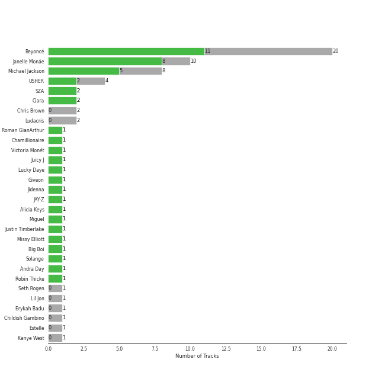
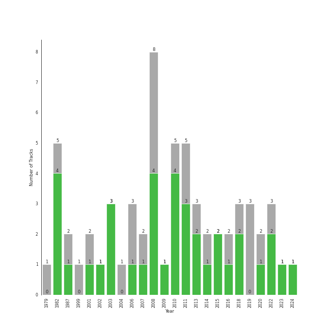

# r&b

58 songs

[See Track Features](audio_features.md)

[See Clusters](clusters/overview.md)

## Top Artists

| Art | Rank | Tracks | 💚 | Artist | 🔗 |
|:---|---:|---:|---:|:---|:---|
|  | 134 | 17 | 10 | [Beyoncé](../../artists/beyoncé/overview.md) | [🔗](https://open.spotify.com/artist/6vWDO969PvNqNYHIOW5v0m) |
|  | 106 | 10 | 8 | [Janelle Monáe](../../artists/janelle_monáe/overview.md) | [🔗](https://open.spotify.com/artist/6ueGR6SWhUJfvEhqkvMsVs) |
|  | 163 | 8 | 5 | [Michael Jackson](../../artists/michael_jackson/overview.md) | [🔗](https://open.spotify.com/artist/3fMbdgg4jU18AjLCKBhRSm) |
|  | 407 | 4 | 2 | USHER | [🔗](https://open.spotify.com/artist/23zg3TcAtWQy7J6upgbUnj) |
|  | 196 | 2 | 2 | SZA | [🔗](https://open.spotify.com/artist/7tYKF4w9nC0nq9CsPZTHyP) |
|  | 76 | 2 | 2 | Ciara | [🔗](https://open.spotify.com/artist/2NdeV5rLm47xAvogXrYhJX) |
|  | 407 | 1 | 1 | Roman GianArthur | [🔗](https://open.spotify.com/artist/7hgRzsQGjlm1zifNoigyB9) |
|  | 212 | 1 | 1 | Chamillionaire | [🔗](https://open.spotify.com/artist/6vdMPayKk8YJxxeNP5oMCb) |
|  | 82 | 1 | 1 | [Dua Lipa](../../artists/dua_lipa/overview.md) | [🔗](https://open.spotify.com/artist/6M2wZ9GZgrQXHCFfjv46we) |
|  | 221 | 1 | 1 | Victoria Monét | [🔗](https://open.spotify.com/artist/63XBtGSEZINSyXylZxEUbv) |

See all 41 artists

| Art | Rank | Tracks | 💚 | Artist | 🔗 |
|:---|---:|---:|---:|:---|:---|
|  | 407 | 1 | 1 | Juicy J | [🔗](https://open.spotify.com/artist/5gCRApTajqwbnHHPbr2Fpi) |
|  | 220 | 1 | 1 | Lucky Daye | [🔗](https://open.spotify.com/artist/5Vuvs6Py2JRU7WiFDVsI7J) |
|  | 407 | 1 | 1 | Giveon | [🔗](https://open.spotify.com/artist/4fxd5Ee7UefO4CUXgwJ7IP) |
|  | 297 | 1 | 1 | Jidenna | [🔗](https://open.spotify.com/artist/4TsHKU8l8Wq7n7OPVikirn) |
|  | 407 | 1 | 1 | JAY-Z | [🔗](https://open.spotify.com/artist/3nFkdlSjzX9mRTtwJOzDYB) |
|  | 407 | 1 | 1 | Alicia Keys | [🔗](https://open.spotify.com/artist/3DiDSECUqqY1AuBP8qtaIa) |
|  | 407 | 1 | 1 | Miguel | [🔗](https://open.spotify.com/artist/360IAlyVv4PCEVjgyMZrxK) |
|  | 314 | 1 | 1 | Justin Timberlake | [🔗](https://open.spotify.com/artist/31TPClRtHm23RisEBtV3X7) |
|  | 407 | 1 | 1 | Big Boi | [🔗](https://open.spotify.com/artist/2ht3wxeT69CzyKFChNnNAB) |
|  | 407 | 1 | 1 | Solange | [🔗](https://open.spotify.com/artist/2auiVi8sUZo17dLy1HwrTU) |
|  | 407 | 1 | 1 | Megan Thee Stallion | [🔗](https://open.spotify.com/artist/181bsRPaVXVlUKXrxwZfHK) |
|  | 407 | 1 | 1 | Robin Thicke | [🔗](https://open.spotify.com/artist/0ZrpamOxcZybMHGg1AYtHP) |
|  | 407 | 2 | 0 | Chris Brown | [🔗](https://open.spotify.com/artist/7bXgB6jMjp9ATFy66eO08Z) |
|  | 407 | 2 | 0 | Ludacris | [🔗](https://open.spotify.com/artist/3ipn9JLAPI5GUEo4y4jcoi) |
|  | 407 | 1 | 0 | Seth Rogen | [🔗](https://open.spotify.com/artist/7xX39IyguhWsTIg4eU2reH) |
|  | 407 | 1 | 0 | Lil Jon | [🔗](https://open.spotify.com/artist/7sfl4Xt5KmfyDs2T3SVSMK) |
|  | 407 | 1 | 0 | Erykah Badu | [🔗](https://open.spotify.com/artist/7IfculRW2WXyzNQ8djX8WX) |
|  | 407 | 1 | 0 | Childish Gambino | [🔗](https://open.spotify.com/artist/73sIBHcqh3Z3NyqHKZ7FOL) |
|  | 407 | 1 | 0 | Estelle | [🔗](https://open.spotify.com/artist/5T0MSzX9RC5NA6gAI6irSn) |
|  | 407 | 1 | 0 | Kanye West | [🔗](https://open.spotify.com/artist/5K4W6rqBFWDnAN6FQUkS6x) |
|  | 407 | 1 | 0 | Summer Walker | [🔗](https://open.spotify.com/artist/57LYzLEk2LcFghVwuWbcuS) |
|  | 407 | 1 | 0 | Young Thug | [🔗](https://open.spotify.com/artist/50co4Is1HCEo8bhOyUWKpn) |
|  | 407 | 1 | 0 | Cassie | [🔗](https://open.spotify.com/artist/27FGXRNruFoOdf1vP8dqcH) |
|  | 407 | 1 | 0 | Ne-Yo | [🔗](https://open.spotify.com/artist/21E3waRsmPlU7jZsS13rcj) |
|  | 407 | 1 | 0 | Destiny's Child | [🔗](https://open.spotify.com/artist/1Y8cdNmUJH7yBTd9yOvr5i) |
|  | 407 | 1 | 0 | DaniLeigh | [🔗](https://open.spotify.com/artist/0XIKGBo9PnK1ApI5tZA60d) |
|  | 407 | 1 | 0 | Pitbull | [🔗](https://open.spotify.com/artist/0TnOYISbd1XYRBk9myaseg) |
|  | 407 | 1 | 0 | TLC | [🔗](https://open.spotify.com/artist/0TImkz4nPqjegtVSMZnMRq) |
|  | 407 | 1 | 0 | Billy Eichner | [🔗](https://open.spotify.com/artist/0FVsUxcFSlxwIM7Qs31s6J) |
|  | 407 | 1 | 0 | Grimes | [🔗](https://open.spotify.com/artist/053q0ukIDRgzwTr4vNSwab) |
|  | 407 | 1 | 0 | G-Eazy | [🔗](https://open.spotify.com/artist/02kJSzxNuaWGqwubyUba0Z) |

## Most and least listened tracks
| Rank | ​ | Most listened tracks | Rank | ​​ | Least listened tracks |
|---:|:---|:---|---:|:---|:---|
| 305 |  | Kill Bill | 882 |  | Love Sex Magic (feat. Justin Timberlake) |
| 324 |  | Get Up (feat. Chamillionaire) | 882 |  | Body |
| 339 |  | Smoke (feat. Lucky Daye) | 882 |  | Sweetest Pie |
| 546 |  | [Yoga](../../artists/janelle_monáe/overview.md) | 882 |  | Me & U |
| 637 |  | [Sincerely, Jane](../../artists/janelle_monáe/overview.md) | 882 |  | I Don't Mind (feat. Juicy J) |
| 882 |  | Sure Thing | 882 |  | [Billie Jean](../../artists/michael_jackson/overview.md) |
| 882 |  | [Naughty Girl](../../artists/beyoncé/overview.md) | 882 |  | [Daddy Lessons](../../artists/beyoncé/overview.md) |
| 882 |  | [Hold Up](../../artists/beyoncé/overview.md) | 882 |  | [Say You'll Go](../../artists/janelle_monáe/overview.md) |
| 882 |  | [P.Y.T. (Pretty Young Thing)](../../artists/michael_jackson/overview.md) | 882 |  | So Sick |
| 882 |  | [Sweet Dreams](../../artists/beyoncé/overview.md) | 882 |  | [Irreplaceable](../../artists/beyoncé/overview.md) |

## Top Albums

| Art | Rank | Tracks | 💚 | Album | Release Date | 🔗 |
|:---|---:|---:|---:|:---|:---|:---|
|  | 592 | 5 | 4 | Thriller | 1982-11-30 | [🔗](https://open.spotify.com/album/2ANVost0y2y52ema1E9xAZ) |
|  | 592 | 4 | 3 | 4 | 2011-06-24 | [🔗](https://open.spotify.com/album/1gIC63gC3B7o7FfpPACZQJ) |
|  | 592 | 4 | 2 | I AM...SASHA FIERCE | 2008-11-14 | [🔗](https://open.spotify.com/album/23Y5wdyP5byMFktZf8AcWU) |
|  | 592 | 3 | 2 | The Electric Lady | 2013-09-06 | [🔗](https://open.spotify.com/album/3bnHtSmmsgJiG82hGCmsq9) |
|  | 592 | 3 | 2 | Dirty Computer | 2018-04-27 | [🔗](https://open.spotify.com/album/2PjlaxlMunGOUvcRzlTbtE) |
|  | 592 | 2 | 2 | The ArchAndroid | 2010-05-17 | [🔗](https://open.spotify.com/album/7MvSB0JTdtl1pSwZcgvYQX) |
|  | 224 | 2 | 2 | SOS | 2022-12-09 | [🔗](https://open.spotify.com/album/07w0rG5TETcyihsEIZR3qG) |
|  | 592 | 2 | 2 | Dangerously In Love | 2003-06-24 | [🔗](https://open.spotify.com/album/6oxVabMIqCMJRYN1GqR3Vf) |
|  | 592 | 2 | 1 | Raymond v Raymond (Expanded Edition) | 2010-03-30 | [🔗](https://open.spotify.com/album/6A1F3Fkq5dYeYYNkXflcTX) |
|  | 592 | 2 | 1 | Lemonade | 2016-04-23 | [🔗](https://open.spotify.com/album/7dK54iZuOxXFarGhXwEXfF) |

See all 37 albums

| Art | Rank | Tracks | 💚 | Album | Release Date | 🔗 |
|:---|---:|---:|---:|:---|:---|:---|
|  | 592 | 2 | 1 | Bad (Remastered) | 1987-08-31 | [🔗](https://open.spotify.com/album/3Us57CjssWnHjTUIXBuIeH) |
|  | 592 | 2 | 1 | B'Day Deluxe Edition | 2007-05-29 | [🔗](https://open.spotify.com/album/0Zd10MKN5j9KwUST0TdBBB) |
|  | 370 | 1 | 1 | Yoga | 2015-03-31 | [🔗](https://open.spotify.com/album/5rzxGeVyCV74SvV5hjLRAU) |
|  | 237 | 1 | 1 | The Evolution | 2006 | [🔗](https://open.spotify.com/album/0hfJ35SzCkWesdUpLKXLto) |
|  | 592 | 1 | 1 | The Diary Of Alicia Keys | 2003-12-02 | [🔗](https://open.spotify.com/album/6TqRKHLjDu5QZuC8u5Woij) |
|  | 592 | 1 | 1 | TAKE TIME | 2020-03-27 | [🔗](https://open.spotify.com/album/1zHR48K6XtWYm6bhrw4J6C) |
|  | 592 | 1 | 1 | Sweetest Pie | 2022-03-11 | [🔗](https://open.spotify.com/album/4qw41n8iWrdR70Ui3hYBPv) |
|  | 592 | 1 | 1 | Music From The Motion Picture Cadillac Records | 2008-11-28 | [🔗](https://open.spotify.com/album/4b2zuwf7CPesdiTg1kFDjU) |
|  | 432 | 1 | 1 | Metropolis: The Chase Suite (Special Edition) | 2008-08-12 | [🔗](https://open.spotify.com/album/3T3bJi3cvwR5U7ihwgEwF1) |
|  | 248 | 1 | 1 | JAGUAR II | 2023-08-25 | [🔗](https://open.spotify.com/album/6WlGOgNNtpwFt2gfRFfqgZ) |
|  | 592 | 1 | 1 | I Don't Mind (feat. Juicy J) | 2014-11-21 | [🔗](https://open.spotify.com/album/5BAqg5IJQ7XFKfdoCiOlJw) |
|  | 592 | 1 | 1 | Fantasy Ride | 2009-05-05 | [🔗](https://open.spotify.com/album/5bIi3gz4jULkZV38aTwLPn) |
|  | 592 | 1 | 1 | All I Want Is You | 2010-11-26 | [🔗](https://open.spotify.com/album/493HYe7N5pleudEZRyhE7R) |
|  | 592 | 1 | 1 | A Beautiful World | 2002-12-13 | [🔗](https://open.spotify.com/album/76wI74XuASLFrY9pUVLhO9) |
|  | 592 | 1 | 0 | The Lion King (Original Motion Picture Soundtrack) | 2019-07-11 | [🔗](https://open.spotify.com/album/7e8y48Z2fkJNGBOKSECCeS) |
|  | 592 | 1 | 0 | Survivor | 2001-05-01 | [🔗](https://open.spotify.com/album/480AZOo2VQ1kf3GedAiKV9) |
|  | 592 | 1 | 0 | Slime & B | 2020-05-08 | [🔗](https://open.spotify.com/album/7fZKtzZAsfH0kzeTivu5TG) |
|  | 592 | 1 | 0 | Shine | 2008-03-31 | [🔗](https://open.spotify.com/album/2zQdtROzQxwRLRbOS4mNx2) |
|  | 592 | 1 | 0 | Over It | 2019-10-04 | [🔗](https://open.spotify.com/album/1qgJNWnPIeK9rx7hF8JCPK) |
|  | 592 | 1 | 0 | Off the Wall | 1979-08-10 | [🔗](https://open.spotify.com/album/2ZytN2cY4Zjrr9ukb2rqTP) |
|  | 592 | 1 | 0 | In My Own Words | 2006-01-01 | [🔗](https://open.spotify.com/album/6gkwOLmk0ALMOjWs5WhAEr) |
|  | 592 | 1 | 0 | Fanmail | 1999-02-23 | [🔗](https://open.spotify.com/album/1CvjjpvqVMoyprsf74bpYW) |
|  | 592 | 1 | 0 | F.A.M.E. (Expanded Edition) | 2011-03-22 | [🔗](https://open.spotify.com/album/6df0qvkMXoyHGt9J8cujZb) |
|  | 592 | 1 | 0 | Cravin | 2019-10-18 | [🔗](https://open.spotify.com/album/6c66PBJdg7EWPcFUvLyFFu) |
|  | 592 | 1 | 0 | Confessions (Expanded Edition) | 2004-03-23 | [🔗](https://open.spotify.com/album/1RM6MGv6bcl6NrAG8PGoZk) |
|  | 592 | 1 | 0 | Cassie (U.S. Version) | 2006-08-07 | [🔗](https://open.spotify.com/album/0j1qzjaJmsF1FkcICf3hRu) |
|  | 592 | 1 | 0 | BEYONCÉ [Platinum Edition] | 2014-11-24 | [🔗](https://open.spotify.com/album/2UJwKSBUz6rtW4QLK74kQu) |

## Top Record Labels

| Tracks | 💚 | Label |
|---:|---:|:---|
| 17 | 10 | [Columbia](../../labels/columbia/overview.md) |
| 10 | 7 | [Epic](../../labels/epic/overview.md) |
| 10 | 7 | [Bad Boy](../../labels/bad_boy/overview.md) |
| 6 | 5 | Wondaland |
| 7 | 4 | Parkwood Entertainment |
| 5 | 4 | [RCA Records Label](../../labels/rca_records_label/overview.md) |
| 6 | 3 | LaFace Records |
| 5 | 3 | Music World Music |
| 2 | 2 | Top Dawg Entertainment |
| 2 | 1 | [Legacy](../../labels/legacy/overview.md) |

See all 24 labels

| Tracks | 💚 | Label |
|---:|---:|:---|
| 2 | 1 | [Jive](../../labels/jive/overview.md) |
| 2 | 1 | 300 Entertainment |
| 1 | 1 | Nu America Music |
| 1 | 1 | Not So Fast |
| 1 | 1 | Lovett Music |
| 1 | 1 | J Records |
| 1 | 0 | Woah Dad! |
| 1 | 0 | [Walt Disney Records](../../labels/walt_disney_records/overview.md) |
| 1 | 0 | LVRN |
| 1 | 0 | [Interscope Records](../../labels/interscope_records/overview.md) |
| 1 | 0 | Def Soul |
| 1 | 0 | [Def Jam Recordings](../../labels/def_jam_recordings/overview.md) |
| 1 | 0 | Chris Brown Entertainment |
| 1 | 0 | Arista |

## Top Producers

| Art | Producer | Tracks | Credit Types |
|:---|:---|---:|:---|
|  | [Beyoncé](../../artists/beyoncé/overview.md) | 9 | Producer, Songwriter |
| | Quincy Jones | 5 | Producer, Arranger, Songwriter |
| | Bruce Swedien | 5 | Producer |
|  | [Janelle Monáe](../../artists/janelle_monáe/overview.md) | 3 | Songwriter, Producer |
| | [Serban Ghenea](../../producers/serban_ghenea/overview.md) | 3 | Producer |
| | [Mark "Spike" Stent](../../producers/mark__spike__stent/overview.md) | 3 | Producer |
| | Jim Caruana | 3 | Producer |
|  | [Michael Jackson](../../artists/michael_jackson/overview.md) | 3 | Lyricist, Producer, Songwriter, Arranger |
| | [John Hanes](../../producers/john_hanes/overview.md) | 3 | Producer |
| | Jerry Hey | 3 | Arranger |

View all

| Art | Producer | Tracks | Credit Types |
|:---|:---|---:|:---|
| | [Tony Maserati](../../producers/tony_maserati/overview.md) | 2 | Producer |
| | Shea Taylor | 2 | Producer, Songwriter |
| | [Ryan Tedder](../../producers/ryan_tedder/overview.md) | 2 | Arranger, Producer, Songwriter |
| | DJ Swivel | 2 | Producer |
| | Rod Temperton | 2 | Arranger, Lyricist, Songwriter |
| | The-Dream | 2 | Songwriter |
|  | SZA | 2 | Songwriter |
| | Pat Thrall | 1 | Producer |
| | Michael Bivins | 1 | Songwriter |
| | Robert Waller | 1 | Songwriter |
| | [Łukasz Gottwald (Gottwald, Łukasz)](../../producers/łukasz_gottwald_(gottwald,_łukasz)/overview.md) | 1 | Songwriter |
| | Paul Foley | 1 | Producer |
| | Donna Summer | 1 | Songwriter |
| | Anne Preven | 1 | Songwriter |
| | Derek Dixie | 1 | Producer |
| | Diana Gordon | 1 | Songwriter |
|  | Lucky Daye | 1 | Songwriter |
| | Stephen Kozmeniuk | 1 | Songwriter |
| | Nathaniel Irvin, III | 1 | Songwriter |
| | Clarence Coffee Jr. | 1 | Songwriter |
| | Kuk Harrell | 1 | Producer |
| | Timothy Thomas | 1 | Songwriter |
| | Scott Cutler | 1 | Songwriter |
| | Greg Phillinganes | 1 | Producer |
| | Yogesh Tulsiani | 1 | Songwriter |
| | Romano | 1 | Producer |
| | Ray Murray | 1 | Songwriter |
|  | Juicy J | 1 | Songwriter |
|  | JAY-Z | 1 | Songwriter |
| | KOZ | 1 | Producer |
| | Robin Tadross | 1 | Songwriter |
| | Patrick L. Brown | 1 | Songwriter |
|  | Megan Thee Stallion | 1 | Songwriter |
| | Danny Morris | 1 | Songwriter |
| | Rich Harrison | 1 | Producer, Songwriter |
| | Matt Friedman | 1 | Songwriter |
| | Bill Wolfer | 1 | Producer |
| | Frank Romano | 1 | Songwriter |
| | Maurice White | 1 | Songwriter |
| | Rob Bisel | 1 | Songwriter |
| | Kevin Cossom | 1 | Songwriter |
| | Cainon Lamb | 1 | Songwriter |
| | BC Jean | 1 | Songwriter |
| | Toby Gad | 1 | Arranger, Producer, Songwriter |
| | Platinum Library | 1 | Producer |
| | Jacob Kasher | 1 | Songwriter |
| | E. Kidd Bogart | 1 | Songwriter |
| | Brent Kutzle | 1 | Producer |
| | Tim Suby | 1 | Songwriter |
| | Donn Landee | 1 | Producer |
| | David Campbell | 1 | Arranger |
| | Jim Jonsin | 1 | Songwriter |
| | Babyface | 1 | Songwriter |
| | Theron Thomas | 1 | Songwriter |
| | Anthony Marinelli | 1 | Producer |
| | Blair Ferguson | 1 | Songwriter |
| | Pete Bellotte | 1 | Songwriter |
|  | Victoria Monét | 1 | Songwriter |
|  | Miguel | 1 | Songwriter |
| | Carter Lang | 1 | Songwriter |
| | Nate "Rocket" Wonder | 1 | Producer |
| | Henry Krieger | 1 | Songwriter |
| | Eugene Record | 1 | Songwriter |
| | Nija | 1 | Songwriter |
| | The Underdogs | 1 | Producer |
| | James Ingram | 1 | Arranger, Songwriter |
| | The Y's | 1 | Producer |
| | Jolie Levine | 1 | Arranger |
| | Alex Delicata | 1 | Producer, Songwriter |
| | Angela Beyince | 1 | Songwriter |
| | Happy Perez | 1 | Songwriter |
| | [Cirkut](../../producers/cirkut/overview.md) | 1 | Songwriter |
| | Aaron Renner | 1 | Producer |
| | Taylor Parks | 1 | Songwriter |
| | Sarah Hudson | 1 | Songwriter |
| | Dabling Harward | 1 | Producer |
| | Chuck Lightning | 1 | Producer |
| | Ester Dean | 1 | Songwriter |
| | Shawn "Source" Jarrett | 1 | Producer |
| | Robin Fredriksson | 1 | Songwriter |
| | Scott Storch | 1 | Producer, Songwriter |
|  | USHER | 1 | Songwriter |
| | Giorgio Moroder | 1 | Songwriter |
| | Mark Shick | 1 | Producer |
| | Rico Wade | 1 | Songwriter |
| | Rico Love | 1 | Songwriter |
| | Steve Porcaro | 1 | Producer |
| | Mike Dean | 1 | Producer |
| | Khristopher Riddick-Tynes | 1 | Songwriter |
|  | [Dua Lipa](../../artists/dua_lipa/overview.md) | 1 | Songwriter |

## Years

| ​ | 10 newest albums | ​​ | 10 oldest albums |
|:---|:---|:---|:---|
|  | JAGUAR II (2023-08-25) |  | Off the Wall (1979-08-10) |
|  | SOS (2022-12-09) |  | Thriller (1982-11-30) |
|  | Sweetest Pie (2022-03-11) |  | Bad (Remastered) (1987-08-31) |
|  | Slime & B (2020-05-08) |  | Fanmail (1999-02-23) |
|  | TAKE TIME (2020-03-27) |  | Survivor (2001-05-01) |
|  | Cravin (2019-10-18) |  | A Beautiful World (2002-12-13) |
|  | Over It (2019-10-04) |  | Dangerously In Love (2003-06-24) |
|  | The Lion King (Original Motion Picture Soundtrack) (2019-07-11) |  | The Diary Of Alicia Keys (2003-12-02) |
|  | Dirty Computer (2018-04-27) |  | Confessions (Expanded Edition) (2004-03-23) |
|  | Lemonade (2016-04-23) |  | The Evolution (2006) |

