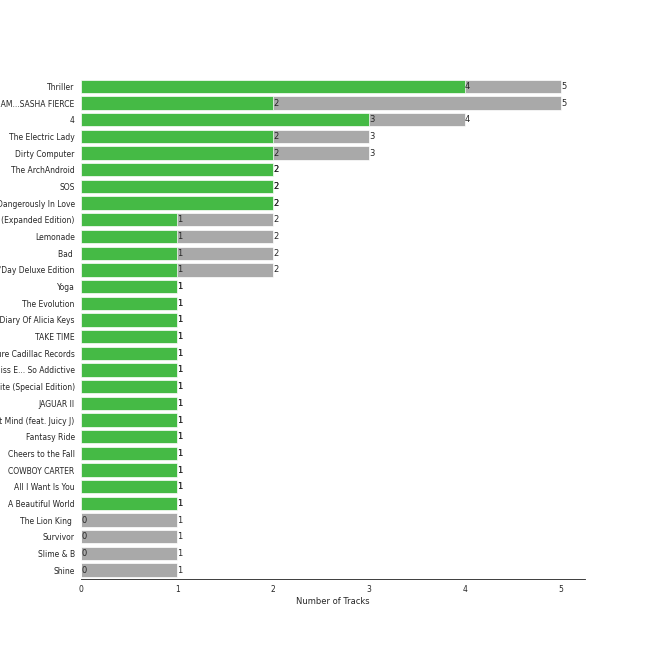

# r&b

[46 songs](tracks.md)

[See Track Features](audio_features.md)

[See Clusters](clusters/overview.md)

## Top Artists

| Art | Tracks | 💚 | Artist | 🔗 |
|:---|---:|---:|:---|:---|
|  | 15 | 8 | [Beyoncé](../../artists/beyonc_/overview.md) | [🔗](https://open.spotify.com/artist/6vWDO969PvNqNYHIOW5v0m) |
|  | 8 | 5 | [Michael Jackson](../../artists/michael_jackson/overview.md) | [🔗](https://open.spotify.com/artist/3fMbdgg4jU18AjLCKBhRSm) |
|  | 5 | 5 | [Janelle Monáe](../../artists/janelle_mon_e/overview.md) | [🔗](https://open.spotify.com/artist/6ueGR6SWhUJfvEhqkvMsVs) |
|  | 4 | 2 | Usher | [🔗](https://open.spotify.com/artist/23zg3TcAtWQy7J6upgbUnj) |
|  | 2 | 1 | Chris Brown | [🔗](https://open.spotify.com/artist/7bXgB6jMjp9ATFy66eO08Z) |
|  | 2 | 1 | Ludacris | [🔗](https://open.spotify.com/artist/3ipn9JLAPI5GUEo4y4jcoi) |
|  | 1 | 1 | SZA | [🔗](https://open.spotify.com/artist/7tYKF4w9nC0nq9CsPZTHyP) |
|  | 1 | 1 | Juicy J | [🔗](https://open.spotify.com/artist/5gCRApTajqwbnHHPbr2Fpi) |
|  | 1 | 1 | Jidenna | [🔗](https://open.spotify.com/artist/4TsHKU8l8Wq7n7OPVikirn) |
|  | 1 | 1 | Alicia Keys | [🔗](https://open.spotify.com/artist/3DiDSECUqqY1AuBP8qtaIa) |

See all 27 artists

| Art | Tracks | 💚 | Artist | 🔗 |
|:---|---:|---:|:---|:---|
|  | 1 | 1 | Miguel | [🔗](https://open.spotify.com/artist/360IAlyVv4PCEVjgyMZrxK) |
|  | 1 | 1 | Big Boi | [🔗](https://open.spotify.com/artist/2ht3wxeT69CzyKFChNnNAB) |
|  | 1 | 1 | Robin Thicke | [🔗](https://open.spotify.com/artist/0ZrpamOxcZybMHGg1AYtHP) |
|  | 1 | 0 | Lil Jon | [🔗](https://open.spotify.com/artist/7sfl4Xt5KmfyDs2T3SVSMK) |
|  | 1 | 0 | Estelle | [🔗](https://open.spotify.com/artist/5T0MSzX9RC5NA6gAI6irSn) |
|  | 1 | 0 | Kanye West | [🔗](https://open.spotify.com/artist/5K4W6rqBFWDnAN6FQUkS6x) |
|  | 1 | 0 | Summer Walker | [🔗](https://open.spotify.com/artist/57LYzLEk2LcFghVwuWbcuS) |
|  | 1 | 0 | Young Thug | [🔗](https://open.spotify.com/artist/50co4Is1HCEo8bhOyUWKpn) |
|  | 1 | 0 | Giveon | [🔗](https://open.spotify.com/artist/4fxd5Ee7UefO4CUXgwJ7IP) |
|  | 1 | 0 | JAY-Z | [🔗](https://open.spotify.com/artist/3nFkdlSjzX9mRTtwJOzDYB) |
|  | 1 | 0 | Cassie | [🔗](https://open.spotify.com/artist/27FGXRNruFoOdf1vP8dqcH) |
|  | 1 | 0 | Ne-Yo | [🔗](https://open.spotify.com/artist/21E3waRsmPlU7jZsS13rcj) |
|  | 1 | 0 | Destiny's Child | [🔗](https://open.spotify.com/artist/1Y8cdNmUJH7yBTd9yOvr5i) |
|  | 1 | 0 | DaniLeigh | [🔗](https://open.spotify.com/artist/0XIKGBo9PnK1ApI5tZA60d) |
|  | 1 | 0 | Pitbull | [🔗](https://open.spotify.com/artist/0TnOYISbd1XYRBk9myaseg) |
|  | 1 | 0 | TLC | [🔗](https://open.spotify.com/artist/0TImkz4nPqjegtVSMZnMRq) |
|  | 1 | 0 | G-Eazy | [🔗](https://open.spotify.com/artist/02kJSzxNuaWGqwubyUba0Z) |

## Top Albums

| Art | Tracks | 💚 | Album | Release Date | 🔗 |
|:---|---:|---:|:---|:---|:---|
|  | 4 | 3 | Thriller | 1982-11-30 | [🔗](https://open.spotify.com/album/2ANVost0y2y52ema1E9xAZ) |
|  | 4 | 3 | 4 | 2011-06-24 | [🔗](https://open.spotify.com/album/1gIC63gC3B7o7FfpPACZQJ) |
|  | 4 | 2 | I AM...SASHA FIERCE | 2008-11-14 | [🔗](https://open.spotify.com/album/23Y5wdyP5byMFktZf8AcWU) |
|  | 2 | 2 | Dirty Computer | 2018-04-27 | [🔗](https://open.spotify.com/album/2PjlaxlMunGOUvcRzlTbtE) |
|  | 2 | 1 | Raymond v Raymond (Expanded Edition) | 2010-03-30 | [🔗](https://open.spotify.com/album/6A1F3Fkq5dYeYYNkXflcTX) |
|  | 2 | 1 | Lemonade | 2016-04-23 | [🔗](https://open.spotify.com/album/7dK54iZuOxXFarGhXwEXfF) |
|  | 2 | 1 | Bad (Remastered) | 1987-08-31 | [🔗](https://open.spotify.com/album/3Us57CjssWnHjTUIXBuIeH) |
|  | 2 | 1 | B'Day Deluxe Edition | 2007-05-29 | [🔗](https://open.spotify.com/album/0Zd10MKN5j9KwUST0TdBBB) |
|  | 1 | 1 | Yoga | 2015-03-31 | [🔗](https://open.spotify.com/album/5rzxGeVyCV74SvV5hjLRAU) |
|  | 1 | 1 | The Diary Of Alicia Keys | 2003-12-02 | [🔗](https://open.spotify.com/album/6TqRKHLjDu5QZuC8u5Woij) |

See all 32 albums

| Art | Tracks | 💚 | Album | Release Date | 🔗 |
|:---|---:|---:|:---|:---|:---|
|  | 1 | 1 | The ArchAndroid | 2010-05-17 | [🔗](https://open.spotify.com/album/7MvSB0JTdtl1pSwZcgvYQX) |
|  | 1 | 1 | SOS | 2022-12-08 | [🔗](https://open.spotify.com/album/1nrVofqDRs7cpWXJ49qTnP) |
|  | 1 | 1 | Music From The Motion Picture Cadillac Records | 2008-11-28 | [🔗](https://open.spotify.com/album/4b2zuwf7CPesdiTg1kFDjU) |
|  | 1 | 1 | Metropolis: The Chase Suite (Special Edition) | 2008-08-12 | [🔗](https://open.spotify.com/album/3T3bJi3cvwR5U7ihwgEwF1) |
|  | 1 | 1 | I Don't Mind (feat. Juicy J) | 2014-11-21 | [🔗](https://open.spotify.com/album/5BAqg5IJQ7XFKfdoCiOlJw) |
|  | 1 | 1 | HIStory - PAST, PRESENT AND FUTURE - BOOK I | 1995-06-16 | [🔗](https://open.spotify.com/album/3OBhnTLrvkoEEETjFA3Qfk) |
|  | 1 | 1 | F.A.M.E. (Expanded Edition) | 2011-03-22 | [🔗](https://open.spotify.com/album/6df0qvkMXoyHGt9J8cujZb) |
|  | 1 | 1 | All I Want Is You | 2010-11-26 | [🔗](https://open.spotify.com/album/493HYe7N5pleudEZRyhE7R) |
|  | 1 | 1 | A Beautiful World | 2002-12-13 | [🔗](https://open.spotify.com/album/76wI74XuASLFrY9pUVLhO9) |
|  | 1 | 0 | TAKE TIME | 2020-03-27 | [🔗](https://open.spotify.com/album/1zHR48K6XtWYm6bhrw4J6C) |
|  | 1 | 0 | Survivor | 2001-05-01 | [🔗](https://open.spotify.com/album/480AZOo2VQ1kf3GedAiKV9) |
|  | 1 | 0 | Slime & B | 2020-05-08 | [🔗](https://open.spotify.com/album/7fZKtzZAsfH0kzeTivu5TG) |
|  | 1 | 0 | Shine | 2008-03-31 | [🔗](https://open.spotify.com/album/2zQdtROzQxwRLRbOS4mNx2) |
|  | 1 | 0 | Over It | 2019-10-04 | [🔗](https://open.spotify.com/album/1qgJNWnPIeK9rx7hF8JCPK) |
|  | 1 | 0 | Off the Wall | 1979-08-10 | [🔗](https://open.spotify.com/album/2ZytN2cY4Zjrr9ukb2rqTP) |
|  | 1 | 0 | In My Own Words | 2006-01-01 | [🔗](https://open.spotify.com/album/6gkwOLmk0ALMOjWs5WhAEr) |
|  | 1 | 0 | Fanmail | 1999-02-23 | [🔗](https://open.spotify.com/album/1CvjjpvqVMoyprsf74bpYW) |
|  | 1 | 0 | Dangerously In Love | 2003-06-24 | [🔗](https://open.spotify.com/album/6oxVabMIqCMJRYN1GqR3Vf) |
|  | 1 | 0 | Cravin | 2019-10-18 | [🔗](https://open.spotify.com/album/6c66PBJdg7EWPcFUvLyFFu) |
|  | 1 | 0 | Confessions (Expanded Edition) | 2004-03-23 | [🔗](https://open.spotify.com/album/1RM6MGv6bcl6NrAG8PGoZk) |
|  | 1 | 0 | Cassie (U.S. Version) | 2006-08-07 | [🔗](https://open.spotify.com/album/0j1qzjaJmsF1FkcICf3hRu) |
|  | 1 | 0 | BEYONCÉ [Platinum Edition] | 2014-11-24 | [🔗](https://open.spotify.com/album/2UJwKSBUz6rtW4QLK74kQu) |

## Top Record Labels

| Tracks | 💚 | Label |
|---:|---:|:---|
| 16 | 8 | [Columbia](../../labels/columbia/overview.md) |
| 10 | 6 | [Epic](../../labels/epic/overview.md) |
| 7 | 4 | Parkwood Entertainment |
| 5 | 4 | Bad Boy |
| 5 | 3 | Music World Music |
| 3 | 2 | [RCA Records Label](../../labels/rca_records_label/overview.md) |
| 2 | 2 | Wondaland |
| 2 | 2 | [Jive](../../labels/jive/overview.md) |
| 4 | 1 | LaFace Records |
| 2 | 1 | [Legacy](../../labels/legacy/overview.md) |

See all 22 labels

| Tracks | 💚 | Label |
|---:|---:|:---|
| 1 | 1 | Top Dawg Entertainment |
| 1 | 1 | Nu America Music |
| 1 | 1 | J Records |
| 1 | 0 | Woah Dad! |
| 1 | 0 | Not So Fast |
| 1 | 0 | LVRN |
| 1 | 0 | [Interscope Records](../../labels/interscope_records/overview.md) |
| 1 | 0 | Def Soul |
| 1 | 0 | [Def Jam Recordings](../../labels/def_jam_recordings/overview.md) |
| 1 | 0 | Chris Brown Entertainment |
| 1 | 0 | Arista |
| 1 | 0 | 300 Entertainment |

## Years

| ​ | 10 newest albums | ​​ | 10 oldest albums |
|:---|:---|:---|:---|
|  | SOS (2022-12-08) |  | Off the Wall (1979-08-10) |
|  | Slime & B (2020-05-08) |  | Thriller (1982-11-30) |
|  | TAKE TIME (2020-03-27) |  | Bad (Remastered) (1987-08-31) |
|  | Cravin (2019-10-18) |  | HIStory - PAST, PRESENT AND FUTURE - BOOK I (1995-06-16) |
|  | Over It (2019-10-04) |  | Fanmail (1999-02-23) |
|  | Dirty Computer (2018-04-27) |  | Survivor (2001-05-01) |
|  | Lemonade (2016-04-23) |  | A Beautiful World (2002-12-13) |
|  | Yoga (2015-03-31) |  | Dangerously In Love (2003-06-24) |
|  | BEYONCÉ [Platinum Edition] (2014-11-24) |  | The Diary Of Alicia Keys (2003-12-02) |
|  | I Don't Mind (feat. Juicy J) (2014-11-21) |  | Confessions (Expanded Edition) (2004-03-23) |