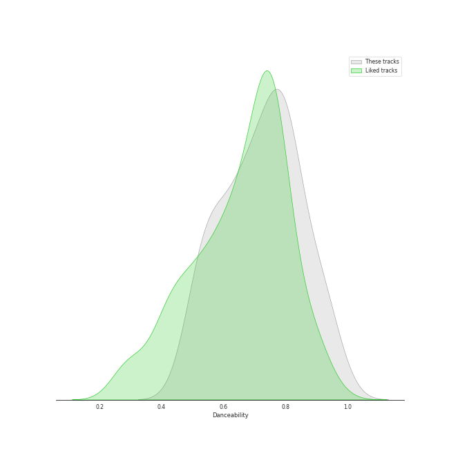
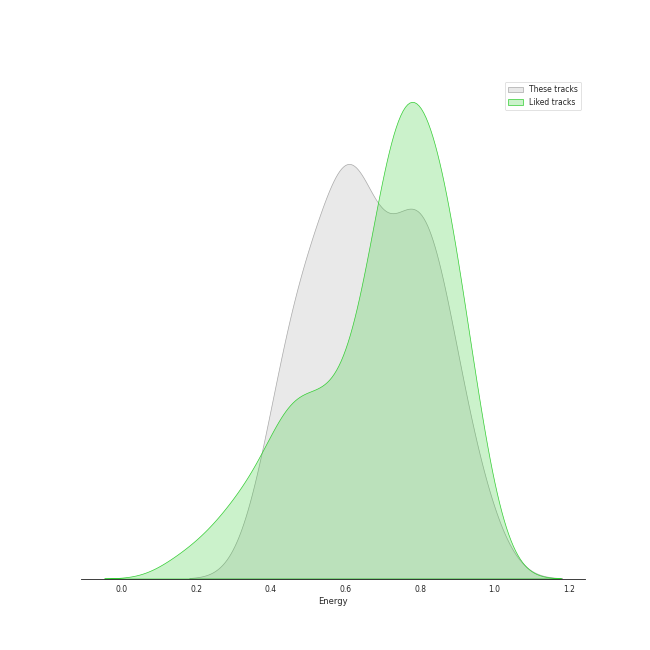
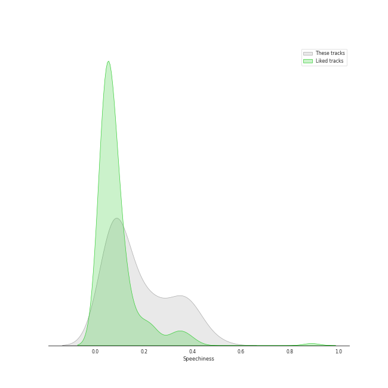
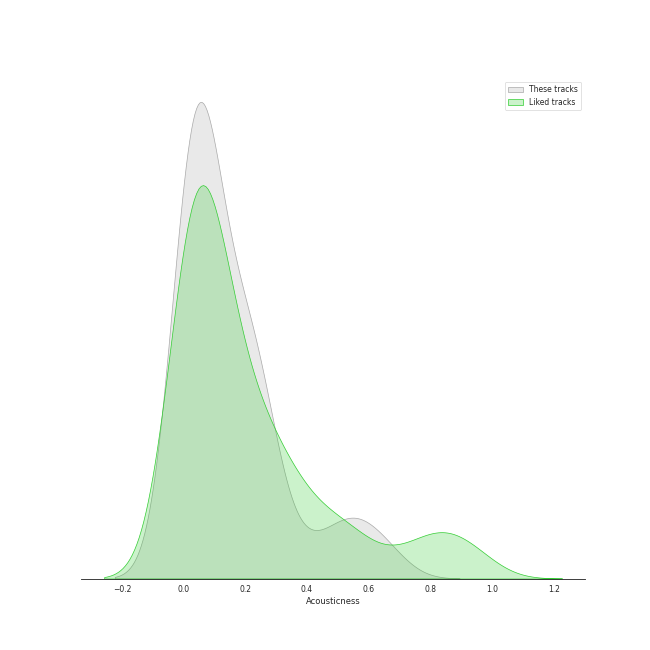
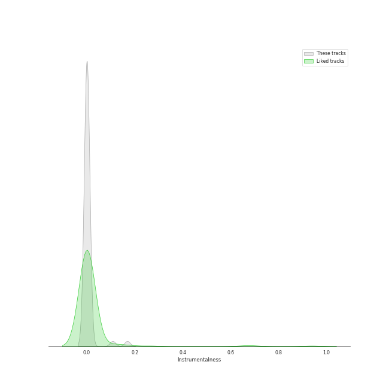
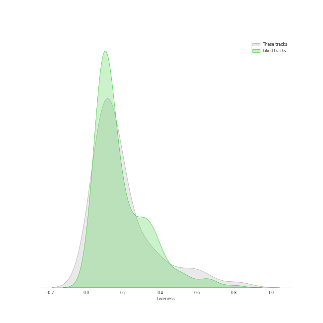
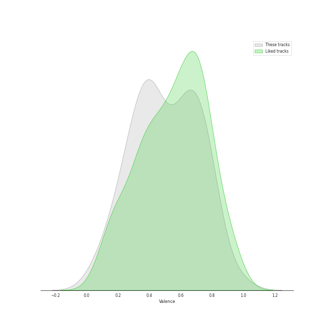
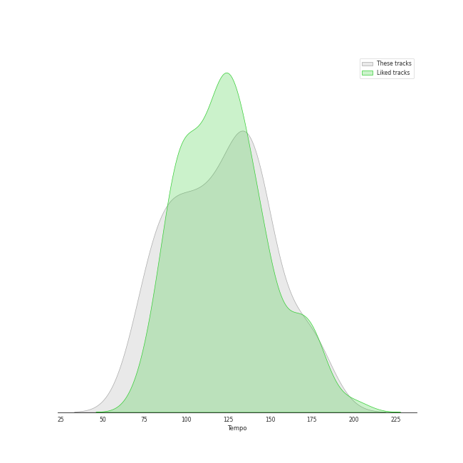

# Track Features for rap

## Danceability

| ​ | 10 most Danceable tracks | ​​ | 10 least Danceable tracks |
|:---|:---|:---|:---|
|  | Anaconda (0.964) |  | Empire State Of Mind (0.491) |
|  | WAP (feat. Megan Thee Stallion) (0.935) |  | Sucker for Pain (with Wiz Khalifa, Imagine Dragons, Logic & Ty Dolla $ign feat. X Ambassadors) (0.502) |
|  | We Made You (0.924) |  | B (0.515) |
|  | Clout (feat. Cardi B) (0.919) |  | United In Grief (0.529) |
|  | HUMBLE. (0.908) |  | All Of The Lights (0.531) |
|  | Yeah! (feat. Lil Jon & Ludacris) (0.894) |  | On To The Next One (0.546) |
|  | I Don't Mind (feat. Juicy J) (0.87) |  | Dior (0.548) |
|  | Work Out (0.831) |  | Body (0.555) |
|  | Area Codes (0.823) |  | Snooze (0.559) |
|  | It's A Vibe (0.822) |  | Wet The Bed (feat. Ludacris) (0.58) |

## Energy

| ​ | 10 most Energetic tracks | ​​ | 10 least Energetic tracks |
|:---|:---|:---|:---|
|  | Hey Ya! (0.974) |  | Area Codes (0.388) |
|  | Empire State Of Mind (0.956) |  | B (0.391) |
|  | Love The Way You Lie (0.925) |  | Work Out (0.427) |
|  | On To The Next One (0.908) |  | Count Me Out (0.431) |
|  | DJ Got Us Fallin' In Love (feat. Pitbull) (0.861) |  | WAP (feat. Megan Thee Stallion) (0.454) |
|  | Super Bass (0.861) |  | I Don't Mind (feat. Juicy J) (0.464) |
|  | Ni**as In Paris (0.858) |  | Momma I Hit A Lick (feat. Kendrick Lamar) (0.467) |
|  | We Made You (0.853) |  | See You Again (feat. Charlie Puth) (0.481) |
|  | The Monster (0.853) |  | It's A Vibe (0.502) |
|  | United In Grief (0.845) |  | Body (0.507) |

## Speechiness

| ​ | 10 most Speechy tracks | ​​ | 10 least Speechy tracks |
|:---|:---|:---|:---|
|  | Area Codes (0.491) |  | Freaky Deaky (0.037) |
|  | On To The Next One (0.417) |  | Everyday (0.0378) |
|  | United In Grief (0.404) |  | Can't Tell Me Nothing (0.039) |
|  | Homicide (feat. Eminem) (0.398) |  | No Hands (feat. Roscoe Dash & Wale) (0.0391) |
|  | Empire State Of Mind (0.392) |  | Kill Bill (0.0391) |
|  | WAP (feat. Megan Thee Stallion) (0.375) |  | Wet The Bed (feat. Ludacris) (0.0429) |
|  | DNA. (0.357) |  | 1-800-273-8255 (0.0479) |
|  | Dior (0.351) |  | B (0.0575) |
|  | Gold Digger (0.348) |  | All The Stars (with SZA) (0.0597) |
|  | Momma I Hit A Lick (feat. Kendrick Lamar) (0.34) |  | Hey Ya! (0.0664) |

## Acousticness

| ​ | 10 most Acoustic tracks | ​​ | 10 least Acoustic tracks |
|:---|:---|:---|:---|
|  | Count Me Out (0.671) |  | HUMBLE. (0.000282) |
|  | Jesus Walks (0.614) |  | DNA. (0.00454) |
|  | 1-800-273-8255 (0.569) |  | No Hands (feat. Roscoe Dash & Wale) (0.00544) |
|  | Crank That (Soulja Boy) (0.515) |  | Lose Yourself (0.00868) |
|  | Break Ya Neck (0.443) |  | Can't Tell Me Nothing (0.0122) |
|  | See You Again (feat. Charlie Puth) (0.369) |  | Wet The Bed (feat. Ludacris) (0.0166) |
|  | Super Bass (0.269) |  | Yeah! (feat. Lil Jon & Ludacris) (0.0183) |
|  | LOVE. FEAT. ZACARI. (0.264) |  | Me, Myself & I (0.0184) |
|  | Sucker for Pain (with Wiz Khalifa, Imagine Dragons, Logic & Ty Dolla $ign feat. X Ambassadors) (0.255) |  | Area Codes (0.0187) |
|  | Body (0.25) |  | Freaky Deaky (0.019) |

## Instrumentalness

| ​ | 10 most Instrumental tracks | ​​ | 10 least Instrumental tracks |
|:---|:---|:---|:---|
|  | Kill Bill (0.144) |  | No Hands (feat. Roscoe Dash & Wale) (0.0) |
|  | Break Ya Neck (0.00175) |  | Please Me (0.0) |
|  | It's A Vibe (0.000887) |  | Can't Tell Me Nothing (0.0) |
|  | Hey Ya! (0.000532) |  | Love The Way You Lie (0.0) |
|  | Lose Yourself (0.000423) |  | Gold Digger (0.0) |
|  | Dior (0.000389) |  | Ni**as In Paris (0.0) |
|  | All The Stars (with SZA) (0.000194) |  | City Girls (0.0) |
|  | HUMBLE. (5.39e-05) |  | Money Trees (0.0) |
|  | Momma I Hit A Lick (feat. Kendrick Lamar) (3.32e-05) |  | Empire State Of Mind (0.0) |
|  | All Of The Lights (1.71e-05) |  | Work Out (0.0) |

## Liveness

| ​ | 10 most Live tracks | ​​ | 10 least Live tracks |
|:---|:---|:---|:---|
|  | Can't Tell Me Nothing (0.82) |  | Yeah! (feat. Lil Jon & Ludacris) (0.0388) |
|  | Sucker for Pain (with Wiz Khalifa, Imagine Dragons, Logic & Ty Dolla $ign feat. X Ambassadors) (0.65) |  | Crank That (Soulja Boy) (0.0468) |
|  | Super Bass (0.601) |  | Gold Digger (0.0554) |
|  | Numb / Encore (0.582) |  | City Girls (0.0554) |
|  | Love The Way You Lie (0.52) |  | Break Ya Neck (0.0613) |
|  | Empire State Of Mind (0.46) |  | See You Again (feat. Charlie Puth) (0.0649) |
|  | Dior (0.408) |  | Everyday (0.0761) |
|  | Lose Yourself (0.359) |  | DJ Got Us Fallin' In Love (feat. Pitbull) (0.082) |
|  | B (0.355) |  | WAP (feat. Megan Thee Stallion) (0.0824) |
|  | Ni**as In Paris (0.349) |  | Alright (0.0827) |

## Valence

| ​ | 10 most Happy tracks | ​​ | 10 least Happy tracks |
|:---|:---|:---|:---|
|  | Hey Ya! (0.965) |  | Lose Yourself (0.0612) |
|  | City Girls (0.815) |  | Can't Tell Me Nothing (0.102) |
|  | Empire State Of Mind (0.811) |  | Work Out (0.216) |
|  | Crank That (Soulja Boy) (0.803) |  | All Of The Lights (0.221) |
|  | LOVE. FEAT. ZACARI. (0.779) |  | Freaky Deaky (0.236) |
|  | Ni**as In Paris (0.775) |  | There Goes My Baby (0.257) |
|  | Homicide (feat. Eminem) (0.77) |  | See You Again (feat. Charlie Puth) (0.283) |
|  | Numb / Encore (0.751) |  | Motley Crew (0.288) |
|  | Sucker for Pain (with Wiz Khalifa, Imagine Dragons, Logic & Ty Dolla $ign feat. X Ambassadors) (0.739) |  | United In Grief (0.331) |
|  | Break Ya Neck (0.737) |  | Body (0.339) |

## Tempo

| ​ | 10 most Fast tracks | ​​ | 10 least Fast tracks |
|:---|:---|:---|:---|
|  | Momma I Hit A Lick (feat. Kendrick Lamar) (179.974) |  | Money Trees (71.994) |
|  | Empire State Of Mind (173.585) |  | It's A Vibe (73.003) |
|  | Lose Yourself (171.374) |  | There Goes My Baby (77.468) |
|  | Sucker for Pain (with Wiz Khalifa, Imagine Dragons, Logic & Ty Dolla $ign feat. X Ambassadors) (169.021) |  | Hey Ya! (79.526) |
|  | Area Codes (154.569) |  | See You Again (feat. Charlie Puth) (80.025) |
|  | HUMBLE. (150.011) |  | Can't Tell Me Nothing (80.029) |
|  | Everyday (149.908) |  | Break Ya Neck (83.011) |
|  | B (144.487) |  | United In Grief (85.63) |
|  | Snooze (143.008) |  | Love The Way You Lie (86.989) |
|  | All Of The Lights (142.113) |  | Jesus Walks (87.312) |
