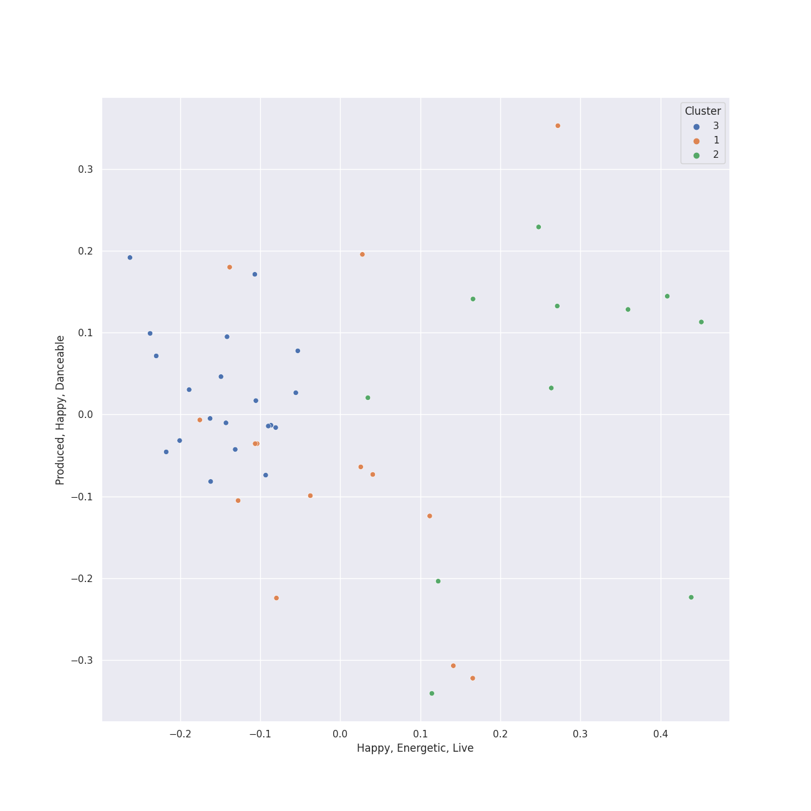

# Clusters in rap

## Cluster #1

26 tracks

| Art | Track | Album | Artists | Label | Rank | 💚 | 🔗 |
|:---|:---|:---|:---|:---|---:|:---|:---|
|  | No Hands (feat. Roscoe Dash & Wale) | Flockaveli | Waka Flocka Flame, Roscoe Dash, Wale | [Asylum/Warner Records](../../../../labels/warner_records) | nan | 💚 | [🔗](https://open.spotify.com/track/03tqyYWC9Um2ZqU0ZN849H) |
|  | Money Trees | good kid, m.A.A.d city | [Kendrick Lamar](../../../../artists/kendrick_lamar/overview.md), Jay Rock | [Aftermath](../../../../labels/aftermath) | nan | | [🔗](https://open.spotify.com/track/2HbKqm4o0w5wEeEFXm2sD4) |
|  | Snooze | SOS | SZA | [Top Dawg Entertainment/RCA Records](../../../../labels/rca_records_label) | nan | 💚 | [🔗](https://open.spotify.com/track/4iZ4pt7kvcaH6Yo8UoZ4s2) |
|  | Me, Myself & I | When It's Dark Out | G-Eazy, Bebe Rexha | [BPG/RVG/RCA Records](../../../../labels/rca_records_label) | nan | 💚 | [🔗](https://open.spotify.com/track/40YcuQysJ0KlGQTeGUosTC) |
|  | Motley Crew | Motley Crew | Post Malone | [Republic Records](../../../../labels/republic_records) | nan | | [🔗](https://open.spotify.com/track/40uMIn2zJLAQhNXghRjBed) |
|  | There Goes My Baby | Raymond v Raymond (Expanded Edition) | USHER | LaFace Records | nan | 💚 | [🔗](https://open.spotify.com/track/6IUiqtI8tE49sqGbmtrNd8) |
|  | Everyday | Bobby Tarantino II | Logic, Marshmello | [Def Jam Recordings](../../../../labels/def_jam_recordings) | nan | | [🔗](https://open.spotify.com/track/4EAV2cKiqKP5UPZmY6dejk) |
|  | B | SYRE | Jaden | MSFTS/Roc Nation | nan | 💚 | [🔗](https://open.spotify.com/track/4PvVX27CitqLAamcc0PCRU) |
|  | Clout (feat. Cardi B) | FATHER OF 4 | Offset, Cardi B | [Quality Control Music/Motown Records](../../../../labels/motown) | nan | 💚 | [🔗](https://open.spotify.com/track/59ywHNwwchG4nZJMLyxSzd) |
|  | Body | Over It | Summer Walker | [LVRN/Interscope Records](../../../../labels/interscope_records) | nan | | [🔗](https://open.spotify.com/track/7vxLj7MREliG5i5vSnqSVr) |
## Cluster #2

8 tracks

| Art | Track | Album | Artists | Label | Rank | 💚 | 🔗 |
|:---|:---|:---|:---|:---|---:|:---|:---|
|  | Jesus Walks | The College Dropout | Kanye West | Roc-A-Fella | nan | | [🔗](https://open.spotify.com/track/5g1vtHqi9uV7xtYeCcFOBx) |
|  | Love The Way You Lie | Recovery | [Eminem](../../../../artists/eminem/overview.md), [Rihanna](../../../../artists/rihanna/overview.md) | [Aftermath](../../../../labels/aftermath) | nan | 💚 | [🔗](https://open.spotify.com/track/15JINEqzVMv3SvJTAXAKED) |
|  | Ni**as In Paris | Watch The Throne | JAY-Z, Kanye West | Roc Nation/RocAFella/IDJ | nan | | [🔗](https://open.spotify.com/track/1auxYwYrFRqZP7t3s7w4um) |
|  | Empire State Of Mind | The Blueprint 3 | JAY-Z, Alicia Keys | Roc Nation / Jay-Z | nan | | [🔗](https://open.spotify.com/track/2igwFfvr1OAGX9SKDCPBwO) |
|  | Numb / Encore | Numb / Encore: MTV Ultimate Mash-Ups Presents Collision Course | JAY-Z, Linkin Park | [Warner Records/Roc-A-Fella](../../../../labels/warner_records) | nan | | [🔗](https://open.spotify.com/track/5sNESr6pQfIhL3krM8CtZn) |
|  | Super Bass | Pink Friday | Nicki Minaj | Nicki Minaj/Cash Money | nan | 💚 | [🔗](https://open.spotify.com/track/2jSwKQBouf0brIcxGfA9CZ) |
|  | Sucker for Pain (with Wiz Khalifa, Imagine Dragons, Logic & Ty Dolla $ign feat. X Ambassadors) | Sucker for Pain (with Logic & Ty Dolla $ign feat. X Ambassadors) | Lil Wayne, Wiz Khalifa, Imagine Dragons, X Ambassadors, Logic, Ty Dolla $ign | [Atlantic Records](../../../../labels/atlantic_records) | nan | | [🔗](https://open.spotify.com/track/4dASQiO1Eoo3RJvt74FtXB) |
|  | Dior | Meet The Woo | Pop Smoke | [Victor Victor Worldwide/Republic Records](../../../../labels/republic_records) | nan | | [🔗](https://open.spotify.com/track/79s5XnCN4TJKTVMSmOx8Ep) |
## Cluster #3

19 tracks

| Art | Track | Album | Artists | Label | Rank | 💚 | 🔗 |
|:---|:---|:---|:---|:---|---:|:---|:---|
|  | Please Me | Please Me | Cardi B, [Bruno Mars](../../../../artists/bruno_mars/overview.md) | [Atlantic/KSR](../../../../labels/atlantic_records) | nan | 💚 | [🔗](https://open.spotify.com/track/0PG9fbaaHFHfre2gUVo7AN) |
|  | The Monster | The Marshall Mathers LP2 | [Eminem](../../../../artists/eminem/overview.md), [Rihanna](../../../../artists/rihanna/overview.md) | [Aftermath](../../../../labels/aftermath) | 495 | 💚 | [🔗](https://open.spotify.com/track/48RrDBpOSSl1aLVCalGl5C) |
|  | We Made You | Relapse: Refill | [Eminem](../../../../artists/eminem/overview.md) | [Aftermath](../../../../labels/aftermath) | 616 | 💚 | [🔗](https://open.spotify.com/track/4UMTp91LHhvW33ol9ZQH0Q) |
|  | All The Stars (with SZA) | Black Panther The Album Music From And Inspired By | [Kendrick Lamar](../../../../artists/kendrick_lamar/overview.md), SZA | Black Panther (TDE/DMG) PS | nan | 💚 | [🔗](https://open.spotify.com/track/3GCdLUSnKSMJhs4Tj6CV3s) |
|  | Alright | To Pimp A Butterfly | [Kendrick Lamar](../../../../artists/kendrick_lamar/overview.md) | [Aftermath](../../../../labels/aftermath) | nan | | [🔗](https://open.spotify.com/track/3iVcZ5G6tvkXZkZKlMpIUs) |
|  | LOVE. FEAT. ZACARI. | DAMN. | [Kendrick Lamar](../../../../artists/kendrick_lamar/overview.md), Zacari | [Aftermath](../../../../labels/aftermath) | nan | 💚 | [🔗](https://open.spotify.com/track/6PGoSes0D9eUDeeAafB2As) |
|  | Anaconda | The Pinkprint (Deluxe) | Nicki Minaj | Nicki Minaj/Cash Money | nan | | [🔗](https://open.spotify.com/track/794F99D5BQHS5ZGRXAs7I5) |
|  | DJ Got Us Fallin' In Love (feat. Pitbull) | Raymond v Raymond (Expanded Edition) | USHER, Pitbull | LaFace Records | nan | | [🔗](https://open.spotify.com/track/4356Typ82hUiFAynbLYbPn) |
|  | Yeah! (feat. Lil Jon & Ludacris) | Confessions (Expanded Edition) | USHER, Lil Jon, Ludacris | LaFace Records | nan | | [🔗](https://open.spotify.com/track/5rb9QrpfcKFHM1EUbSIurX) |
|  | Sweetest Pie | Sweetest Pie | Megan Thee Stallion, [Dua Lipa](../../../../artists/dua_lipa/overview.md) | 300 Entertainment | nan | 💚 | [🔗](https://open.spotify.com/track/7mFj0LlWtEJaEigguaWqYh) |