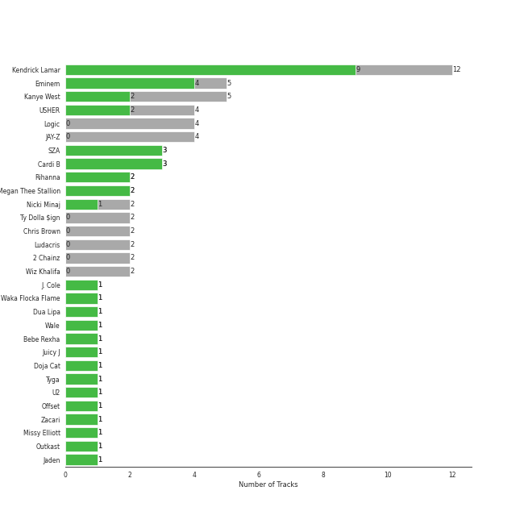
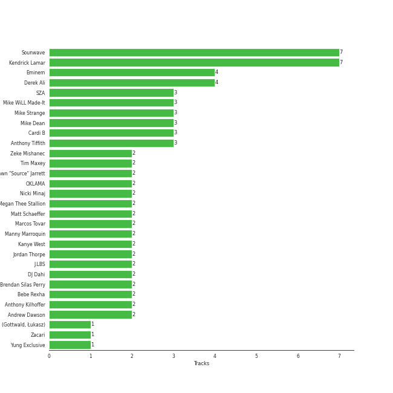
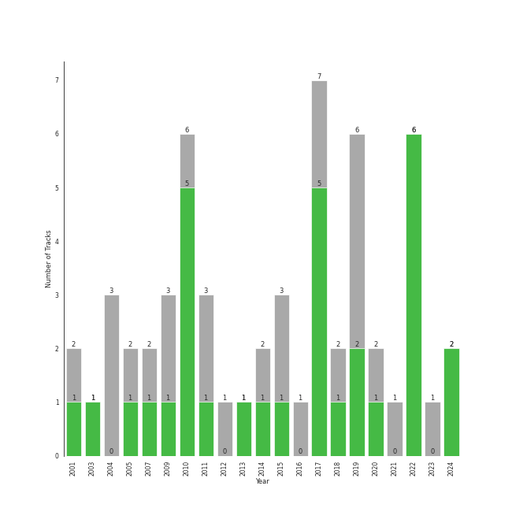

# rap

49 songs

[See Track Features](audio_features.md)

[See Clusters](clusters/overview.md)

## Top Artists

| Art | Tracks | 💚 | Artist | 🔗 |
|:---|---:|---:|:---|:---|
|  | 5 | 4 | Eminem | [🔗](https://open.spotify.com/artist/7dGJo4pcD2V6oG8kP0tJRR) |
|  | 3 | 3 | Cardi B | [🔗](https://open.spotify.com/artist/4kYSro6naA4h99UJvo89HB) |
|  | 5 | 2 | Kanye West | [🔗](https://open.spotify.com/artist/5K4W6rqBFWDnAN6FQUkS6x) |
|  | 5 | 2 | Kendrick Lamar | [🔗](https://open.spotify.com/artist/2YZyLoL8N0Wb9xBt1NhZWg) |
|  | 4 | 2 | USHER | [🔗](https://open.spotify.com/artist/23zg3TcAtWQy7J6upgbUnj) |
|  | 3 | 2 | SZA | [🔗](https://open.spotify.com/artist/7tYKF4w9nC0nq9CsPZTHyP) |
|  | 2 | 2 | [Rihanna](../../artists/rihanna/overview.md) | [🔗](https://open.spotify.com/artist/5pKCCKE2ajJHZ9KAiaK11H) |
|  | 2 | 2 | Megan Thee Stallion | [🔗](https://open.spotify.com/artist/181bsRPaVXVlUKXrxwZfHK) |
|  | 2 | 1 | Nicki Minaj | [🔗](https://open.spotify.com/artist/0hCNtLu0JehylgoiP8L4Gh) |
|  | 1 | 1 | J. Cole | [🔗](https://open.spotify.com/artist/6l3HvQ5sa6mXTsMTB19rO5) |

See all 51 artists

| Art | Tracks | 💚 | Artist | 🔗 |
|:---|---:|---:|:---|:---|
|  | 1 | 1 | Waka Flocka Flame | [🔗](https://open.spotify.com/artist/6f4XkbvYlXMH0QgVRzW0sM) |
|  | 1 | 1 | [Dua Lipa](../../artists/dua_lipa/overview.md) | [🔗](https://open.spotify.com/artist/6M2wZ9GZgrQXHCFfjv46we) |
|  | 1 | 1 | Wale | [🔗](https://open.spotify.com/artist/67nwj3Y5sZQLl72VNUHEYE) |
|  | 1 | 1 | Bebe Rexha | [🔗](https://open.spotify.com/artist/64M6ah0SkkRsnPGtGiRAbb) |
|  | 1 | 1 | Juicy J | [🔗](https://open.spotify.com/artist/5gCRApTajqwbnHHPbr2Fpi) |
|  | 1 | 1 | [Doja Cat](../../artists/doja_cat/overview.md) | [🔗](https://open.spotify.com/artist/5cj0lLjcoR7YOSnhnX0Po5) |
|  | 1 | 1 | Tyga | [🔗](https://open.spotify.com/artist/5LHRHt1k9lMyONurDHEdrp) |
|  | 1 | 1 | Offset | [🔗](https://open.spotify.com/artist/4DdkRBBYG6Yk9Ka8tdJ9BW) |
|  | 1 | 1 | Jaden | [🔗](https://open.spotify.com/artist/0xOeVMOz2fVg5BJY3N6akT) |
|  | 1 | 1 | [Bruno Mars](../../artists/bruno_mars/overview.md) | [🔗](https://open.spotify.com/artist/0du5cEVh5yTK9QJze8zA0C) |
|  | 1 | 1 | Roscoe Dash | [🔗](https://open.spotify.com/artist/0bfX8pF8kuHNCs57Ms4jZb) |
|  | 1 | 1 | G-Eazy | [🔗](https://open.spotify.com/artist/02kJSzxNuaWGqwubyUba0Z) |
|  | 4 | 0 | Logic | [🔗](https://open.spotify.com/artist/4xRYI6VqpkE3UwrDrAZL8L) |
|  | 4 | 0 | JAY-Z | [🔗](https://open.spotify.com/artist/3nFkdlSjzX9mRTtwJOzDYB) |
|  | 2 | 0 | Ty Dolla $ign | [🔗](https://open.spotify.com/artist/7c0XG5cIJTrrAgEC3ULPiq) |
|  | 2 | 0 | Chris Brown | [🔗](https://open.spotify.com/artist/7bXgB6jMjp9ATFy66eO08Z) |
|  | 2 | 0 | Ludacris | [🔗](https://open.spotify.com/artist/3ipn9JLAPI5GUEo4y4jcoi) |
|  | 2 | 0 | 2 Chainz | [🔗](https://open.spotify.com/artist/17lzZA2AlOHwCwFALHttmp) |
|  | 2 | 0 | Wiz Khalifa | [🔗](https://open.spotify.com/artist/137W8MRPWKqSmrBGDBFSop) |
|  | 1 | 0 | Lil Jon | [🔗](https://open.spotify.com/artist/7sfl4Xt5KmfyDs2T3SVSMK) |
|  | 1 | 0 | Jamie Foxx | [🔗](https://open.spotify.com/artist/7LnaAXbDVIL75IVPnndf7w) |
|  | 1 | 0 | Linkin Park | [🔗](https://open.spotify.com/artist/6XyY86QOPPrYVGvF9ch6wz) |
|  | 1 | 0 | Charlie Puth | [🔗](https://open.spotify.com/artist/6VuMaDnrHyPL1p4EHjYLi7) |
|  | 1 | 0 | Khalid | [🔗](https://open.spotify.com/artist/6LuN9FCkKOj5PcnpouEgny) |
|  | 1 | 0 | Soulja Boy | [🔗](https://open.spotify.com/artist/6GMYJwaziB4ekv1Y6wCDWS) |
|  | 1 | 0 | Marshmello | [🔗](https://open.spotify.com/artist/64KEffDW9EtZ1y2vBYgq8T) |
|  | 1 | 0 | Jhené Aiko | [🔗](https://open.spotify.com/artist/5ZS223C6JyBfXasXxrRqOk) |
|  | 1 | 0 | Summer Walker | [🔗](https://open.spotify.com/artist/57LYzLEk2LcFghVwuWbcuS) |
|  | 1 | 0 | Lil Wayne | [🔗](https://open.spotify.com/artist/55Aa2cqylxrFIXC767Z865) |
|  | 1 | 0 | Imagine Dragons | [🔗](https://open.spotify.com/artist/53XhwfbYqKCa1cC15pYq2q) |
|  | 1 | 0 | Young Thug | [🔗](https://open.spotify.com/artist/50co4Is1HCEo8bhOyUWKpn) |
|  | 1 | 0 | X Ambassadors | [🔗](https://open.spotify.com/artist/3NPpFNZtSTHheNBaWC82rB) |
|  | 1 | 0 | Alicia Keys | [🔗](https://open.spotify.com/artist/3DiDSECUqqY1AuBP8qtaIa) |
|  | 1 | 0 | Alessia Cara | [🔗](https://open.spotify.com/artist/2wUjUUtkb5lvLKcGKsKqsR) |
|  | 1 | 0 | Trey Songz | [🔗](https://open.spotify.com/artist/2iojnBLj0qIMiKPvVhLnsH) |
|  | 1 | 0 | Swizz Beatz | [🔗](https://open.spotify.com/artist/2cADQgiLMjNhbsfeN52Bf3) |
|  | 1 | 0 | Post Malone | [🔗](https://open.spotify.com/artist/246dkjvS1zLTtiykXe5h60) |
|  | 1 | 0 | Busta Rhymes | [🔗](https://open.spotify.com/artist/1YfEcTuGvBQ8xSD1f53UnK) |
|  | 1 | 0 | Kaliii | [🔗](https://open.spotify.com/artist/1YRqgFNXqRyMDRr8ClS1NL) |
|  | 1 | 0 | Pop Smoke | [🔗](https://open.spotify.com/artist/0eDvMgVFoNV3TpwtrVCoTj) |
|  | 1 | 0 | Pitbull | [🔗](https://open.spotify.com/artist/0TnOYISbd1XYRBk9myaseg) |

## Most and least listened tracks
| ​ | Most listened tracks | Score | ​​ | Least listened tracks | Score |
|:---|:---|---:|:---|:---|---:|
|  | Kill Bill | 415 |  | No Hands (feat. Roscoe Dash & Wale) | 0 |
|  | The Monster | 80 |  | Please Me | 0 |
|  | We Made You | 28 |  | Can't Tell Me Nothing | 0 |
|  | Body | 0 |  | Love The Way You Lie | 0 |
|  | Area Codes | 0 |  | Gold Digger | 0 |
|  | Sweetest Pie | 0 |  | Kill Bill | 0 |
|  | Momma I Hit A Lick (feat. Kendrick Lamar) | 0 |  | City Girls | 0 |
|  | Break Ya Neck | 0 |  | All Of The Lights | 0 |
|  | I Don't Mind (feat. Juicy J) | 0 |  | See You Again (feat. Charlie Puth) | 0 |
|  | Homicide (feat. Eminem) | 0 |  | Empire State Of Mind | 0 |

## Top Albums

| Art | Tracks | 💚 | Album | Release Date | 🔗 |
|:---|---:|---:|:---|:---|:---|
|  | 2 | 2 | Mr. Morale & The Big Steppers | 2022-05-13 | [🔗](https://open.spotify.com/album/79ONNoS4M9tfIA1mYLBYVX) |
|  | 2 | 1 | SOS | 2022-12-09 | [🔗](https://open.spotify.com/album/07w0rG5TETcyihsEIZR3qG) |
|  | 2 | 1 | Raymond v Raymond (Expanded Edition) | 2010-03-30 | [🔗](https://open.spotify.com/album/6A1F3Fkq5dYeYYNkXflcTX) |
|  | 2 | 0 | The Blueprint 3 | 2009-09-08 | [🔗](https://open.spotify.com/album/2CUT0104gySOIvqwtXeFsX) |
|  | 1 | 1 | When It's Dark Out | 2015-12-04 | [🔗](https://open.spotify.com/album/09Q3WwGYsQe5ognkvVkmCu) |
|  | 1 | 1 | WAP (feat. Megan Thee Stallion) | 2020-08-07 | [🔗](https://open.spotify.com/album/2ogiazbrNEx0kQHGl5ZBTQ) |
|  | 1 | 1 | The Marshall Mathers LP2 | 2013-11-05 | [🔗](https://open.spotify.com/album/3vOgbDjgsZBAPwV2M3bNOj) |
|  | 1 | 1 | Sweetest Pie | 2022-03-11 | [🔗](https://open.spotify.com/album/4qw41n8iWrdR70Ui3hYBPv) |
|  | 1 | 1 | SYRE | 2017-11-17 | [🔗](https://open.spotify.com/album/4IFpj2jyRcugt1yzH82m3E) |
|  | 1 | 1 | SOS | 2022-12-08 | [🔗](https://open.spotify.com/album/1nrVofqDRs7cpWXJ49qTnP) |

See all 45 albums

| Art | Tracks | 💚 | Album | Release Date | 🔗 |
|:---|---:|---:|:---|:---|:---|
|  | 1 | 1 | SHADYXV | 2014-11-24 | [🔗](https://open.spotify.com/album/6wdSf72duVewXTqhYU3Z87) |
|  | 1 | 1 | Relapse: Refill | 2009-05-15 | [🔗](https://open.spotify.com/album/7MZzYkbHL9Tk3O6WeD4Z0Z) |
|  | 1 | 1 | Recovery | 2010-06-18 | [🔗](https://open.spotify.com/album/47BiFcV59TQi2s9SkBo2pb) |
|  | 1 | 1 | Please Me | 2019-02-15 | [🔗](https://open.spotify.com/album/5a4sJJ3qjn6hqRsvm0Veso) |
|  | 1 | 1 | Pink Friday | 2010-01-01 | [🔗](https://open.spotify.com/album/5jem47f4IRH6UaxNAWO6vD) |
|  | 1 | 1 | My Beautiful Dark Twisted Fantasy | 2010-11-22 | [🔗](https://open.spotify.com/album/20r762YmB5HeofjMCiPMLv) |
|  | 1 | 1 | I Don't Mind (feat. Juicy J) | 2014-11-21 | [🔗](https://open.spotify.com/album/5BAqg5IJQ7XFKfdoCiOlJw) |
|  | 1 | 1 | Graduation | 2007-09-11 | [🔗](https://open.spotify.com/album/4SZko61aMnmgvNhfhgTuD3) |
|  | 1 | 1 | Freaky Deaky | 2022-02-25 | [🔗](https://open.spotify.com/album/05oVghsqITa33yHnbW7uPz) |
|  | 1 | 1 | Flockaveli | 2010-10-01 | [🔗](https://open.spotify.com/album/6MQtWELG7aRX7CkAzQ6nLM) |
|  | 1 | 1 | FATHER OF 4 | 2019-02-22 | [🔗](https://open.spotify.com/album/6bPpXqJRpjwy0hLyUGtzYc) |
|  | 1 | 1 | Cole World: The Sideline Story | 2011-09-27 | [🔗](https://open.spotify.com/album/0fhmJYVhW0e4i33pCLPA5i) |
|  | 1 | 0 | souljaboytellem.com | 2007-01-01 | [🔗](https://open.spotify.com/album/5wFQi4xOTXILQSKQr0Ft8s) |
|  | 1 | 0 | Watch The Throne (Deluxe) | 2011-08-08 | [🔗](https://open.spotify.com/album/2P2Xwvh2xWXIZ1OWY9S9o5) |
|  | 1 | 0 | To Pimp A Butterfly | 2015-03-16 | [🔗](https://open.spotify.com/album/7ycBtnsMtyVbbwTfJwRjSP) |
|  | 1 | 0 | The Pinkprint (Deluxe) | 2014-12-15 | [🔗](https://open.spotify.com/album/5ooCuPIk58IwSo6DRr1JCu) |
|  | 1 | 0 | The College Dropout | 2004-02-10 | [🔗](https://open.spotify.com/album/4Uv86qWpGTxf7fU7lG5X6F) |
|  | 1 | 0 | Sucker for Pain (with Logic & Ty Dolla $ign feat. X Ambassadors) | 2016-06-24 | [🔗](https://open.spotify.com/album/704GHNtZhEe9TBgleCNNGv) |
|  | 1 | 0 | Slime & B | 2020-05-08 | [🔗](https://open.spotify.com/album/7fZKtzZAsfH0kzeTivu5TG) |
|  | 1 | 0 | See You Again (feat. Charlie Puth) | 2015 | [🔗](https://open.spotify.com/album/5FXIqS1XqbpfOKNoi5VUwS) |
|  | 1 | 0 | Rap Or Go To The League | 2019-03-01 | [🔗](https://open.spotify.com/album/1BR69wIifGZUSimcuTjWVg) |
|  | 1 | 0 | Pretty Girls Like Trap Music | 2017-06-16 | [🔗](https://open.spotify.com/album/5vvvo79z68vWj9yimoygfS) |
|  | 1 | 0 | Over It | 2019-10-04 | [🔗](https://open.spotify.com/album/1qgJNWnPIeK9rx7hF8JCPK) |
|  | 1 | 0 | Numb / Encore: MTV Ultimate Mash-Ups Presents Collision Course | 2004-11-30 | [🔗](https://open.spotify.com/album/4lhyg7YGQagE8FT8cZBqyw) |
|  | 1 | 0 | Motley Crew | 2021-07-09 | [🔗](https://open.spotify.com/album/4tokbQaFXRrq8keVGBD9vb) |
|  | 1 | 0 | Meet The Woo | 2019-07-26 | [🔗](https://open.spotify.com/album/6d1vGZsr6Uy3h9IigBpPAf) |
|  | 1 | 0 | Late Registration | 2005-08-30 | [🔗](https://open.spotify.com/album/5ll74bqtkcXlKE7wwkMq4g) |
|  | 1 | 0 | Genesis | 2001-11-07 | [🔗](https://open.spotify.com/album/6cj1gdwhr2MVJr9YnWghUd) |
|  | 1 | 0 | F.A.M.E. (Expanded Edition) | 2011-03-22 | [🔗](https://open.spotify.com/album/6df0qvkMXoyHGt9J8cujZb) |
|  | 1 | 0 | Everybody | 2017-05-05 | [🔗](https://open.spotify.com/album/1HiN2YXZcc3EjmVZ4WjfBk) |
|  | 1 | 0 | DAMN. | 2017-04-14 | [🔗](https://open.spotify.com/album/4eLPsYPBmXABThSJ821sqY) |
|  | 1 | 0 | Confessions of a Dangerous Mind | 2019-05-10 | [🔗](https://open.spotify.com/album/0XLwImzaZEtqHE4NHAepDz) |
|  | 1 | 0 | Confessions (Expanded Edition) | 2004-03-23 | [🔗](https://open.spotify.com/album/1RM6MGv6bcl6NrAG8PGoZk) |
|  | 1 | 0 | Bobby Tarantino II | 2018-03-09 | [🔗](https://open.spotify.com/album/4F87p1aiFwHeU4uu65MaPV) |
|  | 1 | 0 | Area Codes | 2023-03-17 | [🔗](https://open.spotify.com/album/6uk3hBYbrMsSzufADPjv9K) |

## Top Record Labels

| Tracks | 💚 | Label |
|---:|---:|:---|
| 7 | 5 | [RCA Records Label](../../labels/rca_records_label/overview.md) |
| 7 | 5 | Aftermath |
| 5 | 4 | Top Dawg Entertainment |
| 5 | 2 | Roc-A-Fella |
| 5 | 2 | Roc Nation |
| 5 | 2 | [Atlantic Records](../../labels/atlantic_records/overview.md) |
| 4 | 2 | [Interscope Records](../../labels/interscope_records/overview.md) |
| 2 | 2 | pgLang |
| 2 | 2 | KSR |
| 3 | 1 | LaFace Records |

See all 39 labels

| Tracks | 💚 | Label |
|---:|---:|:---|
| 2 | 1 | [Warner Records](../../labels/warner_records/overview.md) |
| 2 | 1 | Nicki Minaj |
| 2 | 1 | Cash Money |
| 2 | 1 | 300 Entertainment |
| 1 | 1 | RVG |
| 1 | 1 | Quality Control Music |
| 1 | 1 | MSFTS |
| 1 | 1 | [MOTOWN](../../labels/motown/overview.md) |
| 1 | 1 | Last Kings Music |
| 1 | 1 | Kemosabe Records |
| 1 | 1 | EMPIRE |
| 1 | 1 | BPG |
| 1 | 1 | Asylum |
| 1 | 1 | 3H |
| 4 | 0 | [Def Jam Recordings](../../labels/def_jam_recordings/overview.md) |
| 2 | 0 | [Republic Records](../../labels/republic_records/overview.md) |
| 2 | 0 | Jay-Z |
| 1 | 0 | Victor Victor Worldwide |
| 1 | 0 | RocAFella |
| 1 | 0 | [Legacy](../../labels/legacy/overview.md) |
| 1 | 0 | LVRN |
| 1 | 0 | [Jive](../../labels/jive/overview.md) |
| 1 | 0 | J Records |
| 1 | 0 | IDJ |
| 1 | 0 | Gamebread |
| 1 | 0 | Def Jam |
| 1 | 0 | Collipark |
| 1 | 0 | Chris Brown Entertainment |
| 1 | 0 | 2Chainz PS |

## Top Producers

| Art | Producer | Tracks | Credit Types |
|:---|:---|---:|:---|
|  | Eminem | 4 | Producer, Songwriter |
|  | Cardi B | 3 | Songwriter |
| | Mike Strange | 3 | Producer |
| | Mike Dean | 3 | Producer, Arranger |
| | OKLAMA | 2 | Producer |
| | Tim Maxey | 2 | Producer, Songwriter |
| | Manny Marroquin | 2 | Producer |
| | Anthony Kilhoffer | 2 | Producer |
| | Jordan Thorpe | 2 | Songwriter |
|  | Bebe Rexha | 2 | Songwriter, Producer |

View all

| Art | Producer | Tracks | Credit Types |
|:---|:---|---:|:---|
|  | Kanye West | 2 | Producer, Songwriter |
| | J.LBS | 2 | Producer, Songwriter |
|  | Nicki Minaj | 2 | Songwriter |
|  | Megan Thee Stallion | 2 | Songwriter |
| | Andrew Dawson | 2 | Producer |
| | Shawn "Source" Jarrett | 2 | Producer |
| | Marcos Tovar | 2 | Producer |
| | Sounwave | 2 | Producer, Songwriter |
| | Johnathan Turner | 1 | Producer |
| | Evan LaRay | 1 | Producer |
| | Luis Resto | 1 | Producer, Songwriter |
| | Łukasz Gottwald (Gottwald, Łukasz) | 1 | Songwriter |
| | Kane Beatz | 1 | Producer, Songwriter |
| | James Foye III | 1 | Songwriter |
| | Leslie Brathwaite | 1 | Producer |
|  | [Bruno Mars](../../artists/bruno_mars/overview.md) | 1 | Producer, Songwriter |
| | JMIKE | 1 | Producer, Songwriter |
|  | Offset | 1 | Lyricist, Songwriter |
| | Brent Kolatalo | 1 | Producer |
| | Stephen Kozmeniuk | 1 | Songwriter |
| | Jeff Bhasker | 1 | Producer, Songwriter |
| | Ariel Chobaz | 1 | Producer |
| | Doc Ish | 1 | Producer |
| | Timothy Thomas | 1 | Songwriter |
| | Ray McCullough | 1 | Songwriter |
| | Clarence Coffee Jr. | 1 | Songwriter |
| | Jeremy Reeves | 1 | Songwriter |
| | Tim Gomringer | 1 | Songwriter |
| | Ray Romulus | 1 | Songwriter |
| | Jamal Jones | 1 | Songwriter |
| | KOZ | 1 | Producer |
| | Tony Rey | 1 | Producer |
| | The Stereotypes | 1 | Producer |
| | Mauricio "Veto" Iragorri | 1 | Producer |
| | Lido | 1 | Producer |
| | Danny Morris | 1 | Songwriter |
| | Frank Romano | 1 | Songwriter |
| | Kid Cudi | 1 | Songwriter |
| | Rob Bisel | 1 | Songwriter |
| | Beach Noise | 1 | Producer |
| | Southside | 1 | Producer, Songwriter |
| | Frank Ski | 1 | Songwriter |
| | Platinum Library | 1 | Producer |
| | Jacob Kasher | 1 | Songwriter |
| | Serban Ghenea | 1 | Producer |
| | Christoph Andersson | 1 | Producer, Songwriter |
| | CuBeatz | 1 | Producer |
| | Jim Jonsin | 1 | Songwriter |
|  | Juicy J | 1 | Songwriter |
| | Frequency | 1 | Producer, Songwriter |
| | Ayo the Producer | 1 | Producer, Songwriter |
| | Skylar Grey | 1 | Songwriter |
|  | J. Cole | 1 | Producer |
| | Theron Thomas | 1 | Songwriter |
| | Romano | 1 | Producer |
| | Mark Shick | 1 | Producer |
| | Rico Love | 1 | Songwriter |
| | Steve King | 1 | Producer |
| | Ken Lewis | 1 | Arranger |
| | Jon Bellion | 1 | Songwriter |
| | DJ Toomp | 1 | Producer |
| | Kevin Gomringer | 1 | Songwriter |
|  | SZA | 1 | Songwriter |
| | Carter Lang | 1 | Songwriter |
| | Nija | 1 | Songwriter |
| | Thomas Barnes | 1 | Songwriter |
| | Fergie | 1 | Songwriter |
| | Jeff Bass | 1 | Producer, Songwriter |
| | Aldrin Davis | 1 | Songwriter |
|  | Jaden | 1 | Lyricist, Songwriter |
| | Tommy Danvers | 1 | Producer |
| | Ernest Clark | 1 | Songwriter |
| | James Hunt | 1 | Producer |
| | Marcos Palacios | 1 | Songwriter |
| | Jonathan Yip | 1 | Songwriter |
| | Cirkut | 1 | Songwriter |
| | Alex da Kid | 1 | Producer, Songwriter |
| | Ben Kohn | 1 | Songwriter |
| | Sarah Hudson | 1 | Songwriter |
| | Ester Dean | 1 | Songwriter |
| | Ray Charles Brown, Jr | 1 | Producer |
|  | Sir Mix-A-Lot | 1 | Songwriter |
| | Noah Goldstein | 1 | Producer |
|  | USHER | 1 | Songwriter |
| | Drumma Boy | 1 | Producer |
| | Aalias | 1 | Songwriter |
| | Duval Timothy | 1 | Producer, Songwriter |
| | Peter Kelleher | 1 | Songwriter |
| | Peder Losnegård (Losnegård, Peder) | 1 | Lyricist, Songwriter |
| | Lauren Christy | 1 | Songwriter |

## Years

| ​ | 10 newest albums | ​​ | 10 oldest albums |
|:---|:---|:---|:---|
|  | Area Codes (2023-03-17) |  | Genesis (2001-11-07) |
|  | SOS (2022-12-09) |  | The College Dropout (2004-02-10) |
|  | SOS (2022-12-08) |  | Confessions (Expanded Edition) (2004-03-23) |
|  | Mr. Morale & The Big Steppers (2022-05-13) |  | Numb / Encore: MTV Ultimate Mash-Ups Presents Collision Course (2004-11-30) |
|  | Sweetest Pie (2022-03-11) |  | Late Registration (2005-08-30) |
|  | Freaky Deaky (2022-02-25) |  | souljaboytellem.com (2007-01-01) |
|  | Motley Crew (2021-07-09) |  | Graduation (2007-09-11) |
|  | WAP (feat. Megan Thee Stallion) (2020-08-07) |  | Relapse: Refill (2009-05-15) |
|  | Slime & B (2020-05-08) |  | The Blueprint 3 (2009-09-08) |
|  | Over It (2019-10-04) |  | Pink Friday (2010-01-01) |

