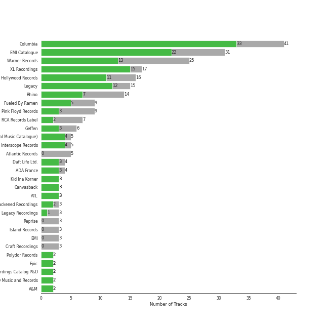

# rock

[158 songs](rock_tracks.md)

## Top Artists

See all 38 artists

| Number of Tracks | Art | Artist | 🔗 |
|---:|:---|:---|:---|
| 31 |  | [The Beatles](../artists/the_beatles.md) | [🔗](https://open.spotify.com/artist/3WrFJ7ztbogyGnTHbHJFl2) |
| 24 |  | [Billy Joel](../artists/billy_joel.md) | [🔗](https://open.spotify.com/artist/6zFYqv1mOsgBRQbae3JJ9e) |
| 18 |  | [Radiohead](../artists/radiohead.md) | [🔗](https://open.spotify.com/artist/4Z8W4fKeB5YxbusRsdQVPb) |
| 14 |  | [Queen](../artists/queen.md) | [🔗](https://open.spotify.com/artist/1dfeR4HaWDbWqFHLkxsg1d) |
| 6 |  | The Who | [🔗](https://open.spotify.com/artist/67ea9eGLXYMsO2eYQRui3w) |
| 6 |  | Fleetwood Mac | [🔗](https://open.spotify.com/artist/08GQAI4eElDnROBrJRGE0X) |
| 5 |  | Simon & Garfunkel | [🔗](https://open.spotify.com/artist/70cRZdQywnSFp9pnc2WTCE) |
| 5 |  | Muse | [🔗](https://open.spotify.com/artist/12Chz98pHFMPJEknJQMWvI) |
| 4 |  | Van Morrison | [🔗](https://open.spotify.com/artist/44NX2ffIYHr6D4n7RaZF7A) |
| 3 |  | Led Zeppelin | [🔗](https://open.spotify.com/artist/36QJpDe2go2KgaRleHCDTp) |
| 3 |  | Journey | [🔗](https://open.spotify.com/artist/0rvjqX7ttXeg3mTy8Xscbt) |
| 2 |  | Aerosmith | [🔗](https://open.spotify.com/artist/7Ey4PD4MYsKc5I2dolUwbH) |
| 2 |  | [The King's Singers](../artists/the_king_s_singers.md) | [🔗](https://open.spotify.com/artist/5lR7yDVN4z9kahOiUSlMhe) |
| 2 |  | Black Sabbath | [🔗](https://open.spotify.com/artist/5M52tdBnJaKSvOpJGz8mfZ) |
| 2 |  | Imagine Dragons | [🔗](https://open.spotify.com/artist/53XhwfbYqKCa1cC15pYq2q) |
| 2 |  | Styx | [🔗](https://open.spotify.com/artist/4salDzkGmfycRqNUbyBphh) |
| 2 |  | Twenty One Pilots | [🔗](https://open.spotify.com/artist/3YQKmKGau1PzlVlkL1iodx) |
| 2 |  | The Monkees | [🔗](https://open.spotify.com/artist/320EPCSEezHt1rtbfwH6Ck) |
| 2 |  | Carole King | [🔗](https://open.spotify.com/artist/319yZVtYM9MBGqmSQnMyY6) |
| 2 |  | Metallica | [🔗](https://open.spotify.com/artist/2ye2Wgw4gimLv2eAKyk1NB) |
| 2 |  | Kansas | [🔗](https://open.spotify.com/artist/2hl0xAkS2AIRAu23TVMBG1) |
| 2 |  | Paul Simon | [🔗](https://open.spotify.com/artist/2CvCyf1gEVhI0mX6aFXmVI) |
| 2 |  | The Rolling Stones | [🔗](https://open.spotify.com/artist/22bE4uQ6baNwSHPVcDxLCe) |
| 2 |  | Mastodon | [🔗](https://open.spotify.com/artist/1Dvfqq39HxvCJ3GvfeIFuT) |
| 2 |  | Eagles | [🔗](https://open.spotify.com/artist/0ECwFtbIWEVNwjlrfc6xoL) |
| 1 |  | AC/DC | [🔗](https://open.spotify.com/artist/711MCceyCBcFnzjGY4Q7Un) |
| 1 |  | Iron Maiden | [🔗](https://open.spotify.com/artist/6mdiAmATAx73kdxrNrnlao) |
| 1 |  | Steve Miller Band | [🔗](https://open.spotify.com/artist/6QtGlUje9TIkLrgPZrESuk) |
| 1 |  | Foreigner | [🔗](https://open.spotify.com/artist/6IRouO5mvvfcyxtPDKMYFN) |
| 1 |  | The Black Crowes | [🔗](https://open.spotify.com/artist/5krkohEVJYw0qoB5VWwxaC) |
| 1 |  | Deep Purple | [🔗](https://open.spotify.com/artist/568ZhdwyaiCyOGJRtNYhWf) |
| 1 |  | Young the Giant | [🔗](https://open.spotify.com/artist/4j56EQDQu5XnL7R3E9iFJT) |
| 1 |  | Fitz and The Tantrums | [🔗](https://open.spotify.com/artist/4AcHt3JxKy59IX7JNNlZn4) |
| 1 |  | The Smashing Pumpkins | [🔗](https://open.spotify.com/artist/40Yq4vzPs9VNUrIBG5Jr2i) |
| 1 |  | Guns N' Roses | [🔗](https://open.spotify.com/artist/3qm84nBOXUEQ2vnTfUTTFC) |
| 1 |  | Survivor | [🔗](https://open.spotify.com/artist/26bcq2nyj5GB7uRr558iQg) |
| 1 |  | Nine Inch Nails | [🔗](https://open.spotify.com/artist/0X380XXQSNBYuleKzav5UO) |
| 1 |  | Neon Trees | [🔗](https://open.spotify.com/artist/0RpddSzUHfncUWNJXKOsjy) |

## Top Albums

See all 100 albums

| Number of Tracks | Art | Album | Release Date | 🔗 |
|---:|:---|:---|:---|:---|
| 9 |  | Abbey Road (Remastered) | 1969-09-26 | [🔗](https://open.spotify.com/album/0ETFjACtuP2ADo6LFhL6HN) |
| 7 |  | The Stranger | 1977-09-29 | [🔗](https://open.spotify.com/album/3IILMjMMnoN2sKzgesX8KV) |
| 5 |  | The Beatles (Remastered) | 1968-11-22 | [🔗](https://open.spotify.com/album/1klALx0u4AavZNEvC4LrTL) |
| 4 |  | In Rainbows | 2007-12-28 | [🔗](https://open.spotify.com/album/5vkqYmiPBYLaalcmjujWxK) |
| 3 |  | The Game | 1980-06-27 | [🔗](https://open.spotify.com/album/1h0j80HhdzIMsUGUFiVkqa) |
| 3 |  | The Bends | 1995-03-28 | [🔗](https://open.spotify.com/album/500FEaUzn8lN9zWFyZG5C2) |
| 3 |  | Rumours (Super Deluxe) | 1977-02-04 | [🔗](https://open.spotify.com/album/0BwWUstDMUbgq2NYONRqlu) |
| 3 |  | Revolver (Remastered) | 1966-08-05 | [🔗](https://open.spotify.com/album/3PRoXYsngSwjEQWR5PsHWR) |
| 3 |  | OK Computer | 1997-05-28 | [🔗](https://open.spotify.com/album/7dxKtc08dYeRVHt3p9CZJn) |
| 3 |  | Magical Mystery Tour (Remastered) | 1967-11-27 | [🔗](https://open.spotify.com/album/2BtE7qm1qzM80p9vLSiXkj) |
| 3 |  | Let It Be (Remastered) | 1970-05-08 | [🔗](https://open.spotify.com/album/0jTGHV5xqHPvEcwL8f6YU5) |
| 3 |  | Kid A | 2000-10-02 | [🔗](https://open.spotify.com/album/6GjwtEZcfenmOf6l18N7T7) |
| 3 |  | Bridge Over Troubled Water | 1970-01-26 | [🔗](https://open.spotify.com/album/0JwHz5SSvpYWuuCNbtYZoV) |
| 2 |  | Who's Next (Deluxe Edition) | 1971-08-14 | [🔗](https://open.spotify.com/album/5MqyhhHbT13zsloD3uHhlQ) |
| 2 |  | The 2nd Law | 2012-09-24 | [🔗](https://open.spotify.com/album/3KuXEGcqLcnEYWnn3OEGy0) |
| 2 |  | Tapestry | 1971 | [🔗](https://open.spotify.com/album/12n11cgnpjXKLeqrnIERoS) |
| 2 |  | Storm Front | 1989-10-17 | [🔗](https://open.spotify.com/album/1Vw2uoVkLAJFVViJ1QyK1D) |
| 2 |  | River Of Dreams | 1993-08-10 | [🔗](https://open.spotify.com/album/4HPnwQJAEvTY910q4RNeOu) |
| 2 |  | Piano Man | 1973-11-09 | [🔗](https://open.spotify.com/album/77ErLrVvYETIlQJHAwhfIH) |
| 2 |  | OK Computer | 1997-05-28 | [🔗](https://open.spotify.com/album/6dVIqQ8qmQ5GBnJ9shOYGE) |
| 2 |  | News Of The World | 1977-10-28 | [🔗](https://open.spotify.com/album/3TKTjR4E3LAMfRsPeRsNhT) |
| 2 |  | Metallica | 1991-08-12 | [🔗](https://open.spotify.com/album/6QdCohkHKNTVoaSx1ZzitH) |
| 2 |  | Led Zeppelin IV (Deluxe Edition) | 1971-11-08 | [🔗](https://open.spotify.com/album/44Ig8dzqOkvkGDzaUof9lK) |
| 2 |  | Jazz | 1978-11-10 | [🔗](https://open.spotify.com/album/5X3rA8To5GDOeIWdQyMEcE) |
| 2 |  | Good Vibrations | 1993 | [🔗](https://open.spotify.com/album/10IUKCLZPs9onPwXfQVxfv) |
| 2 |  | Fleetwood Mac | 1975-07-11 | [🔗](https://open.spotify.com/album/5VIQ3VaAoRKOEpJ0fewdvo) |
| 2 |  | Blurryface | 2015-05-15 | [🔗](https://open.spotify.com/album/3cQO7jp5S9qLBoIVtbkSM1) |
| 2 |  | Black Holes and Revelations | 2006-06-19 | [🔗](https://open.spotify.com/album/0lw68yx3MhKflWFqCsGkIs) |
| 2 |  | An Innocent Man | 1983-08-08 | [🔗](https://open.spotify.com/album/3R3x4zIabsvpD3yxqLaUpc) |
| 2 |  | A Night At The Opera | 1975-11-21 | [🔗](https://open.spotify.com/album/3KCJzwKOdBxDu6TKaFPqM9) |
| 2 |  | A Day At The Races | 1976-12-10 | [🔗](https://open.spotify.com/album/3f45rzbU4dYQBTV9v5RFBB) |
| 2 |  | 52nd Street | 1978-10-13 | [🔗](https://open.spotify.com/album/1HmCO8VK98AU6EXPOjGYyI) |
| 1 |  | Young The Giant (Special Edition) | 2011 | [🔗](https://open.spotify.com/album/2ww7MYrkExsljnKhcINDse) |
| 1 |  | Yellow Submarine (Remastered) | 1969-01-17 | [🔗](https://open.spotify.com/album/1gKZ5A1ndFqbcrWtW85cCy) |
| 1 |  | With The Beatles (Remastered) | 1963-11-22 | [🔗](https://open.spotify.com/album/1aYdiJk6XKeHWGO3FzHHTr) |
| 1 |  | Who's Next (Expanded Edition) | 1971-08-14 | [🔗](https://open.spotify.com/album/53PBYiedQrASAs5sy63JqT) |
| 1 |  | Who Are You | 1978-08-18 | [🔗](https://open.spotify.com/album/7at3CV9Y9P57wsEXkfU0q8) |
| 1 |  | Wednesday Morning, 3 A.M. | 1964-10-19 | [🔗](https://open.spotify.com/album/5pnJrocLlZ3FWEbcr2PTz0) |
| 1 |  | Tusk (2015 Remaster) | 1979-10-12 | [🔗](https://open.spotify.com/album/5FIN8pyPVx8ggNs5jQ86Re) |
| 1 |  | Turnstiles | 1976-05-19 | [🔗](https://open.spotify.com/album/7GiLfxL1su3MSqz7pmKMZi) |
| 1 |  | Toys In The Attic | 1975-04-08 | [🔗](https://open.spotify.com/album/36IxIOGEBAXVozDSiVs09B) |
| 1 |  | Tommy | 1969-05-23 | [🔗](https://open.spotify.com/album/5cT7ee1sy2oEbFalP4asS4) |
| 1 |  | The Works | 1984-02-27 | [🔗](https://open.spotify.com/album/0FbnXAGmgmWBmNthZSgm43) |
| 1 |  | The Ultimate Collection | 2017-02-03 | [🔗](https://open.spotify.com/album/6TcPqftScGmR0aEgIb43Vv) |
| 1 |  | The Stranger (Legacy Edition) | 1977 | [🔗](https://open.spotify.com/album/1Mhn9VosyjtWn4dMPFlna6) |
| 1 |  | The Nylon Curtain | 1982-06-23 | [🔗](https://open.spotify.com/album/50bajZpetfL5T0iRCOR74J) |
| 1 |  | The Joker | 1973-01-01 | [🔗](https://open.spotify.com/album/5uYNj1HkZrWKAkhEYcGmJr) |
| 1 |  | The Grand Illusion | 1977-01-01 | [🔗](https://open.spotify.com/album/6MFIBPVrZjHjP0pPkVF3IU) |
| 1 |  | The Essential Van Morrison | 2015-12-04 | [🔗](https://open.spotify.com/album/0RXzDyBEGd2EGQTmv8cxQa) |
| 1 |  | The Downward Spiral | 1994-03-08 | [🔗](https://open.spotify.com/album/3nJnyDV8fwFpffo0EyHQto) |
| 1 |  | The Bridge | 1986-07-28 | [🔗](https://open.spotify.com/album/2fRxSC6FtiAkhEDVZr2seH) |
| 1 |  | The Birds, The Bees, & The Monkees | 1968-04-22 | [🔗](https://open.spotify.com/album/2Ov6zb7NfgDh3EXSIIWrb2) |
| 1 |  | Sheer Heart Attack | 1974-11-08 | [🔗](https://open.spotify.com/album/4yO8TpSaJtUKkkjmsA4VXf) |
| 1 |  | Shake Your Money Maker | 1990-02-13 | [🔗](https://open.spotify.com/album/2NRRQLuW6j3EsoWpIl2MR3) |
| 1 |  | Sgt. Pepper's Lonely Hearts Club Band (Remastered) | 1967-06-01 | [🔗](https://open.spotify.com/album/6QaVfG1pHYl1z15ZxkvVDW) |
| 1 |  | Rubber Soul (Remastered) | 1965-12-03 | [🔗](https://open.spotify.com/album/50o7kf2wLwVmOTVYJOTplm) |
| 1 |  | Rocky IV | 1985 | [🔗](https://open.spotify.com/album/3t3BbpFJiGcXl4jI5CRLLA) |
| 1 |  | Point Of Know Return (Expanded Edition) | 1977 | [🔗](https://open.spotify.com/album/6oU298pdPTCQnMx1PYwyUA) |
| 1 |  | Please Please Me (Remastered) | 1963-03-22 | [🔗](https://open.spotify.com/album/3KzAvEXcqJKBF97HrXwlgf) |
| 1 |  | Pieces Of Eight | 1978-01-01 | [🔗](https://open.spotify.com/album/294yFGYq9SBXWR4g6dK63D) |
| 1 |  | Piece of Mind (2015 - Remaster) | 1983-05-16 | [🔗](https://open.spotify.com/album/6iVSpex7UohpwPOYZEYmvm) |
| 1 |  | Picture Show | 2012-01-01 | [🔗](https://open.spotify.com/album/0uRFz92JmjwDbZbB7hEBIr) |
| 1 |  | Paranoid (Remaster) | 1970-09-18 | [🔗](https://open.spotify.com/album/6r7LZXAVueS5DqdrvXJJK7) |
| 1 |  | Pablo Honey | 1993-02-22 | [🔗](https://open.spotify.com/album/6400dnyeDyD2mIFHfkwHXN) |
| 1 |  | Out Of Our Heads | 1965-07-30 | [🔗](https://open.spotify.com/album/2Q5MwpTmtjscaS34mJFXQQ) |
| 1 |  | Origin of Symmetry | 2001 | [🔗](https://open.spotify.com/album/1AP6uGYHdakRgwuWQsP5pK) |
| 1 |  | Once More 'Round the Sun | 2014-06-20 | [🔗](https://open.spotify.com/album/7mEkBi9a2p2f1WQbnH8Qk5) |
| 1 |  | Night Visions | 2012-09-04 | [🔗](https://open.spotify.com/album/6htgf3qv7vGcsdxLCDxKp8) |
| 1 |  | My Generation (Stereo Version) | 1965-12-03 | [🔗](https://open.spotify.com/album/6Oc6Ok1Oawu8lRkjmD4mXy) |
| 1 |  | More of The Monkees (Deluxe Edition) | 1967-01-09 | [🔗](https://open.spotify.com/album/50zHjIiTOZM232gnWvOydX) |
| 1 |  | Moondance (Expanded Edition) | 1970-02 | [🔗](https://open.spotify.com/album/6yNYC35npMBHbxG0Vle83O) |
| 1 |  | Moondance (Deluxe Edition) | 1970-02 | [🔗](https://open.spotify.com/album/7diHYi0CglGJekoM3KaWBK) |
| 1 |  | Mellon Collie And The Infinite Sadness (Deluxe Edition) | 1995 | [🔗](https://open.spotify.com/album/55RhFRyQFihIyGf61MgcfV) |
| 1 |  | Machine Head | 1972-03-25 | [🔗](https://open.spotify.com/album/1EK3a0Yctg4d3nGQzE4Uty) |
| 1 |  | Leviathan | 2004-08-31 | [🔗](https://open.spotify.com/album/6khFoLWnJZDQvZ7Pijym3b) |
| 1 |  | Leftoverture (Expanded Edition) | 1976 | [🔗](https://open.spotify.com/album/7MejfRSNnrpcLZIxkeZDqR) |
| 1 |  | Led Zeppelin III (Remaster) | 1970 | [🔗](https://open.spotify.com/album/6P5QHz4XtxOmS5EuiGIPut) |
| 1 |  | Innuendo | 1991-02-04 | [🔗](https://open.spotify.com/album/5yAM3CcaXF6DPRJW3oL6Ya) |
| 1 |  | Infinity | 1978 | [🔗](https://open.spotify.com/album/7K4Nk5fHkCuzNm5A6mdo2U) |
| 1 |  | Hotel California (2013 Remaster) | 1976-12-08 | [🔗](https://open.spotify.com/album/2widuo17g5CEC66IbzveRu) |
| 1 |  | Help! (Remastered) | 1965-08-06 | [🔗](https://open.spotify.com/album/0PT5m6hwPRrpBwIHVnvbFX) |
| 1 |  | Hail To the Thief | 2003-06-09 | [🔗](https://open.spotify.com/album/5mzoI3VH0ZWk1pLFR6RoYy) |
| 1 |  | Graceland (25th Anniversary Deluxe Edition) | 1986-08-12 | [🔗](https://open.spotify.com/album/6WgGWYw6XXQyLTsWt7tXky) |
| 1 |  | Glass Houses | 1980-03-12 | [🔗](https://open.spotify.com/album/5sztejERqpktXEdemlUvU5) |
| 1 |  | Foreigner (Expanded) | 1977-03-08 | [🔗](https://open.spotify.com/album/1OU7zJvUfgxxPHgkTClt1M) |
| 1 |  | Fitz and The Tantrums (Deluxe Edition) | 2017-07-24 | [🔗](https://open.spotify.com/album/4eoIRaV8z8v2LaXQSWy2LC) |
| 1 |  | Evolve | 2017-06-23 | [🔗](https://open.spotify.com/album/33pt9HBdGlAbRGBHQgsZsU) |
| 1 |  | Escape (Bonus Track Version) | 1981 | [🔗](https://open.spotify.com/album/43wpzak9OmQfrjyksuGwp0) |
| 1 |  | Desperado (2013 Remaster) | 1973 | [🔗](https://open.spotify.com/album/09WBxbis5Sixt01FVMs8UM) |
| 1 |  | Departure | 1980 | [🔗](https://open.spotify.com/album/2OyVtIEp7O7a6o82DF4Ba5) |
| 1 |  | Cold Spring Harbor | 1971-11-01 | [🔗](https://open.spotify.com/album/274rMlKrr22086ohmwAJZA) |
| 1 |  | Bookends | 1968-04-03 | [🔗](https://open.spotify.com/album/3bzgbgiytguTDnwzflAZr2) |
| 1 |  | Blowin' Your Mind! | 1967-09 | [🔗](https://open.spotify.com/album/7dsWupQRlFuhG8FGiQAUjC) |
| 1 |  | Back In Black | 1980-07-25 | [🔗](https://open.spotify.com/album/6mUdeDZCsExyJLMdAfDuwh) |
| 1 |  | Appetite For Destruction | 1987-07-21 | [🔗](https://open.spotify.com/album/28yHV3Gdg30AiB8h8em1eW) |
| 1 |  | Amnesiac | 2001-03-12 | [🔗](https://open.spotify.com/album/6V9YnBmFjWmXCBaUVRCVXP) |
| 1 |  | Aftermath | 1966-04-15 | [🔗](https://open.spotify.com/album/72qrnM4yUNMDDlWiqKc8iY) |
| 1 |  | Aerosmith | 1973-01-05 | [🔗](https://open.spotify.com/album/19lEZSnCCbVEkKchoPQWDZ) |
| 1 |  | A Hard Day's Night (Remastered) | 1964-07-10 | [🔗](https://open.spotify.com/album/6wCttLq0ADzkPgtRnUihLV) |
| 1 |  | 1 (Remastered) | 2000-11-13 | [🔗](https://open.spotify.com/album/7vEJAtP3KgKSpOHVgwm3Eh) |

## Top Record Labels

See all 35 labels

| Number of Tracks | Label |
|---:|:---|
| 35 | [Columbia](../labels/columbia.md) |
| 30 | [EMI Catalogue](../labels/emi_catalogue.md) |
| 18 | [XL Recordings](../labels/xl_recordings.md) |
| 16 | [Warner Records](../labels/warner_records.md) |
| 14 | [Hollywood Records](../labels/hollywood_records.md) |
| 11 | [Rhino](../labels/rhino.md) |
| 9 | [Legacy](../labels/legacy.md) |
| 4 | [Epic](../labels/epic.md) |
| 3 | Geffen |
| 3 | [Atlantic Records](../labels/atlantic_records.md) |
| 2 | [UMC (Universal Music Catalogue)](../labels/umc__universal_music_catalogue_.md) |
| 2 | RCA Victor |
| 2 | [Polydor Records](../labels/polydor_records.md) |
| 2 | Ode |
| 2 | Legacy Recordings |
| 2 | Kid Ina Korner |
| 2 | [Interscope Records](../labels/interscope_records.md) |
| 2 | Fueled By Ramen |
| 2 | Elektra |
| 2 | Blackened Recordings |
| 2 | ABKCO Music and Records |
| 2 | A&M |
| 1 | Volcano |
| 1 | [Virgin Records](../labels/virgin_records.md) |
| 1 | TVT Records |
| 1 | Sanctuary Records |
| 1 | Roadrunner Records |
| 1 | Rhino Atlantic |
| 1 | [Reprise](../labels/reprise.md) |
| 1 | Relapse Records |
| 1 | Mercury Records |
| 1 | Guns N Roses P&D |
| 1 | Elektra (NEK) |
| 1 | CAPITOL CATALOG MKT (C92) |
| 1 | American Recordings Catalog P&D |

## Audio Features

| 10 most Danceable tracks | 10 least Danceable tracks |
|:---|:---|
| Another One Bites The Dust (0.926) | Pyramid Song (0.127) |
| I Want To Break Free (0.87) | Bridge Over Troubled Water (0.149) |
| Dreams - 2004 Remaster (0.828) | How to Disappear Completely (0.167) |
| Eye of the Tiger (0.817) | Lights (0.193) |
| You Can Call Me Al (0.776) | Desperado - 2013 Remaster (0.228) |
| Believer (0.776) | Paranoid Android (0.252) |
| 1979 - Remastered 2012 (0.767) | Fat Bottomed Girls (0.253) |
| Get Back - Remastered 2009 (0.761) | No Surprises (0.255) |
| Cecilia (0.755) | Across The Universe - Remastered 2009 (0.257) |
| Sara - 2015 Remaster (0.743) | The Trooper - 2015 Remaster (0.285) |

| 10 most Energetic tracks | 10 least Energetic tracks |
|:---|:---|
| The Motherload (0.971) | And So It Goes (0.0387) |
| We Didn't Start the Fire (0.967) | The Boxer (0.0802) |
| Knights of Cydonia (0.963) | And So It Goes (0.0871) |
| Sweet Child O' Mine (0.952) | Blackbird - Remastered 2009 (0.127) |
| Uptown Girl (0.944) | She's Got a Way (0.142) |
| Go Your Own Way - 2004 Remaster (0.941) | Golden Slumbers - Remastered 2009 (0.152) |
| Blood and Thunder (0.935) | Lullabye (Goodnight, My Angel) (0.157) |
| Immigrant Song - Remaster (0.932) | Hurt (0.158) |
| Any Way You Want It (0.932) | Landslide (0.161) |
| Scenes from an Italian Restaurant (0.931) | So Far Away (0.172) |

| 10 most Speechy tracks | 10 least Speechy tracks |
|:---|:---|
| Don't Stop Me Now (0.192) | Octopus's Garden - Remastered 2009 (0.0247) |
| Strawberry Fields Forever - Remastered 2009 (0.178) | High And Dry (0.0257) |
| Only the Good Die Young (0.159) | Karma Police (0.026) |
| Knights of Cydonia (0.142) | Reckoner (0.0262) |
| Stressed Out (0.141) | The Longest Time (0.0262) |
| Believer (0.128) | Nothing Else Matters (0.0265) |
| Scenes from an Italian Restaurant (0.126) | A Matter of Trust (0.0268) |
| Another One Bites The Dust (0.122) | Hotel California - 2013 Remaster (0.027) |
| Big Shot (0.0972) | Cold as Ice (0.0271) |
| Crazy Love - 2013 Remaster (0.0959) | Because - Remastered 2009 (0.0272) |

| 10 most Acoustic tracks | 10 least Acoustic tracks |
|:---|:---|
| She's Got a Way (0.97) | The Motherload (7.1e-06) |
| Lullabye (Goodnight, My Angel) (0.948) | Blood and Thunder (8.58e-06) |
| Desperado - 2013 Remaster (0.946) | Paranoid - 2012 - Remaster (4.52e-05) |
| And So It Goes (0.941) | Let Down (0.000121) |
| Eleanor Rigby - Remastered 2009 (0.936) | Knights of Cydonia (0.000273) |
| The Boxer (0.93) | Enter Sandman (0.00206) |
| And So It Goes (0.91) | Any Way You Want It (0.00251) |
| So Far Away (0.897) | Hard To Handle (0.00257) |
| Landslide (0.883) | Everybody Talks (0.00301) |
| Yesterday - Remastered 2009 (0.879) | Carry on Wayward Son (0.00321) |

| 10 most Instrumental tracks | 10 least Instrumental tracks |
|:---|:---|
| Kid A (0.852) | We Will Rock You (0.0) |
| How to Disappear Completely (0.797) | Believer (0.0) |
| Animals (0.796) | Killer Queen (0.0) |
| Weird Fishes/ Arpeggi (0.756) | And So It Goes (0.0) |
| Blood and Thunder (0.729) | Crazy Little Thing Called Love (0.0) |
| Street Spirit (Fade Out) (0.691) | Ride (0.0) |
| 1979 - Remastered 2012 (0.583) | Everybody Talks (0.0) |
| Smoke on the Water (0.581) | Only the Good Die Young (0.0) |
| There, There (0.52) | Yesterday - Remastered 2009 (0.0) |
| All I Need (0.428) | We Didn't Start the Fire (0.0) |

| 10 most Live tracks | 10 least Live tracks |
|:---|:---|
| Animals (0.696) | Blood and Thunder (0.0317) |
| Radioactive (0.668) | Iron Man (0.0372) |
| Revolution 1 - Remastered 2009 (0.621) | The Chain - 2004 Remaster (0.0451) |
| Get Back - Remastered 2009 (0.61) | 1979 - Remastered 2012 (0.0513) |
| Uptown Girl (0.601) | I Feel the Earth Move (0.0528) |
| I Am The Walrus - Remastered 2009 (0.589) | Smoke on the Water (0.0535) |
| Don't Stop Me Now (0.558) | Paranoid Android (0.0545) |
| Don't Stop Believin' (0.447) | My Life (0.0555) |
| Carry on Wayward Son (0.446) | Blackbird - Remastered 2009 (0.0573) |
| Yellow Submarine - Remastered 2009 (0.438) | Hotel California - 2013 Remaster (0.0575) |

| 10 most Happy tracks | 10 least Happy tracks |
|:---|:---|
| 1979 - Remastered 2012 (0.964) | Everything In Its Right Place (0.0629) |
| I'm a Believer - 2006 Remaster (0.962) | Pyramid Song (0.0686) |
| Hard To Handle (0.961) | Hurt (0.0826) |
| Cecilia (0.954) | All I Need (0.0997) |
| (I Can't Get No) Satisfaction - Mono Version (0.931) | Creep (0.104) |
| Brown Eyed Girl (0.908) | The Show Must Go On (0.109) |
| All My Loving - Remastered 2009 (0.9) | No Surprises (0.118) |
| Movin' Out (Anthony's Song) (0.895) | Street Spirit (Fade Out) (0.129) |
| We Didn't Start the Fire (0.895) | Fake Plastic Trees (0.134) |
| Walk This Way (0.894) | Come Sail Away (0.141) |
