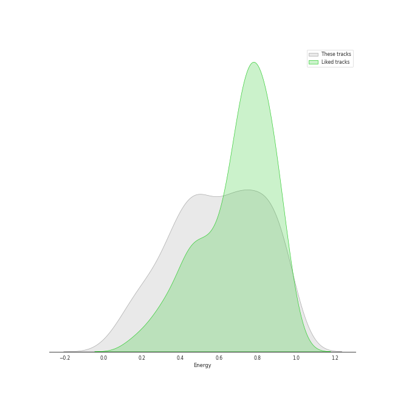
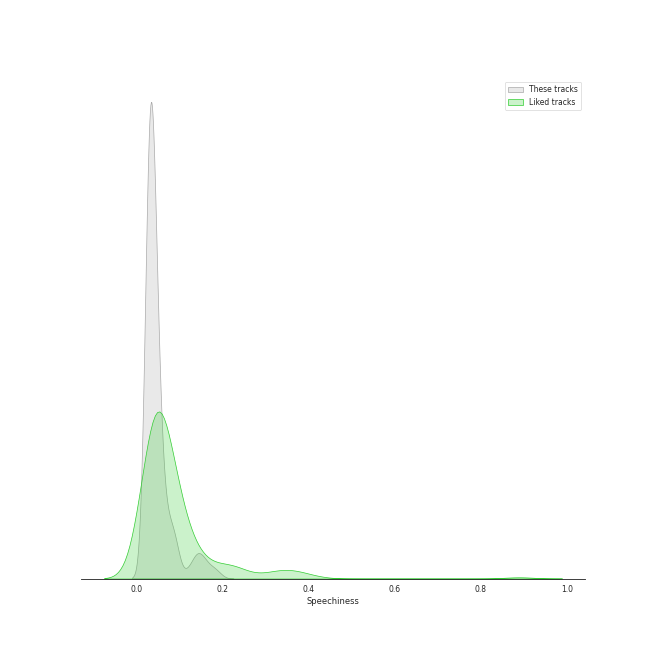
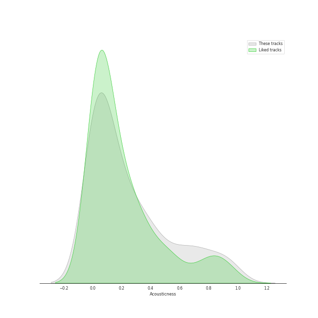
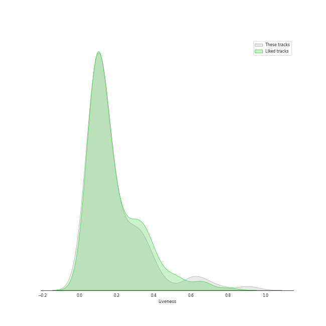
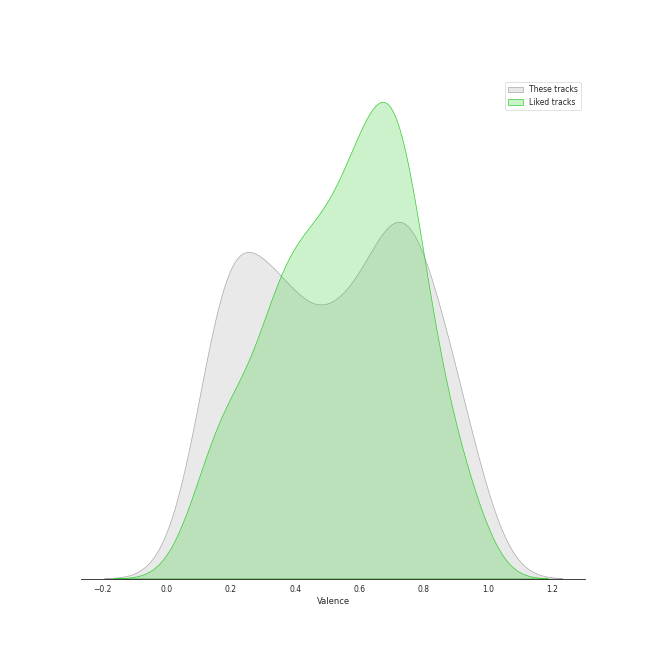
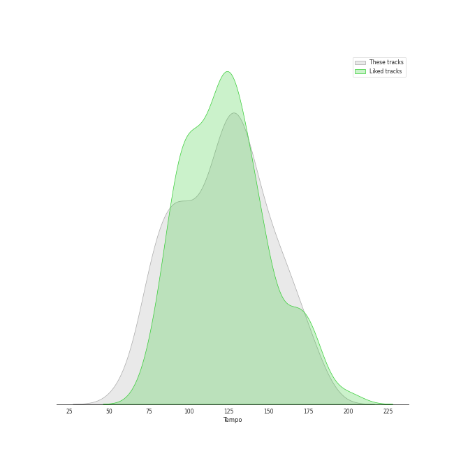

# Track Features for rock

## Danceability

| ​ | 10 most Danceable tracks | ​​ | 10 least Danceable tracks |
|:---|:---|:---|:---|
|  | Another One Bites The Dust - Remastered 2011 (0.933) |  | Pyramid Song (0.12) |
|  | I Want To Break Free (0.87) |  | Bridge Over Troubled Water (0.149) |
|  | Dreams - 2004 Remaster (0.828) |  | Lights (0.193) |
|  | Feel Good Inc. (0.818) |  | Innuendo - Remastered 2011 (0.209) |
|  | Harder, Better, Faster, Stronger (0.817) |  | Nature Boy - From "Moulin Rouge" Soundtrack (0.214) |
|  | Technologic (0.812) |  | Desperado - 2013 Remaster (0.228) |
|  | Get Lucky (feat. Pharrell Williams and Nile Rodgers) (0.81) |  | Paranoid Android (0.251) |
|  | You Can Call Me Al (0.776) |  | No Surprises (0.255) |
|  | Believer (0.776) |  | Across The Universe - Remastered 2009 (0.257) |
|  | Instant Crush (feat. Julian Casablancas) (0.775) |  | We Are The Champions - Remastered 2011 (0.268) |

## Energy

| ​ | 10 most Energetic tracks | ​​ | 10 least Energetic tracks |
|:---|:---|:---|:---|
|  | When Doves Cry (0.989) |  | And So It Goes (0.0387) |
|  | American Idiot (0.988) |  | The Boxer (0.0802) |
|  | Welcome To The Jungle (0.987) |  | Nature Boy - From "Moulin Rouge" Soundtrack (0.084) |
|  | We Didn't Start the Fire (0.967) |  | And So It Goes (0.0871) |
|  | Knights of Cydonia (0.963) |  | Blackbird - Remastered 2009 (0.127) |
|  | We Didn’t Start The Fire (Bonus Track) (0.961) |  | She's Got a Way (0.142) |
|  | The Pretender (0.959) |  | Golden Slumbers - Remastered 2009 (0.152) |
|  | Sweet Child O' Mine (0.952) |  | Lullabye (Goodnight, My Angel) (0.157) |
|  | Uptown Girl (0.944) |  | Hurt (0.158) |
|  | Go Your Own Way - 2004 Remaster (0.941) |  | Landslide (0.161) |

## Speechiness

| ​ | 10 most Speechy tracks | ​​ | 10 least Speechy tracks |
|:---|:---|:---|:---|
|  | Technologic (0.224) |  | Octopus's Garden - Remastered 2009 (0.0247) |
|  | Don't Stop Me Now (0.192) |  | Sweet Home Alabama (0.0255) |
|  | Strawberry Fields Forever - Remastered 2009 (0.178) |  | High and Dry (0.0256) |
|  | Feel Good Inc. (0.177) |  | Karma Police (0.0258) |
|  | Another One Bites The Dust - Remastered 2011 (0.162) |  | Reckoner (0.0262) |
|  | Don't Stop Me Now - Remastered 2011 (0.16) |  | The Longest Time (0.0262) |
|  | Only the Good Die Young (0.159) |  | Turn the Lights Back On (0.0264) |
|  | It's Still Rock and Roll to Me (0.15) |  | Nothing Else Matters (0.0265) |
|  | Harder, Better, Faster, Stronger (0.144) |  | Hurt (0.0267) |
|  | Money (0.144) |  | Save Me - Remastered 2011 (0.0268) |

## Acousticness

| ​ | 10 most Acoustic tracks | ​​ | 10 least Acoustic tracks |
|:---|:---|:---|:---|
|  | I Walk the Line - Stereo Version (0.97) |  | Learn to Fly (1.83e-05) |
|  | She's Got a Way (0.97) |  | Smells Like Teen Spirit (2.55e-05) |
|  | Lullabye (Goodnight, My Angel) (0.948) |  | American Idiot (2.64e-05) |
|  | Desperado - 2013 Remaster (0.946) |  | Paranoid - 2012 - Remaster (4.52e-05) |
|  | And So It Goes (0.941) |  | Everlong (5.99e-05) |
|  | Eleanor Rigby - Remastered 2009 (0.936) |  | That's What You Get (9.43e-05) |
|  | The Boxer (0.93) |  | Let Down (0.000121) |
|  | And So It Goes (0.91) |  | Knights of Cydonia (0.000273) |
|  | Landslide (0.883) |  | Technologic (0.000369) |
|  | Yesterday - Remastered 2009 (0.879) |  | Reptilia (0.000603) |

## Instrumentalness

| ​ | 10 most Instrumental tracks | ​​ | 10 least Instrumental tracks |
|:---|:---|:---|:---|
|  | Set the Controls for the Heart of the Sun (0.905) |  | Mr. Brightside (0.0) |
|  | The Great Gig in the Sky (0.896) |  | One More Time (0.0) |
|  | Digital Love (0.867) |  | Believer (0.0) |
|  | Animals (0.796) |  | That's What You Get (0.0) |
|  | Weird Fishes/ Arpeggi (0.756) |  | Killer Queen (0.0) |
|  | Breathe (In the Air) (0.728) |  | Turn the Lights Back On (0.0) |
|  | Reptilia (0.713) |  | And So It Goes (0.0) |
|  | Street Spirit (Fade Out) (0.694) |  | Only the Good Die Young (0.0) |
|  | Instant Crush (feat. Julian Casablancas) (0.619) |  | Still into You (0.0) |
|  | 1979 - Remastered 2012 (0.583) |  | Sugar, We're Goin Down (0.0) |

## Liveness

| ​ | 10 most Live tracks | ​​ | 10 least Live tracks |
|:---|:---|:---|:---|
|  | A Day In The Life - Remastered 2009 (0.922) |  | Ain't It Fun (0.021) |
|  | Folsom Prison Blues - Live at Folsom State Prison, Folsom, CA - January 1968 (0.893) |  | The Pretender (0.028) |
|  | Don't Stop Me Now - Remastered 2011 (0.77) |  | Iron Man (0.0372) |
|  | Animals (0.696) |  | The Chain - 2004 Remaster (0.0451) |
|  | Purple Rain (0.689) |  | Africa (0.0481) |
|  | Radioactive (0.668) |  | 1979 - Remastered 2012 (0.0513) |
|  | Revolution 1 - Remastered 2009 (0.621) |  | Smoke on the Water (0.0535) |
|  | Feel Good Inc. (0.613) |  | Paranoid Android (0.0545) |
|  | All The Small Things (0.612) |  | My Life (0.0555) |
|  | Get Back - Remastered 2009 (0.61) |  | Still into You (0.0561) |

## Valence

| ​ | 10 most Happy tracks | ​​ | 10 least Happy tracks |
|:---|:---|:---|:---|
|  | Surfin' U.S.A. (0.969) |  | Everything In Its Right Place (0.0629) |
|  | Crocodile Rock (0.968) |  | Pyramid Song (0.0679) |
|  | 1979 - Remastered 2012 (0.964) |  | Nature Boy - From "Moulin Rouge" Soundtrack (0.0692) |
|  | I'm a Believer - 2006 Remaster (0.962) |  | Hurt (0.0826) |
|  | Hard To Handle (0.961) |  | All I Need (0.0997) |
|  | Cecilia (0.954) |  | Creep (0.104) |
|  | (I Can't Get No) Satisfaction - Mono Version (0.931) |  | No Surprises (0.118) |
|  | Brown Eyed Girl (0.908) |  | Street Spirit (Fade Out) (0.131) |
|  | The Middle (0.903) |  | Fake Plastic Trees (0.135) |
|  | All My Loving - Remastered 2009 (0.9) |  | Come Sail Away (0.141) |

## Tempo

| ​ | 10 most Fast tracks | ​​ | 10 least Fast tracks |
|:---|:---|:---|:---|
|  | Lights (205.422) |  | Nature Boy - From "Moulin Rouge" Soundtrack (57.307) |
|  | Back In Black (188.386) |  | Desperado - 2013 Remaster (60.3) |
|  | American Idiot (186.113) |  | We Are The Champions - Remastered 2011 (64.223) |
|  | The Boxer (181.849) |  | Moondance - 2013 Remaster (67.409) |
|  | Madness (180.301) |  | Pyramid Song (72.64) |
|  | Slow Cheetah (178.102) |  | Fake Plastic Trees (73.543) |
|  | Piano Man (177.734) |  | Innuendo - Remastered 2011 (74.168) |
|  | She's Always a Woman (176.631) |  | Karma Police (74.807) |
|  | She's Always a Woman (176.631) |  | Ride (74.989) |
|  | Norwegian Wood (This Bird Has Flown) - Remastered 2009 (176.625) |  | Sexy Sadie - Remastered 2009 (75.478) |
