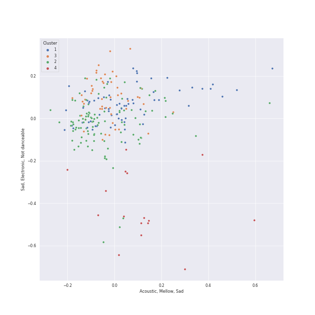

# Clusters in rock

## Cluster #1

64 tracks

| Art | Track | Album | Artists | Label | 💚 | 🔗 |
|:---|:---|:---|:---|:---|:---|:---|
|  | Dream On | Aerosmith | Aerosmith | [Columbia](../../../../labels/columbia) | 💚 | [🔗](https://open.spotify.com/track/5MxNLUsfh7uzROypsoO5qe) |
|  | Heartbreak Feels So Good | So Much (For) Stardust | Fall Out Boy | [Fueled By Ramen](../../../../labels/fueled_by_ramen) | 💚 | [🔗](https://open.spotify.com/track/2DIo5VoBB6X1GzgpGbmMIF) |
|  | The Only Exception | Brand New Eyes | Paramore | [Fueled By Ramen](../../../../labels/fueled_by_ramen) | | [🔗](https://open.spotify.com/track/7JIuqL4ZqkpfGKQhYlrirs) |
|  | Bohemian Rhapsody - Remastered 2011 | A Night At The Opera (Deluxe Remastered Version) | [Queen](../../../../artists/queen/overview.md) | [Hollywood Records](../../../../labels/hollywood_records) | 💚 | [🔗](https://open.spotify.com/track/7tFiyTwD0nx5a1eklYtX2J) |
|  | Innuendo | Innuendo | [Queen](../../../../artists/queen/overview.md) | [Hollywood Records](../../../../labels/hollywood_records) | 💚 | [🔗](https://open.spotify.com/track/1dG4lTOVFu8RkSzybolp7o) |
|  | Karma Police | OK Computer | [Radiohead](../../../../artists/radiohead/overview.md) | [XL Recordings](../../../../labels/xl_recordings) | 💚 | [🔗](https://open.spotify.com/track/63OQupATfueTdZMWTxW03A) |
|  | Californication | Californication (Deluxe Edition) | Red Hot Chili Peppers | [Warner Records](../../../../labels/warner_records) | | [🔗](https://open.spotify.com/track/48UPSzbZjgc449aqz8bxox) |
|  | Strip My Mind | Stadium Arcadium | Red Hot Chili Peppers | [Warner Records](../../../../labels/warner_records) | | [🔗](https://open.spotify.com/track/0J3ytriezGZ3KCREfHKDOI) |
|  | Dear Prudence - Remastered 2009 | The Beatles (Remastered) | [The Beatles](../../../../artists/the_beatles/overview.md) | [EMI Catalogue](../../../../labels/emi_catalogue) | 💚 | [🔗](https://open.spotify.com/track/5NQYyej46WQkgCbnzGD21W) |
|  | All These Things That I've Done | Hot Fuss | The Killers | [Island Records](../../../../labels/island_records) | | [🔗](https://open.spotify.com/track/5vollujufHY0jMZxx77VWr) |
## Cluster #2

46 tracks

| Art | Track | Album | Artists | Label | 💚 | 🔗 |
|:---|:---|:---|:---|:---|:---|:---|
|  | My Life | 52nd Street | [Billy Joel](../../../../artists/billy_joel/overview.md) | [Columbia](../../../../labels/columbia) | 💚 | [🔗](https://open.spotify.com/track/4ZoBC5MhSEzuknIgAkBaoT) |
|  | The Longest Time | An Innocent Man | [Billy Joel](../../../../artists/billy_joel/overview.md) | [Columbia](../../../../labels/columbia) | 💚 | [🔗](https://open.spotify.com/track/5DH7nDryMhpixm4G4B7RP9) |
|  | Hotel California - 2013 Remaster | Hotel California (2013 Remaster) | Eagles | [Rhino/Elektra](../../../../labels/rhino) | | [🔗](https://open.spotify.com/track/40riOy7x9W7GXjyGp4pjAv) |
|  | Good Riddance (Time of Your Life) | Nimrod | Green Day | [Reprise](../../../../labels/reprise) | | [🔗](https://open.spotify.com/track/6ORqU0bHbVCRjXm9AjyHyZ) |
|  | Killer Queen | Sheer Heart Attack | [Queen](../../../../artists/queen/overview.md) | [Hollywood Records](../../../../labels/hollywood_records) | 💚 | [🔗](https://open.spotify.com/track/1KPMTL3BRLBWrNY8fveVy6) |
|  | A Kind Of Magic | A Kind Of Magic | [Queen](../../../../artists/queen/overview.md) | [Hollywood Records](../../../../labels/hollywood_records) | | [🔗](https://open.spotify.com/track/74QzobuYWH5BHMTrW9X7Yu) |
|  | Sexy Sadie - Remastered 2009 | The Beatles (Remastered) | [The Beatles](../../../../artists/the_beatles/overview.md) | [EMI Catalogue](../../../../labels/emi_catalogue) | 💚 | [🔗](https://open.spotify.com/track/2tBv9tAdqEbLNDi5smSjbg) |
|  | Octopus's Garden - Remastered 2009 | Abbey Road (Remastered) | [The Beatles](../../../../artists/the_beatles/overview.md) | [EMI Catalogue](../../../../labels/emi_catalogue) | | [🔗](https://open.spotify.com/track/0suLngfo7rJoetk7Ub6N8l) |
|  | Daydream Believer | The Birds, The Bees, & The Monkees | The Monkees | [Rhino](../../../../labels/rhino) | | [🔗](https://open.spotify.com/track/7uEcCGtM1FBBGIhPozhJjv) |
|  | Stressed Out | Blurryface | Twenty One Pilots | [Fueled By Ramen](../../../../labels/fueled_by_ramen) | 💚 | [🔗](https://open.spotify.com/track/3CRDbSIZ4r5MsZ0YwxuEkn) |
## Cluster #3

30 tracks

| Art | Track | Album | Artists | Label | 💚 | 🔗 |
|:---|:---|:---|:---|:---|:---|:---|
|  | Vienna | The Stranger | [Billy Joel](../../../../artists/billy_joel/overview.md) | [Columbia](../../../../labels/columbia) | 💚 | [🔗](https://open.spotify.com/track/7gREIuHognJFspylIDJ94p) |
|  | And So It Goes | Good Vibrations | [Billy Joel](../../../../artists/billy_joel/overview.md), The King's Singers | RCA Victor | | [🔗](https://open.spotify.com/track/1v8w3Ve0EYhy8cMlRR92QM) |
|  | Lullabye (Goodnight, My Angel) | River Of Dreams | [Billy Joel](../../../../artists/billy_joel/overview.md) | [Columbia](../../../../labels/columbia) | 💚 | [🔗](https://open.spotify.com/track/4cURHmiuYii52BVbhrGbv0) |
|  | Your Song | Elton John | Elton John | [UMC (Universal Music Catalogue)](../../../../labels/umc_(universal_music_catalogue)) | 💚 | [🔗](https://open.spotify.com/track/38zsOOcu31XbbYj9BIPUF1) |
|  | Hurt | American IV: The Man Comes Around | Johnny Cash | American Recordings Catalog P&D | 💚 | [🔗](https://open.spotify.com/track/28cnXtME493VX9NOw9cIUh) |
|  | Good Old Fashioned Lover Boy | A Day At The Races | [Queen](../../../../artists/queen/overview.md) | [Hollywood Records](../../../../labels/hollywood_records) | | [🔗](https://open.spotify.com/track/3e9w80AUq0mT9Nrq471kLx) |
|  | The Sound of Silence - Acoustic Version | Wednesday Morning, 3 A.M. | [Simon & Garfunkel](../../../../artists/simon___garfunkel/overview.md) | [Columbia](../../../../labels/columbia) | 💚 | [🔗](https://open.spotify.com/track/5y788ya4NvwhBznoDIcXwK) |
|  | Yesterday - Remastered 2009 | Help! (Remastered) | [The Beatles](../../../../artists/the_beatles/overview.md) | [EMI Catalogue](../../../../labels/emi_catalogue) | 💚 | [🔗](https://open.spotify.com/track/3BQHpFgAp4l80e1XslIjNI) |
|  | Because - Remastered 2009 | Abbey Road (Remastered) | [The Beatles](../../../../artists/the_beatles/overview.md) | [EMI Catalogue](../../../../labels/emi_catalogue) | 💚 | [🔗](https://open.spotify.com/track/1rxoyGj1QuPoVi8fOft1Kt) |
|  | Let It Be - Remastered 2009 | Let It Be (Remastered) | [The Beatles](../../../../artists/the_beatles/overview.md) | [EMI Catalogue](../../../../labels/emi_catalogue) | 💚 | [🔗](https://open.spotify.com/track/7iN1s7xHE4ifF5povM6A48) |
## Cluster #4

13 tracks

| Art | Track | Album | Artists | Label | 💚 | 🔗 |
|:---|:---|:---|:---|:---|:---|:---|
|  | Digital Love | Discovery | [Daft Punk](../../../../artists/daft_punk/overview.md) | Daft Life Ltd./ADA France | 💚 | [🔗](https://open.spotify.com/track/2VEZx7NWsZ1D0eJ4uv5Fym) |
|  | Instant Crush (feat. Julian Casablancas) | Random Access Memories | [Daft Punk](../../../../artists/daft_punk/overview.md), Julian Casablancas | [Columbia](../../../../labels/columbia) | 💚 | [🔗](https://open.spotify.com/track/2cGxRwrMyEAp8dEbuZaVv6) |
|  | Smoke on the Water | Machine Head | Deep Purple | [Rhino](../../../../labels/rhino), [Warner Records](../../../../labels/warner_records) | | [🔗](https://open.spotify.com/track/5SAUIWdZ04OxYfJFDchC7S) |
|  | Set the Controls for the Heart of the Sun | A Saucerful of Secrets | Pink Floyd | Pink Floyd Records | 💚 | [🔗](https://open.spotify.com/track/6p9UFDNfGrzS5Byd2r9KPk) |
|  | Brain Damage | The Dark Side of the Moon | Pink Floyd | Pink Floyd Records | | [🔗](https://open.spotify.com/track/05uGBKRCuePsf43Hfm0JwX) |
|  | Breathe (In the Air) | The Dark Side of the Moon | Pink Floyd | Pink Floyd Records | 💚 | [🔗](https://open.spotify.com/track/2ctvdKmETyOzPb2GiJJT53) |
|  | Street Spirit (Fade Out) | The Bends | [Radiohead](../../../../artists/radiohead/overview.md) | [XL Recordings](../../../../labels/xl_recordings) | 💚 | [🔗](https://open.spotify.com/track/2QwObYJWyJTiozvs0RI7CF) |
|  | There, There | Hail To the Thief | [Radiohead](../../../../artists/radiohead/overview.md) | [XL Recordings](../../../../labels/xl_recordings) | 💚 | [🔗](https://open.spotify.com/track/5h4y42RUKwYKYWgutNwvKP) |
|  | Weird Fishes/ Arpeggi | In Rainbows | [Radiohead](../../../../artists/radiohead/overview.md) | [XL Recordings](../../../../labels/xl_recordings) | | [🔗](https://open.spotify.com/track/4wajJ1o7jWIg62YqpkHC7S) |
|  | Reptilia | Room On Fire | The Strokes | [RCA Records Label](../../../../labels/rca_records_label) | 💚 | [🔗](https://open.spotify.com/track/57Xjny5yNzAcsxnusKmAfA) |
## Cluster #5

66 tracks

| Art | Track | Album | Artists | Label | 💚 | 🔗 |
|:---|:---|:---|:---|:---|:---|:---|
|  | Call Me | Call Me | Blondie | Chrysalis\EMI Records (USA) | 💚 | [🔗](https://open.spotify.com/track/7HKxTNVlkHsfMLhigmhC0I) |
|  | We Didn’t Start The Fire (Bonus Track) | So Much (For) Stardust | Fall Out Boy | [Fueled By Ramen](../../../../labels/fueled_by_ramen) | | [🔗](https://open.spotify.com/track/22H7neCMj03ifZXlix1B6h) |
|  | Go Your Own Way - 2004 Remaster | Rumours (Super Deluxe) | Fleetwood Mac | [Rhino](../../../../labels/rhino), [Warner Records](../../../../labels/warner_records) | | [🔗](https://open.spotify.com/track/4xh7W7tlNMIczFhupCPniY) |
|  | Supermassive Black Hole | Black Holes and Revelations | Muse | [Warner Records](../../../../labels/warner_records) | 💚 | [🔗](https://open.spotify.com/track/3lPr8ghNDBLc2uZovNyLs9) |
|  | Smells Like Teen Spirit | Nevermind (Remastered) | Nirvana | [Geffen](../../../../labels/geffen) | | [🔗](https://open.spotify.com/track/5ghIJDpPoe3CfHMGu71E6T) |
|  | Misery Business | Riot! | Paramore | [Fueled By Ramen](../../../../labels/fueled_by_ramen) | 💚 | [🔗](https://open.spotify.com/track/6SpLc7EXZIPpy0sVko0aoU) |
|  | That's What You Get | Riot! | Paramore | [Fueled By Ramen](../../../../labels/fueled_by_ramen) | | [🔗](https://open.spotify.com/track/1JdKrFyoU05abww0Zv0ayQ) |
|  | Still into You | Paramore | Paramore | [Fueled By Ramen](../../../../labels/fueled_by_ramen) | | [🔗](https://open.spotify.com/track/1yjY7rpaAQvKwpdUliHx0d) |
|  | Can't Stop | By the Way (Deluxe Edition) | Red Hot Chili Peppers | [Warner Records](../../../../labels/warner_records) | | [🔗](https://open.spotify.com/track/3ZOEytgrvLwQaqXreDs2Jx) |
|  | Love Me Do - Remastered 2009 | Please Please Me (Remastered) | [The Beatles](../../../../artists/the_beatles/overview.md) | [EMI Catalogue](../../../../labels/emi_catalogue) | | [🔗](https://open.spotify.com/track/3VbGCXWRiouAq8VyMYN2MI) |