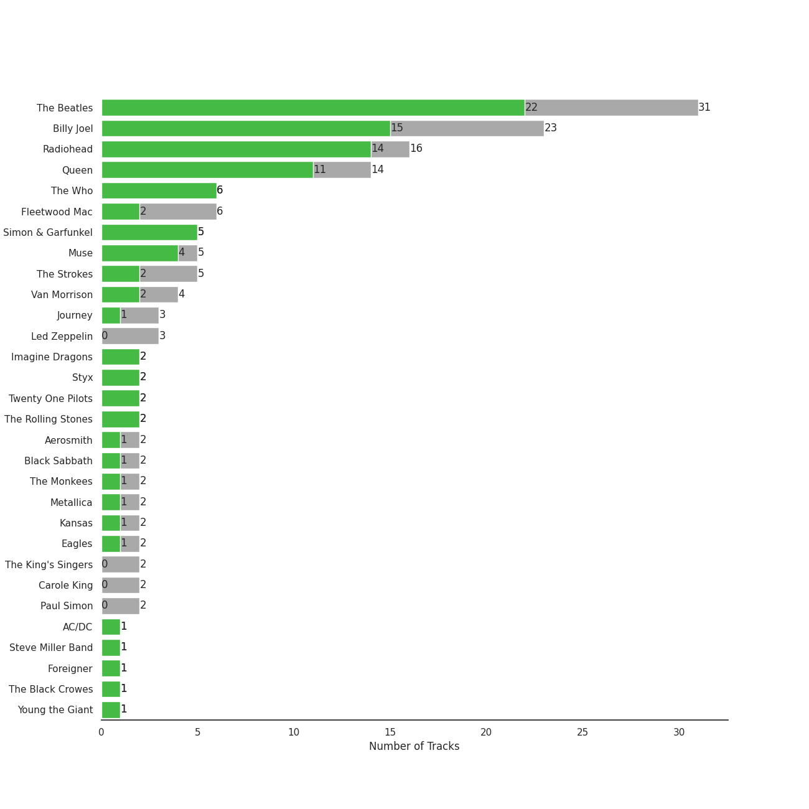
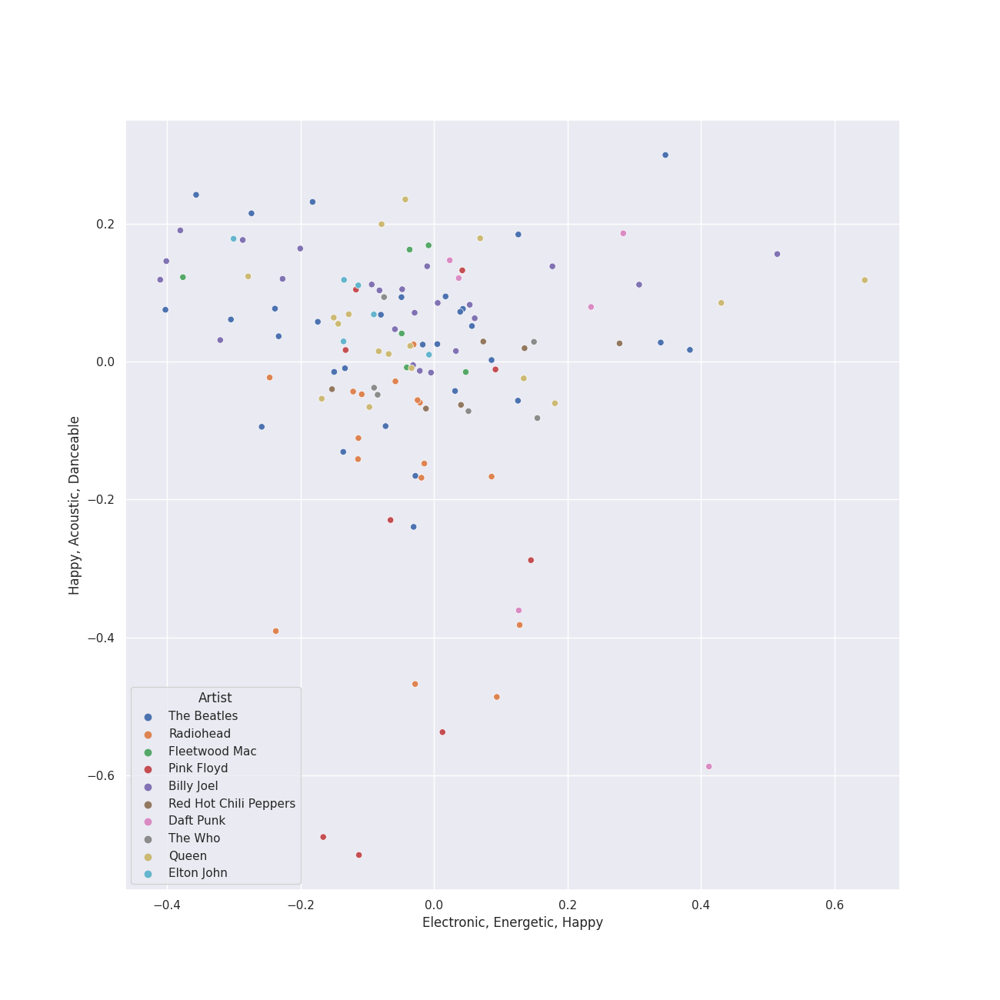
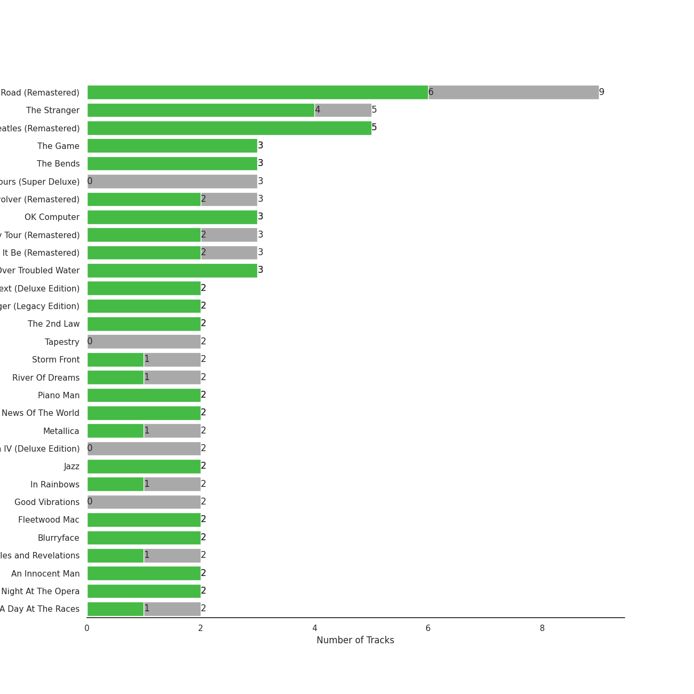
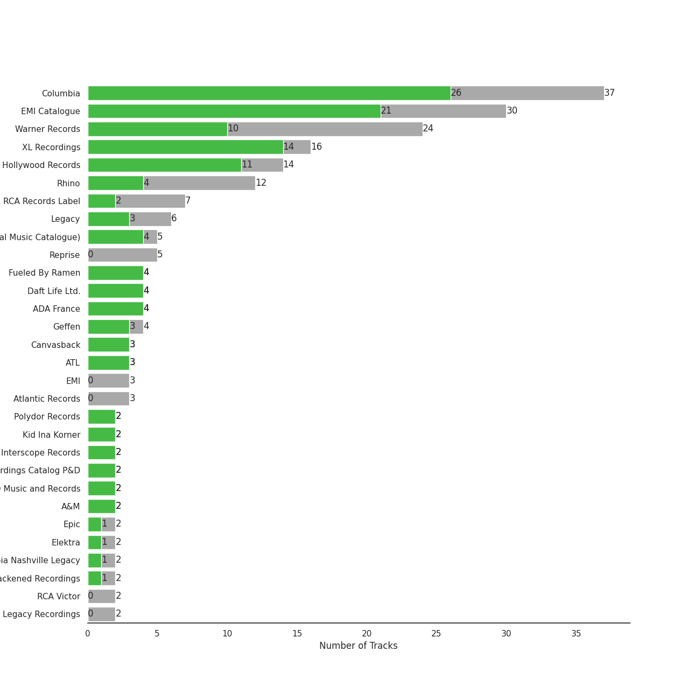
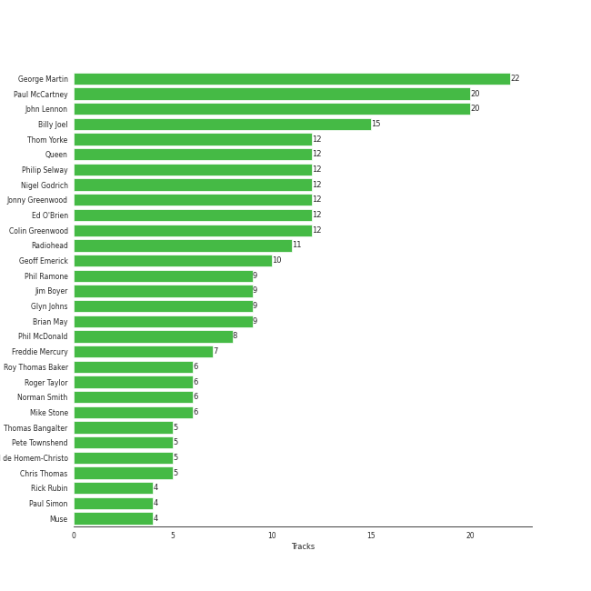
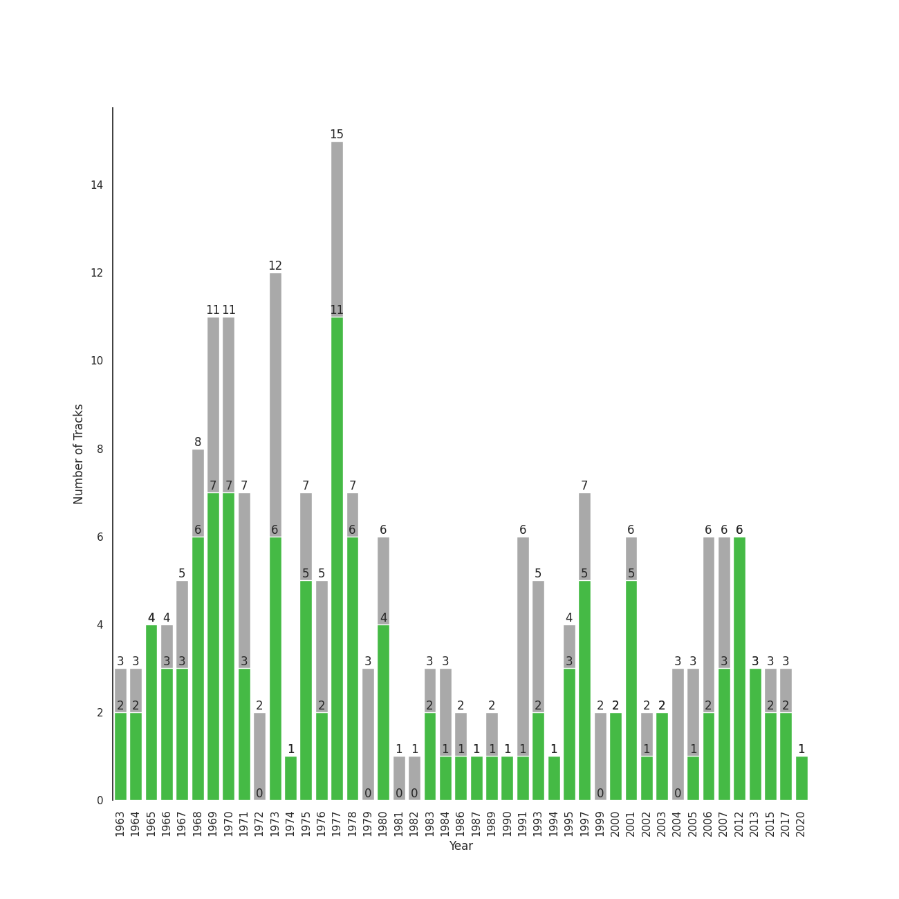

# rock

230 songs

[See Track Features](audio_features.md)

[See Clusters](clusters/overview.md)

## Top Artists

| Art | Tracks | 💚 | Artist | 🔗 |
|:---|---:|---:|:---|:---|
|  | 32 | 23 | [The Beatles](../../artists/the_beatles/overview.md) | [🔗](https://open.spotify.com/artist/3WrFJ7ztbogyGnTHbHJFl2) |
|  | 26 | 21 | [Billy Joel](../../artists/billy_joel/overview.md) | [🔗](https://open.spotify.com/artist/6zFYqv1mOsgBRQbae3JJ9e) |
|  | 17 | 15 | [Radiohead](../../artists/radiohead/overview.md) | [🔗](https://open.spotify.com/artist/4Z8W4fKeB5YxbusRsdQVPb) |
|  | 16 | 11 | [Queen](../../artists/queen/overview.md) | [🔗](https://open.spotify.com/artist/1dfeR4HaWDbWqFHLkxsg1d) |
|  | 6 | 6 | [The Who](../../artists/the_who/overview.md) | [🔗](https://open.spotify.com/artist/67ea9eGLXYMsO2eYQRui3w) |
|  | 6 | 5 | [Daft Punk](../../artists/daft_punk/overview.md) | [🔗](https://open.spotify.com/artist/4tZwfgrHOc3mvqYlEYSvVi) |
|  | 5 | 5 | [Simon & Garfunkel](../../artists/simon___garfunkel/overview.md) | [🔗](https://open.spotify.com/artist/70cRZdQywnSFp9pnc2WTCE) |
|  | 5 | 4 | Muse | [🔗](https://open.spotify.com/artist/12Chz98pHFMPJEknJQMWvI) |
|  | 9 | 3 | Pink Floyd | [🔗](https://open.spotify.com/artist/0k17h0D3J5VfsdmQ1iZtE9) |
|  | 6 | 3 | Fleetwood Mac | [🔗](https://open.spotify.com/artist/08GQAI4eElDnROBrJRGE0X) |

See all 60 artists

| Art | Tracks | 💚 | Artist | 🔗 |
|:---|---:|---:|:---|:---|
|  | 3 | 3 | Imagine Dragons | [🔗](https://open.spotify.com/artist/53XhwfbYqKCa1cC15pYq2q) |
|  | 3 | 3 | alt-J | [🔗](https://open.spotify.com/artist/3XHO7cRUPCLOr6jwp8vsx5) |
|  | 6 | 2 | Paramore | [🔗](https://open.spotify.com/artist/74XFHRwlV6OrjEM0A2NCMF) |
|  | 6 | 2 | Elton John | [🔗](https://open.spotify.com/artist/3PhoLpVuITZKcymswpck5b) |
|  | 4 | 2 | Johnny Cash | [🔗](https://open.spotify.com/artist/6kACVPfCOnqzgfEF5ryl0x) |
|  | 4 | 2 | Van Morrison | [🔗](https://open.spotify.com/artist/44NX2ffIYHr6D4n7RaZF7A) |
|  | 3 | 2 | Twenty One Pilots | [🔗](https://open.spotify.com/artist/3YQKmKGau1PzlVlkL1iodx) |
|  | 3 | 2 | Metallica | [🔗](https://open.spotify.com/artist/2ye2Wgw4gimLv2eAKyk1NB) |
|  | 3 | 2 | The Strokes | [🔗](https://open.spotify.com/artist/0epOFNiUfyON9EYx7Tpr6V) |
|  | 2 | 2 | Prince | [🔗](https://open.spotify.com/artist/5a2EaR3hamoenG9rDuVn8j) |
|  | 2 | 2 | Styx | [🔗](https://open.spotify.com/artist/4salDzkGmfycRqNUbyBphh) |
|  | 2 | 2 | Kansas | [🔗](https://open.spotify.com/artist/2hl0xAkS2AIRAu23TVMBG1) |
|  | 2 | 2 | The Rolling Stones | [🔗](https://open.spotify.com/artist/22bE4uQ6baNwSHPVcDxLCe) |
|  | 6 | 1 | Red Hot Chili Peppers | [🔗](https://open.spotify.com/artist/0L8ExT028jH3ddEcZwqJJ5) |
|  | 3 | 1 | Fall Out Boy | [🔗](https://open.spotify.com/artist/4UXqAaa6dQYAk18Lv7PEgX) |
|  | 3 | 1 | Journey | [🔗](https://open.spotify.com/artist/0rvjqX7ttXeg3mTy8Xscbt) |
|  | 2 | 1 | Aerosmith | [🔗](https://open.spotify.com/artist/7Ey4PD4MYsKc5I2dolUwbH) |
|  | 2 | 1 | Black Sabbath | [🔗](https://open.spotify.com/artist/5M52tdBnJaKSvOpJGz8mfZ) |
|  | 2 | 1 | Guns N' Roses | [🔗](https://open.spotify.com/artist/3qm84nBOXUEQ2vnTfUTTFC) |
|  | 2 | 1 | The Monkees | [🔗](https://open.spotify.com/artist/320EPCSEezHt1rtbfwH6Ck) |
|  | 2 | 1 | Paul Simon | [🔗](https://open.spotify.com/artist/2CvCyf1gEVhI0mX6aFXmVI) |
|  | 2 | 1 | Eagles | [🔗](https://open.spotify.com/artist/0ECwFtbIWEVNwjlrfc6xoL) |
|  | 1 | 1 | AC/DC | [🔗](https://open.spotify.com/artist/711MCceyCBcFnzjGY4Q7Un) |
|  | 1 | 1 | Steve Miller Band | [🔗](https://open.spotify.com/artist/6QtGlUje9TIkLrgPZrESuk) |
|  | 1 | 1 | Foreigner | [🔗](https://open.spotify.com/artist/6IRouO5mvvfcyxtPDKMYFN) |
|  | 1 | 1 | The Black Crowes | [🔗](https://open.spotify.com/artist/5krkohEVJYw0qoB5VWwxaC) |
|  | 1 | 1 | Blondie | [🔗](https://open.spotify.com/artist/4tpUmLEVLCGFr93o8hFFIB) |
|  | 1 | 1 | Nile Rodgers | [🔗](https://open.spotify.com/artist/3yDIp0kaq9EFKe07X1X2rz) |
|  | 1 | 1 | Chicago | [🔗](https://open.spotify.com/artist/3iDD7bnsjL9J4fO298r0L0) |
|  | 1 | 1 | Jimmy Eat World | [🔗](https://open.spotify.com/artist/3Ayl7mCk0nScecqOzvNp6s) |
|  | 1 | 1 | Pharrell Williams | [🔗](https://open.spotify.com/artist/2RdwBSPQiwcmiDo9kixcl8) |
|  | 1 | 1 | Julian Casablancas | [🔗](https://open.spotify.com/artist/1rAv1GhTQ2rmG94p9lU3rB) |
|  | 1 | 1 | Nine Inch Nails | [🔗](https://open.spotify.com/artist/0X380XXQSNBYuleKzav5UO) |
|  | 1 | 1 | TOTO | [🔗](https://open.spotify.com/artist/0PFtn5NtBbbUNbU9EAmIWF) |
|  | 4 | 0 | Foo Fighters | [🔗](https://open.spotify.com/artist/7jy3rLJdDQY21OgRLCZ9sD) |
|  | 3 | 0 | Green Day | [🔗](https://open.spotify.com/artist/7oPftvlwr6VrsViSDV7fJY) |
|  | 3 | 0 | Creedence Clearwater Revival | [🔗](https://open.spotify.com/artist/3IYUhFvPQItj6xySrBmZkd) |
|  | 3 | 0 | Led Zeppelin | [🔗](https://open.spotify.com/artist/36QJpDe2go2KgaRleHCDTp) |
|  | 2 | 0 | The King's Singers | [🔗](https://open.spotify.com/artist/5lR7yDVN4z9kahOiUSlMhe) |
|  | 2 | 0 | David Bowie | [🔗](https://open.spotify.com/artist/0oSGxfWSnnOXhD2fKuz2Gy) |
|  | 2 | 0 | The Killers | [🔗](https://open.spotify.com/artist/0C0XlULifJtAgn6ZNCW2eu) |
|  | 1 | 0 | Nirvana | [🔗](https://open.spotify.com/artist/6olE6TJLqED3rqDCT0FyPh) |
|  | 1 | 0 | Iron Maiden | [🔗](https://open.spotify.com/artist/6mdiAmATAx73kdxrNrnlao) |
|  | 1 | 0 | blink-182 | [🔗](https://open.spotify.com/artist/6FBDaR13swtiWwGhX1WQsP) |
|  | 1 | 0 | Deep Purple | [🔗](https://open.spotify.com/artist/568ZhdwyaiCyOGJRtNYhWf) |
|  | 1 | 0 | Lynyrd Skynyrd | [🔗](https://open.spotify.com/artist/4MVyzYMgTwdP7Z49wAZHx0) |
|  | 1 | 0 | R.E.M. | [🔗](https://open.spotify.com/artist/4KWTAlx2RvbpseOGMEmROg) |
|  | 1 | 0 | The Smashing Pumpkins | [🔗](https://open.spotify.com/artist/40Yq4vzPs9VNUrIBG5Jr2i) |
|  | 1 | 0 | The Beach Boys | [🔗](https://open.spotify.com/artist/3oDbviiivRWhXwIE8hxkVV) |
|  | 1 | 0 | Gorillaz | [🔗](https://open.spotify.com/artist/3AA28KZvwAUcZuOKwyblJQ) |

## Most and least listened tracks
| ​ | Most listened tracks | Rank | ​​ | Least listened tracks | Rank |
|:---|:---|---:|:---|:---|---:|
|  | [Fake Plastic Trees](../../artists/radiohead/overview.md) | 233 |  | Mr. Brightside | nan |
|  | [Paranoid Android](../../artists/radiohead/overview.md) | 237 |  | [Golden Slumbers - Remastered 2009](../../artists/the_beatles/overview.md) | nan |
|  | [Bohemian Rhapsody - Remastered 2011](../../artists/queen/overview.md) | 244 |  | [Reckoner](../../artists/radiohead/overview.md) | nan |
|  | The Middle | 247 |  | Crazy Love | nan |
|  | [Innuendo - Remastered 2011](../../artists/queen/overview.md) | 251 |  | Hard To Handle | nan |
|  | Misery Business | 276 |  | Rhiannon | nan |
|  | [Vienna](../../artists/billy_joel/overview.md) | 291 |  | Brain Damage | nan |
|  | [Because - Remastered 2009](../../artists/the_beatles/overview.md) | 307 |  | Slow Cheetah | nan |
|  | Breezeblocks | 316 |  | Back In Black | nan |
|  | Your Song | 315 |  | [One More Time](../../artists/daft_punk/overview.md) | nan |

## Top Albums

| Art | Tracks | 💚 | Album | Release Date | 🔗 |
|:---|---:|---:|:---|:---|:---|
|  | 9 | 6 | Abbey Road (Remastered) | 1969-09-26 | [🔗](https://open.spotify.com/album/0ETFjACtuP2ADo6LFhL6HN) |
|  | 7 | 7 | The Stranger (Legacy Edition) | 1977 | [🔗](https://open.spotify.com/album/1Mhn9VosyjtWn4dMPFlna6) |
|  | 6 | 6 | OK Computer | 1997-05-28 | [🔗](https://open.spotify.com/album/6dVIqQ8qmQ5GBnJ9shOYGE) |
|  | 5 | 5 | The Beatles (Remastered) | 1968-11-22 | [🔗](https://open.spotify.com/album/1klALx0u4AavZNEvC4LrTL) |
|  | 5 | 2 | The Dark Side of the Moon | 1973-03-01 | [🔗](https://open.spotify.com/album/4LH4d3cOWNNsVw41Gqt2kv) |
|  | 4 | 2 | In Rainbows | 2007-12-28 | [🔗](https://open.spotify.com/album/5vkqYmiPBYLaalcmjujWxK) |
|  | 4 | 1 | Stadium Arcadium | 2006-05-09 | [🔗](https://open.spotify.com/album/7xl50xr9NDkd3i2kBbzsNZ) |
|  | 3 | 3 | The Game (Deluxe Remastered Version) | 1980-06-27 | [🔗](https://open.spotify.com/album/6wPXUmYJ9mOWrKlLzZ5cCa) |
|  | 3 | 3 | The Bends | 1995-03-13 | [🔗](https://open.spotify.com/album/35UJLpClj5EDrhpNIi4DFg) |
|  | 3 | 3 | Let It Be (Remastered) | 1970-05-08 | [🔗](https://open.spotify.com/album/0jTGHV5xqHPvEcwL8f6YU5) |

See top 100 albums

| Art | Tracks | 💚 | Album | Release Date | 🔗 |
|:---|---:|---:|:---|:---|:---|
|  | 3 | 3 | Bridge Over Troubled Water | 1970-01-26 | [🔗](https://open.spotify.com/album/0JwHz5SSvpYWuuCNbtYZoV) |
|  | 3 | 3 | An Awesome Wave | 2012-09-18 | [🔗](https://open.spotify.com/album/6k3vC8nep1BfqAIJ81L6OL) |
|  | 3 | 2 | Revolver (Remastered) | 1966-08-05 | [🔗](https://open.spotify.com/album/3PRoXYsngSwjEQWR5PsHWR) |
|  | 3 | 2 | Magical Mystery Tour (Remastered) | 1967-11-27 | [🔗](https://open.spotify.com/album/2BtE7qm1qzM80p9vLSiXkj) |
|  | 3 | 2 | Discovery | 2001-03-12 | [🔗](https://open.spotify.com/album/2noRn2Aes5aoNVsU6iWThc) |
|  | 3 | 1 | Rumours (Super Deluxe) | 1977-02-04 | [🔗](https://open.spotify.com/album/0BwWUstDMUbgq2NYONRqlu) |
|  | 3 | 0 | The Wall | 1979-11-30 | [🔗](https://open.spotify.com/album/5Dbax7G8SWrP9xyzkOvy2F) |
|  | 2 | 2 | Who's Next (Deluxe Edition) | 1971-08-14 | [🔗](https://open.spotify.com/album/5MqyhhHbT13zsloD3uHhlQ) |
|  | 2 | 2 | The 2nd Law | 2012-09-24 | [🔗](https://open.spotify.com/album/3KuXEGcqLcnEYWnn3OEGy0) |
|  | 2 | 2 | Random Access Memories | 2013-05-20 | [🔗](https://open.spotify.com/album/4m2880jivSbbyEGAKfITCa) |
|  | 2 | 2 | Purple Rain | 1984-06-25 | [🔗](https://open.spotify.com/album/7nXJ5k4XgRj5OLg9m8V3zc) |
|  | 2 | 2 | Night Visions | 2012-09-04 | [🔗](https://open.spotify.com/album/6htgf3qv7vGcsdxLCDxKp8) |
|  | 2 | 2 | News Of The World (Deluxe Remastered Version) | 1977-10-28 | [🔗](https://open.spotify.com/album/6Di4m5k1BtMJ0R44bWNutu) |
|  | 2 | 2 | Jazz (Deluxe Remastered Version) | 1978-11-10 | [🔗](https://open.spotify.com/album/21HMAUrbbYSj9NiPPlGumy) |
|  | 2 | 2 | Glass Houses | 1980-03-12 | [🔗](https://open.spotify.com/album/5sztejERqpktXEdemlUvU5) |
|  | 2 | 2 | Fleetwood Mac | 1975-07-11 | [🔗](https://open.spotify.com/album/5VIQ3VaAoRKOEpJ0fewdvo) |
|  | 2 | 2 | Blurryface | 2015-05-15 | [🔗](https://open.spotify.com/album/3cQO7jp5S9qLBoIVtbkSM1) |
|  | 2 | 2 | An Innocent Man | 1983-08-08 | [🔗](https://open.spotify.com/album/3R3x4zIabsvpD3yxqLaUpc) |
|  | 2 | 2 | 52nd Street | 1978-10-13 | [🔗](https://open.spotify.com/album/1HmCO8VK98AU6EXPOjGYyI) |
|  | 2 | 1 | Storm Front | 1989-10-17 | [🔗](https://open.spotify.com/album/1Vw2uoVkLAJFVViJ1QyK1D) |
|  | 2 | 1 | So Much (For) Stardust | 2023-03-24 | [🔗](https://open.spotify.com/album/5rHd8n9uWIpq9w0PP5ZcI3) |
|  | 2 | 1 | River Of Dreams | 1993-08-10 | [🔗](https://open.spotify.com/album/4HPnwQJAEvTY910q4RNeOu) |
|  | 2 | 1 | Riot! | 2007-06-11 | [🔗](https://open.spotify.com/album/71rziY9eLo1tA2dBMxrwhc) |
|  | 2 | 1 | Paramore | 2013-04-05 | [🔗](https://open.spotify.com/album/4sgYpkIASM1jVlNC8Wp9oF) |
|  | 2 | 1 | Metallica | 1991-08-12 | [🔗](https://open.spotify.com/album/6QdCohkHKNTVoaSx1ZzitH) |
|  | 2 | 1 | Innuendo | 1991-02-04 | [🔗](https://open.spotify.com/album/3jYy7yGNCysTHE8MKrIF1k) |
|  | 2 | 1 | Goodbye Yellow Brick Road (Remastered) | 1973-10-05 | [🔗](https://open.spotify.com/album/5WupqgR68HfuHt3BMJtgun) |
|  | 2 | 1 | Black Holes and Revelations | 2006-06-19 | [🔗](https://open.spotify.com/album/0lw68yx3MhKflWFqCsGkIs) |
|  | 2 | 1 | Appetite For Destruction | 1987-07-21 | [🔗](https://open.spotify.com/album/28yHV3Gdg30AiB8h8em1eW) |
|  | 2 | 1 | A Day At The Races | 1976-12-10 | [🔗](https://open.spotify.com/album/3f45rzbU4dYQBTV9v5RFBB) |
|  | 2 | 0 | Sgt. Pepper's Lonely Hearts Club Band (Remastered) | 1967-06-01 | [🔗](https://open.spotify.com/album/6QaVfG1pHYl1z15ZxkvVDW) |
|  | 2 | 0 | Led Zeppelin IV (Deluxe Edition) | 1971-11-08 | [🔗](https://open.spotify.com/album/44Ig8dzqOkvkGDzaUof9lK) |
|  | 2 | 0 | Hot Fuss | 2004 | [🔗](https://open.spotify.com/album/4piJq7R3gjUOxnYs6lDCTg) |
|  | 2 | 0 | Good Vibrations | 1993 | [🔗](https://open.spotify.com/album/10IUKCLZPs9onPwXfQVxfv) |
|  | 1 | 1 | With The Beatles (Remastered) | 1963-11-22 | [🔗](https://open.spotify.com/album/1aYdiJk6XKeHWGO3FzHHTr) |
|  | 1 | 1 | Who's Next (Expanded Edition) | 1971-08-14 | [🔗](https://open.spotify.com/album/53PBYiedQrASAs5sy63JqT) |
|  | 1 | 1 | Who Are You | 1978-08-18 | [🔗](https://open.spotify.com/album/7at3CV9Y9P57wsEXkfU0q8) |
|  | 1 | 1 | Wednesday Morning, 3 A.M. | 1964-10-19 | [🔗](https://open.spotify.com/album/5pnJrocLlZ3FWEbcr2PTz0) |
|  | 1 | 1 | Turnstiles | 1976-05-19 | [🔗](https://open.spotify.com/album/7GiLfxL1su3MSqz7pmKMZi) |
|  | 1 | 1 | Turn the Lights Back On | 2024-02-01 | [🔗](https://open.spotify.com/album/4csPGLYTb7kt85U377UCuC) |
|  | 1 | 1 | Toto IV | 1982-04-08 | [🔗](https://open.spotify.com/album/62U7xIHcID94o20Of5ea4D) |
|  | 1 | 1 | Tommy | 1969-05-23 | [🔗](https://open.spotify.com/album/5cT7ee1sy2oEbFalP4asS4) |
|  | 1 | 1 | The Ultimate Collection | 2017-02-03 | [🔗](https://open.spotify.com/album/6TcPqftScGmR0aEgIb43Vv) |
|  | 1 | 1 | The New Abnormal | 2020-04-10 | [🔗](https://open.spotify.com/album/2xkZV2Hl1Omi8rk2D7t5lN) |
|  | 1 | 1 | The Joker | 1973-01-01 | [🔗](https://open.spotify.com/album/5uYNj1HkZrWKAkhEYcGmJr) |
|  | 1 | 1 | The Grand Illusion | 1977-01-01 | [🔗](https://open.spotify.com/album/6MFIBPVrZjHjP0pPkVF3IU) |
|  | 1 | 1 | The Downward Spiral | 1994-03-08 | [🔗](https://open.spotify.com/album/3nJnyDV8fwFpffo0EyHQto) |
|  | 1 | 1 | The Bridge | 1986-07-28 | [🔗](https://open.spotify.com/album/2fRxSC6FtiAkhEDVZr2seH) |
|  | 1 | 1 | Sheer Heart Attack | 1974-11-08 | [🔗](https://open.spotify.com/album/4yO8TpSaJtUKkkjmsA4VXf) |
|  | 1 | 1 | Shake Your Money Maker | 1990-02-13 | [🔗](https://open.spotify.com/album/2NRRQLuW6j3EsoWpIl2MR3) |
|  | 1 | 1 | Rubber Soul (Remastered) | 1965-12-03 | [🔗](https://open.spotify.com/album/50o7kf2wLwVmOTVYJOTplm) |
|  | 1 | 1 | Room On Fire | 2003-10-28 | [🔗](https://open.spotify.com/album/3HFbH1loOUbqCyPsLuHLLh) |
|  | 1 | 1 | Ring Of Fire: The Best Of Johnny Cash | 1963-08-06 | [🔗](https://open.spotify.com/album/0ucV57dbnqmrGv9d60r6X2) |
|  | 1 | 1 | Point Of Know Return (Expanded Edition) | 1977 | [🔗](https://open.spotify.com/album/6oU298pdPTCQnMx1PYwyUA) |
|  | 1 | 1 | Pieces Of Eight | 1978-01-01 | [🔗](https://open.spotify.com/album/294yFGYq9SBXWR4g6dK63D) |
|  | 1 | 1 | Piano Man (Legacy Edition) | 1973-11-07 | [🔗](https://open.spotify.com/album/69wjSAZXZiD2EBia3b3gxL) |
|  | 1 | 1 | Piano Man | 1973-11-09 | [🔗](https://open.spotify.com/album/77ErLrVvYETIlQJHAwhfIH) |
|  | 1 | 1 | Pablo Honey | 1993-02-22 | [🔗](https://open.spotify.com/album/3gBVdu4a1MMJVMy6vwPEb8) |
|  | 1 | 1 | Out Of Our Heads | 1965-07-30 | [🔗](https://open.spotify.com/album/2Q5MwpTmtjscaS34mJFXQQ) |
|  | 1 | 1 | Origin of Symmetry | 2001 | [🔗](https://open.spotify.com/album/1AP6uGYHdakRgwuWQsP5pK) |
|  | 1 | 1 | My Generation (Stereo Version) | 1965-12-03 | [🔗](https://open.spotify.com/album/6Oc6Ok1Oawu8lRkjmD4mXy) |
|  | 1 | 1 | More of The Monkees (Deluxe Edition) | 1967-01-09 | [🔗](https://open.spotify.com/album/50zHjIiTOZM232gnWvOydX) |
|  | 1 | 1 | Moondance (Deluxe Edition) | 1970-02 | [🔗](https://open.spotify.com/album/7diHYi0CglGJekoM3KaWBK) |
|  | 1 | 1 | Metallica (Remastered) | 1991-08-12 | [🔗](https://open.spotify.com/album/55fq75UfkYbGMq4CncCtOH) |
|  | 1 | 1 | Leftoverture (Expanded Edition) | 1976 | [🔗](https://open.spotify.com/album/7MejfRSNnrpcLZIxkeZDqR) |
|  | 1 | 1 | Kid A | 2000-10-02 | [🔗](https://open.spotify.com/album/6GjwtEZcfenmOf6l18N7T7) |
|  | 1 | 1 | Infinity | 1978 | [🔗](https://open.spotify.com/album/7K4Nk5fHkCuzNm5A6mdo2U) |
|  | 1 | 1 | Human After All | 2005-03-14 | [🔗](https://open.spotify.com/album/1A2GTWGtFfWp7KSQTwWOyo) |
|  | 1 | 1 | Help! (Remastered) | 1965-08-06 | [🔗](https://open.spotify.com/album/0PT5m6hwPRrpBwIHVnvbFX) |
|  | 1 | 1 | Hail To the Thief | 2003-06-09 | [🔗](https://open.spotify.com/album/5mzoI3VH0ZWk1pLFR6RoYy) |
|  | 1 | 1 | Greatest Hits Vol. III | 1997-06-13 | [🔗](https://open.spotify.com/album/3cJ6ZymbUcNGe1T8YZtGyE) |
|  | 1 | 1 | Graceland (25th Anniversary Deluxe Edition) | 1986-08-12 | [🔗](https://open.spotify.com/album/6WgGWYw6XXQyLTsWt7tXky) |
|  | 1 | 1 | Foreigner (Expanded) | 1977-03-08 | [🔗](https://open.spotify.com/album/1OU7zJvUfgxxPHgkTClt1M) |
|  | 1 | 1 | Evolve | 2017-06-23 | [🔗](https://open.spotify.com/album/33pt9HBdGlAbRGBHQgsZsU) |
|  | 1 | 1 | Elton John | 1970-04-10 | [🔗](https://open.spotify.com/album/69P9Ro0W286yLFgYwrGVN0) |
|  | 1 | 1 | Desperado (2013 Remaster) | 1973-04-17 | [🔗](https://open.spotify.com/album/09WBxbis5Sixt01FVMs8UM) |
|  | 1 | 1 | Chicago IX: Chicago's Greatest Hits | 1975-11-10 | [🔗](https://open.spotify.com/album/5qWGV0fd7hpdptJYI4G9Dd) |
|  | 1 | 1 | Call Me | 2004-01-01 | [🔗](https://open.spotify.com/album/18fOLsMG8Msf1DEaW0E71K) |
|  | 1 | 1 | Bookends | 1968-04-03 | [🔗](https://open.spotify.com/album/3bzgbgiytguTDnwzflAZr2) |
|  | 1 | 1 | Blowin' Your Mind! | 1967-09 | [🔗](https://open.spotify.com/album/7dsWupQRlFuhG8FGiQAUjC) |
|  | 1 | 1 | Bleed American | 2001-07-17 | [🔗](https://open.spotify.com/album/0UJhhj5bn5AGAjryFnhueP) |
|  | 1 | 1 | Back In Black | 1980-07-25 | [🔗](https://open.spotify.com/album/6mUdeDZCsExyJLMdAfDuwh) |
|  | 1 | 1 | Amnesiac | 2001-03-12 | [🔗](https://open.spotify.com/album/1HrMmB5useeZ0F5lHrMvl0) |
|  | 1 | 1 | American IV: The Man Comes Around | 2002-01-01 | [🔗](https://open.spotify.com/album/2BlL4Gv2DLPu8p58Wcmlm9) |
|  | 1 | 1 | Aftermath | 1966-04-15 | [🔗](https://open.spotify.com/album/72qrnM4yUNMDDlWiqKc8iY) |
|  | 1 | 1 | Aerosmith | 1973-01-05 | [🔗](https://open.spotify.com/album/19lEZSnCCbVEkKchoPQWDZ) |
|  | 1 | 1 | A Saucerful of Secrets | 1968-06-29 | [🔗](https://open.spotify.com/album/2vnJKtGjZXRUg0mYPZ3HGH) |
|  | 1 | 1 | A Night At The Opera (Deluxe Remastered Version) | 1975-11-21 | [🔗](https://open.spotify.com/album/6X9k3hSsvQck2OfKYdBbXr) |
|  | 1 | 1 | A Hard Day's Night (Remastered) | 1964-07-10 | [🔗](https://open.spotify.com/album/6wCttLq0ADzkPgtRnUihLV) |
|  | 1 | 1 | 1 (Remastered) | 2000-11-13 | [🔗](https://open.spotify.com/album/7vEJAtP3KgKSpOHVgwm3Eh) |

## Top Record Labels

| Tracks | 💚 | Label |
|---:|---:|:---|
| 41 | 33 | [Columbia](../../labels/columbia/overview.md) |
| 31 | 22 | [EMI Catalogue](../../labels/emi_catalogue/overview.md) |
| 17 | 15 | [XL Recordings](../../labels/xl_recordings/overview.md) |
| 24 | 12 | [Warner Records](../../labels/warner_records/overview.md) |
| 15 | 12 | [Legacy](../../labels/legacy/overview.md) |
| 16 | 11 | [Hollywood Records](../../labels/hollywood_records/overview.md) |
| 14 | 7 | [Rhino](../../labels/rhino/overview.md) |
| 9 | 5 | [Fueled By Ramen](../../labels/fueled_by_ramen/overview.md) |
| 5 | 4 | [UMC (Universal Music Catalogue)](../../labels/umc_(universal_music_catalogue)/overview.md) |
| 5 | 4 | [Interscope Records](../../labels/interscope_records/overview.md) |

See all 45 labels

| Tracks | 💚 | Label |
|---:|---:|:---|
| 9 | 3 | Pink Floyd Records |
| 6 | 3 | [Geffen](../../labels/geffen/overview.md) |
| 4 | 3 | Daft Life Ltd. |
| 4 | 3 | ADA France |
| 3 | 3 | Kid Ina Korner |
| 3 | 3 | Canvasback |
| 3 | 3 | ATL |
| 7 | 2 | [RCA Records Label](../../labels/rca_records_label/overview.md) |
| 3 | 2 | Blackened Recordings |
| 2 | 2 | [Polydor Records](../../labels/polydor_records/overview.md) |
| 2 | 2 | [Epic](../../labels/epic/overview.md) |
| 2 | 2 | American Recordings Catalog P&D |
| 2 | 2 | ABKCO Music and Records |
| 2 | 2 | A&M |
| 2 | 1 | Legacy Recordings |
| 2 | 1 | Guns N Roses P&D |
| 2 | 1 | Elektra |
| 2 | 1 | Columbia Nashville Legacy |
| 1 | 1 | TVT Records |
| 1 | 1 | Rhino Atlantic |
| 1 | 1 | Cult Records |
| 1 | 1 | Chrysalis\EMI Records (USA) |
| 1 | 1 | CAPITOL CATALOG MKT (C92) |
| 5 | 0 | [Atlantic Records](../../labels/atlantic_records/overview.md) |
| 3 | 0 | [Reprise](../../labels/reprise/overview.md) |
| 3 | 0 | [Island Records](../../labels/island_records/overview.md) |
| 3 | 0 | [EMI](../../labels/emi/overview.md) |
| 3 | 0 | [Craft Recordings](../../labels/craft_recordings/overview.md) |
| 2 | 0 | RCA Victor |
| 2 | 0 | [Parlophone UK](../../labels/parlophone_uk/overview.md) |
| 1 | 0 | [Virgin Records](../../labels/virgin_records/overview.md) |
| 1 | 0 | Sanctuary Records |
| 1 | 0 | Moulin Rouge |
| 1 | 0 | Concord Records |
| 1 | 0 | [Capitol Records](../../labels/capitol_records/overview.md) |

## Top Producers

| Art | Producer | Tracks | Credit Types |
|:---|:---|---:|:---|
| | [George Martin](../../producers/george_martin/overview.md) | 23 | Producer, Arranger |
| | [Paul McCartney](../../producers/paul_mccartney/overview.md) | 21 | Songwriter |
| | [John Lennon](../../producers/john_lennon/overview.md) | 21 | Songwriter |
|  | [Billy Joel](../../artists/billy_joel/overview.md) | 19 | Lyricist, Producer, Songwriter, Arranger |
| | [Colin Greenwood](../../producers/colin_greenwood/overview.md) | 13 | Songwriter |
| | [Phil Ramone](../../producers/phil_ramone/overview.md) | 13 | Producer |
| | [Ed O'Brien](../../producers/ed_o_brien/overview.md) | 13 | Songwriter |
| | [Jonny Greenwood](../../producers/jonny_greenwood/overview.md) | 13 | Songwriter, Arranger, Producer |
| | [Nigel Godrich](../../producers/nigel_godrich/overview.md) | 13 | Producer |
| | [Thom Yorke](../../producers/thom_yorke/overview.md) | 13 | Lyricist, Producer, Songwriter, Arranger |

View all

| Art | Producer | Tracks | Credit Types |
|:---|:---|---:|:---|
| | [Philip Selway](../../producers/philip_selway/overview.md) | 13 | Songwriter |
| | [Jim Boyer](../../producers/jim_boyer/overview.md) | 13 | Producer |
|  | [Radiohead](../../artists/radiohead/overview.md) | 12 | Arranger, Producer, Lyricist, Songwriter |
|  | [Queen](../../artists/queen/overview.md) | 11 | Producer, Arranger |
| | Geoff Emerick | 10 | Producer |
| | Glyn Johns | 9 | Producer |
| | [Brian May](../../producers/brian_may/overview.md) | 8 | Songwriter, Lyricist, Producer, Arranger |
| | Phil McDonald | 8 | Producer |
| | [Freddie Mercury](../../producers/freddie_mercury/overview.md) | 7 | Songwriter, Lyricist |
| | Norman Smith | 6 | Producer |
| | Mike Stone | 5 | Producer |
| | Roger Taylor | 5 | Songwriter, Producer |
| | Thomas Bangalter | 5 | Producer, Songwriter |
| | Chris Thomas | 5 | Producer |
| | Pete Townshend | 5 | Lyricist, Songwriter |
|  | Paul Simon | 5 | Lyricist, Producer, Songwriter |
| | Roy Thomas Baker | 5 | Producer |
| | Guy-Manuel de Homem-Christo | 5 | Producer, Songwriter |
| | Roy Halee | 4 | Producer |
| | Rick Rubin | 4 | Producer |
| | Ken Scott | 4 | Producer |
|  | Muse | 4 | Producer |
| | Sean Slade | 3 | Producer |
| | Mack | 3 | Producer |
| | Ben McKee | 3 | Songwriter |
|  | Chris Brown | 3 | Producer |
| | John Leckie | 3 | Producer |
| | Thom Green | 3 | Songwriter |
| | Joe Newman | 3 | Songwriter |
| | Paul Q. Kolderie | 3 | Producer |
| | Geoff Workman | 3 | Producer |
| | Wayne Sermon | 3 | Songwriter |
|  | Fleetwood Mac | 3 | Producer |
|  | [The Who](../../artists/the_who/overview.md) | 3 | Producer |
| | Charlie Andrew | 3 | Producer, Songwriter |
| | Dan Reynolds | 3 | Songwriter |
| | Gus Unger-Hamilton | 3 | Songwriter |
|  | Julian Casablancas | 3 | Lyricist, Songwriter, Producer |
| | Matt Bellamy | 3 | Lyricist, Songwriter |
| | Roger Waters | 3 | Lyricist, Songwriter |
| | Phil Spector | 3 | Producer |
| | Art Garfunkel | 3 | Producer |
| | Gwil Sainsbury | 3 | Songwriter |
| | David DeVore | 2 | Producer |
| | Josh Mosser | 2 | Producer, Songwriter |
|  | Pink Floyd | 2 | Producer |
| | Hugo Nicolson | 2 | Producer |
| | James Hetfield | 2 | Producer, Songwriter |
| | Bob Rock | 2 | Producer |
| | Tyler Joseph | 2 | Lyricist, Producer, Songwriter |
|  | Styx | 2 | Producer |
| | [Manny Marroquin](../../producers/manny_marroquin/overview.md) | 2 | Producer |
| | Tommaso Colliva | 2 | Producer |
| | Chris Blair | 2 | Producer |
| | Randy Staub | 2 | Producer |
| | Michael Stewart | 2 | Producer |
| | Trent Reznor | 2 | Lyricist, Songwriter, Arranger, Producer |
| | Mick Jones | 2 | Producer, Songwriter |
| | Kris Fredriksson | 2 | Producer |
|  | Elton John | 2 | Songwriter |
| | Stevie Nicks | 2 | Lyricist, Songwriter |
| | Alex da Kid | 2 | Producer, Songwriter |
| | Jim Warren | 2 | Producer |
| | Ted Brosnan | 2 | Producer |
| | Michael Omartian | 2 | Arranger |
| | Adrian Bushby | 2 | Producer |
| | Hayley Williams | 2 | Songwriter |
| | Keith Olsen | 2 | Producer |
| | Jeff Jarratt | 2 | Producer |
|  | Kansas | 2 | Arranger |
| | John Etchells | 2 | Producer |
| | Richard Woodcraft | 2 | Producer |
| | Peter Bown | 2 | Producer |
| | Rob Kingsland | 2 | Producer |
| | Barry Sheffield | 2 | Producer |
|  | Van Morrison | 2 | Lyricist, Producer, Songwriter |
| | Alan Parsons | 2 | Producer |
| | Dan Grech-Marguerat | 2 | Producer |
| | Don Puluse | 2 | Producer |
| | Ron Malo | 2 | Producer |
|  | Prince | 2 | Arranger, Lyricist, Producer, Songwriter |
| | John Deacon | 2 | Songwriter, Lyricist |
| | Jeff Glixman | 2 | Producer |
| | Barry Mraz | 2 | Producer |
| | Jason Lader | 2 | Producer |
| | Bernie Taupin | 2 | Lyricist |
| | Neal Avron | 2 | Producer |
| | Dennis DeYoung | 2 | Lyricist, Songwriter, Producer |
| | Lars Ulrich | 2 | Producer, Songwriter |
| | George Harrison | 2 | Lyricist, Songwriter |

## Years

| ​ | 10 newest albums | ​​ | 10 oldest albums |
|:---|:---|:---|:---|
|  | Turn the Lights Back On (2024-02-01) |  | Please Please Me (Remastered) (1963-03-22) |
|  | So Much (For) Stardust (2023-03-24) |  | Ring Of Fire: The Best Of Johnny Cash (1963-08-06) |
|  | This Is Why (2023-02-10) |  | With The Beatles (Remastered) (1963-11-22) |
|  | The New Abnormal (2020-04-10) |  | I Walk the Line (Stereo Version) (1964-06-13) |
|  | Greatest Hits: God's Favorite Band (2017-11-17) |  | A Hard Day's Night (Remastered) (1964-07-10) |
|  | Evolve (2017-06-23) |  | Wednesday Morning, 3 A.M. (1964-10-19) |
|  | The Ultimate Collection (2017-02-03) |  | Out Of Our Heads (1965-07-30) |
|  | Heathens (2016-06-16) |  | Help! (Remastered) (1965-08-06) |
|  | The Essential Van Morrison (2015-12-04) |  | Rubber Soul (Remastered) (1965-12-03) |
|  | Blurryface (2015-05-15) |  | My Generation (Stereo Version) (1965-12-03) |

