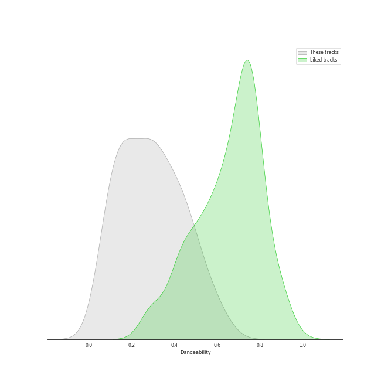
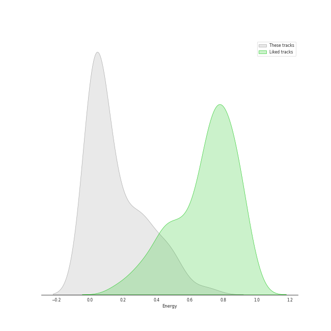
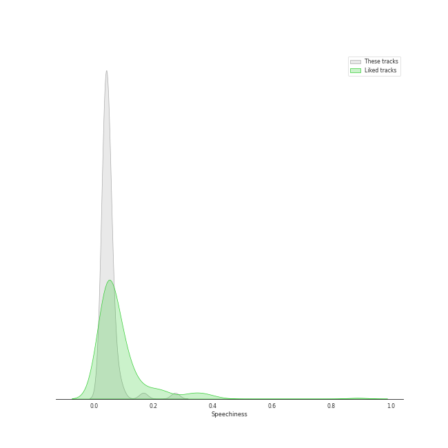
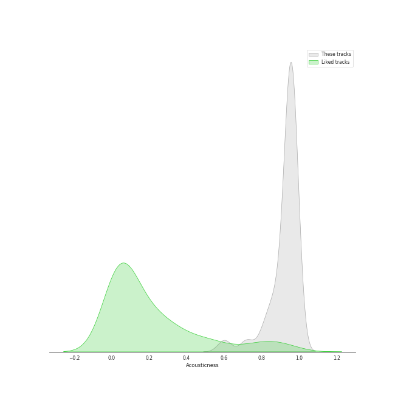
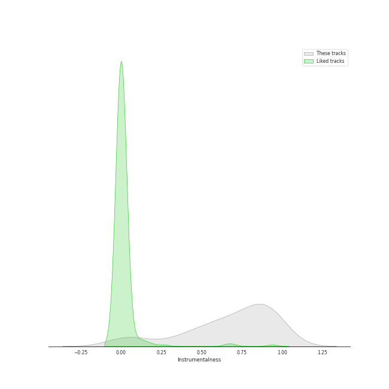
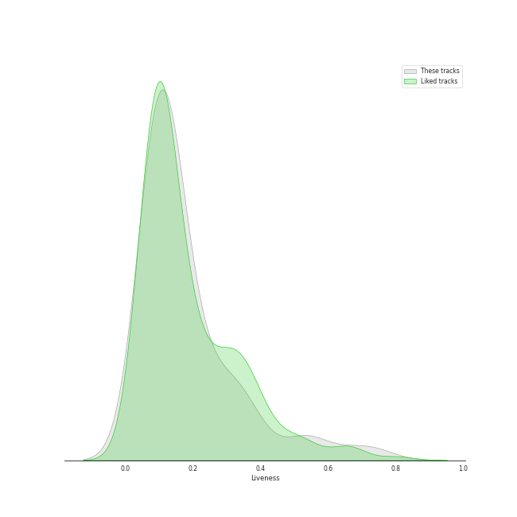
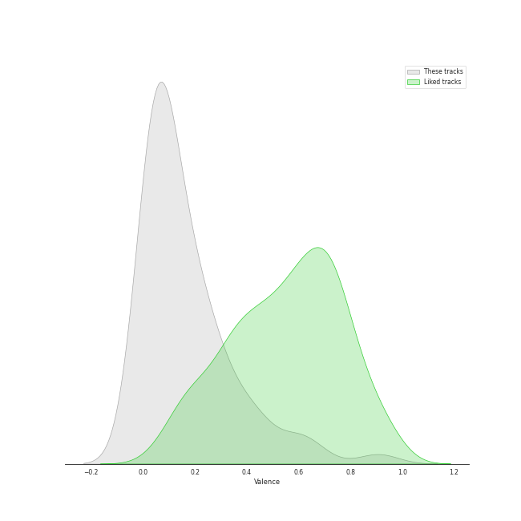
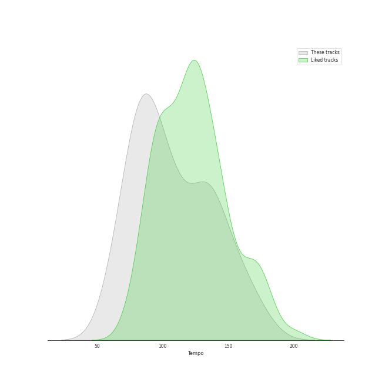

# Track Features for russian modern classical

## Danceability

| ​ | 10 most Danceable tracks | ​​ | 10 least Danceable tracks |
|:---|:---|:---|:---|
|  | String Quartet No.11 in F Minor, Op. 122: V. Humoresque (Allegro) (0.63) |  | String Quartet No. 8 in C Minor, Op. 110: V. Largo (0.0592) |
|  | The Rite of Spring, K15, Pt. 2: XIV. Sacrificial Dance (0.59) |  | String Quartet No. 8 in C Minor, Op. 110: I. Largo (0.0744) |
|  | Petrushka: Third Scene: II. Dance of the Ballerina (1911 original version) (0.58) |  | The Firebird (L'oiseau De Feu) - Suite (1919): Round Dance Of The Princesses (0.0797) |
|  | The Rite of Spring, K15, Pt. 2: XII. Evocation of the Ancestors (0.539) |  | The Firebird (L'oiseau De Feu) - Suite (1919): Introduction (0.083) |
|  | Petrushka: Fourth Scene: V. Dance of the Coachmen and Grooms (1911 original version) (0.51) |  | String Quartet No.11 in F Minor, Op. 122: I. Introduction (Andantino) (0.0833) |
|  | The Rite of Spring, K15, Pt. 1: II. The Augurs of Spring (0.508) |  | String Quartet No. 4 in D Major, Op. 83: II. Andantino (0.089) |
|  | The Rite of Spring, K15, Pt. 2: XI. Glorification of the Chosen One (0.507) |  | String Quartet No.11 in F Minor, Op. 122: VI. Elégie (Adagio) (0.0891) |
|  | String Quartet No. 8 in C Minor, Op. 110: III. Allegretto (0.489) |  | The Rite of Spring, K15, Pt. 2: X. Mystic Circles of the Adolescents (0.108) |
|  | String Quartet No.11 in F Minor, Op. 122: II. Scherzo (Allegretto) (0.482) |  | String Quartet No. 8 in C Minor, Op. 110: IV. Largo (0.109) |
|  | String Quartet No. 1 in C Major, Op. 49: IV. Allegro (0.46) |  | String Quartet No. 9 in E-Flat Major, Op. 117: II. Adagio (0.115) |

## Energy

| ​ | 10 most Energetic tracks | ​​ | 10 least Energetic tracks |
|:---|:---|:---|:---|
|  | The Rite of Spring, K15, Pt. 1: VI. Procession of the Sage (0.7) |  | The Rite of Spring, K15, Pt. 1: VII. Adoration of the Earth (The Sage) (0.000239) |
|  | The Rite of Spring, K15, Pt. 1: III. Ritual of Abduction (0.555) |  | The Firebird (L'oiseau De Feu) - Suite (1919): Introduction (0.00108) |
|  | String Quartet No. 8 in C Minor, Op. 110: II. Allegro molto (0.511) |  | The Firebird (L'oiseau De Feu) - Suite (1919): Berceuse (0.00403) |
|  | The Rite of Spring, K15, Pt. 1: VIII. Dance of the Earth (0.509) |  | String Quartet No. 9 in E-Flat Major, Op. 117: IV. Adagio (0.00449) |
|  | The Rite of Spring, K15, Pt. 2: XIV. Sacrificial Dance (0.46) |  | String Quartet No. 8 in C Minor, Op. 110: I. Largo (0.0053) |
|  | Petrushka: Fourth Scene: I. The Shrovetide Fair (towards evening) (1911 original version) (0.453) |  | The Firebird (L'oiseau De Feu) - Suite (1919): Round Dance Of The Princesses (0.00617) |
|  | The Rite of Spring, K15, Pt. 2: XI. Glorification of the Chosen One (0.447) |  | String Quartet No.11 in F Minor, Op. 122: VII. Finale (Moderato) (0.00842) |
|  | The Rite of Spring, K15, Pt. 1: V. Games of the Rival Tribes (0.435) |  | String Quartet No. 8 in C Minor, Op. 110: IV. Largo (0.0103) |
|  | String Quartet No.11 in F Minor, Op. 122: V. Humoresque (Allegro) (0.413) |  | Petrushka: First Scene: III. The Conjuring Trick (1911 original version) (0.011) |
|  | Petrushka: Fourth Scene: VI. The Mummers (1911 original version) (0.359) |  | String Quartet No. 6 in G Major, Op. 101: III. Lento (0.0113) |

## Speechiness

| ​ | 10 most Speechy tracks | ​​ | 10 least Speechy tracks |
|:---|:---|:---|:---|
|  | String Quartet No.11 in F Minor, Op. 122: V. Humoresque (Allegro) (0.274) |  | The Rite of Spring, K15, Pt. 1: VIII. Dance of the Earth (0.0292) |
|  | The Firebird (L'oiseau De Feu) - Suite (1919): Dance Of The Firebird (0.167) |  | The Rite of Spring, K15, Pt. 1: II. The Augurs of Spring (0.0293) |
|  | The Rite of Spring, K15, Pt. 2: XI. Glorification of the Chosen One (0.0935) |  | Petrushka: Fourth Scene: III. A Peasant Enters with a Bear (1911 original version) (0.0313) |
|  | Petrushka: Fourth Scene: VI. The Mummers (1911 original version) (0.083) |  | The Rite of Spring, K15, Pt. 2: XIII. Ritual of the Ancestors (0.0319) |
|  | The Rite of Spring, K15, Pt. 2: XIV. Sacrificial Dance (0.0741) |  | The Rite of Spring, K15, Pt. 1: IV. Spring Rounds (0.0346) |
|  | The Firebird (L'oiseau De Feu) - Suite (1919): Infernal Dance Of King Kaschei (0.0689) |  | String Quartet No. 8 in C Minor, Op. 110: II. Allegro molto (0.035) |
|  | Petrushka: Third Scene: III. Waltz (The Ballerina and the Moor) (1911 original version) (0.0644) |  | The Firebird (L'oiseau De Feu) - Suite (1919): Finale (0.0351) |
|  | String Quartet No.11 in F Minor, Op. 122: II. Scherzo (Allegretto) (0.0639) |  | String Quartet No. 9 in E-Flat Major, Op. 117: I. Moderato Con Moto (0.0354) |
|  | String Quartet No. 8 in C Minor, Op. 110: V. Largo (0.0615) |  | Petrushka: Fourth Scene: I. The Shrovetide Fair (towards evening) (1911 original version) (0.0359) |
|  | String Quartet No. 1 in C Major, Op. 49: II. Moderato (0.0534) |  | The Rite of Spring, K15, Pt. 2: IX. Introduction (0.0359) |

## Acousticness

| ​ | 10 most Acoustic tracks | ​​ | 10 least Acoustic tracks |
|:---|:---|:---|:---|
|  | Petrushka: Fourth Scene: III. A Peasant Enters with a Bear (1911 original version) (0.983) |  | The Rite of Spring, K15, Pt. 1: VII. Adoration of the Earth (The Sage) (0.591) |
|  | String Quartet No.11 in F Minor, Op. 122: III. Récitatif (Adagio) (0.983) |  | The Rite of Spring, K15, Pt. 1: VI. Procession of the Sage (0.612) |
|  | String Quartet No.11 in F Minor, Op. 122: VI. Elégie (Adagio) (0.982) |  | The Rite of Spring, K15, Pt. 1: VIII. Dance of the Earth (0.712) |
|  | The Rite of Spring, K15, Pt. 2: X. Mystic Circles of the Adolescents (0.981) |  | The Firebird (L'oiseau De Feu) - Suite (1919): Finale (0.73) |
|  | Petrushka: Fourth Scene: II. Dance of the Wet-Nurses (1911 original version) (0.978) |  | The Rite of Spring, K15, Pt. 2: XIV. Sacrificial Dance (0.802) |
|  | String Quartet No. 6 in G Major, Op. 101: I. Allegretto (0.976) |  | Petrushka: First Scene: III. The Conjuring Trick (1911 original version) (0.817) |
|  | Petrushka: First Scene: I. The Shrovetide Fair (Introduction) (1911 original version) (0.975) |  | Petrushka: Fourth Scene: VII. Petrushka's Death (1911 original version) (0.82) |
|  | String Quartet No.11 in F Minor, Op. 122: II. Scherzo (Allegretto) (0.974) |  | Petrushka: Fourth Scene: V. Dance of the Coachmen and Grooms (1911 original version) (0.841) |
|  | String Quartet No. 8 in C Minor, Op. 110: I. Largo (0.974) |  | String Quartet No.11 in F Minor, Op. 122: V. Humoresque (Allegro) (0.861) |
|  | String Quartet No. 9 in E-Flat Major, Op. 117: I. Moderato Con Moto (0.972) |  | The Rite of Spring, K15, Pt. 2: IX. Introduction (0.861) |

## Instrumentalness

| ​ | 10 most Instrumental tracks | ​​ | 10 least Instrumental tracks |
|:---|:---|:---|:---|
|  | The Rite of Spring, K15, Pt. 1: I. Introduction (0.972) |  | The Rite of Spring, K15, Pt. 1: VII. Adoration of the Earth (The Sage) (0.000308) |
|  | String Quartet No.11 in F Minor, Op. 122: III. Récitatif (Adagio) (0.953) |  | Petrushka: First Scene: III. The Conjuring Trick (1911 original version) (0.000393) |
|  | The Firebird (L'oiseau De Feu) - Suite (1919): Dance Of The Firebird (0.951) |  | Petrushka: Fourth Scene: VII. Petrushka's Death (1911 original version) (0.00603) |
|  | The Rite of Spring, K15, Pt. 1: III. Ritual of Abduction (0.945) |  | String Quartet No.11 in F Minor, Op. 122: VII. Finale (Moderato) (0.0443) |
|  | Petrushka: Fourth Scene: II. Dance of the Wet-Nurses (1911 original version) (0.945) |  | The Firebird (L'oiseau De Feu) - Suite (1919): 3. Variation Of The Firebird (0.054) |
|  | Petrushka: First Scene: I. The Shrovetide Fair (Introduction) (1911 original version) (0.941) |  | The Rite of Spring, K15, Pt. 2: IX. Introduction (0.0623) |
|  | The Rite of Spring, K15, Pt. 2: XII. Evocation of the Ancestors (0.938) |  | String Quartet No.11 in F Minor, Op. 122: I. Introduction (Andantino) (0.104) |
|  | String Quartet No. 8 in C Minor, Op. 110: II. Allegro molto (0.936) |  | String Quartet No. 1 in C Major, Op. 49: III. Allegro molto (0.181) |
|  | Petrushka: Fourth Scene: VI. The Mummers (1911 original version) (0.936) |  | String Quartet No. 9 in E-Flat Major, Op. 117: IV. Adagio (0.357) |
|  | Petrushka: Fourth Scene: III. A Peasant Enters with a Bear (1911 original version) (0.933) |  | String Quartet No. 6 in G Major, Op. 101: I. Allegretto (0.364) |

## Liveness

| ​ | 10 most Live tracks | ​​ | 10 least Live tracks |
|:---|:---|:---|:---|
|  | The Firebird (L'oiseau De Feu) - Suite (1919): 3. Variation Of The Firebird (0.743) |  | String Quartet No. 8 in C Minor, Op. 110: III. Allegretto (0.0651) |
|  | The Rite of Spring, K15, Pt. 1: II. The Augurs of Spring (0.669) |  | The Firebird (L'oiseau De Feu) - Suite (1919): Finale (0.0658) |
|  | Petrushka: First Scene: IV. Russian Dance (1911 original version) (0.558) |  | The Rite of Spring, K15, Pt. 1: I. Introduction (0.0674) |
|  | Petrushka: Fourth Scene: V. Dance of the Coachmen and Grooms (1911 original version) (0.537) |  | String Quartet No. 9 in E-Flat Major, Op. 117: II. Adagio (0.0703) |
|  | Petrushka: Fourth Scene: I. The Shrovetide Fair (towards evening) (1911 original version) (0.505) |  | String Quartet No. 1 in C Major, Op. 49: II. Moderato (0.079) |
|  | String Quartet No.11 in F Minor, Op. 122: IV. Etude (Allegro) (0.379) |  | The Rite of Spring, K15, Pt. 1: VIII. Dance of the Earth (0.0801) |
|  | Jeu de cartes: I. First Deal (0.366) |  | String Quartet No. 1 in C Major, Op. 49: I. Moderato (0.0829) |
|  | The Rite of Spring, K15, Pt. 1: III. Ritual of Abduction (0.349) |  | The Rite of Spring, K15, Pt. 2: XI. Glorification of the Chosen One (0.0838) |
|  | Petrushka: Fourth Scene: III. A Peasant Enters with a Bear (1911 original version) (0.343) |  | String Quartet No.11 in F Minor, Op. 122: III. Récitatif (Adagio) (0.0848) |
|  | Petrushka: First Scene: I. The Shrovetide Fair (Introduction) (1911 original version) (0.328) |  | String Quartet No. 4 in D Major, Op. 83: II. Andantino (0.0851) |

## Valence

| ​ | 10 most Happy tracks | ​​ | 10 least Happy tracks |
|:---|:---|:---|:---|
|  | Petrushka: Third Scene: II. Dance of the Ballerina (1911 original version) (0.907) |  | The Rite of Spring, K15, Pt. 1: VII. Adoration of the Earth (The Sage) (0.0) |
|  | Petrushka: Fourth Scene: II. Dance of the Wet-Nurses (1911 original version) (0.657) |  | The Firebird (L'oiseau De Feu) - Suite (1919): Dance Of The Firebird (0.0) |
|  | String Quartet No. 8 in C Minor, Op. 110: II. Allegro molto (0.599) |  | String Quartet No. 9 in E-Flat Major, Op. 117: II. Adagio (0.0251) |
|  | The Rite of Spring, K15, Pt. 1: II. The Augurs of Spring (0.587) |  | String Quartet No.11 in F Minor, Op. 122: VI. Elégie (Adagio) (0.0307) |
|  | String Quartet No. 9 in E-Flat Major, Op. 117: III. Allegretto (0.461) |  | String Quartet No. 4 in D Major, Op. 83: II. Andantino (0.0317) |
|  | The Rite of Spring, K15, Pt. 1: III. Ritual of Abduction (0.453) |  | String Quartet No. 8 in C Minor, Op. 110: I. Largo (0.0342) |
|  | Petrushka: First Scene: IV. Russian Dance (1911 original version) (0.424) |  | String Quartet No. 8 in C Minor, Op. 110: V. Largo (0.0343) |
|  | The Rite of Spring, K15, Pt. 1: V. Games of the Rival Tribes (0.393) |  | String Quartet No. 6 in G Major, Op. 101: III. Lento (0.0346) |
|  | String Quartet No.11 in F Minor, Op. 122: II. Scherzo (Allegretto) (0.376) |  | String Quartet No. 8 in C Minor, Op. 110: IV. Largo (0.0346) |
|  | Petrushka: Fourth Scene: IV. The Gypsy Girls Dance (1911 original version) (0.331) |  | String Quartet No. 9 in E-Flat Major, Op. 117: IV. Adagio (0.0366) |

## Tempo

| ​ | 10 most Fast tracks | ​​ | 10 least Fast tracks |
|:---|:---|:---|:---|
|  | String Quartet No. 6 in G Major, Op. 101: II. Moderato con moto (177.309) |  | String Quartet No. 8 in C Minor, Op. 110: V. Largo (61.517) |
|  | String Quartet No.11 in F Minor, Op. 122: I. Introduction (Andantino) (172.699) |  | Petrushka: Fourth Scene: III. A Peasant Enters with a Bear (1911 original version) (63.584) |
|  | The Firebird (L'oiseau De Feu) - Suite (1919): Infernal Dance Of King Kaschei (162.033) |  | The Rite of Spring, K15, Pt. 1: IV. Spring Rounds (64.022) |
|  | String Quartet No.11 in F Minor, Op. 122: IV. Etude (Allegro) (161.74) |  | The Rite of Spring, K15, Pt. 2: IX. Introduction (64.987) |
|  | String Quartet No. 4 in D Major, Op. 83: III. Allegretto (158.184) |  | The Rite of Spring, K15, Pt. 1: I. Introduction (68.971) |
|  | String Quartet No. 9 in E-Flat Major, Op. 117: III. Allegretto (156.457) |  | String Quartet No. 1 in C Major, Op. 49: III. Allegro molto (69.005) |
|  | String Quartet No.11 in F Minor, Op. 122: II. Scherzo (Allegretto) (154.568) |  | Petrushka: Fourth Scene: I. The Shrovetide Fair (towards evening) (1911 original version) (73.84) |
|  | Jeu de cartes: III. Third Deal (148.121) |  | The Rite of Spring, K15, Pt. 1: VII. Adoration of the Earth (The Sage) (74.146) |
|  | Petrushka: Fourth Scene: VI. The Mummers (1911 original version) (146.396) |  | The Rite of Spring, K15, Pt. 1: VI. Procession of the Sage (76.929) |
|  | Petrushka: Fourth Scene: IV. The Gypsy Girls Dance (1911 original version) (141.274) |  | The Firebird (L'oiseau De Feu) - Suite (1919): Finale (78.132) |
