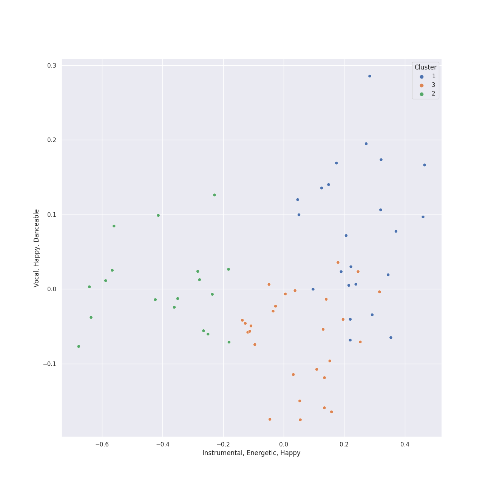

# Clusters in russian modern classical

## Cluster #1

23 tracks

| Art | Track | Album | Artists | Label | 💚 | 🔗 |
|:---|:---|:---|:---|:---|:---|:---|
|  | String Quartet No. 1 in C Major, Op. 49: IV. Allegro | Shostakovich: String Quartets Nos. 1, 4, 6, 8, 9 & 11 | Dmitri Shostakovich, [Jerusalem Quartet](../../../../artists/jerusalem_quartet/overview.md) | [harmonia mundi](../../../../labels/harmonia_mundi) | | [🔗](https://open.spotify.com/track/0nxe3lOpIX0rt3E9vcrRn5) |
|  | String Quartet No. 9 in E-Flat Major, Op. 117: III. Allegretto | Shostakovich: String Quartets Nos. 1, 4, 6, 8, 9 & 11 | Dmitri Shostakovich, [Jerusalem Quartet](../../../../artists/jerusalem_quartet/overview.md) | [harmonia mundi](../../../../labels/harmonia_mundi) | | [🔗](https://open.spotify.com/track/57vPVZyYD3Cfxlpmqqdgl5) |
|  | String Quartet No. 9 in E-Flat Major, Op. 117: V. Allegro | Shostakovich: String Quartets Nos. 1, 4, 6, 8, 9 & 11 | Dmitri Shostakovich, [Jerusalem Quartet](../../../../artists/jerusalem_quartet/overview.md) | [harmonia mundi](../../../../labels/harmonia_mundi) | | [🔗](https://open.spotify.com/track/6XOKaXhXamHmqSa38Uwf4A) |
|  | Le Sacre du Printemps - Revised version for Orchestra (published 1947) / Part 1: The Adoration of the Earth: Ritual of the Rival Tribes | Stravinsky: The Rite of Spring / Bartók: Concerto for Orchestra | Igor Stravinsky, [Berliner Philharmoniker](../../../../artists/berliner_philharmoniker/overview.md), [Herbert von Karajan](../../../../artists/herbert_von_karajan/overview.md) | [Deutsche Grammophon (DG)](../../../../labels/deutsche_grammophon__dg_) | | [🔗](https://open.spotify.com/track/6DmCs7oYITGEnfX7lsOe2O) |
|  | Le Sacre du Printemps - Revised version for Orchestra (published 1947) / Part 2: The Sacrifice: Glorification of the Chosen One | Stravinsky: The Rite of Spring / Bartók: Concerto for Orchestra | Igor Stravinsky, [Berliner Philharmoniker](../../../../artists/berliner_philharmoniker/overview.md), [Herbert von Karajan](../../../../artists/herbert_von_karajan/overview.md) | [Deutsche Grammophon (DG)](../../../../labels/deutsche_grammophon__dg_) | | [🔗](https://open.spotify.com/track/2l5yd2V024l1u6bJ2vmOFM) |
|  | Le Sacre du Printemps - Revised version for Orchestra (published 1947) / Part 2: The Sacrifice: Sacrificial Dance (The Chosen One) | Stravinsky: The Rite of Spring / Bartók: Concerto for Orchestra | Igor Stravinsky, [Berliner Philharmoniker](../../../../artists/berliner_philharmoniker/overview.md), [Herbert von Karajan](../../../../artists/herbert_von_karajan/overview.md) | [Deutsche Grammophon (DG)](../../../../labels/deutsche_grammophon__dg_) | | [🔗](https://open.spotify.com/track/5fZRthQhoZNiVDN8Sb6iIy) |
|  | Jeu de cartes: III. Third Deal | Stravinsky: Petrushka, Jeu de cartes | Igor Stravinsky, Valery Gergiev, Mariinsky Orchestra | [Mariinsky](../../../../labels/mariinsky) | | [🔗](https://open.spotify.com/track/1RmGFbd7C1jv5oBNRHX7cv) |
|  | Petrushka: First Scene: I. The Shrovetide Fair (Introduction) (1911 original version) | Stravinsky: Petrushka, Jeu de cartes | Igor Stravinsky, Valery Gergiev, Mariinsky Orchestra | [Mariinsky](../../../../labels/mariinsky) | | [🔗](https://open.spotify.com/track/0aRVTTqvik5P7H0WrUwIhu) |
|  | Petrushka: Fourth Scene: IV. The Gypsy Girls Dance (1911 original version) | Stravinsky: Petrushka, Jeu de cartes | Igor Stravinsky, Valery Gergiev, Mariinsky Orchestra | [Mariinsky](../../../../labels/mariinsky) | | [🔗](https://open.spotify.com/track/1AmGUA9QW34e9clnXYFdWn) |
|  | Petrushka: Fourth Scene: VI. The Mummers (1911 original version) | Stravinsky: Petrushka, Jeu de cartes | Igor Stravinsky, Valery Gergiev, Mariinsky Orchestra | [Mariinsky](../../../../labels/mariinsky) | | [🔗](https://open.spotify.com/track/31pNUdNPljYjMahrE35C8h) |
## Cluster #2

18 tracks

| Art | Track | Album | Artists | Label | 💚 | 🔗 |
|:---|:---|:---|:---|:---|:---|:---|
|  | String Quartet No. 1 in C Major, Op. 49: I. Moderato | Shostakovich: String Quartets Nos. 1, 4, 6, 8, 9 & 11 | Dmitri Shostakovich, [Jerusalem Quartet](../../../../artists/jerusalem_quartet/overview.md) | [harmonia mundi](../../../../labels/harmonia_mundi) | | [🔗](https://open.spotify.com/track/5VQz0yG8Lzvjj4RCbDLMrJ) |
|  | String Quartet No. 1 in C Major, Op. 49: II. Moderato | Shostakovich: String Quartets Nos. 1, 4, 6, 8, 9 & 11 | Dmitri Shostakovich, [Jerusalem Quartet](../../../../artists/jerusalem_quartet/overview.md) | [harmonia mundi](../../../../labels/harmonia_mundi) | | [🔗](https://open.spotify.com/track/0A5oxICmtISYvCLCKY5BZs) |
|  | String Quartet No. 1 in C Major, Op. 49: III. Allegro molto | Shostakovich: String Quartets Nos. 1, 4, 6, 8, 9 & 11 | Dmitri Shostakovich, [Jerusalem Quartet](../../../../artists/jerusalem_quartet/overview.md) | [harmonia mundi](../../../../labels/harmonia_mundi) | | [🔗](https://open.spotify.com/track/5O8Iz6Mlz4oS0DP6YYyBQC) |
|  | String Quartet No. 6 in G Major, Op. 101: II. Moderato con moto | Shostakovich: String Quartets Nos. 1, 4, 6, 8, 9 & 11 | Dmitri Shostakovich, [Jerusalem Quartet](../../../../artists/jerusalem_quartet/overview.md) | [harmonia mundi](../../../../labels/harmonia_mundi) | | [🔗](https://open.spotify.com/track/5BqEbEtqCpIrKRJh5c3Z3u) |
|  | String Quartet No. 8 in C Minor, Op. 110: I. Largo | Shostakovich: String Quartets Nos. 1, 4, 6, 8, 9 & 11 | Dmitri Shostakovich, [Jerusalem Quartet](../../../../artists/jerusalem_quartet/overview.md) | [harmonia mundi](../../../../labels/harmonia_mundi) | | [🔗](https://open.spotify.com/track/2wtSkXod5g0Ms9h9Amd9FD) |
|  | String Quartet No. 8 in C Minor, Op. 110: V. Largo | Shostakovich: String Quartets Nos. 1, 4, 6, 8, 9 & 11 | Dmitri Shostakovich, [Jerusalem Quartet](../../../../artists/jerusalem_quartet/overview.md) | [harmonia mundi](../../../../labels/harmonia_mundi) | | [🔗](https://open.spotify.com/track/7I1ePDRDp8RvVv9lPU5wHi) |
|  | String Quartet No. 9 in E-Flat Major, Op. 117: IV. Adagio | Shostakovich: String Quartets Nos. 1, 4, 6, 8, 9 & 11 | Dmitri Shostakovich, [Jerusalem Quartet](../../../../artists/jerusalem_quartet/overview.md) | [harmonia mundi](../../../../labels/harmonia_mundi) | | [🔗](https://open.spotify.com/track/0vpGcgNCl9p9UQdtCOajUG) |
|  | String Quartet No.11 in F Minor, Op. 122: I. Introduction (Andantino) | Shostakovich: String Quartets Nos. 1, 4, 6, 8, 9 & 11 | Dmitri Shostakovich, [Jerusalem Quartet](../../../../artists/jerusalem_quartet/overview.md) | [harmonia mundi](../../../../labels/harmonia_mundi) | | [🔗](https://open.spotify.com/track/4tcinhmPDuyaskdPrqjWB9) |
|  | Le Sacre du Printemps - Revised version for Orchestra (published 1947) / Part 2: The Sacrifice: Introduction | Stravinsky: The Rite of Spring / Bartók: Concerto for Orchestra | Igor Stravinsky, [Berliner Philharmoniker](../../../../artists/berliner_philharmoniker/overview.md), [Herbert von Karajan](../../../../artists/herbert_von_karajan/overview.md) | [Deutsche Grammophon (DG)](../../../../labels/deutsche_grammophon__dg_) | | [🔗](https://open.spotify.com/track/6GS9MQgfnbFp3yPL2uNAF8) |
|  | The Firebird (L'oiseau De Feu) - Suite (1919): Round Dance Of The Princesses | Stravinsky: The Firebird (Ballet Suite) | Igor Stravinsky, Orchestre de l'Opéra National de Paris, Myung-Whun Chung | [Deutsche Grammophon (DG)](../../../../labels/deutsche_grammophon__dg_) | | [🔗](https://open.spotify.com/track/1Rw7bVTccLKHQyqlqqmRLx) |
## Cluster #3

27 tracks

| Art | Track | Album | Artists | Label | 💚 | 🔗 |
|:---|:---|:---|:---|:---|:---|:---|
|  | String Quartet No. 4 in D Major, Op. 83: I. Allegretto | Shostakovich: String Quartets Nos. 1, 4, 6, 8, 9 & 11 | Dmitri Shostakovich, [Jerusalem Quartet](../../../../artists/jerusalem_quartet/overview.md) | [harmonia mundi](../../../../labels/harmonia_mundi) | | [🔗](https://open.spotify.com/track/2ESTZJCtAtRNts4sKVVTsl) |
|  | String Quartet No. 8 in C Minor, Op. 110: IV. Largo | Shostakovich: String Quartets Nos. 1, 4, 6, 8, 9 & 11 | Dmitri Shostakovich, [Jerusalem Quartet](../../../../artists/jerusalem_quartet/overview.md) | [harmonia mundi](../../../../labels/harmonia_mundi) | | [🔗](https://open.spotify.com/track/0axYJ2DSUKXkL67CnUDN3t) |
|  | String Quartet No. 9 in E-Flat Major, Op. 117: I. Moderato Con Moto | Shostakovich: String Quartets Nos. 1, 4, 6, 8, 9 & 11 | Dmitri Shostakovich, [Jerusalem Quartet](../../../../artists/jerusalem_quartet/overview.md) | [harmonia mundi](../../../../labels/harmonia_mundi) | | [🔗](https://open.spotify.com/track/7c1PZ3jfMdI65Oqn1uI74j) |
|  | Le Sacre du Printemps - Revised version for Orchestra (published 1947) / Part 1: The Adoration of the Earth: Introduction | Stravinsky: The Rite of Spring / Bartók: Concerto for Orchestra | Igor Stravinsky, [Berliner Philharmoniker](../../../../artists/berliner_philharmoniker/overview.md), [Herbert von Karajan](../../../../artists/herbert_von_karajan/overview.md) | [Deutsche Grammophon (DG)](../../../../labels/deutsche_grammophon__dg_) | | [🔗](https://open.spotify.com/track/1tETD10MgBqYpqjlFdgH2W) |
|  | Le Sacre du Printemps - Revised version for Orchestra (published 1947) / Part 1: The Adoration of the Earth: Spring Rounds | Stravinsky: The Rite of Spring / Bartók: Concerto for Orchestra | Igor Stravinsky, [Berliner Philharmoniker](../../../../artists/berliner_philharmoniker/overview.md), [Herbert von Karajan](../../../../artists/herbert_von_karajan/overview.md) | [Deutsche Grammophon (DG)](../../../../labels/deutsche_grammophon__dg_) | | [🔗](https://open.spotify.com/track/04l27PkpdTLSNXE1ZHtlkA) |
|  | The Firebird (L'oiseau De Feu) - Suite (1919): Berceuse | Stravinsky: The Firebird (Ballet Suite) | Igor Stravinsky, Orchestre de l'Opéra National de Paris, Myung-Whun Chung | [Deutsche Grammophon (DG)](../../../../labels/deutsche_grammophon__dg_) | | [🔗](https://open.spotify.com/track/6agLQb3hx6ATw3161GTuwZ) |
|  | The Firebird (L'oiseau De Feu) - Suite (1919): Introduction | Stravinsky: The Firebird (Ballet Suite) | Igor Stravinsky, Orchestre de l'Opéra National de Paris, Myung-Whun Chung | [Deutsche Grammophon (DG)](../../../../labels/deutsche_grammophon__dg_) | | [🔗](https://open.spotify.com/track/2UWqLhazLDNaSK6PlgMhXc) |
|  | Petrushka: Second Scene: I. Petrushka's Cell (1911 original version) | Stravinsky: Petrushka, Jeu de cartes | Igor Stravinsky, Valery Gergiev, Mariinsky Orchestra | [Mariinsky](../../../../labels/mariinsky) | | [🔗](https://open.spotify.com/track/6g0qWuKnsE1js5mo4HAigx) |
|  | Petrushka: Third Scene: I. The Moor's Cell (1911 original version) | Stravinsky: Petrushka, Jeu de cartes | Igor Stravinsky, Valery Gergiev, Mariinsky Orchestra | [Mariinsky](../../../../labels/mariinsky) | | [🔗](https://open.spotify.com/track/0PFEP4Rom9u9D9kA8yTkYQ) |
|  | Petrushka: Third Scene: III. Waltz (The Ballerina and the Moor) (1911 original version) | Stravinsky: Petrushka, Jeu de cartes | Igor Stravinsky, Valery Gergiev, Mariinsky Orchestra | [Mariinsky](../../../../labels/mariinsky) | | [🔗](https://open.spotify.com/track/5Nz0PKTW9OgraAtvjYJvO9) |