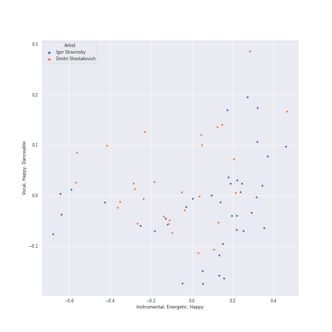
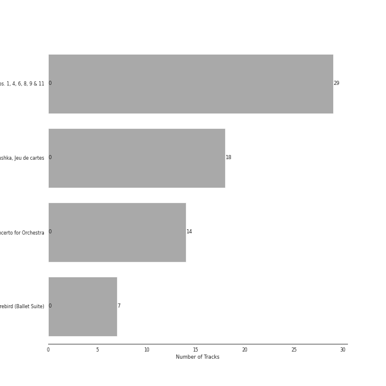
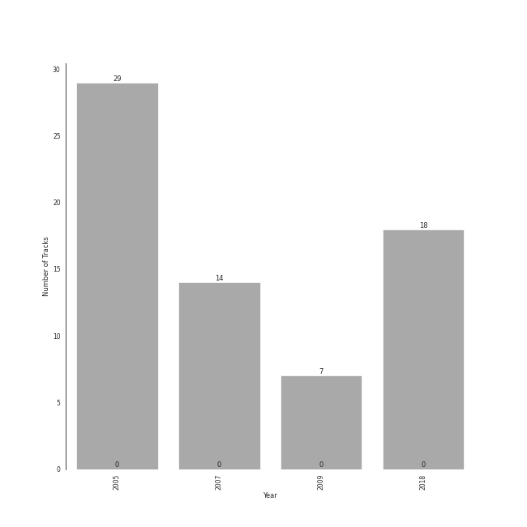

# russian modern classical

68 songs

[See Track Features](audio_features.md)

[See Clusters](clusters/overview.md)

## Top Artists

| Art | Rank | Tracks | 💚 | Artist | 🔗 |
|:---|---:|---:|---:|:---|:---|
|  | 410 | 39 | 0 | Igor Stravinsky | [🔗](https://open.spotify.com/artist/7ie36YytMoKtPiL7tUvmoE) |
|  | 141 | 29 | 0 | [Jerusalem Quartet](../../artists/jerusalem_quartet/overview.md) | [🔗](https://open.spotify.com/artist/7AnE8Jpu1vxLeXcs6OKYHE) |
|  | 282 | 29 | 0 | Dmitri Shostakovich | [🔗](https://open.spotify.com/artist/6s1pCNXcbdtQJlsnM1hRIA) |
|  | 410 | 18 | 0 | Mariinsky Orchestra | [🔗](https://open.spotify.com/artist/2rRUfv2w535SEUV1YO5SP6) |
|  | 410 | 18 | 0 | Valery Gergiev | [🔗](https://open.spotify.com/artist/2LxnoYPOe0FCLC82R3xgO2) |
|  | 410 | 14 | 0 | [Berliner Philharmoniker](../../artists/berliner_philharmoniker/overview.md) | [🔗](https://open.spotify.com/artist/6uRJnvQ3f8whVnmeoecv5Z) |
|  | 410 | 14 | 0 | [Herbert von Karajan](../../artists/herbert_von_karajan/overview.md) | [🔗](https://open.spotify.com/artist/5zCaQxjl110XTrm4LQ1CxY) |
|  | 410 | 7 | 0 | Myung-Whun Chung | [🔗](https://open.spotify.com/artist/4hdiwtmc6OEFFxpSlwwmby) |
|  | 410 | 7 | 0 | Orchestre de l'Opéra National de Paris | [🔗](https://open.spotify.com/artist/1hro5WQTcOb7fRCEUQEZtK) |

## Most and least listened tracks
| Rank | ​ | Most listened tracks | Rank | ​​ | Least listened tracks |
|---:|:---|:---|---:|:---|:---|
| 501 |  | String Quartet No. 9 in E-Flat Major, Op. 117: III. Allegretto | 900 |  | String Quartet No. 9 in E-Flat Major, Op. 117: I. Moderato Con Moto |
| 900 |  | Jeu de cartes: II. Second Deal | 900 |  | String Quartet No. 8 in C Minor, Op. 110: V. Largo |
| 900 |  | String Quartet No. 6 in G Major, Op. 101: III. Lento | 900 |  | String Quartet No.11 in F Minor, Op. 122: VII. Finale (Moderato) |
| 900 |  | String Quartet No.11 in F Minor, Op. 122: III. Récitatif (Adagio) | 900 |  | Petrushka: Second Scene: I. Petrushka's Cell (1911 original version) |
| 900 |  | The Rite of Spring, K15, Pt. 1: IV. Spring Rounds | 900 |  | The Firebird (L'oiseau De Feu) - Suite (1919): Berceuse |
| 900 |  | String Quartet No. 1 in C Major, Op. 49: II. Moderato | 900 |  | String Quartet No. 9 in E-Flat Major, Op. 117: V. Allegro |
| 900 |  | Petrushka: Third Scene: I. The Moor's Cell (1911 original version) | 900 |  | The Rite of Spring, K15, Pt. 1: VIII. Dance of the Earth |
| 900 |  | Petrushka: First Scene: I. The Shrovetide Fair (Introduction) (1911 original version) | 900 |  | The Rite of Spring, K15, Pt. 2: IX. Introduction |
| 900 |  | String Quartet No. 8 in C Minor, Op. 110: IV. Largo | 900 |  | The Rite of Spring, K15, Pt. 1: V. Games of the Rival Tribes |
| 900 |  | Petrushka: Fourth Scene: V. Dance of the Coachmen and Grooms (1911 original version) | 900 |  | Petrushka: Fourth Scene: VII. Petrushka's Death (1911 original version) |

## Top Albums

| Art | Rank | Tracks | 💚 | Album | Release Date | 🔗 |
|:---|---:|---:|---:|:---|:---|:---|
|  | 347 | 29 | 0 | Shostakovich: String Quartets Nos. 1, 4, 6, 8, 9 & 11 | 2005 | [🔗](https://open.spotify.com/album/4V2YVRjysd08RF0GLRDDK7) |
|  | 603 | 18 | 0 | Stravinsky: Petrushka, Jeu de cartes | 2018-10-19 | [🔗](https://open.spotify.com/album/19fQbFNjlfXgBAFqftKzWA) |
|  | 603 | 14 | 0 | Stravinsky: The Rite of Spring / Bartók: Concerto for Orchestra | 2007-01-01 | [🔗](https://open.spotify.com/album/317b74rpNBO2uhaJFyMaxJ) |
|  | 603 | 7 | 0 | Stravinsky: The Firebird (Ballet Suite) | 2009-01-01 | [🔗](https://open.spotify.com/album/2q1xMRl4AcA7rI8GfGnmvD) |

## Top Record Labels

| Tracks | 💚 | Label |
|---:|---:|:---|
| 29 | 0 | [harmonia mundi](../../labels/harmonia_mundi/overview.md) |
| 21 | 0 | [Deutsche Grammophon (DG)](../../labels/deutsche_grammophon_(dg)/overview.md) |
| 18 | 0 | [Mariinsky](../../labels/mariinsky/overview.md) |

## Years

| ​ | 10 newest albums | ​​ | 10 oldest albums |
|:---|:---|:---|:---|
|  | Stravinsky: Petrushka, Jeu de cartes (2018-10-19) |  | Shostakovich: String Quartets Nos. 1, 4, 6, 8, 9 & 11 (2005) |
|  | Stravinsky: The Firebird (Ballet Suite) (2009-01-01) |  | Stravinsky: The Rite of Spring / Bartók: Concerto for Orchestra (2007-01-01) |
|  | Stravinsky: The Rite of Spring / Bartók: Concerto for Orchestra (2007-01-01) |  | Stravinsky: The Firebird (Ballet Suite) (2009-01-01) |
|  | Shostakovich: String Quartets Nos. 1, 4, 6, 8, 9 & 11 (2005) |  | Stravinsky: Petrushka, Jeu de cartes (2018-10-19) |

