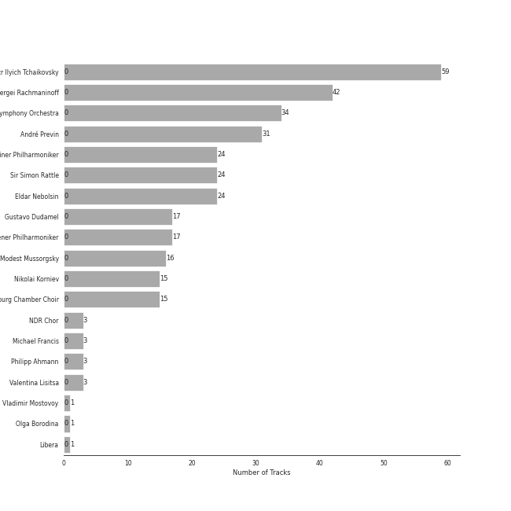
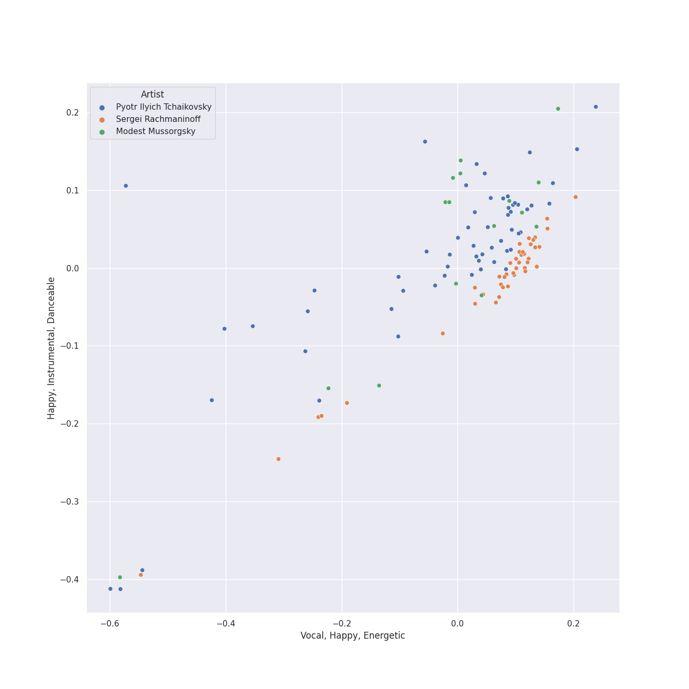
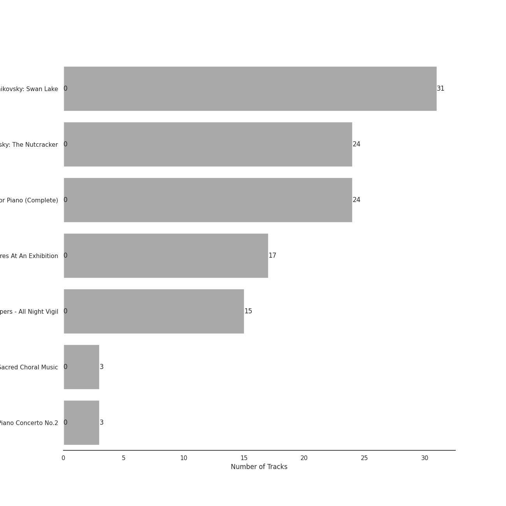
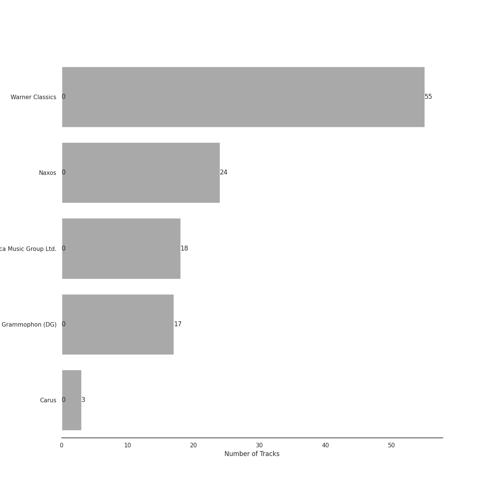

# russian romanticism

[117 songs](russian_romanticism_tracks.md)

## Top Artists

See all 19 artists

| Number of Tracks | Art | Artist | 🔗 |
|---:|:---|:---|:---|
| 59 |  | [Pyotr Ilyich Tchaikovsky](../artists/pyotr_ilyich_tchaikovsky.md) | [🔗](https://open.spotify.com/artist/3MKCzCnpzw3TjUYs2v7vDA) |
| 42 |  | [Sergei Rachmaninoff](../artists/sergei_rachmaninoff.md) | [🔗](https://open.spotify.com/artist/0Kekt6CKSo0m5mivKcoH51) |
| 34 |  | [London Symphony Orchestra](../artists/london_symphony_orchestra.md) | [🔗](https://open.spotify.com/artist/5yxyJsFanEAuwSM5kOuZKc) |
| 31 |  | [André Previn](../artists/andr__previn.md) | [🔗](https://open.spotify.com/artist/2tfWguHr2nj4e8KXLKciVq) |
| 24 |  | [Berliner Philharmoniker](../artists/berliner_philharmoniker.md) | [🔗](https://open.spotify.com/artist/6uRJnvQ3f8whVnmeoecv5Z) |
| 24 |  | [Sir Simon Rattle](../artists/sir_simon_rattle.md) | [🔗](https://open.spotify.com/artist/4GQwgdcDQwqtcHICjUNndp) |
| 24 |  | [Eldar Nebolsin](../artists/eldar_nebolsin.md) | [🔗](https://open.spotify.com/artist/45ts2AJTWlzJ9JrQlCGxpX) |
| 17 |  | [Gustavo Dudamel](../artists/gustavo_dudamel.md) | [🔗](https://open.spotify.com/artist/0cxXnDhpgxcMMkKddhORHY) |
| 17 |  | [Wiener Philharmoniker](../artists/wiener_philharmoniker.md) | [🔗](https://open.spotify.com/artist/003f4bk13c6Q3gAUXv7dGJ) |
| 16 |  | [Modest Mussorgsky](../artists/modest_mussorgsky.md) | [🔗](https://open.spotify.com/artist/284mnx33IWcymQEpMxyfHl) |
| 15 |  | [Nikolai Korniev](../artists/nikolai_korniev.md) | [🔗](https://open.spotify.com/artist/70hS9SnJefkZo2QJwS2VXi) |
| 15 |  | [St.Petersburg Chamber Choir](../artists/st_petersburg_chamber_choir.md) | [🔗](https://open.spotify.com/artist/46WjEugfIF0rKOewvFiby2) |
| 3 |  | NDR Chor | [🔗](https://open.spotify.com/artist/7hMAA1N5j1Ynb49NIWO7HV) |
| 3 |  | Michael Francis | [🔗](https://open.spotify.com/artist/4znpeZQkiPbcXtHlRbfTqF) |
| 3 |  | Philipp Ahmann | [🔗](https://open.spotify.com/artist/309coOGhdzqXdIRwJH1xUo) |
| 3 |  | Valentina Lisitsa | [🔗](https://open.spotify.com/artist/0gOrXuu1vCBXe3pwTyb5Ca) |
| 1 |  | Vladimir Mostovoy | [🔗](https://open.spotify.com/artist/4BTanscTBWJOSpvceZSVSi) |
| 1 |  | Olga Borodina | [🔗](https://open.spotify.com/artist/47XbXbNzwqcWStfsjzFlKb) |
| 1 |  | Libera | [🔗](https://open.spotify.com/artist/235C4ktJ2aGIyqaBlXyg7e) |

## Top Albums

See all 7 albums

| Number of Tracks | Art | Album | Release Date | 🔗 |
|---:|:---|:---|:---|:---|
| 31 |  | Tchaikovsky: Swan Lake | 1976 | [🔗](https://open.spotify.com/album/7dVA06E7AP7P7VzPyNxQVO) |
| 24 |  | Tchaikovsky: The Nutcracker | 2010-10-11 | [🔗](https://open.spotify.com/album/54Awn36ryf55PkZyOR4iwQ) |
| 24 |  | Rachmaninov: Preludes for Piano (Complete) | 2007-05-29 | [🔗](https://open.spotify.com/album/1vlnwUAidj7bEmRhsq4zTv) |
| 17 |  | Mussorgsky: Pictures At An Exhibition | 2016-12-02 | [🔗](https://open.spotify.com/album/1b2aoeaYZZBWmJoavOQhnd) |
| 15 |  | Rachmaninov: Vespers - All Night Vigil | 1994 | [🔗](https://open.spotify.com/album/7hqotgNjEJt09XiggaMI1v) |
| 3 |  | Tchaikovsky: Sacred Choral Music | 2016-07-01 | [🔗](https://open.spotify.com/album/4udN7bCLaa8zCnaIvoxzOB) |
| 3 |  | Rachmaninov: Piano Concerto No.2 | 2012-01-01 | [🔗](https://open.spotify.com/album/5lVqgXqdoIH3W1wUM2hzPx) |

## Top Record Labels

See all 5 labels

| Number of Tracks | Label |
|---:|:---|
| 55 | [Warner Classics](../labels/warner_classics.md) |
| 24 | [Naxos](../labels/naxos.md) |
| 18 | [Decca Music Group Ltd.](../labels/decca_music_group_ltd_.md) |
| 17 | [Deutsche Grammophon (DG)](../labels/deutsche_grammophon__dg_.md) |
| 3 | Carus |

## Audio Features

| 10 most Danceable tracks | 10 least Danceable tracks |
|:---|:---|
| Pictures at an Exhibition (Orch. Ravel): V. Ballet of the Unhatched Chicks (0.571) | Vespers, Op. 37: XII. "Slava v vyshnikh Bogu" (0.0636) |
| Pictures at an Exhibition (Orch. Ravel): Promenade III (0.543) | Pictures at an Exhibition (Orch. Ravel): II. The Old Castle (0.0799) |
| Tchaikovsky: Swan Lake, Op. 20, Act I: No. 8, Dance with Goblets (0.534) | Vespers, Op. 37: V. "Nyne otpushchayeshi" (0.0806) |
| Pictures at an Exhibition (Orch. Ravel): VII. The Market at Limoges (0.48) | Tchaikovsky: Swan Lake, Op. 20, Act II: No. 14, Scene. Moderato (0.0958) |
| Tchaikovsky: Swan Lake, Op. 20, Act IV: No. 26, Scene. Allegro ma non troppo (0.472) | Vespers, Op. 37: IV. "Svete tikhyi" (0.103) |
| Tchaikovsky: The Nutcracker, Op. 71, Act II: No. 12e, Divertissement. Dance of the Reed-Flutes (0.462) | Vespers, Op. 37: XIV. "Voskrez iz groba" (0.104) |
| Tchaikovsky: The Nutcracker, Op. 71, Act II: No. 12c, Divertissement. Tea, Chinese Dance (0.451) | Vespers, Op. 37: II. "Blagoslovi dushe moya" (0.108) |
| Tchaikovsky: The Nutcracker, Op. 71, Act I, Scene 1: No. 2, March (0.444) | Tchaikovsky: The Nutcracker, Op. 71, Act II: No. 10, The Enchanted Palace of Confiturembourg, the Kingdom of Sweets (0.124) |
| 13 Preludes, Op. 32: No. 3 in E Major: Allegro vivace (0.437) | Vespers, Op. 37: VI. "Bogoroditse Devo" (0.129) |
| 13 Preludes, Op. 32: No. 8 in A Minor: Vivo (0.428) | Tchaikovsky: The Nutcracker, Op. 71, Act II: No. 12b, Divertissement. Coffee, Arabian Dance (0.13) |

| 10 most Energetic tracks | 10 least Energetic tracks |
|:---|:---|
| Tchaikovsky: The Nutcracker, Op. 71, Act II: No. 12d, Divertissement. Trepak, Russian Dance (0.5) | Pictures at an Exhibition (Orch. Ravel): VIIIa. Catacombae (Sepulchrum Romanum) (0.000845) |
| Vespers, Op. 37: XV. "Vzbrannoy voevode" (0.488) | Pictures at an Exhibition (Orch. Ravel): Promenade II (0.00371) |
| Tchaikovsky: Swan Lake, Op. 20, Act III: No. 15, Scene. March - Allegro giusto (0.474) | Tchaikovsky: The Nutcracker, Op. 71, Act II: No. 12b, Divertissement. Coffee, Arabian Dance (0.00478) |
| Tchaikovsky: Swan Lake, Op. 20, Act I: No. 8, Dance with Goblets (0.391) | Tchaikovsky: Swan Lake, Op. 20, Act IV: No. 25, Entr'acte (0.00606) |
| Tchaikovsky: The Nutcracker, Op. 71, Act I, Scene 1: No. 7, The Battle (0.386) | 10 Preludes, Op. 23: No. 10 in G-Flat Major: Largo (0.00644) |
| Tchaikovsky: Swan Lake, Op. 20, Act IV: No. 29, Finale (0.35) | Pictures at an Exhibition (Orch. Ravel): II. The Old Castle (0.00788) |
| Tchaikovsky: The Nutcracker, Op. 71, Act II: No. 12f, Divertissement. Mother Gigogne and the Clowns (0.348) | Pictures at an Exhibition (Orch. Ravel): VIIIb. Cum mortuis in lingua mortua (0.00794) |
| Pictures at an Exhibition (Orch. Ravel): VII. The Market at Limoges (0.322) | 13 Preludes, Op. 32: No. 5 in G Major: Moderato (0.00941) |
| Tchaikovsky: Swan Lake, Op. 20, Act III: No. 23, Mazurka (0.315) | Tchaikovsky: Swan Lake, Op. 20, Act I: No. 7, Sujet (0.00979) |
| Tchaikovsky: Swan Lake, Op. 20, Act I: Introduction - No. 1, Scene. Allegro giusto (0.298) | 13 Preludes, Op. 32: No. 7 in F Major: Moderato (0.0106) |

| 10 most Speechy tracks | 10 least Speechy tracks |
|:---|:---|
| Tchaikovsky: Swan Lake, Op. 20, Act III: No. 22, Neapolitan Dance (0.0675) | 13 Preludes, Op. 32: No. 6 in F Minor: Allegro appassionato (0.0304) |
| Tchaikovsky: The Nutcracker, Op. 71, Act I, Scene 1: No. 7, The Battle (0.0664) | Pictures at an Exhibition (Orch. Ravel): IV. Bydlo (0.0311) |
| 10 Preludes, Op. 23: No. 1 in F-Sharp Minor: Largo (0.0614) | 10 Preludes, Op. 23: No. 7 in C Minor: Allegro (0.0312) |
| Morceaux de fantaisie, Op. 3: No. 2, Prelude in C-Sharp Minor (0.0594) | 10 Preludes, Op. 23: No. 2 in B-Flat Major: Maestoso (0.0327) |
| 13 Preludes, Op. 32: No. 11 in B Major: Allegretto (0.0592) | Tchaikovsky: The Nutcracker, Op. 71, Act II: No. 14b, Pas de deux. Variation I "Tarantella" (0.0332) |
| Tchaikovsky: Swan Lake, Op. 20, Act I: No. 3, Scene. Allegro moderato (0.0573) | 10 Preludes, Op. 23: No. 6 in E-Flat Major: Andante (0.0333) |
| Pictures at an Exhibition (Orch. Ravel): I. Gnomus (0.0571) | Piano Concerto No. 2 in C Minor, Op. 18: 3. Allegro scherzando (0.0336) |
| Tchaikovsky: Swan Lake, Op. 20, Act I: No. 5, Pas de deux for Two Merry-Makers (0.0555) | Tchaikovsky: The Nutcracker, Op. 71, Act II: No. 12c, Divertissement. Tea, Chinese Dance (0.0338) |
| 13 Preludes, Op. 32: No. 10 in B Minor: Lento (0.0535) | 10 Preludes, Op. 23: No. 3 in D Minor: Tempo di minuetto (0.034) |
| Pictures at an Exhibition (Orch. Ravel): V. Ballet of the Unhatched Chicks (0.0532) | Tchaikovsky: Swan Lake, Op. 20, Act III: No. 18, Scene. Allegro - Allegro giusto (0.034) |

| 10 most Acoustic tracks | 10 least Acoustic tracks |
|:---|:---|
| Vespers, Op. 37: VIII. "Kvalite imya Gospodne" (0.995) | Tchaikovsky: The Nutcracker, Op. 71, Act II: No. 12a, Divertissement. Chocolate, Spanish Dance (0.583) |
| 13 Preludes, Op. 32: No. 10 in B Minor: Lento (0.995) | Tchaikovsky: Swan Lake, Op. 20, Act I: No. 8, Dance with Goblets (0.813) |
| 9 Sacred Pieces, TH 78: No. 3, Cherubic Hymn No. 3 (0.995) | Tchaikovsky: Swan Lake, Op. 20, Act III: No. 23, Mazurka (0.834) |
| Vespers, Op. 37: XV. "Vzbrannoy voevode" (0.995) | Tchaikovsky: The Nutcracker, Op. 71, Act II: No. 14d, Pas de deux. Coda (0.864) |
| 13 Preludes, Op. 32: No. 7 in F Major: Moderato (0.995) | Tchaikovsky: The Nutcracker, Op. 71, Act II: No. 12f, Divertissement. Mother Gigogne and the Clowns (0.869) |
| Vespers, Op. 37: I. "Priidite, poklonimsya" (0.995) | Tchaikovsky: The Nutcracker, Op. 71, Act II: No. 15, Final Waltz and Apotheosis (0.88) |
| 10 Preludes, Op. 23: No. 1 in F-Sharp Minor: Largo (0.995) | Tchaikovsky: Swan Lake, Op. 20, Act I: No. 9, Finale. Andante (0.887) |
| 13 Preludes, Op. 32: No. 5 in G Major: Moderato (0.995) | Tchaikovsky: Swan Lake, Op. 20, Act IV: No. 29, Finale (0.888) |
| 13 Preludes, Op. 32: No. 2 in B-Flat Minor: Allegretto (0.995) | Tchaikovsky: Swan Lake, Op. 20, Act III: No. 21, Spanish Dance (0.89) |
| 10 Preludes, Op. 23: No. 10 in G-Flat Major: Largo (0.995) | Tchaikovsky: The Nutcracker, Op. 71, Act I, Scene 1: No. 3, Children's Galop and Entry of the Parents (0.901) |

| 10 most Instrumental tracks | 10 least Instrumental tracks |
|:---|:---|
| Pictures at an Exhibition (Orch. Ravel): IV. Bydlo (0.983) | 9 Sacred Pieces, TH 78: No. 1, Cherubic Hymn No. 1 (0.00449) |
| Vespers, Op. 37: XIV. "Voskrez iz groba" (0.98) | 9 Sacred Pieces, TH 78: No. 2, Cherubic Hymn No. 2 (0.00769) |
| Vespers, Op. 37: VI. "Bogoroditse Devo" (0.979) | 9 Sacred Pieces, TH 78: No. 3, Cherubic Hymn No. 3 (0.0469) |
| Tchaikovsky: Swan Lake, Op. 20, Act IV: No. 26, Scene. Allegro ma non troppo (0.978) | Pictures at an Exhibition (Orch. Ravel): VIIIa. Catacombae (Sepulchrum Romanum) (0.0557) |
| Pictures at an Exhibition (Orch. Ravel): Promenade I (0.962) | Vespers, Op. 37: II. "Blagoslovi dushe moya" (0.0731) |
| Tchaikovsky: The Nutcracker, Op. 71, Act II: No. 14a, Pas de deux. Andante maestoso (0.954) | Tchaikovsky: The Nutcracker, Op. 71, Act II: No. 12a, Divertissement. Chocolate, Spanish Dance (0.154) |
| Pictures at an Exhibition (Orch. Ravel): VIIIb. Cum mortuis in lingua mortua (0.95) | Tchaikovsky: Swan Lake, Op. 20, Act III: No. 21, Spanish Dance (0.213) |
| Pictures at an Exhibition (Orch. Ravel): VII. The Market at Limoges (0.948) | Vespers, Op. 37: XV. "Vzbrannoy voevode" (0.26) |
| Piano Concerto No. 2 in C Minor, Op. 18: 2. Adagio sostenuto (0.945) | Tchaikovsky: Swan Lake, Op. 20, Act III: No. 23, Mazurka (0.282) |
| Tchaikovsky: The Nutcracker, Op. 71, Act II: No. 15, Final Waltz and Apotheosis (0.944) | Tchaikovsky: The Nutcracker, Op. 71, Act I, Scene 1: No. 3, Children's Galop and Entry of the Parents (0.297) |

| 10 most Live tracks | 10 least Live tracks |
|:---|:---|
| Pictures at an Exhibition (Orch. Ravel): VIIIb. Cum mortuis in lingua mortua (0.767) | 13 Preludes, Op. 32: No. 7 in F Major: Moderato (0.0533) |
| Pictures at an Exhibition (Orch. Ravel): IX. The Hut on Chicken's Legs (0.689) | Piano Concerto No. 2 in C Minor, Op. 18: 2. Adagio sostenuto (0.0551) |
| Pictures at an Exhibition (Orch. Ravel): VII. The Market at Limoges (0.65) | Tchaikovsky: The Nutcracker, Op. 71: Miniature Overture (0.0557) |
| Pictures at an Exhibition (Orch. Ravel): I. Gnomus (0.648) | 9 Sacred Pieces, TH 78: No. 2, Cherubic Hymn No. 2 (0.0575) |
| Night on Bald Mountain (0.628) | Tchaikovsky: Swan Lake, Op. 20, Act I: No. 4, Pas de trois (0.0595) |
| Tchaikovsky: The Nutcracker, Op. 71, Act I, Scene 1: No. 3, Children's Galop and Entry of the Parents (0.578) | 13 Preludes, Op. 32: No. 8 in A Minor: Vivo (0.0631) |
| Tchaikovsky: Swan Lake, Op. 20, Act III: No. 18, Scene. Allegro - Allegro giusto (0.565) | Pictures at an Exhibition (Orch. Ravel): Promenade IV (0.0644) |
| Tchaikovsky: Swan Lake, Op. 20, Act II: No. 11, Scene. Allegro moderato - Moderato - Allegro vivo (0.486) | Piano Concerto No. 2 in C Minor, Op. 18: 1. Moderato (0.0646) |
| Tchaikovsky: Swan Lake, Op. 20, Act III, Appendix II: No. 20a, Russian Dance (0.421) | Vespers, Op. 37: II. "Blagoslovi dushe moya" (0.0651) |
| Pictures at an Exhibition (Orch. Ravel): VI. Samuel Goldenberg und Schmuÿle (0.386) | Vespers, Op. 37: XII. "Slava v vyshnikh Bogu" (0.0666) |

| 10 most Happy tracks | 10 least Happy tracks |
|:---|:---|
| Tchaikovsky: The Nutcracker, Op. 71, Act II: No. 12a, Divertissement. Chocolate, Spanish Dance (0.879) | Vespers, Op. 37: IV. "Svete tikhyi" (0.0331) |
| Pictures at an Exhibition (Orch. Ravel): V. Ballet of the Unhatched Chicks (0.869) | Pictures at an Exhibition (Orch. Ravel): II. The Old Castle (0.0345) |
| Tchaikovsky: The Nutcracker, Op. 71, Act II: No. 12d, Divertissement. Trepak, Russian Dance (0.851) | Vespers, Op. 37: VI. "Bogoroditse Devo" (0.035) |
| Tchaikovsky: The Nutcracker, Op. 71, Act II: No. 12c, Divertissement. Tea, Chinese Dance (0.832) | Vespers, Op. 37: II. "Blagoslovi dushe moya" (0.0359) |
| Tchaikovsky: Swan Lake, Op. 20, Act III: No. 22, Neapolitan Dance (0.641) | Vespers, Op. 37: XIV. "Voskrez iz groba" (0.0368) |
| Tchaikovsky: The Nutcracker, Op. 71, Act I, Scene 1: No. 3, Children's Galop and Entry of the Parents (0.639) | Tchaikovsky: The Nutcracker, Op. 71, Act II: No. 12b, Divertissement. Coffee, Arabian Dance (0.037) |
| Tchaikovsky: The Nutcracker, Op. 71, Act II: No. 12f, Divertissement. Mother Gigogne and the Clowns (0.597) | 9 Sacred Pieces, TH 78: No. 3, Cherubic Hymn No. 3 (0.0372) |
| Tchaikovsky: Swan Lake, Op. 20, Act III: No. 15, Scene. March - Allegro giusto (0.579) | 9 Sacred Pieces, TH 78: No. 2, Cherubic Hymn No. 2 (0.0373) |
| Pictures at an Exhibition (Orch. Ravel): VII. The Market at Limoges (0.536) | Vespers, Op. 37: XIII. "Dnes spaseniye" (0.0374) |
| Tchaikovsky: The Nutcracker, Op. 71, Act II: No. 14b, Pas de deux. Variation I "Tarantella" (0.524) | 13 Preludes, Op. 32: No. 10 in B Minor: Lento (0.0374) |
